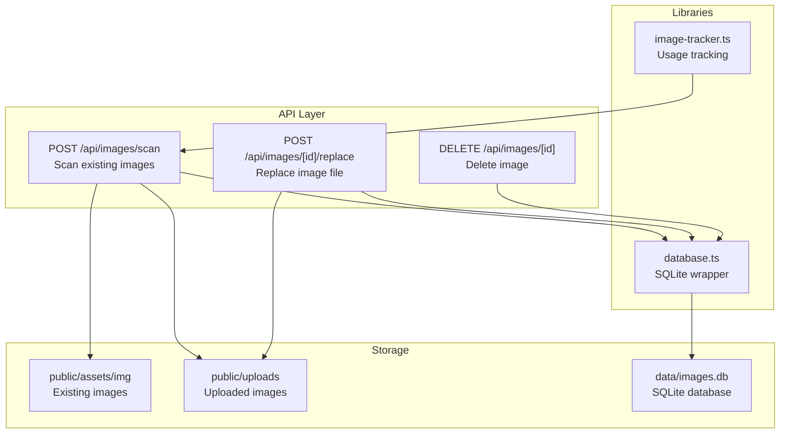
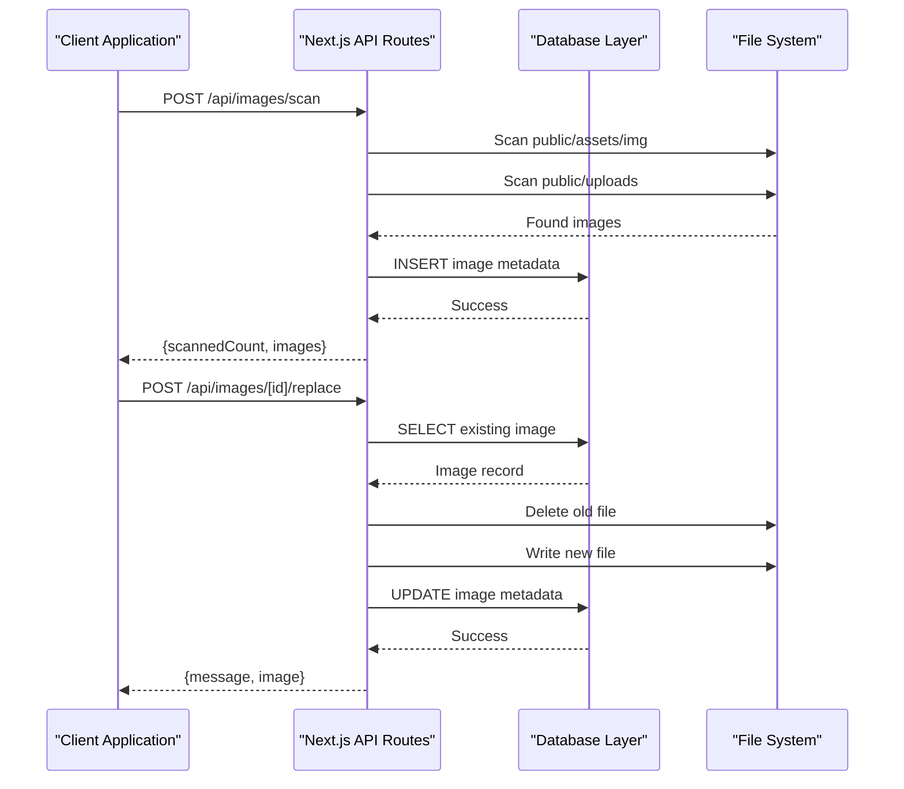
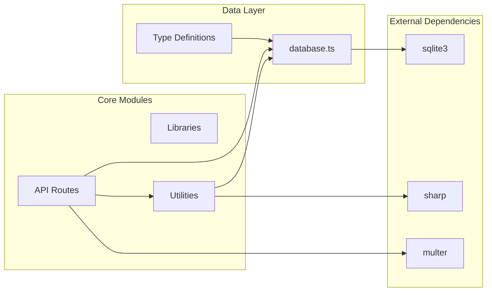

# Image Management API

<cite>
**Referenced Files in This Document**
- [IMAGE_MANAGEMENT_SETUP.md](file://IMAGE_MANAGEMENT_SETUP.md)
- [init-database.js](file://scripts/init-database.js)
- [database.ts](file://src/lib/database.ts)
- [image-tracker.ts](file://src/lib/image-tracker.ts)
- [scan/route.ts](file://src/app/api/images/scan/route.ts)
- [replace/route.ts](file://src/app/api/images/[id]/replace/route.ts)
- [id/route.ts](file://src/app/api/images/[id]/route.ts)
</cite>

## Table of Contents
1. [Introduction](#introduction)
2. [Project Structure](#project-structure)
3. [Core Components](#core-components)
4. [Architecture Overview](#architecture-overview)
5. [Detailed Component Analysis](#detailed-component-analysis)
6. [Dependency Analysis](#dependency-analysis)
7. [Performance Considerations](#performance-considerations)
8. [Troubleshooting Guide](#troubleshooting-guide)
9. [Conclusion](#conclusion)

## Introduction
This document provides comprehensive API documentation for the image management system, focusing on upload operations, optimization endpoints, and usage tracking. It covers all image endpoints including bulk upload functionality, individual image operations, replacement mechanisms, and usage tracking. It also details the image scanning process for discovering and cataloging existing media files, optimization capabilities, and performance considerations. The documentation includes endpoint specifications, file upload handling, response schemas, error codes, and integration examples for media management workflows.

## Project Structure
The image management system is built with Next.js and uses a SQLite database for persistence. The API endpoints are located under `src/app/api/images`, with supporting libraries in `src/lib`. The database initialization script creates the required tables for storing image metadata and usage tracking.



**Diagram sources**
- [scan/route.ts](file://src/app/api/images/scan/route.ts#L1-L124)
- [replace/route.ts](file://src/app/api/images/[id]/replace/route.ts#L1-L124)
- [database.ts](file://src/lib/database.ts#L1-L255)
- [image-tracker.ts](file://src/lib/image-tracker.ts#L1-L95)

**Section sources**
- [IMAGE_MANAGEMENT_SETUP.md](file://IMAGE_MANAGEMENT_SETUP.md#L101-L114)
- [database.ts](file://src/lib/database.ts#L100-L184)
- [init-database.js](file://scripts/init-database.js#L54-L92)

## Core Components
The system consists of three primary components:
- Database abstraction layer providing typed interfaces and query helpers
- Image scanning service for discovering and cataloging existing media files
- Image replacement service for updating existing images while preserving metadata

Key data structures:
- ImageRecord: Core image metadata with SEO scoring and usage tracking
- ImageUsageRecord: Page mapping and usage context tracking
- ImageUsageContext: Frontend tracking interface for page-based image usage

**Section sources**
- [database.ts](file://src/lib/database.ts#L18-L45)
- [image-tracker.ts](file://src/lib/image-tracker.ts#L3-L8)

## Architecture Overview
The image management API follows a layered architecture with clear separation of concerns:



**Diagram sources**
- [scan/route.ts](file://src/app/api/images/scan/route.ts#L16-L124)
- [replace/route.ts](file://src/app/api/images/[id]/replace/route.ts#L16-L124)
- [database.ts](file://src/lib/database.ts#L214-L254)

## Detailed Component Analysis

### Image Scanning Endpoint
The scanning endpoint discovers existing images and catalogs them in the database.

**Endpoint**: `POST /api/images/scan`
**Purpose**: Automatically detect and add all images from public asset directories to the database

**Request**: No body required
**Response**:
```json
{
  "message": "Image scan completed",
  "scannedCount": 42,
  "images": [
    {
      "id": 1,
      "filename": "hero-banner.jpg",
      "path": "/assets/img/hero-banner.jpg",
      "size": 1048576,
      "dimensions": "1920×1080"
    }
  ]
}
```

**Processing Logic**:
1. Recursively scans `public/assets/img` and `public/uploads` directories
2. Validates file extensions (jpg, jpeg, png, gif, webp, svg)
3. Skips duplicates by checking existing database entries
4. Extracts file metadata and dimensions using Sharp for non-SVG images
5. Inserts records with generated unique filenames

**Section sources**
- [scan/route.ts](file://src/app/api/images/scan/route.ts#L16-L124)

### Image Replacement Endpoint
The replacement endpoint updates existing images while preserving metadata and usage tracking.

**Endpoint**: `POST /api/images/[id]/replace`
**Purpose**: Replace an existing image file with a new one while maintaining all metadata

**Request Headers**:
- Content-Type: multipart/form-data

**Request Body**:
- file: Image file (max 10MB, allowed types: jpg, jpeg, png, gif, webp, svg)

**Response**:
```json
{
  "message": "Image replaced successfully",
  "image": {
    "id": 1,
    "filename": "new_filename.jpg",
    "original_name": "hero-banner.jpg",
    "file_path": "/uploads/1700000000_random.jpg",
    "file_size": 1048576,
    "width": 1920,
    "height": 1080,
    "format": "image/jpeg"
  }
}
```

**Processing Logic**:
1. Validates image ID parameter
2. Retrieves existing image record
3. Validates file type and size constraints
4. Deletes old physical file
5. Generates new unique filename with timestamp
6. Saves new file to uploads directory
7. Updates database with new metadata
8. Returns updated image record

**Section sources**
- [replace/route.ts](file://src/app/api/images/[id]/replace/route.ts#L16-L124)

### Image Deletion Endpoint
The deletion endpoint removes images from both database and filesystem.

**Endpoint**: `DELETE /api/images/[id]`
**Purpose**: Remove images from database and file system

**Response**:
```json
{
  "message": "Image deleted successfully"
}
```

**Processing Logic**:
1. Validates image ID parameter
2. Retrieves image record for file path
3. Deletes associated usage records
4. Removes image record from database
5. Deletes physical file from filesystem

**Section sources**
- [id/route.ts](file://src/app/api/images/[id]/route.ts#L128-L158)

### Usage Tracking System
The system provides comprehensive usage tracking for images across pages.

**Frontend Tracking**:
- Automatic page scanning using `useImageTracking` hook
- Manual tracking via `trackImageUsage` function
- Component wrapper `ImageTracker` for automatic tracking

**Backend Usage Endpoint**:
- `POST /api/images/[id]/usage` - Record page usage for specific image
- Tracks page path, title, and usage context
- Maintains relationship between images and pages

**Section sources**
- [image-tracker.ts](file://src/lib/image-tracker.ts#L11-L95)

## Dependency Analysis
The system exhibits clean architectural separation with minimal coupling between components.



**Diagram sources**
- [database.ts](file://src/lib/database.ts#L1-L255)
- [scan/route.ts](file://src/app/api/images/scan/route.ts#L58-L65)
- [replace/route.ts](file://src/app/api/images/[id]/replace/route.ts#L84-L91)

**Section sources**
- [database.ts](file://src/lib/database.ts#L1-L255)
- [scan/route.ts](file://src/app/api/images/scan/route.ts#L58-L65)
- [replace/route.ts](file://src/app/api/images/[id]/replace/route.ts#L84-L91)

## Performance Considerations
The system implements several performance optimizations:

**Image Processing**:
- Asynchronous file operations prevent blocking
- Sharp library used for efficient image metadata extraction
- Non-blocking dimension detection for SVG files

**Database Operations**:
- Prepared statements prevent SQL injection
- Promise-based query helpers reduce callback complexity
- Batch operations during directory scanning

**Memory Management**:
- Stream-based file writing prevents memory overflow
- Proper error handling ensures cleanup on failures
- Database connections managed centrally

**Scalability Recommendations**:
- Consider implementing image compression for large files
- Add caching layer for frequently accessed images
- Implement pagination for large image collections
- Consider CDN integration for production deployments

## Troubleshooting Guide
Common issues and solutions:

**Database Initialization**:
- Ensure `data/images.db` exists and is writable
- Run `node scripts/init-database.js` to create tables
- Verify SQLite3 installation and permissions

**File Upload Issues**:
- Check `public/uploads` directory permissions
- Verify file size does not exceed 10MB limit
- Confirm supported image formats: jpg, jpeg, png, gif, webp, svg

**Image Scanning Problems**:
- Verify `public/assets/img` and `public/uploads` directories exist
- Check file permissions for read access
- Ensure Sharp dependencies are properly installed

**Usage Tracking Failures**:
- Confirm frontend tracking is properly initialized
- Verify API routes are accessible
- Check browser console for CORS-related errors

**Section sources**
- [IMAGE_MANAGEMENT_SETUP.md](file://IMAGE_MANAGEMENT_SETUP.md#L153-L167)
- [init-database.js](file://scripts/init-database.js#L94-L120)

## Conclusion
The image management API provides a robust foundation for handling image operations in Next.js applications. Its modular architecture supports scalability, while comprehensive error handling ensures reliable operation. The system's focus on SEO optimization, usage tracking, and automated discovery makes it suitable for content-heavy websites requiring centralized media management.

Future enhancements could include cloud storage integration, advanced image optimization, and enhanced analytics capabilities to further improve the media management workflow.