# Pages & Content API

<cite>
**Referenced Files in This Document**
- [page-editor.ts](file://src/lib/page-editor.ts)
- [enhanced-page-editor.ts](file://src/lib/enhanced-page-editor.ts)
- [seed-metadata.ts](file://src/lib/seed-metadata.ts)
- [database.ts](file://src/lib/database.ts)
- [usePageMetadata.ts](file://src/hooks/usePageMetadata.ts)
- [useFilePageMetadata.ts](file://src/hooks/useFilePageMetadata.ts)
- [fileSeoUtils.ts](file://src/lib/fileSeoUtils.ts)
- [sitemap-utils.ts](file://src/lib/sitemap-utils.ts)
</cite>

## Table of Contents
1. [Introduction](#introduction)
2. [Project Structure](#project-structure)
3. [Core Components](#core-components)
4. [Architecture Overview](#architecture-overview)
5. [Detailed Component Analysis](#detailed-component-analysis)
6. [Dependency Analysis](#dependency-analysis)
7. [Performance Considerations](#performance-considerations)
8. [Troubleshooting Guide](#troubleshooting-guide)
9. [Conclusion](#conclusion)
10. [Appendices](#appendices)

## Introduction
This document describes the pages and content management system with a focus on dynamic content editing and metadata operations. It covers:
- The pages endpoint for content retrieval and updates
- The enhanced page editor API for real-time content modification
- Metadata seeding functionality
- Component-based content structure and file parsing mechanisms
- Content validation workflows
- Endpoint specifications for content CRUD operations, preview functionality, and publishing workflows
- Integration examples for content editors and developers

## Project Structure
The system is organized around:
- Editor libraries for parsing and updating page components
- React hooks for client-side metadata CRUD
- Utilities for file-based metadata extraction and updates
- Database schema for persistent metadata storage
- Sitemap utilities for dynamic route discovery

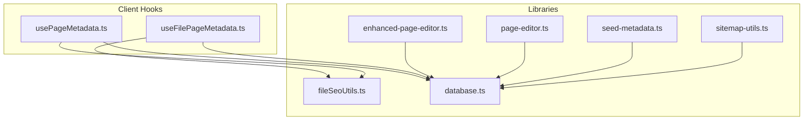

**Diagram sources**
- [usePageMetadata.ts](file://src/hooks/usePageMetadata.ts#L13-L52)
- [useFilePageMetadata.ts](file://src/hooks/useFilePageMetadata.ts#L13-L52)
- [page-editor.ts](file://src/lib/page-editor.ts#L23-L194)
- [enhanced-page-editor.ts](file://src/lib/enhanced-page-editor.ts#L26-L287)
- [fileSeoUtils.ts](file://src/lib/fileSeoUtils.ts#L120-L298)
- [seed-metadata.ts](file://src/lib/seed-metadata.ts#L3-L93)
- [database.ts](file://src/lib/database.ts#L84-L255)
- [sitemap-utils.ts](file://src/lib/sitemap-utils.ts#L12-L196)

**Section sources**
- [page-editor.ts](file://src/lib/page-editor.ts#L1-L194)
- [enhanced-page-editor.ts](file://src/lib/enhanced-page-editor.ts#L1-L287)
- [seed-metadata.ts](file://src/lib/seed-metadata.ts#L1-L93)
- [database.ts](file://src/lib/database.ts#L1-L255)
- [usePageMetadata.ts](file://src/hooks/usePageMetadata.ts#L1-L218)
- [useFilePageMetadata.ts](file://src/hooks/useFilePageMetadata.ts#L1-L225)
- [fileSeoUtils.ts](file://src/lib/fileSeoUtils.ts#L1-L329)
- [sitemap-utils.ts](file://src/lib/sitemap-utils.ts#L1-L196)

## Core Components
- PageEditor: Parses page files to extract editable components (text, images, links) and updates them.
- EnhancedPageEditor: Enhanced parser with richer component typing (title, subtitle, description), context-aware updates, and preview capability.
- Metadata CRUD Hooks: Client-side hooks to fetch, list, create, and update page metadata via API endpoints.
- File-based Metadata Utilities: Parse and update metadata directly in component files (Next.js metadata or SEOHead props).
- Database Layer: SQLite-backed schema for page metadata and related entities.
- Metadata Seeding: Seeds initial metadata for core pages.
- Sitemap Utilities: Discover dynamic routes for blog, projects, and team pages.

**Section sources**
- [page-editor.ts](file://src/lib/page-editor.ts#L23-L194)
- [enhanced-page-editor.ts](file://src/lib/enhanced-page-editor.ts#L26-L287)
- [usePageMetadata.ts](file://src/hooks/usePageMetadata.ts#L13-L218)
- [useFilePageMetadata.ts](file://src/hooks/useFilePageMetadata.ts#L13-L225)
- [fileSeoUtils.ts](file://src/lib/fileSeoUtils.ts#L120-L298)
- [database.ts](file://src/lib/database.ts#L62-L181)
- [seed-metadata.ts](file://src/lib/seed-metadata.ts#L3-L93)
- [sitemap-utils.ts](file://src/lib/sitemap-utils.ts#L12-L196)

## Architecture Overview
The system supports two primary workflows:
- Database-backed metadata CRUD via client hooks that call server endpoints under /api/seo/metadata and /api/seo/files.
- File-based metadata updates where the server parses and writes to component files.

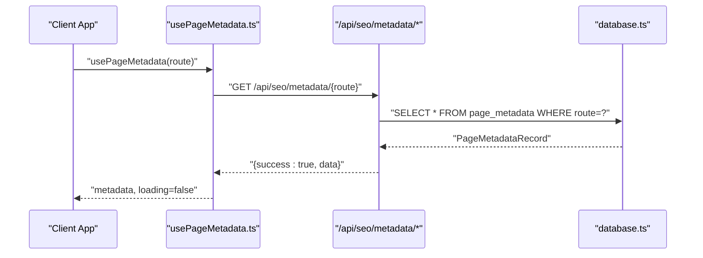

**Diagram sources**
- [usePageMetadata.ts](file://src/hooks/usePageMetadata.ts#L18-L52)
- [database.ts](file://src/lib/database.ts#L228-L240)

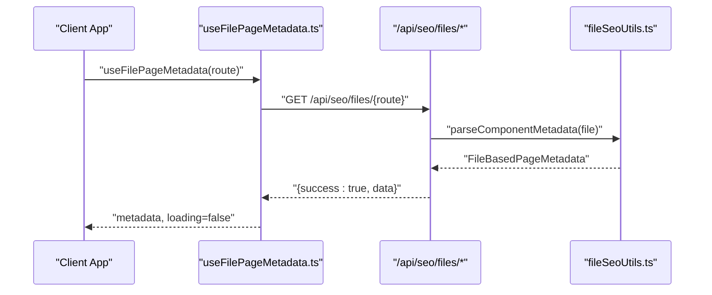

**Diagram sources**
- [useFilePageMetadata.ts](file://src/hooks/useFilePageMetadata.ts#L18-L52)
- [fileSeoUtils.ts](file://src/lib/fileSeoUtils.ts#L120-L178)

## Detailed Component Analysis

### PageEditor (Legacy)
Responsibilities:
- Enumerate predefined pages
- Parse page files to extract editable components
- Update component content
- Retrieve component content for editing

Key behaviors:
- Client-side environments return empty results or null
- Parsing extracts text, image, and link content with positions
- Updates perform a simple content replacement

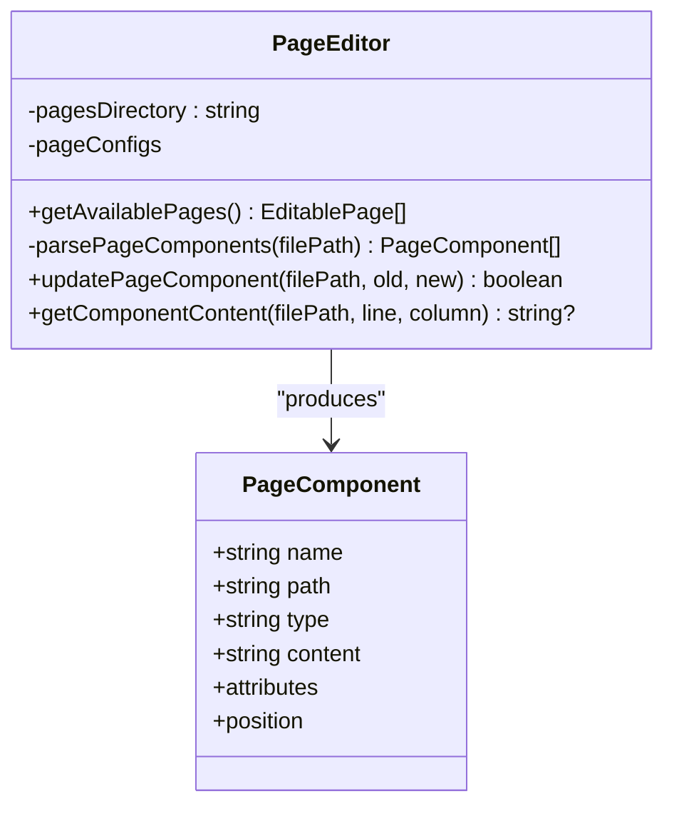

**Diagram sources**
- [page-editor.ts](file://src/lib/page-editor.ts#L23-L194)

**Section sources**
- [page-editor.ts](file://src/lib/page-editor.ts#L23-L194)

### EnhancedPageEditor (Enhanced)
Responsibilities:
- Enhanced parsing with richer component types (title, subtitle, description)
- Context-aware component identification
- Sophisticated update logic using component IDs
- Preview capability

Key behaviors:
- Client-side environments return empty results
- Parsing recognizes headings, text patterns, images, and links
- Updates target specific lines based on component ID
- Provides placeholder preview

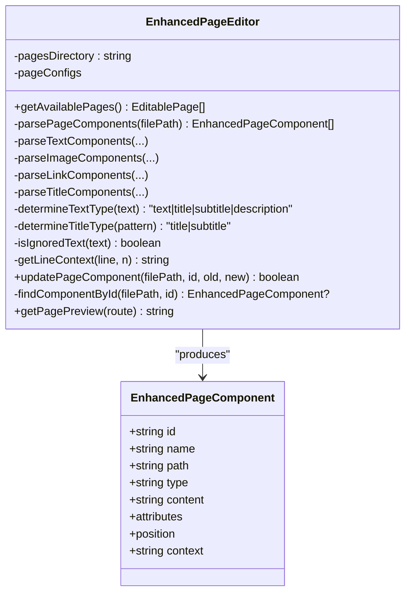

**Diagram sources**
- [enhanced-page-editor.ts](file://src/lib/enhanced-page-editor.ts#L26-L287)

**Section sources**
- [enhanced-page-editor.ts](file://src/lib/enhanced-page-editor.ts#L26-L287)

### Metadata CRUD Hooks
Responsibilities:
- Fetch single page metadata by route
- List paginated metadata with search
- Create and update metadata
- Refresh data after mutations

Endpoints used:
- GET /api/seo/metadata/{route}
- GET /api/seo/metadata?page=&limit=&search=
- POST /api/seo/metadata
- PUT /api/seo/metadata/{route}

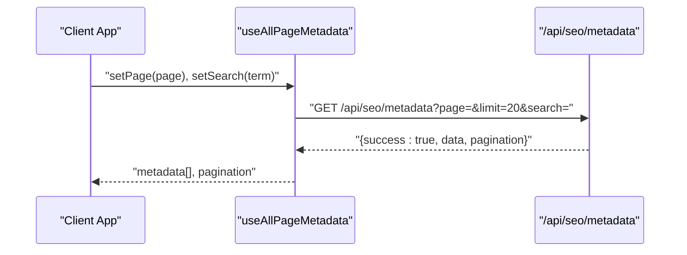

**Diagram sources**
- [usePageMetadata.ts](file://src/hooks/usePageMetadata.ts#L70-L135)

**Section sources**
- [usePageMetadata.ts](file://src/hooks/usePageMetadata.ts#L13-L218)

### File-Based Metadata Hooks
Responsibilities:
- Fetch file-based metadata by route
- List paginated file-based metadata
- Create and update file-based metadata
- Refresh data after mutations

Endpoints used:
- GET /api/seo/files/{route}
- GET /api/seo/files?page=&limit=&search=
- POST /api/seo/files
- PUT /api/seo/files/{route}

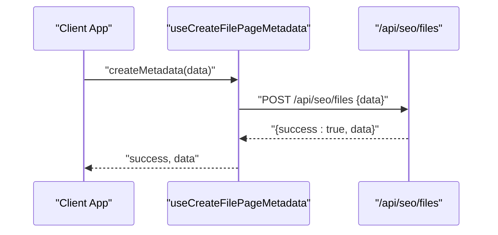

**Diagram sources**
- [useFilePageMetadata.ts](file://src/hooks/useFilePageMetadata.ts#L186-L225)

**Section sources**
- [useFilePageMetadata.ts](file://src/hooks/useFilePageMetadata.ts#L13-L225)

### File-Based Metadata Utilities
Responsibilities:
- Parse metadata from component files (Next.js metadata export or SEOHead props)
- Update component files with new metadata values
- Map routes to file paths and vice versa
- Generate Next.js metadata format

Key behaviors:
- Route-to-file mapping for dynamic routes
- Extraction of title, description, keywords, Open Graph, robots
- Replacement logic for Next.js metadata or SEOHead props
- Writes updated content back to files

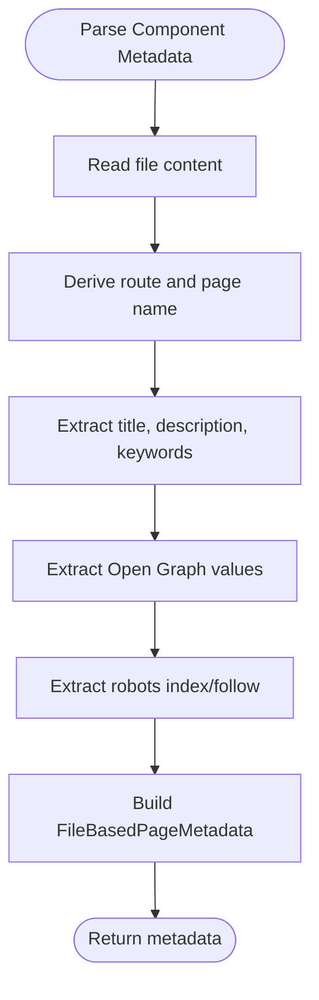

**Diagram sources**
- [fileSeoUtils.ts](file://src/lib/fileSeoUtils.ts#L120-L178)

**Section sources**
- [fileSeoUtils.ts](file://src/lib/fileSeoUtils.ts#L120-L298)

### Database Schema and Seeding
Responsibilities:
- Initialize SQLite database and create tables
- Provide helpers to run queries and manage connections
- Seed initial page metadata for core routes

Tables:
- images, image_usage, blogs, page_metadata

Seeding:
- Inserts initial metadata for home, about, contact, and selected service pages

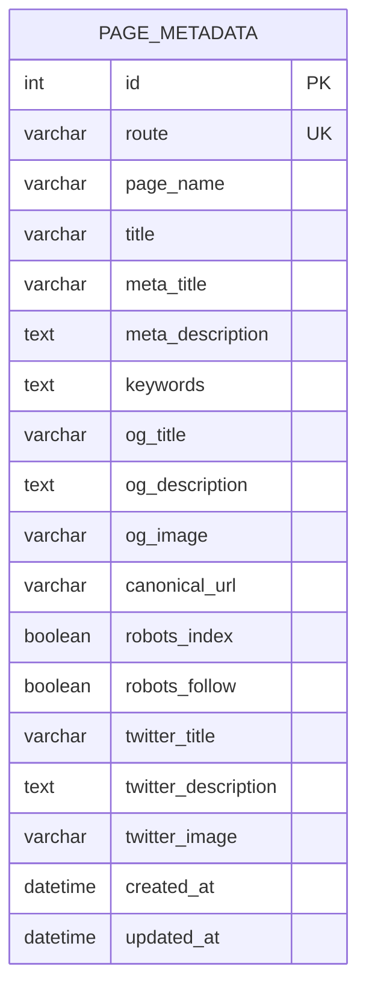

**Diagram sources**
- [database.ts](file://src/lib/database.ts#L159-L181)

**Section sources**
- [database.ts](file://src/lib/database.ts#L84-L255)
- [seed-metadata.ts](file://src/lib/seed-metadata.ts#L3-L93)

### Sitemap Utilities
Responsibilities:
- Discover dynamic routes for blog posts, projects, and team members
- Determine priority and change frequency per route
- Provide last modified timestamps

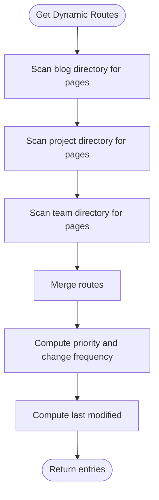

**Diagram sources**
- [sitemap-utils.ts](file://src/lib/sitemap-utils.ts#L12-L196)

**Section sources**
- [sitemap-utils.ts](file://src/lib/sitemap-utils.ts#L12-L196)

## Dependency Analysis
- Client hooks depend on server endpoints under /api/seo/*
- EnhancedPageEditor depends on database initialization for component updates
- File-based utilities depend on route-to-file mapping and component file formats
- Database utilities provide shared query helpers and schema creation

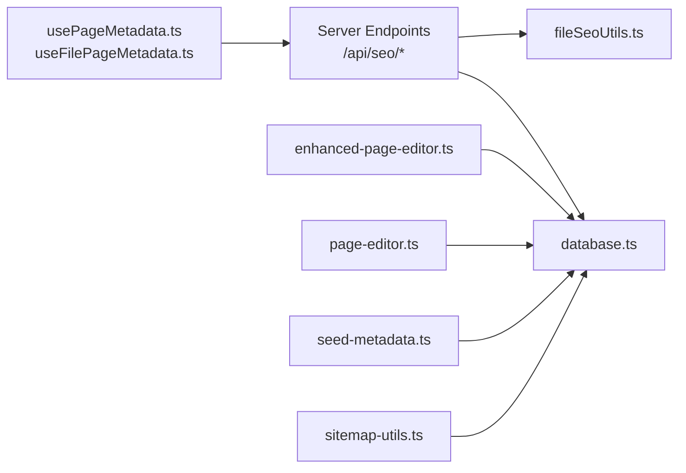

**Diagram sources**
- [usePageMetadata.ts](file://src/hooks/usePageMetadata.ts#L18-L52)
- [useFilePageMetadata.ts](file://src/hooks/useFilePageMetadata.ts#L18-L52)
- [enhanced-page-editor.ts](file://src/lib/enhanced-page-editor.ts#L26-L76)
- [page-editor.ts](file://src/lib/page-editor.ts#L23-L75)
- [seed-metadata.ts](file://src/lib/seed-metadata.ts#L3-L93)
- [database.ts](file://src/lib/database.ts#L84-L255)
- [fileSeoUtils.ts](file://src/lib/fileSeoUtils.ts#L120-L298)
- [sitemap-utils.ts](file://src/lib/sitemap-utils.ts#L12-L196)

**Section sources**
- [usePageMetadata.ts](file://src/hooks/usePageMetadata.ts#L13-L218)
- [useFilePageMetadata.ts](file://src/hooks/useFilePageMetadata.ts#L13-L225)
- [enhanced-page-editor.ts](file://src/lib/enhanced-page-editor.ts#L26-L287)
- [page-editor.ts](file://src/lib/page-editor.ts#L23-L194)
- [seed-metadata.ts](file://src/lib/seed-metadata.ts#L3-L93)
- [database.ts](file://src/lib/database.ts#L84-L255)
- [fileSeoUtils.ts](file://src/lib/fileSeoUtils.ts#L120-L298)
- [sitemap-utils.ts](file://src/lib/sitemap-utils.ts#L12-L196)

## Performance Considerations
- File parsing is linear in the number of lines; avoid frequent heavy parsing on the client.
- Database queries should be indexed on route for fast lookups.
- Batch updates for metadata can reduce filesystem writes.
- Client-side caching of metadata reduces redundant network requests.
- Consider debouncing search/filter operations in paginated lists.

## Troubleshooting Guide
Common issues and resolutions:
- Network errors when fetching metadata: Verify API endpoints are reachable and CORS is configured.
- Empty metadata lists: Ensure database initialization runs before queries and routes match expected patterns.
- File-based updates failing: Confirm component files use supported metadata formats (Next.js metadata export or SEOHead props).
- Component updates not applied: EnhancedPageEditor requires component IDs; ensure parsing captures accurate IDs and positions.

**Section sources**
- [usePageMetadata.ts](file://src/hooks/usePageMetadata.ts#L18-L52)
- [useFilePageMetadata.ts](file://src/hooks/useFilePageMetadata.ts#L141-L183)
- [fileSeoUtils.ts](file://src/lib/fileSeoUtils.ts#L183-L298)
- [enhanced-page-editor.ts](file://src/lib/enhanced-page-editor.ts#L239-L277)

## Conclusion
The system provides a robust foundation for managing page content and metadata through both database-backed and file-based workflows. The enhanced editor improves precision and context awareness, while hooks streamline integration for client applications. Proper indexing, caching, and validation practices will ensure scalability and reliability.

## Appendices

### Endpoint Specifications

- GET /api/seo/metadata/{route}
  - Description: Retrieve metadata for a specific route
  - Response: { success: boolean, data: PageMetadataRecord }

- GET /api/seo/metadata
  - Description: List paginated metadata with optional search
  - Query: page, limit, search
  - Response: { success: boolean, data: PageMetadataRecord[], pagination }

- POST /api/seo/metadata
  - Description: Create new metadata
  - Body: Omit id, created_at, updated_at
  - Response: { success: boolean, data: PageMetadataRecord }

- PUT /api/seo/metadata/{route}
  - Description: Update metadata for a route
  - Body: Partial(PageMetadataRecord)
  - Response: { success: boolean, data: PageMetadataRecord }

- GET /api/seo/files/{route}
  - Description: Retrieve file-based metadata for a route
  - Response: { success: boolean, data: FileBasedPageMetadata }

- GET /api/seo/files
  - Description: List paginated file-based metadata with optional search
  - Query: page, limit, search
  - Response: { success: boolean, data: FileBasedPageMetadata[], pagination }

- POST /api/seo/files
  - Description: Create file-based metadata
  - Body: Omit id, created_at, updated_at
  - Response: { success: boolean, data: FileBasedPageMetadata }

- PUT /api/seo/files/{route}
  - Description: Update file-based metadata for a route
  - Body: Partial(PageMetadataRecord)
  - Response: { success: boolean, data: FileBasedPageMetadata }

- GET /api/pages
  - Description: Retrieve available editable pages (legacy)
  - Response: { success: boolean, data: EditablePage[] }

- PUT /api/pages/update
  - Description: Update a page component (legacy)
  - Body: { filePath: string, oldContent: string, newContent: string }
  - Response: { success: boolean }

- GET /api/pages/preview/{route}
  - Description: Preview a page (enhanced)
  - Response: { success: boolean, data: string }

**Section sources**
- [usePageMetadata.ts](file://src/hooks/usePageMetadata.ts#L147-L170)
- [useFilePageMetadata.ts](file://src/hooks/useFilePageMetadata.ts#L152-L183)
- [page-editor.ts](file://src/lib/page-editor.ts#L148-L167)
- [enhanced-page-editor.ts](file://src/lib/enhanced-page-editor.ts#L279-L283)

### Integration Examples

- Content Editor Integration
  - Use usePageMetadata(route) to load and display metadata in the admin panel.
  - Use useUpdatePageMetadata(route) to persist edits via PUT /api/seo/metadata/{route}.
  - Use useAllPageMetadata() for bulk management with pagination and search.

- Developer Integration
  - Initialize database on startup using initDatabase() before performing queries.
  - Use fileSeoUtils.parseComponentMetadata(filePath) to extract metadata from component files.
  - Use fileSeoUtils.updateComponentMetadata(filePath, updates) to write metadata back to files.
  - Seed initial metadata using seedInitialPageMetadata() during deployment.

**Section sources**
- [usePageMetadata.ts](file://src/hooks/usePageMetadata.ts#L13-L218)
- [useFilePageMetadata.ts](file://src/hooks/useFilePageMetadata.ts#L13-L225)
- [fileSeoUtils.ts](file://src/lib/fileSeoUtils.ts#L120-L298)
- [seed-metadata.ts](file://src/lib/seed-metadata.ts#L3-L93)
- [database.ts](file://src/lib/database.ts#L84-L97)