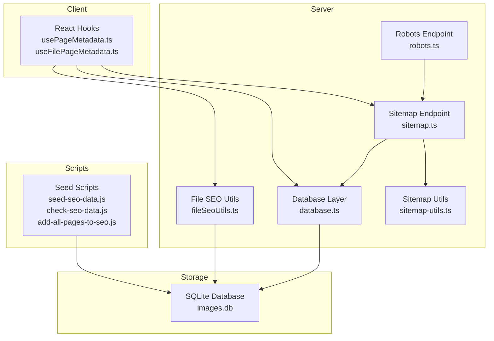
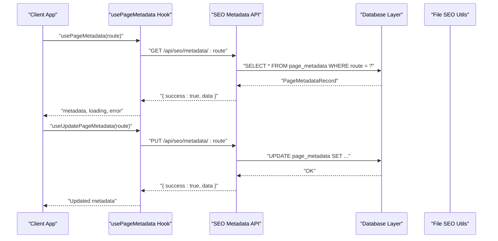
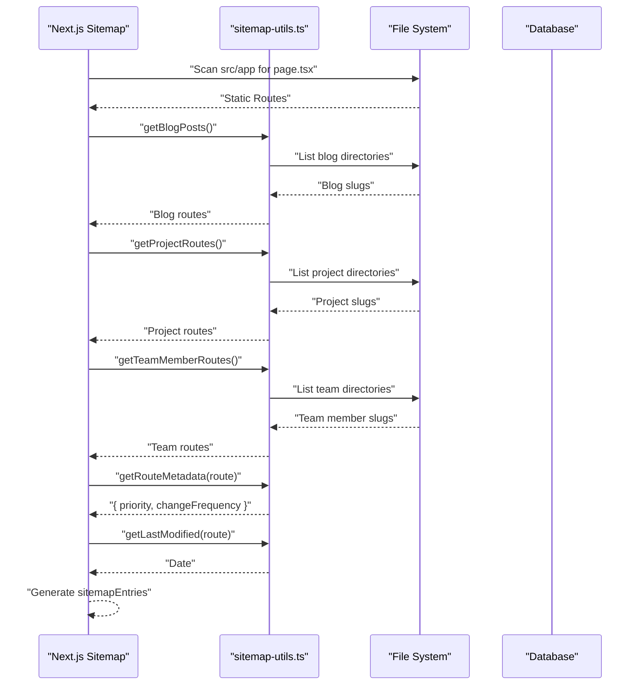
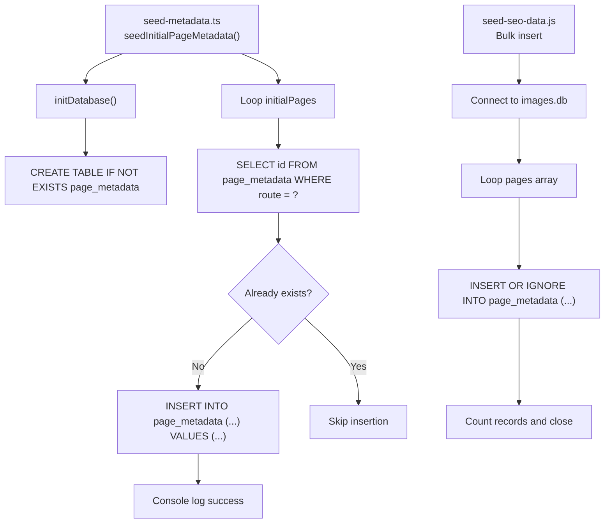
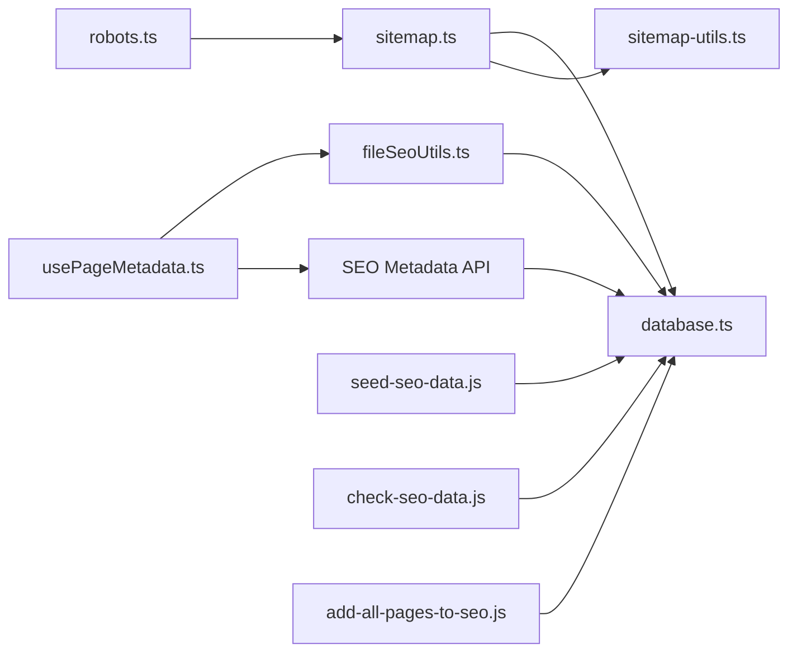

# SEO & Utility API

<cite>
**Referenced Files in This Document**
- [database.ts](file://src/lib/database.ts)
- [fileSeoUtils.ts](file://src/lib/fileSeoUtils.ts)
- [sitemap-utils.ts](file://src/lib/sitemap-utils.ts)
- [seed-metadata.ts](file://src/lib/seed-metadata.ts)
- [usePageMetadata.ts](file://src/hooks/usePageMetadata.ts)
- [useFilePageMetadata.ts](file://src/hooks/useFilePageMetadata.ts)
- [sitemap.ts](file://src/app/sitemap.ts)
- [robots.ts](file://src/app/robots.ts)
- [seed-seo-data.js](file://scripts/seed-seo-data.js)
- [check-seo-data.js](file://scripts/check-seo-data.js)
- [add-all-pages-to-seo.js](file://scripts/add-all-pages-to-seo.js)
</cite>

## Table of Contents
1. [Introduction](#introduction)
2. [Project Structure](#project-structure)
3. [Core Components](#core-components)
4. [Architecture Overview](#architecture-overview)
5. [Detailed Component Analysis](#detailed-component-analysis)
6. [Dependency Analysis](#dependency-analysis)
7. [Performance Considerations](#performance-considerations)
8. [Troubleshooting Guide](#troubleshooting-guide)
9. [Conclusion](#conclusion)
10. [Appendices](#appendices)

## Introduction
This document provides comprehensive API documentation for the SEO and utility systems focused on analysis, metadata management, and sitemap generation. It covers:
- SEO metadata endpoints for automatic optimization and content analysis
- File-based SEO operations for metadata management
- Sitemap generation utilities and integration
- Seeding functionality for initial SEO configuration
- Utility functions for performance optimization

The system combines React hooks for client-side metadata operations, server-side utilities for sitemap generation, and database-backed storage for SEO configurations.

## Project Structure
The SEO and utility systems are organized across several modules:
- Database layer for persistent storage
- File-based SEO utilities for component metadata extraction and updates
- Sitemap utilities for dynamic route discovery and metadata calculation
- Next.js app router endpoints for sitemap and robots
- Client hooks for metadata CRUD operations
- Scripts for seeding and maintenance

**Diagram sources**
- [database.ts](file://src/lib/database.ts#L1-L255)
- [fileSeoUtils.ts](file://src/lib/fileSeoUtils.ts#L1-L329)
- [sitemap-utils.ts](file://src/lib/sitemap-utils.ts#L1-L196)
- [sitemap.ts](file://src/app/sitemap.ts#L1-L154)
- [robots.ts](file://src/app/robots.ts#L1-L38)
- [usePageMetadata.ts](file://src/hooks/usePageMetadata.ts#L1-L218)
- [useFilePageMetadata.ts](file://src/hooks/useFilePageMetadata.ts#L1-L225)
- [seed-seo-data.js](file://scripts/seed-seo-data.js#L1-L171)
- [check-seo-data.js](file://scripts/check-seo-data.js#L1-L59)
- [add-all-pages-to-seo.js](file://scripts/add-all-pages-to-seo.js#L1-L85)

**Section sources**
- [database.ts](file://src/lib/database.ts#L1-L255)
- [fileSeoUtils.ts](file://src/lib/fileSeoUtils.ts#L1-L329)
- [sitemap-utils.ts](file://src/lib/sitemap-utils.ts#L1-L196)
- [sitemap.ts](file://src/app/sitemap.ts#L1-L154)
- [robots.ts](file://src/app/robots.ts#L1-L38)
- [usePageMetadata.ts](file://src/hooks/usePageMetadata.ts#L1-L218)
- [useFilePageMetadata.ts](file://src/hooks/useFilePageMetadata.ts#L1-L225)
- [seed-seo-data.js](file://scripts/seed-seo-data.js#L1-L171)
- [check-seo-data.js](file://scripts/check-seo-data.js#L1-L59)
- [add-all-pages-to-seo.js](file://scripts/add-all-pages-to-seo.js#L1-L85)

## Core Components
- Database layer: Provides typed interfaces, initialization, table creation, and query helpers for storing page metadata and related resources.
- File SEO utilities: Parses component metadata from Next.js pages and updates metadata in component files.
- Sitemap utilities: Discovers dynamic routes and calculates sitemap metadata (priority, change frequency, last modified).
- Next.js endpoints: Sitemap and robots generation with incremental regeneration.
- Client hooks: Encapsulate metadata CRUD operations via API routes.
- Scripts: Seed initial metadata, validate database state, and add discovered pages.

Key data model for page metadata:
- Fields include route, page_name, title, meta_title, meta_description, keywords, Open Graph fields, canonical_url, robots directives, Twitter fields, timestamps, and auto-incremented id.

**Section sources**
- [database.ts](file://src/lib/database.ts#L62-L81)
- [database.ts](file://src/lib/database.ts#L159-L181)
- [fileSeoUtils.ts](file://src/lib/fileSeoUtils.ts#L39-L42)
- [sitemap-utils.ts](file://src/lib/sitemap-utils.ts#L5-L10)
- [sitemap.ts](file://src/app/sitemap.ts#L126-L150)

## Architecture Overview
The system integrates client-side hooks, server-side utilities, and persistent storage to deliver SEO metadata management and sitemap generation.

**Diagram sources**
- [usePageMetadata.ts](file://src/hooks/usePageMetadata.ts#L13-L52)
- [usePageMetadata.ts](file://src/hooks/usePageMetadata.ts#L137-L177)
- [database.ts](file://src/lib/database.ts#L214-L226)

**Section sources**
- [usePageMetadata.ts](file://src/hooks/usePageMetadata.ts#L1-L218)
- [database.ts](file://src/lib/database.ts#L1-L255)

## Detailed Component Analysis

### SEO Metadata Endpoints
The client hooks expose CRUD operations for page metadata:
- GET /api/seo/metadata/:route
- PUT /api/seo/metadata/:route
- POST /api/seo/metadata
- GET /api/seo/metadata (list with pagination and search)
- GET /api/seo/files/:route
- PUT /api/seo/files/:route
- POST /api/seo/files

These endpoints integrate with:
- Database queries for persistence
- File-based metadata parsing and updates for component-driven pages

Response format:
- Success: { success: true, data: PageMetadataRecord | PageMetadataRecord[] }
- Error: { success: false, error: string }

Pagination payload:
- Current page, total pages, total count, and navigation booleans

Search:
- Optional query parameter for filtering by page_name or route

**Section sources**
- [usePageMetadata.ts](file://src/hooks/usePageMetadata.ts#L18-L52)
- [usePageMetadata.ts](file://src/hooks/usePageMetadata.ts#L83-L135)
- [usePageMetadata.ts](file://src/hooks/usePageMetadata.ts#L141-L177)
- [usePageMetadata.ts](file://src/hooks/usePageMetadata.ts#L183-L218)
- [useFilePageMetadata.ts](file://src/hooks/useFilePageMetadata.ts#L18-L52)
- [useFilePageMetadata.ts](file://src/hooks/useFilePageMetadata.ts#L83-L139)
- [useFilePageMetadata.ts](file://src/hooks/useFilePageMetadata.ts#L145-L183)
- [useFilePageMetadata.ts](file://src/hooks/useFilePageMetadata.ts#L190-L225)

### File-Based SEO Operations
File-based utilities enable:
- Parsing component metadata from Next.js pages
- Updating metadata in component files (either SEOHead component props or Next.js metadata exports)
- Listing all component files with metadata
- Route-to-file mapping and reverse conversion

Processing logic:
- Route-to-file mapping supports route groups and inner pages
- Regex-based extraction for metadata fields
- Pattern-based replacement for updating metadata in files
- Safe escaping for quotes and special characters

```mermaid
flowchart TD
Start(["Parse Component Metadata"]) --> ReadFile["Read Component File"]
ReadFile --> ExtractRoute["Extract Route from File Path"]
ExtractRoute --> ExtractFields["Extract Metadata Fields<br/>title, description, keywords,<br/>Open Graph, robots"]
ExtractFields --> BuildObject["Build FileBasedPageMetadata"]
BuildObject --> Return(["Return Parsed Metadata"])
UpdateStart(["Update Component Metadata"]) --> ReadUpdateFile["Read Component File"]
ReadUpdateFile --> DetectFormat{"Uses SEOHead?"}
DetectFormat --> |Yes| UpdateSEOHead["Update SEOHead Props"]
DetectFormat --> |No| UpdateNextMeta["Update Next.js Metadata Export"]
UpdateSEOHead --> WriteBack["Write Updated Content"]
UpdateNextMeta --> WriteBack
WriteBack --> UpdateReturn(["Return Success/Failure"])
```

**Diagram sources**
- [fileSeoUtils.ts](file://src/lib/fileSeoUtils.ts#L120-L178)
- [fileSeoUtils.ts](file://src/lib/fileSeoUtils.ts#L183-L298)

**Section sources**
- [fileSeoUtils.ts](file://src/lib/fileSeoUtils.ts#L6-L37)
- [fileSeoUtils.ts](file://src/lib/fileSeoUtils.ts#L120-L178)
- [fileSeoUtils.ts](file://src/lib/fileSeoUtils.ts#L183-L298)
- [fileSeoUtils.ts](file://src/lib/fileSeoUtils.ts#L303-L329)

### Sitemap Generation Utilities
Sitemap utilities provide:
- Dynamic route discovery for blogs, projects, and team members
- Priority and change frequency determination per route
- Last modified date calculation (file system or fallback)
- Integration with Next.js sitemap endpoint

**Diagram sources**
- [sitemap.ts](file://src/app/sitemap.ts#L88-L153)
- [sitemap-utils.ts](file://src/lib/sitemap-utils.ts#L13-L60)
- [sitemap-utils.ts](file://src/lib/sitemap-utils.ts#L62-L105)
- [sitemap-utils.ts](file://src/lib/sitemap-utils.ts#L107-L150)
- [sitemap-utils.ts](file://src/lib/sitemap-utils.ts#L152-L181)
- [sitemap-utils.ts](file://src/lib/sitemap-utils.ts#L183-L195)

**Section sources**
- [sitemap.ts](file://src/app/sitemap.ts#L12-L15)
- [sitemap.ts](file://src/app/sitemap.ts#L24-L63)
- [sitemap.ts](file://src/app/sitemap.ts#L66-L86)
- [sitemap.ts](file://src/app/sitemap.ts#L88-L153)
- [sitemap-utils.ts](file://src/lib/sitemap-utils.ts#L1-L196)

### Seeding Functionality
Two seeding mechanisms exist:
- Initial seeding via TypeScript library: Creates baseline metadata for core pages
- Bulk seeding via Node script: Inserts discovered pages into the database

**Diagram sources**
- [seed-metadata.ts](file://src/lib/seed-metadata.ts#L3-L93)
- [seed-seo-data.js](file://scripts/seed-seo-data.js#L14-L170)

**Section sources**
- [seed-metadata.ts](file://src/lib/seed-metadata.ts#L1-L93)
- [seed-seo-data.js](file://scripts/seed-seo-data.js#L1-L171)

### Utility Functions for Performance Optimization
- Incremental Static Regeneration (ISR) for sitemap generation
- Pagination and search for metadata listing
- Route grouping support for Next.js app directory structure
- Efficient regex-based parsing and replacement for metadata updates

**Section sources**
- [sitemap.ts](file://src/app/sitemap.ts#L12-L15)
- [usePageMetadata.ts](file://src/hooks/usePageMetadata.ts#L83-L135)
- [useFilePageMetadata.ts](file://src/hooks/useFilePageMetadata.ts#L83-L139)
- [sitemap-utils.ts](file://src/lib/sitemap-utils.ts#L152-L181)

## Dependency Analysis
The system exhibits clear separation of concerns:
- Client hooks depend on Next.js app router endpoints
- Endpoints depend on database layer and file utilities
- Sitemap endpoint depends on sitemap utilities
- Scripts depend on database initialization and file system

**Diagram sources**
- [usePageMetadata.ts](file://src/hooks/usePageMetadata.ts#L1-L218)
- [useFilePageMetadata.ts](file://src/hooks/useFilePageMetadata.ts#L1-L225)
- [database.ts](file://src/lib/database.ts#L1-L255)
- [fileSeoUtils.ts](file://src/lib/fileSeoUtils.ts#L1-L329)
- [sitemap.ts](file://src/app/sitemap.ts#L1-L154)
- [sitemap-utils.ts](file://src/lib/sitemap-utils.ts#L1-L196)
- [robots.ts](file://src/app/robots.ts#L1-L38)
- [seed-seo-data.js](file://scripts/seed-seo-data.js#L1-L171)
- [check-seo-data.js](file://scripts/check-seo-data.js#L1-L59)
- [add-all-pages-to-seo.js](file://scripts/add-all-pages-to-seo.js#L1-L85)

**Section sources**
- [database.ts](file://src/lib/database.ts#L1-L255)
- [fileSeoUtils.ts](file://src/lib/fileSeoUtils.ts#L1-L329)
- [sitemap-utils.ts](file://src/lib/sitemap-utils.ts#L1-L196)
- [sitemap.ts](file://src/app/sitemap.ts#L1-L154)
- [robots.ts](file://src/app/robots.ts#L1-L38)
- [usePageMetadata.ts](file://src/hooks/usePageMetadata.ts#L1-L218)
- [useFilePageMetadata.ts](file://src/hooks/useFilePageMetadata.ts#L1-L225)
- [seed-seo-data.js](file://scripts/seed-seo-data.js#L1-L171)
- [check-seo-data.js](file://scripts/check-seo-data.js#L1-L59)
- [add-all-pages-to-seo.js](file://scripts/add-all-pages-to-seo.js#L1-L85)

## Performance Considerations
- Use ISR for sitemaps to balance freshness and performance
- Paginate metadata listings to reduce payload sizes
- Cache database queries where appropriate
- Minimize file system reads by leveraging route-to-file mapping
- Escape special characters carefully during metadata updates to avoid breaking syntax

## Troubleshooting Guide
Common issues and resolutions:
- Database not initialized: Ensure initDatabase() is called before queries
- Missing page_metadata table: Run table creation logic or seeding scripts
- File parsing failures: Verify component file syntax and metadata field formats
- Sitemap generation errors: Check directory permissions and route group naming
- API route not found: Confirm Next.js app router endpoint paths match hook URLs

Validation scripts:
- check-seo-data.js verifies table existence and counts records
- add-all-pages-to-seo.js adds discovered pages while avoiding duplicates

**Section sources**
- [database.ts](file://src/lib/database.ts#L84-L97)
- [database.ts](file://src/lib/database.ts#L100-L184)
- [check-seo-data.js](file://scripts/check-seo-data.js#L14-L58)
- [add-all-pages-to-seo.js](file://scripts/add-all-pages-to-seo.js#L32-L83)

## Conclusion
The SEO and utility system provides a robust foundation for metadata management, file-based SEO operations, and automated sitemap generation. By combining client hooks, server utilities, and persistent storage, it enables efficient SEO workflows with clear APIs and maintainable scripts.

## Appendices

### Endpoint Specifications
- GET /api/seo/metadata/:route
  - Description: Retrieve metadata for a specific route
  - Response: { success: boolean, data: PageMetadataRecord }
- PUT /api/seo/metadata/:route
  - Description: Update metadata for a specific route
  - Request Body: Partial(PageMetadataRecord)
  - Response: { success: boolean, data: PageMetadataRecord }
- POST /api/seo/metadata
  - Description: Create new metadata entry
  - Request Body: Omit<PageMetadataRecord, 'id' | 'created_at' | 'updated_at'>
  - Response: { success: boolean, data: PageMetadataRecord }
- GET /api/seo/metadata
  - Description: List metadata with pagination and optional search
  - Query Params: page, limit, search
  - Response: { success: boolean, data: PageMetadataRecord[], pagination: {...} }
- GET /api/seo/files/:route
  - Description: Retrieve file-based metadata for a route
  - Response: { success: boolean, data: FileBasedPageMetadata }
- PUT /api/seo/files/:route
  - Description: Update file-based metadata for a route
  - Request Body: Partial(PageMetadataRecord)
  - Response: { success: boolean, data: FileBasedPageMetadata }
- POST /api/seo/files
  - Description: Create new file-based metadata entry
  - Request Body: Omit<PageMetadataRecord, 'id' | 'created_at' | 'updated_at'>
  - Response: { success: boolean, data: FileBasedPageMetadata }

**Section sources**
- [usePageMetadata.ts](file://src/hooks/usePageMetadata.ts#L18-L52)
- [usePageMetadata.ts](file://src/hooks/usePageMetadata.ts#L83-L135)
- [usePageMetadata.ts](file://src/hooks/usePageMetadata.ts#L141-L177)
- [usePageMetadata.ts](file://src/hooks/usePageMetadata.ts#L183-L218)
- [useFilePageMetadata.ts](file://src/hooks/useFilePageMetadata.ts#L18-L52)
- [useFilePageMetadata.ts](file://src/hooks/useFilePageMetadata.ts#L83-L139)
- [useFilePageMetadata.ts](file://src/hooks/useFilePageMetadata.ts#L145-L183)
- [useFilePageMetadata.ts](file://src/hooks/useFilePageMetadata.ts#L190-L225)

### Integration Examples
- Metadata CRUD in components:
  - Use usePageMetadata(route) to fetch and display metadata
  - Use useUpdatePageMetadata(route) to submit updates
  - Use useCreatePageMetadata() to add new entries
- File-based metadata:
  - Use useFilePageMetadata(route) for file-driven pages
  - Use useUpdateFilePageMetadata(route) to modify component metadata
- Sitemap generation:
  - Access /sitemap.xml for dynamic sitemap with ISR
  - Configure robots.txt to reference sitemap.xml

**Section sources**
- [usePageMetadata.ts](file://src/hooks/usePageMetadata.ts#L13-L52)
- [usePageMetadata.ts](file://src/hooks/usePageMetadata.ts#L137-L177)
- [usePageMetadata.ts](file://src/hooks/usePageMetadata.ts#L179-L218)
- [useFilePageMetadata.ts](file://src/hooks/useFilePageMetadata.ts#L13-L52)
- [useFilePageMetadata.ts](file://src/hooks/useFilePageMetadata.ts#L141-L183)
- [useFilePageMetadata.ts](file://src/hooks/useFilePageMetadata.ts#L186-L225)
- [sitemap.ts](file://src/app/sitemap.ts#L88-L153)
- [robots.ts](file://src/app/robots.ts#L22-L36)