# Admin Dashboard

<cite>
**Referenced Files in This Document**
- [layout.tsx](file://src/app/admin/layout.tsx)
- [auth.ts](file://src/lib/auth.ts)
- [middleware.ts](file://middleware.ts)
- [dashboard/page.tsx](file://src/app/admin/dashboard/page.tsx)
- [page-editor/page.tsx](file://src/app/admin/page-editor/page.tsx)
- [services/page.tsx](file://src/app/admin/services/page.tsx)
- [users/page.tsx](file://src/app/admin/users/page.tsx)
- [settings/page.tsx](file://src/app/admin/settings/page.tsx)
- [images/page.tsx](file://src/app/admin/images/page.tsx)
</cite>

## Table of Contents
1. [Introduction](#introduction)
2. [Project Structure](#project-structure)
3. [Core Components](#core-components)
4. [Architecture Overview](#architecture-overview)
5. [Detailed Component Analysis](#detailed-component-analysis)
6. [Dependency Analysis](#dependency-analysis)
7. [Performance Considerations](#performance-considerations)
8. [Troubleshooting Guide](#troubleshooting-guide)
9. [Conclusion](#conclusion)

## Introduction
This document describes the admin dashboard for attechglobal.com, focusing on the content management interface built with Next.js App Router. It covers the authentication system (JWT-based login, user roles, and session management), the dashboard layout and navigation, administrative workflows, and the admin components for managing services, users, settings, and images. It also documents UI patterns, form handling, and the integration between frontend components and backend APIs, along with practical examples of admin workflows and security considerations.

## Project Structure
The admin area is organized under the Next.js App Router under src/app/admin. Each route corresponds to a dedicated page component that renders the admin UI. A shared admin layout composes the header and sidebar and wraps child pages. Authentication utilities reside in a library module, while a middleware file defines admin route protection.

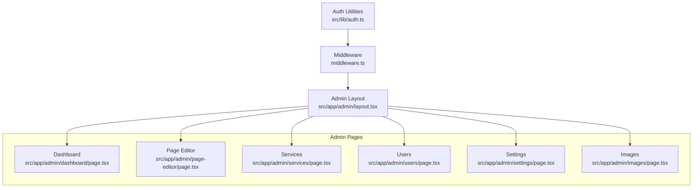

**Diagram sources**
- [layout.tsx](file://src/app/admin/layout.tsx#L1-L23)
- [auth.ts](file://src/lib/auth.ts#L1-L85)
- [middleware.ts](file://middleware.ts#L1-L15)
- [dashboard/page.tsx](file://src/app/admin/dashboard/page.tsx#L1-L197)
- [page-editor/page.tsx](file://src/app/admin/page-editor/page.tsx#L1-L14)
- [services/page.tsx](file://src/app/admin/services/page.tsx#L1-L144)
- [users/page.tsx](file://src/app/admin/users/page.tsx#L1-L152)
- [settings/page.tsx](file://src/app/admin/settings/page.tsx#L1-L265)
- [images/page.tsx](file://src/app/admin/images/page.tsx#L1-L480)

**Section sources**
- [layout.tsx](file://src/app/admin/layout.tsx#L1-L23)
- [auth.ts](file://src/lib/auth.ts#L1-L85)
- [middleware.ts](file://middleware.ts#L1-L15)

## Core Components
- Admin Layout: Provides the global admin shell with header and sidebar, and renders page content.
- Authentication Utilities: JWT generation and verification, credential checks, and role-based access helpers.
- Middleware: Route guard for admin paths (currently disabled for static hosting).
- Admin Pages: Dashboard, Page Editor, Services, Users, Settings, and Images management.

Key responsibilities:
- Layout composes the header and sidebar and yields page content.
- Auth utilities encapsulate JWT lifecycle and role checks.
- Middleware can enforce admin-only access for protected routes.
- Pages implement CRUD-like workflows and UI patterns for content management.

**Section sources**
- [layout.tsx](file://src/app/admin/layout.tsx#L1-L23)
- [auth.ts](file://src/lib/auth.ts#L1-L85)
- [middleware.ts](file://middleware.ts#L1-L15)

## Architecture Overview
The admin dashboard follows a client-side React pattern with Next.js App Router. Pages are client components that orchestrate UI rendering and user interactions. Authentication is handled via JWT tokens stored locally (e.g., in localStorage or cookies), and role checks determine access to admin features. API integrations are invoked from pages to manage content and resources.

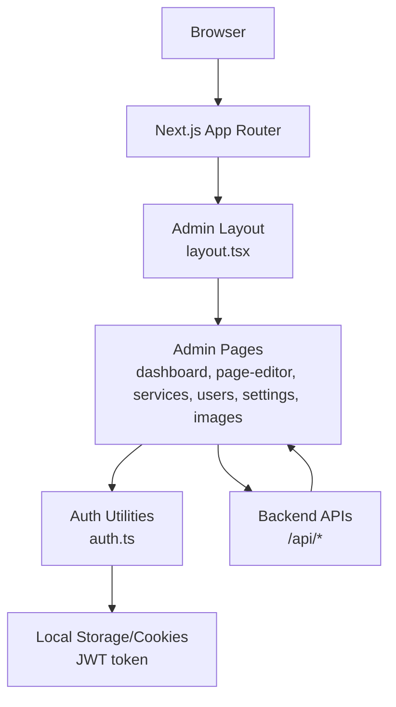

**Diagram sources**
- [layout.tsx](file://src/app/admin/layout.tsx#L1-L23)
- [auth.ts](file://src/lib/auth.ts#L1-L85)
- [dashboard/page.tsx](file://src/app/admin/dashboard/page.tsx#L1-L197)
- [page-editor/page.tsx](file://src/app/admin/page-editor/page.tsx#L1-L14)
- [services/page.tsx](file://src/app/admin/services/page.tsx#L1-L144)
- [users/page.tsx](file://src/app/admin/users/page.tsx#L1-L152)
- [settings/page.tsx](file://src/app/admin/settings/page.tsx#L1-L265)
- [images/page.tsx](file://src/app/admin/images/page.tsx#L1-L480)

## Detailed Component Analysis

### Authentication System
- JWT-based login: The authentication utility generates a signed token containing user identity and role, with a fixed expiration. Verification decodes and validates the token against the configured secret.
- Credential validation: The system authenticates hardcoded admin credentials and returns a token upon successful match.
- Role checks: Helpers determine whether a user qualifies as admin based on role membership.
- Session management: The middleware currently allows all admin routes without enforcing authentication. In a deployed environment, the middleware should enforce token validation and redirect unauthenticated users.

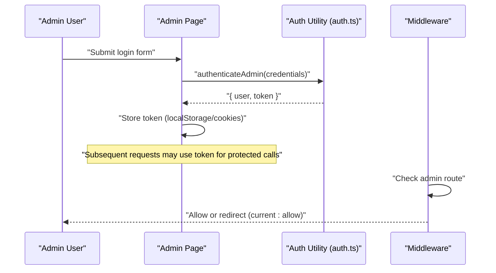

**Diagram sources**
- [auth.ts](file://src/lib/auth.ts#L62-L79)
- [middleware.ts](file://middleware.ts#L4-L7)

**Section sources**
- [auth.ts](file://src/lib/auth.ts#L1-L85)
- [middleware.ts](file://middleware.ts#L1-L15)

### Dashboard
- Purpose: Central hub displaying statistics, recent activities, and quick actions.
- Features:
  - Stat cards for users, services, projects, and blog posts.
  - Recent activity feed with categorized events.
  - Quick actions for adding content.
  - Page editor quick start component.

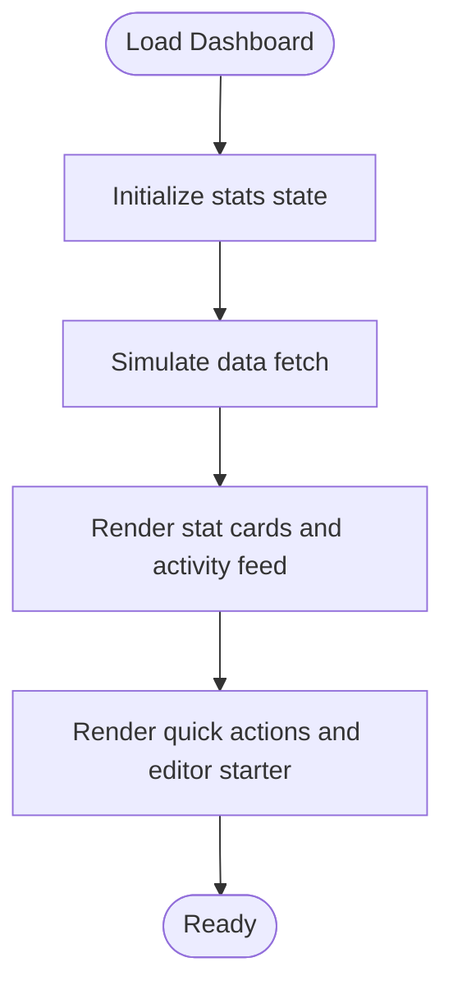

**Diagram sources**
- [dashboard/page.tsx](file://src/app/admin/dashboard/page.tsx#L13-L39)

**Section sources**
- [dashboard/page.tsx](file://src/app/admin/dashboard/page.tsx#L1-L197)

### Page Editor
- Purpose: Rich editing interface for page content.
- Features:
  - Dedicated page component that hosts the editor component.
  - Full-screen layout with centered content area.

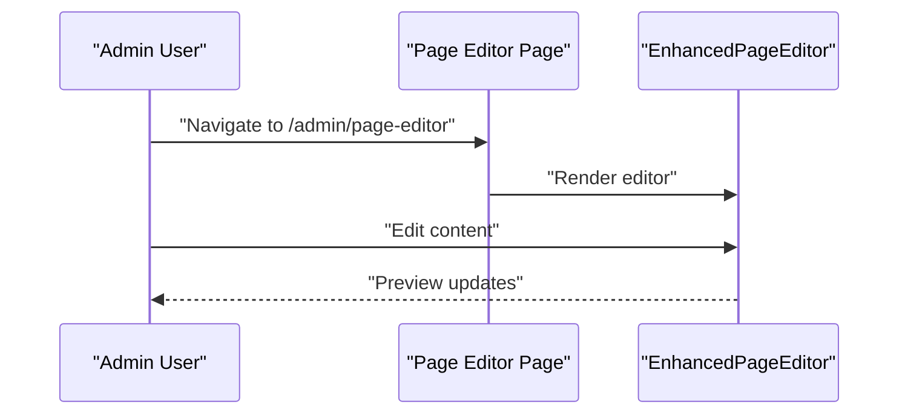

**Diagram sources**
- [page-editor/page.tsx](file://src/app/admin/page-editor/page.tsx#L1-L14)

**Section sources**
- [page-editor/page.tsx](file://src/app/admin/page-editor/page.tsx#L1-L14)

### Services Management
- Purpose: Manage service offerings with filtering and inline actions.
- Features:
  - Search by name/description.
  - Category filtering.
  - Service cards with status badges and action buttons.
  - Empty state handling.

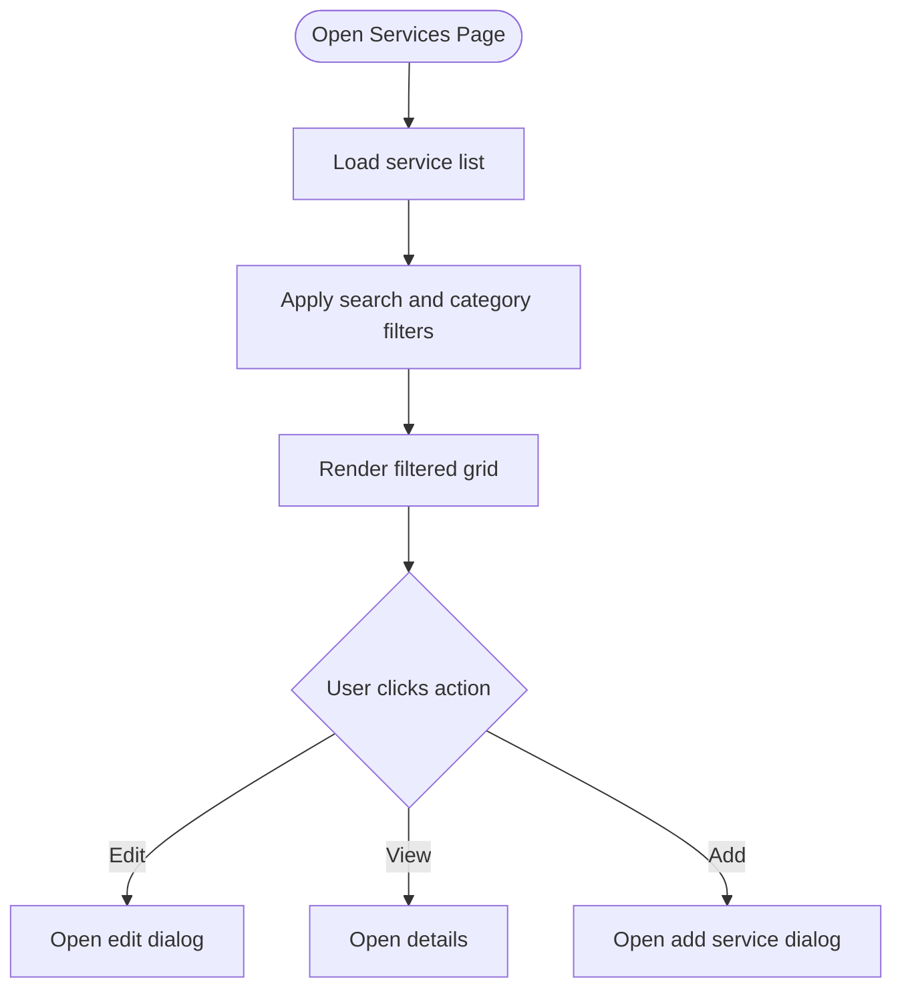

**Diagram sources**
- [services/page.tsx](file://src/app/admin/services/page.tsx#L14-L60)

**Section sources**
- [services/page.tsx](file://src/app/admin/services/page.tsx#L1-L144)

### Users Management
- Purpose: Manage users, roles, and statuses.
- Features:
  - Search by name/email.
  - Table view with avatar initials and status badges.
  - Inline actions for editing and deletion.

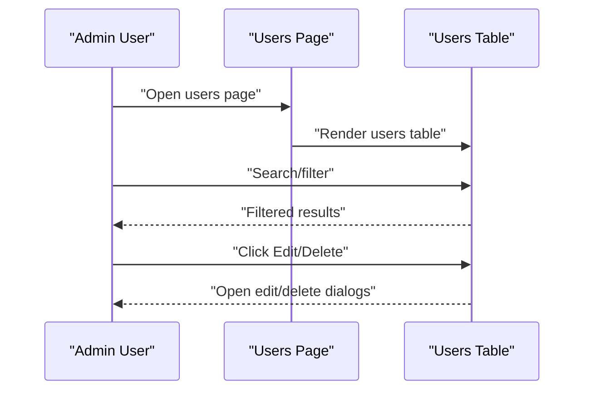

**Diagram sources**
- [users/page.tsx](file://src/app/admin/users/page.tsx#L14-L47)

**Section sources**
- [users/page.tsx](file://src/app/admin/users/page.tsx#L1-L152)

### Settings
- Purpose: Configure general site settings, social media links, SEO metadata, and security.
- Features:
  - Tabbed interface for different setting categories.
  - Controlled forms for each setting.
  - Save handler for persisting changes.

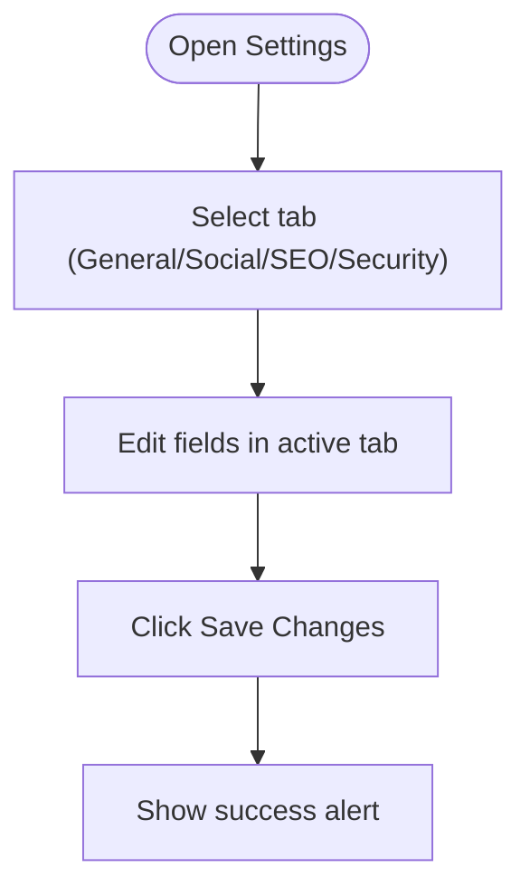

**Diagram sources**
- [settings/page.tsx](file://src/app/admin/settings/page.tsx#L25-L47)

**Section sources**
- [settings/page.tsx](file://src/app/admin/settings/page.tsx#L1-L265)

### Images Management
- Purpose: Upload, scan, manage, and optimize images with metadata and SEO insights.
- Features:
  - Image grid with thumbnails and SEO badges.
  - Search and sorting controls.
  - Pagination.
  - Modals for upload, edit, and detail views.
  - Background scanning of existing images.
  - Integration with backend APIs for listing, uploading, updating, deleting, and scanning.

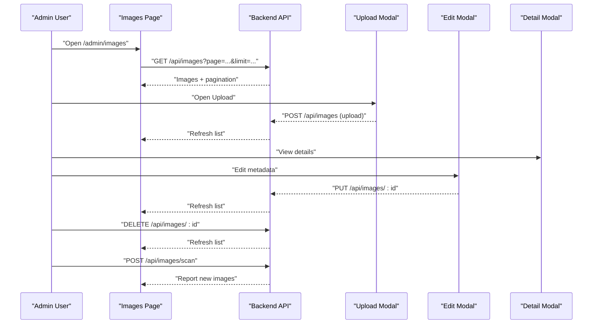

**Diagram sources**
- [images/page.tsx](file://src/app/admin/images/page.tsx#L36-L84)
- [images/page.tsx](file://src/app/admin/images/page.tsx#L106-L124)
- [images/page.tsx](file://src/app/admin/images/page.tsx#L147-L165)

**Section sources**
- [images/page.tsx](file://src/app/admin/images/page.tsx#L1-L480)

### Navigation and Layout
- Layout structure: Header and sidebar are composed in the admin layout, with the main content area rendering the active page.
- Navigation: Pages are accessed via admin routes (e.g., dashboard, page-editor, services, users, settings, images).

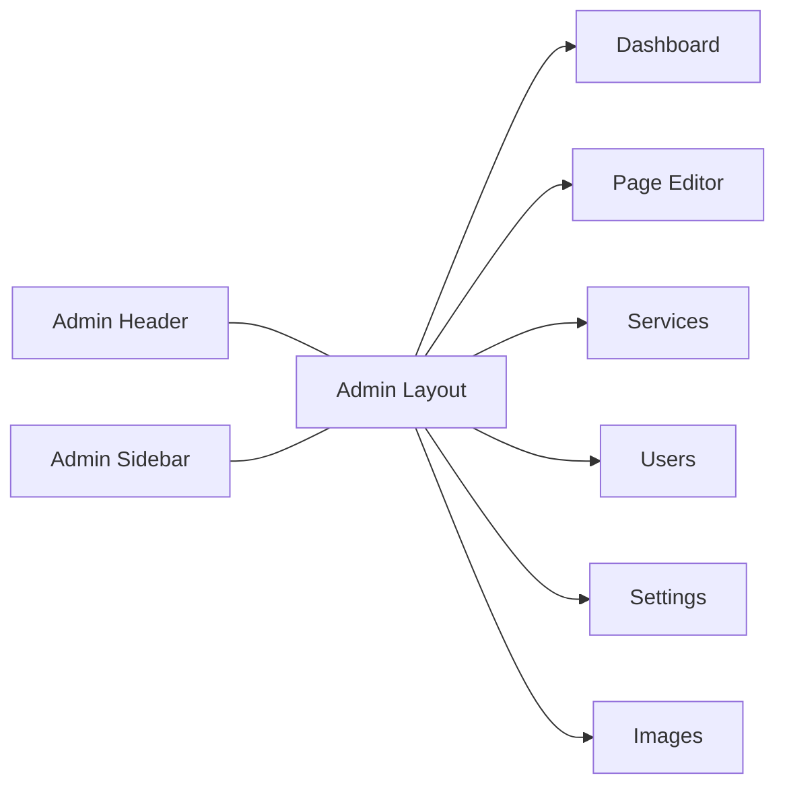

**Diagram sources**
- [layout.tsx](file://src/app/admin/layout.tsx#L3-L19)

**Section sources**
- [layout.tsx](file://src/app/admin/layout.tsx#L1-L23)

## Dependency Analysis
- Pages depend on shared UI components and modals for specific tasks (e.g., image modals).
- Authentication utilities are used by pages to coordinate login flows and role checks.
- Middleware guards admin routes; in the current setup, it allows all admin paths without enforcement.
- Pages integrate with backend APIs for data operations (listing, uploading, updating, deleting, scanning).

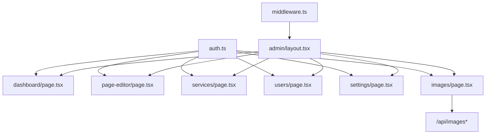

**Diagram sources**
- [auth.ts](file://src/lib/auth.ts#L1-L85)
- [middleware.ts](file://middleware.ts#L1-L15)
- [layout.tsx](file://src/app/admin/layout.tsx#L1-L23)
- [dashboard/page.tsx](file://src/app/admin/dashboard/page.tsx#L1-L197)
- [page-editor/page.tsx](file://src/app/admin/page-editor/page.tsx#L1-L14)
- [services/page.tsx](file://src/app/admin/services/page.tsx#L1-L144)
- [users/page.tsx](file://src/app/admin/users/page.tsx#L1-L152)
- [settings/page.tsx](file://src/app/admin/settings/page.tsx#L1-L265)
- [images/page.tsx](file://src/app/admin/images/page.tsx#L1-L480)

**Section sources**
- [auth.ts](file://src/lib/auth.ts#L1-L85)
- [middleware.ts](file://middleware.ts#L1-L15)
- [layout.tsx](file://src/app/admin/layout.tsx#L1-L23)
- [images/page.tsx](file://src/app/admin/images/page.tsx#L68-L80)

## Performance Considerations
- Client-side filtering and sorting: Prefer server-side pagination and filtering for large datasets to reduce payload sizes and improve responsiveness.
- Image previews: Lazy-load thumbnails and use appropriate image sizes to minimize bandwidth and render times.
- Debounced search: Apply debouncing to search inputs to avoid frequent API calls during typing.
- Token storage: Store tokens securely (e.g., httpOnly cookies) and consider short-lived tokens with refresh mechanisms for production deployments.

## Troubleshooting Guide
- Authentication failures:
  - Verify JWT secret configuration and token validity.
  - Ensure login credentials match the expected values and that the token is persisted and sent with protected requests.
- Middleware not enforcing auth:
  - Confirm middleware is enabled and configured to protect admin routes; adjust logic to validate tokens and redirect unauthorized users.
- API errors:
  - Check network tab for failed requests to backend endpoints.
  - Validate query parameters for listing and scanning operations.
- Image management issues:
  - Confirm upload modal triggers the correct endpoint and that the list refreshes after successful operations.
  - Review error handling for delete operations and confirm user confirmation prompts.

**Section sources**
- [auth.ts](file://src/lib/auth.ts#L48-L59)
- [middleware.ts](file://middleware.ts#L4-L7)
- [images/page.tsx](file://src/app/admin/images/page.tsx#L106-L124)
- [images/page.tsx](file://src/app/admin/images/page.tsx#L147-L165)

## Conclusion
The admin dashboard for attechglobal.com provides a structured, modular interface for managing website content. It leverages Next.js App Router for routing, client-side components for UI, and a centralized authentication utility for JWT-based login and role checks. While the middleware is currently disabled for static hosting, the architecture supports secure deployment with enforced admin access. The pages implement consistent UI patterns, form handling, and integration with backend APIs, enabling non-technical users to manage services, users, settings, and images effectively.