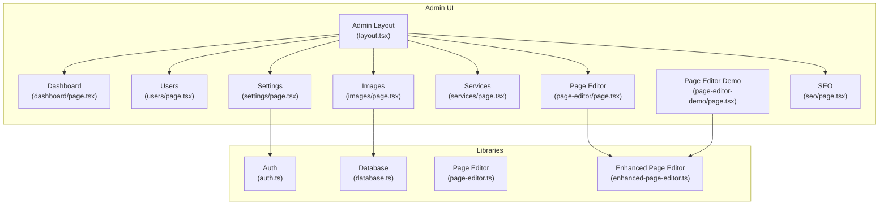
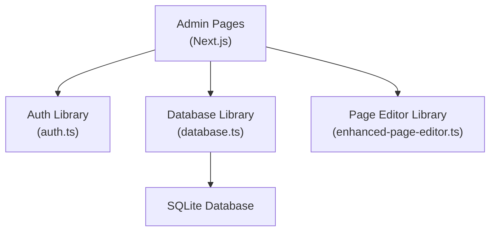
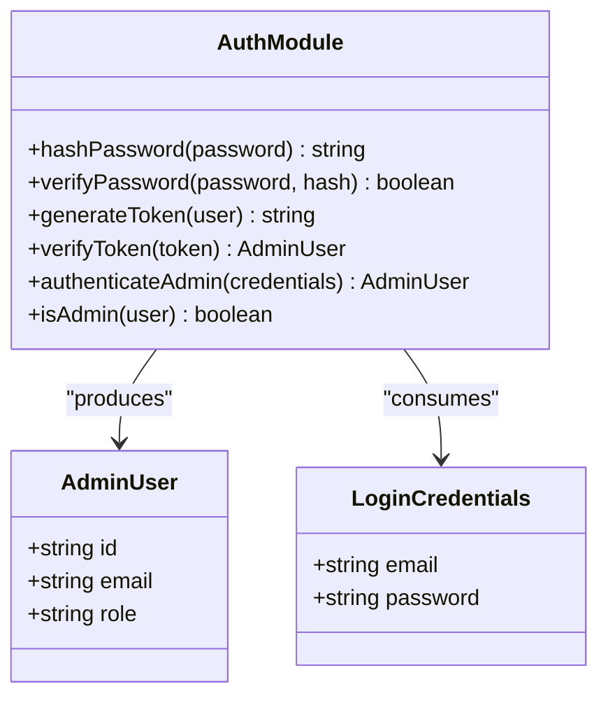
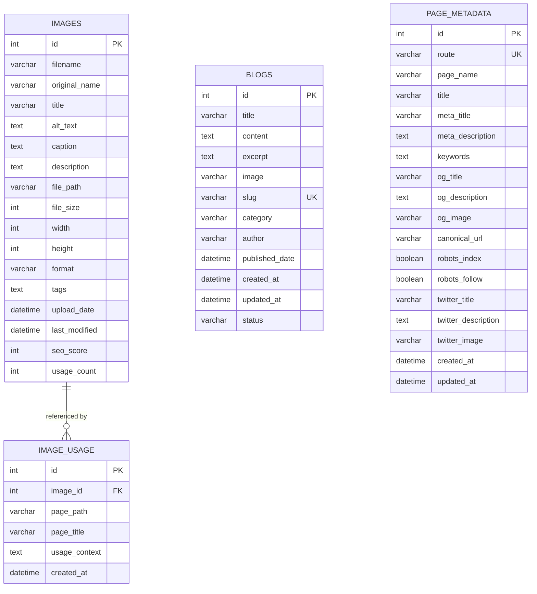
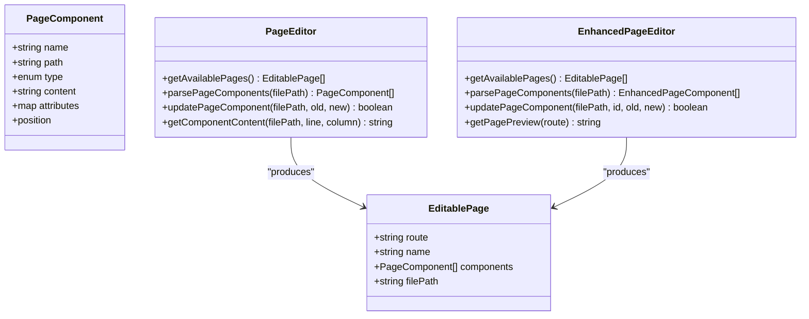
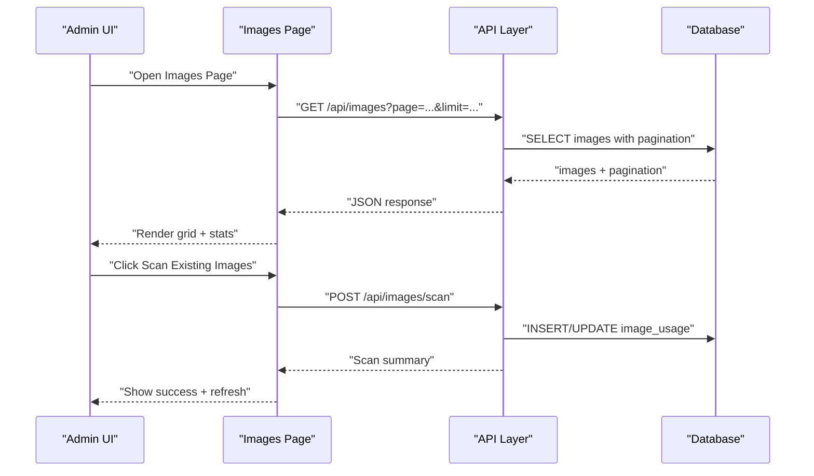
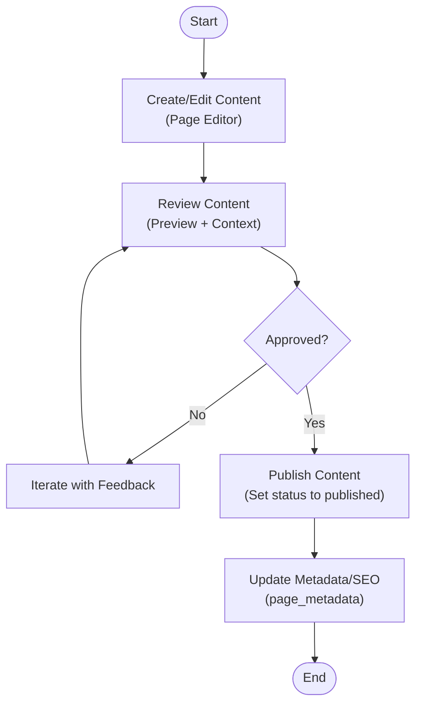
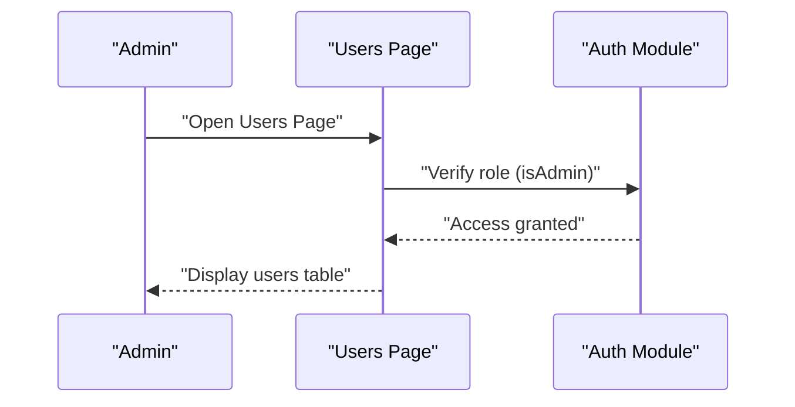
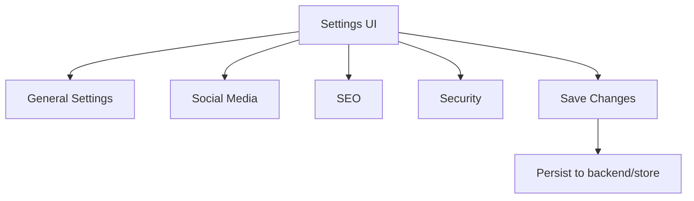
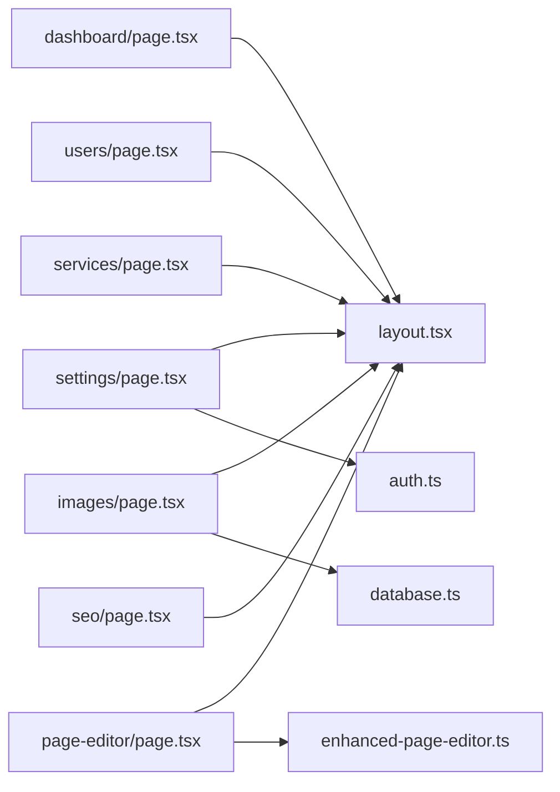

# Administrative Workflows

<cite>
**Referenced Files in This Document**
- [auth.ts](file://src/lib/auth.ts)
- [database.ts](file://src/lib/database.ts)
- [page-editor.ts](file://src/lib/page-editor.ts)
- [enhanced-page-editor.ts](file://src/lib/enhanced-page-editor.ts)
- [layout.tsx](file://src/app/admin/layout.tsx)
- [dashboard/page.tsx](file://src/app/admin/dashboard/page.tsx)
- [users/page.tsx](file://src/app/admin/users/page.tsx)
- [settings/page.tsx](file://src/app/admin/settings/page.tsx)
- [images/page.tsx](file://src/app/admin/images/page.tsx)
- [services/page.tsx](file://src/app/admin/services/page.tsx)
- [page-editor/page.tsx](file://src/app/admin/page-editor/page.tsx)
- [page-editor-demo/page.tsx](file://src/app/admin/page-editor-demo/page.tsx)
- [seo/page.tsx](file://src/app/admin/seo/page.tsx)
</cite>

## Table of Contents
1. [Introduction](#introduction)
2. [Project Structure](#project-structure)
3. [Core Components](#core-components)
4. [Architecture Overview](#architecture-overview)
5. [Detailed Component Analysis](#detailed-component-analysis)
6. [Dependency Analysis](#dependency-analysis)
7. [Performance Considerations](#performance-considerations)
8. [Troubleshooting Guide](#troubleshooting-guide)
9. [Conclusion](#conclusion)
10. [Appendices](#appendices)

## Introduction
This document explains the administrative workflows for operating the website via the admin interface. It covers content creation and editing, approval and publishing patterns, user management with roles and permissions, settings configuration, system maintenance, and reporting capabilities. It also documents integration points across modules, cross-module data sharing, and workflow coordination to streamline content management operations.

## Project Structure
The admin interface is built as a Next.js app under the src/app/admin namespace. It is composed of:
- A shared admin layout that renders header and sidebar consistently
- Feature pages for dashboard, users, settings, images, services, page editor, and SEO
- Shared libraries for authentication, database access, and page editing

**Diagram sources**
- [layout.tsx](file://src/app/admin/layout.tsx#L1-L23)
- [dashboard/page.tsx](file://src/app/admin/dashboard/page.tsx#L1-L197)
- [users/page.tsx](file://src/app/admin/users/page.tsx#L1-L152)
- [settings/page.tsx](file://src/app/admin/settings/page.tsx#L1-L265)
- [images/page.tsx](file://src/app/admin/images/page.tsx#L1-L480)
- [services/page.tsx](file://src/app/admin/services/page.tsx#L1-L144)
- [page-editor/page.tsx](file://src/app/admin/page-editor/page.tsx#L1-L14)
- [page-editor-demo/page.tsx](file://src/app/admin/page-editor-demo/page.tsx#L1-L173)
- [seo/page.tsx](file://src/app/admin/seo/page.tsx#L1-L14)
- [auth.ts](file://src/lib/auth.ts#L1-L85)
- [database.ts](file://src/lib/database.ts#L1-L255)
- [page-editor.ts](file://src/lib/page-editor.ts#L1-L194)
- [enhanced-page-editor.ts](file://src/lib/enhanced-page-editor.ts#L1-L287)

**Section sources**
- [layout.tsx](file://src/app/admin/layout.tsx#L1-L23)
- [dashboard/page.tsx](file://src/app/admin/dashboard/page.tsx#L1-L197)
- [users/page.tsx](file://src/app/admin/users/page.tsx#L1-L152)
- [settings/page.tsx](file://src/app/admin/settings/page.tsx#L1-L265)
- [images/page.tsx](file://src/app/admin/images/page.tsx#L1-L480)
- [services/page.tsx](file://src/app/admin/services/page.tsx#L1-L144)
- [page-editor/page.tsx](file://src/app/admin/page-editor/page.tsx#L1-L14)
- [page-editor-demo/page.tsx](file://src/app/admin/page-editor-demo/page.tsx#L1-L173)
- [seo/page.tsx](file://src/app/admin/seo/page.tsx#L1-L14)
- [auth.ts](file://src/lib/auth.ts#L1-L85)
- [database.ts](file://src/lib/database.ts#L1-L255)
- [page-editor.ts](file://src/lib/page-editor.ts#L1-L194)
- [enhanced-page-editor.ts](file://src/lib/enhanced-page-editor.ts#L1-L287)

## Core Components
- Authentication and Authorization: Provides admin login, token generation/verification, and role checks.
- Database Layer: Defines schema for images, image usage, blogs, and page metadata; exposes helpers for CRUD operations.
- Page Editors: Two editors are available—basic page-editor and enhanced-page-editor—to parse, locate, and update page components.
- Admin Pages: Dashboard, Users, Settings, Images, Services, Page Editor, and SEO dashboards.

Key responsibilities:
- Authentication: Manage admin sessions and enforce role-based access.
- Data Access: Provide typed interfaces and helper functions for database operations.
- Editing: Locate editable components in page files and apply updates safely.
- Admin UI: Present management surfaces for content, users, settings, and SEO.

**Section sources**
- [auth.ts](file://src/lib/auth.ts#L1-L85)
- [database.ts](file://src/lib/database.ts#L18-L184)
- [page-editor.ts](file://src/lib/page-editor.ts#L23-L194)
- [enhanced-page-editor.ts](file://src/lib/enhanced-page-editor.ts#L26-L287)
- [dashboard/page.tsx](file://src/app/admin/dashboard/page.tsx#L1-L197)
- [users/page.tsx](file://src/app/admin/users/page.tsx#L1-L152)
- [settings/page.tsx](file://src/app/admin/settings/page.tsx#L1-L265)
- [images/page.tsx](file://src/app/admin/images/page.tsx#L1-L480)
- [services/page.tsx](file://src/app/admin/services/page.tsx#L1-L144)
- [page-editor/page.tsx](file://src/app/admin/page-editor/page.tsx#L1-L14)
- [page-editor-demo/page.tsx](file://src/app/admin/page-editor-demo/page.tsx#L1-L173)
- [seo/page.tsx](file://src/app/admin/seo/page.tsx#L1-L14)

## Architecture Overview
The admin architecture follows a layered design:
- UI Layer: Next.js app pages under src/app/admin
- Domain Layer: Libraries for auth, database, and page editing
- Persistence Layer: SQLite database with typed models

**Diagram sources**
- [auth.ts](file://src/lib/auth.ts#L1-L85)
- [database.ts](file://src/lib/database.ts#L1-L255)
- [enhanced-page-editor.ts](file://src/lib/enhanced-page-editor.ts#L1-L287)

## Detailed Component Analysis

### Authentication and Authorization
The auth module defines admin credentials, hashing, token generation/verification, and role checks. It supports super_admin and admin roles and integrates with JWT.

**Diagram sources**
- [auth.ts](file://src/lib/auth.ts#L13-L84)

Operational notes:
- Admin login produces a signed JWT with a configurable expiration.
- Role checks determine access to admin features.
- Production deployments should externalize secrets and enforce secure storage.

**Section sources**
- [auth.ts](file://src/lib/auth.ts#L1-L85)

### Database Schema and Data Access
The database library defines four primary tables:
- images: stores image metadata and SEO metrics
- image_usage: tracks where images are used across pages
- blogs: stores blog posts with status and timestamps
- page_metadata: stores per-route SEO metadata

**Diagram sources**
- [database.ts](file://src/lib/database.ts#L18-L81)
- [database.ts](file://src/lib/database.ts#L100-L184)

Data access patterns:
- Initialization ensures tables exist and exposes helpers for run/query operations.
- Typed interfaces support safe manipulation of domain entities.

**Section sources**
- [database.ts](file://src/lib/database.ts#L1-L255)

### Page Editor and Enhanced Page Editor
Two editors are available:
- Basic PageEditor: parses page files to extract text, images, and links and supports simple replacements.
- EnhancedPageEditor: improves parsing with context-aware component detection, categorization (title, subtitle, description), and safer updates.

**Diagram sources**
- [page-editor.ts](file://src/lib/page-editor.ts#L4-L75)
- [enhanced-page-editor.ts](file://src/lib/enhanced-page-editor.ts#L4-L76)

Workflow highlights:
- Component discovery scans page files for editable content and positions.
- Updates are applied with awareness of context to minimize unintended changes.
- Preview capability supports validation before saving.

**Section sources**
- [page-editor.ts](file://src/lib/page-editor.ts#L1-L194)
- [enhanced-page-editor.ts](file://src/lib/enhanced-page-editor.ts#L1-L287)

### Admin Pages: Dashboard, Users, Settings, Images, Services, SEO
- Dashboard: Shows summary statistics and recent activities; integrates quick actions and page editor quick start.
- Users: Lists users, supports search and basic actions (edit/delete).
- Settings: General, Social Media, SEO, and Security tabs for configuration.
- Images: Manages images, metadata, scanning, and SEO dashboard.
- Services: Manages service listings with filtering and pricing info.
- SEO: Renders an SEO dashboard component.

**Diagram sources**
- [images/page.tsx](file://src/app/admin/images/page.tsx#L55-L165)
- [database.ts](file://src/lib/database.ts#L100-L184)

**Section sources**
- [dashboard/page.tsx](file://src/app/admin/dashboard/page.tsx#L1-L197)
- [users/page.tsx](file://src/app/admin/users/page.tsx#L1-L152)
- [settings/page.tsx](file://src/app/admin/settings/page.tsx#L1-L265)
- [images/page.tsx](file://src/app/admin/images/page.tsx#L1-L480)
- [services/page.tsx](file://src/app/admin/services/page.tsx#L1-L144)
- [seo/page.tsx](file://src/app/admin/seo/page.tsx#L1-L14)

### Workflow Patterns: Content Creation, Approval, Publishing
Common administrative scenarios:
- Content creation: Use the Page Editor to add or modify text, images, and links on target pages.
- Approval workflow: For sensitive content, implement staged statuses (draft/pending/approved) and require approvals before publishing.
- Publishing workflow: Transition content to published state after review; update page metadata and SEO accordingly.

[No sources needed since this diagram shows conceptual workflow, not actual code structure]

### User Management: Roles, Permissions, Audit Trails
- Roles: super_admin and admin are supported; role checks gate access to admin features.
- Permissions: Administrators can manage users, content, and settings; regular users are not exposed in the admin UI.
- Audit trails: Track user actions (e.g., recent activities) and maintain logs of edits and changes.

**Diagram sources**
- [users/page.tsx](file://src/app/admin/users/page.tsx#L1-L152)
- [auth.ts](file://src/lib/auth.ts#L82-L84)

**Section sources**
- [auth.ts](file://src/lib/auth.ts#L1-L85)
- [users/page.tsx](file://src/app/admin/users/page.tsx#L1-L152)

### Settings Configuration and System Maintenance
- General settings: Site name, description, contact details.
- Social media: Platform URLs.
- SEO: Meta titles, descriptions, and keywords.
- Security: Password change area.
- System maintenance: Image scanning to reconcile filesystem and database entries.

**Diagram sources**
- [settings/page.tsx](file://src/app/admin/settings/page.tsx#L1-L265)

**Section sources**
- [settings/page.tsx](file://src/app/admin/settings/page.tsx#L1-L265)

### Administrative Reporting Features
- Dashboard cards: Total users, services, projects, blog posts.
- Image management: Stats for total images, average SEO score, missing alt text, and total usage.
- Recent activities: Timeline of user actions and content changes.

**Section sources**
- [dashboard/page.tsx](file://src/app/admin/dashboard/page.tsx#L1-L197)
- [images/page.tsx](file://src/app/admin/images/page.tsx#L220-L276)

## Dependency Analysis
The admin pages depend on shared libraries for authentication, database access, and page editing. The images page interacts with the database to manage image records and usage.

**Diagram sources**
- [layout.tsx](file://src/app/admin/layout.tsx#L1-L23)
- [dashboard/page.tsx](file://src/app/admin/dashboard/page.tsx#L1-L197)
- [users/page.tsx](file://src/app/admin/users/page.tsx#L1-L152)
- [settings/page.tsx](file://src/app/admin/settings/page.tsx#L1-L265)
- [images/page.tsx](file://src/app/admin/images/page.tsx#L1-L480)
- [services/page.tsx](file://src/app/admin/services/page.tsx#L1-L144)
- [page-editor/page.tsx](file://src/app/admin/page-editor/page.tsx#L1-L14)
- [seo/page.tsx](file://src/app/admin/seo/page.tsx#L1-L14)
- [auth.ts](file://src/lib/auth.ts#L1-L85)
- [database.ts](file://src/lib/database.ts#L1-L255)
- [enhanced-page-editor.ts](file://src/lib/enhanced-page-editor.ts#L1-L287)

**Section sources**
- [layout.tsx](file://src/app/admin/layout.tsx#L1-L23)
- [dashboard/page.tsx](file://src/app/admin/dashboard/page.tsx#L1-L197)
- [users/page.tsx](file://src/app/admin/users/page.tsx#L1-L152)
- [settings/page.tsx](file://src/app/admin/settings/page.tsx#L1-L265)
- [images/page.tsx](file://src/app/admin/images/page.tsx#L1-L480)
- [services/page.tsx](file://src/app/admin/services/page.tsx#L1-L144)
- [page-editor/page.tsx](file://src/app/admin/page-editor/page.tsx#L1-L14)
- [seo/page.tsx](file://src/app/admin/seo/page.tsx#L1-L14)
- [auth.ts](file://src/lib/auth.ts#L1-L85)
- [database.ts](file://src/lib/database.ts#L1-L255)
- [enhanced-page-editor.ts](file://src/lib/enhanced-page-editor.ts#L1-L287)

## Performance Considerations
- Pagination: Use pagination in lists (e.g., images) to avoid loading large datasets at once.
- Debounced search: Apply debouncing for search inputs to reduce unnecessary requests.
- Lazy loading: Load modals and heavy components on demand.
- Efficient queries: Use indexed columns (e.g., slug for blogs, route for page metadata) to optimize lookups.
- Caching: Cache frequently accessed configuration and metadata in memory or at the edge.

[No sources needed since this section provides general guidance]

## Troubleshooting Guide
- Authentication failures: Verify JWT secret and admin credentials; ensure tokens are present and unexpired.
- Database initialization errors: Confirm data directory exists and database file is writable; check table creation logs.
- Page editor errors: Ensure page files exist and are readable; verify component parsing patterns match actual JSX.
- Image scanning issues: Confirm filesystem paths align with database records; check for permission errors.

**Section sources**
- [auth.ts](file://src/lib/auth.ts#L48-L59)
- [database.ts](file://src/lib/database.ts#L84-L97)
- [enhanced-page-editor.ts](file://src/lib/enhanced-page-editor.ts#L78-L100)

## Conclusion
The admin interface provides a cohesive set of tools for content creation, user management, settings configuration, and system maintenance. By leveraging structured workflows, role-based access, and integrated page editing, administrators can efficiently manage the website while maintaining quality and SEO standards.

[No sources needed since this section summarizes without analyzing specific files]

## Appendices
- Practical scenarios:
  - Bulk content updates: Use the Page Editor to batch-edit repeated content across pages.
  - SEO optimization: Use the Images page to identify missing alt texts and improve SEO scores.
  - User onboarding: Use the Users page to invite and manage contributors with appropriate roles.
- Automation tips:
  - Schedule periodic image scans to keep metadata synchronized.
  - Automate publishing workflows by integrating draft-to-published transitions with CI/CD hooks.
- Efficiency optimization:
  - Preload frequently visited admin pages.
  - Minimize DOM updates during bulk edits.
  - Use filters and search to narrow down large datasets.

[No sources needed since this section provides general guidance]