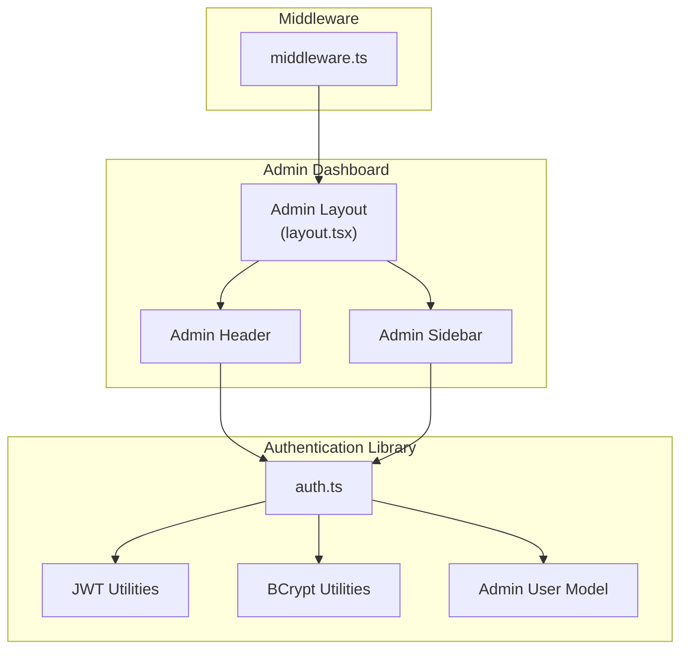
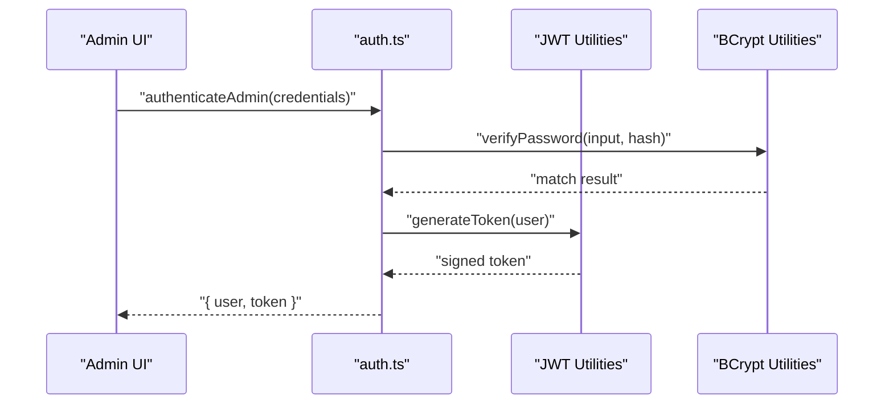
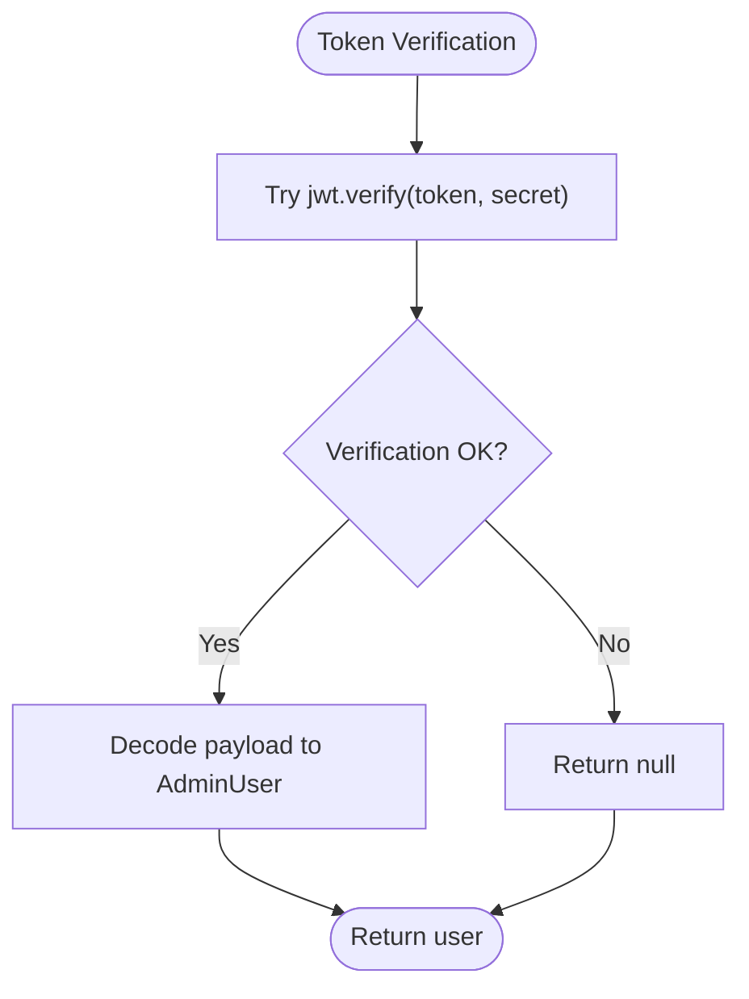
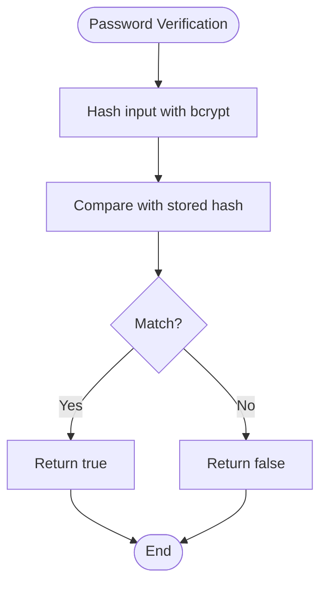
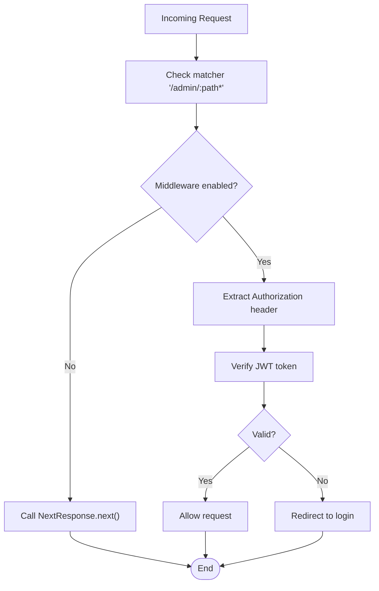
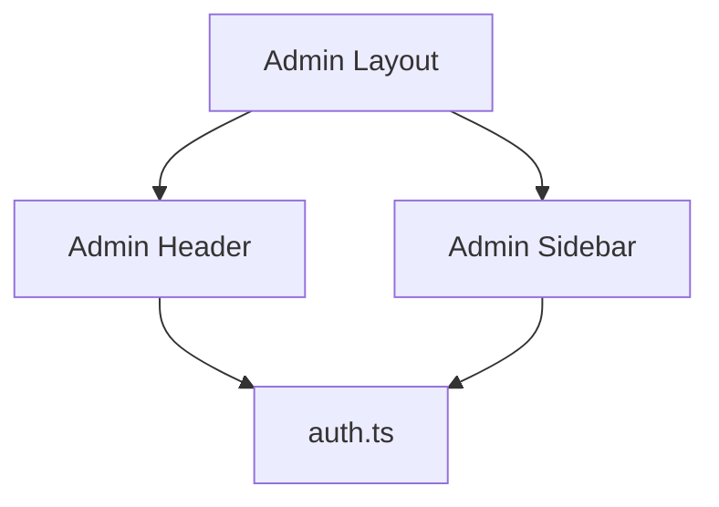
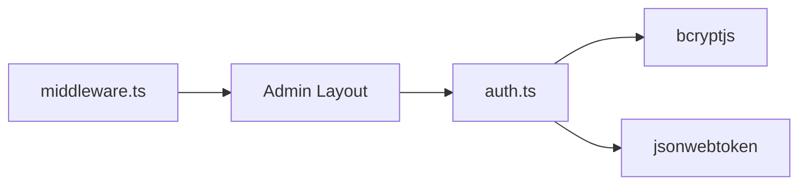

# Authentication System

<cite>
**Referenced Files in This Document**
- [auth.ts](file://src/lib/auth.ts)
- [layout.tsx](file://src/app/admin/layout.tsx)
- [middleware.ts](file://middleware.ts)
</cite>

## Table of Contents
1. [Introduction](#introduction)
2. [Project Structure](#project-structure)
3. [Core Components](#core-components)
4. [Architecture Overview](#architecture-overview)
5. [Detailed Component Analysis](#detailed-component-analysis)
6. [Dependency Analysis](#dependency-analysis)
7. [Performance Considerations](#performance-considerations)
8. [Troubleshooting Guide](#troubleshooting-guide)
9. [Conclusion](#conclusion)

## Introduction
This document explains the authentication system for attechglobal.com's admin dashboard. It focuses on JWT-based authentication, password hashing with bcrypt, session management, and role-based access control. It also documents the login flow, middleware integration for route protection, and secure token storage strategies. Practical examples and security best practices are included to guide implementation and troubleshooting.

## Project Structure
The authentication system is primarily implemented in a dedicated library module and integrated into the admin layout. The middleware configuration currently disables server-side route protection for static hosting compatibility.



**Diagram sources**
- [layout.tsx](file://src/app/admin/layout.tsx#L1-L23)
- [auth.ts](file://src/lib/auth.ts#L1-L85)
- [middleware.ts](file://middleware.ts#L1-L15)

**Section sources**
- [layout.tsx](file://src/app/admin/layout.tsx#L1-L23)
- [auth.ts](file://src/lib/auth.ts#L1-L85)
- [middleware.ts](file://middleware.ts#L1-L15)

## Core Components
- JWT utilities: Token generation and verification with expiration handling.
- BCrypt utilities: Password hashing and verification for secure credential storage.
- Admin user model: Structured representation of admin users with roles.
- Middleware: Route protection configuration (currently disabled for static hosting).
- Admin layout: Provides the admin UI shell where authentication state is consumed.

Key responsibilities:
- Token lifecycle: Creation, validation, and role-based access checks.
- Credential handling: Secure hashing and comparison of passwords.
- Session management: Stateless JWT tokens stored in the browser.
- Access control: Role-based permissions for admin routes.

**Section sources**
- [auth.ts](file://src/lib/auth.ts#L11-L17)
- [auth.ts](file://src/lib/auth.ts#L24-L32)
- [auth.ts](file://src/lib/auth.ts#L34-L59)
- [auth.ts](file://src/lib/auth.ts#L61-L84)
- [layout.tsx](file://src/app/admin/layout.tsx#L1-L23)
- [middleware.ts](file://middleware.ts#L4-L8)

## Architecture Overview
The authentication system follows a client-side JWT pattern:
- The admin UI requests credentials via a login form.
- On successful validation, the backend returns a signed JWT.
- The client stores the token and includes it in subsequent requests.
- The middleware (disabled for static hosting) would enforce route protection and extract user claims from the token.



**Diagram sources**
- [auth.ts](file://src/lib/auth.ts#L34-L79)
- [auth.ts](file://src/lib/auth.ts#L24-L32)

## Detailed Component Analysis

### JWT Utilities
- Token generation: Creates a signed JWT with user identity and role, configured for 24-hour expiration.
- Token verification: Validates the token signature and decodes user claims; returns null on failure.
- Role-based access: Helper to check if a user has administrative privileges.



**Diagram sources**
- [auth.ts](file://src/lib/auth.ts#L47-L59)

**Section sources**
- [auth.ts](file://src/lib/auth.ts#L34-L59)
- [auth.ts](file://src/lib/auth.ts#L81-L84)

### BCrypt Utilities
- Password hashing: Generates a salted hash for secure credential storage.
- Password verification: Compares an input against a stored hash.



**Diagram sources**
- [auth.ts](file://src/lib/auth.ts#L24-L32)

**Section sources**
- [auth.ts](file://src/lib/auth.ts#L24-L32)

### Admin User Model and Authentication Flow
- AdminUser interface defines the shape of authenticated admin identities.
- authenticateAdmin validates credentials and returns a signed token upon success.
- isAdmin checks role-based access for protected routes.

```mermaid
classDiagram
class AdminUser {
+string id
+string email
+string role
}
class LoginCredentials {
+string email
+string password
}
class AuthLibrary {
+hashPassword(password) string
+verifyPassword(password, hash) boolean
+generateToken(user) string
+verifyToken(token) AdminUser|null
+authenticateAdmin(credentials) {user, token}|null
+isAdmin(user) boolean
}
AuthLibrary --> AdminUser : "returns"
AuthLibrary --> LoginCredentials : "consumes"
```

**Diagram sources**
- [auth.ts](file://src/lib/auth.ts#L13-L22)
- [auth.ts](file://src/lib/auth.ts#L34-L84)

**Section sources**
- [auth.ts](file://src/lib/auth.ts#L13-L22)
- [auth.ts](file://src/lib/auth.ts#L61-L79)
- [auth.ts](file://src/lib/auth.ts#L81-L84)

### Middleware Integration for Route Protection
- The middleware configuration targets admin routes for future protection.
- Currently disabled for static hosting environments that lack server-side processing.



**Diagram sources**
- [middleware.ts](file://middleware.ts#L4-L8)
- [middleware.ts](file://middleware.ts#L10-L14)

**Section sources**
- [middleware.ts](file://middleware.ts#L4-L8)
- [middleware.ts](file://middleware.ts#L10-L14)

### Admin Layout Integration
- The admin layout composes the header and sidebar, providing the container where authentication state is used to render protected content.



**Diagram sources**
- [layout.tsx](file://src/app/admin/layout.tsx#L3-L4)
- [layout.tsx](file://src/app/admin/layout.tsx#L6-L22)
- [auth.ts](file://src/lib/auth.ts#L1-L85)

**Section sources**
- [layout.tsx](file://src/app/admin/layout.tsx#L1-L23)

## Dependency Analysis
- auth.ts depends on bcryptjs for password hashing and jsonwebtoken for JWT operations.
- The admin layout imports UI components that consume authentication state.
- middleware.ts configures route protection for admin paths.



**Diagram sources**
- [auth.ts](file://src/lib/auth.ts#L1-L2)
- [layout.tsx](file://src/app/admin/layout.tsx#L3-L4)
- [middleware.ts](file://middleware.ts#L10-L14)

**Section sources**
- [auth.ts](file://src/lib/auth.ts#L1-L2)
- [layout.tsx](file://src/app/admin/layout.tsx#L3-L4)
- [middleware.ts](file://middleware.ts#L10-L14)

## Performance Considerations
- Token expiration: 24-hour expiry balances usability and security; consider shorter expirations for higher-risk operations.
- Hashing cost: bcrypt cost factor is set to a balanced value; adjust based on server capabilities.
- Middleware overhead: Keep middleware checks minimal; defer heavy operations to API handlers.
- Storage efficiency: Store only necessary claims in the token to reduce payload size.

## Troubleshooting Guide
Common issues and resolutions:
- Invalid token errors: Occur when the token signature is invalid or expired; re-authenticate the user.
- Role-based access failures: Ensure the user role matches expected values; verify the role claim in the token.
- Static hosting limitations: The middleware is disabled; implement client-side route guards if needed.
- Password mismatch: Confirm the input password matches the stored hash; avoid plain-text comparisons.

Practical steps:
- Validate token signature and expiration before granting access.
- Log authentication attempts for monitoring and debugging.
- Enforce HTTPS to protect tokens in transit.
- Rotate secrets regularly and store them securely in environment variables.

**Section sources**
- [auth.ts](file://src/lib/auth.ts#L47-L59)
- [auth.ts](file://src/lib/auth.ts#L81-L84)
- [middleware.ts](file://middleware.ts#L4-L8)

## Conclusion
The authentication system centers on JWT-based stateless sessions with bcrypt-secured credentials and role-based access control. While middleware protection is currently disabled for static hosting, the underlying libraries provide robust primitives for secure authentication. Implement client-side guards and HTTPS enforcement to maintain security in production deployments.