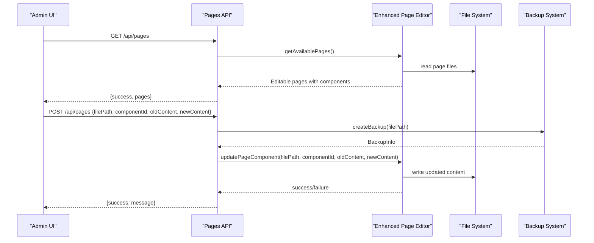
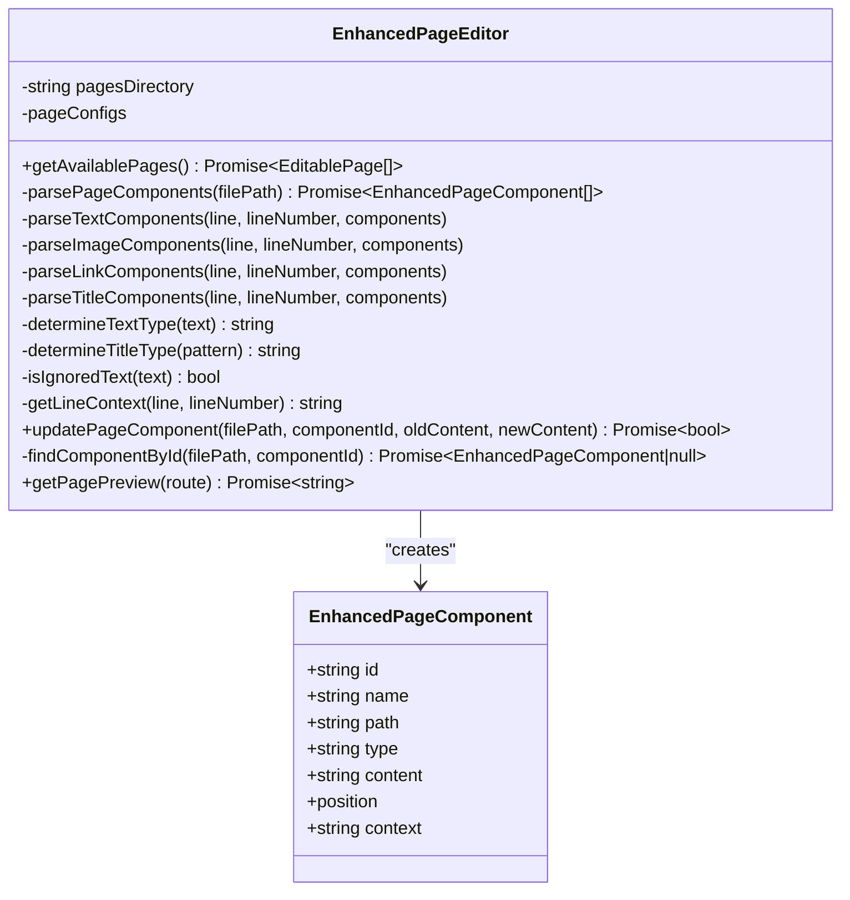
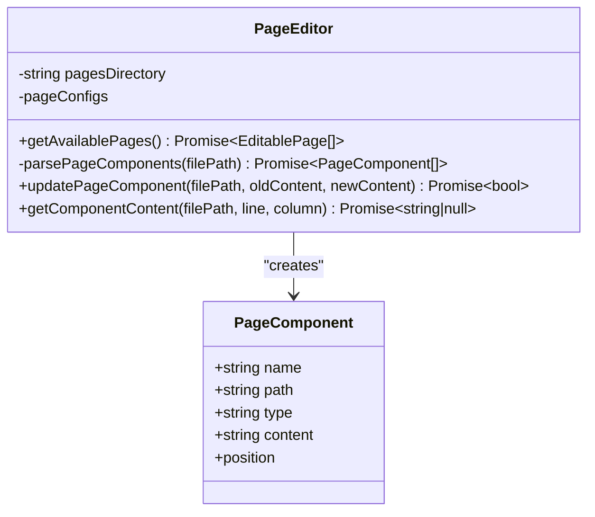
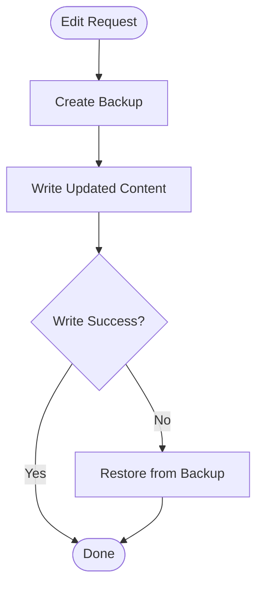
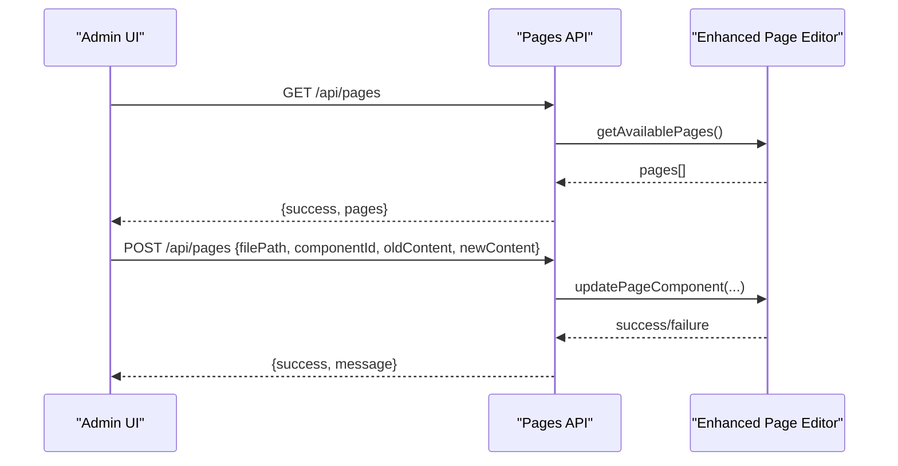
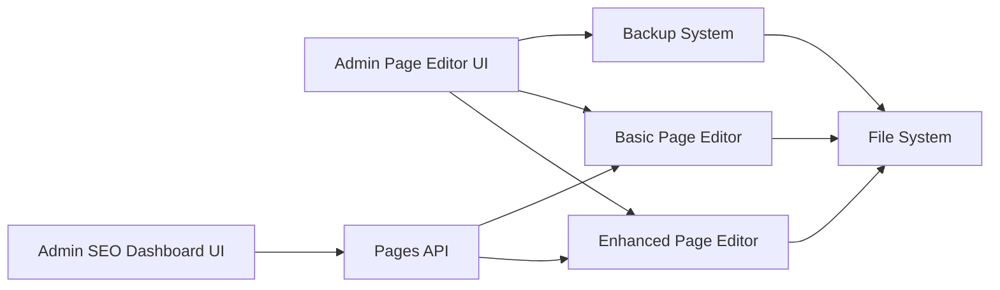

# Content Management Features

<cite>
**Referenced Files in This Document**
- [PAGE_EDITOR_README.md](file://PAGE_EDITOR_README.md)
- [SEO_MANAGEMENT_GUIDE.md](file://SEO_MANAGEMENT_GUIDE.md)
- [enhanced-page-editor.ts](file://src/lib/enhanced-page-editor.ts)
- [page-editor.ts](file://src/lib/page-editor.ts)
- [backup-system.ts](file://src/lib/backup-system.ts)
- [route.ts](file://src/app/api/pages/route.ts)
- [page.tsx](file://src/app/admin/page-editor/page.tsx)
- [page.tsx](file://src/app/admin/seo/page.tsx)
</cite>

## Table of Contents
1. [Introduction](#introduction)
2. [Project Structure](#project-structure)
3. [Core Components](#core-components)
4. [Architecture Overview](#architecture-overview)
5. [Detailed Component Analysis](#detailed-component-analysis)
6. [Dependency Analysis](#dependency-analysis)
7. [Performance Considerations](#performance-considerations)
8. [Troubleshooting Guide](#troubleshooting-guide)
9. [Conclusion](#conclusion)

## Introduction
This document explains the content management features for administrators, focusing on:
- Real-time page editing and component detection
- File-based content management with safety and validation
- Enhanced page editor capabilities and preview functionality
- SEO dashboard for metadata management and recommendations
- Practical workflows for editing, bulk operations, scheduling, and integration with backend APIs

## Project Structure
The content management system is organized around:
- Admin UI pages for page editor and SEO dashboard
- Backend libraries for parsing, editing, and backing up content
- API endpoints for retrieving pages and applying edits
- Markdown guides for setup and usage

```mermaid
graph TB
subgraph "Admin UI"
PEUI["Admin Page Editor UI<br/>src/app/admin/page-editor/page.tsx"]
SEOUi["Admin SEO Dashboard UI<br/>src/app/admin/seo/page.tsx"]
end
subgraph "Libraries"
EPE["Enhanced Page Editor<br/>src/lib/enhanced-page-editor.ts"]
PE["Basic Page Editor<br/>src/lib/page-editor.ts"]
BS["Backup System<br/>src/lib/backup-system.ts"]
end
subgraph "API"
API["Pages API<br/>src/app/api/pages/route.ts"]
end
PEUI --> EPE
PEUI --> PE
PEUI --> BS
SEOUi --> API
EPE --> API
PE --> API
BS --> API
```

**Diagram sources**
- [page.tsx](file://src/app/admin/page-editor/page.tsx#L1-L14)
- [page.tsx](file://src/app/admin/seo/page.tsx#L1-L14)
- [enhanced-page-editor.ts](file://src/lib/enhanced-page-editor.ts#L1-L287)
- [page-editor.ts](file://src/lib/page-editor.ts#L1-L194)
- [backup-system.ts](file://src/lib/backup-system.ts#L1-L119)
- [route.ts](file://src/app/api/pages/route.ts#L1-L110)

**Section sources**
- [PAGE_EDITOR_README.md](file://PAGE_EDITOR_README.md#L52-L72)
- [SEO_MANAGEMENT_GUIDE.md](file://SEO_MANAGEMENT_GUIDE.md#L17-L18)

## Core Components
- Enhanced Page Editor: Detects editable components (text, images, links, titles, subtitles, descriptions) from page files, supports real-time editing, and provides context-aware updates.
- Basic Page Editor: Simplified component extraction and replacement for legacy workflows.
- Backup System: Creates and restores backups before applying edits to prevent data loss.
- Pages API: Exposes endpoints to list pages with components and to apply edits via POST.
- Admin UI: Client-side entry points for page editor and SEO dashboard.

Key capabilities:
- Component detection across JSX patterns
- Context preservation for safer replacements
- Validation and error handling
- Live preview capability (conceptual)
- Centralized SEO metadata management

**Section sources**
- [enhanced-page-editor.ts](file://src/lib/enhanced-page-editor.ts#L26-L76)
- [page-editor.ts](file://src/lib/page-editor.ts#L23-L75)
- [backup-system.ts](file://src/lib/backup-system.ts#L12-L66)
- [route.ts](file://src/app/api/pages/route.ts#L66-L109)
- [page.tsx](file://src/app/admin/page-editor/page.tsx#L1-L14)
- [page.tsx](file://src/app/admin/seo/page.tsx#L1-L14)

## Architecture Overview
The admin content management architecture integrates UI, parsing, persistence, and safety layers.



**Diagram sources**
- [route.ts](file://src/app/api/pages/route.ts#L66-L109)
- [enhanced-page-editor.ts](file://src/lib/enhanced-page-editor.ts#L50-L76)
- [enhanced-page-editor.ts](file://src/lib/enhanced-page-editor.ts#L239-L272)
- [backup-system.ts](file://src/lib/backup-system.ts#L33-L66)

## Detailed Component Analysis

### Enhanced Page Editor
The enhanced editor parses page files to detect editable components and supports context-aware updates.



**Diagram sources**
- [enhanced-page-editor.ts](file://src/lib/enhanced-page-editor.ts#L26-L287)

Key behaviors:
- Parses JSX for text, images, links, and titles
- Determines content types heuristically
- Provides context strings for safer replacements
- Supports component lookup by ID for precise updates

**Section sources**
- [enhanced-page-editor.ts](file://src/lib/enhanced-page-editor.ts#L78-L100)
- [enhanced-page-editor.ts](file://src/lib/enhanced-page-editor.ts#L102-L205)
- [enhanced-page-editor.ts](file://src/lib/enhanced-page-editor.ts#L239-L272)

### Basic Page Editor
A simpler parser for backward compatibility and straightforward editing.



**Diagram sources**
- [page-editor.ts](file://src/lib/page-editor.ts#L23-L194)

**Section sources**
- [page-editor.ts](file://src/lib/page-editor.ts#L77-L145)
- [page-editor.ts](file://src/lib/page-editor.ts#L147-L190)

### Backup System
Ensures safe editing by creating backups before changes and enabling restoration.



**Diagram sources**
- [backup-system.ts](file://src/lib/backup-system.ts#L33-L66)
- [backup-system.ts](file://src/lib/backup-system.ts#L68-L82)

**Section sources**
- [backup-system.ts](file://src/lib/backup-system.ts#L12-L66)
- [backup-system.ts](file://src/lib/backup-system.ts#L68-L104)

### Pages API
Provides endpoints to list pages with components and to apply edits.



**Diagram sources**
- [route.ts](file://src/app/api/pages/route.ts#L66-L109)
- [enhanced-page-editor.ts](file://src/lib/enhanced-page-editor.ts#L50-L76)
- [enhanced-page-editor.ts](file://src/lib/enhanced-page-editor.ts#L239-L272)

**Section sources**
- [route.ts](file://src/app/api/pages/route.ts#L66-L109)

### Admin UI Integration
- Page Editor UI: Renders the enhanced editor component for admin use.
- SEO Dashboard UI: Renders the SEO dashboard for metadata management.

**Section sources**
- [page.tsx](file://src/app/admin/page-editor/page.tsx#L1-L14)
- [page.tsx](file://src/app/admin/seo/page.tsx#L1-L14)

## Dependency Analysis
The system exhibits layered dependencies: UI depends on libraries and APIs; libraries depend on the file system and optional backup storage.



**Diagram sources**
- [page.tsx](file://src/app/admin/page-editor/page.tsx#L1-L14)
- [page.tsx](file://src/app/admin/seo/page.tsx#L1-L14)
- [enhanced-page-editor.ts](file://src/lib/enhanced-page-editor.ts#L1-L36)
- [page-editor.ts](file://src/lib/page-editor.ts#L1-L33)
- [backup-system.ts](file://src/lib/backup-system.ts#L1-L23)
- [route.ts](file://src/app/api/pages/route.ts#L1-L10)

**Section sources**
- [enhanced-page-editor.ts](file://src/lib/enhanced-page-editor.ts#L1-L36)
- [page-editor.ts](file://src/lib/page-editor.ts#L1-L33)
- [backup-system.ts](file://src/lib/backup-system.ts#L1-L23)
- [route.ts](file://src/app/api/pages/route.ts#L1-L10)

## Performance Considerations
- Parsing complexity: Component detection scans each line of target files. For large pages, consider caching parsed results per session.
- Replacement strategy: Context-aware replacement reduces risk but adds overhead; ensure targeted updates minimize unnecessary writes.
- Backup I/O: Creating backups before edits introduces disk I/O; batch operations can reduce frequency.
- Preview rendering: Generating previews requires rendering or HTML generation; defer or cache previews to avoid blocking the UI.

[No sources needed since this section provides general guidance]

## Troubleshooting Guide
Common issues and resolutions:
- Content not updating: Verify the file path and existence; ensure the component still exists after edits.
- Images not showing: Confirm image URLs are accessible and not data/blob URIs.
- Search/filter not working: Ensure search terms match detected content types and contexts.
- Invalid content errors: Validate content against expected formats before saving.
- API failures: Check endpoint availability and request payload completeness.

Operational tips:
- Use the demo page for guidance and error inspection.
- Review console logs for detailed error messages.
- Confirm file permissions and paths.
- Inspect backups for previous versions when needed.

**Section sources**
- [PAGE_EDITOR_README.md](file://PAGE_EDITOR_README.md#L114-L154)

## Conclusion
The content management system provides a robust, admin-friendly solution for editing website content without code changes. It combines intelligent component detection, context-aware editing, safety through backups, and centralized SEO metadata management. The modular architecture enables future enhancements such as bulk operations, scheduling, and advanced validation while maintaining simplicity and reliability.