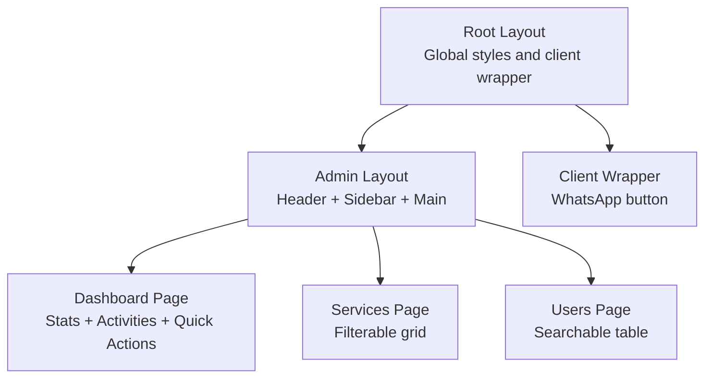
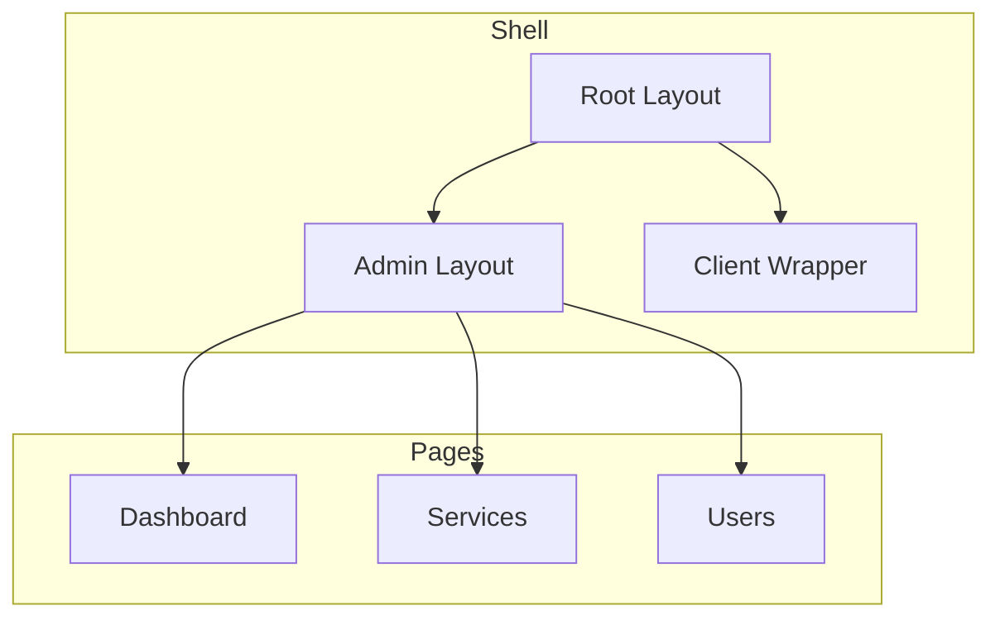
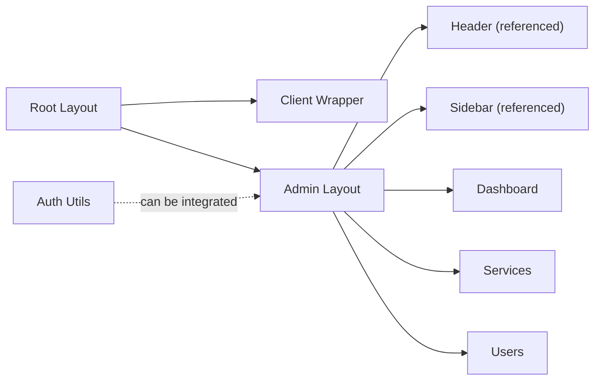

# Dashboard Interface

<cite>
**Referenced Files in This Document**
- [Admin Layout](file://src/app/admin/layout.tsx)
- [Admin Dashboard](file://src/app/admin/dashboard/page.tsx)
- [Services Page](file://src/app/admin/services/page.tsx)
- [Users Page](file://src/app/admin/users/page.tsx)
- [Root Layout](file://src/app/layout.tsx)
- [Client Wrapper](file://src/app/Components/Common/ClientWrapper.tsx)
- [Authentication Utilities](file://src/lib/auth.ts)
</cite>

## Table of Contents
1. [Introduction](#introduction)
2. [Project Structure](#project-structure)
3. [Core Components](#core-components)
4. [Architecture Overview](#architecture-overview)
5. [Detailed Component Analysis](#detailed-component-analysis)
6. [Dependency Analysis](#dependency-analysis)
7. [Performance Considerations](#performance-considerations)
8. [Troubleshooting Guide](#troubleshooting-guide)
9. [Conclusion](#conclusion)

## Introduction
This document describes the admin dashboard interface focusing on user experience and navigation architecture. It covers the layout structure (header, sidebar, and main content area), responsive design patterns, component composition, navigation flows between admin sections, and integration with routing and state management. Practical guidance is included for customization, preferences, accessibility, and real-time updates.

## Project Structure
The admin dashboard is built with Next.js App Router and uses a layered structure:
- Root layout initializes global styles and wraps the application with a client-side wrapper.
- Admin layout composes the header, sidebar, and main content area.
- Individual admin pages (dashboard, services, users) render their content inside the admin layout.
- Authentication utilities support admin login and session validation.

**Diagram sources**
- [Root Layout](file://src/app/layout.tsx#L14-L47)
- [Admin Layout](file://src/app/admin/layout.tsx#L6-L22)
- [Admin Dashboard](file://src/app/admin/dashboard/page.tsx#L13-L196)
- [Services Page](file://src/app/admin/services/page.tsx#L14-L143)
- [Users Page](file://src/app/admin/users/page.tsx#L14-L151)
- [Client Wrapper](file://src/app/Components/Common/ClientWrapper.tsx#L4-L10)

**Section sources**
- [Root Layout](file://src/app/layout.tsx#L14-L47)
- [Admin Layout](file://src/app/admin/layout.tsx#L6-L22)

## Core Components
- Admin Layout: Provides a two-column structure with a fixed header and collapsible sidebar, and a main content area that renders child pages.
- Dashboard Page: Renders statistics cards, recent activity feed, and quick action buttons. Includes loading state and responsive grid layouts.
- Services Page: Displays a searchable and filterable grid of services with status badges and action buttons.
- Users Page: Presents a searchable table of users with role and status indicators and inline actions.
- Client Wrapper: Ensures client-side interactivity and integrates a persistent WhatsApp button.

Key UX and navigation characteristics:
- Consistent typography and spacing via Tailwind utility classes.
- Responsive breakpoints (mobile-first) using grid and flex utilities.
- Minimal header and sidebar separation to maximize usable content area.
- No explicit breadcrumb or contextual help is present in the current implementation.

**Section sources**
- [Admin Layout](file://src/app/admin/layout.tsx#L6-L22)
- [Admin Dashboard](file://src/app/admin/dashboard/page.tsx#L13-L196)
- [Services Page](file://src/app/admin/services/page.tsx#L14-L143)
- [Users Page](file://src/app/admin/users/page.tsx#L14-L151)
- [Client Wrapper](file://src/app/Components/Common/ClientWrapper.tsx#L4-L10)

## Architecture Overview
The admin interface follows a clear separation of concerns:
- Layouts define shell components and pass children into the main area.
- Pages encapsulate domain-specific UI and state.
- Global styles and fonts are initialized at the root level.
- Client wrapper ensures client-side hydration and persistent UI elements.

**Diagram sources**
- [Root Layout](file://src/app/layout.tsx#L14-L47)
- [Admin Layout](file://src/app/admin/layout.tsx#L6-L22)
- [Client Wrapper](file://src/app/Components/Common/ClientWrapper.tsx#L4-L10)
- [Admin Dashboard](file://src/app/admin/dashboard/page.tsx#L13-L196)
- [Services Page](file://src/app/admin/services/page.tsx#L14-L143)
- [Users Page](file://src/app/admin/users/page.tsx#L14-L151)

## Detailed Component Analysis

### Admin Layout
Responsibilities:
- Hosts the header and sidebar components.
- Wraps the main content area with padding and flex layout.
- Applies a light background and min-height for consistent viewport coverage.

Composition pattern:
- Uses a flex container to align sidebar and main content horizontally.
- Main content area grows to fill remaining space after sidebar.

Accessibility and responsiveness:
- No explicit ARIA roles or keyboard navigation are defined in the layout itself.
- Responsive behavior is driven by Tailwind utilities applied to child components.

**Section sources**
- [Admin Layout](file://src/app/admin/layout.tsx#L6-L22)

### Admin Dashboard
Purpose:
- Present high-level metrics, recent activities, and quick actions for common tasks.

State management:
- Uses React state to manage dashboard statistics and a loading indicator.
- Simulates asynchronous data loading with a timeout.

UI composition:
- Statistics cards arranged in a responsive grid (one column on small screens, four on large).
- Recent activities rendered as a bordered list with colored icons per activity type.
- Quick actions and page editor quick start panel arranged in a two-column layout on larger screens.

Responsive design:
- Grid and flex utilities adapt to different viewport widths.
- Typography scales appropriately with heading and paragraph classes.

Real-time updates:
- The current implementation simulates data loading; real-time updates would require integrating with a backend API and state synchronization.

Customization options:
- Color classes for stat cards can be customized per theme.
- Quick action buttons can be extended with navigation handlers.
- Activity list can be paginated or filtered further.

Practical examples:
- Replace the simulated loading spinner with a skeleton loader.
- Add chart components for trend visualization.
- Integrate with a notifications endpoint to populate the recent activities list.

**Section sources**
- [Admin Dashboard](file://src/app/admin/dashboard/page.tsx#L13-L196)

### Services Page
Purpose:
- Manage services with filtering and search capabilities.

State management:
- Maintains a local list of services and filters them based on search term and category selection.

UI composition:
- Header with page title and “Add New Service” button.
- Filter controls (search input and category dropdown) in a card container.
- Responsive grid of service cards with status badges and action buttons.
- Empty state messaging when no services match the filters.

Responsive design:
- Grid adjusts columns based on breakpoint classes.
- Inputs and selects are sized for touch targets.

Customization options:
- Extend filters to include additional attributes (price range, creation date).
- Add pagination or infinite scroll for large datasets.
- Integrate with a service CRUD API for live updates.

**Section sources**
- [Services Page](file://src/app/admin/services/page.tsx#L14-L143)

### Users Page
Purpose:
- Manage users with search and status filtering.

State management:
- Maintains a local list of users and filters by name or email.

UI composition:
- Header with page title and “Add New User” button.
- Search input and filter button in a card container.
- Tabular display of users with avatar initials, role badges, status indicators, and action buttons.

Responsive design:
- Table remains readable with horizontal scrolling on narrow devices.
- Status badges and role labels provide clear visual cues.

Customization options:
- Add sorting by clicking column headers.
- Implement bulk actions and row selection.
- Connect to a user management API for real-time updates.

**Section sources**
- [Users Page](file://src/app/admin/users/page.tsx#L14-L151)

### Root Layout and Client Wrapper
Root layout:
- Initializes Bootstrap CSS, Bootstrap Icons, Slick carousel CSS, and a custom stylesheet.
- Sets up Google Analytics script injection.
- Wraps children with a client-side wrapper.

Client wrapper:
- Ensures client-side rendering for interactive components.
- Places a persistent WhatsApp button at the application root.

Accessibility and performance:
- Prefetch directives reduce latency for external resources.
- Client wrapper enables client-side features without hydrating entire pages unnecessarily.

**Section sources**
- [Root Layout](file://src/app/layout.tsx#L14-L47)
- [Client Wrapper](file://src/app/Components/Common/ClientWrapper.tsx#L4-L10)

### Navigation Flow and Routing Integration
Current state:
- The admin layout renders child pages via the App Router’s slot mechanism.
- There is no explicit navigation component in the sidebar; links are not defined in the provided files.
- Authentication utilities exist for login and token verification but are not integrated into the layout in the provided files.

Proposed navigation flow:
- Add a navigation list in the sidebar that links to dashboard, services, users, and other admin sections.
- Use Next.js navigation primitives to maintain client-side routing and preserve layout state.
- Apply active state styling to the current route.

Routing and state:
- Keep state in individual pages (as currently implemented) or elevate to a shared context if cross-page state is needed.
- For real-time updates, integrate WebSocket connections or polling to a backend API.

**Section sources**
- [Admin Layout](file://src/app/admin/layout.tsx#L6-L22)
- [Authentication Utilities](file://src/lib/auth.ts#L62-L79)

## Dependency Analysis
High-level dependencies:
- Root layout depends on global styles and client wrapper.
- Admin layout depends on header and sidebar components (referenced but not found in the provided files).
- Dashboard, services, and users pages depend on Tailwind utilities for responsive design.
- Authentication utilities are separate and can be wired into login and protected routes.

**Diagram sources**
- [Root Layout](file://src/app/layout.tsx#L14-L47)
- [Admin Layout](file://src/app/admin/layout.tsx#L6-L22)
- [Client Wrapper](file://src/app/Components/Common/ClientWrapper.tsx#L4-L10)
- [Authentication Utilities](file://src/lib/auth.ts#L62-L79)

**Section sources**
- [Root Layout](file://src/app/layout.tsx#L14-L47)
- [Admin Layout](file://src/app/admin/layout.tsx#L6-L22)
- [Authentication Utilities](file://src/lib/auth.ts#L62-L79)

## Performance Considerations
- Prefer client-side hydration only where necessary (client wrapper pattern).
- Use lazy loading for heavy components and images.
- Optimize CSS delivery by scoping Tailwind usage to avoid unused styles.
- Implement skeleton loaders during data fetching to improve perceived performance.
- Debounce search inputs to reduce re-renders during typing.

## Troubleshooting Guide
Common issues and resolutions:
- Missing sidebar/header components: The admin layout references components that are not present in the provided files. Ensure the AdminHeader and AdminSidebar components exist and are properly exported.
- No navigation: The current layout does not include navigation links. Add a navigation list in the sidebar and wire it to the App Router.
- Authentication integration: The authentication utilities exist but are not used in the layout. Implement login flows and protect routes as needed.
- Accessibility: Add ARIA roles and keyboard navigation to interactive elements (buttons, lists, forms).
- Real-time updates: Implement API integrations and state synchronization for dynamic content.

**Section sources**
- [Admin Layout](file://src/app/admin/layout.tsx#L3-L4)
- [Authentication Utilities](file://src/lib/auth.ts#L62-L79)

## Conclusion
The admin dashboard layout establishes a clean, responsive shell with a header, sidebar, and main content area. The dashboard page demonstrates effective use of state for loading and rendering statistics and activities. Services and users pages showcase practical filtering and presentation patterns. To enhance the user experience, integrate navigation, implement authentication flows, and add real-time updates. Focus on accessibility and performance to ensure a robust and inclusive admin environment.