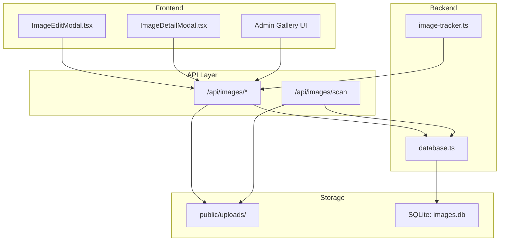
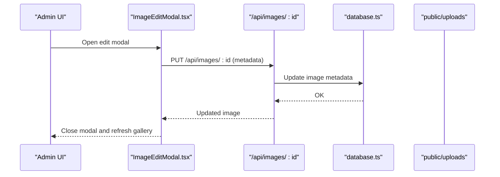
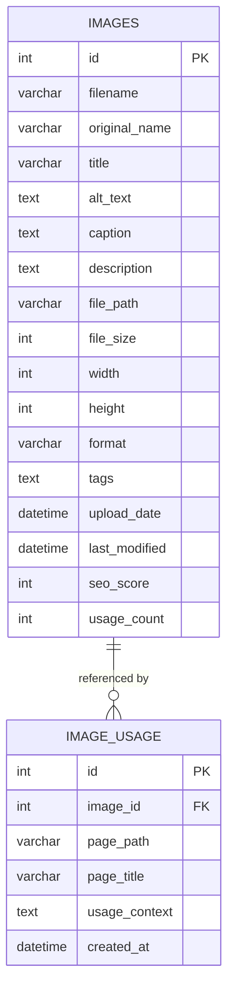
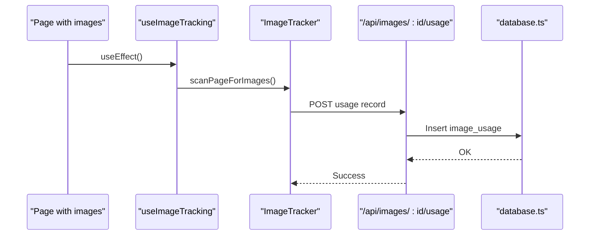
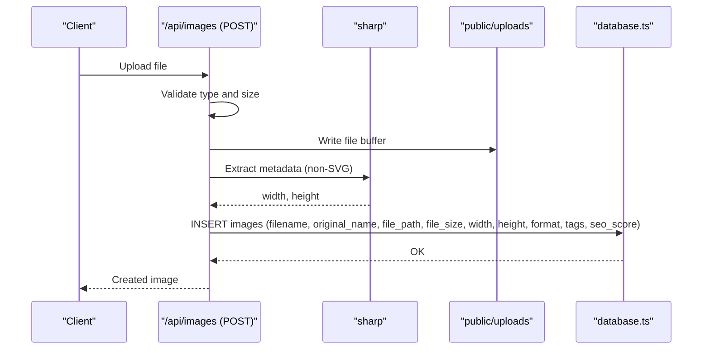
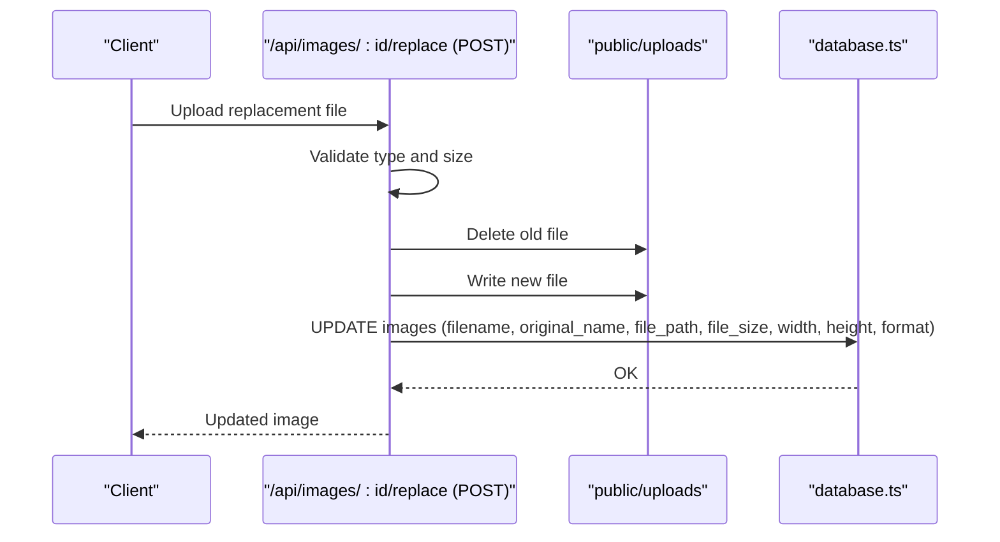
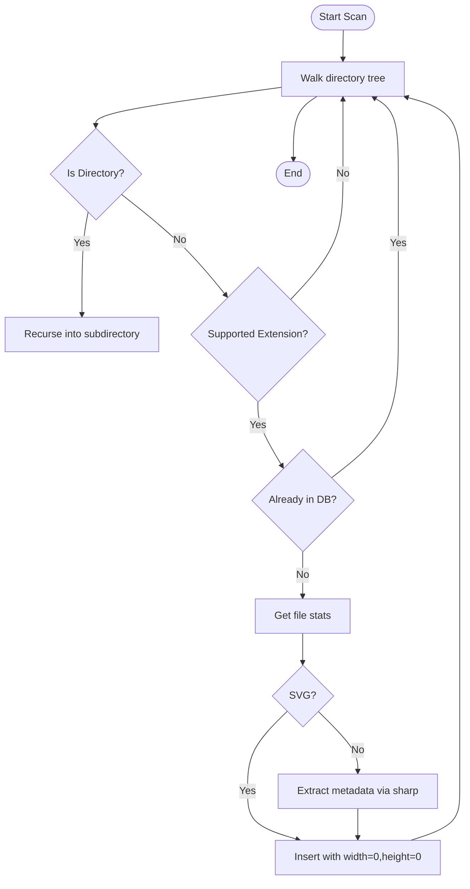
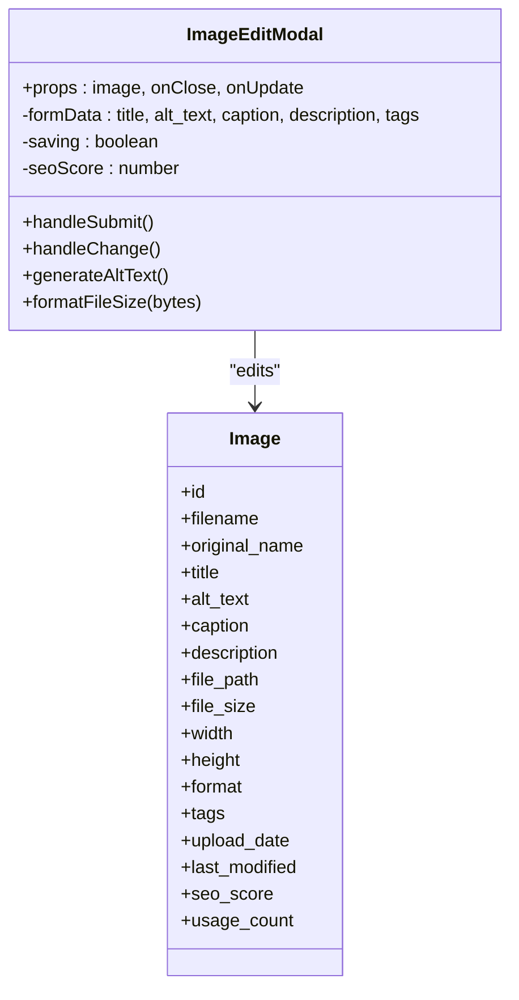
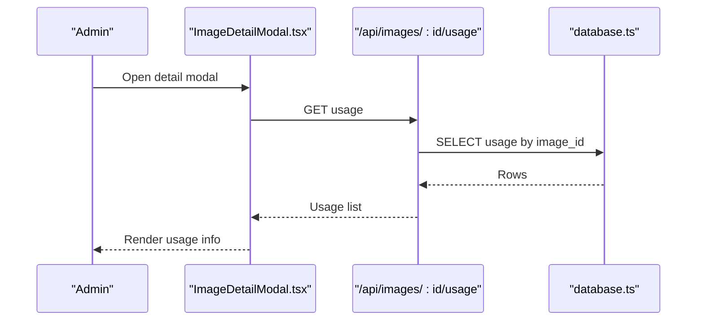
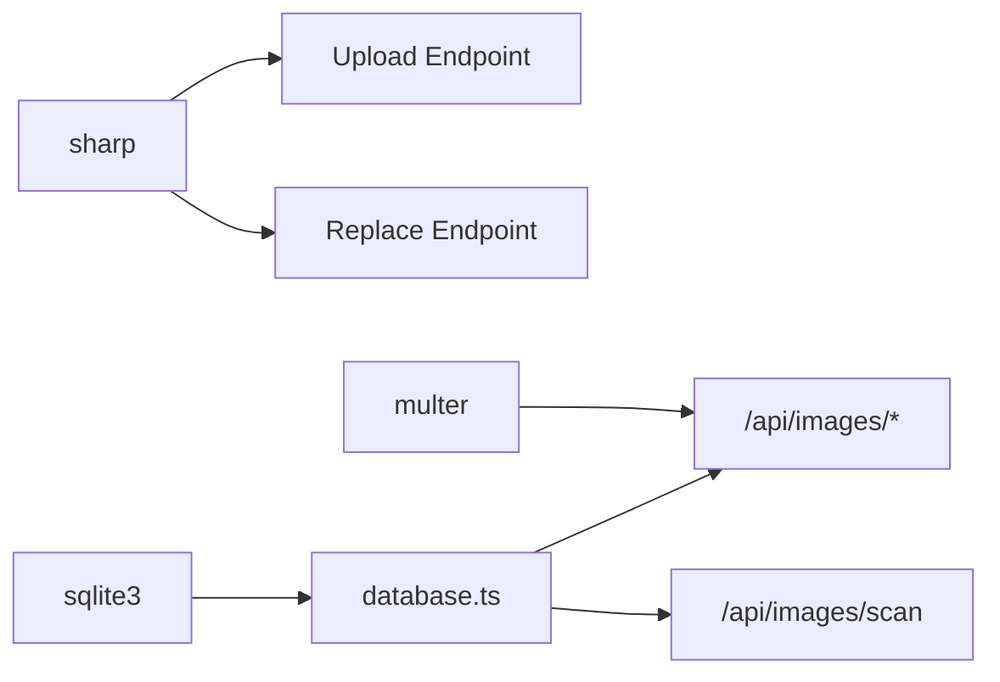

# Media Management

<cite>
**Referenced Files in This Document**
- [IMAGE_MANAGEMENT_SETUP.md](file://IMAGE_MANAGEMENT_SETUP.md)
- [database.ts](file://src/lib/database.ts)
- [image-tracker.ts](file://src/lib/image-tracker.ts)
- [init-database.js](file://scripts/init-database.js)
- [route.ts](file://src/app/api/images/route.ts)
- [route.ts](file://src/app/api/images/[id]/replace/route.ts)
- [route.ts](file://src/app/api/images/scan/route.ts)
- [ImageEditModal.tsx](file://src/app/Components/Admin/ImageEditModal.tsx)
- [ImageDetailModal.tsx](file://src/app/Components/Admin/ImageDetailModal.tsx)
- [package-lock.json](file://package-lock.json)
</cite>

## Table of Contents
1. [Introduction](#introduction)
2. [Project Structure](#project-structure)
3. [Core Components](#core-components)
4. [Architecture Overview](#architecture-overview)
5. [Detailed Component Analysis](#detailed-component-analysis)
6. [Dependency Analysis](#dependency-analysis)
7. [Performance Considerations](#performance-considerations)
8. [Troubleshooting Guide](#troubleshooting-guide)
9. [Conclusion](#conclusion)

## Introduction
This document describes the media management system with a focus on image handling and gallery administration. It covers the upload workflow, optimization processes, storage management, the gallery interface, bulk operations, usage tracking, modal-based editing, metadata management, and batch processing. It also documents the integration between media components and the image tracking system, including usage analytics, performance metrics, and storage optimization strategies.

## Project Structure
The media management system is built with a Next.js application, a SQLite backend, and a set of API endpoints. The frontend provides modal-based editing and gallery views, while the backend handles uploads, metadata updates, scanning, and usage tracking.

**Diagram sources**
- [ImageEditModal.tsx](file://src/app/Components/Admin/ImageEditModal.tsx#L1-L300)
- [ImageDetailModal.tsx](file://src/app/Components/Admin/ImageDetailModal.tsx#L1-L270)
- [route.ts](file://src/app/api/images/route.ts#L113-L159)
- [route.ts](file://src/app/api/images/[id]/replace/route.ts#L38-L124)
- [route.ts](file://src/app/api/images/scan/route.ts#L39-L71)
- [database.ts](file://src/lib/database.ts#L1-L255)
- [image-tracker.ts](file://src/lib/image-tracker.ts#L1-L95)

**Section sources**
- [IMAGE_MANAGEMENT_SETUP.md](file://IMAGE_MANAGEMENT_SETUP.md#L1-L190)
- [database.ts](file://src/lib/database.ts#L1-L255)
- [image-tracker.ts](file://src/lib/image-tracker.ts#L1-L95)
- [init-database.js](file://scripts/init-database.js#L1-L120)

## Core Components
- Database abstraction and schema: Defines the images and image_usage tables, provides helpers for queries, and ensures the database is initialized.
- Image tracker: Tracks usage of images across pages and records usage events.
- API endpoints: Handle upload, replacement, scanning, listing, retrieval, updates, deletion, and usage queries.
- Frontend modals: Provide editing and detail views for images, including SEO scoring and quick actions.
- Initialization script: Creates the SQLite database and tables.

Key responsibilities:
- Upload and replace images with dimension extraction and metadata persistence.
- Scan existing images from the filesystem and populate the database.
- Track where images are used across pages.
- Expose a gallery interface with search, filter, and sorting.
- Provide bulk operations via batch processing features.

**Section sources**
- [database.ts](file://src/lib/database.ts#L18-L81)
- [image-tracker.ts](file://src/lib/image-tracker.ts#L11-L43)
- [route.ts](file://src/app/api/images/route.ts#L113-L159)
- [route.ts](file://src/app/api/images/[id]/replace/route.ts#L38-L124)
- [route.ts](file://src/app/api/images/scan/route.ts#L39-L71)
- [ImageEditModal.tsx](file://src/app/Components/Admin/ImageEditModal.tsx#L31-L79)
- [ImageDetailModal.tsx](file://src/app/Components/Admin/ImageDetailModal.tsx#L41-L63)
- [init-database.js](file://scripts/init-database.js#L94-L117)

## Architecture Overview
The system follows a layered architecture:
- Presentation: Modal components for editing and viewing image details.
- API: Route handlers for CRUD and batch operations.
- Domain: Image tracker and database utilities.
- Persistence: SQLite database and filesystem storage.

**Diagram sources**
- [ImageEditModal.tsx](file://src/app/Components/Admin/ImageEditModal.tsx#L54-L79)
- [route.ts](file://src/app/api/images/[id]/route.ts#L1-L200)
- [database.ts](file://src/lib/database.ts#L214-L254)

## Detailed Component Analysis

### Database Abstraction and Schema
The database module defines typed interfaces for images and usage, initializes the SQLite connection, creates tables, and exposes helpers for running queries. The schema supports:
- Images table: filename, original_name, title, alt_text, caption, description, file_path, file_size, width, height, format, tags, upload_date, last_modified, seo_score, usage_count.
- Image usage table: page_path, page_title, usage_context, created_at, with foreign key to images.

**Diagram sources**
- [database.ts](file://src/lib/database.ts#L105-L181)

**Section sources**
- [database.ts](file://src/lib/database.ts#L18-L81)
- [database.ts](file://src/lib/database.ts#L105-L181)
- [database.ts](file://src/lib/database.ts#L214-L254)

### Image Tracker and Usage Analytics
The image tracker integrates with the frontend to automatically discover images on a page and record usage against the backend. It:
- Scans DOM for images with the same origin.
- Resolves the image path and posts usage records to the backend.
- Provides a React hook and a component wrapper for automatic tracking.

**Diagram sources**
- [image-tracker.ts](file://src/lib/image-tracker.ts#L46-L80)
- [image-tracker.ts](file://src/lib/image-tracker.ts#L11-L43)
- [database.ts](file://src/lib/database.ts#L128-L139)

**Section sources**
- [image-tracker.ts](file://src/lib/image-tracker.ts#L11-L43)
- [image-tracker.ts](file://src/lib/image-tracker.ts#L46-L80)
- [database.ts](file://src/lib/database.ts#L128-L139)

### Image Upload Workflow
The upload endpoint handles multipart file uploads, validates type and size, writes the file to the filesystem, extracts dimensions for non-SVG images, calculates an SEO score, and persists metadata to the database.

**Diagram sources**
- [route.ts](file://src/app/api/images/route.ts#L113-L159)
- [database.ts](file://src/lib/database.ts#L147-L152)

**Section sources**
- [route.ts](file://src/app/api/images/route.ts#L113-L159)
- [package-lock.json](file://package-lock.json#L6415-L6451)

### Image Replacement Workflow
The replace endpoint replaces an existing image file while preserving metadata. It validates the new file, deletes the old file, generates a new filename, writes the new file, extracts dimensions, and updates the database.

**Diagram sources**
- [route.ts](file://src/app/api/images/[id]/replace/route.ts#L38-L124)
- [database.ts](file://src/lib/database.ts#L94-L100)

**Section sources**
- [route.ts](file://src/app/api/images/[id]/replace/route.ts#L38-L124)
- [database.ts](file://src/lib/database.ts#L94-L100)

### Image Scanning Workflow
The scan endpoint recursively scans the public assets directory for supported image formats, checks for duplicates, extracts dimensions for non-SVG images, and inserts records into the database.

**Diagram sources**
- [route.ts](file://src/app/api/images/scan/route.ts#L39-L71)
- [package-lock.json](file://package-lock.json#L6415-L6451)

**Section sources**
- [route.ts](file://src/app/api/images/scan/route.ts#L39-L71)

### Modal-Based Editing System
The editing modal allows administrators to:
- View image preview and basic info.
- Edit title, alt_text, caption, description, and tags.
- See live SEO score calculation.
- Generate alt text suggestions.
- Save changes and refresh the gallery.

**Diagram sources**
- [ImageEditModal.tsx](file://src/app/Components/Admin/ImageEditModal.tsx#L31-L300)

**Section sources**
- [ImageEditModal.tsx](file://src/app/Components/Admin/ImageEditModal.tsx#L31-L300)

### Image Detail Modal and Usage Tracking
The detail modal displays:
- Image preview and quick actions (edit, copy URL, delete).
- Basic info (size, dimensions, format, dates).
- SEO info (score and metadata).
- Usage information (pages where the image appears).

**Diagram sources**
- [ImageDetailModal.tsx](file://src/app/Components/Admin/ImageDetailModal.tsx#L41-L63)
- [database.ts](file://src/lib/database.ts#L128-L139)

**Section sources**
- [ImageDetailModal.tsx](file://src/app/Components/Admin/ImageDetailModal.tsx#L41-L63)
- [database.ts](file://src/lib/database.ts#L128-L139)

### Database Initialization
The initialization script ensures the data directory exists, connects to SQLite, creates tables, and closes the connection. It also prints helpful messages for setup.

**Section sources**
- [init-database.js](file://scripts/init-database.js#L1-L120)

## Dependency Analysis
External dependencies relevant to image handling:
- sharp: Used for extracting image metadata (dimensions) during upload and replacement.
- sqlite3: Used for database operations.
- multer: Used for handling multipart form data in uploads.

**Diagram sources**
- [route.ts](file://src/app/api/images/route.ts#L124-L136)
- [route.ts](file://src/app/api/images/[id]/replace/route.ts#L82-L91)
- [database.ts](file://src/lib/database.ts#L1-L255)
- [package-lock.json](file://package-lock.json#L6415-L6451)

**Section sources**
- [package-lock.json](file://package-lock.json#L6415-L6451)
- [database.ts](file://src/lib/database.ts#L1-L255)

## Performance Considerations
- Image metadata extraction: Using sharp to read dimensions adds overhead; cache or reuse metadata when possible.
- File I/O: Writing buffers to disk and deleting old files should be performed asynchronously to avoid blocking.
- Database operations: Batch inserts during scanning can be optimized by grouping statements and using transactions.
- Storage: Store images in a dedicated uploads directory and keep original assets separate to simplify cleanup and backups.
- CDN and optimization: Consider integrating a CDN and automated compression for production deployments.

[No sources needed since this section provides general guidance]

## Troubleshooting Guide
Common issues and remedies:
- Database not found: Ensure the initialization script has been run and the data directory is writable.
- Upload failures: Verify file type and size limits; confirm the uploads directory exists and is writable.
- Images not loading: Check file paths and permissions; ensure the public directory is served correctly.
- SEO scores not updating: Refresh the page after editing metadata; confirm the edit modal saves changes.

Permissions checklist:
- data/ directory must be writable for SQLite.
- public/uploads/ directory must be writable for uploads.

**Section sources**
- [IMAGE_MANAGEMENT_SETUP.md](file://IMAGE_MANAGEMENT_SETUP.md#L153-L167)
- [init-database.js](file://scripts/init-database.js#L9-L12)

## Conclusion
The media management system provides a comprehensive solution for image handling, including upload, replacement, scanning, metadata editing, usage tracking, and analytics. The modular design separates concerns across frontend modals, API endpoints, and database utilities, enabling maintainability and scalability. Integrating optimization and CDN strategies will further enhance performance and user experience.