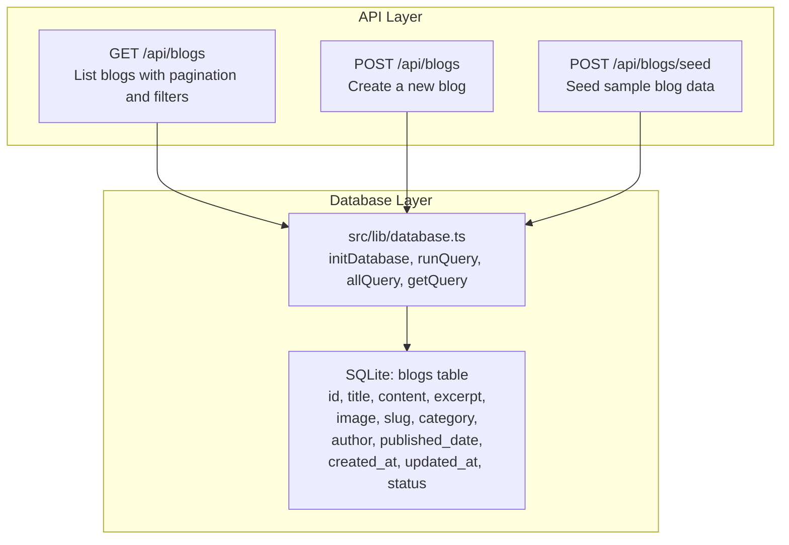
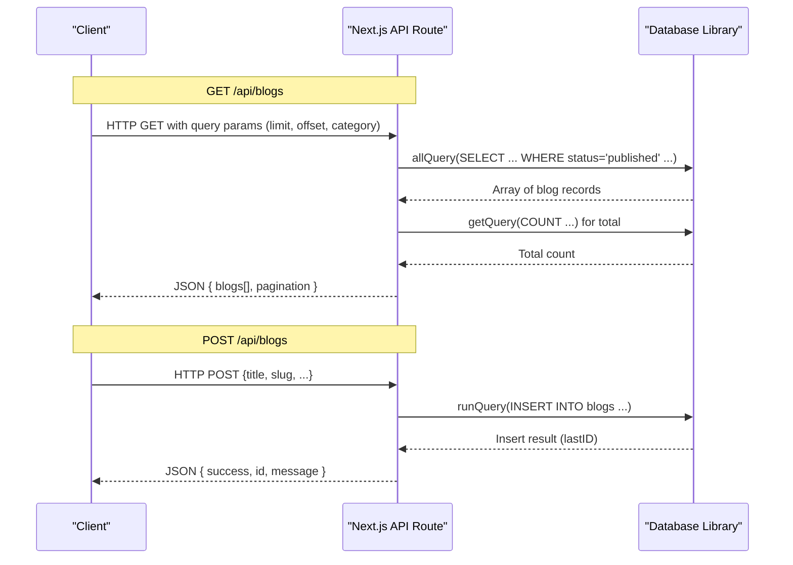
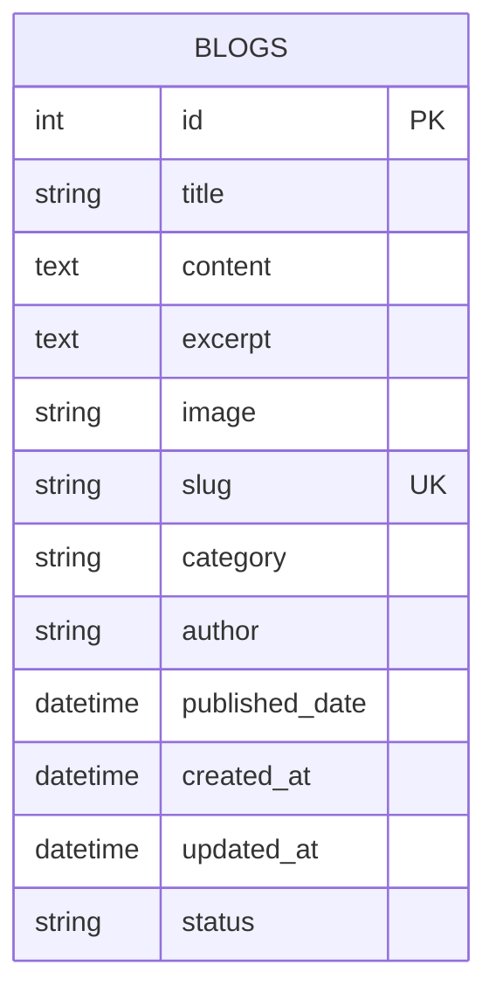
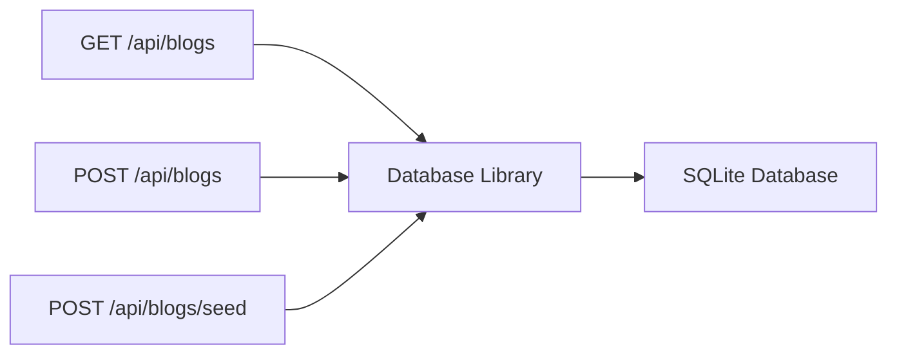

# Blog API Endpoints

<cite>
**Referenced Files in This Document**
- [database.ts](file://src/lib/database.ts)
- [blogs.route.ts](file://src/app/api/blogs/route.ts)
- [blogs.seed.route.ts](file://src/app/api/blogs/seed/route.ts)
</cite>

## Table of Contents
1. [Introduction](#introduction)
2. [Project Structure](#project-structure)
3. [Core Components](#core-components)
4. [Architecture Overview](#architecture-overview)
5. [Detailed Component Analysis](#detailed-component-analysis)
6. [Dependency Analysis](#dependency-analysis)
7. [Performance Considerations](#performance-considerations)
8. [Troubleshooting Guide](#troubleshooting-guide)
9. [Conclusion](#conclusion)
10. [Appendices](#appendices)

## Introduction
This document describes the RESTful API endpoints for blog content operations used by attechglobal.com’s content publishing infrastructure. It covers:
- Endpoints for listing, creating, updating, and deleting blog posts
- Request/response schemas, validation rules, and error handling
- Seeding functionality for initial blog content setup
- Practical usage examples for content creation, editing, and deletion workflows
- Authentication and rate limiting considerations
- Integration guidelines for client applications and the relationship to frontend blog components

## Project Structure
The blog API is implemented as Next.js App Router API routes backed by a local SQLite database. The database schema and helpers are centralized in a shared library module.

**Diagram sources**
- [blogs.route.ts](file://src/app/api/blogs/route.ts#L14-L61)
- [blogs.seed.route.ts](file://src/app/api/blogs/seed/route.ts#L14-L108)
- [database.ts](file://src/lib/database.ts#L84-L184)

**Section sources**
- [database.ts](file://src/lib/database.ts#L141-L156)
- [blogs.route.ts](file://src/app/api/blogs/route.ts#L1-L12)
- [blogs.seed.route.ts](file://src/app/api/blogs/seed/route.ts#L1-L12)

## Core Components
- Database initialization and helpers:
  - Initializes SQLite database and creates required tables on first use
  - Provides typed interfaces for blog records and database operations
- Blog API routes:
  - GET /api/blogs: list published blogs with pagination and optional category filter
  - POST /api/blogs: create a new blog post
  - POST /api/blogs/seed: seed sample blog entries

Key data model for blogs:
- Fields: id, title, content, excerpt, image, slug, category, author, published_date, created_at, updated_at, status
- Constraints: slug is unique; status defaults to published; dates default to current timestamps

**Section sources**
- [database.ts](file://src/lib/database.ts#L47-L60)
- [database.ts](file://src/lib/database.ts#L141-L156)
- [blogs.route.ts](file://src/app/api/blogs/route.ts#L14-L61)
- [blogs.route.ts](file://src/app/api/blogs/route.ts#L63-L105)
- [blogs.seed.route.ts](file://src/app/api/blogs/seed/route.ts#L14-L108)

## Architecture Overview
The API follows a layered architecture:
- HTTP handlers (Next.js App Router) parse requests and orchestrate responses
- Database layer abstracts SQL operations and schema management
- Pagination and filtering are handled in SQL queries

**Diagram sources**
- [blogs.route.ts](file://src/app/api/blogs/route.ts#L14-L61)
- [blogs.route.ts](file://src/app/api/blogs/route.ts#L63-L105)
- [database.ts](file://src/lib/database.ts#L214-L254)

## Detailed Component Analysis

### Endpoint: GET /api/blogs
Purpose:
- Retrieve a paginated and optionally filtered list of published blog posts

Query parameters:
- limit: integer, default 10
- offset: integer, default 0
- category: string, optional

Response schema:
- blogs: array of blog objects
- pagination: object with limit, offset, total, totalPages

Validation and behavior:
- Filters by status = published
- Sorts by published_date descending, falls back to created_at if published_date is null
- Returns 500 on internal errors

Example usage:
- Fetch first 10 published posts
- Fetch next page with offset=10
- Filter by category “Digital Marketing”

**Section sources**
- [blogs.route.ts](file://src/app/api/blogs/route.ts#L14-L61)

### Endpoint: POST /api/blogs
Purpose:
- Create a new blog post

Request body schema:
- title: string, required
- slug: string, required (must be unique)
- content: string, optional
- excerpt: string, optional
- image: string, optional (defaults to a placeholder)
- category: string, optional (defaults to General)
- author: string, optional (defaults to Admin)
- published_date: ISO date-time, optional (defaults to now)

Validation and behavior:
- Rejects missing title or slug with 400
- Inserts with status=published
- On duplicate slug, returns 409 Conflict
- On success, returns 201 with id and success message
- On other errors, returns 500

Example usage:
- Create a new blog with title and slug
- Provide content, excerpt, and image for richer posts

**Section sources**
- [blogs.route.ts](file://src/app/api/blogs/route.ts#L63-L105)

### Endpoint: POST /api/blogs/seed
Purpose:
- Seed the database with sample blog entries

Request body:
- No request body required

Behavior:
- Inserts a predefined set of sample blogs
- Skips duplicates (unique constraint) without failing the entire batch
- Returns success with seededCount

Example usage:
- Run once after initial deployment to populate starter content

**Section sources**
- [blogs.seed.route.ts](file://src/app/api/blogs/seed/route.ts#L14-L108)

### Database Schema: blogs
Fields and constraints:
- id: integer, primary key
- title: varchar(500), not null
- content: text
- excerpt: text
- image: varchar(500)
- slug: varchar(500), unique, not null
- category: varchar(255)
- author: varchar(255), default Admin
- published_date: datetime
- created_at: datetime, default current timestamp
- updated_at: datetime, default current timestamp
- status: varchar(50), default published

**Diagram sources**
- [database.ts](file://src/lib/database.ts#L141-L156)

**Section sources**
- [database.ts](file://src/lib/database.ts#L47-L60)
- [database.ts](file://src/lib/database.ts#L141-L156)

### Relationship to Frontend Blog Components
- The frontend Next.js app consumes the GET /api/blogs endpoint to render lists and details pages
- Typical frontend components that rely on these endpoints:
  - Blog listing pages and cards
  - Blog detail pages that fetch a single post by slug (implemented elsewhere in the app)
  - Admin dashboards that create/edit/delete posts via POST /api/blogs and related admin endpoints

Note: This document focuses on the backend API. Frontend integration involves:
- Fetching paginated lists from GET /api/blogs
- Using the returned slug to navigate to detail routes
- Triggering POST /api/blogs for content creation in admin flows

[No sources needed since this section explains conceptual relationships]

## Dependency Analysis
- API routes depend on the database library for initialization and query execution
- Database library encapsulates SQLite operations and schema creation
- No external authentication or rate limiting middleware is present in the analyzed files

**Diagram sources**
- [blogs.route.ts](file://src/app/api/blogs/route.ts#L1-L12)
- [blogs.seed.route.ts](file://src/app/api/blogs/seed/route.ts#L1-L12)
- [database.ts](file://src/lib/database.ts#L84-L184)

**Section sources**
- [blogs.route.ts](file://src/app/api/blogs/route.ts#L1-L12)
- [blogs.seed.route.ts](file://src/app/api/blogs/seed/route.ts#L1-L12)
- [database.ts](file://src/lib/database.ts#L84-L184)

## Performance Considerations
- Pagination: Use limit and offset to avoid large payloads
- Sorting: Results are sorted by published_date or created_at; ensure appropriate indexing if scaling
- Filtering: Category filtering is supported; consider adding an index on category for frequent queries
- Concurrency: Database operations are synchronous per request; consider connection pooling or caching for high throughput

[No sources needed since this section provides general guidance]

## Troubleshooting Guide
Common errors and resolutions:
- 400 Bad Request: Missing required fields (title or slug)
- 409 Conflict: Duplicate slug detected during creation
- 500 Internal Server Error: Database or server exceptions; check logs

Operational tips:
- Verify database initialization occurs before queries
- Confirm table creation ran successfully
- Monitor unique constraint violations during seeding

**Section sources**
- [blogs.route.ts](file://src/app/api/blogs/route.ts#L71-L74)
- [blogs.route.ts](file://src/app/api/blogs/route.ts#L100-L103)
- [database.ts](file://src/lib/database.ts#L84-L96)

## Conclusion
The blog API provides a minimal, reliable foundation for content operations:
- List published posts with pagination and category filtering
- Create posts with sensible defaults and validation
- Seed initial content for quick start
Future enhancements could include PUT/DELETE endpoints, authentication, rate limiting, and richer search/filtering.

[No sources needed since this section summarizes without analyzing specific files]

## Appendices

### Authentication and Security
- Not implemented in the analyzed files
- Recommendation: Add authentication middleware and consider rate limiting for production use

[No sources needed since this section provides general guidance]

### Practical Usage Examples

- List blogs
  - Method: GET
  - URL: /api/blogs?limit=10&offset=0
  - Expected response: JSON with blogs array and pagination object

- Filter by category
  - Method: GET
  - URL: /api/blogs?category=Digital%20Marketing&limit=5&offset=0

- Create a blog
  - Method: POST
  - URL: /api/blogs
  - Body: { title, slug, content?, excerpt?, image?, category?, author?, published_date? }
  - Expected response: 201 with success, id, and message

- Seed sample blogs
  - Method: POST
  - URL: /api/blogs/seed
  - Expected response: 201 with success and seededCount

[No sources needed since this section provides general guidance]