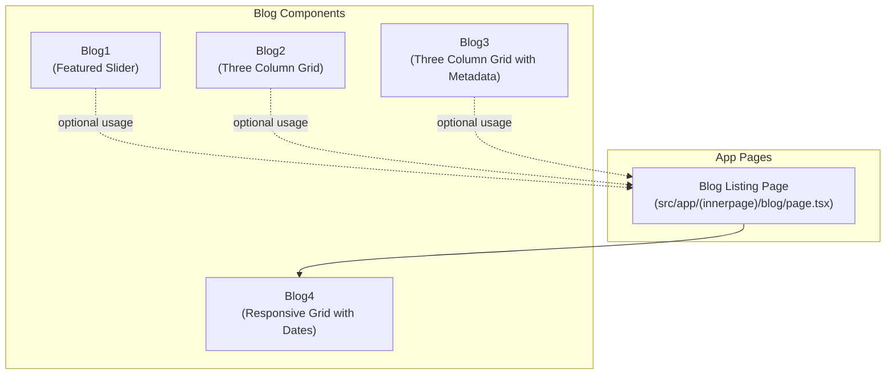
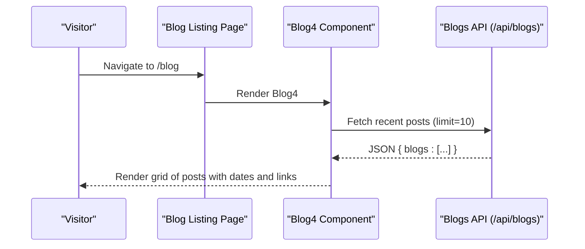
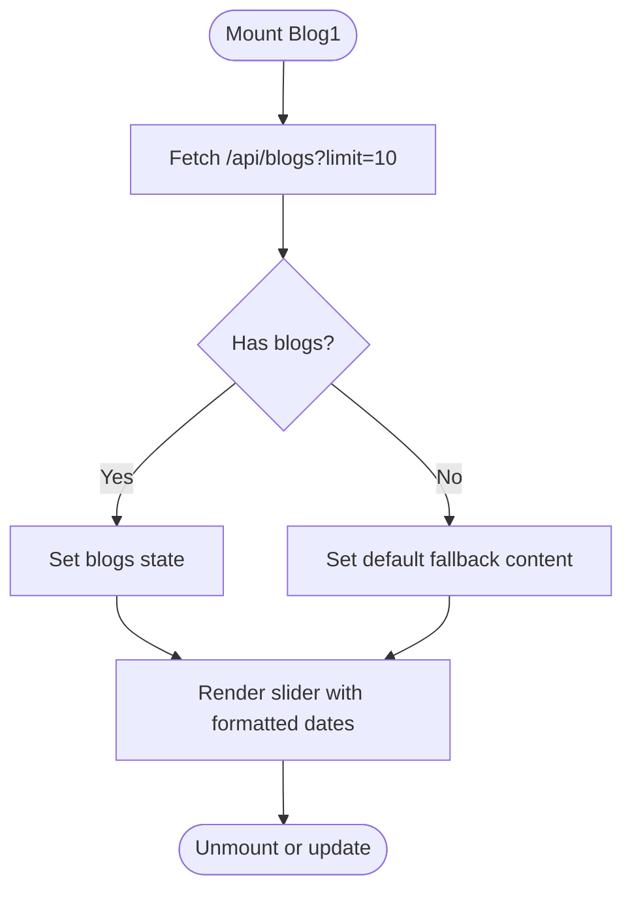
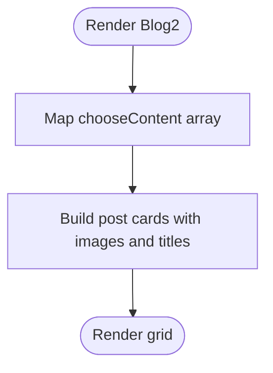
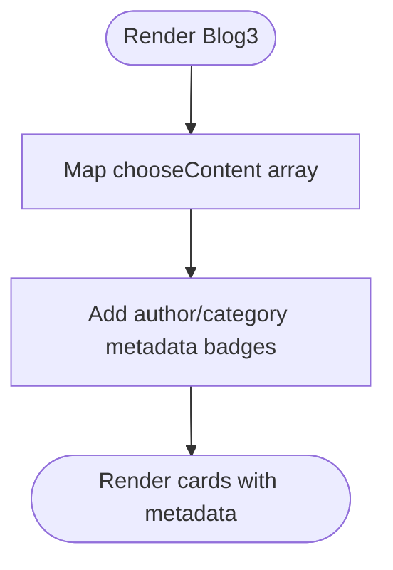
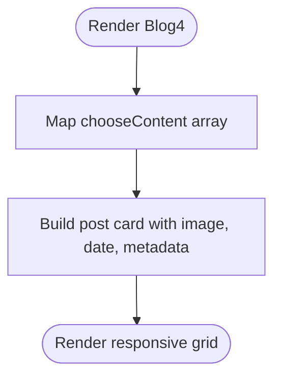
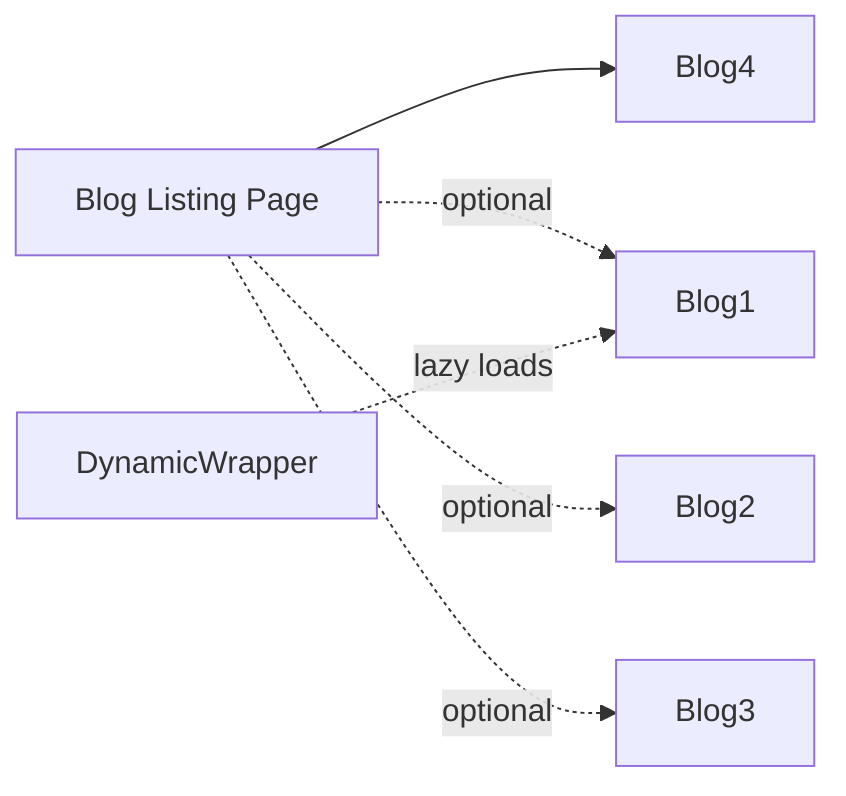

# Blog Components

<cite>
**Referenced Files in This Document**
- [Blog1.tsx](file://src/app/Components/Blog/Blog1.tsx)
- [Blog2.tsx](file://src/app/Components/Blog/Blog2.tsx)
- [Blog3.tsx](file://src/app/Components/Blog/Blog3.tsx)
- [Blog4.tsx](file://src/app/Components/Blog/Blog4.tsx)
- [page.tsx](file://src/app/(innerpage)/blog/page.tsx)
- [DynamicWrapper.tsx](file://src/app/Components/Common/DynamicWrapper.tsx)
</cite>

## Table of Contents
1. [Introduction](#introduction)
2. [Project Structure](#project-structure)
3. [Core Components](#core-components)
4. [Architecture Overview](#architecture-overview)
5. [Detailed Component Analysis](#detailed-component-analysis)
6. [Dependency Analysis](#dependency-analysis)
7. [Performance Considerations](#performance-considerations)
8. [Troubleshooting Guide](#troubleshooting-guide)
9. [Conclusion](#conclusion)

## Introduction
This document describes the blog component system used by attechglobal.com to render article listings and featured posts across the website. It focuses on four distinct blog component variations (Blog1, Blog2, Blog3, Blog4), detailing their use cases, layouts, design patterns, props, rendering logic, responsiveness, and integration into the overall page structure. Practical usage examples, customization options, performance considerations, lazy-loading strategies, and accessibility features are included to help developers and content editors deploy and maintain the blog displays effectively.

## Project Structure
The blog components are located under the Components/Blog directory and are integrated into inner pages such as the main blog listing. The blog listing page composes Blog4 to present a grid of recent articles.

**Diagram sources**
- [page.tsx](file://src/app/(innerpage)/blog/page.tsx#L1-L17)
- [Blog1.tsx](file://src/app/Components/Blog/Blog1.tsx#L1-L215)
- [Blog2.tsx](file://src/app/Components/Blog/Blog2.tsx#L1-L62)
- [Blog3.tsx](file://src/app/Components/Blog/Blog3.tsx#L1-L90)
- [Blog4.tsx](file://src/app/Components/Blog/Blog4.tsx#L1-L87)

**Section sources**
- [page.tsx](file://src/app/(innerpage)/blog/page.tsx#L1-L17)

## Core Components
This section summarizes the four blog components, their intended use cases, and typical rendering patterns.

- Blog1: A responsive carousel/slider showcasing recent blog posts with date badges and navigation controls. Best for highlighting featured or recent articles with auto-play and swipe support.
- Blog2: A three-column grid layout for displaying curated posts with placeholder dates and fixed links. Suitable for “Latest News” sections on landing pages.
- Blog3: A three-column grid with metadata badges (author and category) and decorative background shapes. Ideal for showcasing recent articles with richer metadata.
- Blog4: A responsive grid layout optimized for the blog listing page, including publish dates and flexible slugs/links per item.

**Section sources**
- [Blog1.tsx](file://src/app/Components/Blog/Blog1.tsx#L1-L215)
- [Blog2.tsx](file://src/app/Components/Blog/Blog2.tsx#L1-L62)
- [Blog3.tsx](file://src/app/Components/Blog/Blog3.tsx#L1-L90)
- [Blog4.tsx](file://src/app/Components/Blog/Blog4.tsx#L1-L87)

## Architecture Overview
The blog listing page composes Blog4 to render a responsive grid of posts. Blog1 is available for optional use in other contexts requiring a slider. Blog2 and Blog3 are suitable for homepage or section highlights. Dynamic wrappers enable deferred loading of heavier components when needed.

**Diagram sources**
- [page.tsx](file://src/app/(innerpage)/blog/page.tsx#L1-L17)
- [Blog4.tsx](file://src/app/Components/Blog/Blog4.tsx#L1-L87)
- [Blog1.tsx](file://src/app/Components/Blog/Blog1.tsx#L24-L51)

## Detailed Component Analysis

### Blog1: Featured Slider
- Purpose: Display a horizontally scrolling, auto-play slider of blog posts with navigation arrows and date badges.
- Layout: Responsive slider with breakpoints for large, medium, and small screens; defaults to two visible slides with one slide scrolled at a time.
- Rendering logic:
  - Fetches posts via a client-side fetch to the blogs endpoint with a limit parameter.
  - Falls back to default content if the API returns empty or fails.
  - Formats publication dates into day/month for each post.
  - Generates individual post links based on slug or defaults to a standard detail page.
- Accessibility:
  - Uses aria-labels on interactive elements and links for screen reader support.
- Customization:
  - Adjust autoplay speed, slide count, and responsive breakpoints by editing slider settings.
  - Replace default fallback content with CMS-driven content if desired.
- Integration:
  - Can be composed on landing or dedicated blog pages where featured content is prioritized.

**Diagram sources**
- [Blog1.tsx](file://src/app/Components/Blog/Blog1.tsx#L24-L51)
- [Blog1.tsx](file://src/app/Components/Blog/Blog1.tsx#L144-L201)

**Section sources**
- [Blog1.tsx](file://src/app/Components/Blog/Blog1.tsx#L1-L215)

### Blog2: Three-Column Grid (Default Links)
- Purpose: Present three curated posts with placeholder dates and fixed links to a detail page.
- Layout: Equal-width columns on large screens; stacked vertically on smaller screens.
- Rendering logic:
  - Renders a predefined array of items with image, title, and content.
  - Uses fixed links to a detail page for all items.
- Customization:
  - Modify the chooseContent array to change displayed posts.
  - Update date placeholders or replace with dynamic data if needed.
- Integration:
  - Suitable for homepage highlights or “Latest News” sections.

**Diagram sources**
- [Blog2.tsx](file://src/app/Components/Blog/Blog2.tsx#L7-L11)
- [Blog2.tsx](file://src/app/Components/Blog/Blog2.tsx#L25-L52)

**Section sources**
- [Blog2.tsx](file://src/app/Components/Blog/Blog2.tsx#L1-L62)

### Blog3: Three-Column Grid with Metadata
- Purpose: Showcase three posts with author and category metadata badges.
- Layout: Three equal columns on large screens with a decorative background shape.
- Rendering logic:
  - Displays metadata badges for author and category.
  - Uses fixed links to a detail page for all items.
- Customization:
  - Edit the chooseContent array to change posts and categories.
  - Adjust metadata icons and labels as needed.
- Integration:
  - Ideal for homepage sections or content showcases requiring richer metadata.

**Diagram sources**
- [Blog3.tsx](file://src/app/Components/Blog/Blog3.tsx#L7-L11)
- [Blog3.tsx](file://src/app/Components/Blog/Blog3.tsx#L25-L77)

**Section sources**
- [Blog3.tsx](file://src/app/Components/Blog/Blog3.tsx#L1-L90)

### Blog4: Responsive Grid for Blog Listing
- Purpose: Display a responsive grid of recent posts on the blog listing page.
- Layout: Responsive three-column grid with absolute positioning for decorative shapes.
- Rendering logic:
  - Iterates over a predefined list of posts with image, title, content, link, and date.
  - Uses individual item links or falls back to a default detail page.
  - Displays publish dates as day/month badges.
- Customization:
  - Update the chooseContent array to reflect current posts.
  - Change links to match actual slugs or routes.
- Integration:
  - Used by the blog listing page to present recent articles.

**Diagram sources**
- [Blog4.tsx](file://src/app/Components/Blog/Blog4.tsx#L7-L15)
- [Blog4.tsx](file://src/app/Components/Blog/Blog4.tsx#L22-L74)

**Section sources**
- [Blog4.tsx](file://src/app/Components/Blog/Blog4.tsx#L1-L87)
- [page.tsx](file://src/app/(innerpage)/blog/page.tsx#L1-L17)

## Dependency Analysis
- Composition:
  - The blog listing page imports and renders Blog4.
  - Blog1 is available for optional use in other pages or sections.
  - Blog2 and Blog3 are standalone components suitable for homepage highlights.
- Dynamic loading:
  - Dynamic wrappers exist for components including Blog1, enabling deferred loading when performance or bundle size is a concern.

**Diagram sources**
- [page.tsx](file://src/app/(innerpage)/blog/page.tsx#L1-L17)
- [DynamicWrapper.tsx](file://src/app/Components/Common/DynamicWrapper.tsx#L37-L40)

**Section sources**
- [page.tsx](file://src/app/(innerpage)/blog/page.tsx#L1-L17)
- [DynamicWrapper.tsx](file://src/app/Components/Common/DynamicWrapper.tsx#L37-L40)

## Performance Considerations
- Client-side data fetching:
  - Blog1 performs a client-side fetch to the blogs endpoint with a limit parameter. Consider caching strategies or server-side rendering for improved initial load performance.
- Lazy loading:
  - Use the dynamic wrapper around Blog1 to defer loading until needed, reducing initial bundle size and improving First Contentful Paint.
- Images:
  - Next.js Image is used consistently; ensure appropriate widths/heights are provided to avoid layout shifts and optimize asset delivery.
- Carousel behavior:
  - Auto-play and swipe interactions in Blog1 can increase CPU usage on lower-end devices. Consider disabling autoplay on mobile or reducing animation duration for better performance.
- Rendering scale:
  - Blog4 iterates over a predefined list; keep the list size reasonable to avoid excessive DOM nodes. Virtualization is not currently implemented.

[No sources needed since this section provides general guidance]

## Troubleshooting Guide
- Empty or missing posts:
  - If the blogs endpoint returns no data, Blog1 falls back to default content. Verify the endpoint availability and response format.
- Incorrect links:
  - Blog1 derives links from slugs; ensure slugs are populated or the fallback route is configured. Blog4 uses per-item links; confirm each item’s link value.
- Date formatting:
  - Blog1 formats dates from published_date or created_at; ensure these fields are present and valid ISO strings.
- Accessibility:
  - All interactive links include aria-label attributes. Confirm that custom content updates preserve these labels for assistive technologies.
- Dynamic wrapper:
  - If using dynamic wrappers, ensure the component path is correct and the wrapper is applied only where necessary to avoid unnecessary overhead.

**Section sources**
- [Blog1.tsx](file://src/app/Components/Blog/Blog1.tsx#L24-L51)
- [Blog1.tsx](file://src/app/Components/Blog/Blog1.tsx#L64-L69)
- [Blog4.tsx](file://src/app/Components/Blog/Blog4.tsx#L25-L30)

## Conclusion
The attechglobal.com blog component system offers flexible, reusable building blocks for displaying articles across different contexts. Blog1 emphasizes featured content with a slider, while Blog2 and Blog3 focus on curated grids with varying metadata richness. Blog4 powers the blog listing page with a responsive grid and date badges. By combining these components with dynamic loading and careful performance tuning, teams can deliver fast, accessible, and visually consistent blog experiences tailored to each page’s needs.