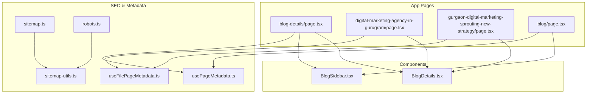
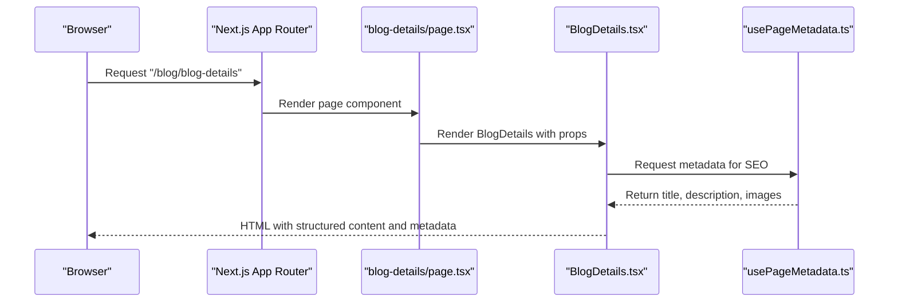
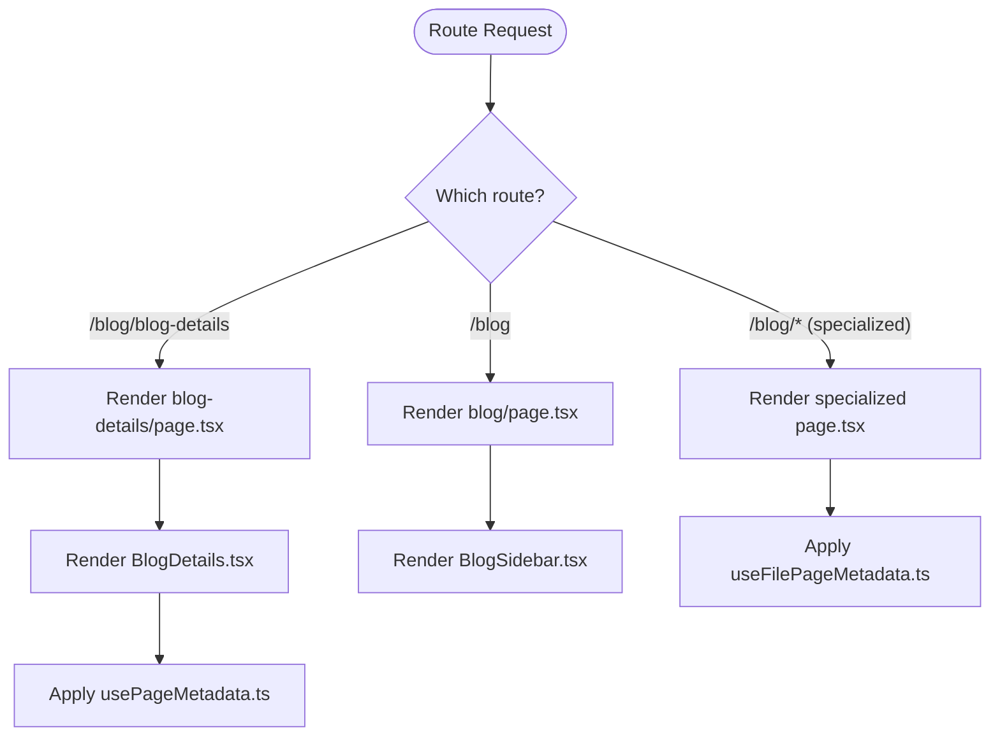
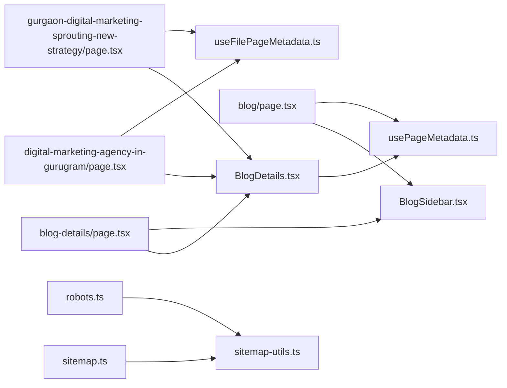

# Blog Details Components

<cite>
**Referenced Files in This Document**
- [BlogDetails.tsx](file://src/app/Components/BlogDetails/BlogDetails.tsx)
- [BlogSidebar.tsx](file://src/app/Components/BlogSidebar/BlogSidebar.tsx)
- [blog-details/page.tsx](file://src/app/(innerpage)/blog/blog-details/page.tsx)
- [digital-marketing-agency-in-gurugram/page.tsx](file://src/app/(innerpage)/blog/digital-marketing-agency-in-gurugram/page.tsx)
- [gurgaon-digital-marketing-sprouting-new-strategy/page.tsx](file://src/app/(innerpage)/blog/gurgaon-digital-marketing-sprouting-new-strategy/page.tsx)
- [blog/page.tsx](file://src/app/(innerpage)/blog/page.tsx)
- [layout.tsx](file://src/app/(innerpage)/layout.tsx)
- [usePageMetadata.ts](file://src/hooks/usePageMetadata.ts)
- [useFilePageMetadata.ts](file://src/hooks/useFilePageMetadata.ts)
- [sitemap-utils.ts](file://src/lib/sitemap-utils.ts)
- [sitemap.ts](file://src/app/sitemap.ts)
- [robots.ts](file://src/app/robots.ts)
- [sitemap.xml](file://out/sitemap.xml)
- [robots.txt](file://out/robots.txt)
</cite>

## Table of Contents
1. [Introduction](#introduction)
2. [Project Structure](#project-structure)
3. [Core Components](#core-components)
4. [Architecture Overview](#architecture-overview)
5. [Detailed Component Analysis](#detailed-component-analysis)
6. [Dependency Analysis](#dependency-analysis)
7. [Performance Considerations](#performance-considerations)
8. [Troubleshooting Guide](#troubleshooting-guide)
9. [Conclusion](#conclusion)
10. [Appendices](#appendices)

## Introduction
This document explains the blog details component system for attechglobal.com, focusing on the main BlogDetails component and specialized content variants used for location-based marketing. It covers how complete blog posts are rendered, including content formatting, metadata display, author and comments integration, and related content presentation. It also documents specialized templates such as DigitalMarketingAgencyGurugram and GurgaonDigitalMarketingStrategy, their intended use cases, and how they fit into the broader content management workflow. Practical guidance is included for customization, content injection patterns, and SEO optimization.

## Project Structure
The blog details system is composed of:
- A reusable BlogDetails component that renders a single post with sidebar widgets, author bio, comments, and related content.
- A BlogSidebar component that provides search, categories, recent posts, and tags for navigation and discovery.
- Page routes under the innerpage/blog namespace that render the blog listing and individual post pages.
- Specialized pages for location-based content (e.g., Gurugram digital marketing agency).
- Hooks and utilities supporting dynamic metadata and SEO generation.
- Sitemap and robots generation for SEO indexing.

**Diagram sources**
- [blog-details/page.tsx](file://src/app/(innerpage)/blog/blog-details/page.tsx#L1-L50)
- [digital-marketing-agency-in-gurugram/page.tsx](file://src/app/(innerpage)/blog/digital-marketing-agency-in-gurugram/page.tsx#L1-L50)
- [gurgaon-digital-marketing-sprouting-new-strategy/page.tsx](file://src/app/(innerpage)/blog/gurgaon-digital-marketing-sprouting-new-strategy/page.tsx#L1-L50)
- [blog/page.tsx](file://src/app/(innerpage)/blog/page.tsx#L1-L50)
- [BlogDetails.tsx](file://src/app/Components/BlogDetails/BlogDetails.tsx#L1-L215)
- [BlogSidebar.tsx](file://src/app/Components/BlogSidebar/BlogSidebar.tsx#L1-L169)
- [usePageMetadata.ts](file://src/hooks/usePageMetadata.ts#L1-L200)
- [useFilePageMetadata.ts](file://src/hooks/useFilePageMetadata.ts#L1-L200)
- [sitemap-utils.ts](file://src/lib/sitemap-utils.ts#L1-L200)
- [sitemap.ts](file://src/app/sitemap.ts#L1-L200)
- [robots.ts](file://src/app/robots.ts#L1-L200)

**Section sources**
- [blog-details/page.tsx](file://src/app/(innerpage)/blog/blog-details/page.tsx#L1-L50)
- [BlogDetails.tsx](file://src/app/Components/BlogDetails/BlogDetails.tsx#L1-L215)
- [BlogSidebar.tsx](file://src/app/Components/BlogSidebar/BlogSidebar.tsx#L1-L169)

## Core Components
- BlogDetails: Renders a single blog post with banner image, metadata (date, author), formatted paragraphs, blockquotes, gallery images, tags, author bio, comments list, and a comment form. It also includes a sidebar container for related widgets.
- BlogSidebar: Provides search, categories, recent posts, and tags for discovery and navigation.

Key rendering patterns:
- Content formatting: Headings, paragraphs, blockquotes, and image galleries are structured for readability and responsive layouts.
- Metadata display: Post date and author are presented with icons and semantic markup.
- Related content integration: Recent posts and tags are included in the sidebar widget area.
- Comments and author: Author bio and comments list are integrated below the main content.

**Section sources**
- [BlogDetails.tsx](file://src/app/Components/BlogDetails/BlogDetails.tsx#L1-L215)
- [BlogSidebar.tsx](file://src/app/Components/BlogSidebar/BlogSidebar.tsx#L1-L169)

## Architecture Overview
The blog details architecture follows a layered pattern:
- Page routes define the URL surface and pass props/data to components.
- Components encapsulate rendering logic and present content consistently.
- Hooks supply dynamic metadata for SEO and social previews.
- Utilities generate sitemaps and robots directives for search engine indexing.

**Diagram sources**
- [blog-details/page.tsx](file://src/app/(innerpage)/blog/blog-details/page.tsx#L1-L50)
- [BlogDetails.tsx](file://src/app/Components/BlogDetails/BlogDetails.tsx#L1-L215)
- [usePageMetadata.ts](file://src/hooks/usePageMetadata.ts#L1-L200)

## Detailed Component Analysis

### BlogDetails Component
Responsibilities:
- Display the featured banner image and publish date/author metadata.
- Render formatted content blocks (headings, paragraphs, blockquotes).
- Present a gallery of images and associated tags.
- Include author bio and comments section with a reply form.

Implementation highlights:
- Uses Next.js Image for optimized media rendering.
- Structured semantic markup for accessibility and SEO.
- Responsive grid layout for sidebar and content areas.

Customization patterns:
- Content injection: Replace static content with dynamic props passed from the page route.
- Styling: Adjust CSS classes for typography and spacing to match brand guidelines.
- Widgets: Add/remove sidebar widgets by composing BlogSidebar inside the page wrapper.

SEO considerations:
- Integrate metadata hooks to set page title, description, and open graph/social images.
- Ensure canonical URLs and structured data where applicable.

**Section sources**
- [BlogDetails.tsx](file://src/app/Components/BlogDetails/BlogDetails.tsx#L1-L215)

### BlogSidebar Component
Responsibilities:
- Provide search, categories, recent posts, and tags widgets.
- Support navigation and content discovery.

Integration patterns:
- Reuse across listing and details pages to maintain consistent UX.
- Compose with BlogDetails to share common sidebar layout.

**Section sources**
- [BlogSidebar.tsx](file://src/app/Components/BlogSidebar/BlogSidebar.tsx#L1-L169)

### Specialized Content Templates

#### DigitalMarketingAgencyGurugram
Purpose:
- Target location-based SEO for “digital marketing agency in Gurugram.”
- Deliver localized messaging around service offerings, client outcomes, and regional relevance.

Implementation approach:
- Use a dedicated page route to host curated content and metadata.
- Compose BlogDetails to render the article body while applying location-specific branding and imagery.
- Inject dynamic metadata via useFilePageMetadata to reflect city-centric keywords and descriptions.

Customization tips:
- Localize headlines, testimonials, and imagery to reflect Gurugram market characteristics.
- Include schema-friendly metadata for FAQ or local business information.

**Section sources**
- [digital-marketing-agency-in-gurugram/page.tsx](file://src/app/(innerpage)/blog/digital-marketing-agency-in-gurugram/page.tsx#L1-L50)
- [useFilePageMetadata.ts](file://src/hooks/useFilePageMetadata.ts#L1-L200)

#### GurgaonDigitalMarketingStrategy
Purpose:
- Focus on strategic insights and actionable advice for digital marketing in Gurgaon.
- Serve as a thought leadership piece with localized examples and case studies.

Implementation approach:
- Mirror the BlogDetails layout for consistency.
- Apply specialized metadata and content hooks to emphasize strategy and location.
- Ensure internal linking to related services and landing pages.

**Section sources**
- [gurgaon-digital-marketing-sprouting-new-strategy/page.tsx](file://src/app/(innerpage)/blog/gurgaon-digital-marketing-sprouting-new-strategy/page.tsx#L1-L50)
- [useFilePageMetadata.ts](file://src/hooks/usePageMetadata.ts#L1-L200)

### Page Routes and Layout
- blog-details/page.tsx: Renders a standard blog post using BlogDetails and integrates shared metadata hooks.
- blog/page.tsx: Renders a blog listing with BlogSidebar for navigation and discovery.
- layout.tsx: Provides the shared layout for inner pages, ensuring consistent header, footer, and global styles.

**Diagram sources**
- [blog-details/page.tsx](file://src/app/(innerpage)/blog/blog-details/page.tsx#L1-L50)
- [blog/page.tsx](file://src/app/(innerpage)/blog/page.tsx#L1-L50)
- [digital-marketing-agency-in-gurugram/page.tsx](file://src/app/(innerpage)/blog/digital-marketing-agency-in-gurugram/page.tsx#L1-L50)
- [gurgaon-digital-marketing-sprouting-new-strategy/page.tsx](file://src/app/(innerpage)/blog/gurgaon-digital-marketing-sprouting-new-strategy/page.tsx#L1-L50)
- [BlogDetails.tsx](file://src/app/Components/BlogDetails/BlogDetails.tsx#L1-L215)
- [BlogSidebar.tsx](file://src/app/Components/BlogSidebar/BlogSidebar.tsx#L1-L169)
- [usePageMetadata.ts](file://src/hooks/usePageMetadata.ts#L1-L200)
- [useFilePageMetadata.ts](file://src/hooks/useFilePageMetadata.ts#L1-L200)

**Section sources**
- [blog-details/page.tsx](file://src/app/(innerpage)/blog/blog-details/page.tsx#L1-L50)
- [blog/page.tsx](file://src/app/(innerpage)/blog/page.tsx#L1-L50)
- [layout.tsx](file://src/app/(innerpage)/layout.tsx#L1-L200)

## Dependency Analysis
The system exhibits low coupling and high cohesion:
- Pages depend on components for rendering.
- Components are self-contained and reusable.
- Metadata hooks decouple SEO concerns from rendering logic.
- Sitemap and robots utilities centralize SEO infrastructure.

**Diagram sources**
- [blog-details/page.tsx](file://src/app/(innerpage)/blog/blog-details/page.tsx#L1-L50)
- [digital-marketing-agency-in-gurugram/page.tsx](file://src/app/(innerpage)/blog/digital-marketing-agency-in-gurugram/page.tsx#L1-L50)
- [gurgaon-digital-marketing-sprouting-new-strategy/page.tsx](file://src/app/(innerpage)/blog/gurgaon-digital-marketing-sprouting-new-strategy/page.tsx#L1-L50)
- [blog/page.tsx](file://src/app/(innerpage)/blog/page.tsx#L1-L50)
- [BlogDetails.tsx](file://src/app/Components/BlogDetails/BlogDetails.tsx#L1-L215)
- [BlogSidebar.tsx](file://src/app/Components/BlogSidebar/BlogSidebar.tsx#L1-L169)
- [usePageMetadata.ts](file://src/hooks/usePageMetadata.ts#L1-L200)
- [useFilePageMetadata.ts](file://src/hooks/useFilePageMetadata.ts#L1-L200)
- [sitemap.ts](file://src/app/sitemap.ts#L1-L200)
- [robots.ts](file://src/app/robots.ts#L1-L200)
- [sitemap-utils.ts](file://src/lib/sitemap-utils.ts#L1-L200)

**Section sources**
- [blog-details/page.tsx](file://src/app/(innerpage)/blog/blog-details/page.tsx#L1-L50)
- [BlogDetails.tsx](file://src/app/Components/BlogDetails/BlogDetails.tsx#L1-L215)
- [BlogSidebar.tsx](file://src/app/Components/BlogSidebar/BlogSidebar.tsx#L1-L169)
- [usePageMetadata.ts](file://src/hooks/usePageMetadata.ts#L1-L200)
- [useFilePageMetadata.ts](file://src/hooks/useFilePageMetadata.ts#L1-L200)
- [sitemap.ts](file://src/app/sitemap.ts#L1-L200)
- [robots.ts](file://src/app/robots.ts#L1-L200)
- [sitemap-utils.ts](file://src/lib/sitemap-utils.ts#L1-L200)

## Performance Considerations
- Lazy loading and optimized images: Use Next.js Image with appropriate widths/heights to reduce CLS and improve LCP.
- Minimize re-renders: Keep component props shallow and memoize heavy computations.
- Bundle splitting: Ensure components are tree-shaken and not duplicated across pages.
- Prefetching: Consider prefetching related post slugs for seamless navigation.
- Critical CSS: Inline essential styles for above-the-fold content to improve FID.

## Troubleshooting Guide
Common issues and resolutions:
- Missing metadata: Verify that usePageMetadata or useFilePageMetadata is invoked and returns expected values for title, description, and images.
- Broken images: Confirm asset paths and sizes; ensure Next.js Image receives valid width/height.
- Sidebar duplication: Ensure BlogSidebar is only included where needed to avoid layout bloat.
- SEO indexing: Validate sitemap generation and robots.txt rules; confirm canonical URLs and structured data.

**Section sources**
- [usePageMetadata.ts](file://src/hooks/usePageMetadata.ts#L1-L200)
- [useFilePageMetadata.ts](file://src/hooks/useFilePageMetadata.ts#L1-L200)
- [sitemap.ts](file://src/app/sitemap.ts#L1-L200)
- [robots.ts](file://src/app/robots.ts#L1-L200)

## Conclusion
The blog details component system centers on a flexible BlogDetails component and a complementary BlogSidebar, enabling consistent, SEO-friendly rendering of blog posts. Specialized pages tailor content for location-based campaigns while reusing core components and metadata hooks. The architecture supports easy customization, content injection, and robust SEO through sitemaps and robots generation.

## Appendices

### SEO Optimization Checklist
- Ensure each page sets unique title and description via metadata hooks.
- Include Open Graph and Twitter Card images for social sharing.
- Generate and validate sitemap entries for all blog routes.
- Confirm robots.txt allows indexing of blog content.
- Use canonical URLs to prevent duplicate content issues.

**Section sources**
- [usePageMetadata.ts](file://src/hooks/usePageMetadata.ts#L1-L200)
- [useFilePageMetadata.ts](file://src/hooks/useFilePageMetadata.ts#L1-L200)
- [sitemap.ts](file://src/app/sitemap.ts#L1-L200)
- [robots.ts](file://src/app/robots.ts#L1-L200)
- [sitemap.xml](file://out/sitemap.xml#L1-L200)
- [robots.txt](file://out/robots.txt#L1-L200)