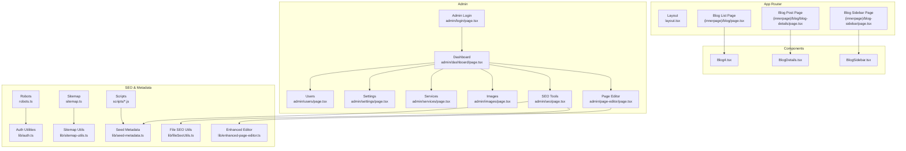
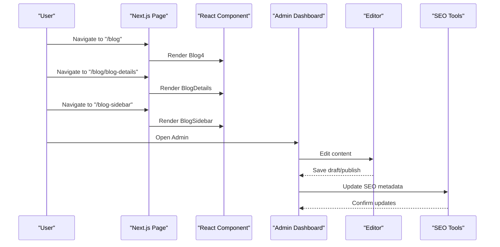
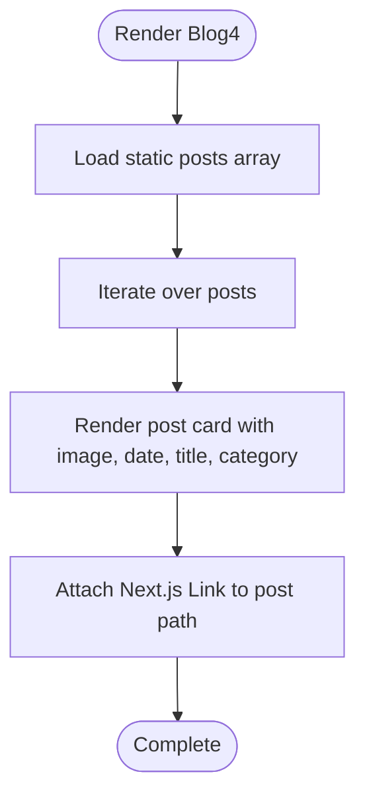
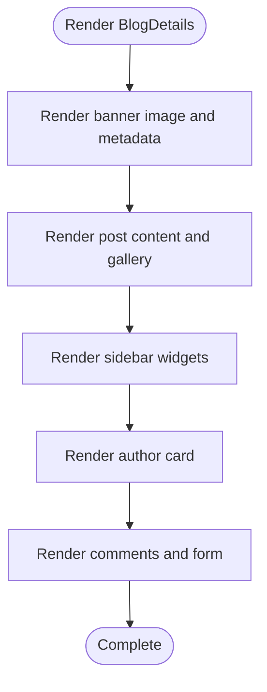
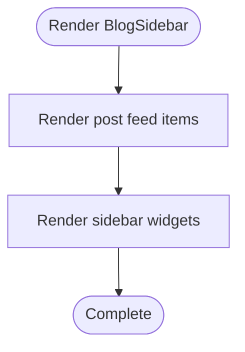
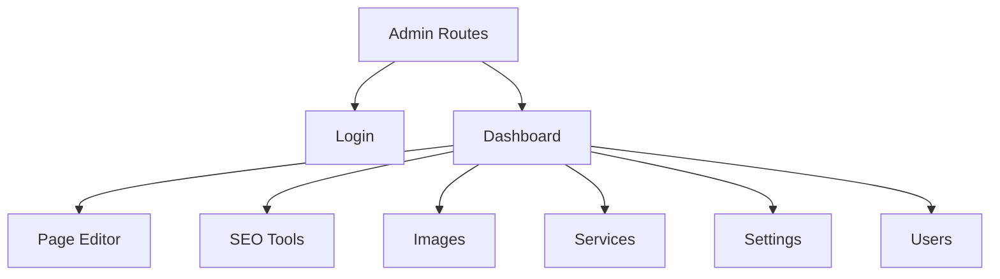
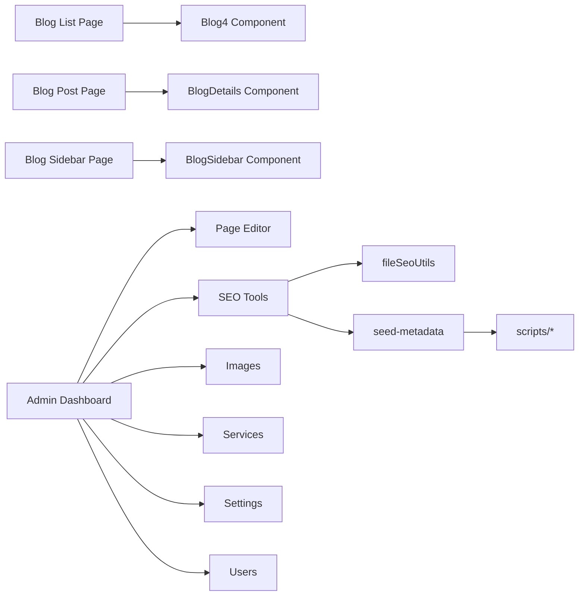

# Blog Management

<cite>
**Referenced Files in This Document**
- [page.tsx](file://src/app/(innerpage)/blog/page.tsx)
- [page.tsx](file://src/app/(innerpage)/blog/blog-details/page.tsx)
- [page.tsx](file://src/app/(innerpage)/blog-sidebar/page.tsx)
- [Blog4.tsx](file://src/app/Components/Blog/Blog4.tsx)
- [BlogDetails.tsx](file://src/app/Components/BlogDetails/BlogDetails.tsx)
- [BlogSidebar.tsx](file://src/app/Components/BlogSidebar/BlogSidebar.tsx)
- [layout.tsx](file://src/app/layout.tsx)
- [robots.ts](file://src/app/robots.ts)
- [sitemap.ts](file://src/app/sitemap.ts)
- [login page.tsx](file://src/app/admin/login/page.tsx)
- [dashboard page.tsx](file://src/app/admin/dashboard/page.tsx)
- [page-editor page.tsx](file://src/app/admin/page-editor/page.tsx)
- [seo page.tsx](file://src/app/admin/seo/page.tsx)
- [images page.tsx](file://src/app/admin/images/page.tsx)
- [services page.tsx](file://src/app/admin/services/page.tsx)
- [settings page.tsx](file://src/app/admin/settings/page.tsx)
- [users page.tsx](file://src/app/admin/users/page.tsx)
- [auth.ts](file://src/lib/auth.ts)
- [enhanced-page-editor.ts](file://src/lib/enhanced-page-editor.ts)
- [seed-metadata.ts](file://src/lib/seed-metadata.ts)
- [fileSeoUtils.ts](file://src/lib/fileSeoUtils.ts)
- [sitemap-utils.ts](file://src/lib/sitemap-utils.ts)
- [add-all-pages-to-seo.js](file://scripts/add-all-pages-to-seo.js)
- [check-seo-data.js](file://scripts/check-seo-data.js)
- [discover-pages.js](file://scripts/discover-pages.js)
- [init-database.js](file://scripts/init-database.js)
- [seed-seo-data.js](file://scripts/seed-seo-data.js)
- [README.md](file://README.md)
- [PRD_Services_Content_Strategy.md](file://PRD_Services_Content_Strategy.md)
- [SEO_MANAGEMENT_GUIDE.md](file://SEO_MANAGEMENT_GUIDE.md)
- [PAGE_EDITOR_README.md](file://PAGE_EDITOR_README.md)
- [ADMIN_DASHBOARD_SETUP.md](file://ADMIN_DASHBOARD_SETUP.md)
- [IMAGE_MANAGEMENT_SETUP.md](file://IMAGE_MANAGEMENT_SETUP.md)
- [Implementation_Plan.md](file://Implementation_Plan.md)
</cite>

## Table of Contents
1. [Introduction](#introduction)
2. [Project Structure](#project-structure)
3. [Core Components](#core-components)
4. [Architecture Overview](#architecture-overview)
5. [Detailed Component Analysis](#detailed-component-analysis)
6. [Dependency Analysis](#dependency-analysis)
7. [Performance Considerations](#performance-considerations)
8. [Troubleshooting Guide](#troubleshooting-guide)
9. [Conclusion](#conclusion)
10. [Appendices](#appendices)

## Introduction
This document describes the blog management system for attechglobal.com, focusing on the frontend components that render blog listings, individual post pages, and sidebar widgets, as well as the administrative capabilities for content creation, editing, and publishing. It explains how the Next.js app router pages integrate with reusable React components, outlines the current content structure and navigation, and documents the admin dashboard and SEO tooling that supports ongoing content operations.

The blog system currently uses static, hardcoded content in components for demonstration. To enable dynamic content creation and editing, the project includes an admin area and SEO tooling that can be extended to support a CMS-backed workflow.

## Project Structure
The blog functionality is organized under the Next.js app router:
- Pages: route handlers for blog listing, post detail, and sidebar variants
- Components: reusable UI blocks for listing posts, displaying a single post, and rendering sidebar widgets
- Admin: a dedicated admin area for managing content, SEO, images, services, settings, and users
- SEO and metadata: libraries and scripts to manage SEO data and sitemaps

**Diagram sources**
- [layout.tsx](file://src/app/layout.tsx#L1-L200)
- [page.tsx](file://src/app/(innerpage)/blog/page.tsx#L1-L17)
- [page.tsx](file://src/app/(innerpage)/blog/blog-details/page.tsx#L1-L17)
- [page.tsx](file://src/app/(innerpage)/blog-sidebar/page.tsx#L1-L17)
- [Blog4.tsx](file://src/app/Components/Blog/Blog4.tsx#L1-L87)
- [BlogDetails.tsx](file://src/app/Components/BlogDetails/BlogDetails.tsx#L1-L215)
- [BlogSidebar.tsx](file://src/app/Components/BlogSidebar/BlogSidebar.tsx#L1-L169)
- [login page.tsx](file://src/app/admin/login/page.tsx#L1-L200)
- [dashboard page.tsx](file://src/app/admin/dashboard/page.tsx#L1-L200)
- [page-editor page.tsx](file://src/app/admin/page-editor/page.tsx#L1-L200)
- [seo page.tsx](file://src/app/admin/seo/page.tsx#L1-L200)
- [images page.tsx](file://src/app/admin/images/page.tsx#L1-L200)
- [services page.tsx](file://src/app/admin/services/page.tsx#L1-L200)
- [settings page.tsx](file://src/app/admin/settings/page.tsx#L1-L200)
- [users page.tsx](file://src/app/admin/users/page.tsx#L1-L200)
- [robots.ts](file://src/app/robots.ts#L1-L200)
- [sitemap.ts](file://src/app/sitemap.ts#L1-L200)
- [auth.ts](file://src/lib/auth.ts#L1-L200)
- [enhanced-page-editor.ts](file://src/lib/enhanced-page-editor.ts#L1-L200)
- [seed-metadata.ts](file://src/lib/seed-metadata.ts#L1-L200)
- [fileSeoUtils.ts](file://src/lib/fileSeoUtils.ts#L1-L200)
- [sitemap-utils.ts](file://src/lib/sitemap-utils.ts#L1-L200)

**Section sources**
- [page.tsx](file://src/app/(innerpage)/blog/page.tsx#L1-L17)
- [page.tsx](file://src/app/(innerpage)/blog/blog-details/page.tsx#L1-L17)
- [page.tsx](file://src/app/(innerpage)/blog-sidebar/page.tsx#L1-L17)
- [Blog4.tsx](file://src/app/Components/Blog/Blog4.tsx#L1-L87)
- [BlogDetails.tsx](file://src/app/Components/BlogDetails/BlogDetails.tsx#L1-L215)
- [BlogSidebar.tsx](file://src/app/Components/BlogSidebar/BlogSidebar.tsx#L1-L169)

## Core Components
- Blog listing page: renders a breadcrumb and the Blog4 component to display a grid of posts.
- Blog post page: renders a breadcrumb and the BlogDetails component to show a single post with sidebar widgets.
- Blog sidebar page: renders a breadcrumb and the BlogSidebar component to show a list-style layout with widgets.

Key responsibilities:
- Pages orchestrate layout and breadcrumbs, delegating content rendering to components.
- Components encapsulate markup and styling for listing, details, and sidebar layouts.
- Current content is static; future enhancements can connect these components to dynamic data sources.

**Section sources**
- [page.tsx](file://src/app/(innerpage)/blog/page.tsx#L1-L17)
- [page.tsx](file://src/app/(innerpage)/blog/blog-details/page.tsx#L1-L17)
- [page.tsx](file://src/app/(innerpage)/blog-sidebar/page.tsx#L1-L17)
- [Blog4.tsx](file://src/app/Components/Blog/Blog4.tsx#L1-L87)
- [BlogDetails.tsx](file://src/app/Components/BlogDetails/BlogDetails.tsx#L1-L215)
- [BlogSidebar.tsx](file://src/app/Components/BlogSidebar/BlogSidebar.tsx#L1-L169)

## Architecture Overview
The blog architecture follows a layered pattern:
- Pages: Next.js app router pages that import and render components.
- Components: Presentational React components that accept props and render UI.
- Admin: Separate routes for content management, SEO, and user administration.
- SEO/Metadata: Shared utilities and scripts to maintain SEO health and sitemaps.

**Diagram sources**
- [page.tsx](file://src/app/(innerpage)/blog/page.tsx#L1-L17)
- [page.tsx](file://src/app/(innerpage)/blog/blog-details/page.tsx#L1-L17)
- [page.tsx](file://src/app/(innerpage)/blog-sidebar/page.tsx#L1-L17)
- [Blog4.tsx](file://src/app/Components/Blog/Blog4.tsx#L1-L87)
- [BlogDetails.tsx](file://src/app/Components/BlogDetails/BlogDetails.tsx#L1-L215)
- [BlogSidebar.tsx](file://src/app/Components/BlogSidebar/BlogSidebar.tsx#L1-L169)
- [dashboard page.tsx](file://src/app/admin/dashboard/page.tsx#L1-L200)
- [page-editor page.tsx](file://src/app/admin/page-editor/page.tsx#L1-L200)
- [seo page.tsx](file://src/app/admin/seo/page.tsx#L1-L200)

## Detailed Component Analysis

### Blog Listing Component (Blog4)
Responsibilities:
- Renders a responsive grid of blog cards.
- Each card includes thumbnail, category badge, publish date, title, and “Read More” link.
- Uses Next.js Image and Link for optimized assets and routing.

Processing logic:
- Maintains a static array of post entries with image URL, title, category, link, and date.
- Maps over entries to render cards.

**Diagram sources**
- [Blog4.tsx](file://src/app/Components/Blog/Blog4.tsx#L7-L15)
- [Blog4.tsx](file://src/app/Components/Blog/Blog4.tsx#L22-L74)

**Section sources**
- [Blog4.tsx](file://src/app/Components/Blog/Blog4.tsx#L1-L87)

### Blog Post Details Component (BlogDetails)
Responsibilities:
- Displays a single post with banner image, metadata (date, author), content, blockquote, gallery images, tags, author bio, comments, and comment form.
- Includes a sidebar with search, categories, recent posts, and tags.

Processing logic:
- Static content for post body, author info, comments, and widget lists.
- Uses Next.js Image for all images and Link for navigation.

**Diagram sources**
- [BlogDetails.tsx](file://src/app/Components/BlogDetails/BlogDetails.tsx#L90-L135)
- [BlogDetails.tsx](file://src/app/Components/BlogDetails/BlogDetails.tsx#L10-L88)

**Section sources**
- [BlogDetails.tsx](file://src/app/Components/BlogDetails/BlogDetails.tsx#L1-L215)

### Blog Sidebar Component (BlogSidebar)
Responsibilities:
- Displays a list-style feed of posts with thumbnails, dates, titles, and excerpts.
- Includes the same sidebar widgets as BlogDetails: search, categories, recent posts, and tags.

Processing logic:
- Static array of post entries for the feed.
- Maps over entries to render list items.

**Diagram sources**
- [BlogSidebar.tsx](file://src/app/Components/BlogSidebar/BlogSidebar.tsx#L7-L11)
- [BlogSidebar.tsx](file://src/app/Components/BlogSidebar/BlogSidebar.tsx#L100-L156)

**Section sources**
- [BlogSidebar.tsx](file://src/app/Components/BlogSidebar/BlogSidebar.tsx#L1-L169)

### Admin Dashboard and Content Creation
The admin area provides:
- Login and dashboard for administrative access.
- Page editor for content editing.
- SEO tools for metadata management.
- Image management, services, settings, and users.

**Diagram sources**
- [login page.tsx](file://src/app/admin/login/page.tsx#L1-L200)
- [dashboard page.tsx](file://src/app/admin/dashboard/page.tsx#L1-L200)
- [page-editor page.tsx](file://src/app/admin/page-editor/page.tsx#L1-L200)
- [seo page.tsx](file://src/app/admin/seo/page.tsx#L1-L200)
- [images page.tsx](file://src/app/admin/images/page.tsx#L1-L200)
- [services page.tsx](file://src/app/admin/services/page.tsx#L1-L200)
- [settings page.tsx](file://src/app/admin/settings/page.tsx#L1-L200)
- [users page.tsx](file://src/app/admin/users/page.tsx#L1-L200)

**Section sources**
- [login page.tsx](file://src/app/admin/login/page.tsx#L1-L200)
- [dashboard page.tsx](file://src/app/admin/dashboard/page.tsx#L1-L200)
- [page-editor page.tsx](file://src/app/admin/page-editor/page.tsx#L1-L200)
- [seo page.tsx](file://src/app/admin/seo/page.tsx#L1-L200)
- [images page.tsx](file://src/app/admin/images/page.tsx#L1-L200)
- [services page.tsx](file://src/app/admin/services/page.tsx#L1-L200)
- [settings page.tsx](file://src/app/admin/settings/page.tsx#L1-L200)
- [users page.tsx](file://src/app/admin/users/page.tsx#L1-L200)

## Dependency Analysis
- Pages depend on Components for rendering.
- Components are self-contained presentational units.
- Admin routes depend on shared utilities for authentication and enhanced editing.
- SEO utilities and scripts depend on seed and file-based SEO helpers.

**Diagram sources**
- [page.tsx](file://src/app/(innerpage)/blog/page.tsx#L1-L17)
- [page.tsx](file://src/app/(innerpage)/blog/blog-details/page.tsx#L1-L17)
- [page.tsx](file://src/app/(innerpage)/blog-sidebar/page.tsx#L1-L17)
- [Blog4.tsx](file://src/app/Components/Blog/Blog4.tsx#L1-L87)
- [BlogDetails.tsx](file://src/app/Components/BlogDetails/BlogDetails.tsx#L1-L215)
- [BlogSidebar.tsx](file://src/app/Components/BlogSidebar/BlogSidebar.tsx#L1-L169)
- [dashboard page.tsx](file://src/app/admin/dashboard/page.tsx#L1-L200)
- [page-editor page.tsx](file://src/app/admin/page-editor/page.tsx#L1-L200)
- [seo page.tsx](file://src/app/admin/seo/page.tsx#L1-L200)
- [images page.tsx](file://src/app/admin/images/page.tsx#L1-L200)
- [services page.tsx](file://src/app/admin/services/page.tsx#L1-L200)
- [settings page.tsx](file://src/app/admin/settings/page.tsx#L1-L200)
- [users page.tsx](file://src/app/admin/users/page.tsx#L1-L200)
- [fileSeoUtils.ts](file://src/lib/fileSeoUtils.ts#L1-L200)
- [seed-metadata.ts](file://src/lib/seed-metadata.ts#L1-L200)
- [add-all-pages-to-seo.js](file://scripts/add-all-pages-to-seo.js#L1-L200)
- [check-seo-data.js](file://scripts/check-seo-data.js#L1-L200)
- [discover-pages.js](file://scripts/discover-pages.js#L1-L200)
- [init-database.js](file://scripts/init-database.js#L1-L200)
- [seed-seo-data.js](file://scripts/seed-seo-data.js#L1-L200)

**Section sources**
- [Blog4.tsx](file://src/app/Components/Blog/Blog4.tsx#L1-L87)
- [BlogDetails.tsx](file://src/app/Components/BlogDetails/BlogDetails.tsx#L1-L215)
- [BlogSidebar.tsx](file://src/app/Components/BlogSidebar/BlogSidebar.tsx#L1-L169)
- [dashboard page.tsx](file://src/app/admin/dashboard/page.tsx#L1-L200)
- [page-editor page.tsx](file://src/app/admin/page-editor/page.tsx#L1-L200)
- [seo page.tsx](file://src/app/admin/seo/page.tsx#L1-L200)
- [fileSeoUtils.ts](file://src/lib/fileSeoUtils.ts#L1-L200)
- [seed-metadata.ts](file://src/lib/seed-metadata.ts#L1-L200)
- [add-all-pages-to-seo.js](file://scripts/add-all-pages-to-seo.js#L1-L200)
- [check-seo-data.js](file://scripts/check-seo-data.js#L1-L200)
- [discover-pages.js](file://scripts/discover-pages.js#L1-L200)
- [init-database.js](file://scripts/init-database.js#L1-L200)
- [seed-seo-data.js](file://scripts/seed-seo-data.js#L1-L200)

## Performance Considerations
- Static content rendering: Components currently render static arrays, minimizing runtime computation.
- Asset optimization: Next.js Image is used for thumbnails and banners, enabling automatic optimization.
- Route separation: Dedicated pages for listing, details, and sidebar reduce unnecessary re-renders.
- Admin performance: Keep editor and SEO tools efficient by batching updates and avoiding excessive re-renders.

[No sources needed since this section provides general guidance]

## Troubleshooting Guide
Common areas to verify:
- Routing: Ensure Next.js app router paths match component imports in pages.
- Assets: Verify image URLs and dimensions for Next.js Image usage.
- Admin access: Confirm authentication utilities and login route work as expected.
- SEO: Validate robots and sitemap generation; check scripts for SEO data discovery and seeding.

**Section sources**
- [layout.tsx](file://src/app/layout.tsx#L1-L200)
- [robots.ts](file://src/app/robots.ts#L1-L200)
- [sitemap.ts](file://src/app/sitemap.ts#L1-L200)
- [auth.ts](file://src/lib/auth.ts#L1-L200)
- [enhanced-page-editor.ts](file://src/lib/enhanced-page-editor.ts#L1-L200)
- [fileSeoUtils.ts](file://src/lib/fileSeoUtils.ts#L1-L200)
- [sitemap-utils.ts](file://src/lib/sitemap-utils.ts#L1-L200)

## Conclusion
The blog management system at attechglobal.com currently provides a clean separation between pages and components, with a strong foundation for admin-driven content management and SEO tooling. The static content in components allows for quick iteration and optimization, while the admin dashboard and scripts set the stage for dynamic content workflows. Extending the components to consume dynamic data and integrating the admin tools with a backend will complete the publishing and management lifecycle.

[No sources needed since this section summarizes without analyzing specific files]

## Appendices

### Practical Examples and Workflows
- Creating a new blog post:
  - Use the admin page editor to compose content.
  - Add SEO metadata via the admin SEO tools.
  - Publish and verify via sitemap and robots checks.
- Editing an existing post:
  - Open the page editor, update content, and save drafts or publish.
  - Regenerate SEO metadata and re-run discovery scripts if URLs change.
- Previewing content:
  - Use the page editor’s preview mode to review formatting and links.
  - Validate images and links in the preview before publishing.

**Section sources**
- [page-editor page.tsx](file://src/app/admin/page-editor/page.tsx#L1-L200)
- [seo page.tsx](file://src/app/admin/seo/page.tsx#L1-L200)
- [sitemap.ts](file://src/app/sitemap.ts#L1-L200)
- [robots.ts](file://src/app/robots.ts#L1-L200)
- [discover-pages.js](file://scripts/discover-pages.js#L1-L200)
- [seed-seo-data.js](file://scripts/seed-seo-data.js#L1-L200)

### Content Structure, Categories, and SEO
- Content structure: Posts include metadata (author, date), body content, images, tags, and optional galleries.
- Categories: Sidebar widgets include categories and tag clouds for discoverability.
- SEO: Robots and sitemap are generated; scripts assist in discovering and seeding SEO data.

**Section sources**
- [BlogDetails.tsx](file://src/app/Components/BlogDetails/BlogDetails.tsx#L20-L87)
- [BlogSidebar.tsx](file://src/app/Components/BlogSidebar/BlogSidebar.tsx#L28-L95)
- [robots.ts](file://src/app/robots.ts#L1-L200)
- [sitemap.ts](file://src/app/sitemap.ts#L1-L200)
- [discover-pages.js](file://scripts/discover-pages.js#L1-L200)
- [seed-seo-data.js](file://scripts/seed-seo-data.js#L1-L200)

### Relationship to Website Structure and Marketing Narrative
- Blog pages integrate with the innerpage layout and share common components for branding and navigation.
- The blog supports marketing narratives by showcasing thought leadership, service offerings, and case studies through curated posts and categories.
- Admin tools enable alignment with marketing goals by controlling content volume, freshness, and SEO performance.

**Section sources**
- [layout.tsx](file://src/app/layout.tsx#L1-L200)
- [PRD_Services_Content_Strategy.md](file://PRD_Services_Content_Strategy.md#L1-L200)
- [README.md](file://README.md#L1-L200)