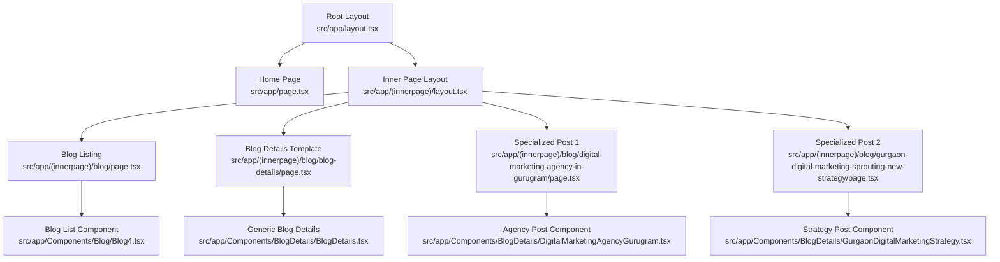
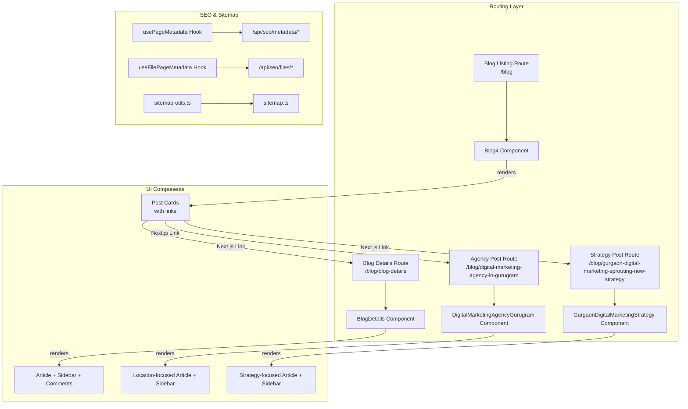
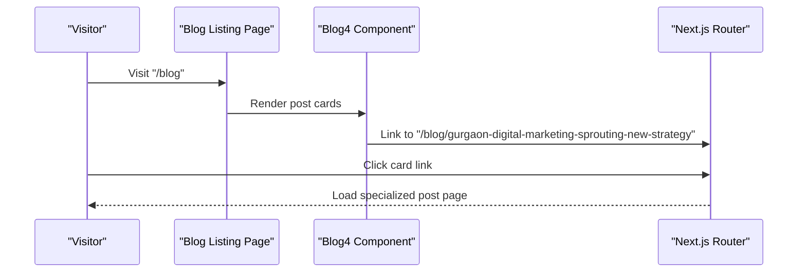
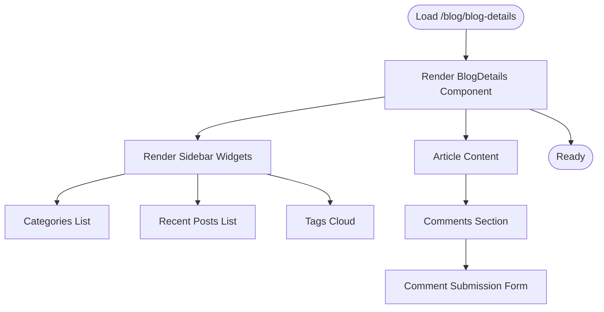
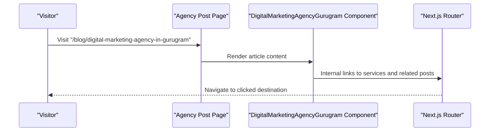
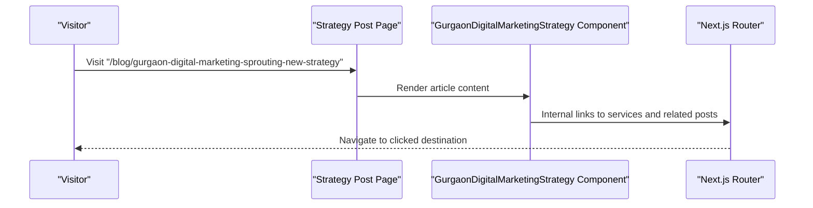
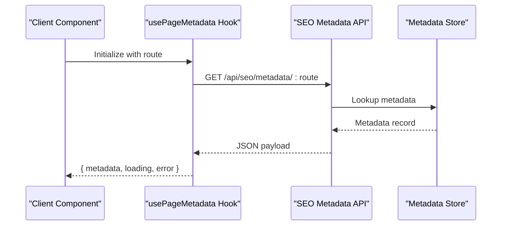
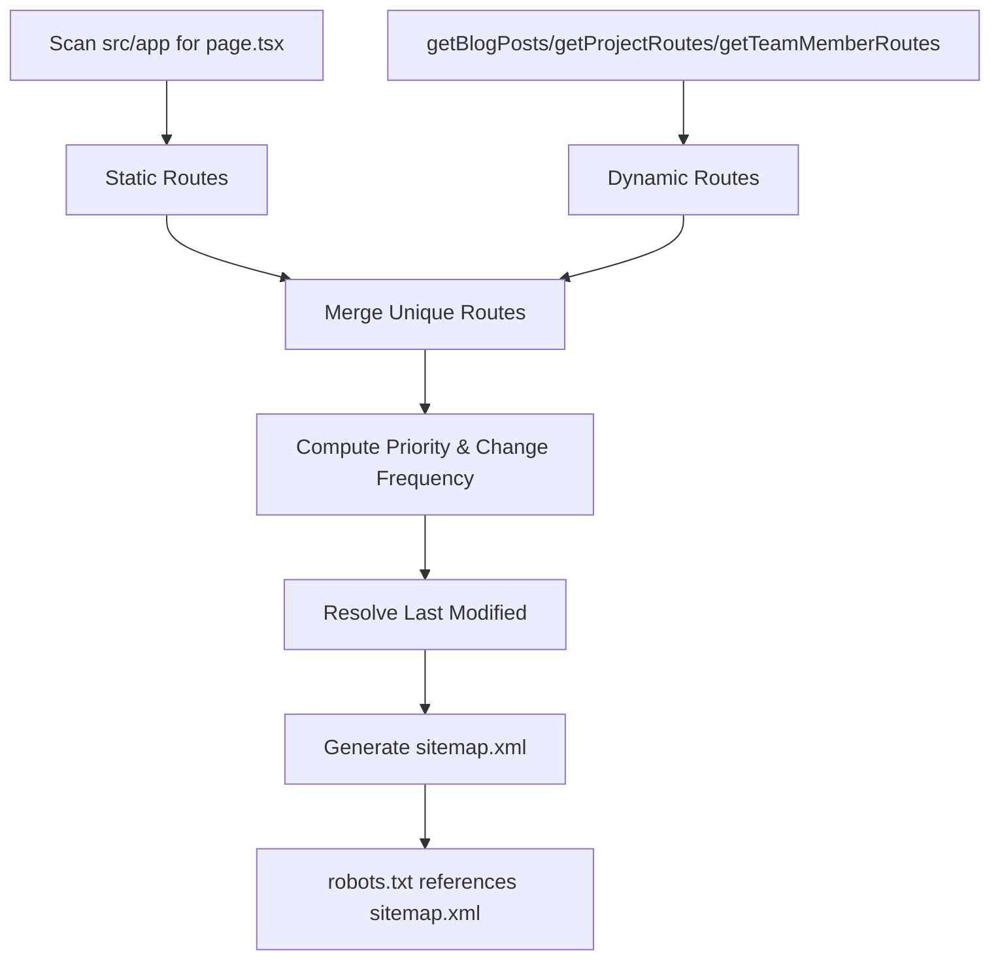
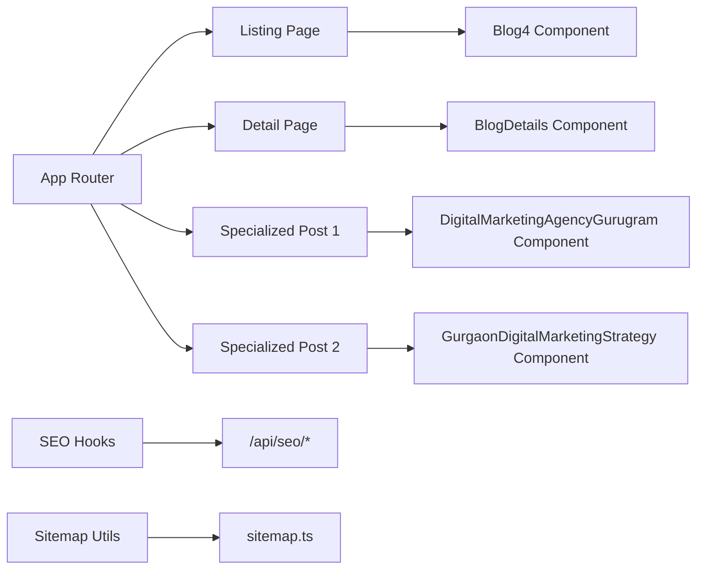

# Blog Routing and Pages

<cite>
**Referenced Files in This Document**
- [src/app/page.tsx](file://src/app/page.tsx)
- [src/app/layout.tsx](file://src/app/layout.tsx)
- [src/app/(innerpage)/blog/page.tsx](file://src/app/(innerpage)/blog/page.tsx)
- [src/app/(innerpage)/blog/blog-details/page.tsx](file://src/app/(innerpage)/blog/blog-details/page.tsx)
- [src/app/(innerpage)/blog/digital-marketing-agency-in-gurugram/page.tsx](file://src/app/(innerpage)/blog/digital-marketing-agency-in-gurugram/page.tsx)
- [src/app/(innerpage)/blog/gurgaon-digital-marketing-sprouting-new-strategy/page.tsx](file://src/app/(innerpage)/blog/gurgaon-digital-marketing-sprouting-new-strategy/page.tsx)
- [src/app/Components/Blog/Blog4.tsx](file://src/app/Components/Blog/Blog4.tsx)
- [src/app/Components/BlogDetails/BlogDetails.tsx](file://src/app/Components/BlogDetails/BlogDetails.tsx)
- [src/app/Components/BlogDetails/DigitalMarketingAgencyGurugram.tsx](file://src/app/Components/BlogDetails/DigitalMarketingAgencyGurugram.tsx)
- [src/app/Components/BlogDetails/GurgaonDigitalMarketingStrategy.tsx](file://src/app/Components/BlogDetails/GurgaonDigitalMarketingStrategy.tsx)
- [src/lib/sitemap-utils.ts](file://src/lib/sitemap-utils.ts)
- [src/app/sitemap.ts](file://src/app/sitemap.ts)
- [src/app/robots.ts](file://src/app/robots.ts)
- [src/hooks/usePageMetadata.ts](file://src/hooks/usePageMetadata.ts)
- [src/hooks/useFilePageMetadata.ts](file://src/hooks/useFilePageMetadata.ts)
</cite>

## Table of Contents
1. [Introduction](#introduction)
2. [Project Structure](#project-structure)
3. [Core Components](#core-components)
4. [Architecture Overview](#architecture-overview)
5. [Detailed Component Analysis](#detailed-component-analysis)
6. [Dependency Analysis](#dependency-analysis)
7. [Performance Considerations](#performance-considerations)
8. [Troubleshooting Guide](#troubleshooting-guide)
9. [Conclusion](#conclusion)

## Introduction
This document explains the blog routing system for attechglobal.com built with Next.js App Router. It covers:
- Static and dynamic routing for blog listings and individual posts
- Specialized blog pages such as “Digital Marketing Agency in Gurugram” and “Gurgaon Digital Marketing Sprouting New Strategy”
- Page component architecture, metadata generation, and SEO optimization
- URL generation and navigation patterns
- Performance strategies using static generation and incremental regeneration

## Project Structure
The blog is organized under the App Router’s file convention. Key areas:
- Route groups encapsulate inner pages for consistent layout and navigation
- Blog listing and detail pages are implemented as route segments
- Specialized landing-style blog pages live alongside the blog route group
- SEO utilities and sitemap generation are centralized for maintainability

**Diagram sources**
- [src/app/layout.tsx](file://src/app/layout.tsx#L1-L47)
- [src/app/page.tsx](file://src/app/page.tsx#L1-L75)
- [src/app/(innerpage)/blog/page.tsx](file://src/app/(innerpage)/blog/page.tsx#L1-L17)
- [src/app/(innerpage)/blog/blog-details/page.tsx](file://src/app/(innerpage)/blog/blog-details/page.tsx#L1-L17)
- [src/app/(innerpage)/blog/digital-marketing-agency-in-gurugram/page.tsx](file://src/app/(innerpage)/blog/digital-marketing-agency-in-gurugram/page.tsx#L1-L34)
- [src/app/(innerpage)/blog/gurgaon-digital-marketing-sprouting-new-strategy/page.tsx](file://src/app/(innerpage)/blog/gurgaon-digital-marketing-sprouting-new-strategy/page.tsx#L1-L34)
- [src/app/Components/Blog/Blog4.tsx](file://src/app/Components/Blog/Blog4.tsx#L1-L87)
- [src/app/Components/BlogDetails/BlogDetails.tsx](file://src/app/Components/BlogDetails/BlogDetails.tsx#L1-L215)
- [src/app/Components/BlogDetails/DigitalMarketingAgencyGurugram.tsx](file://src/app/Components/BlogDetails/DigitalMarketingAgencyGurugram.tsx#L1-L379)
- [src/app/Components/BlogDetails/GurgaonDigitalMarketingStrategy.tsx](file://src/app/Components/BlogDetails/GurgaonDigitalMarketingStrategy.tsx#L1-L113)

**Section sources**
- [src/app/layout.tsx](file://src/app/layout.tsx#L1-L47)
- [src/app/page.tsx](file://src/app/page.tsx#L1-L75)
- [src/app/(innerpage)/blog/page.tsx](file://src/app/(innerpage)/blog/page.tsx#L1-L17)
- [src/app/(innerpage)/blog/blog-details/page.tsx](file://src/app/(innerpage)/blog/blog-details/page.tsx#L1-L17)
- [src/app/(innerpage)/blog/digital-marketing-agency-in-gurugram/page.tsx](file://src/app/(innerpage)/blog/digital-marketing-agency-in-gurugram/page.tsx#L1-L34)
- [src/app/(innerpage)/blog/gurgaon-digital-marketing-sprouting-new-strategy/page.tsx](file://src/app/(innerpage)/blog/gurgaon-digital-marketing-sprouting-new-strategy/page.tsx#L1-L34)

## Core Components
- Blog listing page renders a curated list of posts and links to detail pages.
- Generic blog detail page provides a standard article layout with sidebar navigation and comments.
- Specialized blog pages define page-specific metadata and content tailored to location and strategy themes.

Key responsibilities:
- Routing: Next.js file convention defines routes for listing and detail pages.
- Rendering: Components render structured HTML and embed SEO metadata.
- Navigation: Links connect listing to detail pages and cross-link related content.

**Section sources**
- [src/app/(innerpage)/blog/page.tsx](file://src/app/(innerpage)/blog/page.tsx#L1-L17)
- [src/app/Components/Blog/Blog4.tsx](file://src/app/Components/Blog/Blog4.tsx#L1-L87)
- [src/app/(innerpage)/blog/blog-details/page.tsx](file://src/app/(innerpage)/blog/blog-details/page.tsx#L1-L17)
- [src/app/Components/BlogDetails/BlogDetails.tsx](file://src/app/Components/BlogDetails/BlogDetails.tsx#L1-L215)
- [src/app/(innerpage)/blog/digital-marketing-agency-in-gurugram/page.tsx](file://src/app/(innerpage)/blog/digital-marketing-agency-in-gurugram/page.tsx#L1-L34)
- [src/app/Components/BlogDetails/DigitalMarketingAgencyGurugram.tsx](file://src/app/Components/BlogDetails/DigitalMarketingAgencyGurugram.tsx#L1-L379)
- [src/app/(innerpage)/blog/gurgaon-digital-marketing-sprouting-new-strategy/page.tsx](file://src/app/(innerpage)/blog/gurgaon-digital-marketing-sprouting-new-strategy/page.tsx#L1-L34)
- [src/app/Components/BlogDetails/GurgaonDigitalMarketingStrategy.tsx](file://src/app/Components/BlogDetails/GurgaonDigitalMarketingStrategy.tsx#L1-L113)

## Architecture Overview
The blog architecture combines static file routing with reusable components and centralized SEO utilities.

**Diagram sources**
- [src/app/(innerpage)/blog/page.tsx](file://src/app/(innerpage)/blog/page.tsx#L1-L17)
- [src/app/Components/Blog/Blog4.tsx](file://src/app/Components/Blog/Blog4.tsx#L1-L87)
- [src/app/(innerpage)/blog/blog-details/page.tsx](file://src/app/(innerpage)/blog/blog-details/page.tsx#L1-L17)
- [src/app/Components/BlogDetails/BlogDetails.tsx](file://src/app/Components/BlogDetails/BlogDetails.tsx#L1-L215)
- [src/app/(innerpage)/blog/digital-marketing-agency-in-gurugram/page.tsx](file://src/app/(innerpage)/blog/digital-marketing-agency-in-gurugram/page.tsx#L1-L34)
- [src/app/Components/BlogDetails/DigitalMarketingAgencyGurugram.tsx](file://src/app/Components/BlogDetails/DigitalMarketingAgencyGurugram.tsx#L1-L379)
- [src/app/(innerpage)/blog/gurgaon-digital-marketing-sprouting-new-strategy/page.tsx](file://src/app/(innerpage)/blog/gurgaon-digital-marketing-sprouting-new-strategy/page.tsx#L1-L34)
- [src/app/Components/BlogDetails/GurgaonDigitalMarketingStrategy.tsx](file://src/app/Components/BlogDetails/GurgaonDigitalMarketingStrategy.tsx#L1-L113)
- [src/hooks/usePageMetadata.ts](file://src/hooks/usePageMetadata.ts#L1-L218)
- [src/hooks/useFilePageMetadata.ts](file://src/hooks/useFilePageMetadata.ts#L1-L225)
- [src/lib/sitemap-utils.ts](file://src/lib/sitemap-utils.ts#L1-L196)
- [src/app/sitemap.ts](file://src/app/sitemap.ts#L1-L154)

## Detailed Component Analysis

### Blog Listing Page
- Purpose: Render a grid of blog cards linking to detail pages.
- Behavior: Uses a predefined list of posts with titles, categories, dates, and links.
- Navigation: Each card’s link navigates to either a generic detail route or a specialized post route.

**Diagram sources**
- [src/app/(innerpage)/blog/page.tsx](file://src/app/(innerpage)/blog/page.tsx#L1-L17)
- [src/app/Components/Blog/Blog4.tsx](file://src/app/Components/Blog/Blog4.tsx#L1-L87)

**Section sources**
- [src/app/(innerpage)/blog/page.tsx](file://src/app/(innerpage)/blog/page.tsx#L1-L17)
- [src/app/Components/Blog/Blog4.tsx](file://src/app/Components/Blog/Blog4.tsx#L1-L87)

### Generic Blog Details Page
- Purpose: Provide a standard article layout with sidebar navigation, recent posts, categories, tags, author info, and comments.
- Behavior: Renders a complete article page with metadata and navigation aids.

**Diagram sources**
- [src/app/(innerpage)/blog/blog-details/page.tsx](file://src/app/(innerpage)/blog/blog-details/page.tsx#L1-L17)
- [src/app/Components/BlogDetails/BlogDetails.tsx](file://src/app/Components/BlogDetails/BlogDetails.tsx#L1-L215)

**Section sources**
- [src/app/(innerpage)/blog/blog-details/page.tsx](file://src/app/(innerpage)/blog/blog-details/page.tsx#L1-L17)
- [src/app/Components/BlogDetails/BlogDetails.tsx](file://src/app/Components/BlogDetails/BlogDetails.tsx#L1-L215)

### Specialized Blog Pages

#### Digital Marketing Agency in Gurugram
- Purpose: Location-specific landing-style article optimized for “Gurugram” and digital marketing services.
- Metadata: Defines title, description, keywords, Open Graph, and canonical URL.
- Content: Rich article with service links, author info, and comments form.

**Diagram sources**
- [src/app/(innerpage)/blog/digital-marketing-agency-in-gurugram/page.tsx](file://src/app/(innerpage)/blog/digital-marketing-agency-in-gurugram/page.tsx#L1-L34)
- [src/app/Components/BlogDetails/DigitalMarketingAgencyGurugram.tsx](file://src/app/Components/BlogDetails/DigitalMarketingAgencyGurugram.tsx#L1-L379)

**Section sources**
- [src/app/(innerpage)/blog/digital-marketing-agency-in-gurugram/page.tsx](file://src/app/(innerpage)/blog/digital-marketing-agency-in-gurugram/page.tsx#L1-L34)
- [src/app/Components/BlogDetails/DigitalMarketingAgencyGurugram.tsx](file://src/app/Components/BlogDetails/DigitalMarketingAgencyGurugram.tsx#L1-L379)

#### Gurgaon Digital Marketing Sprouting New Strategy
- Purpose: Strategy-focused article emphasizing growth and intensity of digital marketing in Gurgaon.
- Metadata: Defines title, description, keywords, Open Graph, and canonical URL.
- Content: Article with author info and tags.

**Diagram sources**
- [src/app/(innerpage)/blog/gurgaon-digital-marketing-sprouting-new-strategy/page.tsx](file://src/app/(innerpage)/blog/gurgaon-digital-marketing-sprouting-new-strategy/page.tsx#L1-L34)
- [src/app/Components/BlogDetails/GurgaonDigitalMarketingStrategy.tsx](file://src/app/Components/BlogDetails/GurgaonDigitalMarketingStrategy.tsx#L1-L113)

**Section sources**
- [src/app/(innerpage)/blog/gurgaon-digital-marketing-sprouting-new-strategy/page.tsx](file://src/app/(innerpage)/blog/gurgaon-digital-marketing-sprouting-new-strategy/page.tsx#L1-L34)
- [src/app/Components/BlogDetails/GurgaonDigitalMarketingStrategy.tsx](file://src/app/Components/BlogDetails/GurgaonDigitalMarketingStrategy.tsx#L1-L113)

### SEO and Metadata Hooks
- usePageMetadata: Fetches page metadata from a server endpoint for dynamic routes or CMS-backed pages.
- useFilePageMetadata: Similar to above but targets file-based metadata endpoints.
- These hooks enable client-side SEO management and can be integrated into pages that require dynamic metadata.

**Diagram sources**
- [src/hooks/usePageMetadata.ts](file://src/hooks/usePageMetadata.ts#L1-L218)

**Section sources**
- [src/hooks/usePageMetadata.ts](file://src/hooks/usePageMetadata.ts#L1-L218)
- [src/hooks/useFilePageMetadata.ts](file://src/hooks/useFilePageMetadata.ts#L1-L225)

### Sitemap and Robots
- sitemap.ts: Dynamically generates a sitemap by scanning static pages and combining them with dynamic routes (blogs, projects, team members). Includes priorities and change frequencies.
- robots.ts: Declares robots rules and points to the generated sitemap.
- sitemap-utils.ts: Provides helpers to discover dynamic routes and compute metadata for sitemap entries.

**Diagram sources**
- [src/app/sitemap.ts](file://src/app/sitemap.ts#L1-L154)
- [src/lib/sitemap-utils.ts](file://src/lib/sitemap-utils.ts#L1-L196)
- [src/app/robots.ts](file://src/app/robots.ts#L1-L38)

**Section sources**
- [src/app/sitemap.ts](file://src/app/sitemap.ts#L1-L154)
- [src/lib/sitemap-utils.ts](file://src/lib/sitemap-utils.ts#L1-L196)
- [src/app/robots.ts](file://src/app/robots.ts#L1-L38)

## Dependency Analysis
- Routing depends on Next.js file convention under the innerpage route group.
- Components depend on reusable UI elements (e.g., breadcrumbs, sidebar widgets).
- SEO and sitemap utilities are decoupled and can be reused across pages.
- Specialized pages declare their own metadata, while generic pages rely on shared components.

**Diagram sources**
- [src/app/(innerpage)/blog/page.tsx](file://src/app/(innerpage)/blog/page.tsx#L1-L17)
- [src/app/(innerpage)/blog/blog-details/page.tsx](file://src/app/(innerpage)/blog/blog-details/page.tsx#L1-L17)
- [src/app/(innerpage)/blog/digital-marketing-agency-in-gurugram/page.tsx](file://src/app/(innerpage)/blog/digital-marketing-agency-in-gurugram/page.tsx#L1-L34)
- [src/app/(innerpage)/blog/gurgaon-digital-marketing-sprouting-new-strategy/page.tsx](file://src/app/(innerpage)/blog/gurgaon-digital-marketing-sprouting-new-strategy/page.tsx#L1-L34)
- [src/app/Components/Blog/Blog4.tsx](file://src/app/Components/Blog/Blog4.tsx#L1-L87)
- [src/app/Components/BlogDetails/BlogDetails.tsx](file://src/app/Components/BlogDetails/BlogDetails.tsx#L1-L215)
- [src/app/Components/BlogDetails/DigitalMarketingAgencyGurugram.tsx](file://src/app/Components/BlogDetails/DigitalMarketingAgencyGurugram.tsx#L1-L379)
- [src/app/Components/BlogDetails/GurgaonDigitalMarketingStrategy.tsx](file://src/app/Components/BlogDetails/GurgaonDigitalMarketingStrategy.tsx#L1-L113)
- [src/hooks/usePageMetadata.ts](file://src/hooks/usePageMetadata.ts#L1-L218)
- [src/lib/sitemap-utils.ts](file://src/lib/sitemap-utils.ts#L1-L196)
- [src/app/sitemap.ts](file://src/app/sitemap.ts#L1-L154)

**Section sources**
- [src/app/(innerpage)/blog/page.tsx](file://src/app/(innerpage)/blog/page.tsx#L1-L17)
- [src/app/(innerpage)/blog/blog-details/page.tsx](file://src/app/(innerpage)/blog/blog-details/page.tsx#L1-L17)
- [src/app/(innerpage)/blog/digital-marketing-agency-in-gurugram/page.tsx](file://src/app/(innerpage)/blog/digital-marketing-agency-in-gurugram/page.tsx#L1-L34)
- [src/app/(innerpage)/blog/gurgaon-digital-marketing-sprouting-new-strategy/page.tsx](file://src/app/(innerpage)/blog/gurgaon-digital-marketing-sprouting-new-strategy/page.tsx#L1-L34)
- [src/app/Components/Blog/Blog4.tsx](file://src/app/Components/Blog/Blog4.tsx#L1-L87)
- [src/app/Components/BlogDetails/BlogDetails.tsx](file://src/app/Components/BlogDetails/BlogDetails.tsx#L1-L215)
- [src/app/Components/BlogDetails/DigitalMarketingAgencyGurugram.tsx](file://src/app/Components/BlogDetails/DigitalMarketingAgencyGurugram.tsx#L1-L379)
- [src/app/Components/BlogDetails/GurgaonDigitalMarketingStrategy.tsx](file://src/app/Components/BlogDetails/GurgaonDigitalMarketingStrategy.tsx#L1-L113)
- [src/hooks/usePageMetadata.ts](file://src/hooks/usePageMetadata.ts#L1-L218)
- [src/lib/sitemap-utils.ts](file://src/lib/sitemap-utils.ts#L1-L196)
- [src/app/sitemap.ts](file://src/app/sitemap.ts#L1-L154)

## Performance Considerations
- Static generation: Next.js statically generates routes defined by file system conventions, reducing server load.
- Incremental Static Regeneration (ISR): Sitemap generation uses a revalidation interval to keep sitemap fresh without full rebuilds.
- Client-side SEO hooks: Allow lazy loading of metadata for pages that require dynamic content, minimizing initial payload.
- Component reuse: Shared components reduce duplication and improve maintainability.

Recommendations:
- Keep listing pages lightweight; defer heavy computations to server-side hooks or APIs.
- Use ISR for frequently changing content; set appropriate revalidate intervals.
- Optimize images and assets referenced in components for fast loading.

[No sources needed since this section provides general guidance]

## Troubleshooting Guide
Common issues and resolutions:
- Broken links in listings: Verify the link paths in the listing component match the actual route segments.
- Missing metadata for dynamic routes: Ensure the SEO hooks are invoked with the correct route and that the backend endpoints are reachable.
- Sitemap not updating: Confirm the sitemap revalidation value and that dynamic route discovery returns expected slugs.
- Robots blocking pages: Ensure robots rules allow intended routes and reference the correct sitemap URL.

**Section sources**
- [src/app/Components/Blog/Blog4.tsx](file://src/app/Components/Blog/Blog4.tsx#L1-L87)
- [src/hooks/usePageMetadata.ts](file://src/hooks/usePageMetadata.ts#L1-L218)
- [src/app/sitemap.ts](file://src/app/sitemap.ts#L1-L154)
- [src/app/robots.ts](file://src/app/robots.ts#L1-L38)

## Conclusion
The blog routing system leverages Next.js App Router conventions to provide clear, maintainable routes for listings and specialized posts. Components encapsulate presentation and navigation, while SEO utilities and sitemap generation ensure discoverability and performance. Integrating metadata hooks enables dynamic customization where needed, supporting both static and dynamic content strategies.

[No sources needed since this section summarizes without analyzing specific files]