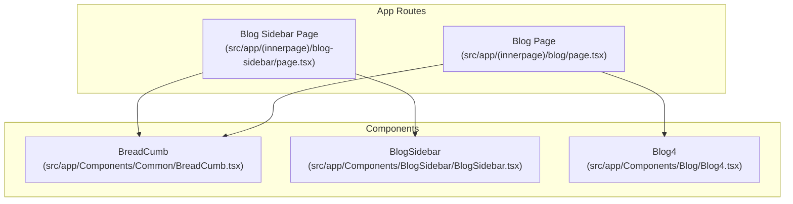
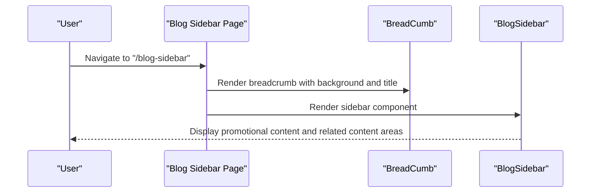
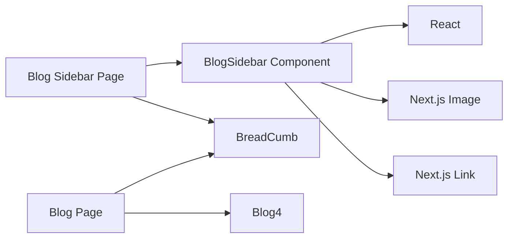

# Blog Sidebar Components

<cite>
**Referenced Files in This Document**
- [BlogSidebar page](file://src/app/(innerpage)/blog-sidebar/page.tsx)
- [BlogSidebar component](file://src/app/Components/BlogSidebar/BlogSidebar.tsx)
- [Blog page](file://src/app/(innerpage)/blog/page.tsx)
- [Blog4 component](file://src/app/Components/Blog/Blog4.tsx)
- [Common BreadCumb component](file://src/app/Components/Common/BreadCumb.tsx)
</cite>

## Table of Contents
1. [Introduction](#introduction)
2. [Project Structure](#project-structure)
3. [Core Components](#core-components)
4. [Architecture Overview](#architecture-overview)
5. [Detailed Component Analysis](#detailed-component-analysis)
6. [Dependency Analysis](#dependency-analysis)
7. [Performance Considerations](#performance-considerations)
8. [Troubleshooting Guide](#troubleshooting-guide)
9. [Conclusion](#conclusion)

## Introduction
This document describes the Blog Sidebar component system used to render secondary content alongside the main blog content on attechglobal.com. It focuses on how the BlogSidebar component integrates with the broader blog architecture to provide navigation aids, related content discovery, and promotional placements. The documentation covers component roles, integration patterns with main blog components, responsive behavior, customization options, and performance considerations.

## Project Structure
The sidebar functionality is implemented as a dedicated page route that renders the BlogSidebar component within a breadcrumb-based layout. The main blog listing is handled by a separate page that renders a blog listing component.

**Diagram sources**
- [BlogSidebar page](file://src/app/(innerpage)/blog-sidebar/page.tsx#L1-L17)
- [Blog page](file://src/app/(innerpage)/blog/page.tsx#L1-L17)
- [BlogSidebar component](file://src/app/Components/BlogSidebar/BlogSidebar.tsx#L1-L169)
- [Blog4 component](file://src/app/Components/Blog/Blog4.tsx)

**Section sources**
- [BlogSidebar page](file://src/app/(innerpage)/blog-sidebar/page.tsx#L1-L17)
- [Blog page](file://src/app/(innerpage)/blog/page.tsx#L1-L17)

## Core Components
- Blog Sidebar Page: Renders the breadcrumb and the BlogSidebar component for demonstration and testing.
- BlogSidebar Component: Provides the secondary content area with promotional content blocks and related content placeholders.
- Blog Page: Renders the main blog listing via Blog4 for comparison and integration context.
- Common BreadCumb: Supplies contextual breadcrumbs for both pages.

Key responsibilities:
- Blog Sidebar Page: Orchestrates layout and component rendering for the sidebar showcase.
- BlogSidebar Component: Implements the sidebar UI and content structure.
- Blog Page: Demonstrates the primary blog listing context.
- BreadCumb: Adds navigational context above both pages.

**Section sources**
- [BlogSidebar page](file://src/app/(innerpage)/blog-sidebar/page.tsx#L1-L17)
- [BlogSidebar component](file://src/app/Components/BlogSidebar/BlogSidebar.tsx#L1-L169)
- [Blog page](file://src/app/(innerpage)/blog/page.tsx#L1-L17)
- [Common BreadCumb component](file://src/app/Components/Common/BreadCumb.tsx)

## Architecture Overview
The sidebar system is designed as a reusable component integrated into page layouts. The Blog Sidebar Page composes the BreadCumb and BlogSidebar components to present a complete secondary content experience. The main blog page uses a different listing component (Blog4) to demonstrate how the sidebar can coexist with various blog layouts.

**Diagram sources**
- [BlogSidebar page](file://src/app/(innerpage)/blog-sidebar/page.tsx#L5-L14)
- [BlogSidebar component](file://src/app/Components/BlogSidebar/BlogSidebar.tsx#L5-L167)
- [Common BreadCumb component](file://src/app/Components/Common/BreadCumb.tsx)

## Detailed Component Analysis

### BlogSidebar Component
The BlogSidebar component defines a structured layout for secondary content, including:
- Promotional content blocks: Multiple entries with image, title, and content fields.
- Related content placeholders: Structured rows and columns for related articles or categories.
- Responsive spacing: Uses container and row utilities to adapt to different screen sizes.

Implementation highlights:
- Content composition: The component maintains a content array with promotional items and renders them consistently.
- Layout structure: Utilizes container, row, and column classes to organize content areas.
- Responsive behavior: Employs responsive height utilities to adjust spacing across breakpoints.
- Integration points: Designed to be embedded within page layouts that provide breadcrumbs and main content areas.

Customization examples (conceptual):
- Add new promotional content: Extend the content array with additional items.
- Modify layout: Adjust container and row classes to change spacing and alignment.
- Integrate with data sources: Replace static content with dynamic data fetched from APIs or CMS endpoints.
- Widget integration: Insert additional widgets (e.g., newsletter signup, social feeds) into designated slots.

Responsive behavior:
- Container and row utilities provide consistent gutters and alignment.
- Height utilities adjust vertical spacing for improved readability on smaller screens.

Performance considerations:
- Static content reduces runtime computation but limits flexibility.
- Consider lazy loading for images and deferring non-critical content rendering.

**Section sources**
- [BlogSidebar component](file://src/app/Components/BlogSidebar/BlogSidebar.tsx#L5-L167)

### Blog Sidebar Page
The Blog Sidebar Page demonstrates how the BlogSidebar component is integrated into a page layout:
- Composes BreadCumb with a background image and title.
- Renders the BlogSidebar component below the breadcrumb.

Integration pattern:
- The page acts as a container that sets the context for the sidebar component.
- Ensures consistent spacing and visual hierarchy around the sidebar.

**Section sources**
- [BlogSidebar page](file://src/app/(innerpage)/blog-sidebar/page.tsx#L5-L14)

### Blog Page and Blog4 Component
The Blog Page illustrates the primary blog listing context:
- Renders BreadCumb for navigation context.
- Renders Blog4 as the main blog listing component.

Integration pattern:
- The sidebar can be positioned alongside the main blog listing in shared layouts.
- Both pages share the BreadCumb component for consistent navigation cues.

**Section sources**
- [Blog page](file://src/app/(innerpage)/blog/page.tsx#L5-L14)
- [Blog4 component](file://src/app/Components/Blog/Blog4.tsx)

## Dependency Analysis
The sidebar system relies on a small set of dependencies:
- React: Component framework.
- Next.js Image and Link: For optimized image rendering and routing.
- BreadCumb: Provides breadcrumb navigation and contextual header.

**Diagram sources**
- [BlogSidebar component](file://src/app/Components/BlogSidebar/BlogSidebar.tsx#L1-L3)
- [BlogSidebar page](file://src/app/(innerpage)/blog-sidebar/page.tsx#L2-L3)
- [Blog page](file://src/app/(innerpage)/blog/page.tsx#L2-L3)

**Section sources**
- [BlogSidebar component](file://src/app/Components/BlogSidebar/BlogSidebar.tsx#L1-L3)
- [BlogSidebar page](file://src/app/(innerpage)/blog-sidebar/page.tsx#L2-L3)
- [Blog page](file://src/app/(innerpage)/blog/page.tsx#L2-L3)

## Performance Considerations
- Static content rendering: The current implementation uses static content arrays, minimizing runtime overhead.
- Image optimization: Leverage Next.js Image for automatic optimization and responsive sizing.
- Lazy loading: Consider lazy loading images and deferring non-critical content to improve initial load performance.
- Component reuse: Keep the sidebar component self-contained to enable reuse across different layouts and pages.
- Caching strategies: For dynamic content, implement caching at the data fetching layer to reduce repeated network requests.

## Troubleshooting Guide
Common issues and resolutions:
- Missing images: Verify asset paths and ensure images are served from the configured static asset directory.
- Layout inconsistencies: Confirm container and row classes are applied correctly and responsive utilities are used appropriately.
- Routing issues: Ensure Next.js Link components are used for internal navigation to benefit from client-side routing.
- BreadCrumbs not displaying: Check that the BreadCumb component receives the required props (background image and title).

**Section sources**
- [BlogSidebar component](file://src/app/Components/BlogSidebar/BlogSidebar.tsx#L1-L169)
- [BlogSidebar page](file://src/app/(innerpage)/blog-sidebar/page.tsx#L8-L12)
- [Blog page](file://src/app/(innerpage)/blog/page.tsx#L8-L12)

## Conclusion
The Blog Sidebar component system provides a flexible foundation for delivering secondary content alongside main blog content. By composing the BlogSidebar component within page layouts and integrating it with navigation aids like BreadCumb, the system supports both standalone demonstrations and integration with primary blog listings. With careful attention to responsive design, performance, and maintainability, the sidebar can be extended to accommodate diverse content needs while preserving a consistent user experience.