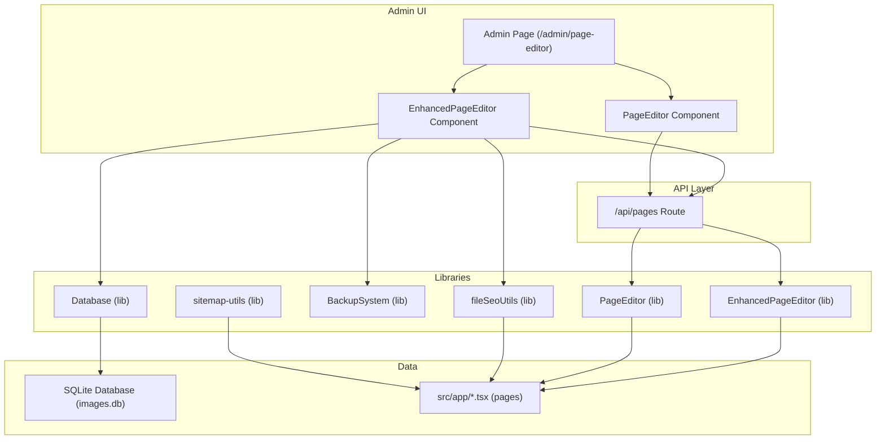
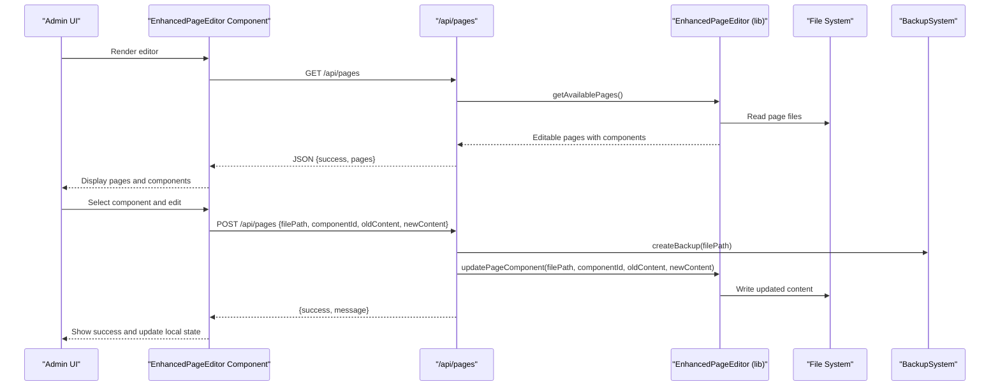
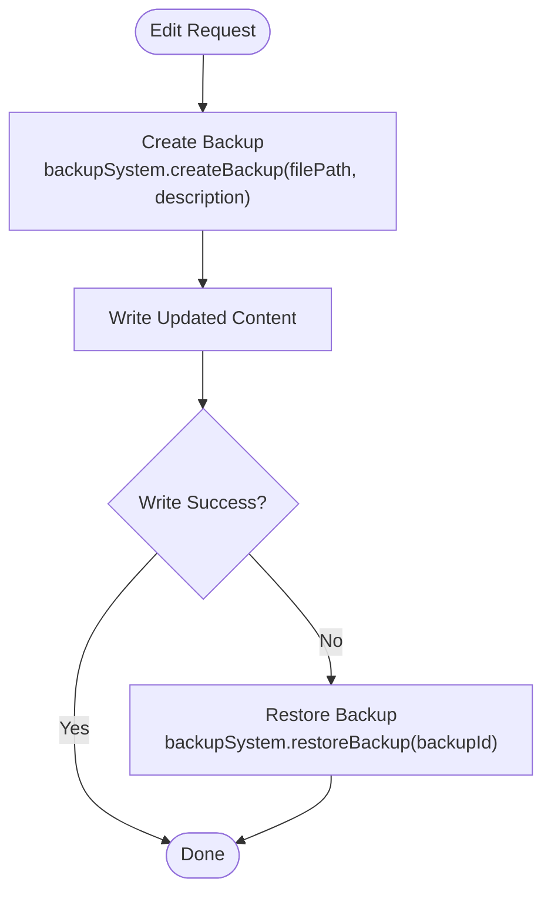
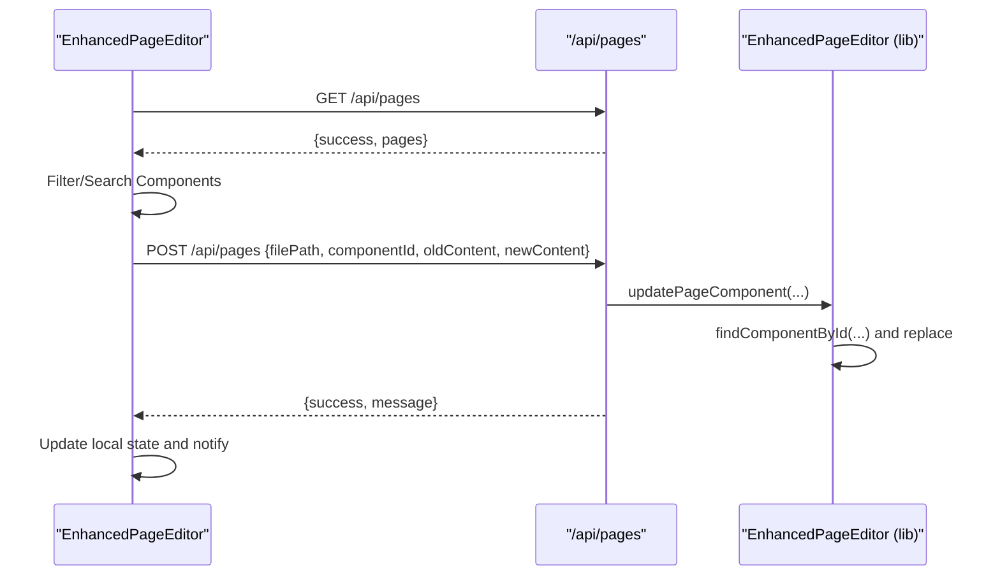
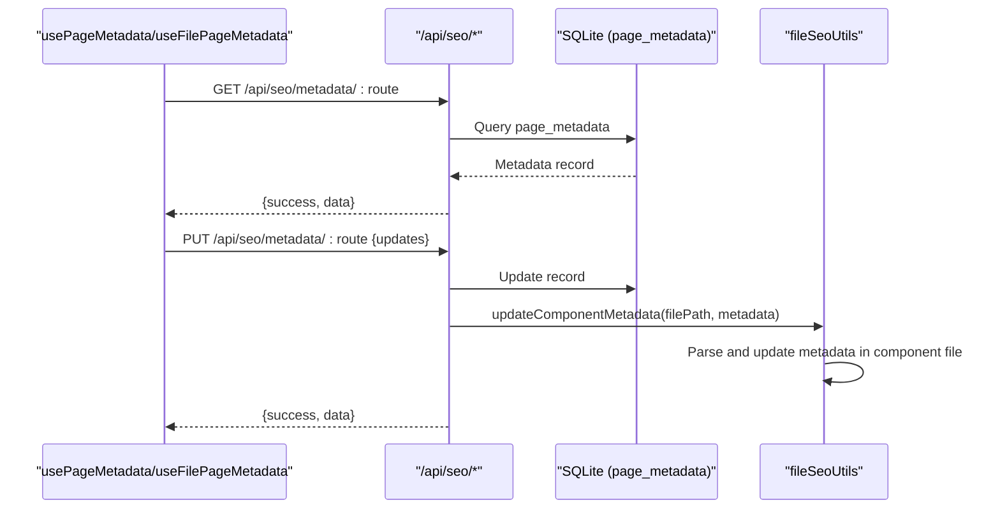
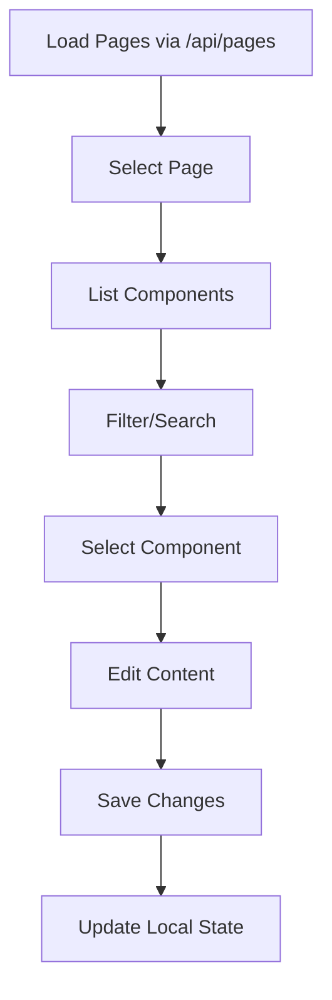
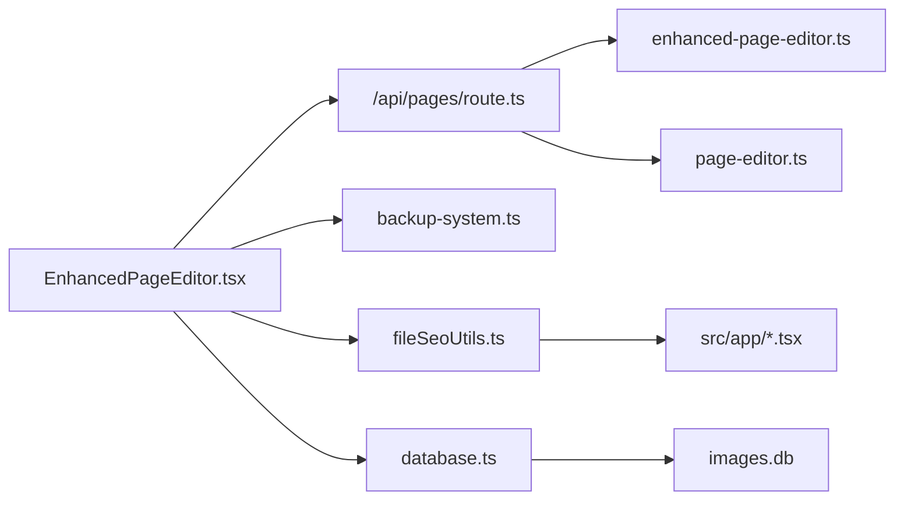

# Content Management System

<cite>
**Referenced Files in This Document**
- [README.md](file://README.md)
- [PAGE_EDITOR_README.md](file://PAGE_EDITOR_README.md)
- [enhanced-page-editor.ts](file://src/lib/enhanced-page-editor.ts)
- [page-editor.ts](file://src/lib/page-editor.ts)
- [backup-system.ts](file://src/lib/backup-system.ts)
- [page.tsx](file://src/app/admin/page-editor/page.tsx)
- [route.ts](file://src/app/api/pages/route.ts)
- [EnhancedPageEditor.tsx](file://src/app/Components/Admin/EnhancedPageEditor.tsx)
- [PageEditor.tsx](file://src/app/Components/Admin/PageEditor.tsx)
- [usePageMetadata.ts](file://src/hooks/usePageMetadata.ts)
- [useFilePageMetadata.ts](file://src/hooks/useFilePageMetadata.ts)
- [database.ts](file://src/lib/database.ts)
- [fileSeoUtils.ts](file://src/lib/fileSeoUtils.ts)
- [sitemap-utils.ts](file://src/lib/sitemap-utils.ts)
- [seed-metadata.ts](file://src/lib/seed-metadata.ts)
- [init-database.js](file://scripts/init-database.js)
</cite>

## Table of Contents
1. [Introduction](#introduction)
2. [Project Structure](#project-structure)
3. [Core Components](#core-components)
4. [Architecture Overview](#architecture-overview)
5. [Detailed Component Analysis](#detailed-component-analysis)
6. [Dependency Analysis](#dependency-analysis)
7. [Performance Considerations](#performance-considerations)
8. [Troubleshooting Guide](#troubleshooting-guide)
9. [Conclusion](#conclusion)
10. [Appendices](#appendices)

## Introduction
This document describes the content management system for attechglobal.com with a focus on the advanced page editing capabilities. It explains how the enhanced page editor detects dynamic components, enables real-time content editing, and persists changes to the file system. It also covers the page metadata system, automatic SEO generation, content validation mechanisms, the component wrapper system, dynamic content loading, and preview functionality. Practical workflows and integration details between the editor interface and the underlying file system are included.

## Project Structure
The CMS centers around:
- An admin UI page that hosts the editor
- A Next.js API route for page discovery and updates
- Two editors: a basic one and an enhanced one with richer parsing and preview
- A backup system for safe edits
- A metadata subsystem backed by a SQLite database and file-based utilities
- Hooks for client-side metadata management
- Utilities for sitemap generation and initial metadata seeding



**Diagram sources**
- [page.tsx](file://src/app/admin/page-editor/page.tsx#L1-L14)
- [EnhancedPageEditor.tsx](file://src/app/Components/Admin/EnhancedPageEditor.tsx#L1-L431)
- [PageEditor.tsx](file://src/app/Components/Admin/PageEditor.tsx#L1-L323)
- [route.ts](file://src/app/api/pages/route.ts#L1-L110)
- [enhanced-page-editor.ts](file://src/lib/enhanced-page-editor.ts#L1-L287)
- [page-editor.ts](file://src/lib/page-editor.ts#L1-L194)
- [backup-system.ts](file://src/lib/backup-system.ts#L1-L119)
- [database.ts](file://src/lib/database.ts#L1-L255)
- [fileSeoUtils.ts](file://src/lib/fileSeoUtils.ts#L1-L329)
- [sitemap-utils.ts](file://src/lib/sitemap-utils.ts#L1-L196)

**Section sources**
- [README.md](file://README.md#L1-L37)
- [PAGE_EDITOR_README.md](file://PAGE_EDITOR_README.md#L1-L154)

## Core Components
- EnhancedPageEditor (server-side library): Detects editable components from page files, parses text, images, links, and titles, and supports targeted updates with context-aware replacement.
- PageEditor (basic library): Provides a simpler parser and update mechanism for basic content types.
- BackupSystem: Creates and restores backups before applying edits to protect against accidental changes.
- EnhancedPageEditor UI: A React component that loads pages, filters and searches components, previews content, and saves changes via the API.
- Metadata system: Client hooks and server utilities manage page metadata, including Next.js metadata exports and SEOHead component props, with persistence in SQLite.
- Sitemap utilities: Discover dynamic routes and compute priorities/frequencies for sitemap generation.

**Section sources**
- [enhanced-page-editor.ts](file://src/lib/enhanced-page-editor.ts#L26-L287)
- [page-editor.ts](file://src/lib/page-editor.ts#L23-L194)
- [backup-system.ts](file://src/lib/backup-system.ts#L12-L119)
- [EnhancedPageEditor.tsx](file://src/app/Components/Admin/EnhancedPageEditor.tsx#L32-L431)
- [usePageMetadata.ts](file://src/hooks/usePageMetadata.ts#L13-L218)
- [useFilePageMetadata.ts](file://src/hooks/useFilePageMetadata.ts#L13-L225)
- [fileSeoUtils.ts](file://src/lib/fileSeoUtils.ts#L47-L115)
- [sitemap-utils.ts](file://src/lib/sitemap-utils.ts#L152-L196)

## Architecture Overview
The editor architecture separates concerns across UI, API, parsing, persistence, and metadata:



**Diagram sources**
- [EnhancedPageEditor.tsx](file://src/app/Components/Admin/EnhancedPageEditor.tsx#L47-L131)
- [route.ts](file://src/app/api/pages/route.ts#L66-L109)
- [enhanced-page-editor.ts](file://src/lib/enhanced-page-editor.ts#L50-L76)
- [enhanced-page-editor.ts](file://src/lib/enhanced-page-editor.ts#L239-L272)
- [backup-system.ts](file://src/lib/backup-system.ts#L33-L66)

## Detailed Component Analysis

### Enhanced Page Editor Library
The enhanced editor performs:
- Page discovery from predefined routes
- Line-by-line parsing for text, images, links, and titles
- Type inference for content categories
- Context extraction for better identification
- Safe replacement with fallback logic

```mermaid
classDiagram
class EnhancedPageEditor {
-string pagesDirectory
-pageConfigs
+getAvailablePages() EditablePage[]
-parsePageComponents(filePath) EnhancedPageComponent[]
-parseTextComponents(line, lineNumber, components)
-parseImageComponents(line, lineNumber, components)
-parseLinkComponents(line, lineNumber, components)
-parseTitleComponents(line, lineNumber, components)
-determineTextType(text) "text|title|subtitle|description"
-determineTitleType(pattern) "title|subtitle"
-isIgnoredText(text) boolean
-getLineContext(line, lineNumber) string
+updatePageComponent(filePath, componentId, oldContent, newContent) boolean
-findComponentById(filePath, componentId) EnhancedPageComponent
+getPagePreview(route) string
}
class EditablePage {
+string route
+string name
+EnhancedPageComponent[] components
+string filePath
+string preview
}
class EnhancedPageComponent {
+string id
+string name
+string path
+enum type "text|image|link|video|title|subtitle|description"
+string content
+Record attributes
+position {line, column}
+string context
}
EnhancedPageEditor --> EditablePage : "produces"
EditablePage --> EnhancedPageComponent : "contains"
```

**Diagram sources**
- [enhanced-page-editor.ts](file://src/lib/enhanced-page-editor.ts#L26-L287)

**Section sources**
- [enhanced-page-editor.ts](file://src/lib/enhanced-page-editor.ts#L38-L48)
- [enhanced-page-editor.ts](file://src/lib/enhanced-page-editor.ts#L78-L100)
- [enhanced-page-editor.ts](file://src/lib/enhanced-page-editor.ts#L102-L205)
- [enhanced-page-editor.ts](file://src/lib/enhanced-page-editor.ts#L207-L217)
- [enhanced-page-editor.ts](file://src/lib/enhanced-page-editor.ts#L239-L272)

### Basic Page Editor Library
The basic editor provides:
- Page discovery and component parsing for text, images, and links
- Simple content replacement
- Position tracking for components

```mermaid
classDiagram
class PageEditor {
-string pagesDirectory
-pageConfigs
+getAvailablePages() EditablePage[]
-parsePageComponents(filePath) PageComponent[]
+updatePageComponent(filePath, oldContent, newContent) boolean
+getComponentContent(filePath, line, column) string
}
class EditablePage {
+string route
+string name
+PageComponent[] components
+string filePath
}
class PageComponent {
+string name
+string path
+enum type "text|image|link|video"
+string content
+Record attributes
+position {line, column}
}
PageEditor --> EditablePage : "produces"
EditablePage --> PageComponent : "contains"
```

**Diagram sources**
- [page-editor.ts](file://src/lib/page-editor.ts#L23-L194)

**Section sources**
- [page-editor.ts](file://src/lib/page-editor.ts#L36-L46)
- [page-editor.ts](file://src/lib/page-editor.ts#L78-L145)
- [page-editor.ts](file://src/lib/page-editor.ts#L148-L167)
- [page-editor.ts](file://src/lib/page-editor.ts#L170-L190)

### Backup System
The backup system ensures safety:
- Creates backups with unique identifiers and timestamps
- Stores original content in JSON alongside file paths
- Supports restoration and deletion



**Diagram sources**
- [backup-system.ts](file://src/lib/backup-system.ts#L33-L66)
- [backup-system.ts](file://src/lib/backup-system.ts#L68-L82)

**Section sources**
- [backup-system.ts](file://src/lib/backup-system.ts#L12-L119)

### Editor UI and Real-time Editing
The EnhancedPageEditor component:
- Loads pages and components via the API
- Filters and searches components
- Displays context and live previews
- Saves changes and updates local state



**Diagram sources**
- [EnhancedPageEditor.tsx](file://src/app/Components/Admin/EnhancedPageEditor.tsx#L47-L131)
- [route.ts](file://src/app/api/pages/route.ts#L66-L109)
- [enhanced-page-editor.ts](file://src/lib/enhanced-page-editor.ts#L239-L272)

**Section sources**
- [EnhancedPageEditor.tsx](file://src/app/Components/Admin/EnhancedPageEditor.tsx#L32-L431)
- [page.tsx](file://src/app/admin/page-editor/page.tsx#L1-L14)
- [route.ts](file://src/app/api/pages/route.ts#L66-L109)

### Metadata System and Automatic SEO Generation
The metadata system supports:
- Client hooks for fetching, paginated listing, and updating metadata
- File-based parsing and updating of Next.js metadata exports or SEOHead props
- Conversion to Next.js metadata format for rendering



**Diagram sources**
- [usePageMetadata.ts](file://src/hooks/usePageMetadata.ts#L18-L51)
- [usePageMetadata.ts](file://src/hooks/usePageMetadata.ts#L83-L124)
- [useFilePageMetadata.ts](file://src/hooks/useFilePageMetadata.ts#L18-L51)
- [useFilePageMetadata.ts](file://src/hooks/useFilePageMetadata.ts#L83-L125)
- [fileSeoUtils.ts](file://src/lib/fileSeoUtils.ts#L183-L298)
- [database.ts](file://src/lib/database.ts#L159-L181)

**Section sources**
- [usePageMetadata.ts](file://src/hooks/usePageMetadata.ts#L13-L218)
- [useFilePageMetadata.ts](file://src/hooks/useFilePageMetadata.ts#L13-L225)
- [fileSeoUtils.ts](file://src/lib/fileSeoUtils.ts#L47-L115)
- [fileSeoUtils.ts](file://src/lib/fileSeoUtils.ts#L120-L178)
- [fileSeoUtils.ts](file://src/lib/fileSeoUtils.ts#L183-L298)
- [database.ts](file://src/lib/database.ts#L62-L81)
- [seed-metadata.ts](file://src/lib/seed-metadata.ts#L3-L93)

### Component Wrapper System and Dynamic Content Loading
- The editor wraps page components in a React UI that renders lists of editable sections.
- The UI supports filtering by type and searching by content or name.
- Live previews are supported for images and optional iframe previews for pages.



**Diagram sources**
- [EnhancedPageEditor.tsx](file://src/app/Components/Admin/EnhancedPageEditor.tsx#L47-L139)
- [PageEditor.tsx](file://src/app/Components/Admin/PageEditor.tsx#L39-L125)

**Section sources**
- [EnhancedPageEditor.tsx](file://src/app/Components/Admin/EnhancedPageEditor.tsx#L133-L165)
- [PageEditor.tsx](file://src/app/Components/Admin/PageEditor.tsx#L123-L125)

### Preview Functionality
- The EnhancedPageEditor component can toggle a page preview panel that embeds the target route in an iframe.
- This enables real-time preview of changes without leaving the editor.

**Section sources**
- [EnhancedPageEditor.tsx](file://src/app/Components/Admin/EnhancedPageEditor.tsx#L416-L427)

### File Parsing Algorithms and Content Serialization
- Parsing algorithms scan page files line-by-line, extracting content based on patterns for text, images, links, and headings.
- Content serialization is handled by writing updated content back to the file system after validation and backup.

**Section sources**
- [enhanced-page-editor.ts](file://src/lib/enhanced-page-editor.ts#L78-L100)
- [enhanced-page-editor.ts](file://src/lib/enhanced-page-editor.ts#L102-L205)
- [enhanced-page-editor.ts](file://src/lib/enhanced-page-editor.ts#L239-L272)

### Backup Restoration Processes
- Backups are stored as JSON files containing the original content and metadata.
- Restoration rewrites the target file with the backed-up content.

**Section sources**
- [backup-system.ts](file://src/lib/backup-system.ts#L33-L66)
- [backup-system.ts](file://src/lib/backup-system.ts#L68-L82)
- [backup-system.ts](file://src/lib/backup-system.ts#L84-L104)

## Dependency Analysis
Key dependencies and relationships:
- The UI depends on the API for page discovery and updates.
- The API uses the enhanced page editor library to parse and update page content.
- The backup system is invoked during updates to ensure safety.
- Metadata hooks depend on the SEO API and the database.
- File-based utilities parse and update component metadata for Next.js or SEOHead.



**Diagram sources**
- [EnhancedPageEditor.tsx](file://src/app/Components/Admin/EnhancedPageEditor.tsx#L47-L131)
- [route.ts](file://src/app/api/pages/route.ts#L66-L109)
- [enhanced-page-editor.ts](file://src/lib/enhanced-page-editor.ts#L50-L76)
- [page-editor.ts](file://src/lib/page-editor.ts#L49-L75)
- [backup-system.ts](file://src/lib/backup-system.ts#L33-L66)
- [fileSeoUtils.ts](file://src/lib/fileSeoUtils.ts#L183-L298)
- [database.ts](file://src/lib/database.ts#L159-L181)

**Section sources**
- [EnhancedPageEditor.tsx](file://src/app/Components/Admin/EnhancedPageEditor.tsx#L32-L431)
- [route.ts](file://src/app/api/pages/route.ts#L1-L110)
- [enhanced-page-editor.ts](file://src/lib/enhanced-page-editor.ts#L26-L287)
- [page-editor.ts](file://src/lib/page-editor.ts#L23-L194)
- [backup-system.ts](file://src/lib/backup-system.ts#L12-L119)
- [fileSeoUtils.ts](file://src/lib/fileSeoUtils.ts#L1-L329)
- [database.ts](file://src/lib/database.ts#L1-L255)

## Performance Considerations
- Parsing is linear in the number of lines per page; consider caching parsed components for frequently accessed pages.
- File I/O operations should be minimized by batching updates and using backups judiciously.
- Filtering and searching are client-side operations; keep component lists reasonably sized to maintain responsiveness.
- For large sites, consider lazy-loading page data and implementing pagination for component lists.

## Troubleshooting Guide
Common issues and resolutions:
- Content not updating: Verify the file path exists and matches the configured pages directory.
- Images not showing: Ensure the image URL is accessible and not blocked by CORS.
- Search not working: Confirm the search term matches content in components.
- API errors: Check network connectivity and server logs for detailed error messages.
- Backup failures: Ensure write permissions to the backups directory and sufficient disk space.

**Section sources**
- [PAGE_EDITOR_README.md](file://PAGE_EDITOR_README.md#L116-L125)

## Conclusion
The attechglobal.com content management system combines a powerful enhanced page editor with robust metadata management and backup safeguards. The architecture cleanly separates UI, API, parsing, and persistence concerns, enabling real-time editing, dynamic component detection, and automatic SEO generation. The provided workflows and integrations offer a solid foundation for maintaining and evolving the site’s content efficiently.

## Appendices

### Practical Examples

- Editing a text component:
  - Select a page, choose a text component, modify the content in the editor, and click Save. The UI updates immediately upon success.
  - Reference: [EnhancedPageEditor.tsx](file://src/app/Components/Admin/EnhancedPageEditor.tsx#L77-L131)

- Updating page metadata:
  - Use the metadata hooks to fetch, update, and persist metadata. The system writes changes to either Next.js metadata exports or SEOHead props.
  - References: [usePageMetadata.ts](file://src/hooks/usePageMetadata.ts#L141-L177), [fileSeoUtils.ts](file://src/lib/fileSeoUtils.ts#L183-L298)

- Managing backups:
  - Before applying edits, a backup is created. If needed, backups can be restored to revert changes.
  - References: [backup-system.ts](file://src/lib/backup-system.ts#L33-L66), [backup-system.ts](file://src/lib/backup-system.ts#L68-L82)

- Generating sitemaps:
  - Use sitemap utilities to discover dynamic routes and compute priorities and frequencies.
  - Reference: [sitemap-utils.ts](file://src/lib/sitemap-utils.ts#L152-L196)

- Seeding initial metadata:
  - Seed initial metadata into the database for key pages.
  - Reference: [seed-metadata.ts](file://src/lib/seed-metadata.ts#L3-L93)

- Initializing the image management database:
  - Run the initialization script to create required tables.
  - Reference: [init-database.js](file://scripts/init-database.js#L94-L120)