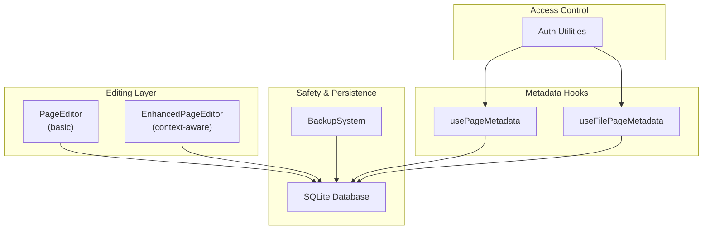
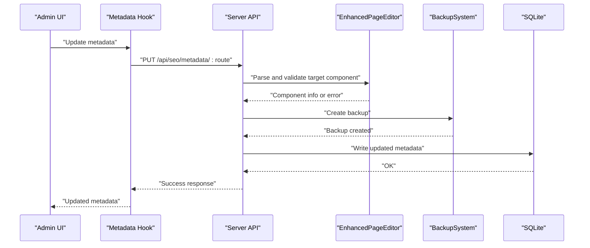
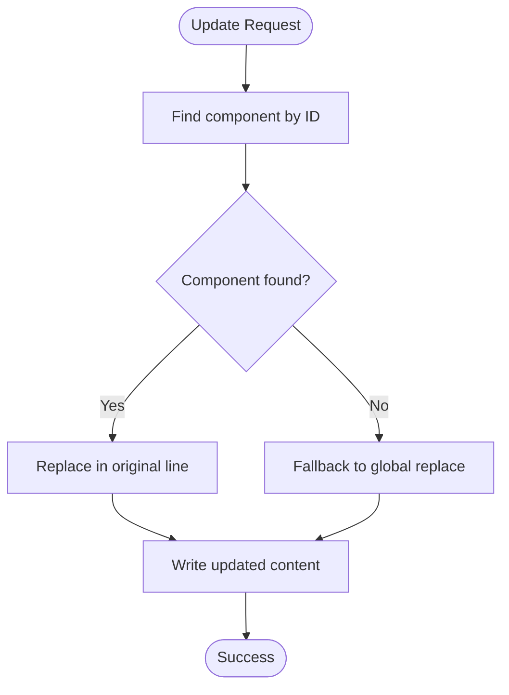
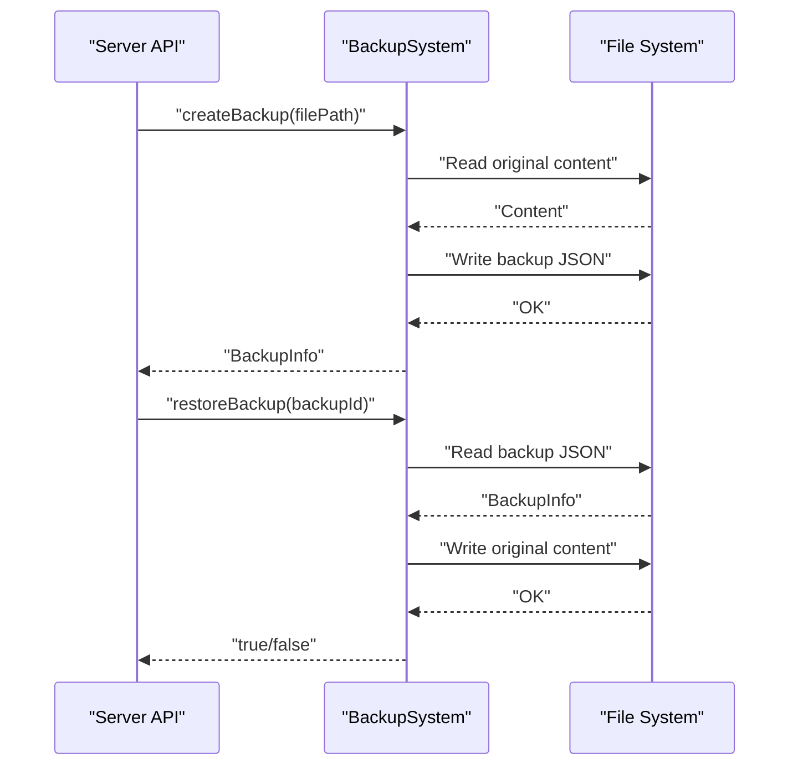
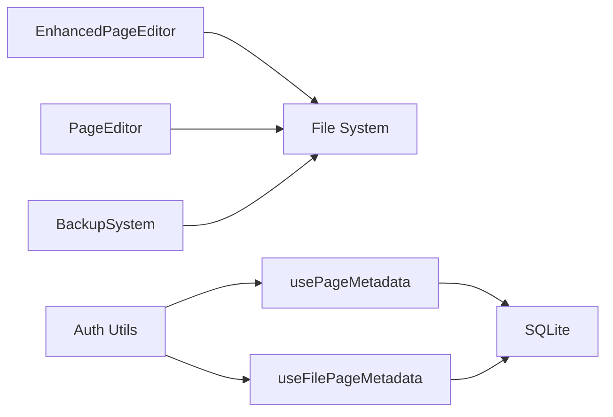

# Content Validation and Safety

<cite>
**Referenced Files in This Document**
- [page-editor.ts](file://src/lib/page-editor.ts)
- [enhanced-page-editor.ts](file://src/lib/enhanced-page-editor.ts)
- [backup-system.ts](file://src/lib/backup-system.ts)
- [auth.ts](file://src/lib/auth.ts)
- [usePageMetadata.ts](file://src/hooks/usePageMetadata.ts)
- [useFilePageMetadata.ts](file://src/hooks/useFilePageMetadata.ts)
- [database.ts](file://src/lib/database.ts)
</cite>

## Table of Contents
1. [Introduction](#introduction)
2. [Project Structure](#project-structure)
3. [Core Components](#core-components)
4. [Architecture Overview](#architecture-overview)
5. [Detailed Component Analysis](#detailed-component-analysis)
6. [Dependency Analysis](#dependency-analysis)
7. [Performance Considerations](#performance-considerations)
8. [Troubleshooting Guide](#troubleshooting-guide)
9. [Conclusion](#conclusion)
10. [Appendices](#appendices)

## Introduction
This document explains the content validation and safety systems for the editing and management of Next.js pages and associated metadata. It covers:
- Validation rules and sanitization processes for content modifications
- Context-aware editing to prevent accidental corruption
- Component filtering mechanisms that ignore boilerplate and non-editable content
- Error handling strategies for failed updates and rollback procedures
- Security measures including file path validation, content sanitization, and access control
- Practical examples, edge-case handling, and resilience patterns

## Project Structure
The editing and safety logic spans three primary areas:
- Page editors: a basic editor and an enhanced editor that parses and identifies editable components with context
- Backup system: pre-update snapshots and restoration
- Authentication and metadata hooks: access control and safe metadata operations

**Diagram sources**
- [page-editor.ts](file://src/lib/page-editor.ts#L23-L194)
- [enhanced-page-editor.ts](file://src/lib/enhanced-page-editor.ts#L26-L287)
- [backup-system.ts](file://src/lib/backup-system.ts#L12-L119)
- [auth.ts](file://src/lib/auth.ts#L1-L85)
- [usePageMetadata.ts](file://src/hooks/usePageMetadata.ts#L1-L218)
- [useFilePageMetadata.ts](file://src/hooks/useFilePageMetadata.ts#L1-L225)
- [database.ts](file://src/lib/database.ts#L1-L255)

**Section sources**
- [page-editor.ts](file://src/lib/page-editor.ts#L1-L194)
- [enhanced-page-editor.ts](file://src/lib/enhanced-page-editor.ts#L1-L287)
- [backup-system.ts](file://src/lib/backup-system.ts#L1-L119)
- [auth.ts](file://src/lib/auth.ts#L1-L85)
- [usePageMetadata.ts](file://src/hooks/usePageMetadata.ts#L1-L218)
- [useFilePageMetadata.ts](file://src/hooks/useFilePageMetadata.ts#L1-L225)
- [database.ts](file://src/lib/database.ts#L1-L255)

## Core Components
- PageEditor: extracts editable text, image, and link components from page files and performs simple content replacement.
- EnhancedPageEditor: improves parsing with context-aware identification of titles, subtitles, descriptions, and richer patterns; supports targeted updates by component ID.
- BackupSystem: creates and restores backups of page files to enable safe rollbacks.
- Auth utilities: manage admin authentication and token verification for access control.
- Metadata hooks: provide safe CRUD operations against page metadata via API endpoints backed by a SQLite database.

**Section sources**
- [page-editor.ts](file://src/lib/page-editor.ts#L23-L194)
- [enhanced-page-editor.ts](file://src/lib/enhanced-page-editor.ts#L26-L287)
- [backup-system.ts](file://src/lib/backup-system.ts#L12-L119)
- [auth.ts](file://src/lib/auth.ts#L1-L85)
- [usePageMetadata.ts](file://src/hooks/usePageMetadata.ts#L1-L218)
- [useFilePageMetadata.ts](file://src/hooks/useFilePageMetadata.ts#L1-L225)
- [database.ts](file://src/lib/database.ts#L62-L81)

## Architecture Overview
The editing flow integrates parsing, validation, persistence, and safety checks:

**Diagram sources**
- [enhanced-page-editor.ts](file://src/lib/enhanced-page-editor.ts#L239-L272)
- [backup-system.ts](file://src/lib/backup-system.ts#L33-L66)
- [usePageMetadata.ts](file://src/hooks/usePageMetadata.ts#L141-L170)
- [database.ts](file://src/lib/database.ts#L159-L181)

## Detailed Component Analysis

### PageEditor: Basic Parsing and Updates
- Parses page files to extract text, image, and link components.
- Filters out boilerplate and non-editable content.
- Performs a simple content replacement and writes back to disk.
- Returns boolean success/failure for update operations.

Validation and sanitization highlights:
- Text filtering excludes isolated punctuation, digits-only, and tag-like strings.
- Link filtering rejects fragment-only and JavaScript-based links.
- Image filtering excludes data URIs and blob URLs.

Safety and error handling:
- Returns false on client-side invocation.
- Catches and logs errors during read/write operations.

Practical example paths:
- Component extraction: [parsePageComponents](file://src/lib/page-editor.ts#L78-L145)
- Update operation: [updatePageComponent](file://src/lib/page-editor.ts#L148-L167)

Edge cases:
- Client-side environments short-circuit parsing and updates.
- Non-existent files cause errors caught and logged.

**Section sources**
- [page-editor.ts](file://src/lib/page-editor.ts#L23-L194)

### EnhancedPageEditor: Context-Aware Editing
- Extends parsing with richer patterns for text, titles, subtitles, and images.
- Adds surrounding context to each component to improve identification and reduce accidental corruption.
- Supports targeted updates by component ID, falling back to simple replacement if ID lookup fails.
- Provides a preview placeholder for rendered pages.

Validation and sanitization highlights:
- Determines content types heuristically (e.g., long text as description, short text near navigation words as subtitle).
- Uses context-aware replacements to minimize collateral changes.
- Ignores boilerplate and non-editable content via filtering.

Practical example paths:
- Enhanced parsing: [parsePageComponents](file://src/lib/enhanced-page-editor.ts#L78-L100)
- Targeted update by ID: [updatePageComponent](file://src/lib/enhanced-page-editor.ts#L239-L272)
- Context extraction: [getLineContext](file://src/lib/enhanced-page-editor.ts#L230-L237)

**Diagram sources**
- [enhanced-page-editor.ts](file://src/lib/enhanced-page-editor.ts#L239-L272)

**Section sources**
- [enhanced-page-editor.ts](file://src/lib/enhanced-page-editor.ts#L26-L287)

### BackupSystem: Safe Rollbacks
- Creates backups of page files with metadata (timestamp, original content).
- Stores backups as JSON files in a dedicated directory.
- Provides restore and delete operations with robust error handling.

Practical example paths:
- Create backup: [createBackup](file://src/lib/backup-system.ts#L33-L66)
- Restore backup: [restoreBackup](file://src/lib/backup-system.ts#L68-L82)
- List backups: [getBackups](file://src/lib/backup-system.ts#L84-L104)

**Diagram sources**
- [backup-system.ts](file://src/lib/backup-system.ts#L33-L82)

**Section sources**
- [backup-system.ts](file://src/lib/backup-system.ts#L12-L119)

### Authentication and Access Control
- Provides password hashing, token generation, and verification.
- Defines admin roles and helper to check authorization.
- Used to gate administrative actions in the UI and APIs.

Practical example paths:
- Token generation: [generateToken](file://src/lib/auth.ts#L35-L45)
- Token verification: [verifyToken](file://src/lib/auth.ts#L48-L59)
- Admin check: [isAdmin](file://src/lib/auth.ts#L82-L84)

Security notes:
- Store secrets in environment variables in production.
- Enforce HTTPS and secure cookie policies for tokens.

**Section sources**
- [auth.ts](file://src/lib/auth.ts#L1-L85)

### Metadata Hooks and Database Operations
- React hooks encapsulate fetching, paginated listing, and updating page metadata.
- API endpoints (not included here) coordinate with SQLite-backed persistence.
- Database schema defines normalized tables for images, blogs, and page metadata.

Practical example paths:
- Fetch single metadata: [usePageMetadata](file://src/hooks/usePageMetadata.ts#L18-L38)
- Paginated listing: [useAllPageMetadata](file://src/hooks/usePageMetadata.ts#L83-L124)
- Update metadata: [useUpdatePageMetadata](file://src/hooks/usePageMetadata.ts#L141-L170)
- File-based metadata hooks: [useFilePageMetadata](file://src/hooks/useFilePageMetadata.ts#L18-L38)

Database schema highlights:
- Page metadata table with canonical and social fields
- Blogs and images tables for content assets

**Section sources**
- [usePageMetadata.ts](file://src/hooks/usePageMetadata.ts#L1-L218)
- [useFilePageMetadata.ts](file://src/hooks/useFilePageMetadata.ts#L1-L225)
- [database.ts](file://src/lib/database.ts#L62-L81)
- [database.ts](file://src/lib/database.ts#L159-L181)

## Dependency Analysis
The editing and safety subsystems depend on:
- File system for reading/writing page files
- SQLite for persistent metadata storage
- Authentication utilities for access control
- React hooks for client-side metadata operations

**Diagram sources**
- [enhanced-page-editor.ts](file://src/lib/enhanced-page-editor.ts#L26-L36)
- [page-editor.ts](file://src/lib/page-editor.ts#L24-L33)
- [backup-system.ts](file://src/lib/backup-system.ts#L12-L23)
- [usePageMetadata.ts](file://src/hooks/usePageMetadata.ts#L1-L52)
- [useFilePageMetadata.ts](file://src/hooks/useFilePageMetadata.ts#L1-L52)
- [auth.ts](file://src/lib/auth.ts#L1-L11)
- [database.ts](file://src/lib/database.ts#L1-L13)

**Section sources**
- [enhanced-page-editor.ts](file://src/lib/enhanced-page-editor.ts#L26-L36)
- [page-editor.ts](file://src/lib/page-editor.ts#L24-L33)
- [backup-system.ts](file://src/lib/backup-system.ts#L12-L23)
- [usePageMetadata.ts](file://src/hooks/usePageMetadata.ts#L1-L52)
- [useFilePageMetadata.ts](file://src/hooks/useFilePageMetadata.ts#L1-L52)
- [auth.ts](file://src/lib/auth.ts#L1-L11)
- [database.ts](file://src/lib/database.ts#L1-L13)

## Performance Considerations
- Parsing complexity: Linear in the number of lines for both editors.
- Enhanced editor adds extra regex passes per line but improves accuracy.
- Backups incur IO overhead; schedule during maintenance windows.
- Database operations benefit from indexing on frequently queried columns (e.g., route).

[No sources needed since this section provides general guidance]

## Troubleshooting Guide
Common issues and resolutions:
- Client-side update failures: Both editors return false when invoked in browser contexts; ensure server-side execution for file edits.
- Update returns false: Check for exceptions during read/write; confirm file path validity and permissions.
- Context mismatch during updates: Use EnhancedPageEditor with component IDs to avoid broad replacements.
- Backup creation fails: Verify backup directory existence and write permissions.
- Authentication errors: Confirm JWT secret and token expiration; ensure admin role checks pass.

Recovery steps:
- Use BackupSystem to restore a recent backup after failed updates.
- Re-run parsing to re-extract components if filters exclude intended content.

**Section sources**
- [page-editor.ts](file://src/lib/page-editor.ts#L148-L167)
- [enhanced-page-editor.ts](file://src/lib/enhanced-page-editor.ts#L239-L272)
- [backup-system.ts](file://src/lib/backup-system.ts#L33-L66)
- [auth.ts](file://src/lib/auth.ts#L48-L59)

## Conclusion
The system combines context-aware parsing, targeted updates, and robust safety mechanisms to protect content integrity. EnhancedPageEditor reduces risk by identifying components with context and enabling precise replacements. BackupSystem ensures reliable rollbacks, while authentication and metadata hooks enforce access control and safe persistence.

[No sources needed since this section summarizes without analyzing specific files]

## Appendices

### Validation Scenarios and Examples
- Text content validation: Exclude isolated punctuation and whitespace; treat long blocks as descriptions.
- Link validation: Reject fragments and JavaScript-based links; preserve absolute URLs.
- Image validation: Ignore data URIs and blobs; focus on external resources.
- Component filtering: Skip boilerplate and non-editable tags.

**Section sources**
- [enhanced-page-editor.ts](file://src/lib/enhanced-page-editor.ts#L102-L129)
- [enhanced-page-editor.ts](file://src/lib/enhanced-page-editor.ts#L157-L176)
- [enhanced-page-editor.ts](file://src/lib/enhanced-page-editor.ts#L219-L228)

### Security Best Practices
- Validate and sanitize all inputs before writing to files or databases.
- Enforce role-based access control for administrative actions.
- Store secrets (JWT secret) in environment variables.
- Use HTTPS and secure headers for API endpoints.
- Limit file system write permissions to the minimum required.

**Section sources**
- [auth.ts](file://src/lib/auth.ts#L11-L11)
- [auth.ts](file://src/lib/auth.ts#L48-L59)
- [database.ts](file://src/lib/database.ts#L159-L181)