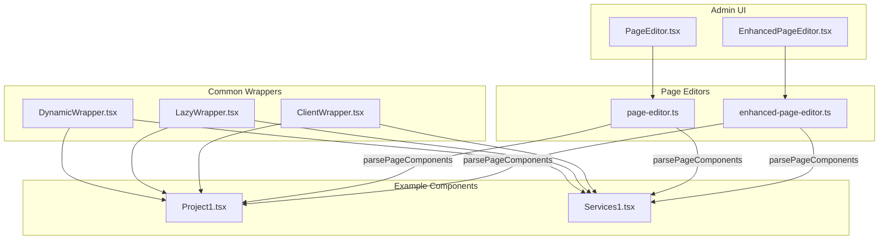
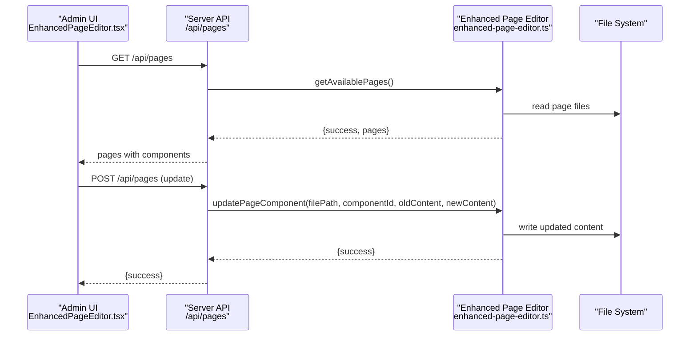
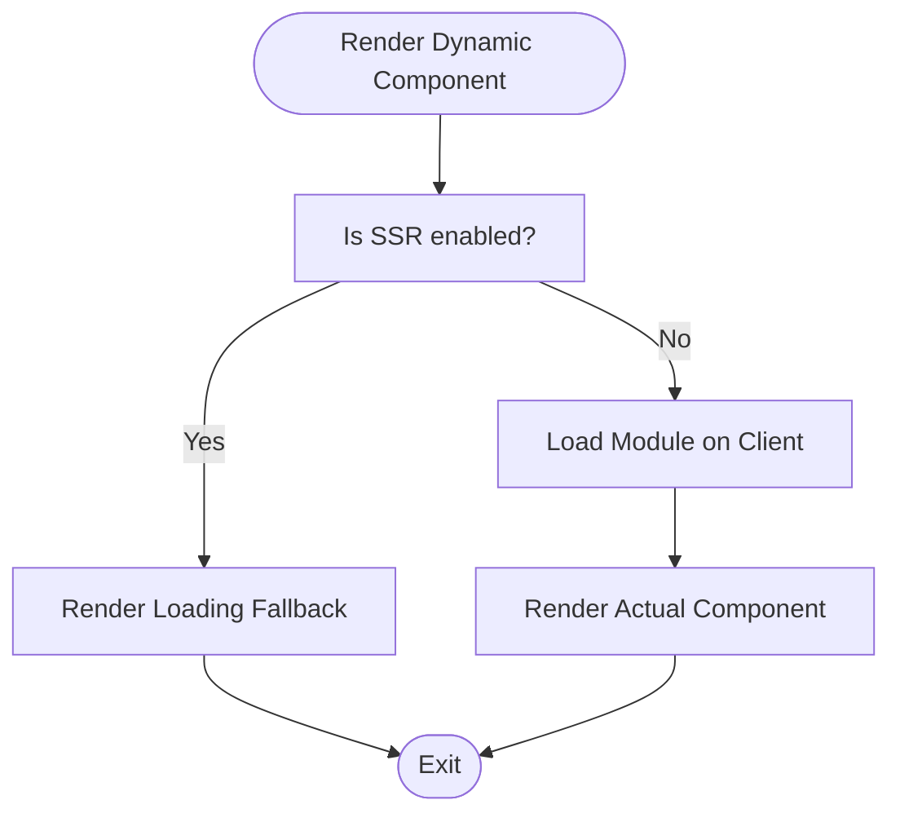
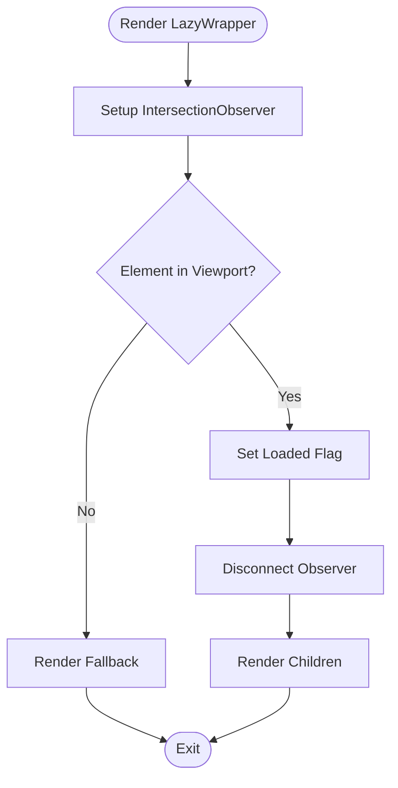
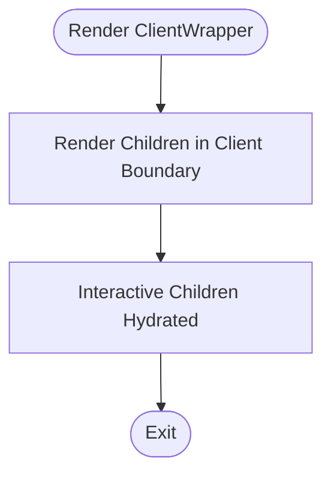
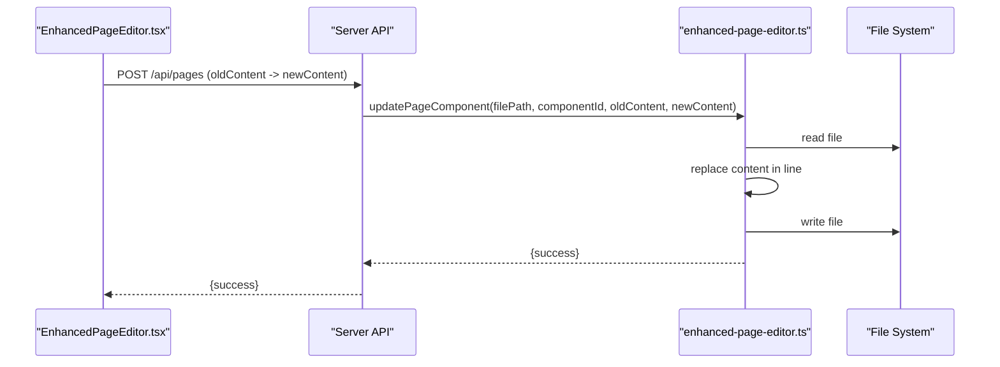
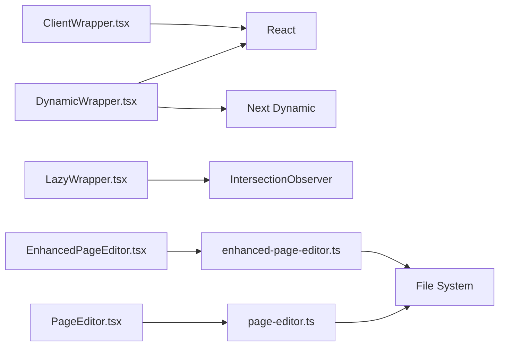

# Dynamic Component System

<cite>
**Referenced Files in This Document**
- [DynamicWrapper.tsx](file://src/app/Components/Common/DynamicWrapper.tsx)
- [LazyWrapper.tsx](file://src/app/Components/Common/LazyWrapper.tsx)
- [ClientWrapper.tsx](file://src/app/Components/Common/ClientWrapper.tsx)
- [page-editor.ts](file://src/lib/page-editor.ts)
- [enhanced-page-editor.ts](file://src/lib/enhanced-page-editor.ts)
- [PageEditor.tsx](file://src/app/Components/Admin/PageEditor.tsx)
- [EnhancedPageEditor.tsx](file://src/app/Components/Admin/EnhancedPageEditor.tsx)
- [Project1.tsx](file://src/app/Components/Project/Project1.tsx)
- [Services1.tsx](file://src/app/Components/Services/Services1.tsx)
</cite>

## Table of Contents
1. [Introduction](#introduction)
2. [Project Structure](#project-structure)
3. [Core Components](#core-components)
4. [Architecture Overview](#architecture-overview)
5. [Detailed Component Analysis](#detailed-component-analysis)
6. [Dependency Analysis](#dependency-analysis)
7. [Performance Considerations](#performance-considerations)
8. [Troubleshooting Guide](#troubleshooting-guide)
9. [Conclusion](#conclusion)
10. [Appendices](#appendices)

## Introduction
This document describes the dynamic component system architecture used to enable runtime component loading, lazy rendering, client-side hydration, and automatic detection and registration of editable components for the page editor. It focuses on three core wrapper patterns:
- DynamicWrapper: Next.js dynamic import wrapper for client-side-only, SSR-disabled components.
- LazyWrapper: IntersectionObserver-based lazy loader for deferred rendering of heavy components.
- ClientWrapper: Client-side hydration boundary that ensures interactive fragments are mounted after SSR.

It also documents the component detection and registration mechanisms that allow the system to identify editable components automatically, the prop forwarding and state management across wrapper types, and the integration between dynamic components and the page editor system. Practical examples, performance considerations, memory management, and debugging techniques are included.

## Project Structure
The dynamic component system spans client-side wrappers, server-side page editors, and reusable component libraries:
- Common wrappers live under src/app/Components/Common and provide cross-cutting concerns for dynamic loading, lazy rendering, and client hydration.
- Page editor utilities live under src/lib and encapsulate parsing, detection, and updates of editable components.
- Admin UI components live under src/app/Components/Admin and expose the editor interfaces to administrators.
- Example components under src/app/Components demonstrate heavy components suitable for dynamic and lazy loading.

**Diagram sources**
- [DynamicWrapper.tsx](file://src/app/Components/Common/DynamicWrapper.tsx#L1-L42)
- [LazyWrapper.tsx](file://src/app/Components/Common/LazyWrapper.tsx#L1-L51)
- [ClientWrapper.tsx](file://src/app/Components/Common/ClientWrapper.tsx#L1-L11)
- [page-editor.ts](file://src/lib/page-editor.ts#L1-L194)
- [enhanced-page-editor.ts](file://src/lib/enhanced-page-editor.ts#L1-L287)
- [PageEditor.tsx](file://src/app/Components/Admin/PageEditor.tsx#L1-L323)
- [EnhancedPageEditor.tsx](file://src/app/Components/Admin/EnhancedPageEditor.tsx#L1-L431)
- [Project1.tsx](file://src/app/Components/Project/Project1.tsx#L1-L53)
- [Services1.tsx](file://src/app/Components/Services/Services1.tsx#L1-L56)

**Section sources**
- [DynamicWrapper.tsx](file://src/app/Components/Common/DynamicWrapper.tsx#L1-L42)
- [LazyWrapper.tsx](file://src/app/Components/Common/LazyWrapper.tsx#L1-L51)
- [ClientWrapper.tsx](file://src/app/Components/Common/ClientWrapper.tsx#L1-L11)
- [page-editor.ts](file://src/lib/page-editor.ts#L1-L194)
- [enhanced-page-editor.ts](file://src/lib/enhanced-page-editor.ts#L1-L287)
- [PageEditor.tsx](file://src/app/Components/Admin/PageEditor.tsx#L1-L323)
- [EnhancedPageEditor.tsx](file://src/app/Components/Admin/EnhancedPageEditor.tsx#L1-L431)
- [Project1.tsx](file://src/app/Components/Project/Project1.tsx#L1-L53)
- [Services1.tsx](file://src/app/Components/Services/Services1.tsx#L1-L56)

## Core Components
- DynamicWrapper (Next.js dynamic import):
  - Provides a higher-order function to wrap imports with a client-only, SSR-disabled dynamic loader and a customizable fallback.
  - Includes pre-configured constants for heavy components (e.g., Project1, Services1) with dedicated loading spinners.
  - Typical usage: wrap heavy components to defer loading until client-side initialization.

- LazyWrapper (IntersectionObserver-based lazy loader):
  - Defers rendering of heavy components until they enter the viewport.
  - Accepts a fallback UI and tuning parameters (threshold, rootMargin).
  - Typical usage: wrap expensive components to reduce initial bundle and paint costs.

- ClientWrapper (client directive hydration boundary):
  - Ensures interactive children are rendered within a client boundary.
  - Typical usage: wrap interactive fragments that require client effects or event handlers.

- Page Editor Utilities:
  - page-editor.ts: Parses page files to extract editable text, images, and links; supports updates and content retrieval.
  - enhanced-page-editor.ts: Enhanced parser with richer typing (title, subtitle, description), context-aware parsing, and improved update logic.

- Admin UI:
  - PageEditor.tsx: Client component that loads pages, lists editable components, and saves changes via a backend API.
  - EnhancedPageEditor.tsx: Advanced editor with filtering, search, previews, and richer component typing.

**Section sources**
- [DynamicWrapper.tsx](file://src/app/Components/Common/DynamicWrapper.tsx#L1-L42)
- [LazyWrapper.tsx](file://src/app/Components/Common/LazyWrapper.tsx#L1-L51)
- [ClientWrapper.tsx](file://src/app/Components/Common/ClientWrapper.tsx#L1-L11)
- [page-editor.ts](file://src/lib/page-editor.ts#L1-L194)
- [enhanced-page-editor.ts](file://src/lib/enhanced-page-editor.ts#L1-L287)
- [PageEditor.tsx](file://src/app/Components/Admin/PageEditor.tsx#L1-L323)
- [EnhancedPageEditor.tsx](file://src/app/Components/Admin/EnhancedPageEditor.tsx#L1-L431)

## Architecture Overview
The system integrates three wrapper patterns with the page editor to deliver a flexible, performant, and editable frontend:
- Wrappers apply at render time to control when and how components load and hydrate.
- The page editor detects editable content by scanning page files and exposes a UI to modify it.
- Updates are persisted via a serverless API surface that the admin UI calls.

**Diagram sources**
- [EnhancedPageEditor.tsx](file://src/app/Components/Admin/EnhancedPageEditor.tsx#L47-L63)
- [enhanced-page-editor.ts](file://src/lib/enhanced-page-editor.ts#L50-L76)
- [enhanced-page-editor.ts](file://src/lib/enhanced-page-editor.ts#L239-L272)
- [EnhancedPageEditor.tsx](file://src/app/Components/Admin/EnhancedPageEditor.tsx#L82-L93)

## Detailed Component Analysis

### DynamicWrapper Component
DynamicWrapper leverages Next.js dynamic imports to defer loading of heavy components to the client. It offers:
- A generic higher-order function to wrap imports with a client-only, SSR-disabled loader and optional fallback.
- Pre-configured constants for specific heavy components with consistent loading UIs.

**Diagram sources**
- [DynamicWrapper.tsx](file://src/app/Components/Common/DynamicWrapper.tsx#L7-L15)
- [DynamicWrapper.tsx](file://src/app/Components/Common/DynamicWrapper.tsx#L18-L21)

Practical wrapping patterns:
- Wrap heavy components like Project1 and Services1 with the provided constants to benefit from shared loading UX and SSR disablement.
- Use the higher-order function to dynamically import components with custom fallbacks when needed.

Prop forwarding and state management:
- Props pass through to the underlying component; the wrapper does not mutate props.
- State for loading is internal to the dynamic loader; no external state is required.

Integration with page editor:
- Dynamic components are detected by the page editor’s parsers and exposed as editable sections. The dynamic loader ensures they hydrate on the client.

**Section sources**
- [DynamicWrapper.tsx](file://src/app/Components/Common/DynamicWrapper.tsx#L1-L42)
- [Project1.tsx](file://src/app/Components/Project/Project1.tsx#L1-L53)
- [Services1.tsx](file://src/app/Components/Services/Services1.tsx#L1-L56)

### LazyWrapper Component
LazyWrapper defers rendering until the element enters the viewport using IntersectionObserver. It provides:
- A fallback UI while the element is not visible.
- Configurable threshold and root margin for fine-tuned lazy behavior.

**Diagram sources**
- [LazyWrapper.tsx](file://src/app/Components/Common/LazyWrapper.tsx#L21-L41)

Practical lazy loading implementations:
- Wrap heavy components (e.g., sliders, galleries) with LazyWrapper to reduce initial render cost.
- Tune threshold and rootMargin to balance perceived performance and user experience.

Prop forwarding and state management:
- Props are forwarded to children; the wrapper manages internal visibility and loaded flags.

Integration with page editor:
- Lazy-loaded components remain editable; the editor parses their content regardless of rendering timing.

**Section sources**
- [LazyWrapper.tsx](file://src/app/Components/Common/LazyWrapper.tsx#L1-L51)
- [Project1.tsx](file://src/app/Components/Project/Project1.tsx#L28-L47)

### ClientWrapper Component
ClientWrapper establishes a client-side hydration boundary around interactive children. It ensures:
- Interactive fragments (e.g., buttons, modals) are hydrated on the client.
- Non-interactive content remains server-rendered.

**Diagram sources**
- [ClientWrapper.tsx](file://src/app/Components/Common/ClientWrapper.tsx#L4-L11)

Practical client-server component coordination:
- Place interactive widgets inside ClientWrapper to guarantee client effects.
- Keep static content outside to preserve SSR benefits.

Prop forwarding and state management:
- Props are forwarded to children; the wrapper does not manage component state.

Integration with page editor:
- ClientWrapper-bound components are still editable; the editor identifies their content independently of hydration boundaries.

**Section sources**
- [ClientWrapper.tsx](file://src/app/Components/Common/ClientWrapper.tsx#L1-L11)

### Component Detection and Registration Mechanisms
Two page editor utilities detect editable components by parsing page files:
- page-editor.ts: Extracts text, image, and link components from JSX by scanning lines and matching patterns.
- enhanced-page-editor.ts: Enhances detection with richer typing (title, subtitle, description), context extraction, and improved update logic.

```mermaid
flowchart TD
Start(["Parse Page File"]) --> Lines["Split into Lines"]
Lines --> Iterate["Iterate Lines"]
Iterate --> Text["Match Text Patterns"]
Iterate --> Images["Match Image Patterns"]
Iterate --> Links["Match Link Patterns"]
Iterate --> Titles["Match Title Patterns"]
Text --> Collect["Collect Components"]
Images --> Collect
Links --> Collect
Titles --> Collect
Collect --> End(["Return Components"])
```

**Diagram sources**
- [page-editor.ts](file://src/lib/page-editor.ts#L78-L145)
- [enhanced-page-editor.ts](file://src/lib/enhanced-page-editor.ts#L78-L100)
- [enhanced-page-editor.ts](file://src/lib/enhanced-page-editor.ts#L102-L205)

Registration and editing workflow:
- Admin UI loads pages and components via the page editors.
- Users select components and edit content; changes are saved via the API.

**Section sources**
- [page-editor.ts](file://src/lib/page-editor.ts#L1-L194)
- [enhanced-page-editor.ts](file://src/lib/enhanced-page-editor.ts#L1-L287)
- [PageEditor.tsx](file://src/app/Components/Admin/PageEditor.tsx#L43-L59)
- [EnhancedPageEditor.tsx](file://src/app/Components/Admin/EnhancedPageEditor.tsx#L47-L63)

### Integration Between Dynamic Components and the Page Editor
- Dynamic components are parsed as editable sections alongside static content.
- The enhanced editor distinguishes content types (text, title, subtitle, description) and provides context-aware editing.
- Updates are applied by replacing content in the appropriate line, preserving surrounding JSX structure.

**Diagram sources**
- [EnhancedPageEditor.tsx](file://src/app/Components/Admin/EnhancedPageEditor.tsx#L77-L131)
- [enhanced-page-editor.ts](file://src/lib/enhanced-page-editor.ts#L239-L272)

**Section sources**
- [EnhancedPageEditor.tsx](file://src/app/Components/Admin/EnhancedPageEditor.tsx#L1-L431)
- [enhanced-page-editor.ts](file://src/lib/enhanced-page-editor.ts#L1-L287)

## Dependency Analysis
The system exhibits clear separation of concerns:
- Wrappers depend on React and Next.js dynamic imports/lifecycle.
- Page editors depend on filesystem access and regex-based parsing.
- Admin UI depends on the page editors and communicates via a simple API contract.

**Diagram sources**
- [DynamicWrapper.tsx](file://src/app/Components/Common/DynamicWrapper.tsx#L1-L42)
- [LazyWrapper.tsx](file://src/app/Components/Common/LazyWrapper.tsx#L1-L51)
- [ClientWrapper.tsx](file://src/app/Components/Common/ClientWrapper.tsx#L1-L11)
- [page-editor.ts](file://src/lib/page-editor.ts#L1-L194)
- [enhanced-page-editor.ts](file://src/lib/enhanced-page-editor.ts#L1-L287)
- [PageEditor.tsx](file://src/app/Components/Admin/PageEditor.tsx#L1-L323)
- [EnhancedPageEditor.tsx](file://src/app/Components/Admin/EnhancedPageEditor.tsx#L1-L431)

**Section sources**
- [DynamicWrapper.tsx](file://src/app/Components/Common/DynamicWrapper.tsx#L1-L42)
- [LazyWrapper.tsx](file://src/app/Components/Common/LazyWrapper.tsx#L1-L51)
- [ClientWrapper.tsx](file://src/app/Components/Common/ClientWrapper.tsx#L1-L11)
- [page-editor.ts](file://src/lib/page-editor.ts#L1-L194)
- [enhanced-page-editor.ts](file://src/lib/enhanced-page-editor.ts#L1-L287)
- [PageEditor.tsx](file://src/app/Components/Admin/PageEditor.tsx#L1-L323)
- [EnhancedPageEditor.tsx](file://src/app/Components/Admin/EnhancedPageEditor.tsx#L1-L431)

## Performance Considerations
- Dynamic imports:
  - Disable SSR for heavy components to reduce server payload and improve client-first performance.
  - Use a consistent loading spinner to maintain UX during hydration.
- Lazy loading:
  - Tune threshold and rootMargin to balance perceived performance and user expectations.
  - Prefer LazyWrapper for components that are far from the initial viewport.
- Client hydration:
  - Wrap only interactive children in ClientWrapper to minimize client-side work.
  - Keep static content server-rendered to improve TTFB and SEO.
- Parsing and updates:
  - The enhanced editor improves accuracy by considering context and component types.
  - Updates operate on a per-line basis; ensure content uniqueness to avoid ambiguous replacements.

[No sources needed since this section provides general guidance]

## Troubleshooting Guide
- Dynamic components not loading:
  - Verify the component is wrapped with the dynamic loader and SSR is disabled.
  - Confirm the fallback spinner appears while loading.
- Lazy components not rendering:
  - Check IntersectionObserver thresholds and root margins.
  - Ensure the element is within a scrollable container and not obscured.
- ClientWrapper not hydrating:
  - Confirm the “use client” directive is present.
  - Ensure interactive children are placed inside the wrapper.
- Page editor not detecting content:
  - Validate that the page file exists and is readable.
  - Check that content is not inside ignored patterns (e.g., pure JSX tags).
- Updates failing:
  - Ensure the API endpoint is reachable and returns success.
  - Verify the component ID or line/column coordinates are correct.

**Section sources**
- [DynamicWrapper.tsx](file://src/app/Components/Common/DynamicWrapper.tsx#L11-L15)
- [LazyWrapper.tsx](file://src/app/Components/Common/LazyWrapper.tsx#L21-L41)
- [ClientWrapper.tsx](file://src/app/Components/Common/ClientWrapper.tsx#L1-L11)
- [enhanced-page-editor.ts](file://src/lib/enhanced-page-editor.ts#L239-L272)
- [EnhancedPageEditor.tsx](file://src/app/Components/Admin/EnhancedPageEditor.tsx#L77-L131)

## Conclusion
The dynamic component system combines three complementary patterns—dynamic imports, lazy loading, and client hydration—to optimize performance and interactivity. Together with robust component detection and editing utilities, it enables administrators to manage content effectively while maintaining a fast, responsive user experience. By applying the recommended patterns and troubleshooting steps, teams can scale dynamic content delivery safely and efficiently.

[No sources needed since this section summarizes without analyzing specific files]

## Appendices
- Example heavy components suitable for dynamic and lazy loading:
  - Project1: Horizontal sliders and multiple images.
  - Services1: Multiple cards with background images and links.

**Section sources**
- [Project1.tsx](file://src/app/Components/Project/Project1.tsx#L1-L53)
- [Services1.tsx](file://src/app/Components/Services/Services1.tsx#L1-L56)