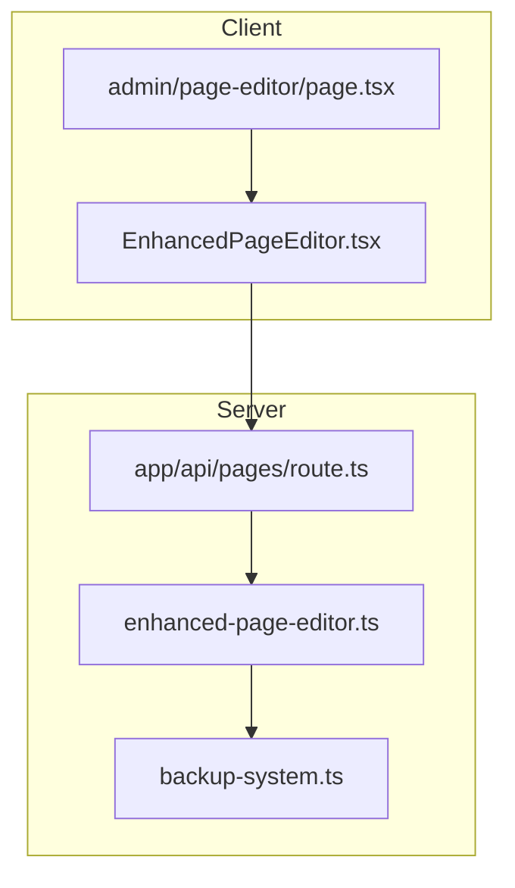
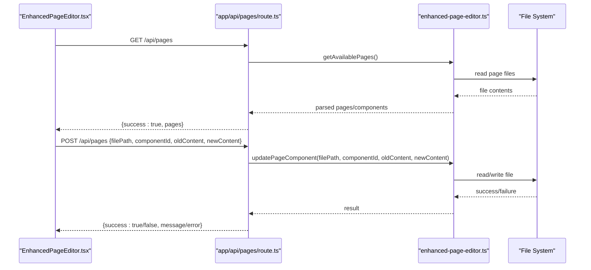
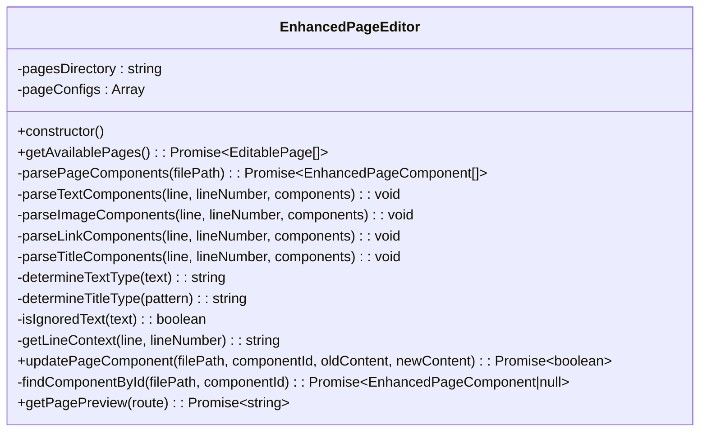
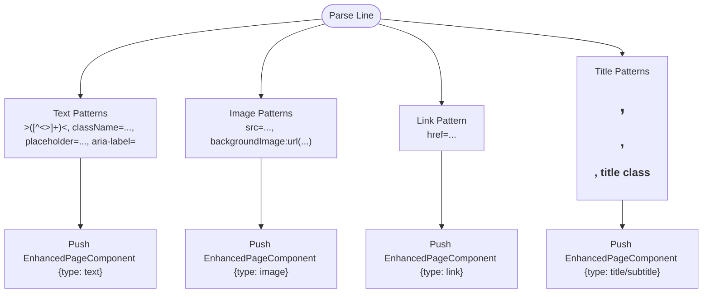
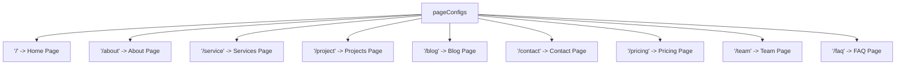
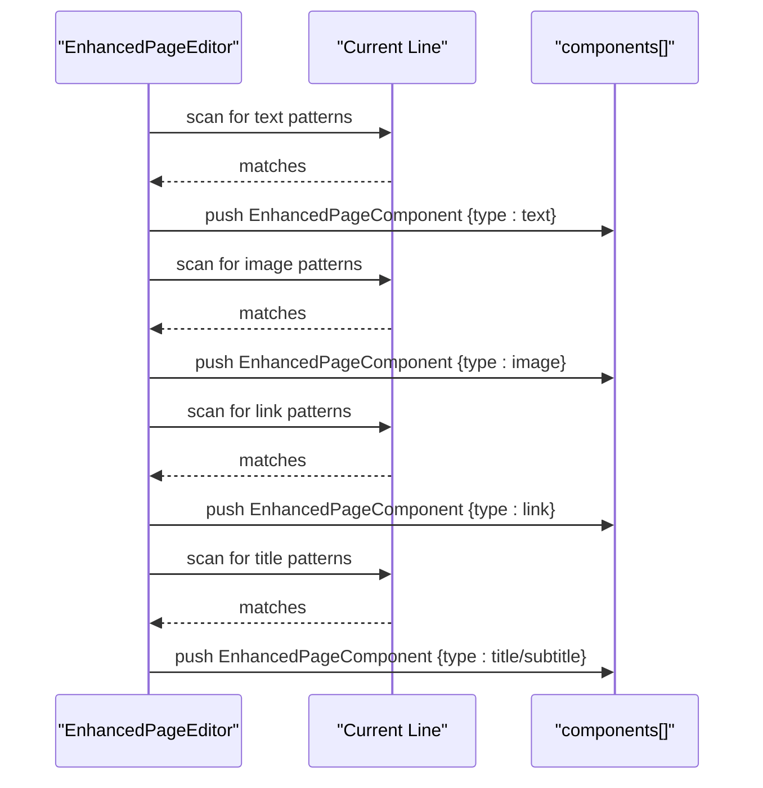
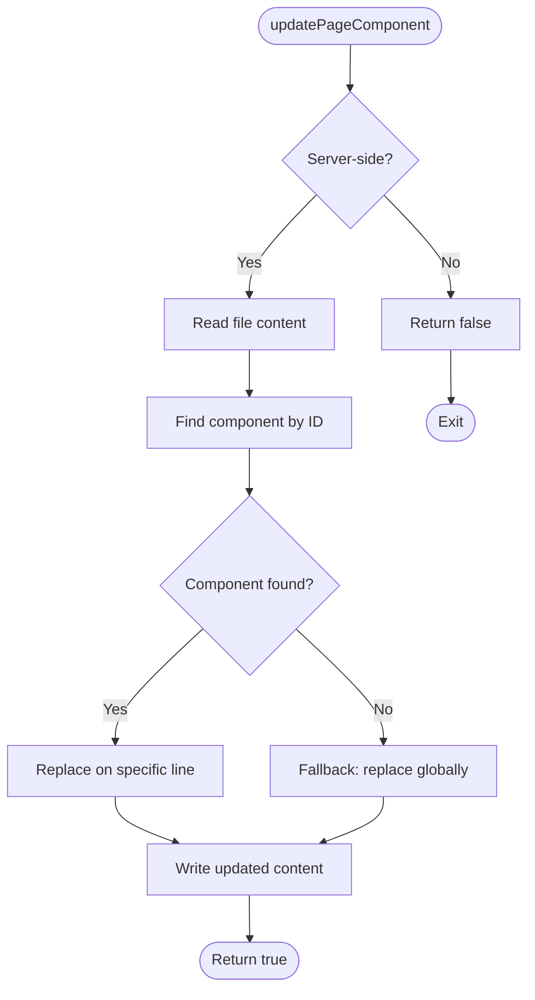
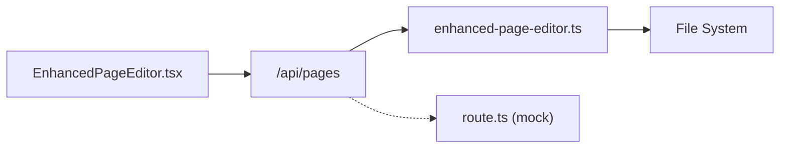
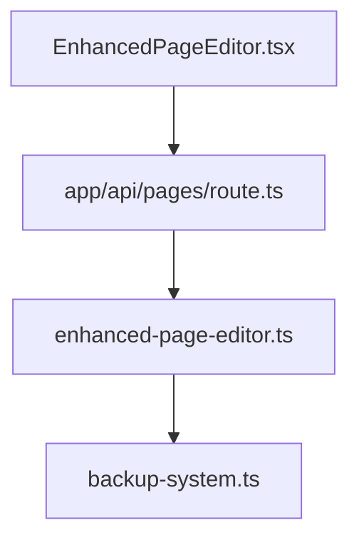

# Enhanced Page Editor

<cite>
**Referenced Files in This Document**
- [enhanced-page-editor.ts](file://src/lib/enhanced-page-editor.ts)
- [page-editor.ts](file://src/lib/page-editor.ts)
- [EnhancedPageEditor.tsx](file://src/app/Components/Admin/EnhancedPageEditor.tsx)
- [page.tsx](file://src/app/admin/page-editor/page.tsx)
- [page.tsx](file://src/app/admin/page-editor-demo/page.tsx)
- [route.ts](file://src/app/api/pages/route.ts)
- [backup-system.ts](file://src/lib/backup-system.ts)
- [PAGE_EDITOR_README.md](file://PAGE_EDITOR_README.md)
</cite>

## Table of Contents
1. [Introduction](#introduction)
2. [Project Structure](#project-structure)
3. [Core Components](#core-components)
4. [Architecture Overview](#architecture-overview)
5. [Detailed Component Analysis](#detailed-component-analysis)
6. [Dependency Analysis](#dependency-analysis)
7. [Performance Considerations](#performance-considerations)
8. [Troubleshooting Guide](#troubleshooting-guide)
9. [Conclusion](#conclusion)
10. [Appendices](#appendices)

## Introduction
This document describes the Enhanced Page Editor component, focusing on the EnhancedPageEditor class architecture, component parsing algorithms, file system integration, and real-time editing capabilities. It explains how the system detects text, images, links, and titles via regex-based parsing, documents the page configuration system for supported routes and file paths, and details the update mechanism for safe content replacement. Practical examples illustrate component identification, content modification workflows, and error handling strategies. It also addresses client-side versus server-side execution differences and security considerations for file system access.

## Project Structure
The Enhanced Page Editor spans client-side UI components, server-side parsing logic, and API endpoints. The key elements are:
- Client-side React component for editing and preview
- Server-side TypeScript library for parsing and updating page components
- Next.js API routes for serving page metadata and applying updates
- Backup system for safe change management

**Diagram sources**
- [EnhancedPageEditor.tsx](file://src/app/Components/Admin/EnhancedPageEditor.tsx#L1-L431)
- [page.tsx](file://src/app/admin/page-editor/page.tsx#L1-L14)
- [enhanced-page-editor.ts](file://src/lib/enhanced-page-editor.ts#L1-L287)
- [route.ts](file://src/app/api/pages/route.ts#L1-L110)
- [backup-system.ts](file://src/lib/backup-system.ts#L1-L119)

**Section sources**
- [PAGE_EDITOR_README.md](file://PAGE_EDITOR_README.md#L52-L72)
- [page.tsx](file://src/app/admin/page-editor/page.tsx#L1-L14)
- [EnhancedPageEditor.tsx](file://src/app/Components/Admin/EnhancedPageEditor.tsx#L1-L431)
- [enhanced-page-editor.ts](file://src/lib/enhanced-page-editor.ts#L1-L287)
- [route.ts](file://src/app/api/pages/route.ts#L1-L110)
- [backup-system.ts](file://src/lib/backup-system.ts#L1-L119)

## Core Components
- EnhancedPageEditor class: Parses page files, detects components, and safely updates content.
- EnhancedPageEditor UI: Provides page selection, component browsing, filtering, search, editing, and preview.
- API endpoints: Serve page metadata and apply edits.
- Backup system: Manages pre-change backups and restoration.

Key responsibilities:
- Parsing: Detects text, titles, subtitles, descriptions, images, and links using regex patterns.
- Positioning: Records line and column positions for precise editing.
- Context: Captures surrounding code context to aid editing.
- Safety: Uses context-aware replacement and supports backups.

**Section sources**
- [enhanced-page-editor.ts](file://src/lib/enhanced-page-editor.ts#L26-L287)
- [EnhancedPageEditor.tsx](file://src/app/Components/Admin/EnhancedPageEditor.tsx#L32-L431)
- [route.ts](file://src/app/api/pages/route.ts#L66-L109)
- [backup-system.ts](file://src/lib/backup-system.ts#L12-L119)

## Architecture Overview
The system follows a client-server split:
- Client: React UI handles user interactions, displays components, and sends updates via API.
- Server: Parses page files, detects components, and applies updates with safety checks.
- API: Exposes endpoints to list pages and apply changes.

**Diagram sources**
- [EnhancedPageEditor.tsx](file://src/app/Components/Admin/EnhancedPageEditor.tsx#L47-L131)
- [route.ts](file://src/app/api/pages/route.ts#L66-L109)
- [enhanced-page-editor.ts](file://src/lib/enhanced-page-editor.ts#L50-L76)
- [enhanced-page-editor.ts](file://src/lib/enhanced-page-editor.ts#L239-L272)

## Detailed Component Analysis

### EnhancedPageEditor Class
The EnhancedPageEditor class encapsulates parsing and editing logic:
- Page configuration: Defines supported routes and file paths.
- Component detection: Regex-based parsing for text, images, links, and titles.
- Type inference: Determines content types (text, title, subtitle, description).
- Safe update: Context-aware replacement and fallback strategies.
- Environment awareness: Restricts file system operations to server-side contexts.

**Diagram sources**
- [enhanced-page-editor.ts](file://src/lib/enhanced-page-editor.ts#L26-L287)

**Section sources**
- [enhanced-page-editor.ts](file://src/lib/enhanced-page-editor.ts#L26-L48)
- [enhanced-page-editor.ts](file://src/lib/enhanced-page-editor.ts#L78-L100)
- [enhanced-page-editor.ts](file://src/lib/enhanced-page-editor.ts#L102-L205)
- [enhanced-page-editor.ts](file://src/lib/enhanced-page-editor.ts#L239-L277)

### Component Detection System
The parser identifies components using regex patterns per content type:
- Text: Matches content between JSX tags, with additional attributes like placeholders and aria-labels.
- Images: Extracts src and background image URLs, excluding data/blob URIs.
- Links: Extracts href attributes, excluding anchors and JavaScript URIs.
- Titles: Matches H1–H3 headings and title-like class patterns.

**Diagram sources**
- [enhanced-page-editor.ts](file://src/lib/enhanced-page-editor.ts#L102-L129)
- [enhanced-page-editor.ts](file://src/lib/enhanced-page-editor.ts#L131-L155)
- [enhanced-page-editor.ts](file://src/lib/enhanced-page-editor.ts#L157-L176)
- [enhanced-page-editor.ts](file://src/lib/enhanced-page-editor.ts#L178-L205)

**Section sources**
- [enhanced-page-editor.ts](file://src/lib/enhanced-page-editor.ts#L102-L205)

### Page Configuration System
Supported routes and file paths are defined centrally:
- Routes include home, inner pages (about, service, project, blog, contact, pricing, team, faq).
- Paths resolve under src/app with appropriate directory structures.

**Diagram sources**
- [enhanced-page-editor.ts](file://src/lib/enhanced-page-editor.ts#L38-L48)

**Section sources**
- [enhanced-page-editor.ts](file://src/lib/enhanced-page-editor.ts#L38-L48)

### Component Parsing Methods
- parseTextComponents: Scans for text content across multiple patterns and filters ignored tokens.
- parseImageComponents: Extracts image sources while excluding inline data URIs.
- parseLinkComponents: Extracts href values excluding anchors and JavaScript targets.
- parseTitleComponents: Identifies headings and title-like patterns, inferring type from regex.

**Diagram sources**
- [enhanced-page-editor.ts](file://src/lib/enhanced-page-editor.ts#L102-L205)

**Section sources**
- [enhanced-page-editor.ts](file://src/lib/enhanced-page-editor.ts#L102-L205)

### updatePageComponent Method
The update method performs a context-aware replacement:
- Locates the component by ID and computes the target line.
- Replaces old content with new content on the exact line.
- Falls back to global replacement if component lookup fails.
- Returns success/failure with error logging.

**Diagram sources**
- [enhanced-page-editor.ts](file://src/lib/enhanced-page-editor.ts#L239-L272)

**Section sources**
- [enhanced-page-editor.ts](file://src/lib/enhanced-page-editor.ts#L239-L272)

### Client-Side vs Server-Side Execution
- Client-side (UI): Fetches pages, renders components, and submits updates via API. File system operations are not executed here.
- Server-side (lib + API): Performs file reads/writes, parsing, and updates. Environment checks prevent unsafe operations in browser contexts.

**Diagram sources**
- [EnhancedPageEditor.tsx](file://src/app/Components/Admin/EnhancedPageEditor.tsx#L47-L131)
- [route.ts](file://src/app/api/pages/route.ts#L66-L109)
- [enhanced-page-editor.ts](file://src/lib/enhanced-page-editor.ts#L29-L36)

**Section sources**
- [EnhancedPageEditor.tsx](file://src/app/Components/Admin/EnhancedPageEditor.tsx#L47-L131)
- [enhanced-page-editor.ts](file://src/lib/enhanced-page-editor.ts#L29-L36)
- [route.ts](file://src/app/api/pages/route.ts#L66-L109)

### Security Considerations
- File system access is restricted to server-side environments.
- Updates exclude data/blob URIs for images and anchors/javascript for links.
- Automatic backups are supported by the backup system to mitigate risk.
- API endpoints validate request payloads and return structured errors.

**Section sources**
- [enhanced-page-editor.ts](file://src/lib/enhanced-page-editor.ts#L141-L142)
- [enhanced-page-editor.ts](file://src/lib/enhanced-page-editor.ts#L163-L164)
- [backup-system.ts](file://src/lib/backup-system.ts#L12-L119)
- [route.ts](file://src/app/api/pages/route.ts#L80-L109)

## Dependency Analysis
The Enhanced Page Editor integrates several modules:
- UI depends on API endpoints for data and actions.
- API depends on the EnhancedPageEditor library for parsing and updates.
- EnhancedPageEditor depends on the backup system for safety.

**Diagram sources**
- [EnhancedPageEditor.tsx](file://src/app/Components/Admin/EnhancedPageEditor.tsx#L1-L431)
- [route.ts](file://src/app/api/pages/route.ts#L1-L110)
- [enhanced-page-editor.ts](file://src/lib/enhanced-page-editor.ts#L1-L287)
- [backup-system.ts](file://src/lib/backup-system.ts#L1-L119)

**Section sources**
- [EnhancedPageEditor.tsx](file://src/app/Components/Admin/EnhancedPageEditor.tsx#L1-L431)
- [route.ts](file://src/app/api/pages/route.ts#L1-L110)
- [enhanced-page-editor.ts](file://src/lib/enhanced-page-editor.ts#L1-L287)
- [backup-system.ts](file://src/lib/backup-system.ts#L1-L119)

## Performance Considerations
- Parsing operates line-by-line; complexity is O(L) per page where L is the number of lines.
- Regex scanning per line is efficient but can be optimized by reducing redundant patterns.
- Consider caching parsed components per session to avoid repeated file reads.
- API responses should include minimal necessary context to reduce payload sizes.

## Troubleshooting Guide
Common issues and resolutions:
- Content not updating: Verify file path correctness and existence; ensure server-side execution.
- Images not showing: Confirm image URLs are accessible and not data/blob URIs.
- Search/filter not working: Ensure search terms match component content or names.
- API errors: Check request payload completeness and server logs.

Error handling highlights:
- API validates required parameters and returns structured errors.
- Parsing ignores trivial or tag-only content to reduce noise.
- Update method logs errors and returns failure states.

**Section sources**
- [route.ts](file://src/app/api/pages/route.ts#L80-L109)
- [enhanced-page-editor.ts](file://src/lib/enhanced-page-editor.ts#L219-L228)
- [enhanced-page-editor.ts](file://src/lib/enhanced-page-editor.ts#L268-L271)

## Conclusion
The Enhanced Page Editor provides a robust, context-aware solution for editing website content. Its regex-based parsing, type inference, and safe update mechanisms enable precise, real-time editing. The separation between client UI and server-side parsing ensures secure and maintainable operations, while the backup system adds reliability. Extensibility is straightforward: add new patterns, types, and UI controls to support evolving content needs.

## Appendices

### Practical Examples

- Component identification
  - Text: Detected inside JSX tags and attributes; filtered by length and ignored patterns.
  - Images: Extracted from src and background styles; excludes inline data URIs.
  - Links: Extracted from href attributes; excludes anchors and JavaScript targets.
  - Titles: Identified via heading tags and title-like classes; inferred as title or subtitle.

- Content modification workflow
  - Select a page → Browse components → Filter/search → Select component → Edit content → Save → Preview.

- Error handling strategies
  - API validates inputs and returns structured errors.
  - Parsing ignores trivial content and logs errors during file operations.
  - Update falls back to global replacement if component lookup fails.

**Section sources**
- [enhanced-page-editor.ts](file://src/lib/enhanced-page-editor.ts#L102-L205)
- [EnhancedPageEditor.tsx](file://src/app/Components/Admin/EnhancedPageEditor.tsx#L77-L131)
- [route.ts](file://src/app/api/pages/route.ts#L80-L109)