# Metadata Management

<cite>
**Referenced Files in This Document**
- [seed-metadata.ts](file://src/lib/seed-metadata.ts)
- [usePageMetadata.ts](file://src/hooks/usePageMetadata.ts)
- [useFilePageMetadata.ts](file://src/hooks/useFilePageMetadata.ts)
- [fileSeoUtils.ts](file://src/lib/fileSeoUtils.ts)
- [database.ts](file://src/lib/database.ts)
- [SEOHead.tsx](file://src/app/Components/Common/SEOHead.tsx)
- [page.tsx](file://src/app/(innerpage)/about/page.tsx)
- [page.tsx](file://src/app/(innerpage)/service/seo/page.tsx)
- [SEO_MANAGEMENT_GUIDE.md](file://SEO_MANAGEMENT_GUIDE.md)
- [ABOUT_PAGE_SEO_SUMMARY.md](file://ABOUT_PAGE_SEO_SUMMARY.md)
</cite>

## Table of Contents
1. [Introduction](#introduction)
2. [Project Structure](#project-structure)
3. [Core Components](#core-components)
4. [Architecture Overview](#architecture-overview)
5. [Detailed Component Analysis](#detailed-component-analysis)
6. [Dependency Analysis](#dependency-analysis)
7. [Performance Considerations](#performance-considerations)
8. [Troubleshooting Guide](#troubleshooting-guide)
9. [Conclusion](#conclusion)
10. [Appendices](#appendices)

## Introduction
This document describes the metadata management system used to initialize, store, retrieve, and update page SEO data and defaults. It covers:
- Seed-initialization of default metadata for core pages
- Hooks for dynamic retrieval and updates of metadata
- Metadata structure including title, description, keywords, Open Graph, Twitter cards, canonical, and robots
- Automatic metadata generation from page content and file-based sources
- Integration with the SEO system and impact on search engine optimization
- Practical examples, validation, fallbacks, and performance optimization

## Project Structure
The metadata system spans libraries, hooks, utilities, and example pages:
- Libraries: database schema, seeding, and file-based metadata utilities
- Hooks: client-side hooks to fetch/update page metadata via API
- Example pages: demonstrate both database-backed and file-based metadata approaches
- Admin guide: operational guidance for seeding and managing metadata

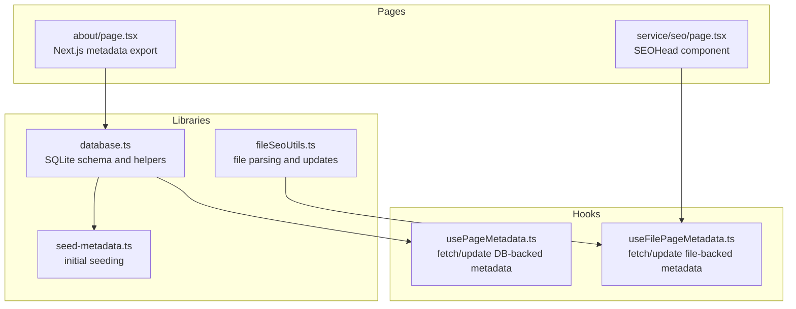

**Diagram sources**
- [database.ts](file://src/lib/database.ts#L62-L81)
- [seed-metadata.ts](file://src/lib/seed-metadata.ts#L3-L93)
- [fileSeoUtils.ts](file://src/lib/fileSeoUtils.ts#L39-L115)
- [usePageMetadata.ts](file://src/hooks/usePageMetadata.ts#L13-L52)
- [useFilePageMetadata.ts](file://src/hooks/useFilePageMetadata.ts#L13-L52)
- [page.tsx](file://src/app/(innerpage)/about/page.tsx#L10-L60)
- [page.tsx](file://src/app/(innerpage)/service/seo/page.tsx#L9-L33)

**Section sources**
- [database.ts](file://src/lib/database.ts#L62-L81)
- [seed-metadata.ts](file://src/lib/seed-metadata.ts#L3-L93)
- [fileSeoUtils.ts](file://src/lib/fileSeoUtils.ts#L39-L115)
- [usePageMetadata.ts](file://src/hooks/usePageMetadata.ts#L13-L52)
- [useFilePageMetadata.ts](file://src/hooks/useFilePageMetadata.ts#L13-L52)
- [page.tsx](file://src/app/(innerpage)/about/page.tsx#L10-L60)
- [page.tsx](file://src/app/(innerpage)/service/seo/page.tsx#L9-L33)

## Core Components
- Database-backed metadata model and API integration via hooks
- File-based metadata utilities for parsing and updating Next.js metadata exports
- Seed-initialization script for default page metadata
- Example pages demonstrating both approaches

Key capabilities:
- Store and retrieve per-route metadata with title, description, keywords, Open Graph, Twitter, canonical, robots
- Fetch and update metadata dynamically from the client
- Parse existing component metadata and write updates back to files
- Seed initial metadata for core pages

**Section sources**
- [database.ts](file://src/lib/database.ts#L62-L81)
- [fileSeoUtils.ts](file://src/lib/fileSeoUtils.ts#L39-L115)
- [seed-metadata.ts](file://src/lib/seed-metadata.ts#L3-L93)
- [usePageMetadata.ts](file://src/hooks/usePageMetadata.ts#L13-L52)
- [useFilePageMetadata.ts](file://src/hooks/useFilePageMetadata.ts#L13-L52)

## Architecture Overview
The system supports two primary metadata sources:
- Database-backed: stored in a SQLite table and accessed via hooks
- File-based: parsed from Next.js metadata exports and updated in-place

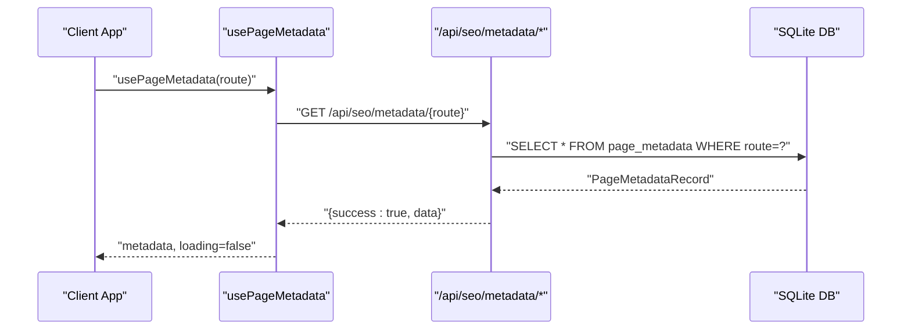

**Diagram sources**
- [usePageMetadata.ts](file://src/hooks/usePageMetadata.ts#L18-L38)
- [database.ts](file://src/lib/database.ts#L159-L181)

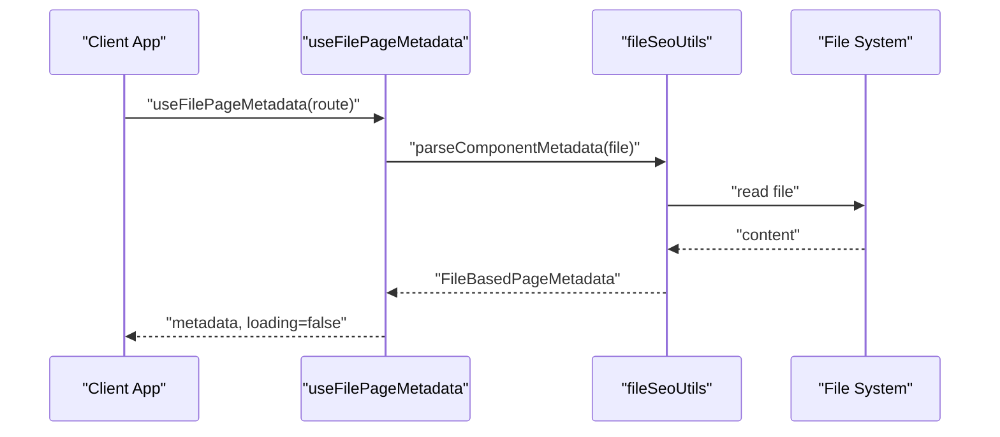

**Diagram sources**
- [useFilePageMetadata.ts](file://src/hooks/useFilePageMetadata.ts#L18-L38)
- [fileSeoUtils.ts](file://src/lib/fileSeoUtils.ts#L120-L178)

## Detailed Component Analysis

### Database-backed Metadata Model
The metadata model defines the shape of stored SEO data, including:
- Basic SEO: title, meta_title, meta_description, keywords
- Open Graph: og_title, og_description, og_image
- Twitter: twitter_title, twitter_description, twitter_image
- Canonical and robots: canonical_url, robots_index, robots_follow
- Timestamps: created_at, updated_at

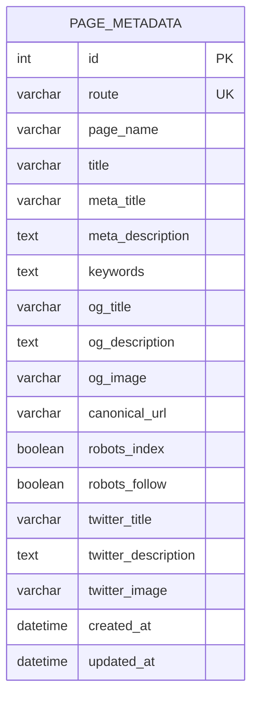

**Diagram sources**
- [database.ts](file://src/lib/database.ts#L62-L81)

**Section sources**
- [database.ts](file://src/lib/database.ts#L62-L81)

### Seed-initialization of Default Metadata
The seeding script initializes default metadata for core pages, ensuring baseline SEO coverage. It checks for existing entries and inserts new ones if missing.

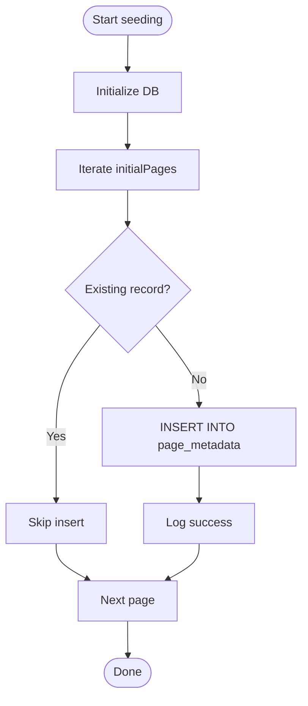

**Diagram sources**
- [seed-metadata.ts](file://src/lib/seed-metadata.ts#L3-L93)

**Section sources**
- [seed-metadata.ts](file://src/lib/seed-metadata.ts#L3-L93)

### Hooks for Dynamic Metadata Retrieval and Updates
Two client-side hooks provide unified access patterns:
- usePageMetadata: database-backed metadata retrieval, listing, and updates
- useFilePageMetadata: file-based metadata retrieval, listing, and updates

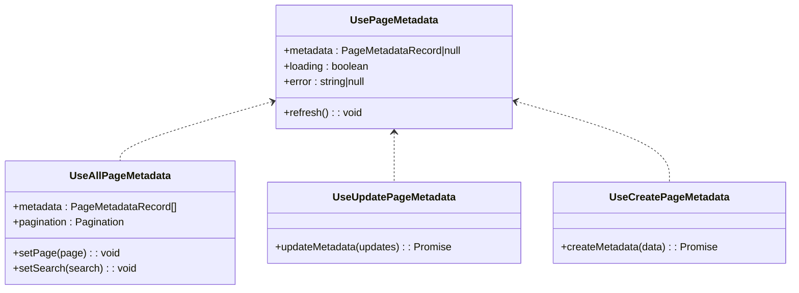

**Diagram sources**
- [usePageMetadata.ts](file://src/hooks/usePageMetadata.ts#L13-L52)
- [usePageMetadata.ts](file://src/hooks/usePageMetadata.ts#L70-L135)
- [usePageMetadata.ts](file://src/hooks/usePageMetadata.ts#L137-L177)
- [usePageMetadata.ts](file://src/hooks/usePageMetadata.ts#L179-L218)

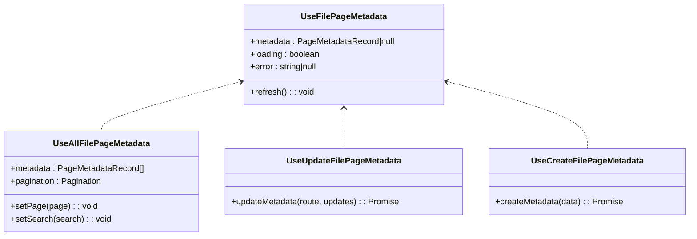

**Diagram sources**
- [useFilePageMetadata.ts](file://src/hooks/useFilePageMetadata.ts#L13-L52)
- [useFilePageMetadata.ts](file://src/hooks/useFilePageMetadata.ts#L70-L139)
- [useFilePageMetadata.ts](file://src/hooks/useFilePageMetadata.ts#L141-L184)
- [useFilePageMetadata.ts](file://src/hooks/useFilePageMetadata.ts#L186-L225)

**Section sources**
- [usePageMetadata.ts](file://src/hooks/usePageMetadata.ts#L13-L52)
- [usePageMetadata.ts](file://src/hooks/usePageMetadata.ts#L70-L135)
- [usePageMetadata.ts](file://src/hooks/usePageMetadata.ts#L137-L177)
- [usePageMetadata.ts](file://src/hooks/usePageMetadata.ts#L179-L218)
- [useFilePageMetadata.ts](file://src/hooks/useFilePageMetadata.ts#L13-L52)
- [useFilePageMetadata.ts](file://src/hooks/useFilePageMetadata.ts#L70-L139)
- [useFilePageMetadata.ts](file://src/hooks/useFilePageMetadata.ts#L141-L184)
- [useFilePageMetadata.ts](file://src/hooks/useFilePageMetadata.ts#L186-L225)

### Automatic Metadata Generation from Page Content and Files
File-based utilities parse Next.js metadata exports and update them programmatically:
- Route-to-file mapping enables deterministic file discovery
- Parsing extracts title, description, keywords, Open Graph, robots
- Updating writes back to the appropriate metadata export or SEOHead component props

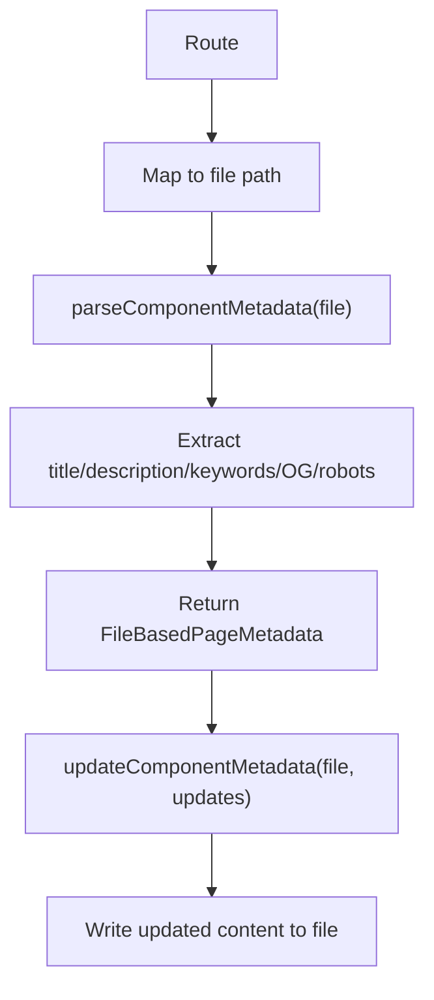

**Diagram sources**
- [fileSeoUtils.ts](file://src/lib/fileSeoUtils.ts#L6-L37)
- [fileSeoUtils.ts](file://src/lib/fileSeoUtils.ts#L120-L178)
- [fileSeoUtils.ts](file://src/lib/fileSeoUtils.ts#L183-L298)

**Section sources**
- [fileSeoUtils.ts](file://src/lib/fileSeoUtils.ts#L6-L37)
- [fileSeoUtils.ts](file://src/lib/fileSeoUtils.ts#L120-L178)
- [fileSeoUtils.ts](file://src/lib/fileSeoUtils.ts#L183-L298)

### Metadata Structure and SEO Impact
The metadata structure aligns with modern SEO best practices:
- Title and meta description for browser tabs and SERP snippets
- Keywords array for semantic signals
- Open Graph tags for rich social sharing
- Twitter cards for Twitter previews
- Canonical URL to prevent duplicate content
- Robots directives to control indexing and following

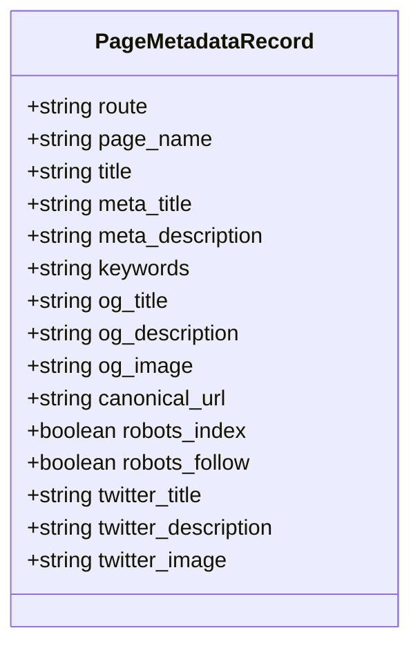

**Diagram sources**
- [database.ts](file://src/lib/database.ts#L62-L81)

**Section sources**
- [database.ts](file://src/lib/database.ts#L62-L81)
- [fileSeoUtils.ts](file://src/lib/fileSeoUtils.ts#L47-L115)

### Integration with the SEO System and Examples
- Database-backed example: the About page exports Next.js Metadata with comprehensive SEO fields
- File-based example: the SEO Services page uses the SEOHead component with route-based metadata
- Admin guide: operational steps for seeding and managing metadata

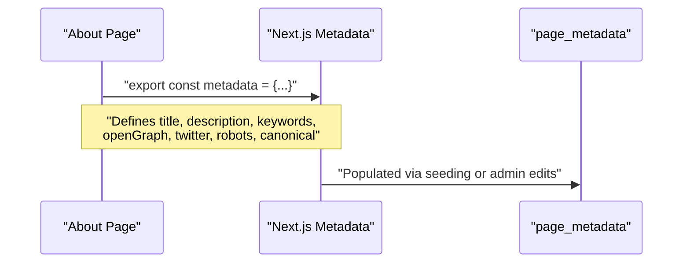

**Diagram sources**
- [page.tsx](file://src/app/(innerpage)/about/page.tsx#L10-L60)
- [database.ts](file://src/lib/database.ts#L159-L181)

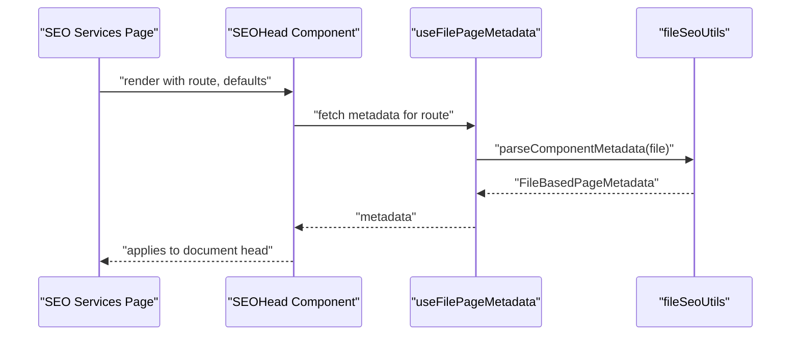

**Diagram sources**
- [page.tsx](file://src/app/(innerpage)/service/seo/page.tsx#L9-L33)
- [useFilePageMetadata.ts](file://src/hooks/useFilePageMetadata.ts#L18-L38)
- [fileSeoUtils.ts](file://src/lib/fileSeoUtils.ts#L120-L178)

**Section sources**
- [page.tsx](file://src/app/(innerpage)/about/page.tsx#L10-L60)
- [page.tsx](file://src/app/(innerpage)/service/seo/page.tsx#L9-L33)
- [SEOHead.tsx](file://src/app/Components/Common/SEOHead.tsx)
- [SEO_MANAGEMENT_GUIDE.md](file://SEO_MANAGEMENT_GUIDE.md#L14-L18)

## Dependency Analysis
The system exhibits clear separation of concerns:
- Hooks depend on API endpoints and the database schema
- File utilities depend on route-to-file mapping and filesystem access
- Example pages demonstrate both database-backed and file-based approaches

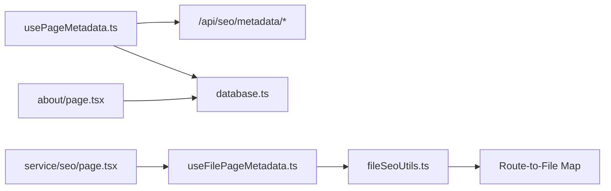

**Diagram sources**
- [usePageMetadata.ts](file://src/hooks/usePageMetadata.ts#L18-L38)
- [database.ts](file://src/lib/database.ts#L159-L181)
- [useFilePageMetadata.ts](file://src/hooks/useFilePageMetadata.ts#L18-L38)
- [fileSeoUtils.ts](file://src/lib/fileSeoUtils.ts#L6-L37)
- [page.tsx](file://src/app/(innerpage)/about/page.tsx#L10-L60)
- [page.tsx](file://src/app/(innerpage)/service/seo/page.tsx#L9-L33)

**Section sources**
- [usePageMetadata.ts](file://src/hooks/usePageMetadata.ts#L18-L38)
- [useFilePageMetadata.ts](file://src/hooks/useFilePageMetadata.ts#L18-L38)
- [fileSeoUtils.ts](file://src/lib/fileSeoUtils.ts#L6-L37)
- [database.ts](file://src/lib/database.ts#L159-L181)
- [page.tsx](file://src/app/(innerpage)/about/page.tsx#L10-L60)
- [page.tsx](file://src/app/(innerpage)/service/seo/page.tsx#L9-L33)

## Performance Considerations
- Prefer caching metadata at the edge or in-memory for frequently accessed routes
- Batch listing requests with pagination to avoid large payloads
- Minimize filesystem reads by caching parsed metadata during development
- Use canonical URLs and robots directives to reduce crawl waste
- Keep keyword arrays concise and relevant to improve rendering performance

[No sources needed since this section provides general guidance]

## Troubleshooting Guide
Common issues and resolutions:
- Database not initialized: visit the seeding endpoint to create tables and seed data
- Route mismatch: ensure the route passed to hooks and SEOHead matches the page URL exactly
- Network errors: verify API endpoints are reachable and CORS is configured
- File updates failing: confirm file permissions and that the target file exists

Operational references:
- Seeding and dashboard access steps
- Field limits and best practices for titles and descriptions

**Section sources**
- [SEO_MANAGEMENT_GUIDE.md](file://SEO_MANAGEMENT_GUIDE.md#L14-L18)
- [SEO_MANAGEMENT_GUIDE.md](file://SEO_MANAGEMENT_GUIDE.md#L80-L92)

## Conclusion
The metadata management system provides robust, dual-source support for SEO data:
- Database-backed storage for centralized, admin-managed metadata
- File-based parsing and updates for component-level control
- Hooks enabling dynamic retrieval and updates
- Clear structure and utilities for Open Graph, Twitter, canonical, and robots
- Practical examples and operational guidance for quick adoption

[No sources needed since this section summarizes without analyzing specific files]

## Appendices

### Practical Examples and Usage Patterns
- Database-backed metadata: define Next.js Metadata export on the page and rely on seeding/admin edits
- File-based metadata: use SEOHead with route and defaults; leverage file utilities for programmatic updates
- Hook usage: pass the current route to usePageMetadata or useFilePageMetadata to fetch and display metadata

**Section sources**
- [page.tsx](file://src/app/(innerpage)/about/page.tsx#L10-L60)
- [page.tsx](file://src/app/(innerpage)/service/seo/page.tsx#L9-L33)
- [SEOHead.tsx](file://src/app/Components/Common/SEOHead.tsx)
- [usePageMetadata.ts](file://src/hooks/usePageMetadata.ts#L13-L52)
- [useFilePageMetadata.ts](file://src/hooks/useFilePageMetadata.ts#L13-L52)

### Metadata Validation and Fallback Mechanisms
- Validation: ensure route uniqueness, character limits for title/description, and presence of canonical/robots defaults
- Fallbacks: pages remain functional even without database entries; file-based parsing provides defaults from component metadata

**Section sources**
- [database.ts](file://src/lib/database.ts#L161-L181)
- [fileSeoUtils.ts](file://src/lib/fileSeoUtils.ts#L120-L178)
- [SEO_MANAGEMENT_GUIDE.md](file://SEO_MANAGEMENT_GUIDE.md#L54-L56)

### Content-driven Metadata Generation
- Extract title, description, keywords, and Open Graph values from component metadata
- Generate Next.js metadata format for seamless integration with the framework

**Section sources**
- [fileSeoUtils.ts](file://src/lib/fileSeoUtils.ts#L47-L115)
- [ABOUT_PAGE_SEO_SUMMARY.md](file://ABOUT_PAGE_SEO_SUMMARY.md#L5-L12)