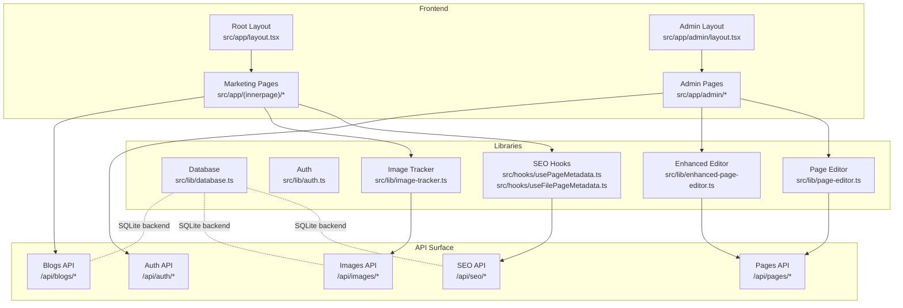
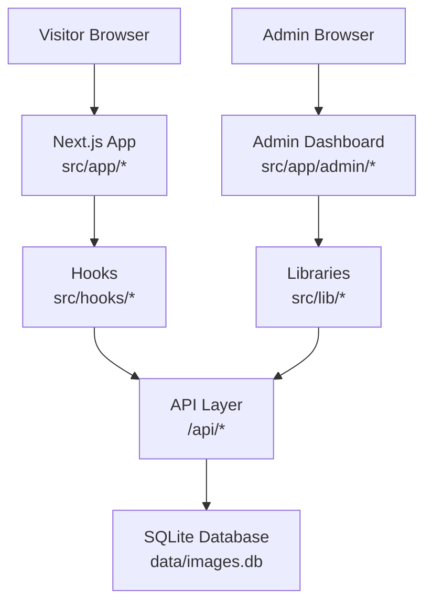
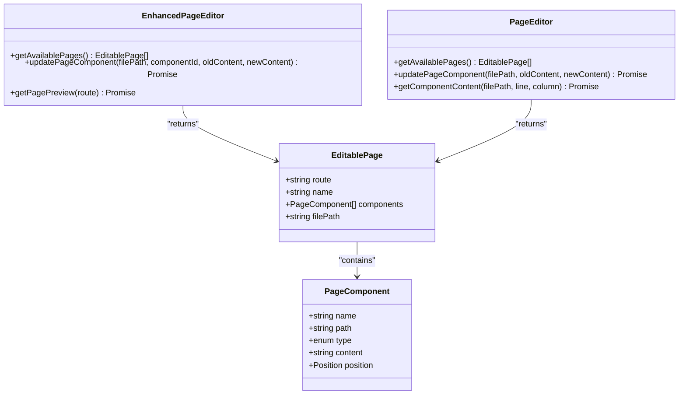
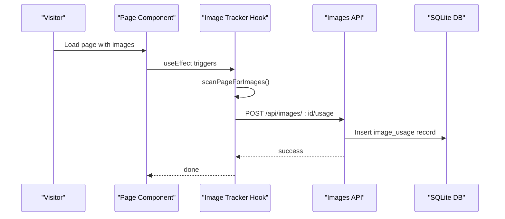
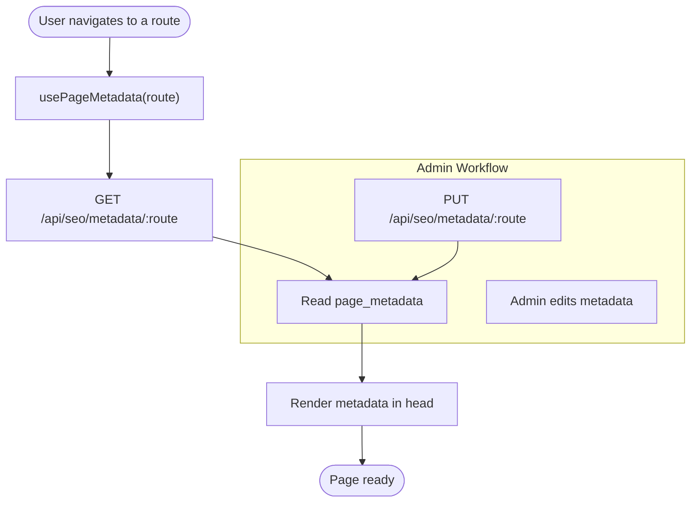
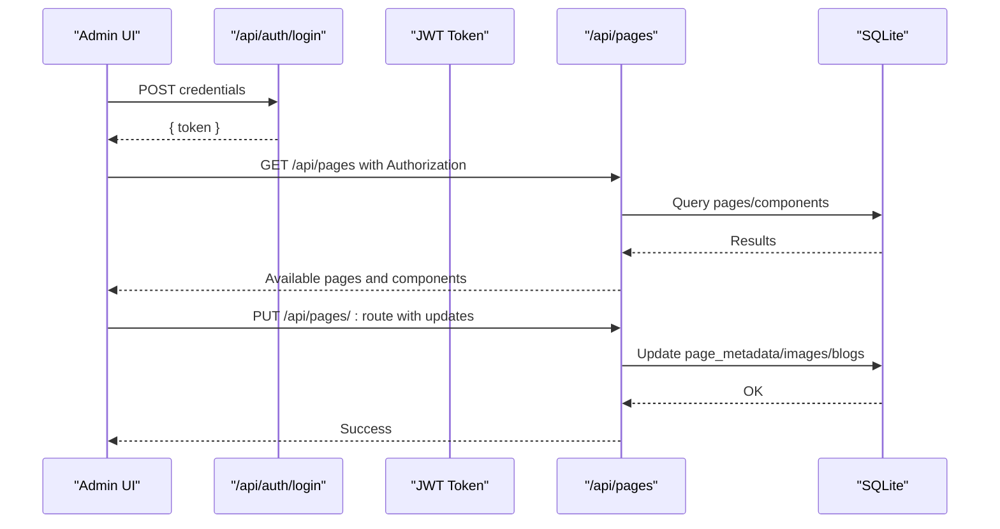
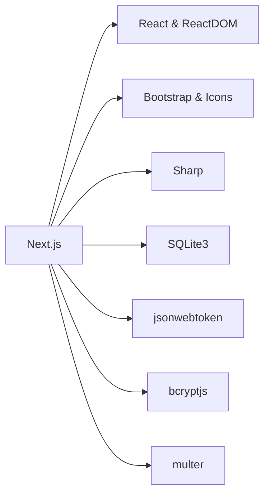

# Core Features

<cite>
**Referenced Files in This Document**
- [README.md](file://README.md)
- [package.json](file://package.json)
- [src/lib/database.ts](file://src/lib/database.ts)
- [src/lib/auth.ts](file://src/lib/auth.ts)
- [src/app/layout.tsx](file://src/app/layout.tsx)
- [src/app/admin/layout.tsx](file://src/app/admin/layout.tsx)
- [src/lib/enhanced-page-editor.ts](file://src/lib/enhanced-page-editor.ts)
- [src/lib/page-editor.ts](file://src/lib/page-editor.ts)
- [src/lib/image-tracker.ts](file://src/lib/image-tracker.ts)
- [src/hooks/usePageMetadata.ts](file://src/hooks/usePageMetadata.ts)
- [src/hooks/useFilePageMetadata.ts](file://src/hooks/useFilePageMetadata.ts)
- [src/lib/sitemap-utils.ts](file://src/lib/sitemap-utils.ts)
- [src/app/robots.ts](file://src/app/robots.ts)
- [src/app/sitemap.ts](file://src/app/sitemap.ts)
- [src/lib/seed-metadata.ts](file://src/lib/seed-metadata.ts)
- [scripts/add-all-pages-to-seo.js](file://scripts/add-all-pages-to-seo.js)
- [scripts/check-seo-data.js](file://scripts/check-seo-data.js)
- [scripts/init-database.js](file://scripts/init-database.js)
- [scripts/seed-seo-data.js](file://scripts/seed-seo-data.js)
- [IMAGE_MANAGEMENT_SETUP.md](file://IMAGE_MANAGEMENT_SETUP.md)
- [SEO_MANAGEMENT_GUIDE.md](file://SEO_MANAGEMENT_GUIDE.md)
- [ADMIN_DASHBOARD_SETUP.md](file://ADMIN_DASHBOARD_SETUP.md)
- [PAGE_EDITOR_README.md](file://PAGE_EDITOR_README.md)
</cite>

## Table of Contents
1. [Introduction](#introduction)
2. [Project Structure](#project-structure)
3. [Core Components](#core-components)
4. [Architecture Overview](#architecture-overview)
5. [Detailed Component Analysis](#detailed-component-analysis)
6. [Dependency Analysis](#dependency-analysis)
7. [Performance Considerations](#performance-considerations)
8. [Troubleshooting Guide](#troubleshooting-guide)
9. [Conclusion](#conclusion)
10. [Appendices](#appendices)

## Introduction
This document presents the core features of attechglobal.com, focusing on the multi-page marketing website, the admin dashboard, the content management system (CMS), media management, blog management, and the API architecture. It explains how the platform enables responsive design, SEO optimization, modern UI components, real-time content editing, dynamic component editing, file-based content structure, automated SEO metadata generation, image optimization with Sharp, gallery management, usage tracking, and robust API endpoints serving both the frontend and admin interfaces.

## Project Structure
The project is a Next.js application structured around:
- Marketing website pages under src/app with dedicated routes for home, inner pages, services, projects, blog, contact, pricing, team, and FAQ.
- Admin dashboard under src/app/admin with layouts and pages for dashboard, images, page editor, services, settings, and users.
- Shared UI components organized under src/app/Components grouped by feature areas (Common, Header, Footer, Services, etc.).
- Libraries for database operations, authentication, page editing, image tracking, and SEO metadata management under src/lib.
- Client-side hooks for SEO metadata retrieval and updates under src/hooks.
- Build and deployment scripts under scripts/, and documentation under project root.

**Diagram sources**
- [src/app/layout.tsx](file://src/app/layout.tsx#L1-L47)
- [src/app/admin/layout.tsx](file://src/app/admin/layout.tsx#L1-L23)
- [src/lib/database.ts](file://src/lib/database.ts#L1-L255)
- [src/lib/page-editor.ts](file://src/lib/page-editor.ts#L1-L194)
- [src/lib/enhanced-page-editor.ts](file://src/lib/enhanced-page-editor.ts#L1-L287)
- [src/lib/image-tracker.ts](file://src/lib/image-tracker.ts#L1-L95)
- [src/hooks/usePageMetadata.ts](file://src/hooks/usePageMetadata.ts#L1-L218)
- [src/hooks/useFilePageMetadata.ts](file://src/hooks/useFilePageMetadata.ts#L1-L225)

**Section sources**
- [README.md](file://README.md#L1-L37)
- [package.json](file://package.json#L1-L41)
- [src/app/layout.tsx](file://src/app/layout.tsx#L1-L47)
- [src/app/admin/layout.tsx](file://src/app/admin/layout.tsx#L1-L23)

## Core Components
- Responsive design and modern UI: Built with Next.js App Router, Bootstrap, and Bootstrap Icons, with preloading and performance optimizations in the root layout.
- Admin authentication: JWT-based admin login and role checks.
- Page editing: Two editors—one basic and one enhanced—parse and update page components in file-based pages.
- Media management: SQLite-backed image catalog with usage tracking and client-side scanning for automatic usage logging.
- Blog management: Structured content model with status and categorization.
- SEO metadata: Centralized metadata schema with hooks for fetching/updating per-route metadata and file-based metadata.
- API architecture: REST-style endpoints under /api for auth, blogs, images, pages, and SEO metadata.

**Section sources**
- [src/app/layout.tsx](file://src/app/layout.tsx#L1-L47)
- [src/lib/auth.ts](file://src/lib/auth.ts#L1-L85)
- [src/lib/page-editor.ts](file://src/lib/page-editor.ts#L1-L194)
- [src/lib/enhanced-page-editor.ts](file://src/lib/enhanced-page-editor.ts#L1-L287)
- [src/lib/image-tracker.ts](file://src/lib/image-tracker.ts#L1-L95)
- [src/lib/database.ts](file://src/lib/database.ts#L1-L255)
- [src/hooks/usePageMetadata.ts](file://src/hooks/usePageMetadata.ts#L1-L218)
- [src/hooks/useFilePageMetadata.ts](file://src/hooks/useFilePageMetadata.ts#L1-L225)

## Architecture Overview
The system separates concerns across frontend pages, admin dashboards, shared libraries, and API endpoints. The database stores images, blogs, and page metadata. Client-side hooks integrate with SEO APIs to dynamically manage metadata. Admin workflows leverage JWT tokens and page editors to modify file-based pages.

**Diagram sources**
- [src/app/layout.tsx](file://src/app/layout.tsx#L1-L47)
- [src/app/admin/layout.tsx](file://src/app/admin/layout.tsx#L1-L23)
- [src/lib/database.ts](file://src/lib/database.ts#L1-L255)
- [src/hooks/usePageMetadata.ts](file://src/hooks/usePageMetadata.ts#L1-L218)
- [src/hooks/useFilePageMetadata.ts](file://src/hooks/useFilePageMetadata.ts#L1-L225)

## Detailed Component Analysis

### Marketing Website: Responsive Design, SEO, and Modern UI
- Root layout integrates Bootstrap CSS and icons, sets author metadata, and injects Google Analytics via script tags.
- Preload and DNS prefetch links improve resource loading.
- Next.js App Router organizes pages by route, enabling fast navigation and static generation where applicable.

Practical example:
- Add a new route under src/app/(innerpage)/newpage/page.tsx and ensure metadata hooks are used to populate SEO fields.

**Section sources**
- [src/app/layout.tsx](file://src/app/layout.tsx#L1-L47)

### Admin Dashboard: Authentication and Navigation
- Admin layout composes header and sidebar with a main content area.
- Authentication module provides JWT-based login, token verification, and role checks.

Practical example:
- Admin login endpoint returns a signed token; subsequent admin requests include Authorization: Bearer <token>.

**Section sources**
- [src/app/admin/layout.tsx](file://src/app/admin/layout.tsx#L1-L23)
- [src/lib/auth.ts](file://src/lib/auth.ts#L1-L85)

### Content Management System: Dynamic Component Editing
Two editors enable dynamic editing of file-based pages:
- Basic PageEditor: Parses text, images, and links from page files and supports simple content replacement.
- EnhancedPageEditor: Adds contextual parsing, type inference (title/subtitle/description), and safer line-based updates.

**Diagram sources**
- [src/lib/page-editor.ts](file://src/lib/page-editor.ts#L1-L194)
- [src/lib/enhanced-page-editor.ts](file://src/lib/enhanced-page-editor.ts#L1-L287)

Implementation highlights:
- PageEditor scans JSX-like files to extract editable components and writes back changes.
- EnhancedPageEditor improves accuracy by identifying titles, subtitles, and descriptions and using line-based replacement.

Integration patterns:
- Admin pages call these editors to list pages and apply edits.
- Frontend pages rely on SEO hooks to render metadata.

**Section sources**
- [src/lib/page-editor.ts](file://src/lib/page-editor.ts#L1-L194)
- [src/lib/enhanced-page-editor.ts](file://src/lib/enhanced-page-editor.ts#L1-L287)

### Media Management: Image Optimization, Gallery, and Usage Tracking
- Database schema defines images, image_usage, blogs, and page_metadata tables.
- Image tracker scans rendered pages for internal images and logs usage against the database.
- Client-side hook and component wrapper automate tracking after images load.

**Diagram sources**
- [src/lib/image-tracker.ts](file://src/lib/image-tracker.ts#L1-L95)
- [src/lib/database.ts](file://src/lib/database.ts#L105-L181)

Implementation highlights:
- ImageUsageRecord tracks page_path, page_title, and usage_context.
- Usage count and SEO score are stored in the images table for reporting.

**Section sources**
- [src/lib/database.ts](file://src/lib/database.ts#L18-L81)
- [src/lib/image-tracker.ts](file://src/lib/image-tracker.ts#L1-L95)

### Blog Management: Creation, Categorization, and Publishing
- BlogRecord schema supports title, content, excerpt, image, slug, category, author, dates, and status.
- APIs under /api/blogs manage CRUD operations for posts.
- Category and status fields enable editorial workflows.

Practical example:
- Create a new blog post via POST /api/blogs with category and status set appropriately; publish by setting status to published.

**Section sources**
- [src/lib/database.ts](file://src/lib/database.ts#L47-L60)

### SEO Metadata Management: Automated Generation and Updates
- PageMetadataRecord centralizes SEO fields (title, meta_title, meta_description, Open Graph, Twitter, canonical_url, robots directives).
- usePageMetadata and useFilePageMetadata provide hooks to fetch/update metadata for routes and file-based pages.
- Scripts initialize and seed metadata, and add all pages to SEO.

**Diagram sources**
- [src/hooks/usePageMetadata.ts](file://src/hooks/usePageMetadata.ts#L1-L218)
- [src/hooks/useFilePageMetadata.ts](file://src/hooks/useFilePageMetadata.ts#L1-L225)
- [src/lib/database.ts](file://src/lib/database.ts#L62-L81)

Implementation highlights:
- Hooks handle pagination, search, and refresh for bulk metadata management.
- File-based metadata endpoints mirror route-based ones for file-driven pages.

**Section sources**
- [src/hooks/usePageMetadata.ts](file://src/hooks/usePageMetadata.ts#L1-L218)
- [src/hooks/useFilePageMetadata.ts](file://src/hooks/useFilePageMetadata.ts#L1-L225)
- [src/lib/database.ts](file://src/lib/database.ts#L62-L81)
- [scripts/init-database.js](file://scripts/init-database.js)
- [scripts/seed-seo-data.js](file://scripts/seed-seo-data.js)
- [scripts/add-all-pages-to-seo.js](file://scripts/add-all-pages-to-seo.js)

### API Architecture: Serving Frontend and Admin
Key endpoints and responsibilities:
- Authentication: /api/auth/login returns JWT for admin users.
- Pages: /api/pages exposes page editing operations (list pages, update components).
- Images: /api/images manages image records and usage tracking.
- Blogs: /api/blogs handles blog CRUD.
- SEO: /api/seo/metadata and /api/seo/files manage metadata for routes and files.

**Diagram sources**
- [src/lib/auth.ts](file://src/lib/auth.ts#L62-L79)
- [src/lib/page-editor.ts](file://src/lib/page-editor.ts#L48-L75)
- [src/lib/enhanced-page-editor.ts](file://src/lib/enhanced-page-editor.ts#L50-L76)
- [src/lib/database.ts](file://src/lib/database.ts#L84-L184)

**Section sources**
- [src/lib/auth.ts](file://src/lib/auth.ts#L1-L85)
- [src/lib/page-editor.ts](file://src/lib/page-editor.ts#L1-L194)
- [src/lib/enhanced-page-editor.ts](file://src/lib/enhanced-page-editor.ts#L1-L287)
- [src/lib/database.ts](file://src/lib/database.ts#L84-L184)

## Dependency Analysis
External dependencies relevant to core features:
- sharp for image optimization.
- sqlite3 for local database storage.
- bcryptjs and jsonwebtoken for authentication.
- react, react-dom, next for the frontend framework.
- bootstrap and bootstrap-icons for UI components.

**Diagram sources**
- [package.json](file://package.json#L12-L31)

**Section sources**
- [package.json](file://package.json#L12-L31)

## Performance Considerations
- Preload and DNS prefetch in the root layout reduce resource latency.
- Client-side hooks fetch metadata efficiently with caching and pagination.
- Image optimization with Sharp reduces payload sizes; usage tracking helps identify unused assets for cleanup.
- SQLite-backed metadata avoids external CMS overhead while enabling rapid iteration.

## Troubleshooting Guide
Common issues and resolutions:
- Database initialization errors: Ensure data directory exists and migrations ran. See initialization scripts.
- Admin login failures: Confirm credentials and JWT secret environment configuration.
- Page editing not applied: Verify the editor runs in a server-like environment and that file paths match configured page configs.
- Image usage not tracked: Confirm client-side hook executes after images load and that API endpoints are reachable.

**Section sources**
- [scripts/init-database.js](file://scripts/init-database.js)
- [src/lib/auth.ts](file://src/lib/auth.ts#L62-L79)
- [src/lib/page-editor.ts](file://src/lib/page-editor.ts#L26-L33)
- [src/lib/enhanced-page-editor.ts](file://src/lib/enhanced-page-editor.ts#L29-L36)
- [src/lib/image-tracker.ts](file://src/lib/image-tracker.ts#L46-L80)

## Conclusion
Attechglobal.com combines a responsive, SEO-aware marketing website with a powerful admin dashboard and a file-based CMS. The system leverages SQLite for content persistence, Sharp for image optimization, and robust hooks and APIs to streamline content creation, editing, and management. Administrators can efficiently update pages, manage media, curate SEO metadata, and oversee blog content—all while maintaining a seamless experience for site visitors.

## Appendices

### SEO Setup and Automation
- Initialize database and seed metadata.
- Discover pages and add them to SEO.
- Validate SEO data and maintain sitemaps.

**Section sources**
- [scripts/init-database.js](file://scripts/init-database.js)
- [scripts/seed-seo-data.js](file://scripts/seed-seo-data.js)
- [scripts/add-all-pages-to-seo.js](file://scripts/add-all-pages-to-seo.js)
- [scripts/check-seo-data.js](file://scripts/check-seo-data.js)
- [src/lib/sitemap-utils.ts](file://src/lib/sitemap-utils.ts)
- [src/app/robots.ts](file://src/app/robots.ts)
- [src/app/sitemap.ts](file://src/app/sitemap.ts)

### Admin Dashboard and Page Editor Guides
- Admin dashboard setup and navigation.
- Page editor usage and best practices.

**Section sources**
- [ADMIN_DASHBOARD_SETUP.md](file://ADMIN_DASHBOARD_SETUP.md)
- [PAGE_EDITOR_README.md](file://PAGE_EDITOR_README.md)

### Media Management Reference
- Image optimization and usage tracking procedures.

**Section sources**
- [IMAGE_MANAGEMENT_SETUP.md](file://IMAGE_MANAGEMENT_SETUP.md)
- [src/lib/image-tracker.ts](file://src/lib/image-tracker.ts#L1-L95)