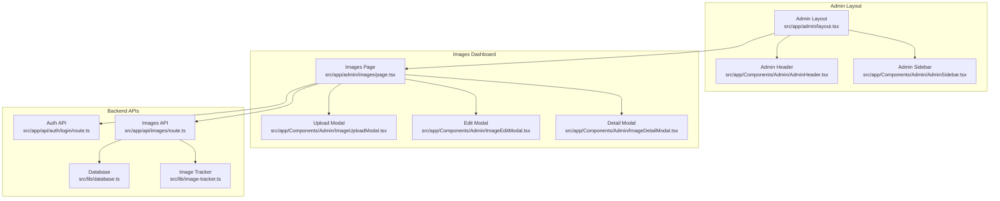
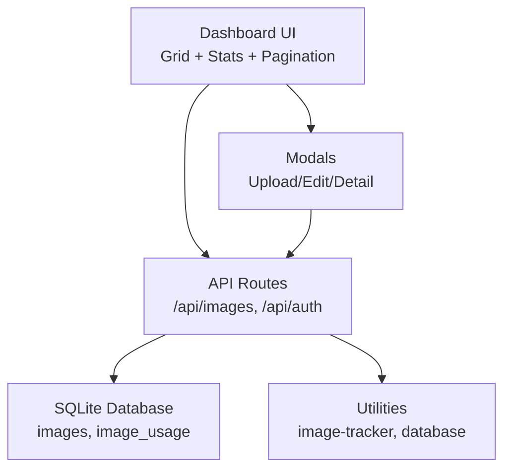
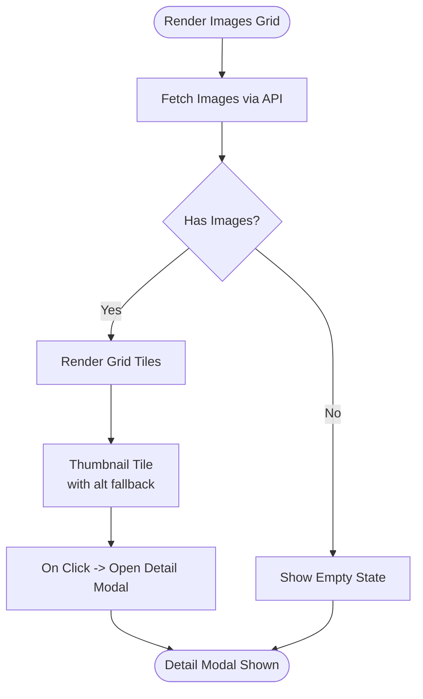
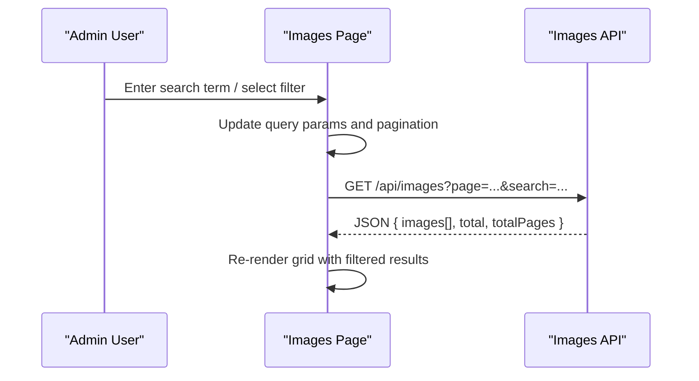
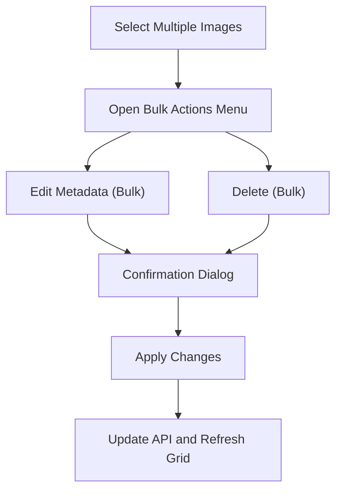
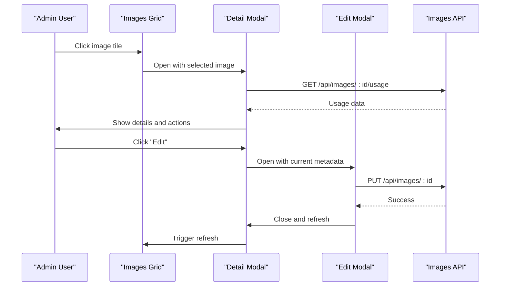
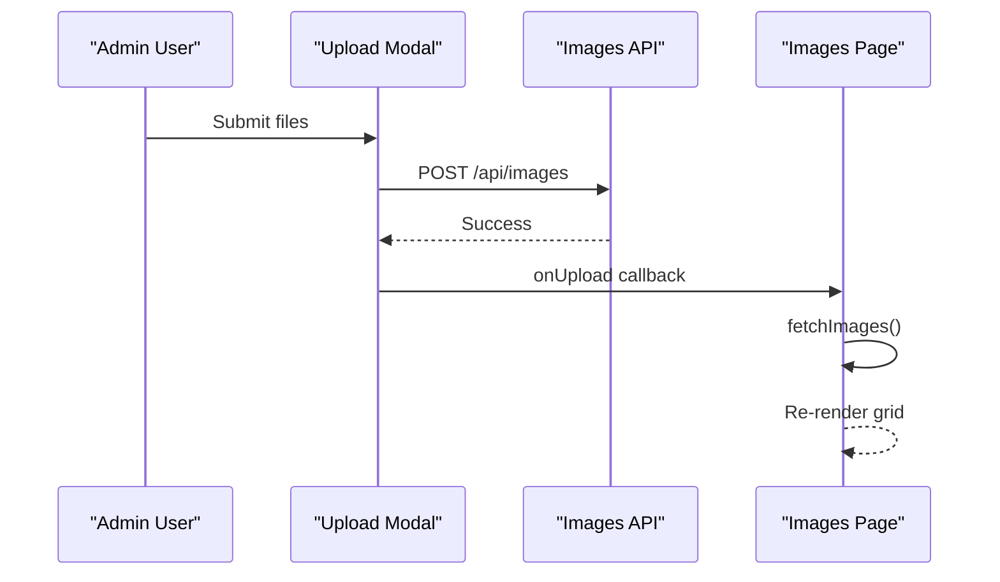
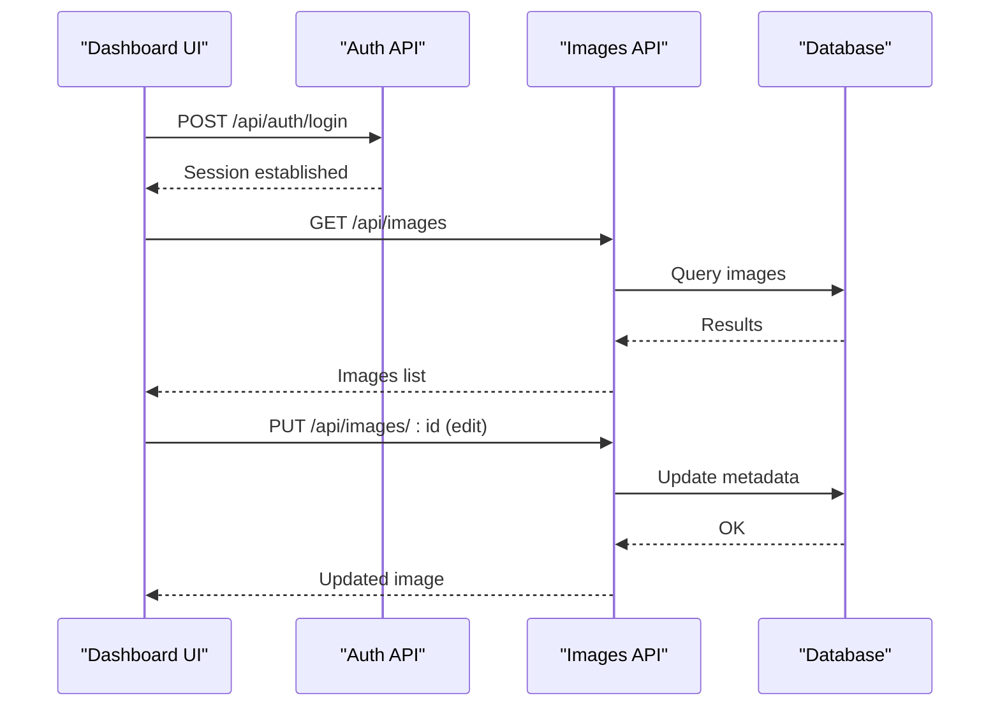
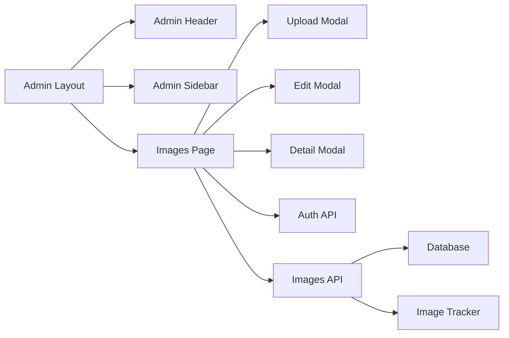

# Admin Image Dashboard

<cite>
**Referenced Files in This Document**
- [PRD_Image_Management_Dashboard.md](file://PRD_Image_Management_Dashboard.md)
- [IMAGE_MANAGEMENT_SETUP.md](file://IMAGE_MANAGEMENT_SETUP.md)
- [src/app/admin/layout.tsx](file://src/app/admin/layout.tsx)
- [src/app/Components/Admin/AdminSidebar.tsx](file://src/app/Components/Admin/AdminSidebar.tsx)
- [src/app/Components/Admin/AdminHeader.tsx](file://src/app/Components/Admin/AdminHeader.tsx)
- [src/app/admin/images/page.tsx](file://src/app/admin/images/page.tsx)
- [src/app/Components/Admin/ImageDetailModal.tsx](file://src/app/Components/Admin/ImageDetailModal.tsx)
- [src/app/Components/Admin/ImageEditModal.tsx](file://src/app/Components/Admin/ImageEditModal.tsx)
- [src/app/Components/Admin/ImageUploadModal.tsx](file://src/app/Components/Admin/ImageUploadModal.tsx)
- [src/lib/image-tracker.ts](file://src/lib/image-tracker.ts)
- [src/lib/database.ts](file://src/lib/database.ts)
- [src/app/api/images/route.ts](file://src/app/api/images/route.ts)
- [src/app/api/auth/login/route.ts](file://src/app/api/auth/login/route.ts)
- [src/lib/auth.ts](file://src/lib/auth.ts)
</cite>

## Table of Contents
1. [Introduction](#introduction)
2. [Project Structure](#project-structure)
3. [Core Components](#core-components)
4. [Architecture Overview](#architecture-overview)
5. [Detailed Component Analysis](#detailed-component-analysis)
6. [Dependency Analysis](#dependency-analysis)
7. [Performance Considerations](#performance-considerations)
8. [Troubleshooting Guide](#troubleshooting-guide)
9. [Conclusion](#conclusion)

## Introduction
This document describes the Admin Image Management Dashboard interface for the AT Tech Global NextJS project. It covers the user interface components, modal dialogs, and interactive features for browsing, editing, and managing images. It explains the grid view implementation, filtering and search capabilities, bulk operations, and the integration between frontend components and backend APIs, including real-time updates and confirmation dialogs. Practical examples demonstrate dashboard navigation, image manipulation workflows, and administrative controls for optimizing the media management experience.

## Project Structure
The admin image dashboard is built with Next.js 14 and TypeScript. The admin layout composes the header, sidebar, and main content area. The images dashboard page renders a statistics panel, a grid of image thumbnails, pagination controls, and modals for upload, edit, and detail views. Backend APIs handle authentication, image CRUD operations, and SEO analysis.

**Diagram sources**
- [src/app/admin/layout.tsx](file://src/app/admin/layout.tsx#L1-L23)
- [src/app/Components/Admin/AdminHeader.tsx](file://src/app/Components/Admin/AdminHeader.tsx#L1-L21)
- [src/app/Components/Admin/AdminSidebar.tsx](file://src/app/Components/Admin/AdminSidebar.tsx#L1-L84)
- [src/app/admin/images/page.tsx](file://src/app/admin/images/page.tsx#L214-L479)
- [src/app/Components/Admin/ImageUploadModal.tsx](file://src/app/Components/Admin/ImageUploadModal.tsx)
- [src/app/Components/Admin/ImageEditModal.tsx](file://src/app/Components/Admin/ImageEditModal.tsx)
- [src/app/Components/Admin/ImageDetailModal.tsx](file://src/app/Components/Admin/ImageDetailModal.tsx)
- [src/app/api/auth/login/route.ts](file://src/app/api/auth/login/route.ts)
- [src/app/api/images/route.ts](file://src/app/api/images/route.ts)
- [src/lib/database.ts](file://src/lib/database.ts)
- [src/lib/image-tracker.ts](file://src/lib/image-tracker.ts)

**Section sources**
- [src/app/admin/layout.tsx](file://src/app/admin/layout.tsx#L1-L23)
- [src/app/Components/Admin/AdminSidebar.tsx](file://src/app/Components/Admin/AdminSidebar.tsx#L1-L84)
- [src/app/Components/Admin/AdminHeader.tsx](file://src/app/Components/Admin/AdminHeader.tsx#L1-L21)
- [src/app/admin/images/page.tsx](file://src/app/admin/images/page.tsx#L214-L479)

## Core Components
- Admin Layout: Provides the global admin shell with header and sidebar.
- Images Dashboard Page: Renders statistics, image grid, pagination, and modals.
- Modals:
  - Upload Modal: Drag-and-drop upload and batch operations.
  - Edit Modal: Inline metadata editing with validation.
  - Detail Modal: Image details, usage tracking, and actions.
- Backend APIs:
  - Authentication: Login endpoint for admin access.
  - Images: CRUD operations, replacement, scanning, and usage lookup.
- Utilities:
  - Database: SQLite-backed persistence for images and usage.
  - Image Tracker: Tracks page usage and context for each image.

**Section sources**
- [src/app/admin/layout.tsx](file://src/app/admin/layout.tsx#L1-L23)
- [src/app/admin/images/page.tsx](file://src/app/admin/images/page.tsx#L214-L479)
- [src/app/Components/Admin/ImageDetailModal.tsx](file://src/app/Components/Admin/ImageDetailModal.tsx)
- [src/app/Components/Admin/ImageEditModal.tsx](file://src/app/Components/Admin/ImageEditModal.tsx)
- [src/app/Components/Admin/ImageUploadModal.tsx](file://src/app/Components/Admin/ImageUploadModal.tsx)
- [src/app/api/auth/login/route.ts](file://src/app/api/auth/login/route.ts)
- [src/app/api/images/route.ts](file://src/app/api/images/route.ts)
- [src/lib/database.ts](file://src/lib/database.ts)
- [src/lib/image-tracker.ts](file://src/lib/image-tracker.ts)

## Architecture Overview
The dashboard follows a layered architecture:
- Presentation Layer: Next.js client components and modals.
- API Layer: Next.js API routes handling requests and delegating to services.
- Data Layer: SQLite database with tables for images and usage.
- Utility Layer: Image tracker and database helpers.

**Diagram sources**
- [src/app/admin/images/page.tsx](file://src/app/admin/images/page.tsx#L214-L479)
- [src/app/Components/Admin/ImageDetailModal.tsx](file://src/app/Components/Admin/ImageDetailModal.tsx)
- [src/app/Components/Admin/ImageEditModal.tsx](file://src/app/Components/Admin/ImageEditModal.tsx)
- [src/app/Components/Admin/ImageUploadModal.tsx](file://src/app/Components/Admin/ImageUploadModal.tsx)
- [src/app/api/images/route.ts](file://src/app/api/images/route.ts)
- [src/app/api/auth/login/route.ts](file://src/app/api/auth/login/route.ts)
- [src/lib/database.ts](file://src/lib/database.ts)
- [src/lib/image-tracker.ts](file://src/lib/image-tracker.ts)

## Detailed Component Analysis

### Grid View Implementation
The images grid displays thumbnails with lazy-loading and fallback placeholders. Each tile shows the original filename and optional title. Clicking a tile opens the detail modal. Pagination controls navigate through pages.

**Diagram sources**
- [src/app/admin/images/page.tsx](file://src/app/admin/images/page.tsx#L334-L434)
- [src/app/Components/Admin/ImageDetailModal.tsx](file://src/app/Components/Admin/ImageDetailModal.tsx)

**Section sources**
- [src/app/admin/images/page.tsx](file://src/app/admin/images/page.tsx#L334-L434)

### Filtering and Search Functionality
The dashboard supports search and filtering through URL parameters and API endpoints. The page component manages pagination state and passes filters to the API. The PRD specifies search by name, title, alt text, and tags.

**Diagram sources**
- [src/app/admin/images/page.tsx](file://src/app/admin/images/page.tsx#L214-L479)
- [src/app/api/images/route.ts](file://src/app/api/images/route.ts)

**Section sources**
- [src/app/admin/images/page.tsx](file://src/app/admin/images/page.tsx#L214-L479)
- [PRD_Image_Management_Dashboard.md](file://PRD_Image_Management_Dashboard.md#L82-L83)

### Bulk Operation Workflows
Bulk operations enable editing multiple images simultaneously. The PRD outlines bulk metadata editing and bulk SEO updates. The UI allows selecting multiple images and applying changes, with confirmation dialogs for destructive actions.

**Diagram sources**
- [PRD_Image_Management_Dashboard.md](file://PRD_Image_Management_Dashboard.md#L81-L82)

**Section sources**
- [PRD_Image_Management_Dashboard.md](file://PRD_Image_Management_Dashboard.md#L81-L82)

### Modal Dialogs and Interactive Features
- Upload Modal: Drag-and-drop upload area, progress indicators, and batch upload support. On success, triggers a refresh of the image list.
- Edit Modal: Inline editing of title, alt text, caption, description, and tags. Validates inputs and updates the backend.
- Detail Modal: Shows large preview, metadata, usage tracking across pages, and action buttons (edit, replace, delete).

**Diagram sources**
- [src/app/admin/images/page.tsx](file://src/app/admin/images/page.tsx#L449-L476)
- [src/app/Components/Admin/ImageDetailModal.tsx](file://src/app/Components/Admin/ImageDetailModal.tsx#L48-L104)
- [src/app/Components/Admin/ImageEditModal.tsx](file://src/app/Components/Admin/ImageEditModal.tsx#L58-L...)
- [src/app/api/images/route.ts](file://src/app/api/images/route.ts)

**Section sources**
- [src/app/admin/images/page.tsx](file://src/app/admin/images/page.tsx#L442-L476)
- [src/app/Components/Admin/ImageDetailModal.tsx](file://src/app/Components/Admin/ImageDetailModal.tsx#L48-L104)
- [src/app/Components/Admin/ImageEditModal.tsx](file://src/app/Components/Admin/ImageEditModal.tsx#L58-L...)

### Real-Time Updates and Confirmation Dialogs
- Real-time updates: After upload, replace, or edit operations, the dashboard refreshes the image list via a callback to re-fetch data.
- Confirmation dialogs: Deletion and bulk operations prompt for confirmation before proceeding to prevent accidental data loss.

**Diagram sources**
- [src/app/admin/images/page.tsx](file://src/app/admin/images/page.tsx#L442-L447)
- [src/app/Components/Admin/ImageUploadModal.tsx](file://src/app/Components/Admin/ImageUploadModal.tsx)

**Section sources**
- [src/app/admin/images/page.tsx](file://src/app/admin/images/page.tsx#L442-L447)

### Integration Between Frontend and Backend APIs
- Authentication: Login endpoint secures access to admin features.
- Image Management: CRUD endpoints, file replacement, scanning, and usage lookup.
- SEO Tools: Endpoints for analysis and optimization recommendations.

**Diagram sources**
- [src/app/api/auth/login/route.ts](file://src/app/api/auth/login/route.ts)
- [src/app/api/images/route.ts](file://src/app/api/images/route.ts)
- [src/lib/database.ts](file://src/lib/database.ts)

**Section sources**
- [src/app/api/auth/login/route.ts](file://src/app/api/auth/login/route.ts)
- [src/app/api/images/route.ts](file://src/app/api/images/route.ts)
- [src/lib/database.ts](file://src/lib/database.ts)

### Practical Examples

#### Dashboard Navigation
- Access the admin login at the configured route, then navigate to the Image Management section from the sidebar.

#### Image Manipulation Workflow
- Upload new images using the upload modal; thumbnails appear immediately after successful upload.
- Click an image tile to open the detail modal, then edit metadata or replace the file.
- Use the SEO Analysis tab to review recommendations and apply bulk optimizations.

#### Administrative Controls
- Use search and filters to locate images quickly.
- Apply bulk edits to update metadata across multiple images.
- Track image usage across pages to maintain consistency and identify unused assets.

**Section sources**
- [IMAGE_MANAGEMENT_SETUP.md](file://IMAGE_MANAGEMENT_SETUP.md#L41-L48)
- [IMAGE_MANAGEMENT_SETUP.md](file://IMAGE_MANAGEMENT_SETUP.md#L57-L85)
- [IMAGE_MANAGEMENT_SETUP.md](file://IMAGE_MANAGEMENT_SETUP.md#L94-L99)

## Dependency Analysis
The dashboard components depend on:
- Admin layout components for navigation and structure.
- Modal components for user interactions.
- API routes for data operations.
- Database utilities for persistence and image tracking.

**Diagram sources**
- [src/app/admin/layout.tsx](file://src/app/admin/layout.tsx#L1-L23)
- [src/app/Components/Admin/AdminHeader.tsx](file://src/app/Components/Admin/AdminHeader.tsx#L1-L21)
- [src/app/Components/Admin/AdminSidebar.tsx](file://src/app/Components/Admin/AdminSidebar.tsx#L1-L84)
- [src/app/admin/images/page.tsx](file://src/app/admin/images/page.tsx#L214-L479)
- [src/app/Components/Admin/ImageUploadModal.tsx](file://src/app/Components/Admin/ImageUploadModal.tsx)
- [src/app/Components/Admin/ImageEditModal.tsx](file://src/app/Components/Admin/ImageEditModal.tsx)
- [src/app/Components/Admin/ImageDetailModal.tsx](file://src/app/Components/Admin/ImageDetailModal.tsx)
- [src/app/api/auth/login/route.ts](file://src/app/api/auth/login/route.ts)
- [src/app/api/images/route.ts](file://src/app/api/images/route.ts)
- [src/lib/database.ts](file://src/lib/database.ts)
- [src/lib/image-tracker.ts](file://src/lib/image-tracker.ts)

**Section sources**
- [src/app/admin/layout.tsx](file://src/app/admin/layout.tsx#L1-L23)
- [src/app/admin/images/page.tsx](file://src/app/admin/images/page.tsx#L214-L479)
- [src/app/api/images/route.ts](file://src/app/api/images/route.ts)
- [src/lib/database.ts](file://src/lib/database.ts)
- [src/lib/image-tracker.ts](file://src/lib/image-tracker.ts)

## Performance Considerations
- Pagination reduces initial load time by limiting returned records.
- Lazy loading and error handling for thumbnails improve perceived performance.
- Compression and format optimization are supported by the tech stack and should be applied during upload/replacement.
- Database queries should be indexed on frequently filtered columns (e.g., title, tags, upload_date).

[No sources needed since this section provides general guidance]

## Troubleshooting Guide
Common issues and resolutions:
- Database not found: Run the database initialization script to create tables.
- Upload failures: Verify file type and size limits; ensure write permissions for storage directories.
- Images not loading: Confirm file paths and permissions; check thumbnail generation.
- SEO scores not updating: Refresh the page after editing metadata.

**Section sources**
- [IMAGE_MANAGEMENT_SETUP.md](file://IMAGE_MANAGEMENT_SETUP.md#L153-L167)

## Conclusion
The Admin Image Management Dashboard provides a comprehensive solution for centralized image administration, with an intuitive grid view, robust filtering and search, modal-driven workflows, and secure backend integration. By leveraging pagination, inline editing, and usage tracking, administrators can efficiently manage assets, optimize SEO, and maintain consistency across the site.