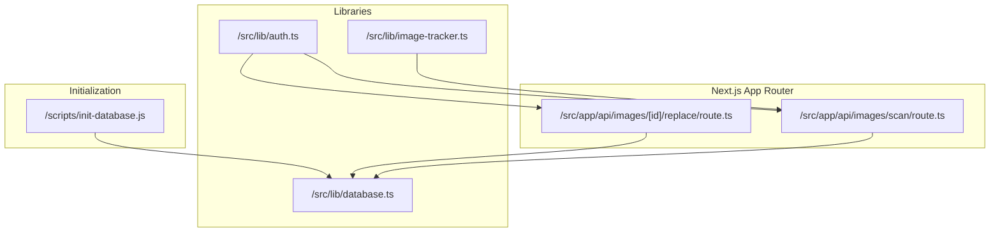
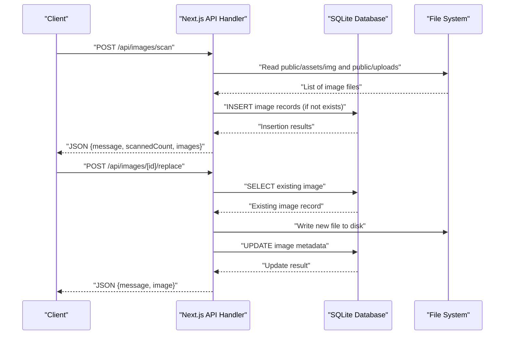
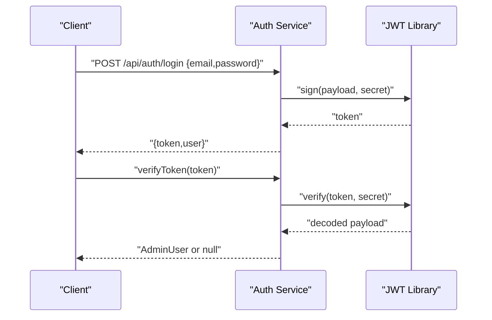
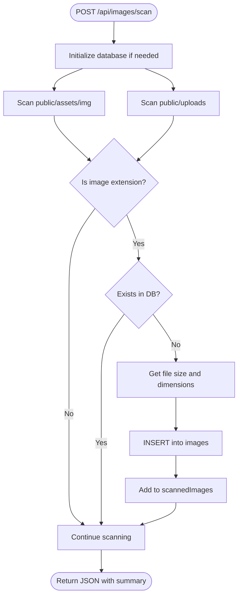
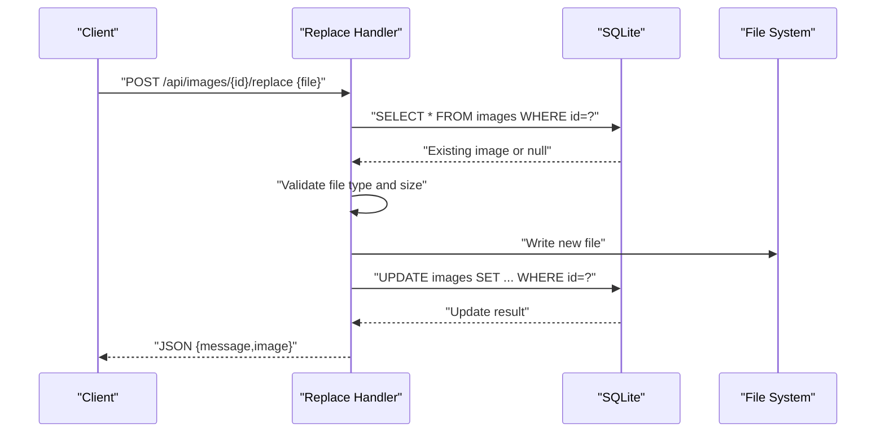
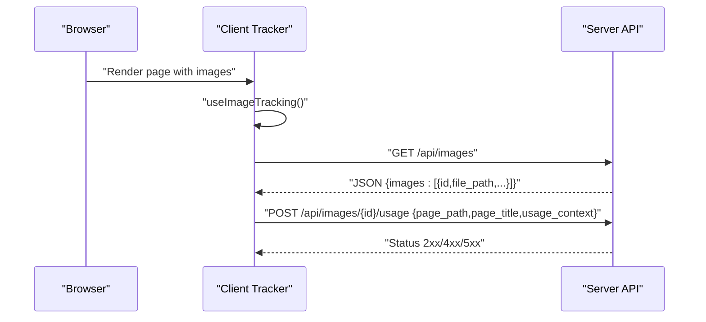
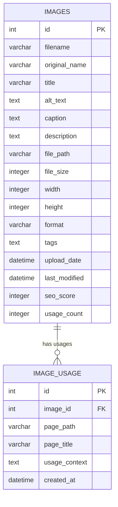
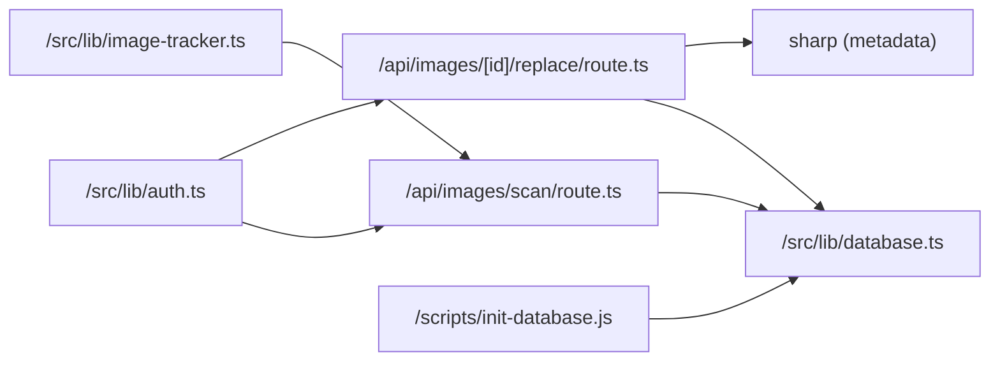

# Image API Endpoints

<cite>
**Referenced Files in This Document**
- [IMAGE_MANAGEMENT_SETUP.md](file://IMAGE_MANAGEMENT_SETUP.md)
- [src/lib/database.ts](file://src/lib/database.ts)
- [src/lib/image-tracker.ts](file://src/lib/image-tracker.ts)
- [src/lib/auth.ts](file://src/lib/auth.ts)
- [src/app/api/images/scan/route.ts](file://src/app/api/images/scan/route.ts)
- [src/app/api/images/[id]/replace/route.ts](file://src/app/api/images/[id]/replace/route.ts)
- [middleware.ts](file://middleware.ts)
- [scripts/init-database.js](file://scripts/init-database.js)
</cite>

## Table of Contents
1. [Introduction](#introduction)
2. [Project Structure](#project-structure)
3. [Core Components](#core-components)
4. [Architecture Overview](#architecture-overview)
5. [Detailed Component Analysis](#detailed-component-analysis)
6. [Dependency Analysis](#dependency-analysis)
7. [Performance Considerations](#performance-considerations)
8. [Troubleshooting Guide](#troubleshooting-guide)
9. [Conclusion](#conclusion)
10. [Appendices](#appendices)

## Introduction
This document provides comprehensive API documentation for image management endpoints. It covers HTTP methods, URL patterns, request/response schemas, authentication requirements, error handling, rate limiting considerations, and security measures. It also includes practical examples for bulk operations, format conversions, optimization workflows, client-side integration, batch processing, and automated image management systems.

## Project Structure
The image management system is built with a Next.js application and a SQLite backend. The API endpoints are located under the Next.js app router structure, while the database schema and initialization logic reside in shared libraries and scripts.

**Diagram sources**
- [src/app/api/images/scan/route.ts](file://src/app/api/images/scan/route.ts#L1-L124)
- [src/app/api/images/[id]/replace/route.ts](file://src/app/api/images/[id]/replace/route.ts#L1-L124)
- [src/lib/database.ts](file://src/lib/database.ts#L1-L255)
- [src/lib/auth.ts](file://src/lib/auth.ts#L1-L85)
- [src/lib/image-tracker.ts](file://src/lib/image-tracker.ts#L1-L95)
- [scripts/init-database.js](file://scripts/init-database.js#L1-L120)

**Section sources**
- [IMAGE_MANAGEMENT_SETUP.md](file://IMAGE_MANAGEMENT_SETUP.md#L101-L114)
- [src/lib/database.ts](file://src/lib/database.ts#L100-L184)
- [scripts/init-database.js](file://scripts/init-database.js#L39-L92)

## Core Components
- Database abstraction and schema: Provides typed interfaces for images and usage records, along with helper functions for queries and migrations.
- Authentication: Admin login and token verification for protected endpoints.
- Image scanning: Scans public asset directories and populates the database with discovered images.
- Image replacement: Replaces an existing image file while preserving metadata.
- Image usage tracking: Tracks where images are used across pages for maintenance and analytics.

Key responsibilities:
- Enforce authentication and authorization for all image management operations.
- Validate file types and sizes during uploads and replacements.
- Maintain SEO metadata and usage analytics.
- Provide bulk operations via scanning and batch-compatible workflows.

**Section sources**
- [src/lib/database.ts](file://src/lib/database.ts#L18-L81)
- [src/lib/auth.ts](file://src/lib/auth.ts#L5-L84)
- [src/app/api/images/scan/route.ts](file://src/app/api/images/scan/route.ts#L16-L124)
- [src/app/api/images/[id]/replace/route.ts](file://src/app/api/images/[id]/replace/route.ts#L16-L124)
- [src/lib/image-tracker.ts](file://src/lib/image-tracker.ts#L11-L94)

## Architecture Overview
The API follows a layered architecture:
- Presentation layer: Next.js App Router handlers for each endpoint.
- Domain layer: Business logic for scanning, replacing, and usage tracking.
- Persistence layer: SQLite-backed database with typed interfaces and helpers.
- Shared utilities: Authentication, image metadata extraction, and initialization scripts.

**Diagram sources**
- [src/app/api/images/scan/route.ts](file://src/app/api/images/scan/route.ts#L17-L124)
- [src/app/api/images/[id]/replace/route.ts](file://src/app/api/images/[id]/replace/route.ts#L17-L124)
- [src/lib/database.ts](file://src/lib/database.ts#L214-L254)

## Detailed Component Analysis

### Authentication and Authorization
- Purpose: Protect all image management endpoints with admin credentials and JWT tokens.
- Mechanism:
  - Admin login generates a signed JWT with a configurable expiration.
  - Token verification decodes the payload and validates the signature.
  - Protected endpoints rely on the presence of a valid bearer token.
- Security considerations:
  - Store JWT secret in environment variables.
  - Enforce HTTPS in production.
  - Limit token lifetime and refresh tokens as needed.

**Diagram sources**
- [src/lib/auth.ts](file://src/lib/auth.ts#L34-L79)

**Section sources**
- [src/lib/auth.ts](file://src/lib/auth.ts#L5-L84)

### Image Scanning Endpoint
- Method and URL: POST /api/images/scan
- Purpose: Recursively scan public asset directories and add missing images to the database.
- Request: No body required.
- Response:
  - message: Confirmation message.
  - scannedCount: Number of images added.
  - images: Array of newly added images with id, filename, path, size, and dimensions.
- Behavior:
  - Scans public/assets/img and public/uploads.
  - Skips duplicates by checking file_path.
  - Computes file size and dimensions (non-SVG).
  - Inserts records with default SEO score and zero usage count.
- Error handling:
  - Returns 500 on internal errors.

**Diagram sources**
- [src/app/api/images/scan/route.ts](file://src/app/api/images/scan/route.ts#L17-L124)

**Section sources**
- [src/app/api/images/scan/route.ts](file://src/app/api/images/scan/route.ts#L16-L124)
- [src/lib/database.ts](file://src/lib/database.ts#L100-L184)

### Image Replacement Endpoint
- Method and URL: POST /api/images/[id]/replace
- Purpose: Replace an existing image file while preserving metadata.
- Path parameters:
  - id: Numeric image identifier.
- Request:
  - Form data with key "file" containing the new image.
- Response:
  - message: Success confirmation.
  - image: Updated image record.
- Validation:
  - Rejects invalid id.
  - Rejects missing file.
  - Validates file type against allowed extensions.
  - Rejects oversized files (enforced by server-side checks).
- Behavior:
  - Writes new file to disk.
  - Computes dimensions for non-SVG images.
  - Updates filename, original_name, file_path, file_size, width, height, format, and last_modified.
- Error handling:
  - Returns 400 for bad requests.
  - Returns 404 if image not found.
  - Returns 500 on internal errors.

**Diagram sources**
- [src/app/api/images/[id]/replace/route.ts](file://src/app/api/images/[id]/replace/route.ts#L17-L124)

**Section sources**
- [src/app/api/images/[id]/replace/route.ts](file://src/app/api/images/[id]/replace/route.ts#L16-L124)
- [src/lib/database.ts](file://src/lib/database.ts#L214-L254)

### Image Usage Tracking
- Purpose: Track where images are used across pages for maintenance and analytics.
- Client-side usage:
  - scanPageForImages detects images on a page and triggers usage recording.
  - useImageTracking sets a delayed scan after page load.
  - ImageTracker is a component wrapper to automate tracking.
- Server-side integration:
  - The client-side tracker calls GET /api/images to locate an image by file_path.
  - On success, it posts usage via POST /api/images/{id}/usage with page_path, page_title, and usage_context.
- Notes:
  - The usage endpoint is referenced in client-side code but not implemented in the provided server-side files.
  - Ensure the usage endpoint is implemented to avoid runtime warnings.

**Diagram sources**
- [src/lib/image-tracker.ts](file://src/lib/image-tracker.ts#L11-L43)

**Section sources**
- [src/lib/image-tracker.ts](file://src/lib/image-tracker.ts#L11-L94)

### Database Schema
- Images table:
  - Columns include identifiers, filenames, SEO metadata, file attributes, timestamps, and counts.
  - Primary key: id.
- Image usage table:
  - Links usage records to images via foreign key image_id.
  - Includes page path, title, usage context, and timestamps.
- Initialization:
  - Tables are created on first request or via the initialization script.

**Diagram sources**
- [src/lib/database.ts](file://src/lib/database.ts#L105-L139)
- [src/lib/database.ts](file://src/lib/database.ts#L141-L181)

**Section sources**
- [src/lib/database.ts](file://src/lib/database.ts#L100-L184)
- [scripts/init-database.js](file://scripts/init-database.js#L39-L92)

## Dependency Analysis
- Endpoint dependencies:
  - Both endpoints depend on database initialization and helpers.
  - Replace endpoint additionally depends on file system writes and image metadata extraction.
- External dependencies:
  - sharp for image metadata extraction.
  - sqlite3 for database operations.
  - bcrypt and jsonwebtoken for authentication.
- Middleware:
  - The Next.js middleware is configured for admin routes but is currently disabled for static hosting scenarios.

**Diagram sources**
- [src/app/api/images/scan/route.ts](file://src/app/api/images/scan/route.ts#L1-L14)
- [src/app/api/images/[id]/replace/route.ts](file://src/app/api/images/[id]/replace/route.ts#L1-L14)
- [src/lib/database.ts](file://src/lib/database.ts#L1-L13)
- [src/lib/auth.ts](file://src/lib/auth.ts#L1-L2)
- [src/lib/image-tracker.ts](file://src/lib/image-tracker.ts#L1-L1)
- [scripts/init-database.js](file://scripts/init-database.js#L1-L3)

**Section sources**
- [src/app/api/images/scan/route.ts](file://src/app/api/images/scan/route.ts#L1-L14)
- [src/app/api/images/[id]/replace/route.ts](file://src/app/api/images/[id]/replace/route.ts#L1-L14)
- [src/lib/auth.ts](file://src/lib/auth.ts#L1-L2)
- [src/lib/image-tracker.ts](file://src/lib/image-tracker.ts#L1-L1)
- [scripts/init-database.js](file://scripts/init-database.js#L1-L3)

## Performance Considerations
- Image scanning:
  - Scanning large directories can be I/O intensive. Consider batching scans or scheduling them during low traffic.
  - Non-SVG dimension extraction adds CPU overhead; cache results when feasible.
- Replacement operations:
  - Writing large files to disk and computing metadata can block the event loop. Offload heavy work to background jobs if scaling.
- Database operations:
  - Use transactions for bulk inserts during scanning to reduce write amplification.
  - Index file_path for faster lookups when tracking usage.
- Caching:
  - Cache frequently accessed image metadata to reduce repeated reads.
- CDN and optimization:
  - Integrate a CDN and image optimization pipeline for production deployments.

[No sources needed since this section provides general guidance]

## Troubleshooting Guide
Common issues and resolutions:
- Database not initialized:
  - Run the initialization script to create tables.
- Upload/replace failures:
  - Verify file type and size constraints.
  - Ensure write permissions for the uploads directory.
- Images not appearing:
  - Trigger a scan to populate missing entries.
- Authentication errors:
  - Confirm JWT secret configuration and token validity.
- Usage tracking not recorded:
  - Implement the missing usage endpoint or handle client-side warnings gracefully.

**Section sources**
- [IMAGE_MANAGEMENT_SETUP.md](file://IMAGE_MANAGEMENT_SETUP.md#L153-L167)
- [scripts/init-database.js](file://scripts/init-database.js#L94-L117)

## Conclusion
The image management API provides essential endpoints for scanning, replacing, and tracking images. Combined with authentication, database abstractions, and usage tracking utilities, it supports robust image workflows. For production, implement the missing usage endpoint, enforce stricter rate limiting, and integrate CDN and optimization pipelines.

[No sources needed since this section summarizes without analyzing specific files]

## Appendices

### API Reference Summary
- POST /api/images/scan
  - Description: Scan public asset directories and add missing images to the database.
  - Authentication: Required.
  - Response: {message, scannedCount, images}.
- POST /api/images/[id]/replace
  - Description: Replace an existing image file while preserving metadata.
  - Authentication: Required.
  - Request form data: file.
  - Response: {message, image}.

**Section sources**
- [IMAGE_MANAGEMENT_SETUP.md](file://IMAGE_MANAGEMENT_SETUP.md#L101-L114)
- [src/app/api/images/scan/route.ts](file://src/app/api/images/scan/route.ts#L16-L124)
- [src/app/api/images/[id]/replace/route.ts](file://src/app/api/images/[id]/replace/route.ts#L16-L124)

### Example Workflows

- Bulk image ingestion:
  - Step 1: Authenticate and obtain a token.
  - Step 2: Call POST /api/images/scan to index existing images.
  - Step 3: Iterate over results and enrich metadata via update operations.
- Format conversion and optimization:
  - Step 1: Replace target images using POST /api/images/[id]/replace with optimized files.
  - Step 2: Update SEO metadata and tags accordingly.
- Automated maintenance:
  - Step 1: Schedule periodic scans to detect new images.
  - Step 2: Monitor usage counts and remove unused images.
  - Step 3: Generate reports on SEO scores and recommendations.

[No sources needed since this section provides general guidance]

### Security and Rate Limiting
- Authentication:
  - Use admin login to obtain a short-lived JWT; verify tokens on all protected endpoints.
- File validation:
  - Restrict allowed image formats and enforce maximum file size.
- Rate limiting:
  - Apply per-endpoint rate limits (e.g., 100 requests per hour per IP) to prevent abuse.
- Transport security:
  - Enforce HTTPS and secure cookies for token storage.

**Section sources**
- [IMAGE_MANAGEMENT_SETUP.md](file://IMAGE_MANAGEMENT_SETUP.md#L145-L151)
- [src/lib/auth.ts](file://src/lib/auth.ts#L34-L79)

### Client Integration Examples
- Frontend integration:
  - Use fetch with Authorization header for protected endpoints.
  - Implement retry logic and graceful error handling.
- Batch processing:
  - Queue replacement tasks and poll completion status.
- Automated systems:
  - Build CLI tools to trigger scans and replacements based on CI/CD events.

[No sources needed since this section provides general guidance]