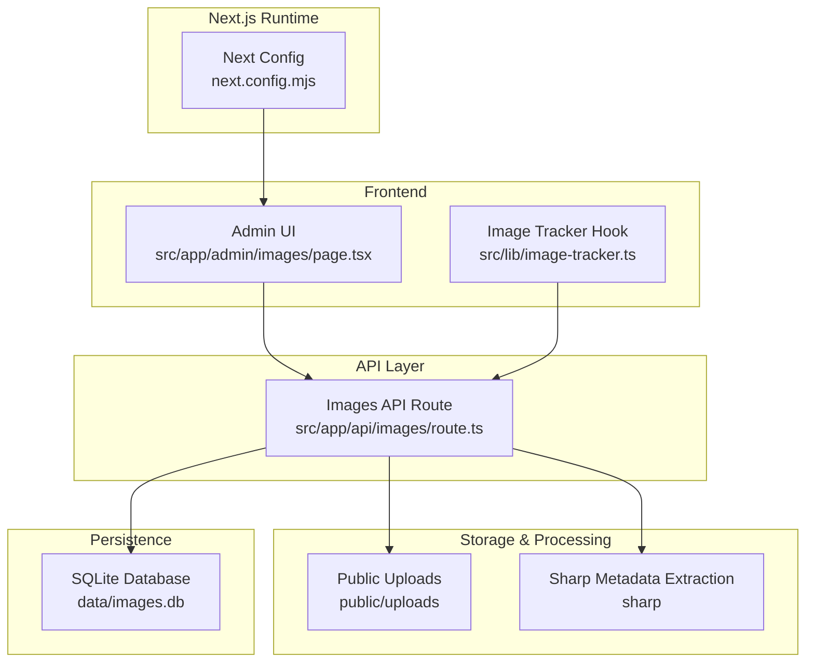
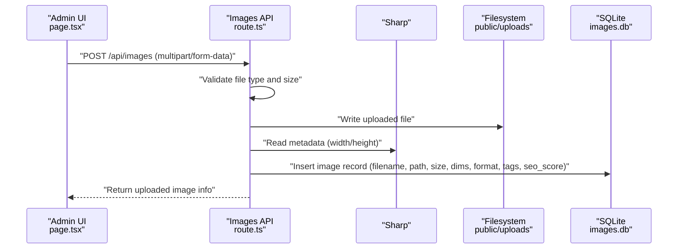
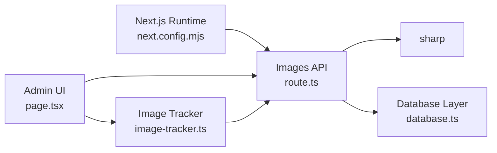

# Image Processing Pipeline

<cite>
**Referenced Files in This Document**
- [package.json](file://package.json)
- [next.config.mjs](file://next.config.mjs)
- [src/app/api/images/route.ts](file://src/app/api/images/route.ts)
- [src/lib/database.ts](file://src/lib/database.ts)
- [src/lib/image-tracker.ts](file://src/lib/image-tracker.ts)
- [src/app/admin/images/page.tsx](file://src/app/admin/images/page.tsx)
</cite>

## Table of Contents
1. [Introduction](#introduction)
2. [Project Structure](#project-structure)
3. [Core Components](#core-components)
4. [Architecture Overview](#architecture-overview)
5. [Detailed Component Analysis](#detailed-component-analysis)
6. [Dependency Analysis](#dependency-analysis)
7. [Performance Considerations](#performance-considerations)
8. [Troubleshooting Guide](#troubleshooting-guide)
9. [Conclusion](#conclusion)
10. [Appendices](#appendices)

## Introduction
This document describes the image processing pipeline for the website, focusing on Sharp-based image optimization and format conversion integrated with Next.js. It covers the complete workflow from image upload through metadata extraction, optimization, responsive image generation, and storage, including database integration for metadata and usage tracking. Practical configuration examples, performance considerations, and optimization techniques are included to ensure fast loading times and reduced bandwidth consumption.

## Project Structure
The image pipeline spans several layers:
- Frontend administration UI for managing images and viewing SEO metrics
- API routes for CRUD operations, image scanning, and usage tracking
- Database layer for persisting image metadata and usage records
- Next.js configuration enabling optimized image formats and responsive image generation
- Sharp integration for metadata extraction and format conversion

**Diagram sources**
- [src/app/admin/images/page.tsx](file://src/app/admin/images/page.tsx#L36-L480)
- [src/lib/image-tracker.ts](file://src/lib/image-tracker.ts#L1-L95)
- [src/app/api/images/route.ts](file://src/app/api/images/route.ts#L1-L182)
- [next.config.mjs](file://next.config.mjs#L10-L112)

**Section sources**
- [src/app/admin/images/page.tsx](file://src/app/admin/images/page.tsx#L36-L480)
- [src/lib/image-tracker.ts](file://src/lib/image-tracker.ts#L1-L95)
- [src/app/api/images/route.ts](file://src/app/api/images/route.ts#L1-L182)
- [next.config.mjs](file://next.config.mjs#L10-L112)

## Core Components
- Next.js image optimization and responsive generation
- Sharp-based metadata extraction and format conversion
- SQLite-backed image metadata and usage tracking
- Admin UI for upload, editing, scanning, and SEO dashboard
- Image usage tracker for cross-page attribution

Key capabilities:
- Upload validation (type and size)
- Metadata extraction (dimensions) for raster images
- SEO scoring based on presence of title, alt text, caption, description, and tags
- Responsive image formats (WebP, AVIF) and device size variants
- Usage tracking per page and context

**Section sources**
- [package.json](file://package.json#L28-L28)
- [next.config.mjs](file://next.config.mjs#L10-L112)
- [src/app/api/images/route.ts](file://src/app/api/images/route.ts#L78-L182)
- [src/lib/database.ts](file://src/lib/database.ts#L18-L81)
- [src/lib/image-tracker.ts](file://src/lib/image-tracker.ts#L11-L43)

## Architecture Overview
The pipeline integrates frontend, backend, and persistence:

**Diagram sources**
- [src/app/admin/images/page.tsx](file://src/app/admin/images/page.tsx#L147-L165)
- [src/app/api/images/route.ts](file://src/app/api/images/route.ts#L78-L182)
- [src/lib/database.ts](file://src/lib/database.ts#L106-L126)

## Detailed Component Analysis

### Next.js Image Optimization and Responsive Generation
- Formats enabled: WebP and AVIF
- Device sizes configured for responsive variants
- Image sizes for pre-rendered thumbnails
- Unoptimized mode for static export builds
- Domains and remote patterns for external images
- Security policy for embedded SVG and sandboxing

Practical implications:
- Automatic format selection based on browser support
- Automatic device-size selection via Next’s image component
- Reduced bandwidth via modern formats and appropriate sizes

**Section sources**
- [next.config.mjs](file://next.config.mjs#L10-L112)

### Sharp-Based Metadata Extraction and Format Conversion
- Metadata extraction: width and height for raster images
- Format preservation: original MIME type stored
- No explicit compression quality setting in the upload route
- Conversion to modern formats handled by Next.js image optimizer

Recommendations:
- Introduce configurable quality and format transforms for JPEG/PNG/WebP
- Consider AVIF for lossless or high-quality scenarios
- Implement batch optimization for existing images

**Section sources**
- [src/app/api/images/route.ts](file://src/app/api/images/route.ts#L124-L136)
- [package.json](file://package.json#L28-L28)

### Database Schema and Metadata Storage
Tables:
- images: stores filename, original_name, title, alt_text, caption, description, file_path, file_size, width, height, format, tags, timestamps, seo_score, usage_count
- image_usage: tracks page_path, page_title, usage_context, and foreign-key linkage to images
- blogs and page_metadata: unrelated to image processing but part of the site’s persistence layer

Key fields and relationships:
- Primary keys and auto-increment ids
- Foreign key constraint from image_usage.image_id to images.id
- Timestamps for upload and modification
- SEO score computed on ingestion

**Section sources**
- [src/lib/database.ts](file://src/lib/database.ts#L106-L181)

### Admin UI and Workflows
- Listing and paginated search across images
- Sorting by upload date, filename, file size, SEO score, and usage count
- Edit/delete operations
- Upload modal integration
- SEO dashboard tab
- “Scan Existing Images” to trigger server-side scanning endpoint

**Section sources**
- [src/app/admin/images/page.tsx](file://src/app/admin/images/page.tsx#L36-L480)

### Image Usage Tracking
- Client-side scanning of DOM for images under the current origin
- Post to usage endpoint with page path, title, and context
- Tracks usage counts per image

Note: The usage tracking relies on a usage endpoint that is not present in the provided routes. Ensure the endpoint exists to persist usage records.

**Section sources**
- [src/lib/image-tracker.ts](file://src/lib/image-tracker.ts#L11-L43)
- [src/lib/image-tracker.ts](file://src/lib/image-tracker.ts#L46-L80)

### API Route: Upload and Metadata Extraction
Responsibilities:
- Validate multipart form data
- Validate file type and size
- Persist file to public/uploads
- Extract metadata via Sharp for non-SVG images
- Compute SEO score based on provided metadata fields
- Insert record into images table
- Return uploaded image details

Optimization opportunities:
- Add compression quality and format transform options
- Batch process existing images for optimization
- Add asynchronous processing for large files

**Section sources**
- [src/app/api/images/route.ts](file://src/app/api/images/route.ts#L78-L182)

## Dependency Analysis
External dependencies and integrations:
- sharp for metadata extraction
- sqlite3 for local database persistence
- Next.js image optimization and loader

**Diagram sources**
- [package.json](file://package.json#L28-L30)
- [next.config.mjs](file://next.config.mjs#L10-L112)
- [src/app/api/images/route.ts](file://src/app/api/images/route.ts#L1-L182)
- [src/lib/database.ts](file://src/lib/database.ts#L1-L255)
- [src/lib/image-tracker.ts](file://src/lib/image-tracker.ts#L1-L95)
- [src/app/admin/images/page.tsx](file://src/app/admin/images/page.tsx#L36-L480)

**Section sources**
- [package.json](file://package.json#L28-L30)
- [src/app/api/images/route.ts](file://src/app/api/images/route.ts#L1-L182)
- [src/lib/database.ts](file://src/lib/database.ts#L1-L255)
- [src/lib/image-tracker.ts](file://src/lib/image-tracker.ts#L1-L95)
- [next.config.mjs](file://next.config.mjs#L10-L112)

## Performance Considerations
- Modern formats: WebP and AVIF reduce payload sizes compared to legacy JPEG/PNG
- Responsive variants: deviceSizes and imageSizes minimize over-fetching
- Compression defaults: Next.js image optimizer applies sensible defaults; consider tuning quality for JPEG/PNG/WebP
- Metadata extraction: Sharp adds minimal overhead; avoid repeated extractions by caching
- CDN and caching: leverage remotePatterns and minimumCacheTTL for efficient delivery
- Asynchronous processing: defer heavy operations (batch optimization) to background jobs
- Storage: keep uploads organized and prune unused assets periodically

[No sources needed since this section provides general guidance]

## Troubleshooting Guide
Common issues and resolutions:
- Upload fails with invalid file type or size:
  - Verify allowed types and size limits in the upload route
  - Ensure client-side validation aligns with server-side checks
- Metadata missing (width/height):
  - Confirm file is not SVG; Sharp metadata extraction is skipped for SVG
  - Check filesystem permissions for public/uploads
- SEO score not updating:
  - Ensure title, alt_text, caption, description, and tags are provided during upload
- Usage tracking not recorded:
  - Confirm the usage endpoint exists and is reachable
  - Verify client-side scanning runs after images are loaded
- Database errors:
  - Ensure initDatabase is called before queries
  - Check table creation and foreign key constraints

**Section sources**
- [src/app/api/images/route.ts](file://src/app/api/images/route.ts#L95-L103)
- [src/app/api/images/route.ts](file://src/app/api/images/route.ts#L124-L136)
- [src/lib/image-tracker.ts](file://src/lib/image-tracker.ts#L11-L43)
- [src/lib/database.ts](file://src/lib/database.ts#L84-L97)
- [src/lib/database.ts](file://src/lib/database.ts#L106-L181)

## Conclusion
The image processing pipeline leverages Next.js image optimization, Sharp metadata extraction, and a SQLite-backed persistence model to deliver a robust solution for image management, SEO, and performance. By integrating responsive formats, device-specific variants, and usage tracking, the system supports fast-loading, accessible, and maintainable imagery across the site. Extending the pipeline with configurable compression, batch optimization, and asynchronous processing will further improve throughput and user experience.

[No sources needed since this section summarizes without analyzing specific files]

## Appendices

### Configuration Reference
- Next.js image formats: WebP and AVIF
- Device sizes: 640, 750, 828, 1080, 1200, 1920, 2048, 3840
- Thumbnail sizes: 16, 32, 48, 64, 96, 128, 256, 384
- Remote domains and patterns for external images
- Minimum cache TTL and content security policy for images

**Section sources**
- [next.config.mjs](file://next.config.mjs#L10-L112)

### Upload Workflow Details
- Allowed types: JPEG, JPG, PNG, GIF, WebP, SVG
- Max file size: 10 MB
- Filename generation: timestamp + random suffix
- Metadata extraction: width and height for raster images
- SEO score calculation: weighted sum of provided metadata fields

**Section sources**
- [src/app/api/images/route.ts](file://src/app/api/images/route.ts#L95-L103)
- [src/app/api/images/route.ts](file://src/app/api/images/route.ts#L105-L123)
- [src/app/api/images/route.ts](file://src/app/api/images/route.ts#L124-L145)

### Usage Tracking Flow
- Client scans images on page load
- Matches images by file_path against stored images
- Posts usage record with page_path, page_title, and usage_context

**Section sources**
- [src/lib/image-tracker.ts](file://src/lib/image-tracker.ts#L46-L80)