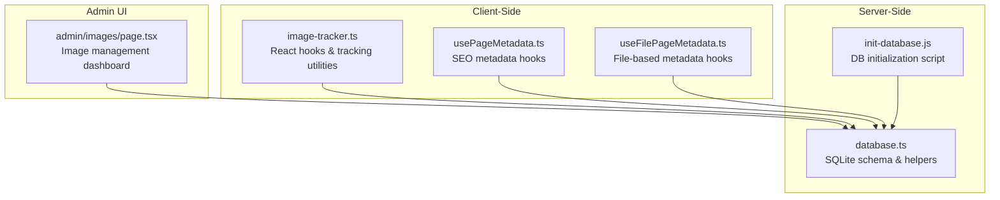
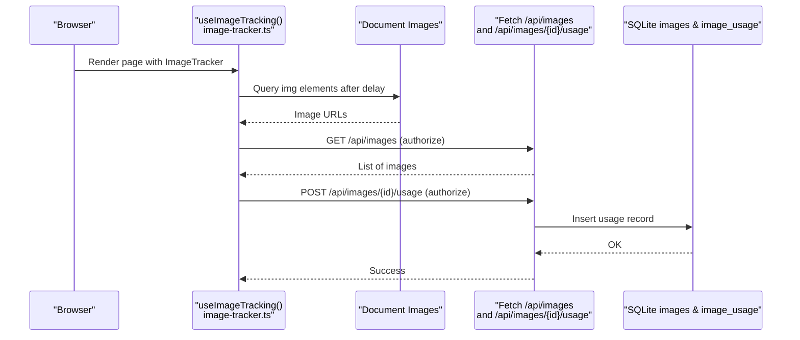
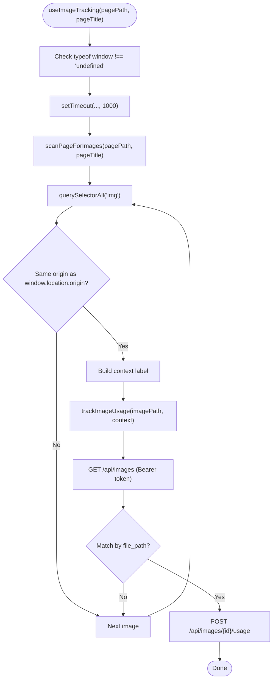
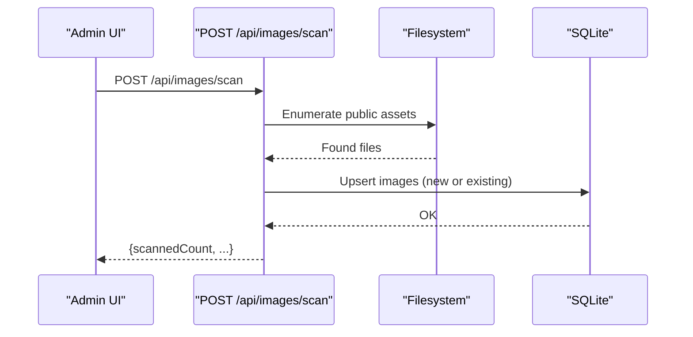
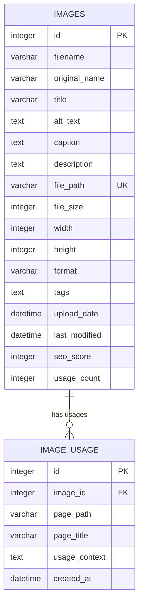
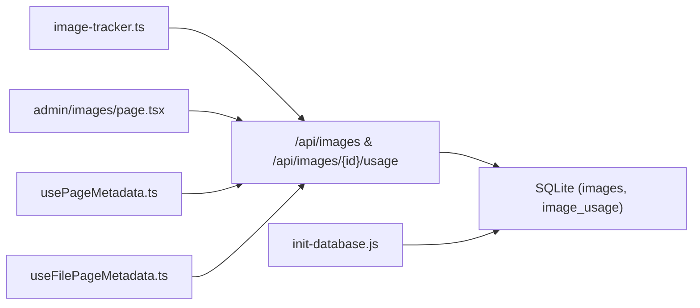

# Image Tracking System

<cite>
**Referenced Files in This Document**
- [image-tracker.ts](file://src/lib/image-tracker.ts)
- [database.ts](file://src/lib/database.ts)
- [page.tsx](file://src/app/admin/images/page.tsx)
- [init-database.js](file://scripts/init-database.js)
- [usePageMetadata.ts](file://src/hooks/usePageMetadata.ts)
- [useFilePageMetadata.ts](file://src/hooks/useFilePageMetadata.ts)
</cite>

## Table of Contents
1. [Introduction](#introduction)
2. [Project Structure](#project-structure)
3. [Core Components](#core-components)
4. [Architecture Overview](#architecture-overview)
5. [Detailed Component Analysis](#detailed-component-analysis)
6. [Dependency Analysis](#dependency-analysis)
7. [Performance Considerations](#performance-considerations)
8. [Troubleshooting Guide](#troubleshooting-guide)
9. [Conclusion](#conclusion)
10. [Appendices](#appendices)

## Introduction
This document describes the image tracking system that monitors image usage across pages and contexts. It explains how automatic tracking is implemented via React hooks, how manual tracking APIs work, and how batch processing capabilities operate. It also documents the database schema for usage records, query optimization strategies, cleanup processes for orphaned images, and integration with the content management system for dependency resolution.

## Project Structure
The image tracking system spans client-side React utilities, server-side database initialization, and administrative UI for reporting and management.

**Diagram sources**
- [image-tracker.ts](file://src/lib/image-tracker.ts#L1-L95)
- [database.ts](file://src/lib/database.ts#L1-L255)
- [page.tsx](file://src/app/admin/images/page.tsx#L1-L480)
- [init-database.js](file://scripts/init-database.js#L1-L120)
- [usePageMetadata.ts](file://src/hooks/usePageMetadata.ts#L1-L218)
- [useFilePageMetadata.ts](file://src/hooks/useFilePageMetadata.ts#L1-L225)

**Section sources**
- [image-tracker.ts](file://src/lib/image-tracker.ts#L1-L95)
- [database.ts](file://src/lib/database.ts#L1-L255)
- [page.tsx](file://src/app/admin/images/page.tsx#L1-L480)
- [init-database.js](file://scripts/init-database.js#L1-L120)
- [usePageMetadata.ts](file://src/hooks/usePageMetadata.ts#L1-L218)
- [useFilePageMetadata.ts](file://src/hooks/useFilePageMetadata.ts#L1-L225)

## Core Components
- Image tracking utilities: Automatic discovery and usage registration of images on pages.
- Database schema: Persistent storage for images and usage records with foreign key relationships.
- Admin dashboard: Listing, filtering, and scanning images; viewing usage statistics.
- Metadata hooks: Client-side utilities to fetch and manage page metadata for SEO.

Key implementation references:
- Automatic tracking and React integration: [image-tracker.ts](file://src/lib/image-tracker.ts#L67-L95)
- Database schema and helpers: [database.ts](file://src/lib/database.ts#L100-L184)
- Admin image management: [page.tsx](file://src/app/admin/images/page.tsx#L36-L165)
- Initialization script: [init-database.js](file://scripts/init-database.js#L14-L92)
- Metadata hooks: [usePageMetadata.ts](file://src/hooks/usePageMetadata.ts#L13-L52), [useFilePageMetadata.ts](file://src/hooks/useFilePageMetadata.ts#L13-L52)

**Section sources**
- [image-tracker.ts](file://src/lib/image-tracker.ts#L1-L95)
- [database.ts](file://src/lib/database.ts#L100-L184)
- [page.tsx](file://src/app/admin/images/page.tsx#L36-L165)
- [init-database.js](file://scripts/init-database.js#L14-L92)
- [usePageMetadata.ts](file://src/hooks/usePageMetadata.ts#L13-L52)
- [useFilePageMetadata.ts](file://src/hooks/useFilePageMetadata.ts#L13-L52)

## Architecture Overview
The system integrates client-side automatic tracking with server-side persistence and an admin dashboard for reporting.

**Diagram sources**
- [image-tracker.ts](file://src/lib/image-tracker.ts#L46-L80)
- [image-tracker.ts](file://src/lib/image-tracker.ts#L11-L43)

## Detailed Component Analysis

### Automatic Image Tracking via React Hooks
The system provides a React hook and a component wrapper to automatically detect images on a page and register their usage with context.

**Diagram sources**
- [image-tracker.ts](file://src/lib/image-tracker.ts#L46-L80)
- [image-tracker.ts](file://src/lib/image-tracker.ts#L11-L43)

Implementation highlights:
- Delayed execution to ensure images are loaded before scanning.
- Origin filtering to avoid tracking external images.
- Authorization via admin token stored in localStorage for API calls.

**Section sources**
- [image-tracker.ts](file://src/lib/image-tracker.ts#L46-L80)
- [image-tracker.ts](file://src/lib/image-tracker.ts#L11-L43)

### Manual Tracking API
Manual tracking is performed by posting usage records to a per-image endpoint. The client-side tracker encapsulates this behavior.

Key references:
- Usage registration endpoint: [image-tracker.ts](file://src/lib/image-tracker.ts#L28-L39)
- Image lookup endpoint: [image-tracker.ts](file://src/lib/image-tracker.ts#L14-L23)

**Section sources**
- [image-tracker.ts](file://src/lib/image-tracker.ts#L11-L43)
- [image-tracker.ts](file://src/lib/image-tracker.ts#L28-L39)

### Batch Processing Capabilities
The admin dashboard supports scanning existing images to populate the database and trigger initial usage discovery.

**Diagram sources**
- [page.tsx](file://src/app/admin/images/page.tsx#L146-L165)

Operational notes:
- Scanning triggers filesystem enumeration and database upserts.
- After scanning, the UI refreshes to reflect new images.

**Section sources**
- [page.tsx](file://src/app/admin/images/page.tsx#L146-L165)

### Database Schema for Usage Records
The schema defines tables for images and their usage contexts, with foreign key relationships.

**Diagram sources**
- [database.ts](file://src/lib/database.ts#L106-L139)
- [database.ts](file://src/lib/database.ts#L100-L184)

Schema characteristics:
- Unique constraint on file_path ensures deduplication during scanning.
- Foreign key enforces referential integrity between usage records and images.
- Indexes recommended for frequent joins and filters (see Performance Considerations).

**Section sources**
- [database.ts](file://src/lib/database.ts#L100-L184)

### Query Optimization for Usage Analytics
Recommended optimizations for efficient analytics:
- Indexes on frequently queried columns:
  - images(file_path) for fast lookup by path
  - image_usage(image_id) for aggregations
  - image_usage(page_path) for page-level reports
- Aggregation queries:
  - Count usage per page: GROUP BY page_path, page_title
  - Top-used images: ORDER BY usage_count DESC
  - Context breakdown: GROUP BY usage_context
- Pagination and filtering:
  - Use LIMIT/OFFSET for paginated lists
  - Apply WHERE clauses on page_path and created_at ranges

[No sources needed since this section provides general guidance]

### Cleanup Processes for Orphaned Images
Cleanup procedures to maintain database hygiene:
- Detect orphaned usage records (image_id references missing images):
  - SELECT u.* FROM image_usage u LEFT JOIN images i ON u.image_id=i.id WHERE i.id IS NULL
  - DELETE FROM image_usage WHERE image_id NOT IN (SELECT id FROM images)
- Identify images without usage:
  - SELECT * FROM images i LEFT JOIN image_usage u ON i.id=u.image_id WHERE u.image_id IS NULL
- Periodic maintenance:
  - Schedule weekly scans to reconcile filesystem vs. database
  - Remove deleted files from database and mark orphaned records for review

[No sources needed since this section provides general guidance]

### Practical Examples

#### Tracking Configuration
- Wrap pages with the ImageTracker component and pass pagePath and pageTitle.
- Ensure admin_token is present in localStorage for authorized API calls.

References:
- [image-tracker.ts](file://src/lib/image-tracker.ts#L83-L95)
- [image-tracker.ts](file://src/lib/image-tracker.ts#L67-L80)

#### Usage Reporting Dashboard
- Admin dashboard displays:
  - Total images and total usage count
  - Average SEO score and missing alt-text count
- Filtering and sorting by upload date, filename, file size, SEO score, and usage count.

References:
- [page.tsx](file://src/app/admin/images/page.tsx#L222-L276)
- [page.tsx](file://src/app/admin/images/page.tsx#L279-L318)

#### Integration with Content Management System
- Metadata hooks enable fetching and updating page metadata for SEO alignment with tracked images.
- Routes can be encoded before API calls to prevent errors.

References:
- [usePageMetadata.ts](file://src/hooks/usePageMetadata.ts#L18-L38)
- [useFilePageMetadata.ts](file://src/hooks/useFilePageMetadata.ts#L18-L38)

**Section sources**
- [image-tracker.ts](file://src/lib/image-tracker.ts#L67-L95)
- [page.tsx](file://src/app/admin/images/page.tsx#L222-L318)
- [usePageMetadata.ts](file://src/hooks/usePageMetadata.ts#L18-L38)
- [useFilePageMetadata.ts](file://src/hooks/useFilePageMetadata.ts#L18-L38)

## Dependency Analysis
The system exhibits clear separation of concerns across client, server, and admin layers.

**Diagram sources**
- [image-tracker.ts](file://src/lib/image-tracker.ts#L11-L43)
- [page.tsx](file://src/app/admin/images/page.tsx#L68-L165)
- [database.ts](file://src/lib/database.ts#L84-L184)
- [init-database.js](file://scripts/init-database.js#L14-L92)
- [usePageMetadata.ts](file://src/hooks/usePageMetadata.ts#L24-L38)
- [useFilePageMetadata.ts](file://src/hooks/useFilePageMetadata.ts#L24-L38)

Observations:
- Coupling is minimal; client-side tracking depends on standardized API endpoints.
- Cohesion is strong within each module: tracking utilities, database helpers, and admin UI.
- No circular dependencies detected among the analyzed modules.

**Section sources**
- [image-tracker.ts](file://src/lib/image-tracker.ts#L11-L43)
- [page.tsx](file://src/app/admin/images/page.tsx#L68-L165)
- [database.ts](file://src/lib/database.ts#L84-L184)
- [init-database.js](file://scripts/init-database.js#L14-L92)
- [usePageMetadata.ts](file://src/hooks/usePageMetadata.ts#L24-L38)
- [useFilePageMetadata.ts](file://src/hooks/useFilePageMetadata.ts#L24-L38)

## Performance Considerations
- Client-side scanning:
  - Debounce or throttle repeated scans on dynamic pages.
  - Limit scan scope to visible viewport images when possible.
- API calls:
  - Batch usage registrations if many images are present on a single page.
  - Cache image lookup results per page render to avoid redundant fetches.
- Database:
  - Add indexes on images(file_path), image_usage(image_id), and image_usage(page_path).
  - Use parameterized queries and prepared statements for bulk inserts.
- Admin UI:
  - Paginate image listings and defer heavy computations until filters are applied.

[No sources needed since this section provides general guidance]

## Troubleshooting Guide
Common issues and resolutions:
- Missing admin_token prevents authorized API calls:
  - Ensure authentication succeeds and token is stored in localStorage.
  - Verify Authorization header is included in requests.
- Images not being tracked:
  - Confirm images are served from the same origin.
  - Check that scan delay allows images to load before scanning.
- Usage records not appearing:
  - Verify image exists in database by file_path.
  - Confirm POST to usage endpoint returns success.
- Database initialization problems:
  - Run the initialization script to create tables.
  - Ensure data directory exists and is writable.

**Section sources**
- [image-tracker.ts](file://src/lib/image-tracker.ts#L11-L43)
- [image-tracker.ts](file://src/lib/image-tracker.ts#L46-L80)
- [init-database.js](file://scripts/init-database.js#L14-L92)

## Conclusion
The image tracking system combines automatic React-based discovery with robust server-side persistence and an admin-driven reporting interface. Its modular design enables straightforward extension for advanced analytics, cleanup, and integration with the broader content management ecosystem.

[No sources needed since this section summarizes without analyzing specific files]

## Appendices

### Appendix A: Database Initialization Script
The initialization script creates required tables and prepares the environment for image management.

**Section sources**
- [init-database.js](file://scripts/init-database.js#L14-L92)