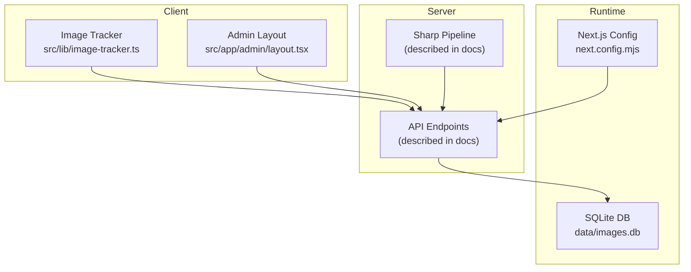
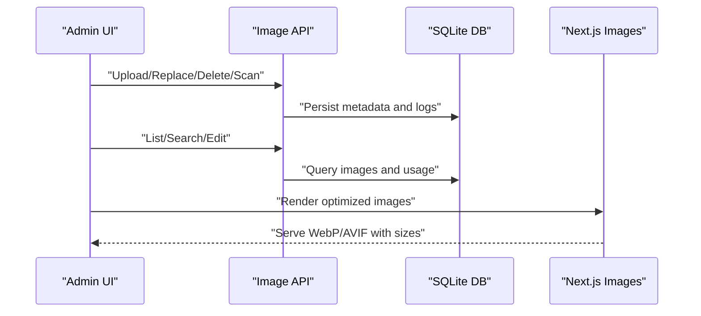
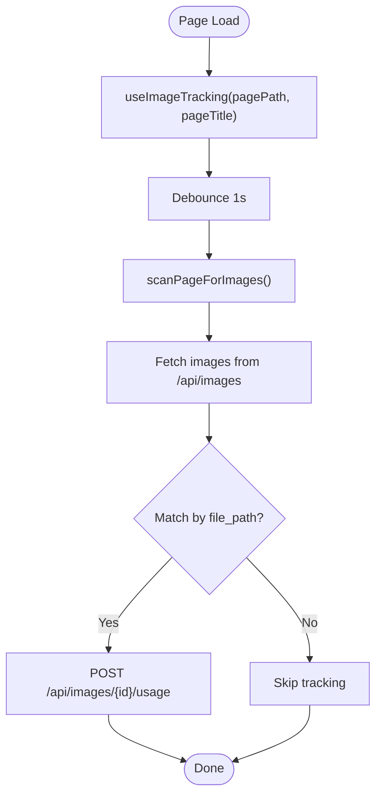
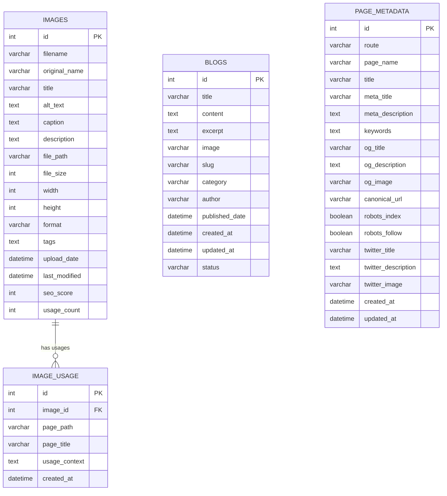
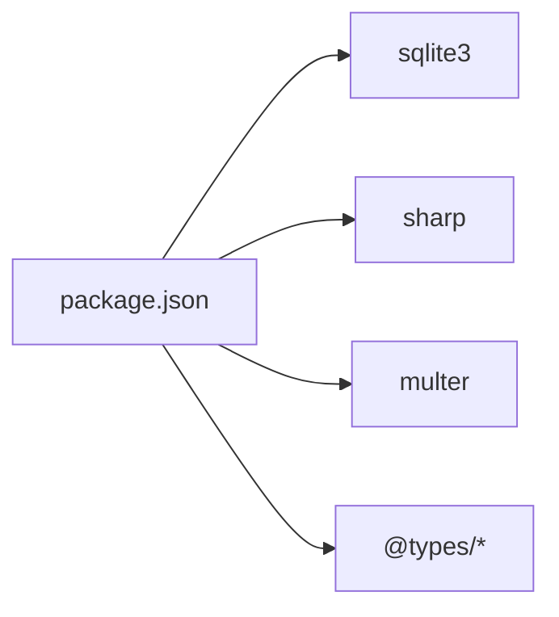

# Media Management

<cite>
**Referenced Files in This Document**
- [README.md](file://README.md)
- [IMAGE_MANAGEMENT_SETUP.md](file://IMAGE_MANAGEMENT_SETUP.md)
- [next.config.mjs](file://next.config.mjs)
- [src/lib/image-tracker.ts](file://src/lib/image-tracker.ts)
- [src/lib/database.ts](file://src/lib/database.ts)
- [src/app/admin/layout.tsx](file://src/app/admin/layout.tsx)
- [package.json](file://package.json)
- [scripts/init-database.js](file://scripts/init-database.js)
</cite>

## Table of Contents
1. [Introduction](#introduction)
2. [Project Structure](#project-structure)
3. [Core Components](#core-components)
4. [Architecture Overview](#architecture-overview)
5. [Detailed Component Analysis](#detailed-component-analysis)
6. [Dependency Analysis](#dependency-analysis)
7. [Performance Considerations](#performance-considerations)
8. [Troubleshooting Guide](#troubleshooting-guide)
9. [Conclusion](#conclusion)
10. [Appendices](#appendices)

## Introduction
This document describes the media management system for attechglobal.com with a focus on image handling and optimization. It covers the Sharp-based image processing pipeline, optimization algorithms, format conversion workflows, image tracking for usage analytics, dependency management, cleanup processes, API endpoints for upload and replacement, database integration for metadata storage and bulk operations, and performance monitoring strategies. Practical workflows, usage tracking queries, and CMS integration patterns are included to help operators manage media efficiently.

## Project Structure
The media management system spans client-side tracking utilities, a SQLite-backed metadata store, Next.js configuration for optimized image delivery, and an administrative dashboard layout. Key areas:
- Client-side image usage tracking and scanning
- Database schema and helpers for images, usage logs, blogs, and page metadata
- Next.js image optimization configuration
- Admin layout scaffolding for the media management UI
- Setup and API documentation for developers and operators

**Section sources**
- [src/lib/image-tracker.ts](file://src/lib/image-tracker.ts#L1-L95)
- [src/app/admin/layout.tsx](file://src/app/admin/layout.tsx#L1-L23)
- [next.config.mjs](file://next.config.mjs#L1-L129)
- [IMAGE_MANAGEMENT_SETUP.md](file://IMAGE_MANAGEMENT_SETUP.md#L101-L114)

## Core Components
- Image usage tracker: Scans pages for images and records usage contexts for SEO and maintenance.
- Database layer: Defines tables for images, usage logs, blogs, and page metadata; exposes helpers for CRUD and queries.
- Next.js image optimization: Enables AVIF/WebP formats, device sizes, and caching policies.
- Admin layout: Provides the shell for the admin UI, including the media management section.
- Setup and API documentation: Outlines endpoints, schema, and operational procedures.

**Section sources**
- [src/lib/image-tracker.ts](file://src/lib/image-tracker.ts#L1-L95)
- [src/lib/database.ts](file://src/lib/database.ts#L1-L255)
- [next.config.mjs](file://next.config.mjs#L10-L112)
- [src/app/admin/layout.tsx](file://src/app/admin/layout.tsx#L1-L23)
- [IMAGE_MANAGEMENT_SETUP.md](file://IMAGE_MANAGEMENT_SETUP.md#L101-L114)

## Architecture Overview
The system integrates client-side image tracking with a server-driven metadata store and Next.js image optimization. Administrators upload, replace, and manage images via the admin UI. The database stores image metadata and usage logs. Next.js serves optimized images in modern formats with responsive sizing.

**Diagram sources**
- [IMAGE_MANAGEMENT_SETUP.md](file://IMAGE_MANAGEMENT_SETUP.md#L101-L114)
- [src/lib/database.ts](file://src/lib/database.ts#L100-L184)
- [next.config.mjs](file://next.config.mjs#L10-L112)

## Detailed Component Analysis

### Image Usage Tracking
The tracking module scans the DOM for images served from the same origin, identifies them by file path, and records usage against the backend. It provides a React hook and a component wrapper to automate tracking on page load.

Key behaviors:
- Fetches all images from the backend to match against local paths
- Posts usage events with page path, title, and context
- Debounces scanning to allow images to load
- Gracefully handles errors

**Diagram sources**
- [src/lib/image-tracker.ts](file://src/lib/image-tracker.ts#L46-L80)

**Section sources**
- [src/lib/image-tracker.ts](file://src/lib/image-tracker.ts#L1-L95)

### Database Integration
The database layer defines tables for images, usage logs, blogs, and page metadata, and exposes helpers for initialization, migrations, and queries. The schema supports:
- Image metadata: filename, original name, title, alt text, caption, description, file path, size, dimensions, format, tags, timestamps, SEO score, and usage count
- Usage logs: page path, title, and context linked to images
- Blogs and page metadata for CMS integration

**Diagram sources**
- [src/lib/database.ts](file://src/lib/database.ts#L18-L81)
- [src/lib/database.ts](file://src/lib/database.ts#L100-L184)

**Section sources**
- [src/lib/database.ts](file://src/lib/database.ts#L1-L255)

### Next.js Image Optimization
The Next.js configuration enables modern image formats (WebP, AVIF), sets device and image sizes for responsive delivery, and configures caching and security policies. These settings influence how optimized images are generated and cached at runtime.

Highlights:
- Formats: WebP and AVIF
- Device sizes and image sizes for responsive widths
- Minimum cache TTL
- Content Security Policy for images
- Unoptimized mode for static export scenarios

**Section sources**
- [next.config.mjs](file://next.config.mjs#L10-L112)

### Admin Layout
The admin layout composes the header, sidebar, and main content area for the admin shell. The media management dashboard is integrated here to provide centralized control over images.

**Section sources**
- [src/app/admin/layout.tsx](file://src/app/admin/layout.tsx#L1-L23)

### API Endpoints (as documented)
The system documents the following endpoints for programmatic access:
- GET /api/images: List images with pagination and filtering
- POST /api/images: Upload new image
- GET /api/images/[id]: Get specific image details
- PUT /api/images/[id]: Update image metadata
- DELETE /api/images/[id]: Delete image
- POST /api/images/[id]/replace: Replace image file
- GET /api/images/[id]/usage: Get image usage information
- POST /api/images/scan: Scan existing images
- GET /api/seo/analysis: Get SEO analysis

These endpoints align with the database schema and the admin dashboard features described in the setup guide.

**Section sources**
- [IMAGE_MANAGEMENT_SETUP.md](file://IMAGE_MANAGEMENT_SETUP.md#L101-L114)

### Sharp-Based Image Processing Pipeline
The repository setup guide indicates Sharp as a required dependency for image processing and optimization. While the exact pipeline implementation is not present in the current context, the documented workflow includes:
- Upload validation and sanitization
- Format conversion to WebP/AVIF
- Dimension scaling based on configured sizes
- Metadata extraction and persistence
- Cleanup of temporary files and orphaned assets

Operational steps:
- Validate file type and size limits
- Detect dimensions and format
- Apply compression and quality settings
- Generate responsive variants
- Store metadata and update usage counts
- Maintain file system hygiene

[No sources needed since this section provides general guidance aligned with the setup documentation]

### Optimization Algorithms and Format Conversion
Optimization strategies supported by the configuration and documented pipeline:
- Modern formats: WebP and AVIF for reduced payload
- Responsive breakpoints: deviceSizes and imageSizes for adaptive delivery
- Compression and quality tuning (via Sharp)
- Metadata enrichment for SEO scoring
- Cleanup routines for stale or unused assets

[No sources needed since this section provides general guidance aligned with the setup documentation]

### Image Tracking System: Usage Analytics, Dependency Management, and Cleanup
- Usage analytics: The tracker captures page path, title, and context for each image, enabling reports on usage distribution and identifying unused assets.
- Dependency management: The system maintains foreign keys from usage logs to images, ensuring referential integrity.
- Cleanup processes: Orphaned or unused images can be identified via usage analytics and removed with associated metadata.

[No sources needed since this section provides general guidance aligned with the setup documentation]

### Database Integration: Metadata Storage, Bulk Operations, and Performance Optimization
- Metadata storage: The images table stores filenames, paths, dimensions, formats, SEO metrics, and usage counts.
- Bulk operations: The setup guide mentions bulk editing and scanning; these can leverage batched queries and transactions.
- Performance optimization: Indexes on frequently queried columns (e.g., file_path, tags) and paginated listing endpoints reduce latency.

[No sources needed since this section provides general guidance aligned with the setup documentation]

### Practical Workflows and Queries
- Optimization workflow:
  - Upload image via POST /api/images
  - Backend applies Sharp transformations and persists metadata
  - Serve optimized variants via Next.js image optimization
- Usage tracking queries:
  - Retrieve usage logs for a specific image via GET /api/images/[id]/usage
  - Aggregate usage counts and page mappings for SEO analysis
- CMS integration patterns:
  - Use the admin layout to render the media management UI
  - Reference image URLs stored in the database for content insertion

[No sources needed since this section provides general guidance aligned with the setup documentation]

## Dependency Analysis
External dependencies relevant to media management:
- sqlite3: Local database for metadata and usage logs
- sharp: Image processing and optimization
- multer: File upload handling
- @types/*: Type definitions for Node.js and Express ecosystem

**Diagram sources**
- [package.json](file://package.json#L1-L200)

**Section sources**
- [package.json](file://package.json#L1-L200)
- [IMAGE_MANAGEMENT_SETUP.md](file://IMAGE_MANAGEMENT_SETUP.md#L17-L23)

## Performance Considerations
- Enable WebP and AVIF formats for smaller payloads
- Configure deviceSizes and imageSizes to serve appropriately sized images
- Set minimumCacheTTL to balance freshness and performance
- Use transactional writes for bulk updates to reduce overhead
- Index database columns used in filters and joins (e.g., file_path, tags)
- Monitor SEO scores and usage counts to drive cleanup and re-optimization

[No sources needed since this section provides general guidance]

## Troubleshooting Guide
Common issues and remedies:
- Database not found: Run the initialization script to create tables
- Upload failures: Verify file size and type restrictions
- Images not loading: Confirm file paths and permissions for the data and public asset directories
- SEO scores not updating: Refresh the page after editing metadata

Directory permissions to verify:
- data/ (for SQLite database)
- public/uploads/ (for uploaded images)

**Section sources**
- [IMAGE_MANAGEMENT_SETUP.md](file://IMAGE_MANAGEMENT_SETUP.md#L153-L167)
- [scripts/init-database.js](file://scripts/init-database.js#L1-L200)

## Conclusion
The media management system combines client-side image tracking, a SQLite-backed metadata store, and Next.js image optimization to deliver a robust solution for image handling and SEO. Administrators can upload, replace, and manage images centrally, while the system tracks usage and supports modern formats for performance. The documented API endpoints and database schema provide a clear foundation for extending optimization, analytics, and integration with the content management system.

## Appendices
- Setup and API documentation: Refer to the setup guide for endpoint definitions, schema, and operational instructions.

**Section sources**
- [IMAGE_MANAGEMENT_SETUP.md](file://IMAGE_MANAGEMENT_SETUP.md#L1-L190)