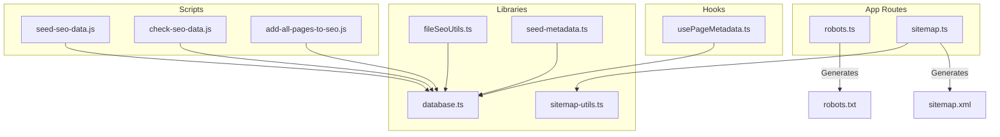
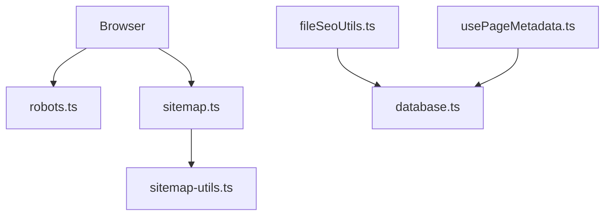
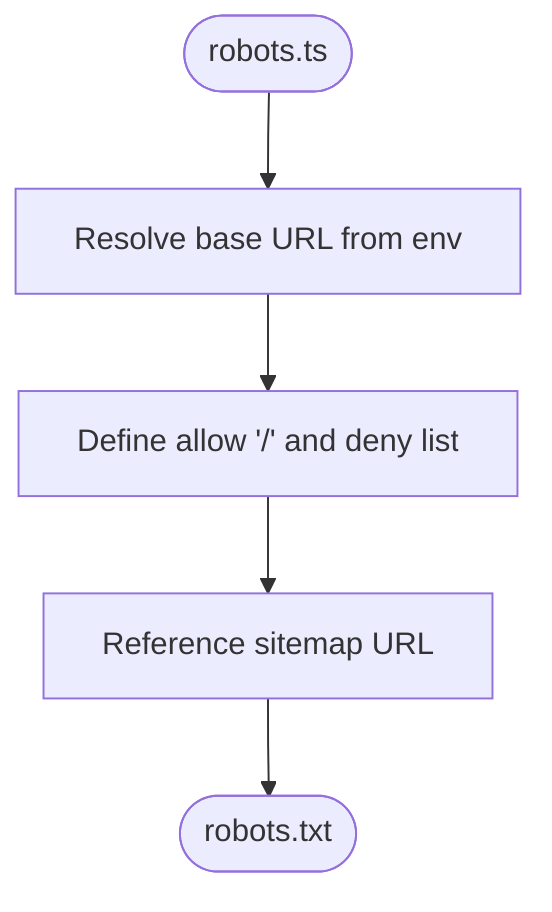
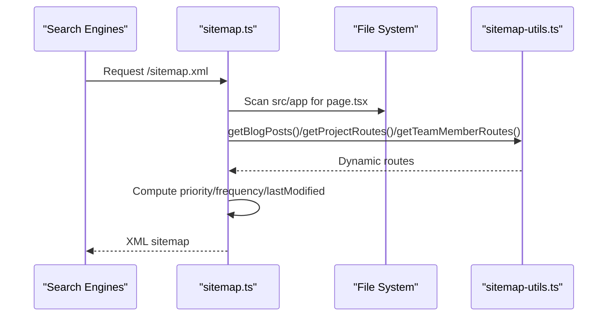
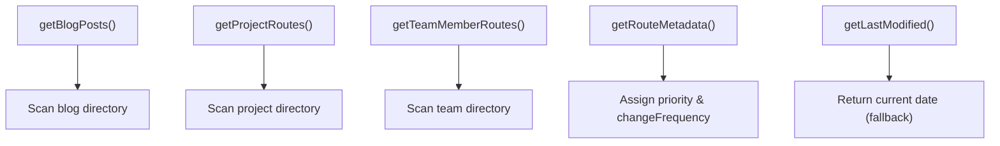
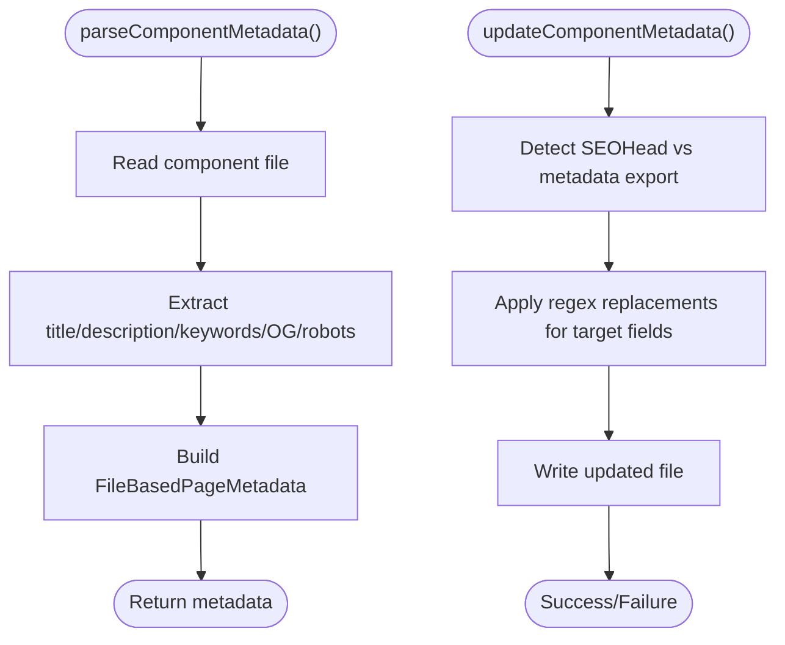
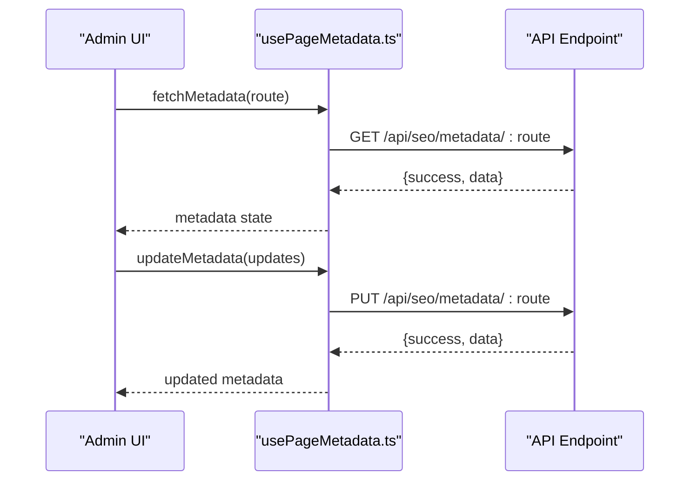
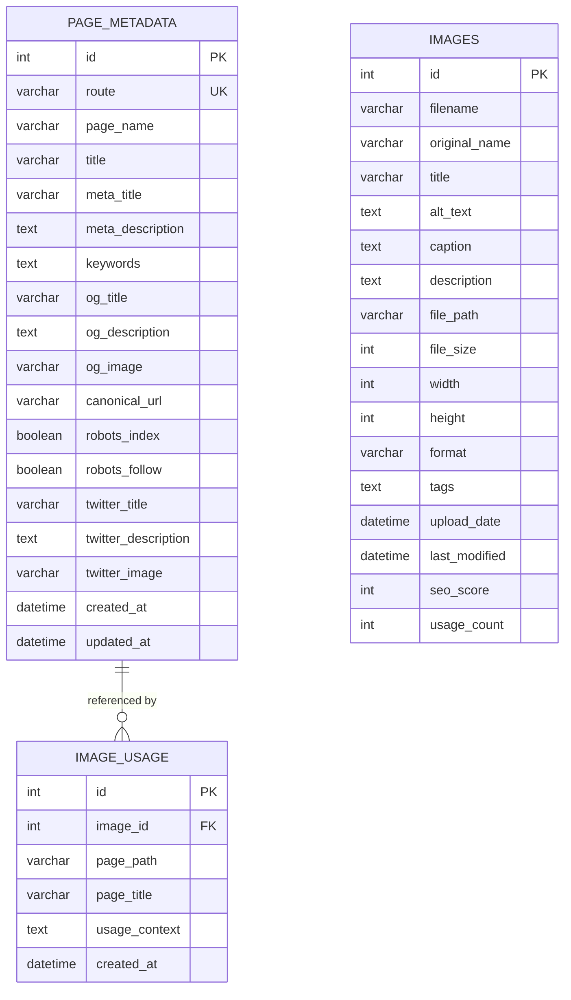
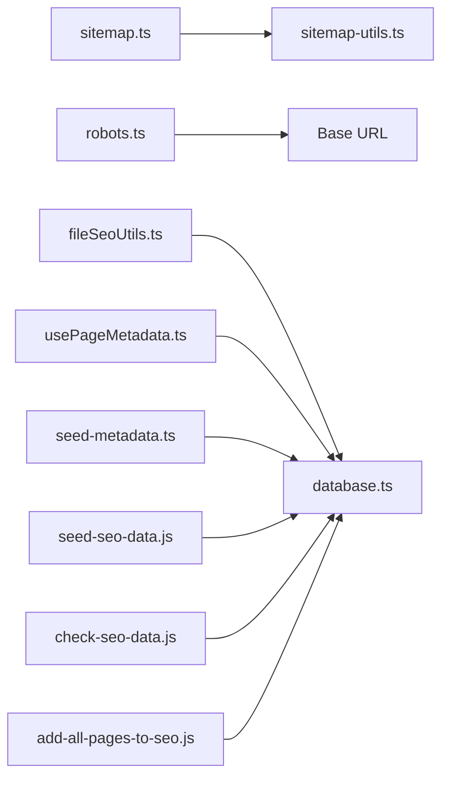

# SEO Optimization

<cite>
**Referenced Files in This Document**
- [robots.ts](file://src/app/robots.ts)
- [sitemap.ts](file://src/app/sitemap.ts)
- [sitemap-utils.ts](file://src/lib/sitemap-utils.ts)
- [fileSeoUtils.ts](file://src/lib/fileSeoUtils.ts)
- [usePageMetadata.ts](file://src/hooks/usePageMetadata.ts)
- [database.ts](file://src/lib/database.ts)
- [seed-metadata.ts](file://src/lib/seed-metadata.ts)
- [SEO_MANAGEMENT_GUIDE.md](file://SEO_MANAGEMENT_GUIDE.md)
- [SITEMAP_SETUP.md](file://SITEMAP_SETUP.md)
- [seed-seo-data.js](file://scripts/seed-seo-data.js)
- [check-seo-data.js](file://scripts/check-seo-data.js)
- [add-all-pages-to-seo.js](file://scripts/add-all-pages-to-seo.js)
</cite>

## Table of Contents
1. [Introduction](#introduction)
2. [Project Structure](#project-structure)
3. [Core Components](#core-components)
4. [Architecture Overview](#architecture-overview)
5. [Detailed Component Analysis](#detailed-component-analysis)
6. [Dependency Analysis](#dependency-analysis)
7. [Performance Considerations](#performance-considerations)
8. [Troubleshooting Guide](#troubleshooting-guide)
9. [Conclusion](#conclusion)
10. [Appendices](#appendices)

## Introduction
This document explains the SEO optimization system for attechglobal.com, focusing on automated metadata generation, file-based optimization strategies, and sitemap/robots management. It covers how the system integrates content management with SEO, ensuring optimal search engine indexing and user experience. The system supports centralized metadata storage, dynamic sitemap generation, robots.txt management, and performance monitoring via database-backed metrics.

## Project Structure
The SEO system spans Next.js app routes, shared libraries, hooks, and CLI scripts:
- App routes define robots.txt and sitemap.xml generation
- Shared libraries implement sitemap utilities, file-based metadata parsing, and database schema
- Hooks provide client-side metadata retrieval and updates
- Scripts seed and validate SEO data

**Diagram sources**
- [robots.ts](file://src/app/robots.ts#L1-L38)
- [sitemap.ts](file://src/app/sitemap.ts#L1-L154)
- [sitemap-utils.ts](file://src/lib/sitemap-utils.ts#L1-L196)
- [fileSeoUtils.ts](file://src/lib/fileSeoUtils.ts#L1-L329)
- [database.ts](file://src/lib/database.ts#L1-L255)
- [seed-metadata.ts](file://src/lib/seed-metadata.ts#L1-L93)
- [usePageMetadata.ts](file://src/hooks/usePageMetadata.ts#L1-L218)
- [seed-seo-data.js](file://scripts/seed-seo-data.js#L1-L171)
- [check-seo-data.js](file://scripts/check-seo-data.js#L1-L59)
- [add-all-pages-to-seo.js](file://scripts/add-all-pages-to-seo.js#L1-L85)

**Section sources**
- [robots.ts](file://src/app/robots.ts#L1-L38)
- [sitemap.ts](file://src/app/sitemap.ts#L1-L154)
- [sitemap-utils.ts](file://src/lib/sitemap-utils.ts#L1-L196)
- [fileSeoUtils.ts](file://src/lib/fileSeoUtils.ts#L1-L329)
- [database.ts](file://src/lib/database.ts#L1-L255)
- [seed-metadata.ts](file://src/lib/seed-metadata.ts#L1-L93)
- [usePageMetadata.ts](file://src/hooks/usePageMetadata.ts#L1-L218)
- [seed-seo-data.js](file://scripts/seed-seo-data.js#L1-L171)
- [check-seo-data.js](file://scripts/check-seo-data.js#L1-L59)
- [add-all-pages-to-seo.js](file://scripts/add-all-pages-to-seo.js#L1-L85)

## Core Components
- Robots generator: Dynamically generates robots.txt with allow/disallow rules and sitemap reference
- Sitemap generator: Discovers static pages, merges with dynamic routes, computes priorities/frequencies, and sets last-modified timestamps
- Sitemap utilities: Provides helpers for dynamic content discovery and route metadata
- File-based SEO utilities: Parses and updates metadata in component files or Next.js metadata exports
- Metadata hooks: Fetches, paginates, and updates page metadata via API endpoints
- Database schema: Defines page_metadata table and supporting tables for images and usage
- Seeders: Initialize default metadata and validate database state

**Section sources**
- [robots.ts](file://src/app/robots.ts#L1-L38)
- [sitemap.ts](file://src/app/sitemap.ts#L1-L154)
- [sitemap-utils.ts](file://src/lib/sitemap-utils.ts#L1-L196)
- [fileSeoUtils.ts](file://src/lib/fileSeoUtils.ts#L1-L329)
- [usePageMetadata.ts](file://src/hooks/usePageMetadata.ts#L1-L218)
- [database.ts](file://src/lib/database.ts#L62-L81)
- [seed-metadata.ts](file://src/lib/seed-metadata.ts#L1-L93)

## Architecture Overview
The SEO system follows a layered architecture:
- Presentation layer: Next.js app routes for robots.txt and sitemap.xml
- Utilities layer: Sitemap helpers and file-based metadata operations
- Data layer: SQLite database storing page metadata and related records
- Client hooks: React hooks for metadata CRUD operations
- Automation layer: Scripts for seeding and validating SEO data

**Diagram sources**
- [robots.ts](file://src/app/robots.ts#L1-L38)
- [sitemap.ts](file://src/app/sitemap.ts#L1-L154)
- [sitemap-utils.ts](file://src/lib/sitemap-utils.ts#L1-L196)
- [fileSeoUtils.ts](file://src/lib/fileSeoUtils.ts#L1-L329)
- [usePageMetadata.ts](file://src/hooks/usePageMetadata.ts#L1-L218)
- [database.ts](file://src/lib/database.ts#L1-L255)

## Detailed Component Analysis

### Robots Generator
- Purpose: Generate robots.txt with environment-aware base URL, allow-all root, and deny-listed paths
- Behavior: Sets dynamic export flags and returns rules with sitemap reference
- Integration: Uses NEXT_PUBLIC_BASE_URL or falls back to localhost/dev or production domain

**Diagram sources**
- [robots.ts](file://src/app/robots.ts#L7-L36)

**Section sources**
- [robots.ts](file://src/app/robots.ts#L1-L38)

### Sitemap Generator
- Purpose: Dynamically generate sitemap.xml with static and dynamic routes
- Behavior:
  - Recursively scans src/app for page.tsx files
  - Skips node_modules, .next, Components, assets, api, admin
  - Handles route groups (parentheses)
  - Merges with dynamic routes from utilities
  - Computes priority and change frequency per route
  - Determines last modified from file stats or utility fallback
- Revalidation: ISR enabled with 24-hour interval

**Diagram sources**
- [sitemap.ts](file://src/app/sitemap.ts#L88-L152)
- [sitemap-utils.ts](file://src/lib/sitemap-utils.ts#L13-L60)
- [sitemap-utils.ts](file://src/lib/sitemap-utils.ts#L63-L105)
- [sitemap-utils.ts](file://src/lib/sitemap-utils.ts#L108-L149)

**Section sources**
- [sitemap.ts](file://src/app/sitemap.ts#L1-L154)
- [sitemap-utils.ts](file://src/lib/sitemap-utils.ts#L1-L196)

### Sitemap Utilities
- Blog/Project/Team route discovery from filesystem
- Route metadata mapping (priority and change frequency)
- Last-modified date fallback logic

**Diagram sources**
- [sitemap-utils.ts](file://src/lib/sitemap-utils.ts#L13-L60)
- [sitemap-utils.ts](file://src/lib/sitemap-utils.ts#L63-L105)
- [sitemap-utils.ts](file://src/lib/sitemap-utils.ts#L108-L149)
- [sitemap-utils.ts](file://src/lib/sitemap-utils.ts#L153-L181)
- [sitemap-utils.ts](file://src/lib/sitemap-utils.ts#L184-L195)

**Section sources**
- [sitemap-utils.ts](file://src/lib/sitemap-utils.ts#L1-L196)

### File-Based SEO Utilities
- Route-to-file mapping for core pages
- Metadata extraction from component files or Next.js metadata exports
- Update operations targeting either SEOHead props or metadata exports
- Reverse mapping for file-to-route resolution

**Diagram sources**
- [fileSeoUtils.ts](file://src/lib/fileSeoUtils.ts#L120-L178)
- [fileSeoUtils.ts](file://src/lib/fileSeoUtils.ts#L183-L298)

**Section sources**
- [fileSeoUtils.ts](file://src/lib/fileSeoUtils.ts#L1-L329)

### Metadata Hooks
- Single-page metadata fetch with route parameter
- Paginated listing with search and pagination controls
- Update/create operations via API endpoints
- Loading/error states and refresh mechanisms

**Diagram sources**
- [usePageMetadata.ts](file://src/hooks/usePageMetadata.ts#L18-L51)
- [usePageMetadata.ts](file://src/hooks/usePageMetadata.ts#L141-L176)

**Section sources**
- [usePageMetadata.ts](file://src/hooks/usePageMetadata.ts#L1-L218)

### Database Schema and Seeders
- Page metadata table with SEO fields (title, meta_title, meta_description, keywords, OG, canonical, robots)
- Supporting tables for images and usage
- Seeder initializes default metadata for key pages
- Scripts seed and validate database state

**Diagram sources**
- [database.ts](file://src/lib/database.ts#L62-L81)
- [database.ts](file://src/lib/database.ts#L106-L181)

**Section sources**
- [database.ts](file://src/lib/database.ts#L1-L255)
- [seed-metadata.ts](file://src/lib/seed-metadata.ts#L1-L93)
- [seed-seo-data.js](file://scripts/seed-seo-data.js#L1-L171)
- [check-seo-data.js](file://scripts/check-seo-data.js#L1-L59)
- [add-all-pages-to-seo.js](file://scripts/add-all-pages-to-seo.js#L1-L85)

## Dependency Analysis
Key dependencies and relationships:
- sitemap.ts depends on sitemap-utils.ts for dynamic route discovery and metadata
- robots.ts depends on NEXT_PUBLIC_BASE_URL for sitemap reference
- fileSeoUtils.ts depends on database.ts for metadata persistence
- usePageMetadata.ts depends on database.ts via API endpoints
- Scripts depend on database.ts schema for seeding and validation

**Diagram sources**
- [sitemap.ts](file://src/app/sitemap.ts#L1-L154)
- [sitemap-utils.ts](file://src/lib/sitemap-utils.ts#L1-L196)
- [robots.ts](file://src/app/robots.ts#L1-L38)
- [fileSeoUtils.ts](file://src/lib/fileSeoUtils.ts#L1-L329)
- [usePageMetadata.ts](file://src/hooks/usePageMetadata.ts#L1-L218)
- [seed-metadata.ts](file://src/lib/seed-metadata.ts#L1-L93)
- [seed-seo-data.js](file://scripts/seed-seo-data.js#L1-L171)
- [check-seo-data.js](file://scripts/check-seo-data.js#L1-L59)
- [add-all-pages-to-seo.js](file://scripts/add-all-pages-to-seo.js#L1-L85)

**Section sources**
- [sitemap.ts](file://src/app/sitemap.ts#L1-L154)
- [sitemap-utils.ts](file://src/lib/sitemap-utils.ts#L1-L196)
- [robots.ts](file://src/app/robots.ts#L1-L38)
- [fileSeoUtils.ts](file://src/lib/fileSeoUtils.ts#L1-L329)
- [usePageMetadata.ts](file://src/hooks/usePageMetadata.ts#L1-L218)
- [seed-metadata.ts](file://src/lib/seed-metadata.ts#L1-L93)
- [seed-seo-data.js](file://scripts/seed-seo-data.js#L1-L171)
- [check-seo-data.js](file://scripts/check-seo-data.js#L1-L59)
- [add-all-pages-to-seo.js](file://scripts/add-all-pages-to-seo.js#L1-L85)

## Performance Considerations
- Sitemap regeneration: ISR revalidation set to 24 hours to balance freshness and performance
- File scanning: Recursive directory traversal optimized by skipping non-relevant directories
- Metadata updates: Regex-based file updates minimize parsing overhead but require careful escaping
- Database operations: Batch insertions and existence checks reduce redundant writes
- Client-side caching: React hooks provide loading/error states to prevent unnecessary re-fetches

[No sources needed since this section provides general guidance]

## Troubleshooting Guide
Common issues and resolutions:
- Sitemap not updating:
  - Verify NEXT_PUBLIC_BASE_URL is set; otherwise, robots.ts and sitemap.ts fall back to localhost/dev or production domain
  - Confirm revalidate value and ISR behavior
- Missing pages in sitemap:
  - Ensure page.tsx files exist under src/app and are not excluded by scan filters
  - Add dynamic routes via sitemap-utils.ts functions
- Robots.txt blocking pages:
  - Review allow/disallow rules and sitemap reference
- Metadata not applied:
  - Confirm component uses SEOHead or Next.js metadata export
  - Validate route prop matches actual URL path
- Database initialization:
  - Run seed script once to initialize page_metadata table
  - Use check-seo-data.js to verify table existence and record count
  - Use add-all-pages-to-seo.js to bulk insert discovered pages

**Section sources**
- [robots.ts](file://src/app/robots.ts#L8-L20)
- [sitemap.ts](file://src/app/sitemap.ts#L104-L123)
- [sitemap-utils.ts](file://src/lib/sitemap-utils.ts#L13-L60)
- [sitemap-utils.ts](file://src/lib/sitemap-utils.ts#L63-L105)
- [sitemap-utils.ts](file://src/lib/sitemap-utils.ts#L108-L149)
- [SEO_MANAGEMENT_GUIDE.md](file://SEO_MANAGEMENT_GUIDE.md#L14-L18)
- [check-seo-data.js](file://scripts/check-seo-data.js#L14-L26)
- [add-all-pages-to-seo.js](file://scripts/add-all-pages-to-seo.js#L10-L16)

## Conclusion
The attechglobal.com SEO system automates metadata generation, sitemap creation, and robots management while integrating seamlessly with content and administration workflows. Its layered design ensures scalability, maintainability, and performance, enabling teams to optimize search engine visibility and user experience with minimal manual effort.

[No sources needed since this section summarizes without analyzing specific files]

## Appendices

### Practical Examples
- SEO configuration:
  - Add SEOHead component to pages and register routes in the SEO dashboard
  - Reference quick-start steps in the SEO management guide
- Metadata optimization:
  - Use fileSeoUtils to parse/update metadata in component files
  - Leverage database-backed metadata for centralized editing
- Performance tracking:
  - Monitor database record counts and table health with scripts
  - Validate sitemap coverage and robots.txt correctness

**Section sources**
- [SEO_MANAGEMENT_GUIDE.md](file://SEO_MANAGEMENT_GUIDE.md#L24-L47)
- [fileSeoUtils.ts](file://src/lib/fileSeoUtils.ts#L120-L178)
- [seed-seo-data.js](file://scripts/seed-seo-data.js#L134-L169)
- [check-seo-data.js](file://scripts/check-seo-data.js#L30-L56)
- [SITEMAP_SETUP.md](file://SITEMAP_SETUP.md#L114-L118)