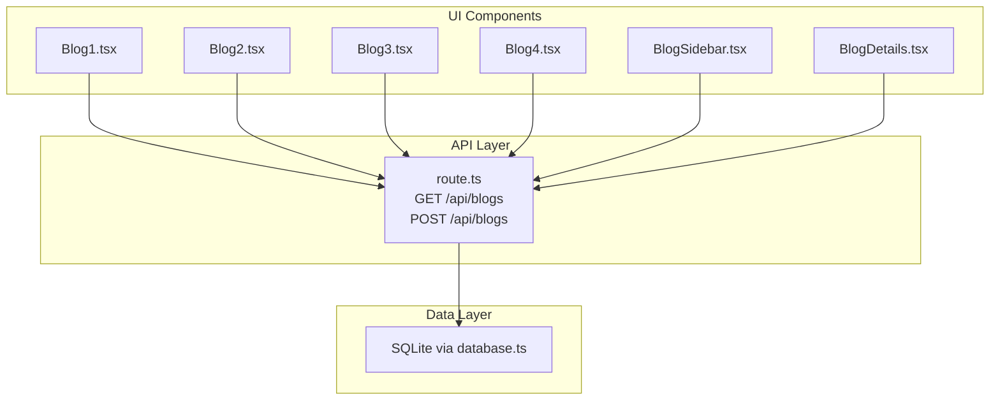
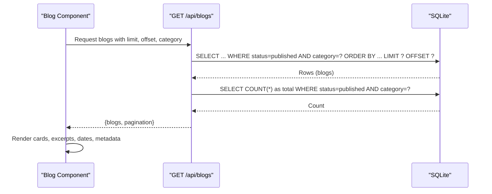
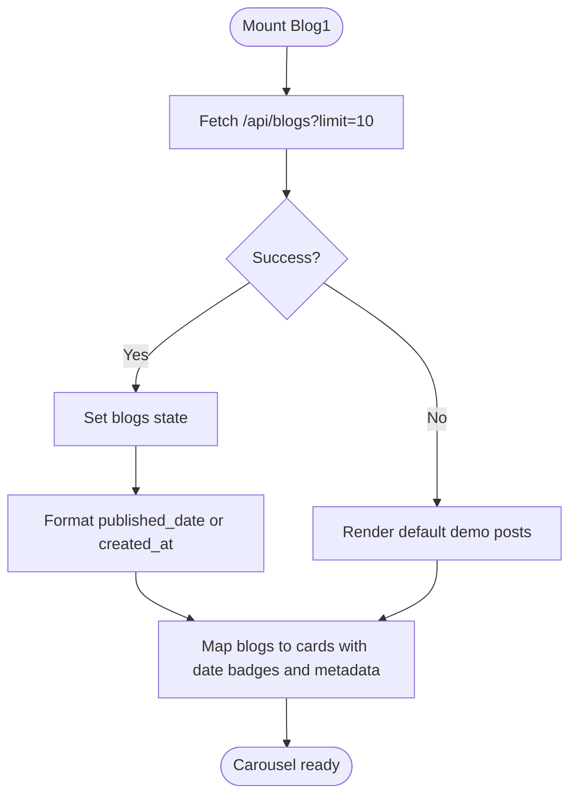
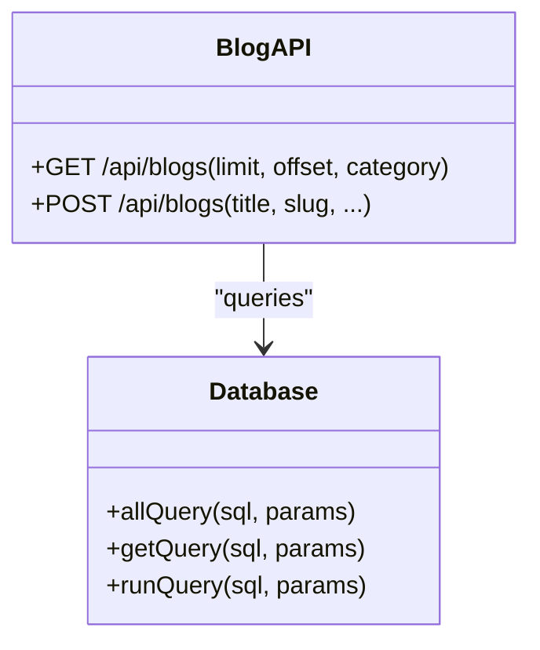
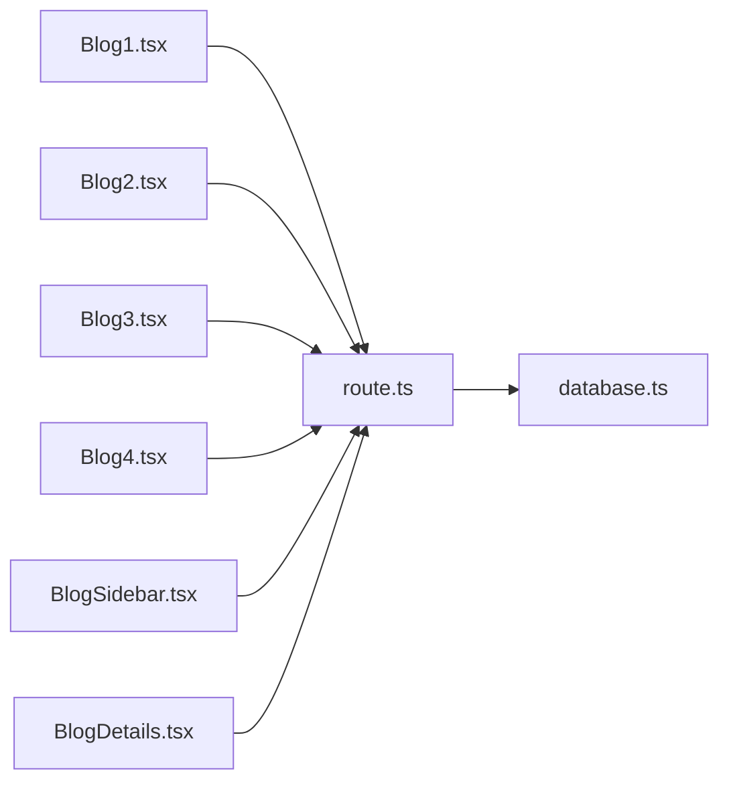

# Blog and Content Sections

<cite>
**Referenced Files in This Document**
- [Blog1.tsx](file://src/app/Components/Blog/Blog1.tsx)
- [Blog2.tsx](file://src/app/Components/Blog/Blog2.tsx)
- [Blog3.tsx](file://src/app/Components/Blog/Blog3.tsx)
- [Blog4.tsx](file://src/app/Components/Blog/Blog4.tsx)
- [BlogSidebar.tsx](file://src/app/Components/BlogSidebar/BlogSidebar.tsx)
- [BlogDetails.tsx](file://src/app/Components/BlogDetails/BlogDetails.tsx)
- [route.ts](file://src/app/api/blogs/route.ts)
</cite>

## Table of Contents
1. [Introduction](#introduction)
2. [Project Structure](#project-structure)
3. [Core Components](#core-components)
4. [Architecture Overview](#architecture-overview)
5. [Detailed Component Analysis](#detailed-component-analysis)
6. [Dependency Analysis](#dependency-analysis)
7. [Performance Considerations](#performance-considerations)
8. [Troubleshooting Guide](#troubleshooting-guide)
9. [Conclusion](#conclusion)

## Introduction
This document explains the blog and content display system for the AtTechGlobal website. It covers the four blog layout variants (Blog1–Blog4), their implementations for article listings, excerpts, and content organization; the sidebar components, category filtering, search functionality, and pagination; responsive layouts; content syndication features; integration with the content management system; and the blog detail page implementation. It also highlights how content sections contribute to SEO and user engagement.

## Project Structure
The blog system is composed of:
- Four reusable blog layout components under src/app/Components/Blog/
- A blog sidebar component under src/app/Components/BlogSidebar/
- A blog detail page component under src/app/Components/BlogDetails/
- A Next.js route handler under src/app/api/blogs/ for content retrieval and creation

**Diagram sources**
- [Blog1.tsx](file://src/app/Components/Blog/Blog1.tsx#L1-L215)
- [Blog2.tsx](file://src/app/Components/Blog/Blog2.tsx#L1-L62)
- [Blog3.tsx](file://src/app/Components/Blog/Blog3.tsx#L1-L90)
- [Blog4.tsx](file://src/app/Components/Blog/Blog4.tsx#L1-L87)
- [BlogSidebar.tsx](file://src/app/Components/BlogSidebar/BlogSidebar.tsx#L1-L169)
- [BlogDetails.tsx](file://src/app/Components/BlogDetails/BlogDetails.tsx#L1-L215)
- [route.ts](file://src/app/api/blogs/route.ts#L1-L107)

**Section sources**
- [Blog1.tsx](file://src/app/Components/Blog/Blog1.tsx#L1-L215)
- [Blog2.tsx](file://src/app/Components/Blog/Blog2.tsx#L1-L62)
- [Blog3.tsx](file://src/app/Components/Blog/Blog3.tsx#L1-L90)
- [Blog4.tsx](file://src/app/Components/Blog/Blog4.tsx#L1-L87)
- [BlogSidebar.tsx](file://src/app/Components/BlogSidebar/BlogSidebar.tsx#L1-L169)
- [BlogDetails.tsx](file://src/app/Components/BlogDetails/BlogDetails.tsx#L1-L215)
- [route.ts](file://src/app/api/blogs/route.ts#L1-L107)

## Core Components
- Blog1: Responsive carousel-style listing with featured posts, date badges, and metadata. Fetches paginated and filtered content from the API.
- Blog2: Three-column grid of recent posts with prominent titles and “Read More” links.
- Blog3: Three-column grid with metadata badges and decorative background shape.
- Blog4: Responsive grid with category metadata, author attribution, and date badges.
- BlogSidebar: Sidebar with search, categories, recent posts, and tags; paired with a main content area for full-width blog listings.
- BlogDetails: Full-width blog detail page with metadata, gallery, tags, author card, comments, and comment form.
- API route: Provides GET (pagination, filtering by category) and POST (create blog) endpoints backed by a SQLite database.

**Section sources**
- [Blog1.tsx](file://src/app/Components/Blog/Blog1.tsx#L1-L215)
- [Blog2.tsx](file://src/app/Components/Blog/Blog2.tsx#L1-L62)
- [Blog3.tsx](file://src/app/Components/Blog/Blog3.tsx#L1-L90)
- [Blog4.tsx](file://src/app/Components/Blog/Blog4.tsx#L1-L87)
- [BlogSidebar.tsx](file://src/app/Components/BlogSidebar/BlogSidebar.tsx#L1-L169)
- [BlogDetails.tsx](file://src/app/Components/BlogDetails/BlogDetails.tsx#L1-L215)
- [route.ts](file://src/app/api/blogs/route.ts#L14-L61)

## Architecture Overview
The blog rendering pipeline:
- UI components fetch data from the Next.js route handler.
- The route handler queries a SQLite database and returns structured JSON with pagination metadata.
- Components render lists, excerpts, and detail views based on the received data.
- Pagination and filtering are handled client-side in the UI components where applicable, while the API supports category filtering and limit/offset pagination.

**Diagram sources**
- [Blog1.tsx](file://src/app/Components/Blog/Blog1.tsx#L24-L51)
- [route.ts](file://src/app/api/blogs/route.ts#L14-L61)

## Detailed Component Analysis

### Blog1: Featured Carousel Layout
- Purpose: Highlight recent articles in a responsive carousel with navigation controls.
- Data fetching: Uses a client-side fetch to /api/blogs with a configurable limit.
- Rendering: Displays thumbnail with posted date badge, author/category metadata, title/excerpt, and “Read More” link.
- Responsiveness: Configurable slides per view across breakpoints; auto-rotation and swipe support.
- Fallback: On error or empty results, renders default demo posts.

**Diagram sources**
- [Blog1.tsx](file://src/app/Components/Blog/Blog1.tsx#L24-L51)
- [Blog1.tsx](file://src/app/Components/Blog/Blog1.tsx#L54-L61)
- [Blog1.tsx](file://src/app/Components/Blog/Blog1.tsx#L144-L200)

**Section sources**
- [Blog1.tsx](file://src/app/Components/Blog/Blog1.tsx#L1-L215)
- [route.ts](file://src/app/api/blogs/route.ts#L19-L45)

### Blog2: Three-Column Grid (Simple)
- Purpose: Present three recent posts with prominent titles and metadata.
- Rendering: Fixed three-column layout with thumbnails, posted date, and “Read More” links.
- Content: Static demo items mapped to cards.

**Section sources**
- [Blog2.tsx](file://src/app/Components/Blog/Blog2.tsx#L1-L62)

### Blog3: Three-Column Grid (Styled)
- Purpose: Styled three-column layout with metadata badges and decorative background.
- Rendering: Similar to Blog2 with additional styling and a background shape element.

**Section sources**
- [Blog3.tsx](file://src/app/Components/Blog/Blog3.tsx#L1-L90)

### Blog4: Responsive Grid with Category Metadata
- Purpose: Responsive grid with author, category, and date badges.
- Rendering: Uses item-specific link and date fields; includes decorative background shape.

**Section sources**
- [Blog4.tsx](file://src/app/Components/Blog/Blog4.tsx#L1-L87)

### BlogSidebar: Sidebar with Search, Categories, Recent Posts, Tags
- Purpose: Provide filtering and discovery aids alongside the main content area.
- Components:
  - Search: Text input with submit button.
  - Categories: List with counts.
  - Recent Posts: Thumbnails with publish dates and titles.
  - Tags: Tag cloud links.
- Behavior: Links navigate to detail pages; current implementation uses placeholder URLs.

**Section sources**
- [BlogSidebar.tsx](file://src/app/Components/BlogSidebar/BlogSidebar.tsx#L1-L169)

### BlogDetails: Full-Width Article Page
- Purpose: Display a single article with rich content, metadata, author info, comments, and a comment form.
- Features:
  - Banner image and metadata (date, author).
  - Rich text content and blockquote.
  - Gallery images.
  - Tags section.
  - Author bio card.
  - Comments list with reply actions.
  - Comment submission form.

**Section sources**
- [BlogDetails.tsx](file://src/app/Components/BlogDetails/BlogDetails.tsx#L1-L215)

### API Route: Content Management Integration
- Endpoints:
  - GET /api/blogs: Returns paginated and optionally category-filtered blog posts, with total and page count.
  - POST /api/blogs: Creates a new blog post with validation and uniqueness checks on slug.
- Data model: Blogs table with fields such as title, slug, content, excerpt, image, category, author, published_date, created_at, and status.
- Pagination: limit and offset parameters; total and totalPages computed from COUNT(*).
- Filtering: category query parameter applied to WHERE clause.

**Diagram sources**
- [route.ts](file://src/app/api/blogs/route.ts#L14-L61)
- [route.ts](file://src/app/api/blogs/route.ts#L63-L105)

**Section sources**
- [route.ts](file://src/app/api/blogs/route.ts#L1-L107)

## Dependency Analysis
- UI components depend on the API route for content.
- The API route depends on a database abstraction layer for SQL operations.
- Components share common patterns: date formatting, metadata rendering, and link generation.

**Diagram sources**
- [Blog1.tsx](file://src/app/Components/Blog/Blog1.tsx#L24-L51)
- [Blog2.tsx](file://src/app/Components/Blog/Blog2.tsx#L1-L62)
- [Blog3.tsx](file://src/app/Components/Blog/Blog3.tsx#L1-L90)
- [Blog4.tsx](file://src/app/Components/Blog/Blog4.tsx#L1-L87)
- [BlogSidebar.tsx](file://src/app/Components/BlogSidebar/BlogSidebar.tsx#L1-L169)
- [BlogDetails.tsx](file://src/app/Components/BlogDetails/BlogDetails.tsx#L1-L215)
- [route.ts](file://src/app/api/blogs/route.ts#L1-L12)

**Section sources**
- [Blog1.tsx](file://src/app/Components/Blog/Blog1.tsx#L1-L215)
- [Blog2.tsx](file://src/app/Components/Blog/Blog2.tsx#L1-L62)
- [Blog3.tsx](file://src/app/Components/Blog/Blog3.tsx#L1-L90)
- [Blog4.tsx](file://src/app/Components/Blog/Blog4.tsx#L1-L87)
- [BlogSidebar.tsx](file://src/app/Components/BlogSidebar/BlogSidebar.tsx#L1-L169)
- [BlogDetails.tsx](file://src/app/Components/BlogDetails/BlogDetails.tsx#L1-L215)
- [route.ts](file://src/app/api/blogs/route.ts#L1-L107)

## Performance Considerations
- Pagination: The API supports limit/offset pagination; consider indexing on status and timestamps for efficient sorting and filtering.
- Client-side caching: Components could memoize fetched data to avoid redundant requests during navigation.
- Images: Ensure Next.js Image optimization is configured for lazy loading and appropriate sizes.
- Carousel: Auto-rotation and swipe can increase DOM updates; throttle or pause on inactive tabs.
- API calls: Batch requests where possible; avoid excessive re-renders by using stable keys and memoization.

## Troubleshooting Guide
- Empty or missing content:
  - Verify the database contains published posts and the API endpoint returns data.
  - Check the client-side fallback logic in Blog1 when no data is returned.
- Category filter not applied:
  - Confirm the category query parameter is passed and the API applies the WHERE clause.
- Slug conflicts on creation:
  - The POST endpoint validates uniqueness; handle 409 responses gracefully in forms.
- Pagination issues:
  - Ensure limit and offset parameters are integers and within acceptable bounds.

**Section sources**
- [Blog1.tsx](file://src/app/Components/Blog/Blog1.tsx#L38-L45)
- [route.ts](file://src/app/api/blogs/route.ts#L28-L31)
- [route.ts](file://src/app/api/blogs/route.ts#L100-L103)

## Conclusion
The blog system combines flexible layout components with a robust API and database layer. The four blog variants support diverse content presentation styles, while the sidebar and detail page components enhance discoverability and engagement. Pagination and category filtering are supported by the API, enabling scalable content management. SEO-friendly metadata and rich content sections further improve visibility and user experience.