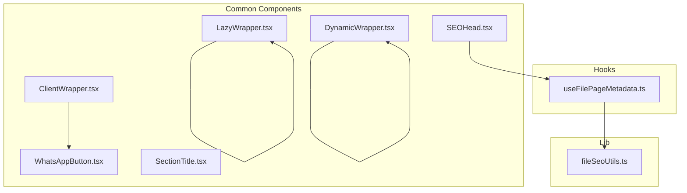
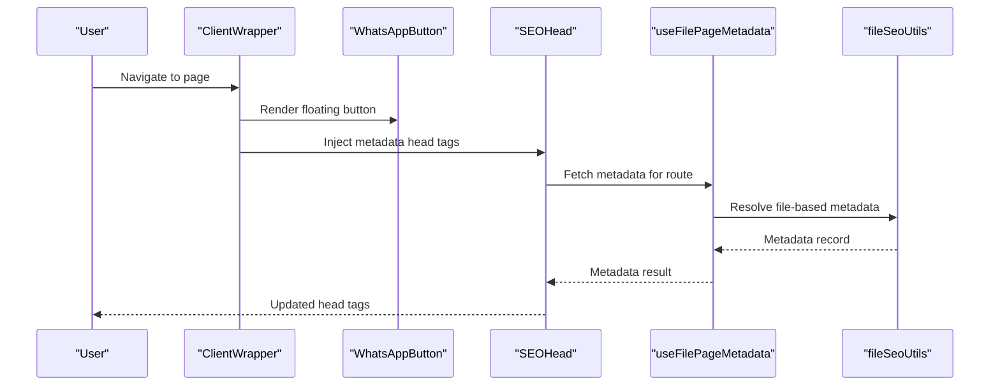
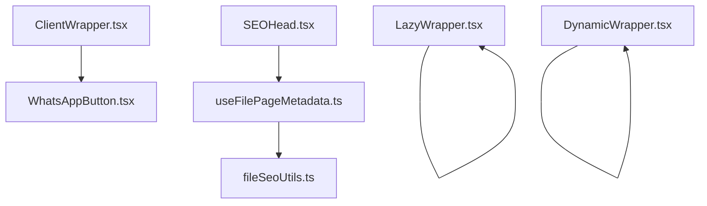

# Common Components and Utilities

<cite>
**Referenced Files in This Document**
- [WhatsAppButton.tsx](file://src/app/Components/Common/WhatsAppButton.tsx)
- [SEOHead.tsx](file://src/app/Components/Common/SEOHead.tsx)
- [SectionTitle.tsx](file://src/app/Components/Common/SectionTitle.tsx)
- [ClientWrapper.tsx](file://src/app/Components/Common/ClientWrapper.tsx)
- [LazyWrapper.tsx](file://src/app/Components/Common/LazyWrapper.tsx)
- [DynamicWrapper.tsx](file://src/app/Components/Common/DynamicWrapper.tsx)
- [useFilePageMetadata.ts](file://src/hooks/useFilePageMetadata.ts)
- [fileSeoUtils.ts](file://src/lib/fileSeoUtils.ts)
</cite>

## Table of Contents
1. [Introduction](#introduction)
2. [Project Structure](#project-structure)
3. [Core Components](#core-components)
4. [Architecture Overview](#architecture-overview)
5. [Detailed Component Analysis](#detailed-component-analysis)
6. [Dependency Analysis](#dependency-analysis)
7. [Performance Considerations](#performance-considerations)
8. [Troubleshooting Guide](#troubleshooting-guide)
9. [Conclusion](#conclusion)

## Introduction
This document describes the common utility components and shared functionality used across the application. It focuses on:
- Instant client communication via a floating WhatsApp button
- Metadata management for SEO using a reusable head component
- Content organization with a flexible section title component
- Wrapper components for performance optimization, including lazy loading and client-side rendering strategies

These utilities are designed to improve user experience, maintain consistency, and optimize performance across different page types.

## Project Structure
The common components live under the Common directory and are composed with hooks and library utilities for SEO and metadata management.

**Diagram sources**
- [WhatsAppButton.tsx](file://src/app/Components/Common/WhatsAppButton.tsx#L1-L33)
- [SEOHead.tsx](file://src/app/Components/Common/SEOHead.tsx#L1-L78)
- [SectionTitle.tsx](file://src/app/Components/Common/SectionTitle.tsx#L1-L14)
- [ClientWrapper.tsx](file://src/app/Components/Common/ClientWrapper.tsx#L1-L11)
- [LazyWrapper.tsx](file://src/app/Components/Common/LazyWrapper.tsx#L1-L51)
- [DynamicWrapper.tsx](file://src/app/Components/Common/DynamicWrapper.tsx#L1-L42)
- [useFilePageMetadata.ts](file://src/hooks/useFilePageMetadata.ts#L1-L225)
- [fileSeoUtils.ts](file://src/lib/fileSeoUtils.ts#L1-L329)

**Section sources**
- [WhatsAppButton.tsx](file://src/app/Components/Common/WhatsAppButton.tsx#L1-L33)
- [SEOHead.tsx](file://src/app/Components/Common/SEOHead.tsx#L1-L78)
- [SectionTitle.tsx](file://src/app/Components/Common/SectionTitle.tsx#L1-L14)
- [ClientWrapper.tsx](file://src/app/Components/Common/ClientWrapper.tsx#L1-L11)
- [LazyWrapper.tsx](file://src/app/Components/Common/LazyWrapper.tsx#L1-L51)
- [DynamicWrapper.tsx](file://src/app/Components/Common/DynamicWrapper.tsx#L1-L42)
- [useFilePageMetadata.ts](file://src/hooks/useFilePageMetadata.ts#L1-L225)
- [fileSeoUtils.ts](file://src/lib/fileSeoUtils.ts#L1-L329)

## Core Components
- WhatsAppButton: A floating action button linking to a WhatsApp chat, styled and animated for visibility and interactivity.
- SEOHead: A reusable head component that dynamically injects page metadata, falling back to defaults when data is unavailable.
- SectionTitle: A lightweight component for rendering titles and subtitles with optional icons, supporting HTML-like content.
- ClientWrapper: A layout wrapper that ensures client-side rendering and appends the WhatsApp button to every page.
- LazyWrapper: A client-side lazy loader that renders children when they enter the viewport, with configurable thresholds and margins.
- DynamicWrapper: A higher-order wrapper that enables Next.js dynamic imports with client-side rendering and loading fallbacks.

**Section sources**
- [WhatsAppButton.tsx](file://src/app/Components/Common/WhatsAppButton.tsx#L1-L33)
- [SEOHead.tsx](file://src/app/Components/Common/SEOHead.tsx#L1-L78)
- [SectionTitle.tsx](file://src/app/Components/Common/SectionTitle.tsx#L1-L14)
- [ClientWrapper.tsx](file://src/app/Components/Common/ClientWrapper.tsx#L1-L11)
- [LazyWrapper.tsx](file://src/app/Components/Common/LazyWrapper.tsx#L1-L51)
- [DynamicWrapper.tsx](file://src/app/Components/Common/DynamicWrapper.tsx#L1-L42)

## Architecture Overview
The components integrate with hooks and utilities to manage SEO metadata and dynamic imports. The ClientWrapper ensures client-side rendering so that interactive elements like the WhatsApp button and lazy loaders work as expected.

**Diagram sources**
- [ClientWrapper.tsx](file://src/app/Components/Common/ClientWrapper.tsx#L1-L11)
- [WhatsAppButton.tsx](file://src/app/Components/Common/WhatsAppButton.tsx#L1-L33)
- [SEOHead.tsx](file://src/app/Components/Common/SEOHead.tsx#L1-L78)
- [useFilePageMetadata.ts](file://src/hooks/useFilePageMetadata.ts#L1-L225)
- [fileSeoUtils.ts](file://src/lib/fileSeoUtils.ts#L1-L329)

## Detailed Component Analysis

### WhatsAppButton
Purpose:
- Provides instant access to customer support via a floating link to a WhatsApp chat.

Key behaviors:
- Fixed positioning with z-index and hover scaling effect.
- Opens in a new tab with appropriate security attributes.
- Uses a remote image asset for the icon.

Composition pattern:
- Stateless functional component returning a styled anchor element.

Integration:
- Included inside ClientWrapper to ensure it appears on all client-rendered pages.

**Section sources**
- [WhatsAppButton.tsx](file://src/app/Components/Common/WhatsAppButton.tsx#L1-L33)
- [ClientWrapper.tsx](file://src/app/Components/Common/ClientWrapper.tsx#L1-L11)

### SEOHead
Purpose:
- Centralizes metadata injection for SEO, including Open Graph and Twitter cards.

Props interface:
- route: string
- defaultTitle?: string
- defaultDescription?: string
- defaultKeywords?: string
- children?: React.ReactNode

Behavior:
- Fetches metadata for the current route using a hook.
- Falls back to default values while loading or when metadata is missing.
- Renders title, description, keywords, Open Graph, Twitter, robots, and canonical URL tags.

Integration:
- Consumes useFilePageMetadata to resolve per-route metadata.
- Works with file-based metadata mapping utilities.

**Section sources**
- [SEOHead.tsx](file://src/app/Components/Common/SEOHead.tsx#L1-L78)
- [useFilePageMetadata.ts](file://src/hooks/useFilePageMetadata.ts#L1-L225)
- [fileSeoUtils.ts](file://src/lib/fileSeoUtils.ts#L1-L329)

### SectionTitle
Purpose:
- Standardizes section headings with subtitle and icon presentation.

Props interface:
- Title: React.ReactNode
- SubTitle: React.ReactNode

Behavior:
- Parses HTML-like content for titles and subtitles.
- Renders subtitle with a decorative icon.

Usage:
- Supports rich content via HTML parsing, enabling formatted text and inline images.

**Section sources**
- [SectionTitle.tsx](file://src/app/Components/Common/SectionTitle.tsx#L1-L14)

### ClientWrapper
Purpose:
- Ensures client-side rendering and appends the WhatsApp button to every page.

Behavior:
- Wraps page content and renders the floating button after children.

Integration:
- Used at the application layout level to guarantee consistent UX.

**Section sources**
- [ClientWrapper.tsx](file://src/app/Components/Common/ClientWrapper.tsx#L1-L11)
- [WhatsAppButton.tsx](file://src/app/Components/Common/WhatsAppButton.tsx#L1-L33)

### LazyWrapper
Purpose:
- Optimizes performance by deferring rendering until elements are near the viewport.

Props interface:
- children: React.ReactNode
- fallback?: React.ReactNode
- threshold?: number
- rootMargin?: string

Behavior:
- Uses IntersectionObserver to detect when the ref enters the viewport.
- Switches from fallback to children once visible.
- Disconnects the observer after first intersection to avoid repeated triggers.

Performance characteristics:
- Reduces initial render cost for heavy components.
- Configurable sensitivity via threshold and rootMargin.

**Section sources**
- [LazyWrapper.tsx](file://src/app/Components/Common/LazyWrapper.tsx#L1-L51)

### DynamicWrapper
Purpose:
- Enables client-side-only dynamic imports with loading fallbacks.

Higher-order wrapper:
- withDynamicImport(importFunc, fallback?): Returns a Next.js dynamic component with client-side rendering and optional fallback.

Preconfigured dynamic imports:
- DynamicProject1, DynamicServices1, DynamicTestimonial1, DynamicTeam1, DynamicBlog1.

Behavior:
- Disables SSR for better performance on client-heavy components.
- Provides spinner-based fallbacks during loading.

Integration:
- Useful for heavy components that benefit from code splitting and client-side hydration.

**Section sources**
- [DynamicWrapper.tsx](file://src/app/Components/Common/DynamicWrapper.tsx#L1-L42)

## Dependency Analysis
The components depend on each other and on shared utilities as follows:

**Diagram sources**
- [ClientWrapper.tsx](file://src/app/Components/Common/ClientWrapper.tsx#L1-L11)
- [WhatsAppButton.tsx](file://src/app/Components/Common/WhatsAppButton.tsx#L1-L33)
- [SEOHead.tsx](file://src/app/Components/Common/SEOHead.tsx#L1-L78)
- [useFilePageMetadata.ts](file://src/hooks/useFilePageMetadata.ts#L1-L225)
- [fileSeoUtils.ts](file://src/lib/fileSeoUtils.ts#L1-L329)
- [LazyWrapper.tsx](file://src/app/Components/Common/LazyWrapper.tsx#L1-L51)
- [DynamicWrapper.tsx](file://src/app/Components/Common/DynamicWrapper.tsx#L1-L42)

**Section sources**
- [ClientWrapper.tsx](file://src/app/Components/Common/ClientWrapper.tsx#L1-L11)
- [WhatsAppButton.tsx](file://src/app/Components/Common/WhatsAppButton.tsx#L1-L33)
- [SEOHead.tsx](file://src/app/Components/Common/SEOHead.tsx#L1-L78)
- [useFilePageMetadata.ts](file://src/hooks/useFilePageMetadata.ts#L1-L225)
- [fileSeoUtils.ts](file://src/lib/fileSeoUtils.ts#L1-L329)
- [LazyWrapper.tsx](file://src/app/Components/Common/LazyWrapper.tsx#L1-L51)
- [DynamicWrapper.tsx](file://src/app/Components/Common/DynamicWrapper.tsx#L1-L42)

## Performance Considerations
- Client-side rendering: ClientWrapper and DynamicWrapper disable SSR for components that rely on browser APIs or DOM features, reducing server load and improving interactivity.
- Lazy loading: LazyWrapper defers rendering until components are near the viewport, lowering initial bundle size and improving perceived performance.
- Dynamic imports: Splitting heavy components reduces the initial JavaScript payload and improves time-to-interactive metrics.
- Metadata caching: SEOHead falls back to defaults while loading, preventing blocking behavior and ensuring fast-first-paint.

[No sources needed since this section provides general guidance]

## Troubleshooting Guide
- WhatsAppButton not visible:
  - Verify ClientWrapper is applied at the layout level.
  - Confirm the component is client-rendered and not blocked by ad blockers.
- SEOHead not updating:
  - Ensure the route passed to SEOHead matches the mapping used by the hook and utilities.
  - Check network requests to the metadata endpoint for errors.
- LazyWrapper not triggering:
  - Validate threshold and rootMargin values.
  - Confirm the element is within the viewport or within the configured root margin.
- DynamicWrapper fallback not disappearing:
  - Ensure the imported component hydrates correctly on the client.
  - Verify that SSR is disabled for the component.

**Section sources**
- [ClientWrapper.tsx](file://src/app/Components/Common/ClientWrapper.tsx#L1-L11)
- [SEOHead.tsx](file://src/app/Components/Common/SEOHead.tsx#L1-L78)
- [useFilePageMetadata.ts](file://src/hooks/useFilePageMetadata.ts#L1-L225)
- [LazyWrapper.tsx](file://src/app/Components/Common/LazyWrapper.tsx#L1-L51)
- [DynamicWrapper.tsx](file://src/app/Components/Common/DynamicWrapper.tsx#L1-L42)

## Conclusion
These common components form a cohesive toolkit for enhancing user experience and performance:
- The floating WhatsApp button improves accessibility and support.
- SEOHead centralizes metadata management with robust fallbacks.
- SectionTitle standardizes content presentation.
- ClientWrapper ensures consistent client-side behavior.
- LazyWrapper and DynamicWrapper optimize performance through deferred rendering and code splitting.

Together, they enable scalable, maintainable, and performant page construction across the application.