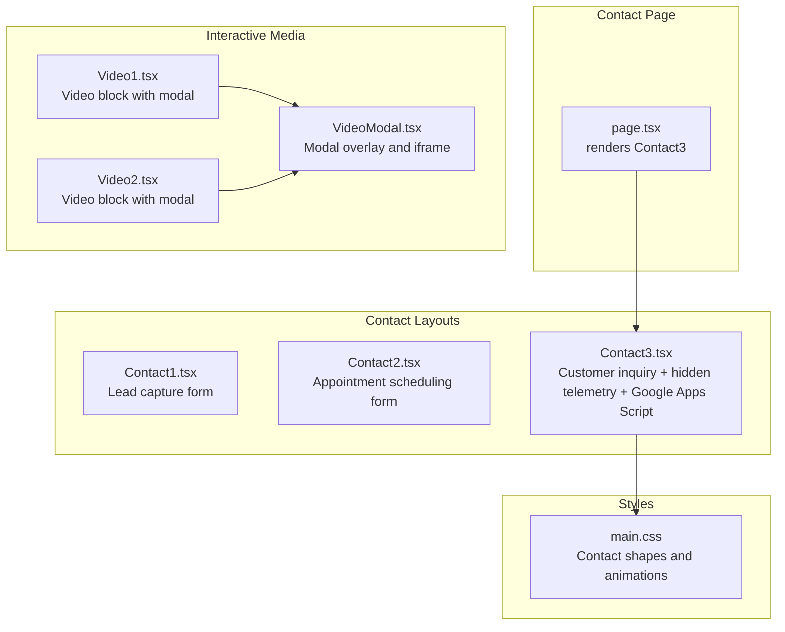
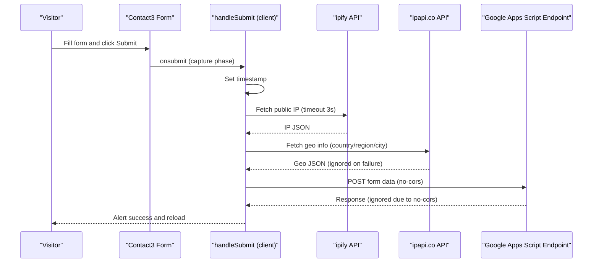
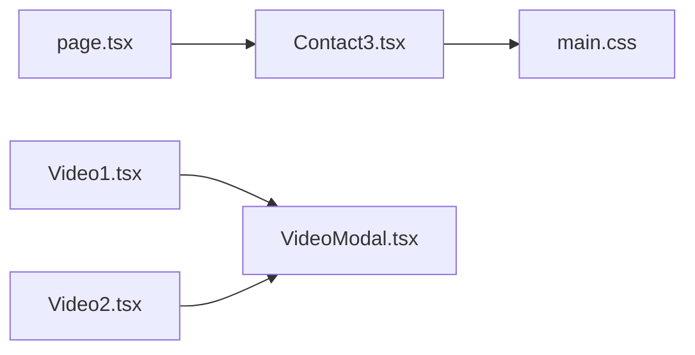

# Contact and Form Sections

<cite>
**Referenced Files in This Document**
- [page.tsx](file://src/app/(innerpage)/contact/page.tsx)
- [Contact1.tsx](file://src/app/Components/Contact/Contact1.tsx)
- [Contact2.tsx](file://src/app/Components/Contact/Contact2.tsx)
- [Contact3.tsx](file://src/app/Components/Contact/Contact3.tsx)
- [Video1.tsx](file://src/app/Components/Video/Video1.tsx)
- [Video2.tsx](file://src/app/Components/Video/Video2.tsx)
- [VideoModal.tsx](file://src/app/Components/VideoModal/VideoModal.tsx)
- [main.css](file://src/app/assets/main.css)
</cite>

## Table of Contents
1. [Introduction](#introduction)
2. [Project Structure](#project-structure)
3. [Core Components](#core-components)
4. [Architecture Overview](#architecture-overview)
5. [Detailed Component Analysis](#detailed-component-analysis)
6. [Dependency Analysis](#dependency-analysis)
7. [Performance Considerations](#performance-considerations)
8. [Troubleshooting Guide](#troubleshooting-guide)
9. [Conclusion](#conclusion)

## Introduction
This document explains the contact and form sections of the website, focusing on three layout variants (Contact1–Contact3) and their implementations for lead capture, appointment scheduling, and customer inquiries. It documents the form validation systems, integration with contact management tools, success/error handling mechanisms, embedded map integration, and video components used for service demonstrations. It also covers how these contact sections convert visitors into leads, along with examples of form customization, spam protection, and automated response systems.

## Project Structure
The contact page is rendered by a dedicated page component that composes a single contact layout variant. The chosen layout integrates with shared UI components for forms, videos, and modals.

**Diagram sources**
- [page.tsx](file://src/app/(innerpage)/contact/page.tsx#L1-L28)
- [Contact1.tsx](file://src/app/Components/Contact/Contact1.tsx#L1-L89)
- [Contact2.tsx](file://src/app/Components/Contact/Contact2.tsx#L1-L118)
- [Contact3.tsx](file://src/app/Components/Contact/Contact3.tsx#L1-L284)
- [Video1.tsx](file://src/app/Components/Video/Video1.tsx#L1-L50)
- [Video2.tsx](file://src/app/Components/Video/Video2.tsx#L1-L52)
- [VideoModal.tsx](file://src/app/Components/VideoModal/VideoModal.tsx#L1-L20)
- [main.css](file://src/app/assets/main.css#L2385-L2445)

**Section sources**
- [page.tsx](file://src/app/(innerpage)/contact/page.tsx#L1-L28)

## Core Components
- Contact1: A lead capture layout with a service selector and a submit button. Intended for general inquiries and lead generation.
- Contact2: An appointment scheduling layout with a date picker and service selector, suitable for booking consultations or demos.
- Contact3: A comprehensive customer inquiry form with hidden telemetry fields (timestamp, IP, country, region, city), integrated with Google Apps Script for submission, and includes an embedded map.

Key interactive elements:
- Video blocks with modal overlays for service demonstrations.
- Embedded map for office locations.
- Hidden telemetry fields to enrich submissions with visitor metadata.

**Section sources**
- [Contact1.tsx](file://src/app/Components/Contact/Contact1.tsx#L1-L89)
- [Contact2.tsx](file://src/app/Components/Contact/Contact2.tsx#L1-L118)
- [Contact3.tsx](file://src/app/Components/Contact/Contact3.tsx#L1-L284)
- [Video1.tsx](file://src/app/Components/Video/Video1.tsx#L1-L50)
- [Video2.tsx](file://src/app/Components/Video/Video2.tsx#L1-L52)
- [VideoModal.tsx](file://src/app/Components/VideoModal/VideoModal.tsx#L1-L20)
- [main.css](file://src/app/assets/main.css#L2385-L2445)

## Architecture Overview
The contact page composes a single layout variant. Contact3 orchestrates form submission via a client-side handler that attaches to the form, enriches it with telemetry, and posts to a third-party endpoint. Video components use a shared modal to display YouTube content. Styles define decorative shapes and animations for the contact layouts.

**Diagram sources**
- [Contact3.tsx](file://src/app/Components/Contact/Contact3.tsx#L7-L92)

## Detailed Component Analysis

### Contact1: Lead Capture Layout
Purpose:
- Collect visitor information and preferred service for lead generation.

Form elements:
- Name, email, service dropdown, message textarea, submit button.

Validation:
- No client-side validation is present in the component. Required attributes are not applied to inputs.

Integration:
- Designed as a standalone form; no external integration is implemented here.

Success/Error Handling:
- No explicit success/error handling is implemented in the component.

Customization examples:
- Add required attributes and pattern validation to inputs.
- Integrate with a CRM or email service by adding a backend handler or webhook.

**Section sources**
- [Contact1.tsx](file://src/app/Components/Contact/Contact1.tsx#L27-L55)

### Contact2: Appointment Scheduling Layout
Purpose:
- Enable visitors to select a service and a date for scheduling meetings or demos.

Form elements:
- Name, email, service dropdown, date picker, message textarea, submit button.

Validation:
- No client-side validation is present in the component.

Integration:
- Designed as a standalone form; no external integration is implemented here.

Success/Error Handling:
- No explicit success/error handling is implemented in the component.

Customization examples:
- Add required attributes and date range validation.
- Integrate with calendar APIs (e.g., Google Calendar) to confirm bookings.

**Section sources**
- [Contact2.tsx](file://src/app/Components/Contact/Contact2.tsx#L56-L92)

### Contact3: Customer Inquiry with Telemetry and Submission
Purpose:
- Comprehensive customer inquiry form with hidden telemetry fields and submission to a third-party endpoint.

Form elements:
- Name, email, phone (with pattern and title), service dropdown, message textarea, hidden telemetry fields (timestamp, IP, country, region, city), submit button.

Validation:
- Phone field includes pattern and title attributes for client-side validation.
- Other fields are marked as required.

Telemetry:
- On submit, the handler sets the current timestamp.
- Attempts to fetch the public IP via an external API with a 3-second timeout.
- Attempts to fetch geolocation (country, region, city) with a 3-second timeout.
- Errors are ignored to avoid blocking submission.

Submission:
- Submits the form data to a Google Apps Script URL using fetch with no-cors mode.
- Shows an alert indicating successful submission and reloads the page.

Success/Error Handling:
- Success: Alert and page reload.
- Error: Alert and page reload (no-cors hides network errors).

Embedded Map:
- Displays an embedded Google Map iframe for office locations.

Customization examples:
- Add reCAPTCHA or hCaptcha for spam protection.
- Replace the alert with a styled success banner.
- Add server-side validation and sanitization before forwarding to the endpoint.

**Section sources**
- [Contact3.tsx](file://src/app/Components/Contact/Contact3.tsx#L186-L269)
- [Contact3.tsx](file://src/app/Components/Contact/Contact3.tsx#L274-L276)

### Video Components for Service Demonstrations
Purpose:
- Provide engaging video content to demonstrate services and build trust.

Components:
- Video1: A centered video block with decorative shapes and a modal overlay.
- Video2: A sectioned video block with heading and centered play button.
- VideoModal: A reusable modal overlay that hosts an iframe for the video.

Behavior:
- Clicking the play button sets the iframe source and toggles the modal open.
- Closing the modal resets the iframe source and toggles closed.

Customization examples:
- Change the embedded video URL for different service demos.
- Add video progress tracking or completion callbacks.
- Localize the modal controls and accessibility labels.

**Section sources**
- [Video1.tsx](file://src/app/Components/Video/Video1.tsx#L13-L23)
- [Video2.tsx](file://src/app/Components/Video/Video2.tsx#L12-L22)
- [VideoModal.tsx](file://src/app/Components/VideoModal/VideoModal.tsx#L1-L18)

### Decorative Shapes and Animations
Purpose:
- Enhance visual appeal with animated shapes around contact layouts.

Styles:
- Contact shape classes define positions and animations for decorative SVGs and circles.

Customization examples:
- Adjust animation duration or direction.
- Replace shapes with brand-specific graphics.

**Section sources**
- [main.css](file://src/app/assets/main.css#L2390-L2445)

## Dependency Analysis
The contact page depends on a single layout variant. Contact3 has internal dependencies for telemetry and submission. Video components depend on a shared modal.

**Diagram sources**
- [page.tsx](file://src/app/(innerpage)/contact/page.tsx#L1-L28)
- [Contact3.tsx](file://src/app/Components/Contact/Contact3.tsx#L1-L284)
- [Video1.tsx](file://src/app/Components/Video/Video1.tsx#L1-L50)
- [Video2.tsx](file://src/app/Components/Video/Video2.tsx#L1-L52)
- [VideoModal.tsx](file://src/app/Components/VideoModal/VideoModal.tsx#L1-L20)
- [main.css](file://src/app/assets/main.css#L2385-L2445)

**Section sources**
- [page.tsx](file://src/app/(innerpage)/contact/page.tsx#L1-L28)
- [Contact3.tsx](file://src/app/Components/Contact/Contact3.tsx#L1-L284)
- [Video1.tsx](file://src/app/Components/Video/Video1.tsx#L1-L50)
- [Video2.tsx](file://src/app/Components/Video/Video2.tsx#L1-L52)
- [VideoModal.tsx](file://src/app/Components/VideoModal/VideoModal.tsx#L1-L20)
- [main.css](file://src/app/assets/main.css#L2385-L2445)

## Performance Considerations
- Telemetry requests: The IP and geolocation fetches use timeouts to prevent blocking. Consider caching IP/geolocation results per session to reduce repeated network calls.
- No-cors submission: While convenient for third-party endpoints, it prevents error inspection. Consider adding server-side proxy validation to improve reliability.
- Video modals: Lazy-loading the iframe content avoids initial page bloat. Keep the modal closed by default until the user interacts.
- Decorative animations: CSS animations are lightweight; ensure they do not interfere with form responsiveness on low-end devices.

[No sources needed since this section provides general guidance]

## Troubleshooting Guide
Common issues and resolutions:
- Form does not submit:
  - Verify the endpoint URL and CORS policy. The current implementation uses no-cors mode; ensure the destination supports it.
  - Confirm that required fields are filled and validated.
- Telemetry fields empty:
  - External APIs may fail or timeout. The handler ignores errors to keep submission fast. Consider adding fallback values or retry logic.
- Video modal not opening:
  - Ensure the toggle state is controlled and the iframe source is set before opening.
- Styling anomalies:
  - Check that decorative shape classes are applied and CSS is loaded.

**Section sources**
- [Contact3.tsx](file://src/app/Components/Contact/Contact3.tsx#L65-L80)
- [VideoModal.tsx](file://src/app/Components/VideoModal/VideoModal.tsx#L1-L18)

## Conclusion
The contact section ecosystem provides three distinct layouts optimized for lead capture, appointment scheduling, and comprehensive customer inquiries. Contact3 stands out with built-in telemetry and submission to a third-party endpoint, complemented by embedded maps and video demonstrations. For production readiness, consider adding spam protection, improved error handling, and server-side validation to enhance reliability and user experience.