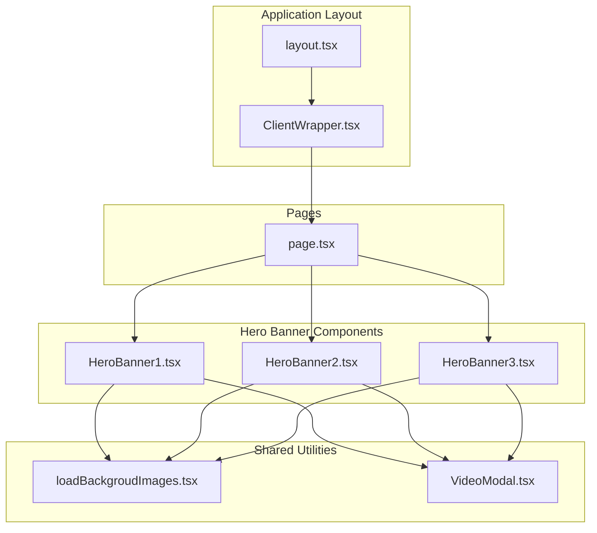
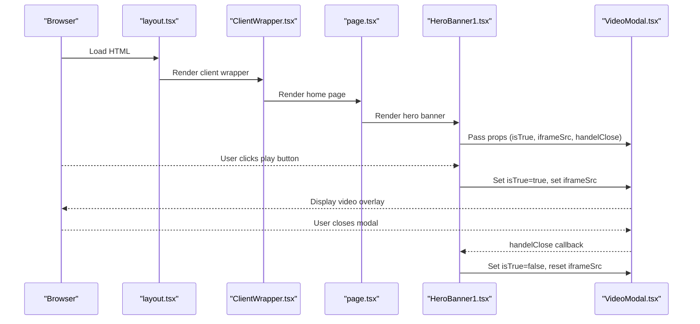
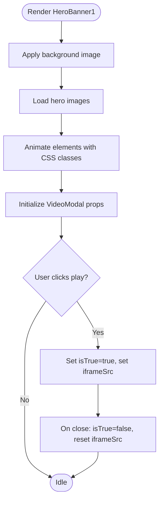
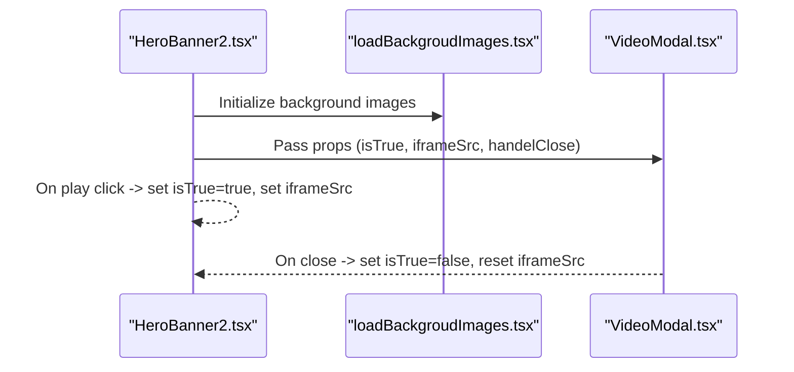
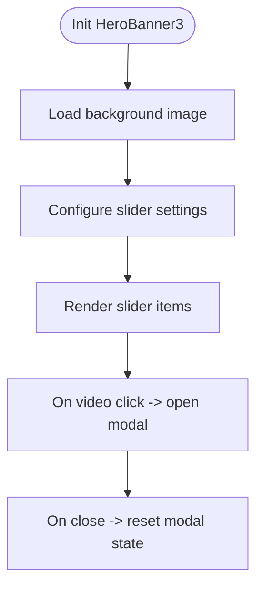
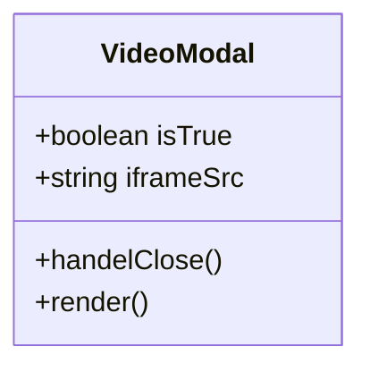
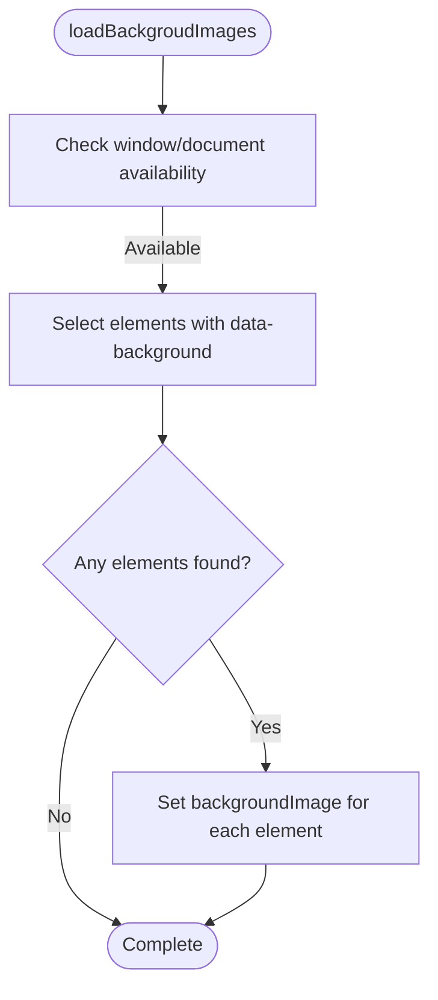
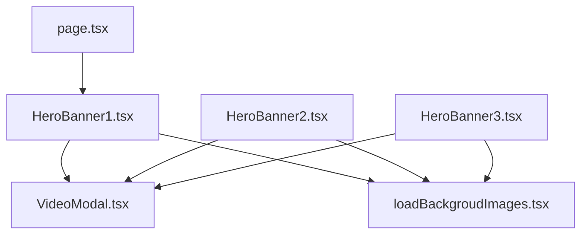

# Hero Banners and Featured Sections

<cite>
**Referenced Files in This Document**
- [HeroBanner1.tsx](file://src/app/Components/HeroBanner/HeroBanner1.tsx)
- [HeroBanner2.tsx](file://src/app/Components/HeroBanner/HeroBanner2.tsx)
- [HeroBanner3.tsx](file://src/app/Components/HeroBanner/HeroBanner3.tsx)
- [loadBackgroudImages.tsx](file://src/app/Components/Common/loadBackgroudImages.tsx)
- [VideoModal.tsx](file://src/app/Components/VideoModal/VideoModal.tsx)
- [page.tsx](file://src/app/page.tsx)
- [layout.tsx](file://src/app/layout.tsx)
- [ClientWrapper.tsx](file://src/app/Components/Common/ClientWrapper.tsx)
</cite>

## Table of Contents
1. [Introduction](#introduction)
2. [Project Structure](#project-structure)
3. [Core Components](#core-components)
4. [Architecture Overview](#architecture-overview)
5. [Detailed Component Analysis](#detailed-component-analysis)
6. [Dependency Analysis](#dependency-analysis)
7. [Performance Considerations](#performance-considerations)
8. [Troubleshooting Guide](#troubleshooting-guide)
9. [Conclusion](#conclusion)

## Introduction
This document provides comprehensive documentation for the hero banner components and featured sections used across the website. It details three distinct hero banner variants (HeroBanner1, HeroBanner2, HeroBanner3), their specific use cases, responsive design implementation, animation effects, call-to-action buttons, and how they adapt across different screen sizes. It also explains component composition patterns, prop configurations, integration with other page elements, and practical examples of content management for hero sections that drive user engagement.

## Project Structure
The hero banner components are located under the Components/HeroBanner directory and are integrated into the main application layout and pages. The hero banners rely on shared utilities such as background image loading and a modal component for embedded videos.

**Diagram sources**
- [layout.tsx](file://src/app/layout.tsx#L14-L46)
- [ClientWrapper.tsx](file://src/app/Components/Common/ClientWrapper.tsx#L4-L10)
- [page.tsx](file://src/app/page.tsx#L24-L72)
- [HeroBanner1.tsx](file://src/app/Components/HeroBanner/HeroBanner1.tsx#L1-L127)
- [HeroBanner2.tsx](file://src/app/Components/HeroBanner/HeroBanner2.tsx#L1-L67)
- [HeroBanner3.tsx](file://src/app/Components/HeroBanner/HeroBanner3.tsx#L1-L120)
- [loadBackgroudImages.tsx](file://src/app/Components/Common/loadBackgroudImages.tsx#L1-L18)
- [VideoModal.tsx](file://src/app/Components/VideoModal/VideoModal.tsx#L1-L20)

**Section sources**
- [layout.tsx](file://src/app/layout.tsx#L14-L46)
- [ClientWrapper.tsx](file://src/app/Components/Common/ClientWrapper.tsx#L4-L10)
- [page.tsx](file://src/app/page.tsx#L24-L72)

## Core Components
This section introduces the three hero banner variants and their primary characteristics:
- HeroBanner1: A content-rich hero with animated thumbnails, rotating logos, statistics, and a video modal.
- HeroBanner2: A streamlined hero with a large thumbnail, client testimonials, and prominent call-to-action buttons.
- HeroBanner3: A dynamic hero featuring an auto-rotating image slider and a video modal.

Key integration points:
- All hero banners use a shared VideoModal component for embedded video playback.
- Background images are dynamically applied via a shared utility that reads data-background attributes.
- Responsive animations leverage CSS classes and external libraries (e.g., slick carousel for sliders).

**Section sources**
- [HeroBanner1.tsx](file://src/app/Components/HeroBanner/HeroBanner1.tsx#L1-L127)
- [HeroBanner2.tsx](file://src/app/Components/HeroBanner/HeroBanner2.tsx#L1-L67)
- [HeroBanner3.tsx](file://src/app/Components/HeroBanner/HeroBanner3.tsx#L1-L120)
- [VideoModal.tsx](file://src/app/Components/VideoModal/VideoModal.tsx#L1-L20)
- [loadBackgroudImages.tsx](file://src/app/Components/Common/loadBackgroudImages.tsx#L1-L18)

## Architecture Overview
The hero banners are rendered on the home page and integrate with the global layout and client-side wrappers. The VideoModal component manages the overlay and iframe lifecycle, while the background image loader applies styles based on data-background attributes.

**Diagram sources**
- [layout.tsx](file://src/app/layout.tsx#L14-L46)
- [ClientWrapper.tsx](file://src/app/Components/Common/ClientWrapper.tsx#L4-L10)
- [page.tsx](file://src/app/page.tsx#L24-L72)
- [HeroBanner1.tsx](file://src/app/Components/HeroBanner/HeroBanner1.tsx#L117-L121)
- [VideoModal.tsx](file://src/app/Components/VideoModal/VideoModal.tsx#L1-L20)

## Detailed Component Analysis

### HeroBanner1
HeroBanner1 emphasizes storytelling, statistics, and engagement through interactive elements:
- Composition pattern:
  - Background image applied via inline style.
  - Animated thumbnail with decorative SVG overlay.
  - Rotating logo with arrow indicator.
  - Statistics display (sales growth).
  - Social links and video modal trigger.
- Animation and responsiveness:
  - Uses CSS animation classes for fade and zoom effects.
  - Responsive image sizing with Next.js Image component.
- Call-to-action buttons:
  - Rotating logo link to internal pages.
  - External links for services and contact.
- Integration:
  - Uses VideoModal for embedded video playback.
  - Applies background images via loadBackgroudImages utility.

**Diagram sources**
- [HeroBanner1.tsx](file://src/app/Components/HeroBanner/HeroBanner1.tsx#L22-L127)
- [VideoModal.tsx](file://src/app/Components/VideoModal/VideoModal.tsx#L1-L20)
- [loadBackgroudImages.tsx](file://src/app/Components/Common/loadBackgroudImages.tsx#L1-L18)

**Section sources**
- [HeroBanner1.tsx](file://src/app/Components/HeroBanner/HeroBanner1.tsx#L1-L127)
- [VideoModal.tsx](file://src/app/Components/VideoModal/VideoModal.tsx#L1-L20)
- [loadBackgroudImages.tsx](file://src/app/Components/Common/loadBackgroudImages.tsx#L1-L18)

### HeroBanner2
HeroBanner2 focuses on a clean, impactful presentation with a strong visual focal point:
- Composition pattern:
  - Full-width container with background image loaded via data-background.
  - Large hero image with review badge overlay.
  - White-themed content with bold typography and call-to-action buttons.
  - Marketing graph placeholder and decorative rocket shape.
- Animation and responsiveness:
  - Fade and slide animations for text and buttons.
  - Responsive text and spacing adjustments.
- Call-to-action buttons:
  - Primary service navigation.
  - Secondary video play button.
- Integration:
  - Uses VideoModal for embedded video playback.
  - Applies background images via loadBackgroudImages utility.

**Diagram sources**
- [HeroBanner2.tsx](file://src/app/Components/HeroBanner/HeroBanner2.tsx#L27-L64)
- [loadBackgroudImages.tsx](file://src/app/Components/Common/loadBackgroudImages.tsx#L1-L18)
- [VideoModal.tsx](file://src/app/Components/VideoModal/VideoModal.tsx#L1-L20)

**Section sources**
- [HeroBanner2.tsx](file://src/app/Components/HeroBanner/HeroBanner2.tsx#L1-L67)
- [VideoModal.tsx](file://src/app/Components/VideoModal/VideoModal.tsx#L1-L20)
- [loadBackgroudImages.tsx](file://src/app/Components/Common/loadBackgroudImages.tsx#L1-L18)

### HeroBanner3
HeroBanner3 highlights dynamic content with an auto-rotating image slider:
- Composition pattern:
  - Background image loaded via data-background.
  - Text content with stylized typography and video block.
  - Auto-playing slider with responsive breakpoints.
  - Client information display alongside buttons.
- Animation and responsiveness:
  - Slider uses external library with autoplay and responsive settings.
  - Animations for text and buttons.
- Call-to-action buttons:
  - Primary contact link.
  - Client count display.
- Integration:
  - Uses VideoModal for embedded video playback.
  - Applies background images via loadBackgroudImages utility.

**Diagram sources**
- [HeroBanner3.tsx](file://src/app/Components/HeroBanner/HeroBanner3.tsx#L66-L118)
- [loadBackgroudImages.tsx](file://src/app/Components/Common/loadBackgroudImages.tsx#L1-L18)
- [VideoModal.tsx](file://src/app/Components/VideoModal/VideoModal.tsx#L1-L20)

**Section sources**
- [HeroBanner3.tsx](file://src/app/Components/HeroBanner/HeroBanner3.tsx#L1-L120)
- [VideoModal.tsx](file://src/app/Components/VideoModal/VideoModal.tsx#L1-L20)
- [loadBackgroudImages.tsx](file://src/app/Components/Common/loadBackgroudImages.tsx#L1-L18)

### VideoModal Component
The VideoModal component provides a reusable overlay for embedded video playback:
- Props:
  - isTrue: Controls modal visibility.
  - iframeSrc: Source URL for the embedded video.
  - handelClose: Callback to close the modal.
- Behavior:
  - Toggles active class based on isTrue.
  - Renders an iframe with the provided source.
  - Provides a close button to trigger handelClose.

**Diagram sources**
- [VideoModal.tsx](file://src/app/Components/VideoModal/VideoModal.tsx#L1-L20)

**Section sources**
- [VideoModal.tsx](file://src/app/Components/VideoModal/VideoModal.tsx#L1-L20)

### Background Image Loading Utility
The loadBackgroudImages utility dynamically applies background images to elements with a data-background attribute:
- Purpose:
  - Convert data-background attributes to inline CSS background-image styles.
- Behavior:
  - Client-side only execution.
  - Iterates over elements with data-background and sets backgroundImage accordingly.

**Diagram sources**
- [loadBackgroudImages.tsx](file://src/app/Components/Common/loadBackgroudImages.tsx#L1-L18)

**Section sources**
- [loadBackgroudImages.tsx](file://src/app/Components/Common/loadBackgroudImages.tsx#L1-L18)

## Dependency Analysis
The hero banners share common dependencies and patterns:
- Shared utilities:
  - loadBackgroudImages: Applied in HeroBanner1, HeroBanner2, and HeroBanner3.
  - VideoModal: Used by all three hero banners for video playback.
- Page integration:
  - HeroBanner1 is rendered on the home page.
  - HeroBanner2 and HeroBanner3 are available for reuse across inner pages and future implementations.
- External libraries:
  - HeroBanner3 integrates a slider library for responsive image rotation.

**Diagram sources**
- [HeroBanner1.tsx](file://src/app/Components/HeroBanner/HeroBanner1.tsx#L1-L127)
- [HeroBanner2.tsx](file://src/app/Components/HeroBanner/HeroBanner2.tsx#L1-L67)
- [HeroBanner3.tsx](file://src/app/Components/HeroBanner/HeroBanner3.tsx#L1-L120)
- [VideoModal.tsx](file://src/app/Components/VideoModal/VideoModal.tsx#L1-L20)
- [loadBackgroudImages.tsx](file://src/app/Components/Common/loadBackgroudImages.tsx#L1-L18)
- [page.tsx](file://src/app/page.tsx#L24-L72)

**Section sources**
- [HeroBanner1.tsx](file://src/app/Components/HeroBanner/HeroBanner1.tsx#L1-L127)
- [HeroBanner2.tsx](file://src/app/Components/HeroBanner/HeroBanner2.tsx#L1-L67)
- [HeroBanner3.tsx](file://src/app/Components/HeroBanner/HeroBanner3.tsx#L1-L120)
- [VideoModal.tsx](file://src/app/Components/VideoModal/VideoModal.tsx#L1-L20)
- [loadBackgroudImages.tsx](file://src/app/Components/Common/loadBackgroudImages.tsx#L1-L18)
- [page.tsx](file://src/app/page.tsx#L24-L72)

## Performance Considerations
- Lazy loading and resource optimization:
  - Next.js Image component is used across hero banners for automatic optimization and lazy loading.
- Background image handling:
  - loadBackgroudImages runs client-side to avoid hydration mismatches and ensures proper rendering of background images.
- Video modal:
  - Iframe is loaded only when the modal is opened, minimizing initial payload.
- Slider performance:
  - HeroBanner3 uses a responsive slider configuration; ensure breakpoints align with actual viewport widths to avoid unnecessary reflows.

[No sources needed since this section provides general guidance]

## Troubleshooting Guide
- Background images not appearing:
  - Verify data-background attributes are present and point to valid image paths.
  - Confirm loadBackgroudImages executes after DOM hydration.
- Video modal does not open:
  - Ensure the play button triggers the toggle state and iframeSrc update.
  - Check that the modal receives isTrue and handelClose props correctly.
- Slider not functioning:
  - Confirm the slider library is imported and initialized.
  - Validate responsive settings and breakpoints match intended behavior.

**Section sources**
- [loadBackgroudImages.tsx](file://src/app/Components/Common/loadBackgroudImages.tsx#L1-L18)
- [VideoModal.tsx](file://src/app/Components/VideoModal/VideoModal.tsx#L1-L20)
- [HeroBanner3.tsx](file://src/app/Components/HeroBanner/HeroBanner3.tsx#L27-L56)

## Conclusion
The hero banner components provide flexible, reusable foundations for showcasing brand messaging, driving engagement, and integrating interactive elements like videos and sliders. HeroBanner1 emphasizes rich storytelling and statistics, HeroBanner2 offers a clean, impactful presentation, and HeroBanner3 delivers dynamic visual content through an auto-rotating slider. Together with shared utilities and modal components, they form a cohesive system for creating compelling landing experiences across the site.