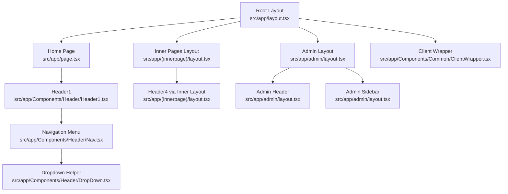
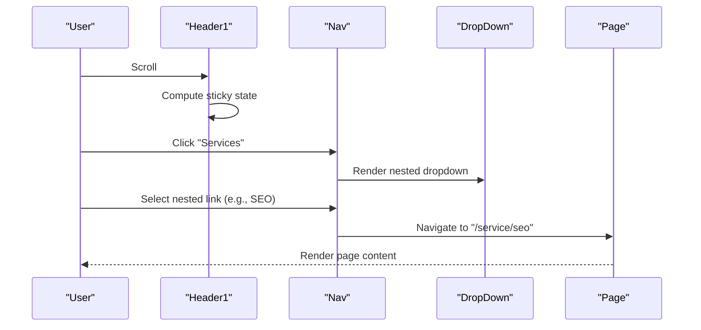
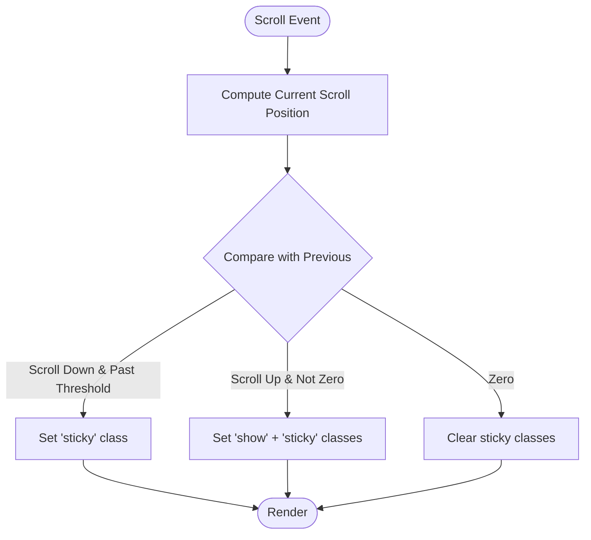
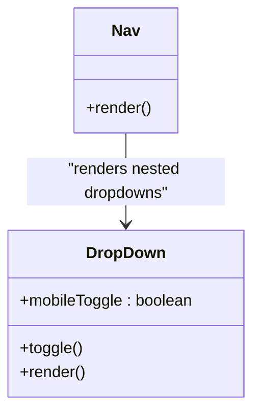
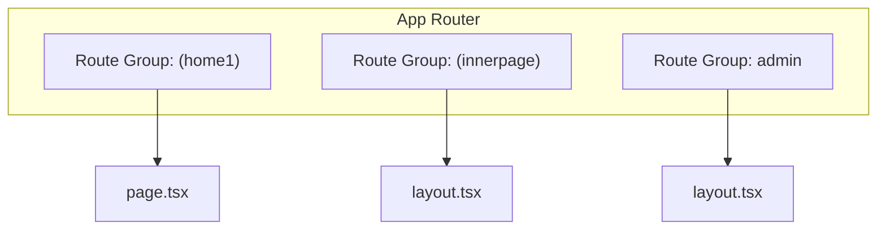
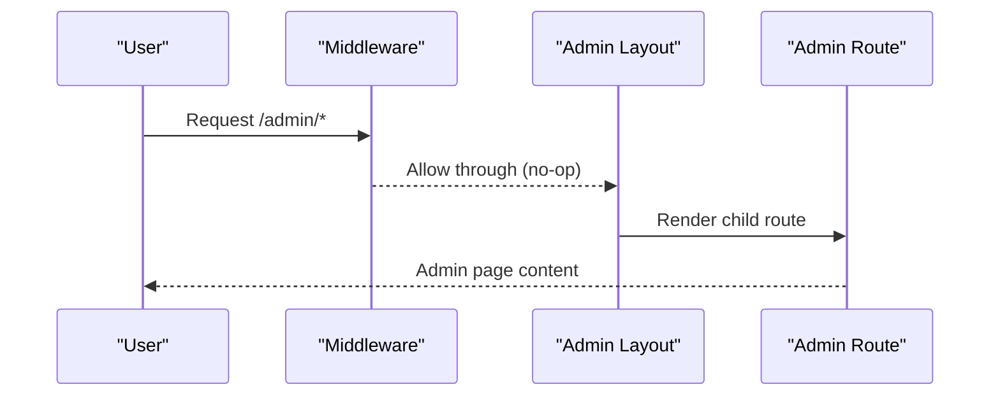
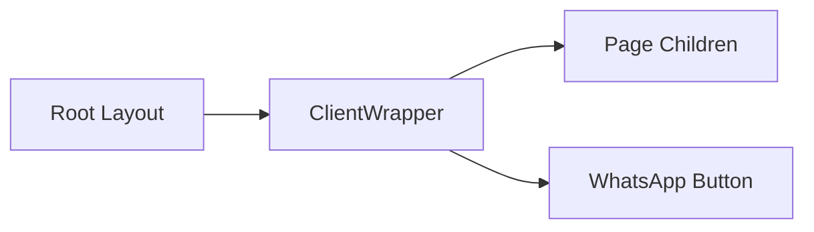
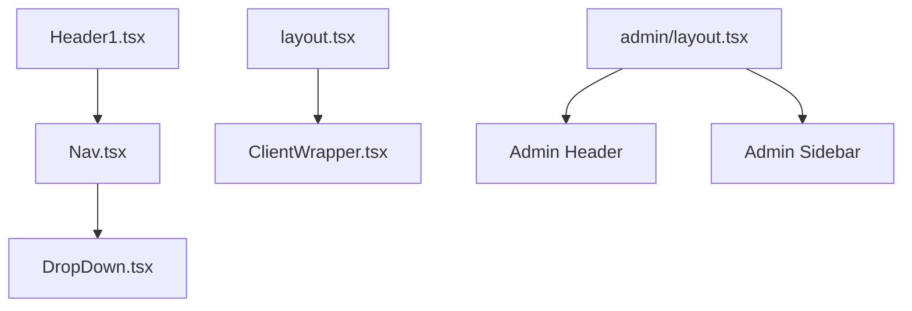

# Page Structure and Navigation

<cite>
**Referenced Files in This Document**
- [src/app/layout.tsx](file://src/app/layout.tsx)
- [src/app/page.tsx](file://src/app/page.tsx)
- [src/app/admin/layout.tsx](file://src/app/admin/layout.tsx)
- [src/app/Components/Header/Header1.tsx](file://src/app/Components/Header/Header1.tsx)
- [src/app/Components/Header/Nav.tsx](file://src/app/Components/Header/Nav.tsx)
- [src/app/Components/Header/DropDown.tsx](file://src/app/Components/Header/DropDown.tsx)
- [src/app/Components/Common/ClientWrapper.tsx](file://src/app/Components/Common/ClientWrapper.tsx)
- [src/app/(innerpage)/layout.tsx](file://src/app/(innerpage)/layout.tsx)
- [middleware.ts](file://middleware.ts)
</cite>

## Table of Contents
1. [Introduction](#introduction)
2. [Project Structure](#project-structure)
3. [Core Components](#core-components)
4. [Architecture Overview](#architecture-overview)
5. [Detailed Component Analysis](#detailed-component-analysis)
6. [Dependency Analysis](#dependency-analysis)
7. [Performance Considerations](#performance-considerations)
8. [Troubleshooting Guide](#troubleshooting-guide)
9. [Conclusion](#conclusion)

## Introduction
This document explains the Next.js App Router-based page structure and navigation system for the website. It covers how pages are organized under route groups, the layout hierarchy, navigation components (including dropdown menus and header variations), responsive mobile navigation, and integration points with the overall site structure. It also outlines page transitions, active link states, and accessibility features.

## Project Structure
The application uses Next.js App Router with conventional file-based routing and route groups. The root-level layout initializes global styles and wraps children with a client-side wrapper. Route groups organize pages into logical areas such as the home area and inner pages. An admin area is separated via its own layout and middleware targeting admin routes.

**Diagram sources**
- [src/app/layout.tsx](file://src/app/layout.tsx#L1-L47)
- [src/app/page.tsx](file://src/app/page.tsx#L1-L75)
- [src/app/(innerpage)/layout.tsx](file://src/app/(innerpage)/layout.tsx#L1-L15)
- [src/app/admin/layout.tsx](file://src/app/admin/layout.tsx#L1-L23)
- [src/app/Components/Header/Header1.tsx](file://src/app/Components/Header/Header1.tsx#L1-L94)
- [src/app/Components/Header/Nav.tsx](file://src/app/Components/Header/Nav.tsx#L1-L111)
- [src/app/Components/Header/DropDown.tsx](file://src/app/Components/Header/DropDown.tsx#L1-L25)
- [src/app/Components/Common/ClientWrapper.tsx](file://src/app/Components/Common/ClientWrapper.tsx#L1-L11)

**Section sources**
- [src/app/layout.tsx](file://src/app/layout.tsx#L1-L47)
- [src/app/page.tsx](file://src/app/page.tsx#L1-L75)
- [src/app/(innerpage)/layout.tsx](file://src/app/(innerpage)/layout.tsx#L1-L15)
- [src/app/admin/layout.tsx](file://src/app/admin/layout.tsx#L1-L23)

## Core Components
- Root Layout: Initializes fonts, CSS, and global scripts; wraps children with a client-side wrapper.
- Home Page: Composes the homepage with SEO metadata and multiple feature sections.
- Inner Pages Layout: Provides a default layout for inner pages with a header/footer pair.
- Admin Layout: Provides a two-column admin shell with header and sidebar.
- Header1: Implements sticky header behavior, mobile toggle, and primary navigation.
- Nav: Renders the main navigation links and nested dropdown structure.
- DropDown: A reusable helper for toggling nested dropdowns within Nav.
- ClientWrapper: Injects client-side elements (e.g., floating action buttons) globally.

**Section sources**
- [src/app/layout.tsx](file://src/app/layout.tsx#L1-L47)
- [src/app/page.tsx](file://src/app/page.tsx#L1-L75)
- [src/app/(innerpage)/layout.tsx](file://src/app/(innerpage)/layout.tsx#L1-L15)
- [src/app/admin/layout.tsx](file://src/app/admin/layout.tsx#L1-L23)
- [src/app/Components/Header/Header1.tsx](file://src/app/Components/Header/Header1.tsx#L1-L94)
- [src/app/Components/Header/Nav.tsx](file://src/app/Components/Header/Nav.tsx#L1-L111)
- [src/app/Components/Header/DropDown.tsx](file://src/app/Components/Header/DropDown.tsx#L1-L25)
- [src/app/Components/Common/ClientWrapper.tsx](file://src/app/Components/Common/ClientWrapper.tsx#L1-L11)

## Architecture Overview
The navigation architecture centers around a sticky header with a mobile-friendly hamburger menu. The Nav component defines top-level links and leverages DropDown to render nested menus. The root layout ensures global styles and client-side initialization, while route groups isolate inner pages and admin areas.

**Diagram sources**
- [src/app/Components/Header/Header1.tsx](file://src/app/Components/Header/Header1.tsx#L12-L42)
- [src/app/Components/Header/Nav.tsx](file://src/app/Components/Header/Nav.tsx#L13-L89)
- [src/app/Components/Header/DropDown.tsx](file://src/app/Components/Header/DropDown.tsx#L1-L25)

## Detailed Component Analysis

### Sticky Header and Responsive Behavior
- Sticky behavior: Uses scroll position to toggle CSS classes for hiding/showing the header on scroll down/up.
- Mobile toggle: Controls the active state of the mobile menu and nested dropdowns.
- Optimized scroll handler: Debounces scroll events using requestAnimationFrame for smooth performance.

**Diagram sources**
- [src/app/Components/Header/Header1.tsx](file://src/app/Components/Header/Header1.tsx#L12-L22)

**Section sources**
- [src/app/Components/Header/Header1.tsx](file://src/app/Components/Header/Header1.tsx#L12-L42)

### Navigation Menu and Dropdown System
- Top-level links: Home, Services, Projects, About Us, Contact Us.
- Nested dropdowns: Services branch contains subcategories grouped by domain (Digital Marketing, Web Development, Mobile Application).
- Active link behavior: Each link triggers a click handler that collapses mobile menus upon selection.
- Reusable dropdown toggle: DropDown component manages its own mobile toggle state and renders children lists.

**Diagram sources**
- [src/app/Components/Header/Nav.tsx](file://src/app/Components/Header/Nav.tsx#L1-L111)
- [src/app/Components/Header/DropDown.tsx](file://src/app/Components/Header/DropDown.tsx#L1-L25)

**Section sources**
- [src/app/Components/Header/Nav.tsx](file://src/app/Components/Header/Nav.tsx#L1-L111)
- [src/app/Components/Header/DropDown.tsx](file://src/app/Components/Header/DropDown.tsx#L1-L25)

### Route Groups and Layout Hierarchy
- Home route group: Contains the root page and related routes under the home area.
- Inner pages group: A named route group that applies a default layout to inner pages.
- Admin area: Separate route group with its own layout and middleware targeting admin paths.

**Diagram sources**
- [src/app/page.tsx](file://src/app/page.tsx#L1-L75)
- [src/app/(innerpage)/layout.tsx](file://src/app/(innerpage)/layout.tsx#L1-L15)
- [src/app/admin/layout.tsx](file://src/app/admin/layout.tsx#L1-L23)

**Section sources**
- [src/app/page.tsx](file://src/app/page.tsx#L1-L75)
- [src/app/(innerpage)/layout.tsx](file://src/app/(innerpage)/layout.tsx#L1-L15)
- [src/app/admin/layout.tsx](file://src/app/admin/layout.tsx#L1-L23)

### Admin Navigation and Middleware
- Admin layout: Provides a two-column shell with header and sidebar, rendering child routes inside a main content area.
- Middleware: Currently disabled for static hosting but configured to target admin routes.

**Diagram sources**
- [middleware.ts](file://middleware.ts#L1-L15)
- [src/app/admin/layout.tsx](file://src/app/admin/layout.tsx#L1-L23)

**Section sources**
- [middleware.ts](file://middleware.ts#L1-L15)
- [src/app/admin/layout.tsx](file://src/app/admin/layout.tsx#L1-L23)

### Client Wrapper and Global Client Elements
- Client wrapper: Ensures client-side components are rendered alongside page content.
- WhatsApp button: Injected globally via the client wrapper for quick access.

**Diagram sources**
- [src/app/layout.tsx](file://src/app/layout.tsx#L1-L47)
- [src/app/Components/Common/ClientWrapper.tsx](file://src/app/Components/Common/ClientWrapper.tsx#L1-L11)

**Section sources**
- [src/app/layout.tsx](file://src/app/layout.tsx#L1-L47)
- [src/app/Components/Common/ClientWrapper.tsx](file://src/app/Components/Common/ClientWrapper.tsx#L1-L11)

## Dependency Analysis
- Header1 depends on Nav and uses scroll handlers to compute sticky state.
- Nav composes DropDown for nested menus and uses Next.js Link for navigation.
- Root layout depends on ClientWrapper to inject client-side elements.
- Admin layout depends on admin-specific header and sidebar components.

**Diagram sources**
- [src/app/Components/Header/Header1.tsx](file://src/app/Components/Header/Header1.tsx#L1-L94)
- [src/app/Components/Header/Nav.tsx](file://src/app/Components/Header/Nav.tsx#L1-L111)
- [src/app/Components/Header/DropDown.tsx](file://src/app/Components/Header/DropDown.tsx#L1-L25)
- [src/app/layout.tsx](file://src/app/layout.tsx#L1-L47)
- [src/app/Components/Common/ClientWrapper.tsx](file://src/app/Components/Common/ClientWrapper.tsx#L1-L11)
- [src/app/admin/layout.tsx](file://src/app/admin/layout.tsx#L1-L23)

**Section sources**
- [src/app/Components/Header/Header1.tsx](file://src/app/Components/Header/Header1.tsx#L1-L94)
- [src/app/Components/Header/Nav.tsx](file://src/app/Components/Header/Nav.tsx#L1-L111)
- [src/app/Components/Header/DropDown.tsx](file://src/app/Components/Header/DropDown.tsx#L1-L25)
- [src/app/layout.tsx](file://src/app/layout.tsx#L1-L47)
- [src/app/Components/Common/ClientWrapper.tsx](file://src/app/Components/Common/ClientWrapper.tsx#L1-L11)
- [src/app/admin/layout.tsx](file://src/app/admin/layout.tsx#L1-L23)

## Performance Considerations
- Scroll event optimization: Uses requestAnimationFrame to debounce scroll handling for smoother performance.
- Minimal re-renders: DropDown maintains its own toggle state locally to avoid unnecessary parent re-renders.
- Static hosting compatibility: Middleware is intentionally disabled to work with static hosting environments.

[No sources needed since this section provides general guidance]

## Troubleshooting Guide
- Sticky header not activating: Verify scroll threshold and class toggling logic in the header component.
- Mobile menu not collapsing after selection: Ensure the click handler on each link calls the mobile toggle callback.
- Admin routes inaccessible: Confirm middleware configuration targets admin paths and that the middleware is not blocking requests.
- Styles missing: Check that global CSS imports are present in the root layout and that font loading is successful.

**Section sources**
- [src/app/Components/Header/Header1.tsx](file://src/app/Components/Header/Header1.tsx#L12-L42)
- [src/app/Components/Header/Nav.tsx](file://src/app/Components/Header/Nav.tsx#L8-L10)
- [middleware.ts](file://middleware.ts#L10-L14)
- [src/app/layout.tsx](file://src/app/layout.tsx#L1-L47)

## Conclusion
The navigation system leverages Next.js App Router route groups, a sticky header with responsive behavior, and nested dropdown menus implemented via a reusable helper. The layout hierarchy cleanly separates home, inner pages, and admin areas, while middleware supports future server-side needs. The design emphasizes performance and static hosting compatibility, with straightforward mechanisms for active link states and client-side enhancements.