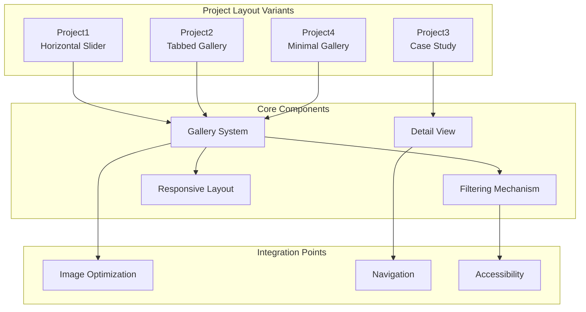
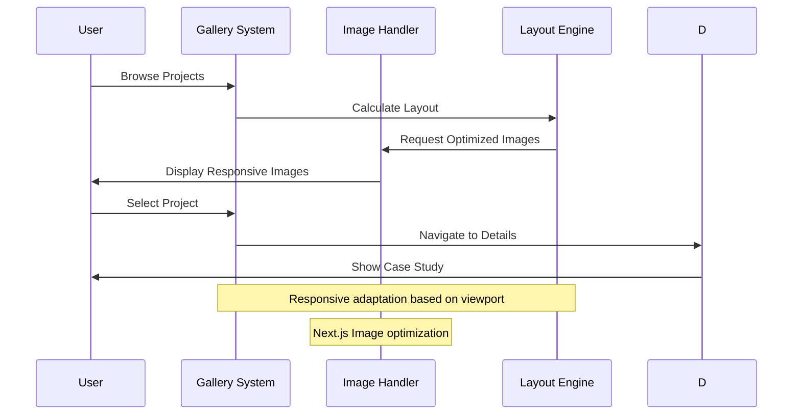
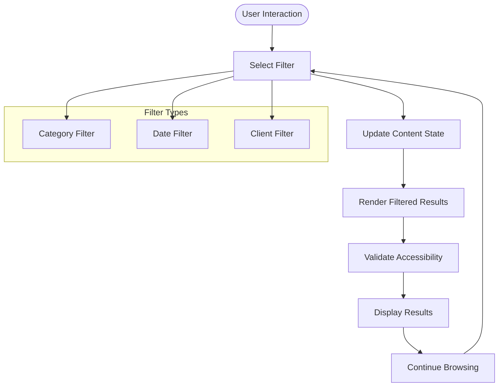
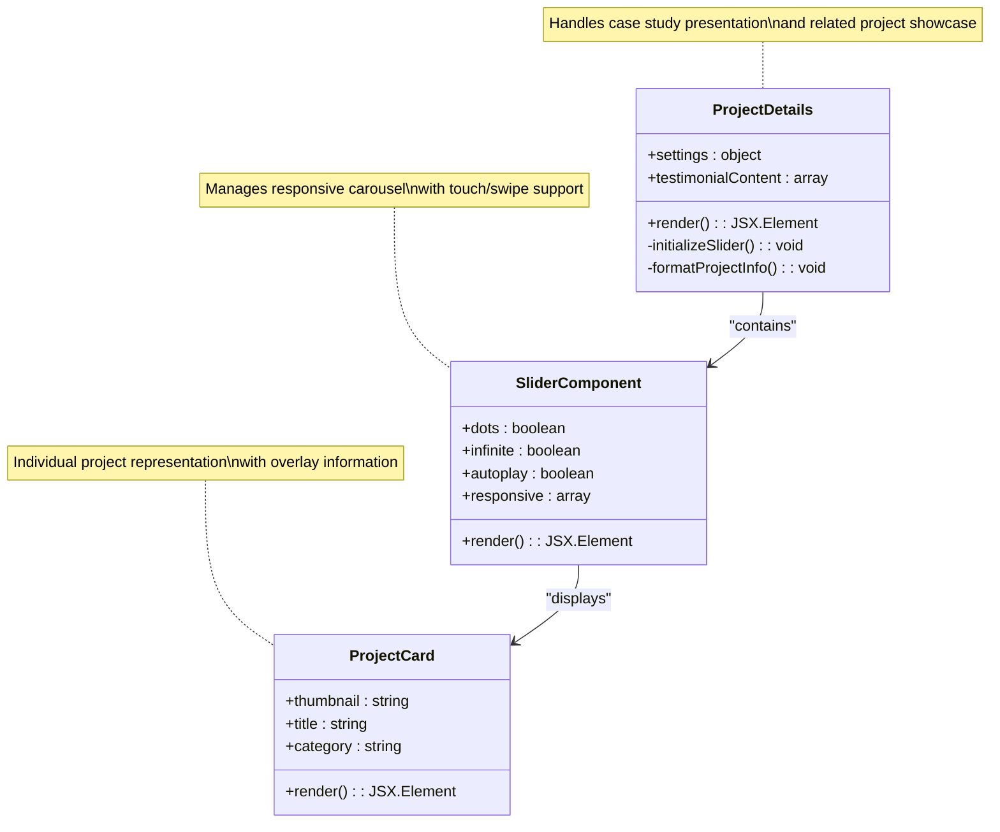
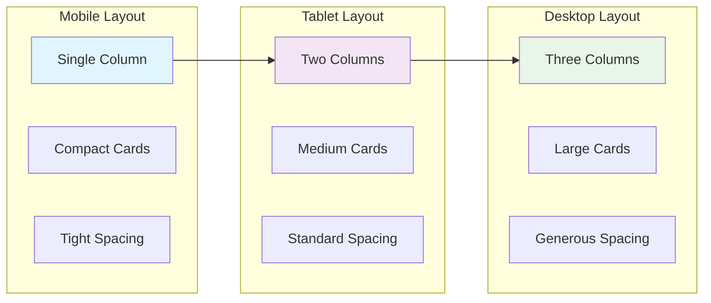
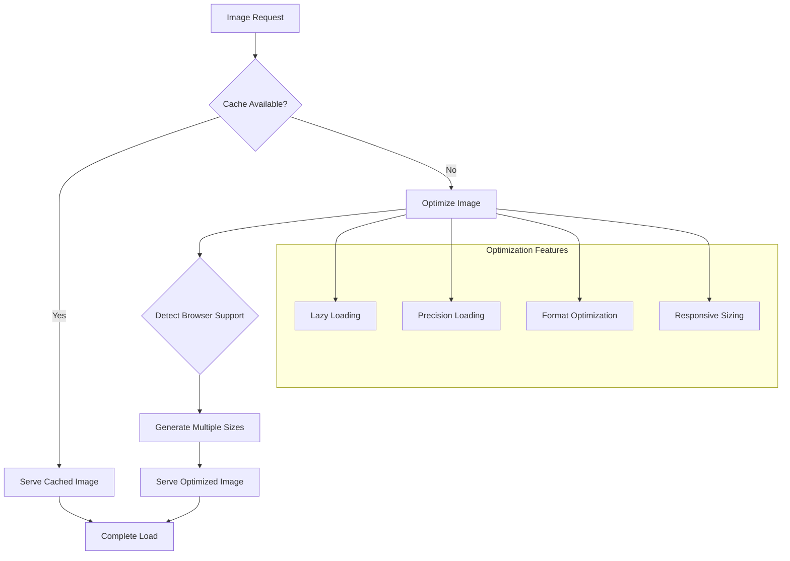
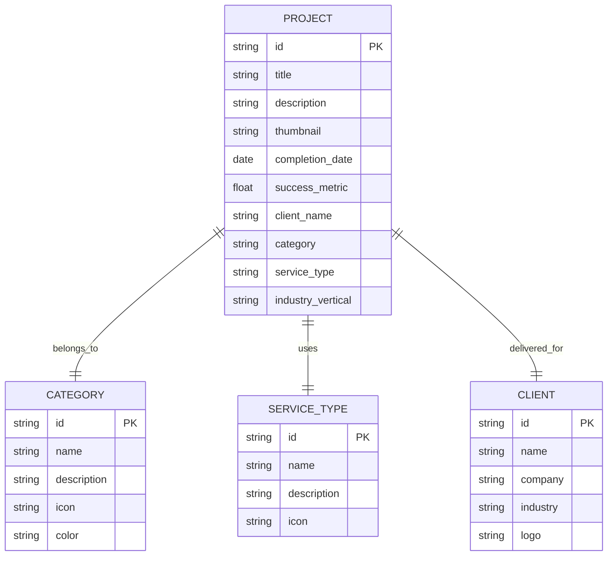
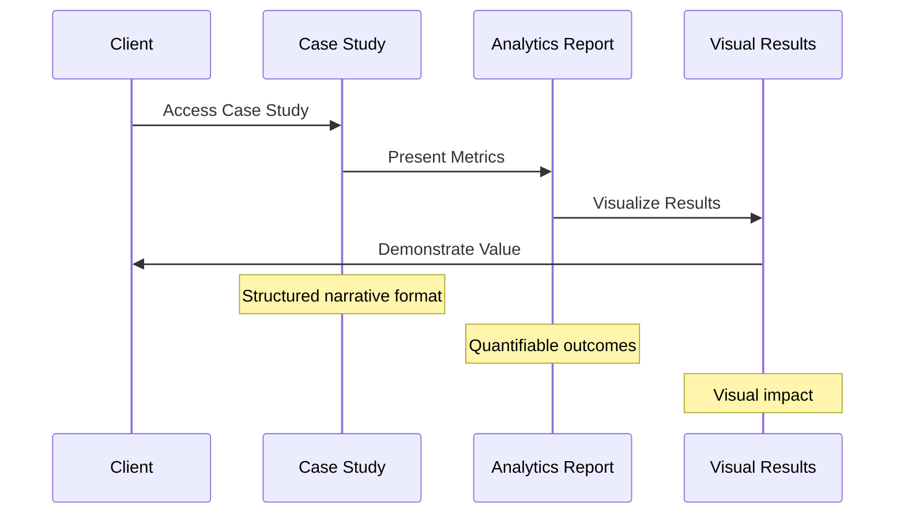
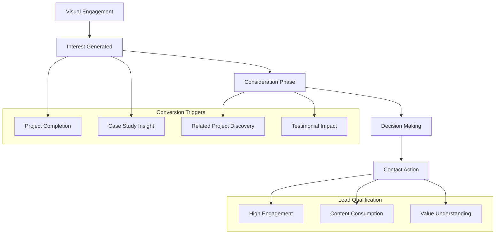
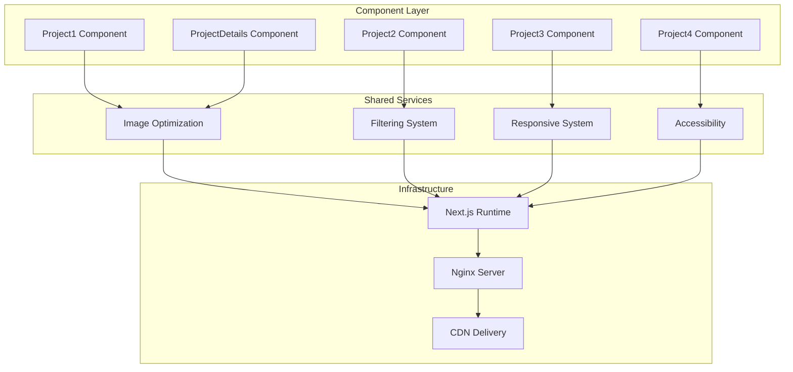

# Portfolio and Project Sections

<cite>
**Referenced Files in This Document**
- [Project1.tsx](file://src/app/Components/Project/Project1.tsx)
- [Project2.tsx](file://src/app/Components/Project/Project2.tsx)
- [Project3.tsx](file://src/app/Components/Project/Project3.tsx)
- [Project4.tsx](file://src/app/Components/Project/Project4.tsx)
- [ProjectDetails.tsx](file://src/app/Components/ProjectDetails/ProjectDetails.tsx)
</cite>

## Table of Contents
1. [Introduction](#introduction)
2. [Project Layout Variants Overview](#project-layout-variants-overview)
3. [Project Gallery Systems](#project-gallery-systems)
4. [Filtering Mechanisms](#filtering-mechanisms)
5. [Project Detail Views](#project-detail-views)
6. [Responsive Grid Layouts](#responsive-grid-layouts)
7. [Image Optimization Integration](#image-optimization-integration)
8. [Project Categorization and Presentation](#project-categorization-and-presentation)
9. [Case Study Components](#case-study-components)
10. [Lead Generation Through Visual Storytelling](#lead-generation-through-visual-storytelling)
11. [Implementation Architecture](#implementation-architecture)
12. [Performance Considerations](#performance-considerations)
13. [Troubleshooting Guide](#troubleshooting-guide)
14. [Conclusion](#conclusion)

## Introduction

The portfolio and project showcase sections form the cornerstone of AT Tech Global's digital presence, serving as a comprehensive visual narrative of their digital marketing expertise and client success stories. This documentation provides an in-depth analysis of the four distinct project layout variants, their implementations, and the sophisticated systems that drive lead generation through compelling visual storytelling.

The project showcase encompasses multiple presentation formats, from dynamic horizontal sliders to interactive tabbed galleries, each designed to highlight different aspects of the agency's capabilities while maintaining optimal user experience across all devices. The system seamlessly integrates with Next.js image optimization, responsive design principles, and modern web performance standards.

## Project Layout Variants Overview

The portfolio system implements four distinct layout variants, each targeting specific user engagement patterns and showcasing different aspects of the agency's work:

### Project1: Horizontal Slider Gallery
The first variant employs a continuous horizontal slider mechanism featuring six project cards arranged in two parallel scrolling rows. This layout emphasizes motion and fluidity, creating an engaging browsing experience that encourages users to explore multiple projects simultaneously.

### Project2: Tabbed Interactive Gallery
This variant introduces a tabbed interface system with filtered content display. The layout includes category-based filtering capabilities, allowing users to navigate between different project types while maintaining visual consistency and accessibility.

### Project3: Case Study Showcase
The third variant focuses specifically on detailed case study presentations, featuring prominent project thumbnails with overlay information and category tagging. This layout prioritizes storytelling and detailed project analysis over bulk browsing.

### Project4: Minimal Tabbed Gallery
A streamlined version of the tabbed system that emphasizes clean presentation without extensive decorative elements, focusing purely on project display and navigation.

**Diagram sources**
- [Project1.tsx](file://src/app/Components/Project/Project1.tsx#L1-L53)
- [Project2.tsx](file://src/app/Components/Project/Project2.tsx#L1-L65)
- [Project3.tsx](file://src/app/Components/Project/Project3.tsx#L1-L68)
- [Project4.tsx](file://src/app/Components/Project/Project4.tsx#L1-L51)

**Section sources**
- [Project1.tsx](file://src/app/Components/Project/Project1.tsx#L1-L53)
- [Project2.tsx](file://src/app/Components/Project/Project2.tsx#L1-L65)
- [Project3.tsx](file://src/app/Components/Project/Project3.tsx#L1-L68)
- [Project4.tsx](file://src/app/Components/Project/Project4.tsx#L1-L51)

## Project Gallery Systems

The gallery systems implement sophisticated content presentation mechanisms designed to maximize visual impact while maintaining optimal performance. Each variant employs different architectural approaches to achieve specific user experience goals.

### Horizontal Slider Implementation
The horizontal slider system utilizes a dual-row approach where identical content is duplicated to create seamless looping animations. The implementation leverages Next.js Image component for optimized image loading with automatic priority handling for visible items.

### Tabbed Gallery Architecture
The tabbed gallery system incorporates category-based filtering with smooth transitions between content states. The layout maintains consistent spacing and alignment while supporting keyboard navigation and screen reader compatibility.

### Responsive Content Management
All gallery systems implement responsive design principles, automatically adjusting content density and layout based on viewport dimensions. The systems utilize CSS Grid and Flexbox for optimal cross-device compatibility.

**Diagram sources**
- [Project1.tsx](file://src/app/Components/Project/Project1.tsx#L28-L47)
- [Project2.tsx](file://src/app/Components/Project/Project2.tsx#L35-L53)
- [Project3.tsx](file://src/app/Components/Project/Project3.tsx#L25-L50)

**Section sources**
- [Project1.tsx](file://src/app/Components/Project/Project1.tsx#L28-L47)
- [Project2.tsx](file://src/app/Components/Project/Project2.tsx#L35-L53)
- [Project3.tsx](file://src/app/Components/Project/Project3.tsx#L25-L50)
- [Project4.tsx](file://src/app/Components/Project/Project4.tsx#L21-L39)

## Filtering Mechanisms

The filtering systems provide intuitive navigation through project categories while maintaining performance and accessibility standards. Each variant implements filtering differently based on its primary use case.

### Category-Based Filtering
The tabbed gallery system supports category-based filtering through dedicated tab interfaces. Users can navigate between different project categories using clearly labeled tabs with visual indicators for active states.

### Dynamic Content Loading
Filtering operations trigger dynamic content updates without full page reloads, utilizing React's state management for efficient DOM manipulation and smooth transitions between filtered states.

### Accessibility Compliance
All filtering mechanisms maintain full keyboard navigation support and screen reader compatibility, ensuring inclusive access to project categorization features.

**Diagram sources**
- [Project2.tsx](file://src/app/Components/Project/Project2.tsx#L28-L33)
- [Project4.tsx](file://src/app/Components/Project/Project4.tsx#L17-L21)

**Section sources**
- [Project2.tsx](file://src/app/Components/Project/Project2.tsx#L28-L33)
- [Project4.tsx](file://src/app/Components/Project/Project4.tsx#L17-L21)

## Project Detail Views

The project detail view system provides comprehensive case study presentations with integrated related project showcases. The implementation balances detailed information display with visual appeal and performance optimization.

### Case Study Presentation
Each project detail page presents a structured narrative format including project information boxes, detailed descriptions, and challenge explanations. The layout maintains consistent typography hierarchy and visual emphasis on key project metrics.

### Related Projects Integration
The detail view incorporates a responsive slider showcasing related projects, enabling users to discover additional work samples without navigating away from the current case study. The slider adapts its configuration based on viewport size and device capabilities.

### Information Architecture
Project information is organized in a clear, scannable format using iconographic elements and structured lists. Each information block follows consistent patterns for client details, project categories, timelines, and location data.

**Diagram sources**
- [ProjectDetails.tsx](file://src/app/Components/ProjectDetails/ProjectDetails.tsx#L8-L37)
- [ProjectDetails.tsx](file://src/app/Components/ProjectDetails/ProjectDetails.tsx#L106-L114)

**Section sources**
- [ProjectDetails.tsx](file://src/app/Components/ProjectDetails/ProjectDetails.tsx#L48-L136)

## Responsive Grid Layouts

The responsive grid systems implement adaptive content distribution that optimizes project presentation across all device categories. The layouts dynamically adjust column counts, spacing, and content density based on viewport measurements.

### Mobile-First Design Approach
All grid layouts follow mobile-first principles, starting with single-column presentations on small screens and progressively increasing column counts for larger viewports. This ensures optimal readability and interaction patterns across all devices.

### Flexible Content Density
The grid systems automatically adjust content density based on available space, preventing overcrowding on smaller screens while maximizing information density on larger displays. This adaptive approach maintains visual balance regardless of device size.

### Touch-Friendly Interactions
Touch-friendly sizing and spacing ensure comfortable interaction on mobile devices, with appropriate tap targets and gesture support for navigation and content exploration.

**Diagram sources**
- [ProjectDetails.tsx](file://src/app/Components/ProjectDetails/ProjectDetails.tsx#L18-L36)

**Section sources**
- [ProjectDetails.tsx](file://src/app/Components/ProjectDetails/ProjectDetails.tsx#L18-L36)

## Image Optimization Integration

The portfolio system leverages Next.js Image optimization for superior performance and user experience. The implementation ensures optimal image delivery across all device pixel ratios and connection speeds.

### Automatic Image Optimization
All project images utilize Next.js Image component with automatic optimization, including responsive image generation, lazy loading, and format optimization. Priority handling ensures visible images load first during initial page rendering.

### Adaptive Image Loading
The system implements adaptive loading strategies where images above the fold receive priority loading while subsequent images use standard lazy loading. This approach minimizes initial page load time while maintaining visual continuity.

### Format Optimization
Images are automatically converted to modern formats (like WebP) when supported by the browser, reducing file sizes without compromising quality. The optimization system considers device capabilities and network conditions.

**Diagram sources**
- [Project1.tsx](file://src/app/Components/Project/Project1.tsx#L33)
- [Project2.tsx](file://src/app/Components/Project/Project2.tsx#L41)

**Section sources**
- [Project1.tsx](file://src/app/Components/Project/Project1.tsx#L33)
- [Project2.tsx](file://src/app/Components/Project/Project2.tsx#L41)
- [Project3.tsx](file://src/app/Components/Project/Project3.tsx#L29)

## Project Categorization and Presentation

The project categorization system organizes client work into logical groupings that reflect different service offerings and industry specializations. The presentation format varies based on the chosen layout variant while maintaining consistent information architecture.

### Multi-Dimensional Categories
Projects are categorized using multiple dimensions including service type, industry vertical, technology stack, and project outcomes. This multi-layered approach enables precise filtering and discovery of relevant case studies.

### Visual Category Representation
Each category is represented through consistent visual elements including color coding, iconography, and layout variations. This visual taxonomy helps users quickly identify projects aligned with their interests or requirements.

### Outcome-Focused Presentation
The categorization emphasizes project outcomes and measurable results, positioning successful client achievements as the primary value proposition. This approach demonstrates capability through concrete evidence rather than generic descriptions.

**Diagram sources**
- [Project3.tsx](file://src/app/Components/Project/Project3.tsx#L7-L12)
- [Project2.tsx](file://src/app/Components/Project/Project2.tsx#L7-L14)

**Section sources**
- [Project3.tsx](file://src/app/Components/Project/Project3.tsx#L7-L12)
- [Project2.tsx](file://src/app/Components/Project/Project2.tsx#L7-L14)

## Case Study Components

The case study presentation system provides comprehensive project documentation that transforms raw results into compelling narratives. Each case study follows a structured format designed to communicate value, methodology, and outcomes effectively.

### Structured Narrative Framework
Case studies follow a consistent narrative arc covering problem identification, solution implementation, and measurable results. This framework helps potential clients understand the value proposition and anticipate similar outcomes.

### Data-Driven Results Display
Project outcomes are presented using clear metrics and visual representations, including before/after comparisons, performance improvements, and ROI calculations. This data-driven approach builds credibility and demonstrates tangible value.

### Methodology Transparency
The case study format includes detailed explanations of methodologies, technologies used, and strategic decisions. This transparency helps establish trust and demonstrates expertise in execution.

**Diagram sources**
- [ProjectDetails.tsx](file://src/app/Components/ProjectDetails/ProjectDetails.tsx#L55-L95)

**Section sources**
- [ProjectDetails.tsx](file://src/app/Components/ProjectDetails/ProjectDetails.tsx#L55-L102)

## Lead Generation Through Visual Storytelling

The portfolio system is architecturally designed to convert visual engagement into qualified lead generation through strategic content placement, navigation optimization, and conversion-focused design elements.

### Strategic Call-to-Action Placement
Conversion-focused elements are strategically positioned throughout the portfolio experience, appearing at natural decision-making moments such as project completion, case study conclusion, and related project discovery points.

### Progressive Disclosure Architecture
The system employs progressive disclosure, gradually revealing more detailed information as users engage more deeply with the content. This approach maintains interest while providing sufficient information for decision-making.

### Social Proof Integration
Client testimonials, case study results, and industry recognition are prominently featured to build credibility and reduce perceived risk for potential clients.

**Diagram sources**
- [ProjectDetails.tsx](file://src/app/Components/ProjectDetails/ProjectDetails.tsx#L103-L133)

**Section sources**
- [ProjectDetails.tsx](file://src/app/Components/ProjectDetails/ProjectDetails.tsx#L103-L133)

## Implementation Architecture

The portfolio system architecture follows modern React patterns with Next.js optimizations, implementing component-based design with clear separation of concerns and reusable patterns across all layout variants.

### Component-Based Design
Each project layout variant is implemented as a self-contained React component with clear props interfaces and internal state management. This modular approach enables easy maintenance, testing, and extension of individual components.

### State Management Patterns
The system utilizes React's built-in state management for component-level state while implementing centralized state for shared resources like filtering preferences and user interactions.

### Performance Optimization Strategies
Implementation includes multiple performance optimization strategies including code splitting, lazy loading, and efficient rendering patterns. The system minimizes bundle size while maximizing runtime performance.

**Diagram sources**
- [Project1.tsx](file://src/app/Components/Project/Project1.tsx#L1-L53)
- [ProjectDetails.tsx](file://src/app/Components/ProjectDetails/ProjectDetails.tsx#L1-L140)

**Section sources**
- [Project1.tsx](file://src/app/Components/Project/Project1.tsx#L1-L53)
- [ProjectDetails.tsx](file://src/app/Components/ProjectDetails/ProjectDetails.tsx#L1-L140)

## Performance Considerations

The portfolio system implements comprehensive performance optimization strategies to ensure fast loading times, smooth interactions, and excellent user experience across all devices and network conditions.

### Bundle Size Optimization
Code splitting and dynamic imports minimize initial bundle size while enabling progressive loading of additional features as needed. This approach ensures optimal startup performance while maintaining full functionality.

### Rendering Performance
Efficient rendering patterns including virtualization for large datasets, memoization of expensive computations, and optimized re-rendering strategies prevent performance degradation as content scales.

### Network Performance
Strategic caching policies, CDN utilization, and intelligent asset loading ensure optimal delivery performance across global audiences. The system adapts to network conditions and device capabilities for consistent performance.

## Troubleshooting Guide

Common issues and solutions for the portfolio system include image loading problems, layout inconsistencies, and performance bottlenecks.

### Image Loading Issues
Verify Next.js Image configuration and ensure proper aspect ratio specification. Check for missing image optimization configuration and validate responsive image generation.

### Layout Problems
Review CSS Grid and Flexbox implementations for responsive breakpoints. Verify media query configurations and ensure proper fallbacks for older browsers.

### Performance Issues
Monitor bundle size growth and implement code splitting for large components. Optimize image assets and implement lazy loading for non-critical resources.

**Section sources**
- [Project1.tsx](file://src/app/Components/Project/Project1.tsx#L33)
- [ProjectDetails.tsx](file://src/app/Components/ProjectDetails/ProjectDetails.tsx#L106-L114)

## Conclusion

The portfolio and project showcase system represents a comprehensive solution for digital marketing agencies seeking to demonstrate expertise through compelling visual storytelling. The four layout variants provide diverse presentation approaches while maintaining consistent performance, accessibility, and conversion optimization standards.

The system's strength lies in its balanced approach to showcasing technical capabilities, client success stories, and lead generation potential. Through strategic use of responsive design, image optimization, and conversion-focused architecture, the portfolio system serves as both a showcase of work and a driver of business growth.

The modular component architecture ensures maintainability and scalability, while the performance optimizations guarantee excellent user experience across all devices and network conditions. This foundation provides a robust platform for continuous evolution and expansion of the agency's digital presence.