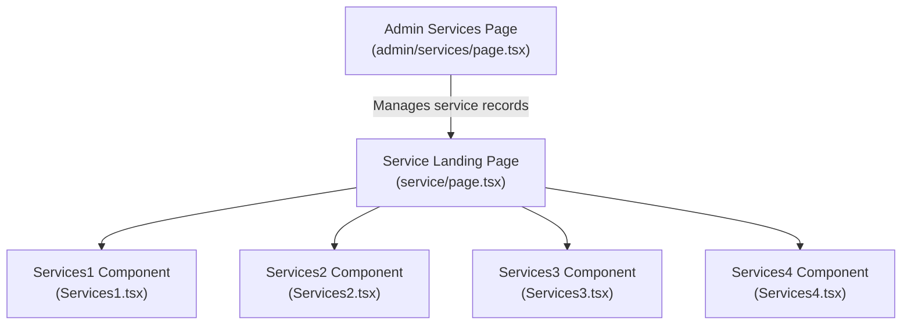
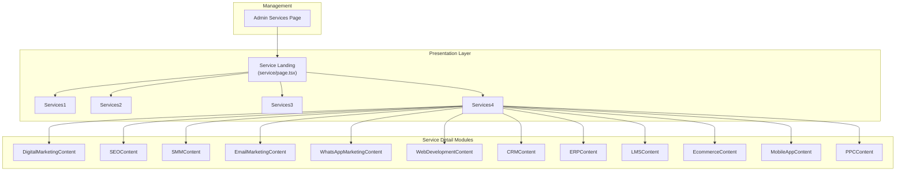
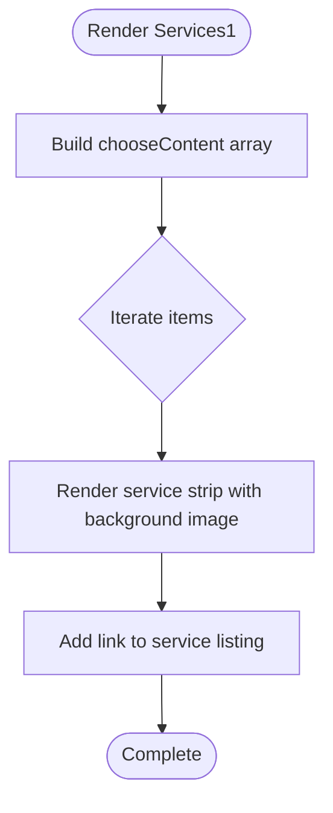
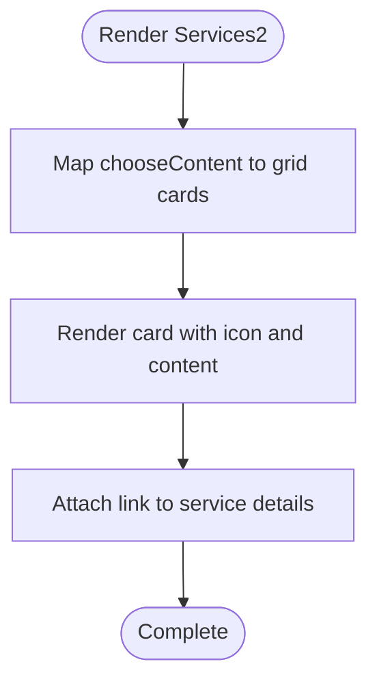
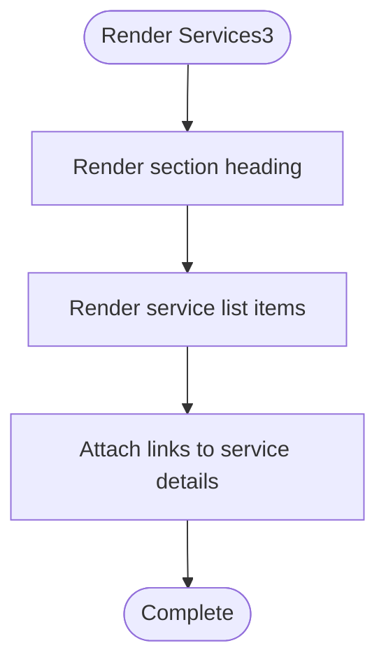
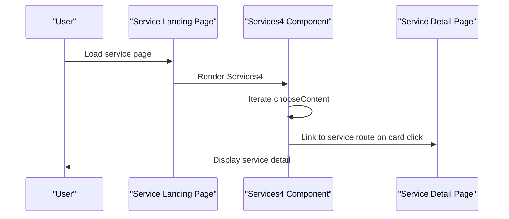
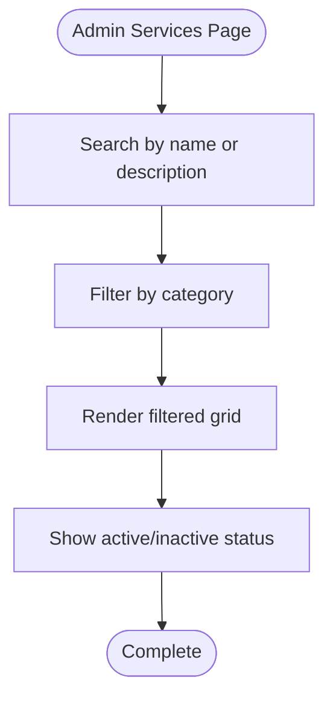
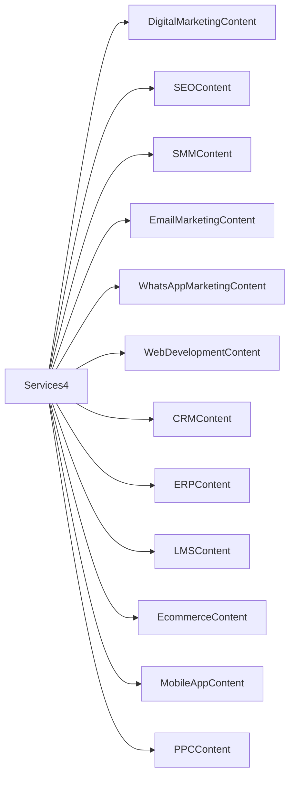
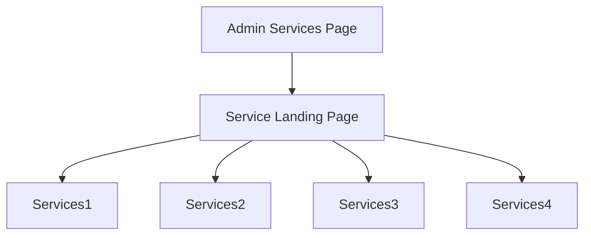

# Service Content Sections

<cite>
**Referenced Files in This Document**
- [PRD_Services_Content_Strategy.md](file://PRD_Services_Content_Strategy.md)
- [Service_Page_Content_Template.md](file://Service_Page_Content_Template.md)
- [src/app/(innerpage)/service/page.tsx](file://src/app/(innerpage)/service/page.tsx)
- [src/app/admin/services/page.tsx](file://src/app/admin/services/page.tsx)
- [src/app/Components/Services/Services1.tsx](file://src/app/Components/Services/Services1.tsx)
- [src/app/Components/Services/Services2.tsx](file://src/app/Components/Services/Services2.tsx)
- [src/app/Components/Services/Services3.tsx](file://src/app/Components/Services/Services3.tsx)
- [src/app/Components/Services/Services4.tsx](file://src/app/Components/Services/Services4.tsx)
- [src/app/Components/Services/CRMContent.tsx](file://src/app/Components/Services/CRMContent.tsx)
- [src/app/Components/Services/DigitalMarketingContent.tsx](file://src/app/Components/Services/DigitalMarketingContent.tsx)
- [src/app/Components/Services/ERPContent.tsx](file://src/app/Components/Services/ERPContent.tsx)
- [src/app/Components/Services/EcommerceContent.tsx](file://src/app/Components/Services/EcommerceContent.tsx)
- [src/app/Components/Services/EmailMarketingContent.tsx](file://src/app/Components/Services/EmailMarketingContent.tsx)
- [src/app/Components/Services/LMSContent.tsx](file://src/app/Components/Services/LMSContent.tsx)
- [src/app/Components/Services/MobileAppContent.tsx](file://src/app/Components/Services/MobileAppContent.tsx)
- [src/app/Components/Services/PPCContent.tsx](file://src/app/Components/Services/PPCContent.tsx)
- [src/app/Components/Services/SEOContent.tsx](file://src/app/Components/Services/SEOContent.tsx)
- [src/app/Components/Services/SMMContent.tsx](file://src/app/Components/Services/SMMContent.tsx)
- [src/app/Components/Services/WebDevelopmentContent.tsx](file://src/app/Components/Services/WebDevelopmentContent.tsx)
- [src/app/Components/Services/WhatsAppMarketingContent.tsx](file://src/app/Components/Services/WhatsAppMarketingContent.tsx)
</cite>

## Table of Contents
1. [Introduction](#introduction)
2. [Project Structure](#project-structure)
3. [Core Components](#core-components)
4. [Architecture Overview](#architecture-overview)
5. [Detailed Component Analysis](#detailed-component-analysis)
6. [Dependency Analysis](#dependency-analysis)
7. [Performance Considerations](#performance-considerations)
8. [Troubleshooting Guide](#troubleshooting-guide)
9. [Conclusion](#conclusion)
10. [Appendices](#appendices)

## Introduction
This document explains the service content sections and service-specific components for AT Tech Global’s Next.js website. It focuses on the four service layout variants (Services1–4), their presentation patterns, service cards, feature displays, responsive grid layouts, categorization systems, and integration with service detail pages. It also covers content management, dynamic loading, and organizational strategies optimized for user conversion.

## Project Structure
The service ecosystem is composed of:
- A service landing page that aggregates multiple service presentations
- Four reusable service layout components (Services1–4) that render cards and lists
- Service-specific content components for each service vertical
- An admin page for managing services with filtering and grid display

**Diagram sources**
- [src/app/(innerpage)/service/page.tsx](file://src/app/(innerpage)/service/page.tsx#L39-L52)
- [src/app/Components/Services/Services1.tsx](file://src/app/Components/Services/Services1.tsx#L1-L56)
- [src/app/Components/Services/Services2.tsx](file://src/app/Components/Services/Services2.tsx#L1-L55)
- [src/app/Components/Services/Services3.tsx](file://src/app/Components/Services/Services3.tsx#L1-L57)
- [src/app/Components/Services/Services4.tsx](file://src/app/Components/Services/Services4.tsx#L1-L53)
- [src/app/admin/services/page.tsx](file://src/app/admin/services/page.tsx#L1-L144)

**Section sources**
- [src/app/(innerpage)/service/page.tsx](file://src/app/(innerpage)/service/page.tsx#L1-L54)
- [src/app/admin/services/page.tsx](file://src/app/admin/services/page.tsx#L1-L144)

## Core Components
- Service Landing Page: Renders breadcrumb, Services4, marquee, CTA, and contact sections. It sets SEO metadata and orchestrates the service presentation.
- Services1: Feature-focused horizontal strips with background imagery and call-to-action buttons.
- Services2: Icon-card grid with fixed columns and hover states.
- Services3: Mixed layout with a heading and a vertical list of service names.
- Services4: Responsive grid of service cards with dedicated links to service detail pages.
- Admin Services Page: Filterable grid of services with category and status indicators.

Key responsibilities:
- Presentation: Render service content in visually distinct layouts.
- Navigation: Provide links to service detail pages.
- Responsiveness: Use Tailwind-based responsive grid classes.
- Content Strategy: Align with the product requirements and content templates.

**Section sources**
- [src/app/(innerpage)/service/page.tsx](file://src/app/(innerpage)/service/page.tsx#L8-L37)
- [src/app/Components/Services/Services1.tsx](file://src/app/Components/Services/Services1.tsx#L1-L56)
- [src/app/Components/Services/Services2.tsx](file://src/app/Components/Services/Services2.tsx#L1-L55)
- [src/app/Components/Services/Services3.tsx](file://src/app/Components/Services/Services3.tsx#L1-L57)
- [src/app/Components/Services/Services4.tsx](file://src/app/Components/Services/Services4.tsx#L1-L53)
- [src/app/admin/services/page.tsx](file://src/app/admin/services/page.tsx#L14-L144)

## Architecture Overview
The service content architecture combines a landing page with modular service components and service-specific content modules. The admin page supports service catalog management and filtering.

**Diagram sources**
- [src/app/(innerpage)/service/page.tsx](file://src/app/(innerpage)/service/page.tsx#L39-L52)
- [src/app/Components/Services/Services1.tsx](file://src/app/Components/Services/Services1.tsx#L1-L56)
- [src/app/Components/Services/Services2.tsx](file://src/app/Components/Services/Services2.tsx#L1-L55)
- [src/app/Components/Services/Services3.tsx](file://src/app/Components/Services/Services3.tsx#L1-L57)
- [src/app/Components/Services/Services4.tsx](file://src/app/Components/Services/Services4.tsx#L1-L53)
- [src/app/admin/services/page.tsx](file://src/app/admin/services/page.tsx#L1-L144)
- [src/app/Components/Services/DigitalMarketingContent.tsx](file://src/app/Components/Services/DigitalMarketingContent.tsx)
- [src/app/Components/Services/SEOContent.tsx](file://src/app/Components/Services/SEOContent.tsx)
- [src/app/Components/Services/SMMContent.tsx](file://src/app/Components/Services/SMMContent.tsx)
- [src/app/Components/Services/EmailMarketingContent.tsx](file://src/app/Components/Services/EmailMarketingContent.tsx)
- [src/app/Components/Services/WhatsAppMarketingContent.tsx](file://src/app/Components/Services/WhatsAppMarketingContent.tsx)
- [src/app/Components/Services/WebDevelopmentContent.tsx](file://src/app/Components/Services/WebDevelopmentContent.tsx)
- [src/app/Components/Services/CRMContent.tsx](file://src/app/Components/Services/CRMContent.tsx)
- [src/app/Components/Services/ERPContent.tsx](file://src/app/Components/Services/ERPContent.tsx)
- [src/app/Components/Services/LMSContent.tsx](file://src/app/Components/Services/LMSContent.tsx)
- [src/app/Components/Services/EcommerceContent.tsx](file://src/app/Components/Services/EcommerceContent.tsx)
- [src/app/Components/Services/MobileAppContent.tsx](file://src/app/Components/Services/MobileAppContent.tsx)
- [src/app/Components/Services/PPCContent.tsx](file://src/app/Components/Services/PPCContent.tsx)

## Detailed Component Analysis

### Services1: Feature-Focused Strips
- Purpose: Showcase a curated set of services with background imagery and concise descriptions.
- Layout: Vertical strips with overlay text and a right-pointing arrow button.
- Interaction: Links to the general service listing page.
- Presentation pattern: Strong headings, secondary text, and prominent call-to-action.

**Diagram sources**
- [src/app/Components/Services/Services1.tsx](file://src/app/Components/Services/Services1.tsx#L7-L12)
- [src/app/Components/Services/Services1.tsx](file://src/app/Components/Services/Services1.tsx#L32-L47)

**Section sources**
- [src/app/Components/Services/Services1.tsx](file://src/app/Components/Services/Services1.tsx#L1-L56)

### Services2: Icon-Card Grid
- Purpose: Present services as interactive cards with icons and short descriptions.
- Layout: Responsive grid using column classes; hover effects and shape overlays.
- Interaction: Each card links to a service detail page.
- Presentation pattern: Iconography, title, subtitle, and arrow button.

**Diagram sources**
- [src/app/Components/Services/Services2.tsx](file://src/app/Components/Services/Services2.tsx#L7-L12)
- [src/app/Components/Services/Services2.tsx](file://src/app/Components/Services/Services2.tsx#L27-L46)

**Section sources**
- [src/app/Components/Services/Services2.tsx](file://src/app/Components/Services/Services2.tsx#L1-L55)

### Services3: List-Based Feature Display
- Purpose: Combine a heading section with a vertical list of service names.
- Layout: Two-column layout with a heading block and a list block.
- Interaction: List items link to service detail pages.
- Presentation pattern: Bold typography, decorative shapes, and aligned layout.

**Diagram sources**
- [src/app/Components/Services/Services3.tsx](file://src/app/Components/Services/Services3.tsx#L17-L53)
- [src/app/Components/Services/Services3.tsx](file://src/app/Components/Services/Services3.tsx#L38-L48)

**Section sources**
- [src/app/Components/Services/Services3.tsx](file://src/app/Components/Services/Services3.tsx#L1-L57)

### Services4: Responsive Grid with Dynamic Links
- Purpose: Display a broad range of services in a responsive grid with dedicated links to service detail pages.
- Layout: Responsive columns with cards containing icons, titles, subtitles, and arrows.
- Interaction: Each card links to a specific service route.
- Presentation pattern: Consistent card design, layered shapes, and flexible grid.

**Diagram sources**
- [src/app/(innerpage)/service/page.tsx](file://src/app/(innerpage)/service/page.tsx#L39-L52)
- [src/app/Components/Services/Services4.tsx](file://src/app/Components/Services/Services4.tsx#L8-L17)
- [src/app/Components/Services/Services4.tsx](file://src/app/Components/Services/Services4.tsx#L24-L43)

**Section sources**
- [src/app/Components/Services/Services4.tsx](file://src/app/Components/Services/Services4.tsx#L1-L53)

### Service Cards and Feature Displays
- Cards consistently use:
  - Iconography for quick recognition
  - Titles and concise subtitles
  - Arrow buttons indicating navigation
  - Background shapes and overlays for visual depth
- Feature displays emphasize:
  - Clear headings and bullet-style benefits
  - Short paragraphs for scannability
  - Consistent spacing and alignment

**Section sources**
- [src/app/Components/Services/Services2.tsx](file://src/app/Components/Services/Services2.tsx#L29-L39)
- [src/app/Components/Services/Services4.tsx](file://src/app/Components/Services/Services4.tsx#L26-L35)

### Responsive Grid Layouts
- Services2 and Services4 use Tailwind grid utilities:
  - Column sizing for different breakpoints
  - Gap classes for spacing
  - Responsive row gaps
- Behavior ensures:
  - 1 column on small screens
  - 2 columns on medium screens
  - Up to 4 columns on extra-large screens

**Section sources**
- [src/app/Components/Services/Services2.tsx](file://src/app/Components/Services/Services2.tsx#L26-L48)
- [src/app/Components/Services/Services4.tsx](file://src/app/Components/Services/Services4.tsx#L23-L46)

### Service Categorization Systems
- Admin Services Page:
  - Provides category filters and search
  - Displays service status with color-coded labels
  - Presents service name, description, category, and price
- Service Landing Page:
  - Uses Services4 to surface categorized services via dedicated links

**Diagram sources**
- [src/app/admin/services/page.tsx](file://src/app/admin/services/page.tsx#L55-L60)
- [src/app/admin/services/page.tsx](file://src/app/admin/services/page.tsx#L101-L132)

**Section sources**
- [src/app/admin/services/page.tsx](file://src/app/admin/services/page.tsx#L14-L144)

### Integration with Service Detail Pages
- Services1–3 link to the general service listing.
- Services4 links each card to a specific service route.
- Service-specific content components provide detailed vertical content.

**Diagram sources**
- [src/app/Components/Services/Services4.tsx](file://src/app/Components/Services/Services4.tsx#L8-L17)
- [src/app/Components/Services/DigitalMarketingContent.tsx](file://src/app/Components/Services/DigitalMarketingContent.tsx)
- [src/app/Components/Services/SEOContent.tsx](file://src/app/Components/Services/SEOContent.tsx)
- [src/app/Components/Services/SMMContent.tsx](file://src/app/Components/Services/SMMContent.tsx)
- [src/app/Components/Services/EmailMarketingContent.tsx](file://src/app/Components/Services/EmailMarketingContent.tsx)
- [src/app/Components/Services/WhatsAppMarketingContent.tsx](file://src/app/Components/Services/WhatsAppMarketingContent.tsx)
- [src/app/Components/Services/WebDevelopmentContent.tsx](file://src/app/Components/Services/WebDevelopmentContent.tsx)
- [src/app/Components/Services/CRMContent.tsx](file://src/app/Components/Services/CRMContent.tsx)
- [src/app/Components/Services/ERPContent.tsx](file://src/app/Components/Services/ERPContent.tsx)
- [src/app/Components/Services/LMSContent.tsx](file://src/app/Components/Services/LMSContent.tsx)
- [src/app/Components/Services/EcommerceContent.tsx](file://src/app/Components/Services/EcommerceContent.tsx)
- [src/app/Components/Services/MobileAppContent.tsx](file://src/app/Components/Services/MobileAppContent.tsx)
- [src/app/Components/Services/PPCContent.tsx](file://src/app/Components/Services/PPCContent.tsx)

**Section sources**
- [src/app/Components/Services/Services4.tsx](file://src/app/Components/Services/Services4.tsx#L31-L35)

### Examples of Service Content Management
- Admin Services Page demonstrates:
  - Filtering by search term and category
  - Status indicators
  - Grid layout with hover states
  - Empty-state messaging

**Section sources**
- [src/app/admin/services/page.tsx](file://src/app/admin/services/page.tsx#L50-L144)

### Dynamic Service Loading
- Services4 dynamically renders cards from a content array and applies per-item links.
- This pattern enables easy addition/removal of services without changing markup.

**Section sources**
- [src/app/Components/Services/Services4.tsx](file://src/app/Components/Services/Services4.tsx#L8-L17)
- [src/app/Components/Services/Services4.tsx](file://src/app/Components/Services/Services4.tsx#L24-L43)

### Service Organization for Conversion
- Content strategy emphasizes:
  - Clear headings and scannable sections
  - Benefit-focused language
  - Multiple CTAs and urgency cues
  - Social proof and trust signals
- These patterns align with the PRD’s goals for SEO, engagement, and conversions.

**Section sources**
- [PRD_Services_Content_Strategy.md](file://PRD_Services_Content_Strategy.md#L44-L86)
- [Service_Page_Content_Template.md](file://Service_Page_Content_Template.md#L202-L249)

## Dependency Analysis
- Service Landing Page depends on:
  - Services1–4 for rendering
  - Common components for breadcrumbs and CTAs
- Services2 and Services4 depend on:
  - Shared icon assets and card shapes
- Admin Services Page depends on:
  - Local state for search and category filters
  - Tailwind utilities for responsive grids

**Diagram sources**
- [src/app/(innerpage)/service/page.tsx](file://src/app/(innerpage)/service/page.tsx#L39-L52)
- [src/app/Components/Services/Services1.tsx](file://src/app/Components/Services/Services1.tsx#L1-L56)
- [src/app/Components/Services/Services2.tsx](file://src/app/Components/Services/Services2.tsx#L1-L55)
- [src/app/Components/Services/Services3.tsx](file://src/app/Components/Services/Services3.tsx#L1-L57)
- [src/app/Components/Services/Services4.tsx](file://src/app/Components/Services/Services4.tsx#L1-L53)
- [src/app/admin/services/page.tsx](file://src/app/admin/services/page.tsx#L1-L144)

**Section sources**
- [src/app/(innerpage)/service/page.tsx](file://src/app/(innerpage)/service/page.tsx#L39-L52)
- [src/app/admin/services/page.tsx](file://src/app/admin/services/page.tsx#L1-L144)

## Performance Considerations
- Prefer static assets for icons and shapes to minimize runtime overhead.
- Keep card content arrays minimal to reduce re-renders.
- Use responsive breakpoints judiciously to avoid excessive CSS.
- Lazy-load images only if needed; current implementation uses Next.js Image with preloaded widths/heights.

## Troubleshooting Guide
- Missing icons or shapes:
  - Verify asset paths and ensure assets are present in the public directory.
- Broken links to service details:
  - Confirm route correctness and that service detail pages exist.
- Filtering not working:
  - Check state updates for search term and category selection.
- Grid misalignment:
  - Validate Tailwind column classes and ensure consistent item counts across screen sizes.

**Section sources**
- [src/app/Components/Services/Services4.tsx](file://src/app/Components/Services/Services4.tsx#L27-L35)
- [src/app/admin/services/page.tsx](file://src/app/admin/services/page.tsx#L55-L60)

## Conclusion
The service content system combines a flexible landing page with four distinct service presentation components. Services1–4 offer varied visual and navigational patterns, while the admin page streamlines service management. By aligning with the documented content strategy and templates, the system supports SEO, engagement, and conversion optimization across digital marketing and technology service verticals.

## Appendices
- Content Strategy Reference: [PRD_Services_Content_Strategy.md](file://PRD_Services_Content_Strategy.md)
- Content Template Reference: [Service_Page_Content_Template.md](file://Service_Page_Content_Template.md)