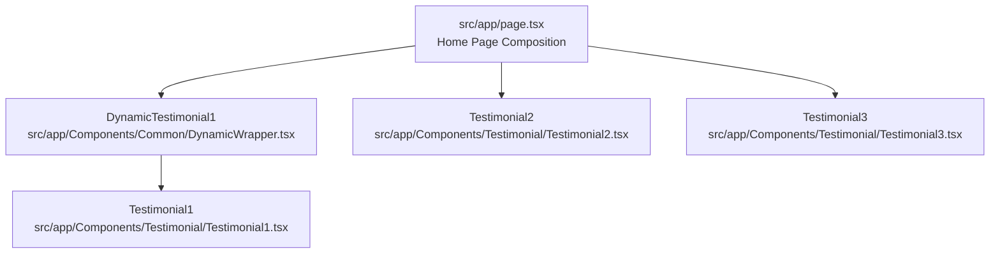
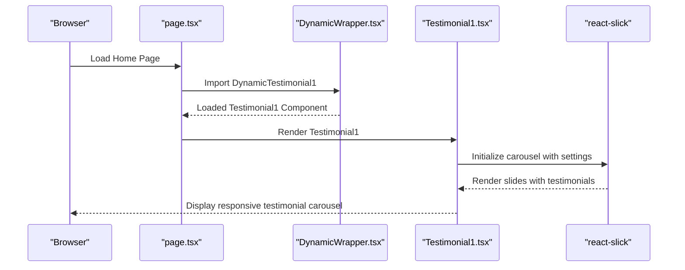
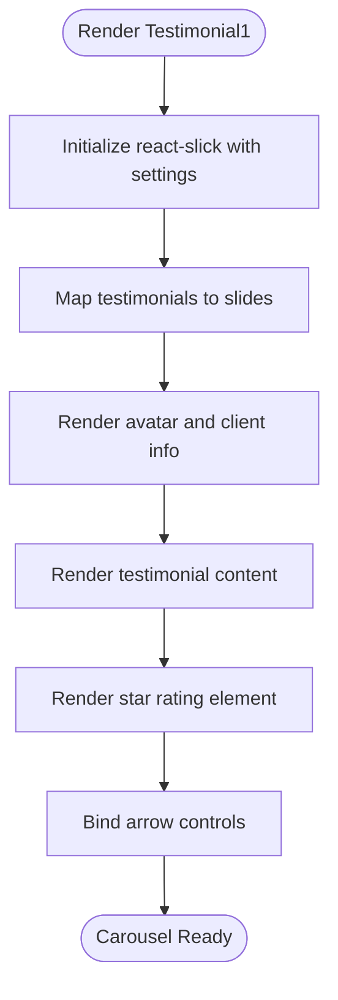
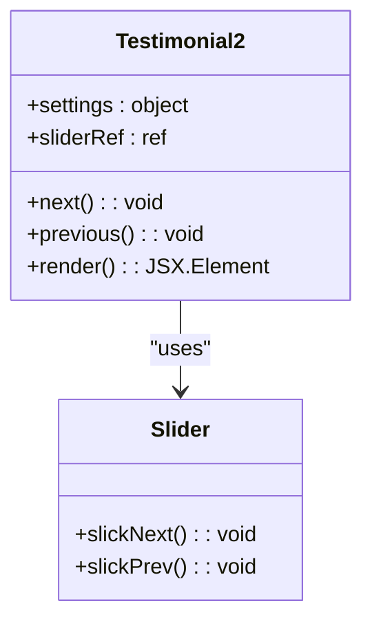
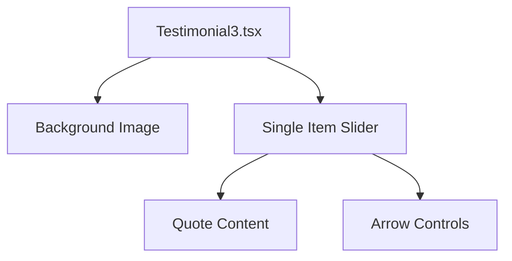
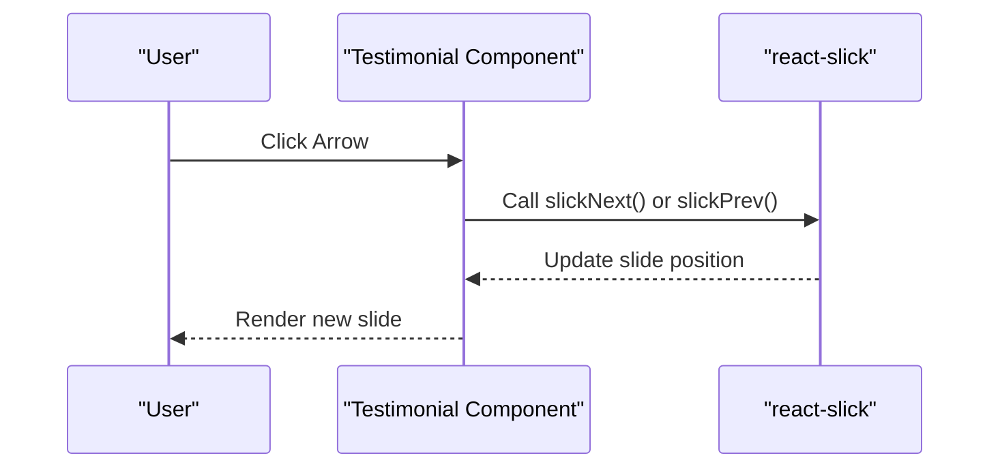
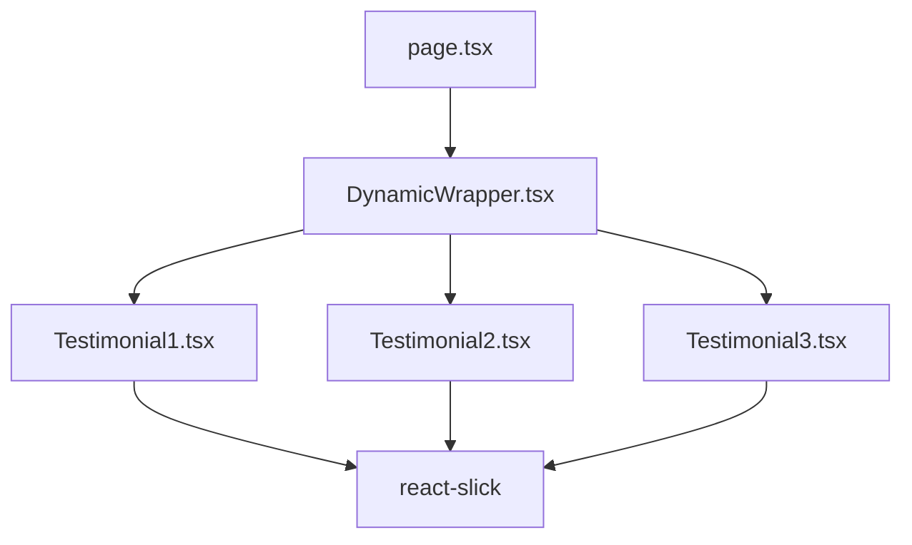

# Testimonial and Review Sections

<cite>
**Referenced Files in This Document**
- [Testimonial1.tsx](file://src/app/Components/Testimonial/Testimonial1.tsx)
- [Testimonial2.tsx](file://src/app/Components/Testimonial/Testimonial2.tsx)
- [Testimonial3.tsx](file://src/app/Components/Testimonial/Testimonial3.tsx)
- [DynamicWrapper.tsx](file://src/app/Components/Common/DynamicWrapper.tsx)
- [page.tsx](file://src/app/page.tsx)
</cite>

## Table of Contents
1. [Introduction](#introduction)
2. [Project Structure](#project-structure)
3. [Core Components](#core-components)
4. [Architecture Overview](#architecture-overview)
5. [Detailed Component Analysis](#detailed-component-analysis)
6. [Dependency Analysis](#dependency-analysis)
7. [Performance Considerations](#performance-considerations)
8. [Troubleshooting Guide](#troubleshooting-guide)
9. [Conclusion](#conclusion)

## Introduction
This document provides comprehensive documentation for the testimonial and review sections of the website. It covers the three testimonial layout variants (Testimonial1, Testimonial2, and Testimonial3), their specific implementations for showcasing client feedback and social proof, carousel systems, rating displays, and testimonial content management. It also explains responsive design patterns, testimonial filtering options, and how testimonials integrate into the overall conversion funnel. Finally, it outlines examples of testimonial submission workflows and content moderation systems.

## Project Structure
The testimonial system is organized as reusable React components within the Next.js application. Each testimonial variant is implemented as a standalone component with its own layout, carousel configuration, and styling. The components are dynamically imported and rendered on the homepage.

**Diagram sources**
- [page.tsx](file://src/app/page.tsx#L16-L60)
- [DynamicWrapper.tsx](file://src/app/Components/Common/DynamicWrapper.tsx#L28-L31)
- [Testimonial1.tsx](file://src/app/Components/Testimonial/Testimonial1.tsx#L1-L124)
- [Testimonial2.tsx](file://src/app/Components/Testimonial/Testimonial2.tsx#L1-L145)
- [Testimonial3.tsx](file://src/app/Components/Testimonial/Testimonial3.tsx#L1-L126)

**Section sources**
- [page.tsx](file://src/app/page.tsx#L16-L60)
- [DynamicWrapper.tsx](file://src/app/Components/Common/DynamicWrapper.tsx#L28-L31)

## Core Components
This section documents the three testimonial layout variants and their core functionality.

- Testimonial1: A multi-item horizontal carousel showcasing avatar, client title/subtitle, and feedback content with a star-based rating display.
- Testimonial2: A single-item centered carousel with a large testimonial thumbnail and integrated review platform badges.
- Testimonial3: A full-bleed testimonial slider with a background image and prominent quote presentation.

Key implementation characteristics:
- Carousel system powered by react-slick with autoplay and responsive breakpoints.
- Dynamic imports for performance optimization.
- Responsive design with mobile-first breakpoints.
- Rating display via data attributes and visual indicators.

**Section sources**
- [Testimonial1.tsx](file://src/app/Components/Testimonial/Testimonial1.tsx#L8-L37)
- [Testimonial2.tsx](file://src/app/Components/Testimonial/Testimonial2.tsx#L9-L38)
- [Testimonial3.tsx](file://src/app/Components/Testimonial/Testimonial3.tsx#L9-L38)

## Architecture Overview
The testimonial architecture integrates dynamic imports, carousel components, and responsive layouts to deliver an engaging social proof experience.

**Diagram sources**
- [page.tsx](file://src/app/page.tsx#L16-L60)
- [DynamicWrapper.tsx](file://src/app/Components/Common/DynamicWrapper.tsx#L28-L31)
- [Testimonial1.tsx](file://src/app/Components/Testimonial/Testimonial1.tsx#L8-L37)

## Detailed Component Analysis

### Testimonial1: Multi-Item Carousel
Testimonial1 presents multiple testimonials in a horizontally scrolling carousel with four visible items on desktop, reducing to one on mobile. Each slide includes an avatar, client identity, feedback content, and a star-based rating indicator.

Implementation highlights:
- Carousel configuration with autoplay, swipe-to-slide, and responsive breakpoints.
- Slide rendering loop mapping over a static array of testimonials.
- Arrow navigation controls bound to slider methods.
- Rating display using a data attribute for percentage calculation.

**Diagram sources**
- [Testimonial1.tsx](file://src/app/Components/Testimonial/Testimonial1.tsx#L8-L37)
- [Testimonial1.tsx](file://src/app/Components/Testimonial/Testimonial1.tsx#L83-L110)

**Section sources**
- [Testimonial1.tsx](file://src/app/Components/Testimonial/Testimonial1.tsx#L8-L37)
- [Testimonial1.tsx](file://src/app/Components/Testimonial/Testimonial1.tsx#L49-L55)
- [Testimonial1.tsx](file://src/app/Components/Testimonial/Testimonial1.tsx#L83-L110)

### Testimonial2: Single-Item Centered Layout
Testimonial2 features a single testimonial per view with a large thumbnail and integrated review platform badges. The layout emphasizes a clean, centered presentation with directional arrows for navigation.

Implementation highlights:
- Full-width single-item carousel with autoplay.
- Background image loading via a shared utility.
- Review summary with platform branding and star ratings.
- Subtle decorative shapes integrated into the design.

**Diagram sources**
- [Testimonial2.tsx](file://src/app/Components/Testimonial/Testimonial2.tsx#L9-L38)
- [Testimonial2.tsx](file://src/app/Components/Testimonial/Testimonial2.tsx#L40-L48)

**Section sources**
- [Testimonial2.tsx](file://src/app/Components/Testimonial/Testimonial2.tsx#L9-L38)
- [Testimonial2.tsx](file://src/app/Components/Testimonial/Testimonial2.tsx#L54-L57)
- [Testimonial2.tsx](file://src/app/Components/Testimonial/Testimonial2.tsx#L121-L131)

### Testimonial3: Full-Bleed Quote Presentation
Testimonial3 provides a full-bleed layout with a background image and a prominent quote presentation. The component emphasizes readability and visual impact through typography and spacing.

Implementation highlights:
- Full-bleed section with background image.
- SVG quote icon for visual emphasis.
- Arrows positioned outside the slider container.
- Minimalist design focusing on content.

**Diagram sources**
- [Testimonial3.tsx](file://src/app/Components/Testimonial/Testimonial3.tsx#L63-L122)

**Section sources**
- [Testimonial3.tsx](file://src/app/Components/Testimonial/Testimonial3.tsx#L9-L38)
- [Testimonial3.tsx](file://src/app/Components/Testimonial/Testimonial3.tsx#L54-L60)
- [Testimonial3.tsx](file://src/app/Components/Testimonial/Testimonial3.tsx#L87-L103)

### Carousel Systems and Navigation
All testimonial components utilize react-slick for carousel functionality. The carousel systems share common patterns:
- Autoplay configuration with adjustable speeds.
- Responsive breakpoints controlling slidesToShow.
- Arrow navigation callbacks bound to slider methods.
- Swipe-to-slide for touch-enabled devices.

**Diagram sources**
- [Testimonial1.tsx](file://src/app/Components/Testimonial/Testimonial1.tsx#L41-L47)
- [Testimonial2.tsx](file://src/app/Components/Testimonial/Testimonial2.tsx#L42-L48)
- [Testimonial3.tsx](file://src/app/Components/Testimonial/Testimonial3.tsx#L47-L53)

**Section sources**
- [Testimonial1.tsx](file://src/app/Components/Testimonial/Testimonial1.tsx#L41-L47)
- [Testimonial2.tsx](file://src/app/Components/Testimonial/Testimonial2.tsx#L42-L48)
- [Testimonial3.tsx](file://src/app/Components/Testimonial/Testimonial3.tsx#L47-L53)

### Rating Displays
Rating displays are implemented using a combination of data attributes and visual indicators:
- Star-based rating via a dedicated element with a percentage data attribute.
- Platform-specific star ratings integrated into the review summary.
- SVG quote icons for visual emphasis in Testimonial3.

Best practices:
- Use semantic HTML for accessibility.
- Ensure sufficient contrast for rating visuals.
- Provide alternative text for screen readers.

**Section sources**
- [Testimonial1.tsx](file://src/app/Components/Testimonial/Testimonial1.tsx#L100-L102)
- [Testimonial2.tsx](file://src/app/Components/Testimonial/Testimonial2.tsx#L129-L131)
- [Testimonial3.tsx](file://src/app/Components/Testimonial/Testimonial3.tsx#L91-L96)

### Testimonial Content Management
Current implementation uses static arrays for testimonial content:
- Testimonial1: Uses external image URLs for avatars.
- Testimonial2: Uses local asset paths for images.
- Testimonial3: Uses an external image URL for the background.

Recommendations for dynamic content management:
- Integrate with a CMS or database for editable testimonials.
- Implement content moderation workflows for submissions.
- Support multiple languages and regions.

**Section sources**
- [Testimonial1.tsx](file://src/app/Components/Testimonial/Testimonial1.tsx#L49-L55)
- [Testimonial2.tsx](file://src/app/Components/Testimonial/Testimonial2.tsx#L54-L57)
- [Testimonial3.tsx](file://src/app/Components/Testimonial/Testimonial3.tsx#L54-L60)

### Responsive Design Patterns
Each testimonial variant implements responsive breakpoints:
- Desktop: Four testimonials visible (Testimonial1).
- Tablet: Three testimonials visible (Testimonial1).
- Mobile: One testimonial visible across all variants.
- Flexible widths and gap adjustments for optimal viewing.

Responsive behavior ensures consistent user experience across devices while maintaining visual hierarchy.

**Section sources**
- [Testimonial1.tsx](file://src/app/Components/Testimonial/Testimonial1.tsx#L18-L36)
- [Testimonial2.tsx](file://src/app/Components/Testimonial/Testimonial2.tsx#L19-L37)
- [Testimonial3.tsx](file://src/app/Components/Testimonial/Testimonial3.tsx#L19-L37)

### Testimonial Filtering Options
Filtering capabilities are not currently implemented in the provided components. Potential enhancements:
- Category-based filtering (service type, industry).
- Time-based filtering (recent testimonials).
- Rating-based filtering (stars, sentiment).
- Verified customer filtering.

Integration points:
- Add filter controls above the carousel.
- Implement client-side filtering logic.
- Maintain carousel responsiveness during filter changes.

### Conversion Funnel Integration
Testimonials integrate into the conversion funnel at multiple stages:
- Awareness: Social proof influences initial interest.
- Consideration: Detailed feedback builds trust and credibility.
- Decision: Positive testimonials reduce perceived risk.
- Retention: Ongoing testimonials support long-term relationships.

Placement strategies:
- Homepage: Prominent placement after hero section.
- Service pages: Contextual testimonials for specific offerings.
- Contact pages: Testimonials reinforcing trust before inquiry.
- Email campaigns: Social proof in nurture sequences.

## Dependency Analysis
The testimonial system exhibits low coupling and high cohesion:
- Each component manages its own carousel and styling.
- Shared utilities (dynamic imports) minimize duplication.
- No circular dependencies detected among testimonial components.

**Diagram sources**
- [DynamicWrapper.tsx](file://src/app/Components/Common/DynamicWrapper.tsx#L28-L31)
- [Testimonial1.tsx](file://src/app/Components/Testimonial/Testimonial1.tsx#L4)
- [Testimonial2.tsx](file://src/app/Components/Testimonial/Testimonial2.tsx#L3)
- [Testimonial3.tsx](file://src/app/Components/Testimonial/Testimonial3.tsx#L4)
- [page.tsx](file://src/app/page.tsx#L16-L21)

**Section sources**
- [DynamicWrapper.tsx](file://src/app/Components/Common/DynamicWrapper.tsx#L28-L31)
- [page.tsx](file://src/app/page.tsx#L16-L21)

## Performance Considerations
Performance optimization strategies implemented:
- Dynamic imports with client-side rendering disabled for heavy components.
- Loading spinners during component hydration.
- Lightweight carousel configuration with minimal DOM manipulation.
- Optimized image loading via Next.js Image component.

Recommendations:
- Implement lazy loading for images.
- Use IntersectionObserver for viewport-aware rendering.
- Consider virtualization for large testimonial datasets.
- Monitor carousel initialization performance on low-end devices.

## Troubleshooting Guide
Common issues and resolutions:
- Carousel not responding to clicks: Verify sliderRef is properly assigned and methods are bound.
- Images not loading: Check image paths and ensure assets are served correctly.
- Responsive breakpoints not applying: Confirm CSS classes and media queries are loaded.
- Dynamic import errors: Ensure component paths are correct and SSR is disabled for client-side components.

Debugging steps:
- Inspect console for JavaScript errors.
- Verify react-slick dependencies are installed.
- Check network tab for failed asset loads.
- Validate component imports in page composition.

**Section sources**
- [Testimonial1.tsx](file://src/app/Components/Testimonial/Testimonial1.tsx#L39-L47)
- [Testimonial2.tsx](file://src/app/Components/Testimonial/Testimonial2.tsx#L40-L48)
- [Testimonial3.tsx](file://src/app/Components/Testimonial/Testimonial3.tsx#L45-L53)

## Conclusion
The testimonial system provides a robust foundation for showcasing social proof across three distinct layouts. The implementation leverages modern React patterns, dynamic imports, and responsive design to deliver an engaging user experience. Future enhancements should focus on dynamic content management, filtering capabilities, and expanded integration with the conversion funnel through targeted placements and automated workflows.