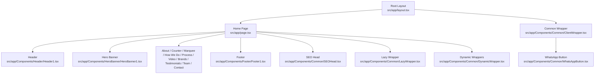
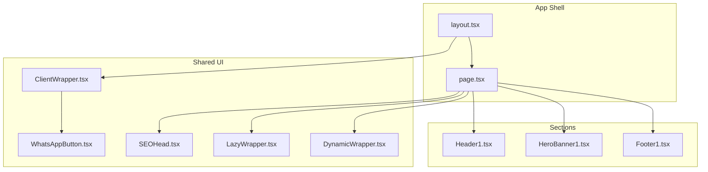
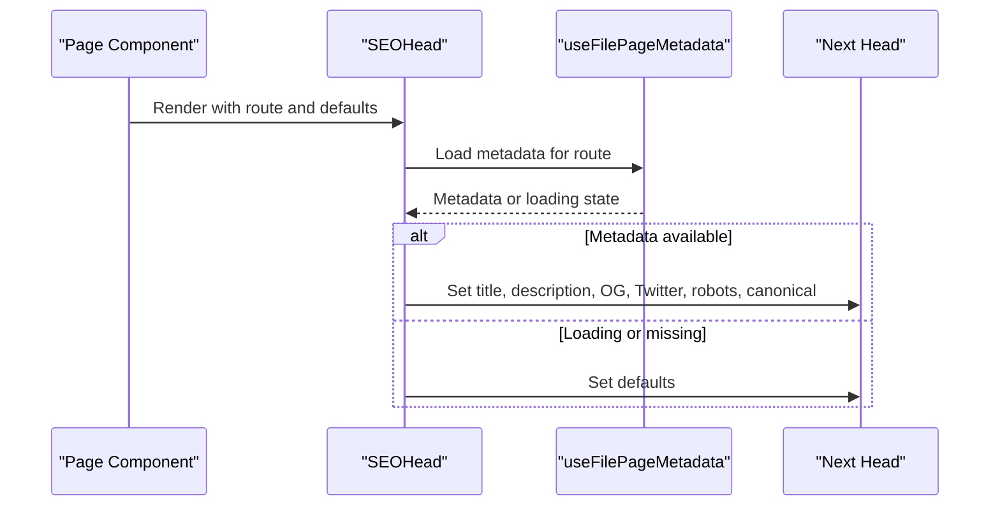
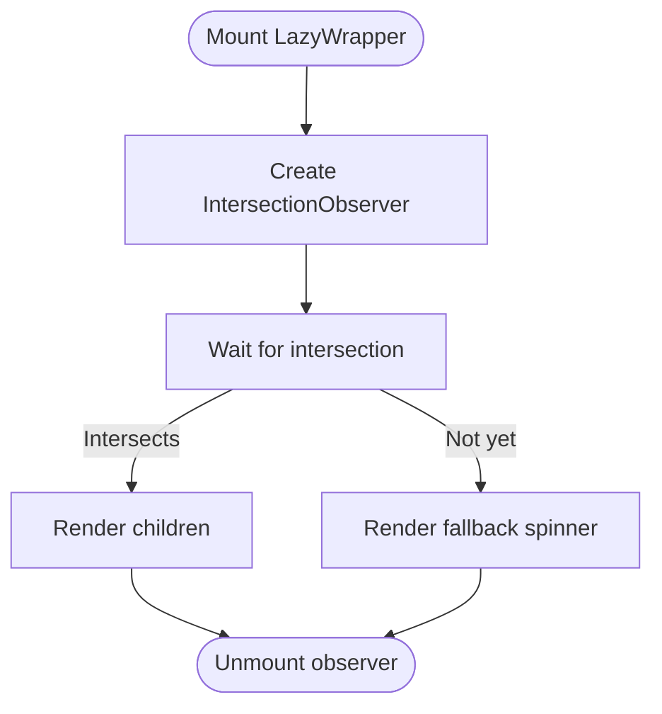
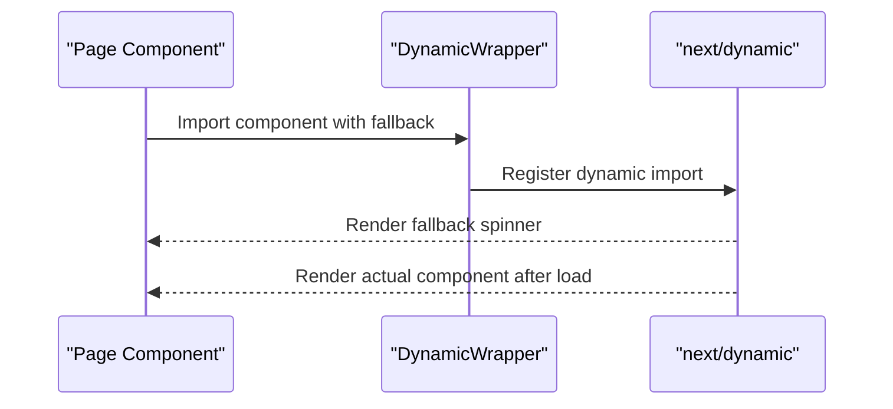
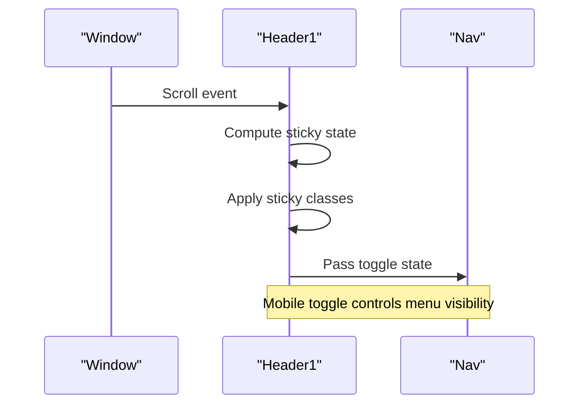
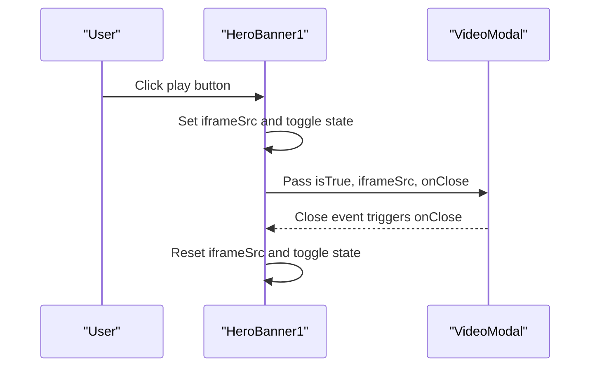
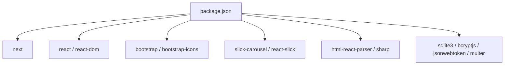

# Website Frontend

<cite>
**Referenced Files in This Document**
- [README.md](file://README.md)
- [package.json](file://package.json)
- [src/app/layout.tsx](file://src/app/layout.tsx)
- [src/app/page.tsx](file://src/app/page.tsx)
- [src/app/Components/Common/ClientWrapper.tsx](file://src/app/Components/Common/ClientWrapper.tsx)
- [src/app/Components/Common/LazyWrapper.tsx](file://src/app/Components/Common/LazyWrapper.tsx)
- [src/app/Components/Common/SEOHead.tsx](file://src/app/Components/Common/SEOHead.tsx)
- [src/app/Components/Common/DynamicWrapper.tsx](file://src/app/Components/Common/DynamicWrapper.tsx)
- [src/app/Components/Common/WhatsAppButton.tsx](file://src/app/Components/Common/WhatsAppButton.tsx)
- [src/app/Components/Header/Header1.tsx](file://src/app/Components/Header/Header1.tsx)
- [src/app/Components/Footer/Footer1.tsx](file://src/app/Components/Footer/Footer1.tsx)
- [src/app/Components/HeroBanner/HeroBanner1.tsx](file://src/app/Components/HeroBanner/HeroBanner1.tsx)
</cite>

## Table of Contents
1. [Introduction](#introduction)
2. [Project Structure](#project-structure)
3. [Core Components](#core-components)
4. [Architecture Overview](#architecture-overview)
5. [Detailed Component Analysis](#detailed-component-analysis)
6. [Dependency Analysis](#dependency-analysis)
7. [Performance Considerations](#performance-considerations)
8. [Troubleshooting Guide](#troubleshooting-guide)
9. [Conclusion](#conclusion)

## Introduction
This document describes the frontend architecture and implementation of attechglobal.com, a responsive marketing website built with Next.js App Router. It focuses on the multi-page structure, component-based design, Bootstrap integration, SEO management, and performance strategies. The site emphasizes a cohesive user experience across the home page (with hero banner, services, portfolio, testimonials, blog integration, and contact form) and inner pages, while leveraging reusable UI components, lazy loading, and dynamic imports to optimize performance.

## Project Structure
The frontend is organized under the Next.js App Router convention, with a dedicated components directory for reusable UI elements and a root layout that initializes global styles and analytics. The home page composes multiple sections and integrates SEO management and a persistent WhatsApp widget.

**Diagram sources**
- [src/app/layout.tsx](file://src/app/layout.tsx#L1-L47)
- [src/app/page.tsx](file://src/app/page.tsx#L1-L75)
- [src/app/Components/Header/Header1.tsx](file://src/app/Components/Header/Header1.tsx#L1-L94)
- [src/app/Components/Footer/Footer1.tsx](file://src/app/Components/Footer/Footer1.tsx#L1-L112)
- [src/app/Components/HeroBanner/HeroBanner1.tsx](file://src/app/Components/HeroBanner/HeroBanner1.tsx#L1-L127)
- [src/app/Components/Common/ClientWrapper.tsx](file://src/app/Components/Common/ClientWrapper.tsx#L1-L11)
- [src/app/Components/Common/WhatsAppButton.tsx](file://src/app/Components/Common/WhatsAppButton.tsx#L1-L33)
- [src/app/Components/Common/SEOHead.tsx](file://src/app/Components/Common/SEOHead.tsx#L1-L78)
- [src/app/Components/Common/LazyWrapper.tsx](file://src/app/Components/Common/LazyWrapper.tsx#L1-L51)
- [src/app/Components/Common/DynamicWrapper.tsx](file://src/app/Components/Common/DynamicWrapper.tsx#L1-L42)

**Section sources**
- [README.md](file://README.md#L1-L37)
- [package.json](file://package.json#L1-L41)
- [src/app/layout.tsx](file://src/app/layout.tsx#L1-L47)
- [src/app/page.tsx](file://src/app/page.tsx#L1-L75)

## Core Components
- Root layout initializes fonts, Bootstrap CSS, icons, carousel styles, and global CSS. It also injects analytics and sets up a client-side wrapper for shared UI elements.
- Home page composes SEO head, header, hero banner, multiple content sections, and footer. It uses lazy wrappers and dynamic imports to defer heavy components until they enter the viewport.
- Common wrappers provide:
  - ClientWrapper: renders the persistent WhatsApp button alongside page content.
  - LazyWrapper: intersection observer-based lazy rendering with configurable thresholds and margins.
  - DynamicWrapper: Next.js dynamic imports with client-side SSR disabled and spinner fallbacks.
  - SEOHead: per-route metadata resolution with Open Graph and Twitter cards.
- Header and Footer provide navigation and branding, with sticky behavior and responsive design.
- Hero Banner integrates video modal, statistics, and social links.

**Section sources**
- [src/app/layout.tsx](file://src/app/layout.tsx#L1-L47)
- [src/app/page.tsx](file://src/app/page.tsx#L1-L75)
- [src/app/Components/Common/ClientWrapper.tsx](file://src/app/Components/Common/ClientWrapper.tsx#L1-L11)
- [src/app/Components/Common/LazyWrapper.tsx](file://src/app/Components/Common/LazyWrapper.tsx#L1-L51)
- [src/app/Components/Common/DynamicWrapper.tsx](file://src/app/Components/Common/DynamicWrapper.tsx#L1-L42)
- [src/app/Components/Common/SEOHead.tsx](file://src/app/Components/Common/SEOHead.tsx#L1-L78)
- [src/app/Components/Header/Header1.tsx](file://src/app/Components/Header/Header1.tsx#L1-L94)
- [src/app/Components/Footer/Footer1.tsx](file://src/app/Components/Footer/Footer1.tsx#L1-L112)
- [src/app/Components/HeroBanner/HeroBanner1.tsx](file://src/app/Components/HeroBanner/HeroBanner1.tsx#L1-L127)

## Architecture Overview
The frontend follows a component-driven architecture with:
- App Router pages for routes (home and inner pages).
- Reusable components under src/app/Components for cross-cutting concerns and page sections.
- Global initialization in layout.tsx for fonts, CSS, and analytics.
- Client-side hydration via ClientWrapper to enable interactive widgets like the WhatsApp button.
- SEO managed centrally via SEOHead with per-route metadata loaded from a file-based system.

**Diagram sources**
- [src/app/layout.tsx](file://src/app/layout.tsx#L1-L47)
- [src/app/page.tsx](file://src/app/page.tsx#L1-L75)
- [src/app/Components/Common/ClientWrapper.tsx](file://src/app/Components/Common/ClientWrapper.tsx#L1-L11)
- [src/app/Components/Common/WhatsAppButton.tsx](file://src/app/Components/Common/WhatsAppButton.tsx#L1-L33)
- [src/app/Components/Common/SEOHead.tsx](file://src/app/Components/Common/SEOHead.tsx#L1-L78)
- [src/app/Components/Common/LazyWrapper.tsx](file://src/app/Components/Common/LazyWrapper.tsx#L1-L51)
- [src/app/Components/Common/DynamicWrapper.tsx](file://src/app/Components/Common/DynamicWrapper.tsx#L1-L42)
- [src/app/Components/Header/Header1.tsx](file://src/app/Components/Header/Header1.tsx#L1-L94)
- [src/app/Components/HeroBanner/HeroBanner1.tsx](file://src/app/Components/HeroBanner/HeroBanner1.tsx#L1-L127)
- [src/app/Components/Footer/Footer1.tsx](file://src/app/Components/Footer/Footer1.tsx#L1-L112)

## Detailed Component Analysis

### SEO Management (SEOHead)
Centralized SEO head management resolves metadata per route, falling back to defaults when data is unavailable. It supports Open Graph and Twitter meta tags, robots directives, and canonical URLs.

**Diagram sources**
- [src/app/Components/Common/SEOHead.tsx](file://src/app/Components/Common/SEOHead.tsx#L1-L78)

**Section sources**
- [src/app/Components/Common/SEOHead.tsx](file://src/app/Components/Common/SEOHead.tsx#L1-L78)

### Lazy Loading (LazyWrapper)
LazyWrapper defers rendering of heavy sections until they intersect with the viewport, improving initial load performance. It accepts configurable thresholds and margins and displays a spinner while loading.

**Diagram sources**
- [src/app/Components/Common/LazyWrapper.tsx](file://src/app/Components/Common/LazyWrapper.tsx#L1-L51)

**Section sources**
- [src/app/Components/Common/LazyWrapper.tsx](file://src/app/Components/Common/LazyWrapper.tsx#L1-L51)

### Dynamic Imports (DynamicWrapper)
DynamicWrapper provides preconfigured dynamic imports for heavy components (services, projects, testimonials, team, blog). It disables SSR for client-heavy components and supplies spinner fallbacks during loading.

**Diagram sources**
- [src/app/Components/Common/DynamicWrapper.tsx](file://src/app/Components/Common/DynamicWrapper.tsx#L1-L42)

**Section sources**
- [src/app/Components/Common/DynamicWrapper.tsx](file://src/app/Components/Common/DynamicWrapper.tsx#L1-L42)

### Header Navigation (Header1)
Header1 manages responsive navigation, sticky behavior on scroll, and a primary CTA. It integrates with a Nav component and toggles mobile menu state.

**Diagram sources**
- [src/app/Components/Header/Header1.tsx](file://src/app/Components/Header/Header1.tsx#L1-L94)

**Section sources**
- [src/app/Components/Header/Header1.tsx](file://src/app/Components/Header/Header1.tsx#L1-L94)

### Hero Banner (HeroBanner1)
HeroBanner1 presents a visually rich hero with imagery, animated stats, social links, and a video modal trigger. It demonstrates user interaction patterns and modal lifecycle.

**Diagram sources**
- [src/app/Components/HeroBanner/HeroBanner1.tsx](file://src/app/Components/HeroBanner/HeroBanner1.tsx#L1-L127)

**Section sources**
- [src/app/Components/HeroBanner/HeroBanner1.tsx](file://src/app/Components/HeroBanner/HeroBanner1.tsx#L1-L127)

### Footer Layout (Footer1)
Footer1 organizes quick links, services, and contact information, with social media integrations and copyright details. It ensures consistent branding and accessibility attributes.

**Section sources**
- [src/app/Components/Footer/Footer1.tsx](file://src/app/Components/Footer/Footer1.tsx#L1-L112)

### WhatsApp Floating Button (WhatsAppButton)
WhatsAppButton is a persistent floating action button positioned fixed at the bottom-right corner. It scales on hover and opens a WhatsApp chat link in a new tab.

**Section sources**
- [src/app/Components/Common/WhatsAppButton.tsx](file://src/app/Components/Common/WhatsAppButton.tsx#L1-L33)

## Dependency Analysis
External dependencies include Next.js, React, Bootstrap, Bootstrap Icons, Slick Carousel, and related TypeScript typings. These libraries support responsive design, UI components, and animations.

**Diagram sources**
- [package.json](file://package.json#L1-L41)

**Section sources**
- [package.json](file://package.json#L1-L41)

## Performance Considerations
- Lazy loading: Use LazyWrapper to defer rendering of heavy sections until they are near the viewport.
- Dynamic imports: Use DynamicWrapper for heavy components to split bundles and avoid hydrating unnecessary code on initial load.
- Client-side only: ClientWrapper and interactive widgets (WhatsAppButton) are client-only to reduce server payload.
- Analytics: Inline analytics script injection in layout.tsx avoids external render-blocking scripts.
- Fonts and CSS: Font variables and global CSS are included in layout.tsx to prevent FOIT and ensure consistent styling.
- Images: Next/Image is used across components for optimized image rendering and lazy loading.

[No sources needed since this section provides general guidance]

## Troubleshooting Guide
- Missing dynamic components: If dynamic imports fail, verify the component paths exist and are exported as default. Confirm that dynamic imports are configured in DynamicWrapper.
- Intersection observer not triggering: Check LazyWrapper thresholds and root margins; ensure the container has sufficient height and is visible.
- SEO metadata not applied: Verify the route exists in the file-based metadata system and that useFilePageMetadata returns valid data.
- WhatsApp button not clickable: Confirm the anchor target and rel attributes are present and that the button is rendered inside ClientWrapper.
- Sticky header not working: Ensure scroll listeners are attached and that the sticky class names match the CSS selectors.

**Section sources**
- [src/app/Components/Common/DynamicWrapper.tsx](file://src/app/Components/Common/DynamicWrapper.tsx#L1-L42)
- [src/app/Components/Common/LazyWrapper.tsx](file://src/app/Components/Common/LazyWrapper.tsx#L1-L51)
- [src/app/Components/Common/SEOHead.tsx](file://src/app/Components/Common/SEOHead.tsx#L1-L78)
- [src/app/Components/Common/WhatsAppButton.tsx](file://src/app/Components/Common/WhatsAppButton.tsx#L1-L33)
- [src/app/Components/Header/Header1.tsx](file://src/app/Components/Header/Header1.tsx#L1-L94)

## Conclusion
The attechglobal.com frontend leverages Next.js App Router to compose a responsive, SEO-aware, and performance-optimized marketing website. Its component-based architecture promotes reusability and maintainability, while lazy loading and dynamic imports improve perceived performance. The integration of Bootstrap and custom styles ensures a consistent design language across the home page and inner pages, delivering a cohesive user experience for visitors seeking digital marketing services.