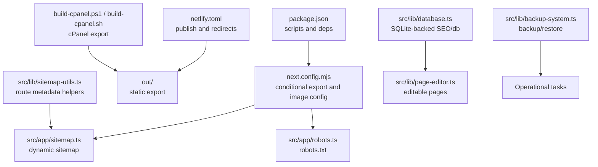
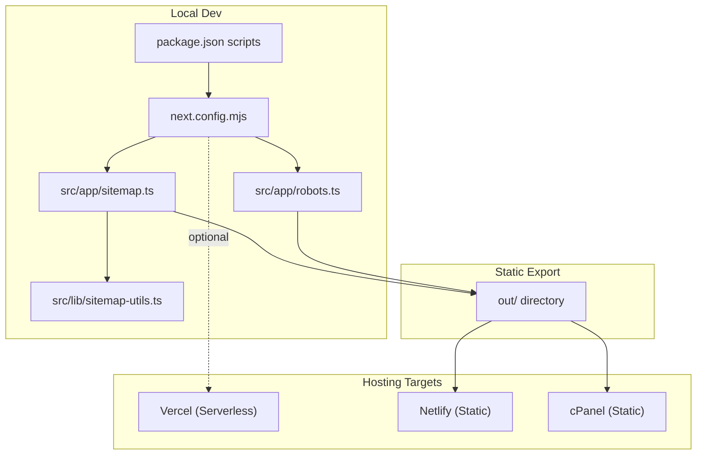
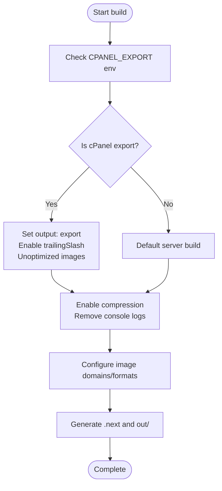
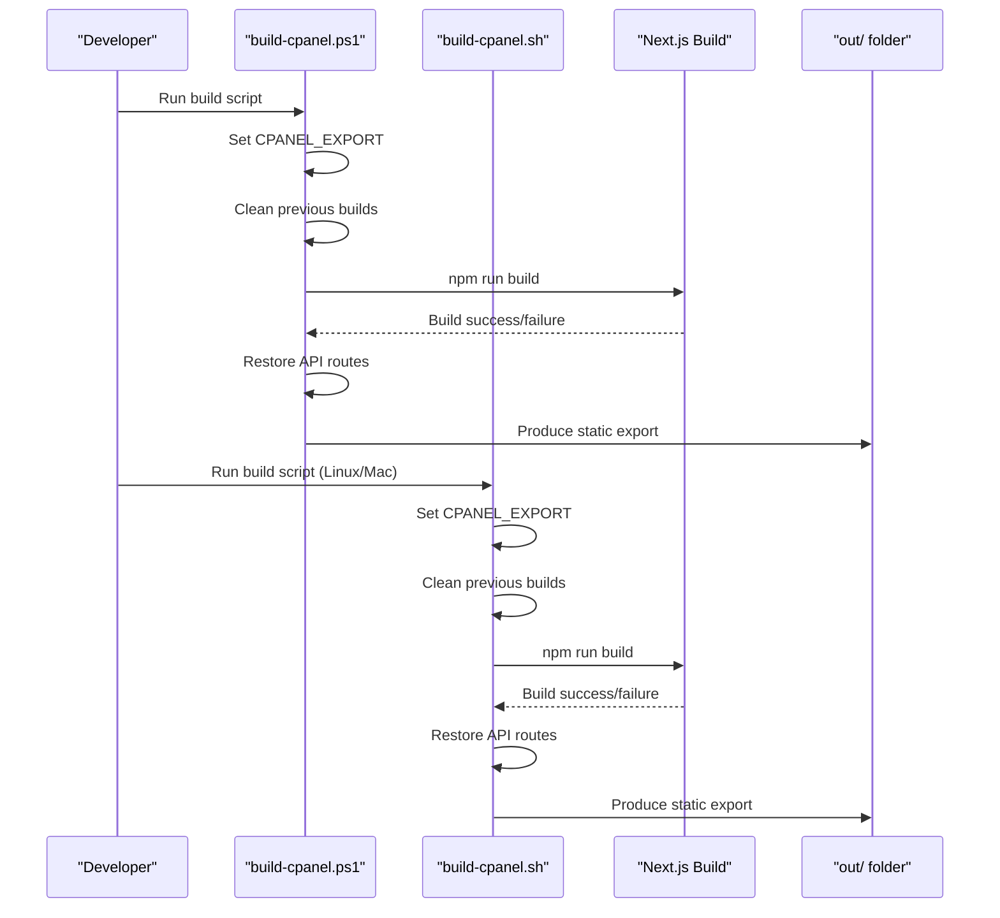
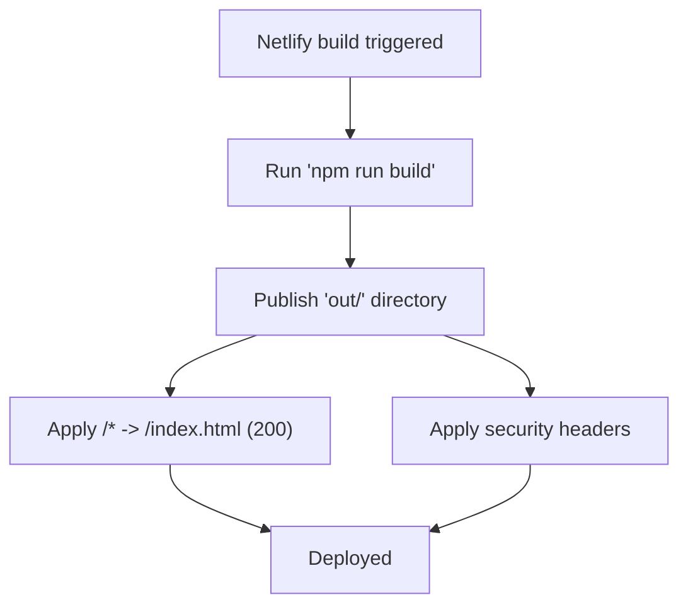
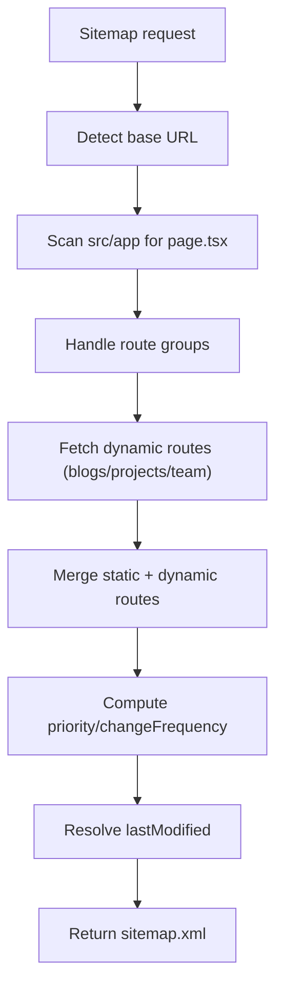
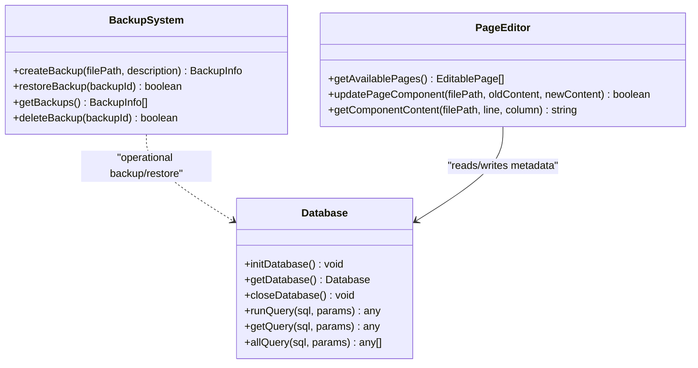
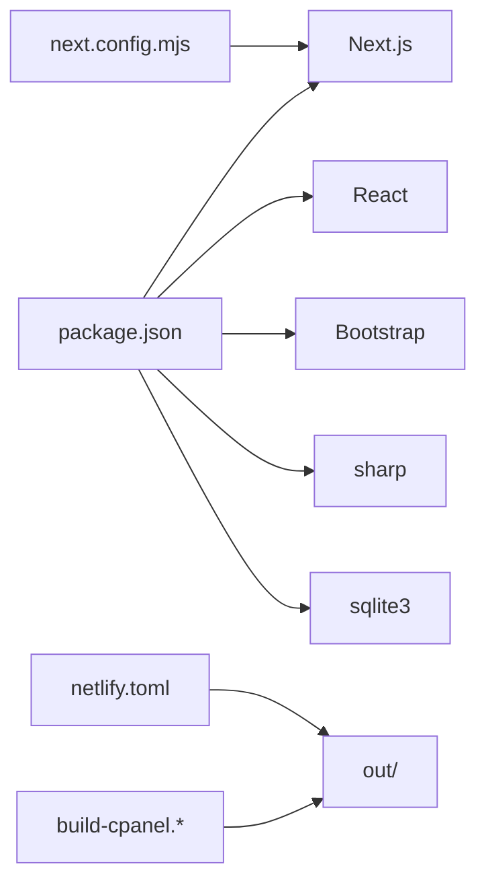

# Deployment and Operations

<cite>
**Referenced Files in This Document**
- [package.json](file://package.json)
- [next.config.mjs](file://next.config.mjs)
- [netlify.toml](file://netlify.toml)
- [CPANEL_DEPLOYMENT.md](file://CPANEL_DEPLOYMENT.md)
- [SITEMAP_SETUP.md](file://SITEMAP_SETUP.md)
- [SEO_MANAGEMENT_GUIDE.md](file://SEO_MANAGEMENT_GUIDE.md)
- [build-cpanel.ps1](file://build-cpanel.ps1)
- [build-cpanel.sh](file://build-cpanel.sh)
- [src/app/sitemap.ts](file://src/app/sitemap.ts)
- [src/app/robots.ts](file://src/app/robots.ts)
- [src/lib/sitemap-utils.ts](file://src/lib/sitemap-utils.ts)
- [src/lib/backup-system.ts](file://src/lib/backup-system.ts)
- [src/lib/database.ts](file://src/lib/database.ts)
- [src/lib/page-editor.ts](file://src/lib/page-editor.ts)
- [README.md](file://README.md)
</cite>

## Table of Contents
1. [Introduction](#introduction)
2. [Project Structure](#project-structure)
3. [Core Components](#core-components)
4. [Architecture Overview](#architecture-overview)
5. [Detailed Component Analysis](#detailed-component-analysis)
6. [Dependency Analysis](#dependency-analysis)
7. [Performance Considerations](#performance-considerations)
8. [Troubleshooting Guide](#troubleshooting-guide)
9. [Conclusion](#conclusion)
10. [Appendices](#appendices)

## Introduction
This document provides comprehensive deployment and operations guidance for attechglobal.com, focusing on production-grade strategies across Vercel, Netlify, and cPanel environments. It explains static site generation via Next.js export, build optimization, asset bundling, and the cPanel deployment workflow including build scripts, file transfer, and server configuration. It also covers Netlify setup with environment variables, redirects, and custom domains; dynamic sitemap generation and SEO optimization; monitoring and maintenance; backup strategies; performance tuning; security considerations including SSL and CDN integration; troubleshooting, rollback procedures, scaling, and operational checklists.

## Project Structure
The repository is a Next.js 15 application configured for both server and static export modes. Key deployment-related artifacts include:
- Build scripts for cPanel static export
- Next.js configuration enabling conditional static export and image optimization
- Netlify configuration for static publishing and security headers
- Dynamic sitemap and robots generation
- Operational utilities for backups, database initialization, and page editing

**Diagram sources**
- [package.json](file://package.json#L5-L11)
- [next.config.mjs](file://next.config.mjs#L1-L129)
- [netlify.toml](file://netlify.toml#L1-L21)
- [build-cpanel.ps1](file://build-cpanel.ps1#L1-L92)
- [build-cpanel.sh](file://build-cpanel.sh#L1-L95)
- [src/app/sitemap.ts](file://src/app/sitemap.ts#L1-L154)
- [src/app/robots.ts](file://src/app/robots.ts#L1-L38)
- [src/lib/sitemap-utils.ts](file://src/lib/sitemap-utils.ts#L1-L196)
- [src/lib/database.ts](file://src/lib/database.ts#L1-L255)
- [src/lib/page-editor.ts](file://src/lib/page-editor.ts#L1-L194)
- [src/lib/backup-system.ts](file://src/lib/backup-system.ts#L1-L119)

**Section sources**
- [package.json](file://package.json#L1-L41)
- [next.config.mjs](file://next.config.mjs#L1-L129)
- [netlify.toml](file://netlify.toml#L1-L21)
- [build-cpanel.ps1](file://build-cpanel.ps1#L1-L92)
- [build-cpanel.sh](file://build-cpanel.sh#L1-L95)
- [README.md](file://README.md#L1-L37)

## Core Components
- Static Export and Build Configuration
  - Conditional output export for cPanel and trailing slash handling
  - Unoptimized images for static export; image domains and formats configured
  - Production build optimizations: remove console logs, compression, powered-by header disabled
- Netlify Publishing
  - Publish directory set to out/
  - Redirects to support client-side routing for static export
  - Security headers applied globally
- Dynamic Sitemap and Robots
  - Sitemap auto-discovers pages and supports dynamic routes
  - Robots.txt references sitemap and disallows internal/admin paths
- cPanel Deployment Scripts
  - PowerShell and Bash scripts orchestrate static export, temporarily excluding API routes, and produce out/ for upload
- Operational Utilities
  - Backup system for content files
  - SQLite-backed database for SEO and image metadata
  - Page editor for discovering and editing components in selected pages

**Section sources**
- [next.config.mjs](file://next.config.mjs#L1-L129)
- [netlify.toml](file://netlify.toml#L1-L21)
- [src/app/sitemap.ts](file://src/app/sitemap.ts#L1-L154)
- [src/app/robots.ts](file://src/app/robots.ts#L1-L38)
- [build-cpanel.ps1](file://build-cpanel.ps1#L1-L92)
- [build-cpanel.sh](file://build-cpanel.sh#L1-L95)
- [src/lib/backup-system.ts](file://src/lib/backup-system.ts#L1-L119)
- [src/lib/database.ts](file://src/lib/database.ts#L1-L255)
- [src/lib/page-editor.ts](file://src/lib/page-editor.ts#L1-L194)

## Architecture Overview
The deployment architecture supports three production targets:
- Vercel: standard Next.js serverless deployment (supported by default Next.js templates)
- Netlify: static export with redirects and security headers
- cPanel: static export via build scripts, uploaded as ZIP to public_html

**Diagram sources**
- [package.json](file://package.json#L5-L11)
- [next.config.mjs](file://next.config.mjs#L1-L129)
- [src/app/sitemap.ts](file://src/app/sitemap.ts#L1-L154)
- [src/app/robots.ts](file://src/app/robots.ts#L1-L38)
- [src/lib/sitemap-utils.ts](file://src/lib/sitemap-utils.ts#L1-L196)
- [netlify.toml](file://netlify.toml#L1-L21)
- [CPANEL_DEPLOYMENT.md](file://CPANEL_DEPLOYMENT.md#L1-L187)

## Detailed Component Analysis

### Static Site Generation and Build Optimization
- Conditional export for cPanel
  - Environment variable toggles output: export vs server
  - Trailing slashes enabled for cPanel static hosting
  - Images set to unoptimized for static export; domains and formats configured
- Build optimizations
  - Remove console logs in production
  - Compression enabled
  - Powered-by header disabled
- Image domains and formats
  - Remote patterns and domains configured for static export
  - Formats include WebP and AVIF

**Diagram sources**
- [next.config.mjs](file://next.config.mjs#L1-L129)

**Section sources**
- [next.config.mjs](file://next.config.mjs#L1-L129)

### cPanel Deployment Workflow
- Build scripts
  - PowerShell and Bash scripts set CPANEL_EXPORT, clean previous builds, temporarily move API routes out of the way, run build, then restore API routes
  - Produce out/ directory ready for ZIP upload
- Deployment steps
  - Zip out/ contents (not the folder itself)
  - Upload to cPanel File Manager in public_html or domain folder
  - Extract and verify deployment
- Limitations
  - Admin features and API routes excluded from static export
  - Images remain unoptimized; originals included in build

**Diagram sources**
- [build-cpanel.ps1](file://build-cpanel.ps1#L1-L92)
- [build-cpanel.sh](file://build-cpanel.sh#L1-L95)
- [package.json](file://package.json#L5-L11)

**Section sources**
- [CPANEL_DEPLOYMENT.md](file://CPANEL_DEPLOYMENT.md#L1-L187)
- [build-cpanel.ps1](file://build-cpanel.ps1#L1-L92)
- [build-cpanel.sh](file://build-cpanel.sh#L1-L95)
- [package.json](file://package.json#L5-L11)

### Netlify Deployment Setup
- Build configuration
  - Command: npm run build
  - Publish: out
  - Node version pinned to 20
- Redirects
  - Client-side routing handled via redirect to /index.html for all paths
- Security headers
  - X-Frame-Options, X-XSS-Protection, X-Content-Type-Options, Referrer-Policy applied globally

**Diagram sources**
- [netlify.toml](file://netlify.toml#L1-L21)

**Section sources**
- [netlify.toml](file://netlify.toml#L1-L21)

### Dynamic Sitemap and SEO Optimization
- Sitemap generation
  - Discovers static pages recursively, handles route groups, merges with dynamic routes (blogs, projects, team)
  - Uses route metadata and last-modified timestamps
  - ISR revalidation configured
- Robots.txt
  - Force-static generation, disallows internal/admin paths, references sitemap
- Environment variables
  - NEXT_PUBLIC_BASE_URL for domain configuration
- Extensibility
  - Add dynamic content by extending sitemap-utils functions

**Diagram sources**
- [src/app/sitemap.ts](file://src/app/sitemap.ts#L1-L154)
- [src/lib/sitemap-utils.ts](file://src/lib/sitemap-utils.ts#L1-L196)
- [src/app/robots.ts](file://src/app/robots.ts#L1-L38)

**Section sources**
- [SITEMAP_SETUP.md](file://SITEMAP_SETUP.md#L1-L142)
- [src/app/sitemap.ts](file://src/app/sitemap.ts#L1-L154)
- [src/app/robots.ts](file://src/app/robots.ts#L1-L38)
- [src/lib/sitemap-utils.ts](file://src/lib/sitemap-utils.ts#L1-L196)

### Operational Utilities and Maintenance
- Backup system
  - Creates timestamped backup metadata JSON files and restores original content
- Database
  - SQLite-backed tables for images, image usage, blogs, and page metadata
  - Initialization and query helpers
- Page editor
  - Discovers editable components in predefined pages and supports simple content updates

**Diagram sources**
- [src/lib/backup-system.ts](file://src/lib/backup-system.ts#L1-L119)
- [src/lib/database.ts](file://src/lib/database.ts#L1-L255)
- [src/lib/page-editor.ts](file://src/lib/page-editor.ts#L1-L194)

**Section sources**
- [src/lib/backup-system.ts](file://src/lib/backup-system.ts#L1-L119)
- [src/lib/database.ts](file://src/lib/database.ts#L1-L255)
- [src/lib/page-editor.ts](file://src/lib/page-editor.ts#L1-L194)

## Dependency Analysis
- Build-time dependencies
  - Next.js 15, React 19, Bootstrap, sharp, sqlite3, and related TypeScript typings
- Runtime dependencies
  - sqlite3 for local database storage
- Scripts and configuration
  - package.json scripts for dev, build, build:cpanel, start, lint
  - next.config.mjs conditionally enables export and image optimization
  - netlify.toml defines build command, publish directory, redirects, and headers
  - cPanel scripts orchestrate export and API route exclusion

**Diagram sources**
- [package.json](file://package.json#L12-L31)
- [next.config.mjs](file://next.config.mjs#L1-L129)
- [netlify.toml](file://netlify.toml#L1-L21)
- [build-cpanel.ps1](file://build-cpanel.ps1#L1-L92)
- [build-cpanel.sh](file://build-cpanel.sh#L1-L95)

**Section sources**
- [package.json](file://package.json#L1-L41)
- [next.config.mjs](file://next.config.mjs#L1-L129)
- [netlify.toml](file://netlify.toml#L1-L21)
- [build-cpanel.ps1](file://build-cpanel.ps1#L1-L92)
- [build-cpanel.sh](file://build-cpanel.sh#L1-L95)

## Performance Considerations
- Build-time
  - Compression enabled; console logs removed in production
  - Image optimization disabled for static export; unoptimized images included
  - Image domains and formats configured for efficient delivery
- Runtime
  - Disable powered-by header to reduce fingerprinting
  - Use CDN for assets and consider Netlify’s global CDN for static export
- Monitoring
  - Track build sizes and deployment times
  - Monitor sitemap freshness and search engine indexing signals

[No sources needed since this section provides general guidance]

## Troubleshooting Guide
- cPanel static export
  - Build fails due to API routes: scripts automatically exclude API routes during build; ensure scripts are used
  - Pages 404: verify trailing slashes and extraction of ZIP contents
  - Images missing: confirm public assets are included and paths are correct
  - CSS/JS not loading: check _next/static presence, file permissions, and cache clearing
- Netlify
  - Build fails: verify Node version and build command; ensure out/ is produced
  - SPA routing issues: confirm redirects to /index.html are applied
  - Security headers: verify headers are present in response
- Sitemap and SEO
  - Sitemap not updating: ensure NEXT_PUBLIC_BASE_URL is set; verify revalidation and dynamic route functions
  - Robots blocking pages: review disallow rules and sitemap reference
- Rollback and recovery
  - Use backup system to restore files from JSON metadata
  - Re-run cPanel build scripts to regenerate out/ and redeploy

**Section sources**
- [CPANEL_DEPLOYMENT.md](file://CPANEL_DEPLOYMENT.md#L111-L187)
- [netlify.toml](file://netlify.toml#L1-L21)
- [src/app/sitemap.ts](file://src/app/sitemap.ts#L1-L154)
- [src/app/robots.ts](file://src/app/robots.ts#L1-L38)
- [src/lib/backup-system.ts](file://src/lib/backup-system.ts#L1-L119)

## Conclusion
The attechglobal.com codebase is configured for robust production deployments across Vercel, Netlify, and cPanel. Static export is supported via cPanel scripts and Netlify configuration, with dynamic sitemap and robots generation ensuring strong SEO. Operational utilities enable safe backups and database-driven metadata management. Following the deployment and troubleshooting procedures outlined here will maintain reliability, performance, and security in production.

[No sources needed since this section summarizes without analyzing specific files]

## Appendices

### Operational Checklists
- Pre-deployment
  - Confirm build completes successfully
  - Verify out/ contains all pages and assets
  - Validate sitemap and robots generation
- Post-deployment
  - Confirm site loads and all pages are accessible
  - Verify images, styles, and scripts render correctly
  - Test navigation and responsiveness
- Monthly/Quarterly
  - Refresh sitemap and monitor indexing
  - Review backup retention and restore tests
  - Audit database health and clean old records

[No sources needed since this section provides general guidance]

### Security Considerations
- SSL certificates
  - Provision and renew per hosting provider guidelines
- Headers
  - Enforce security headers via Netlify headers configuration
- CDN integration
  - Use Netlify CDN for static export; configure cache policies and origin shielding
- Access control
  - Restrict admin and API routes to trusted networks if static export is used for public pages only

[No sources needed since this section provides general guidance]

### Scaling and High Availability
- Scale horizontally by adding more Netlify CDN edge nodes
- For cPanel, ensure sufficient disk and bandwidth capacity; consider CDN offload
- Monitor build times and optimize asset sizes to reduce deployment overhead

[No sources needed since this section provides general guidance]