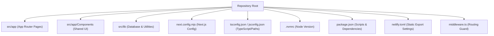
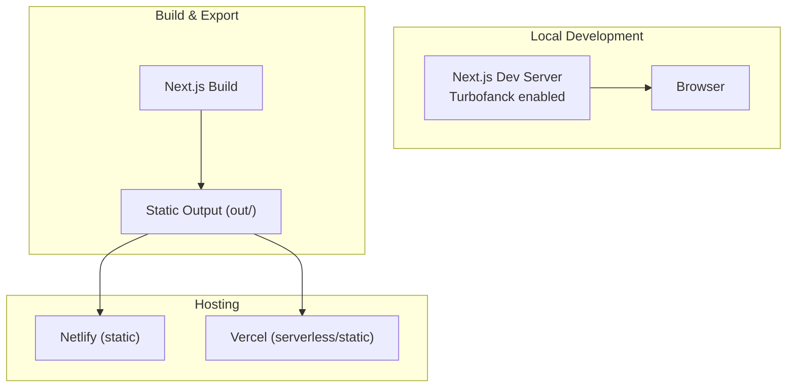
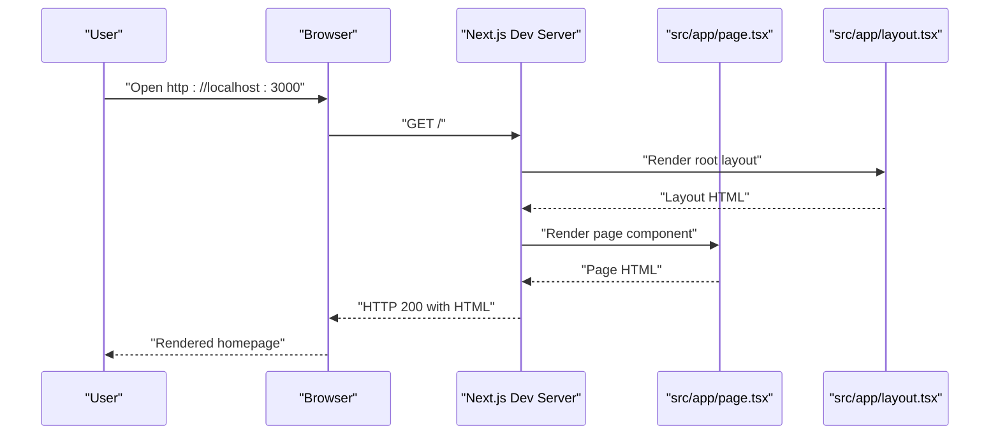
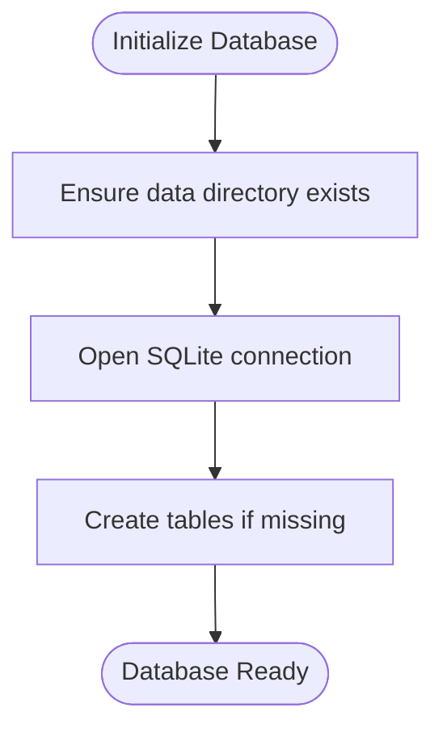
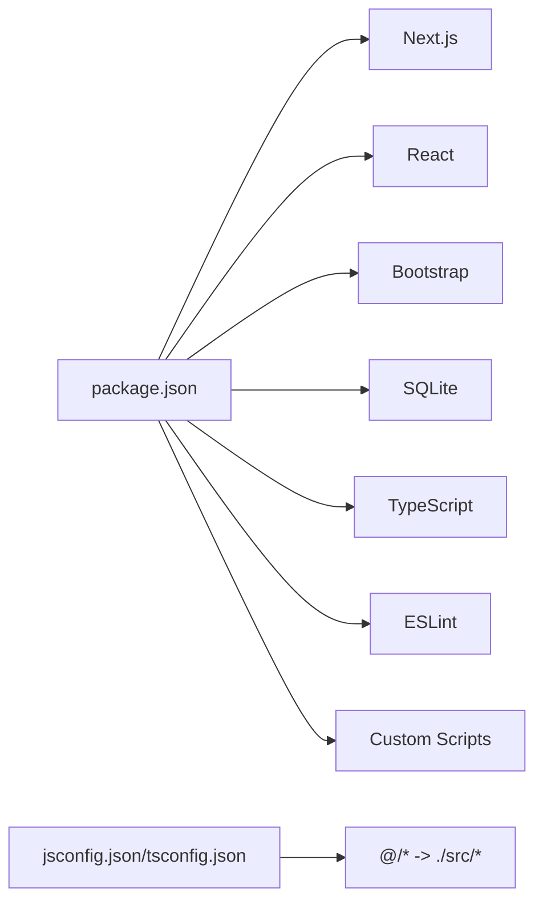

# Getting Started

<cite>
**Referenced Files in This Document**
- [package.json](file://package.json)
- [README.md](file://README.md)
- [.nvmrc](file://.nvmrc)
- [netlify.toml](file://netlify.toml)
- [next.config.mjs](file://next.config.mjs)
- [jsconfig.json](file://jsconfig.json)
- [tsconfig.json](file://tsconfig.json)
- [src/app/layout.tsx](file://src/app/layout.tsx)
- [src/app/page.tsx](file://src/app/page.tsx)
- [src/app/Components/Header/Header1.tsx](file://src/app/Components/Header/Header1.tsx)
- [src/app/Components/HeroBanner/HeroBanner1.tsx](file://src/app/Components/HeroBanner/HeroBanner1.tsx)
- [src/lib/database.ts](file://src/lib/database.ts)
- [middleware.ts](file://middleware.ts)
</cite>

## Table of Contents
1. [Introduction](#introduction)
2. [Project Structure](#project-structure)
3. [Core Components](#core-components)
4. [Architecture Overview](#architecture-overview)
5. [Detailed Component Analysis](#detailed-component-analysis)
6. [Dependency Analysis](#dependency-analysis)
7. [Performance Considerations](#performance-considerations)
8. [Troubleshooting Guide](#troubleshooting-guide)
9. [Conclusion](#conclusion)
10. [Appendices](#appendices)

## Introduction
Welcome to attechglobal.com. This guide helps you install, run, and make your first edits quickly. You will:
- Prepare your environment (Node.js, package manager)
- Install dependencies and run the development server
- Visit the site locally and modify the homepage
- Understand automatic refresh and Next.js App Router basics
- Troubleshoot common setup issues and configure environment variables
- Explore Windows and Unix-like differences, Docker alternatives, and IDE tips

## Project Structure
This project is a Next.js 15 application using the App Router. It includes:
- Application pages under src/app
- Shared components under src/app/Components
- Global styles and assets
- TypeScript configuration and path aliases
- Next.js configuration for static export and image optimization
- A SQLite-backed data layer for images, blogs, and page metadata

**Diagram sources**
- [next.config.mjs](file://next.config.mjs#L1-L129)
- [tsconfig.json](file://tsconfig.json#L1-L39)
- [jsconfig.json](file://jsconfig.json#L1-L8)
- [.nvmrc](file://.nvmrc#L1-L2)
- [package.json](file://package.json#L1-L41)
- [netlify.toml](file://netlify.toml#L1-L21)
- [middleware.ts](file://middleware.ts#L1-L15)

**Section sources**
- [next.config.mjs](file://next.config.mjs#L1-L129)
- [tsconfig.json](file://tsconfig.json#L1-L39)
- [jsconfig.json](file://jsconfig.json#L1-L8)
- [.nvmrc](file://.nvmrc#L1-L2)
- [package.json](file://package.json#L1-L41)
- [netlify.toml](file://netlify.toml#L1-L21)
- [middleware.ts](file://middleware.ts#L1-L15)

## Core Components
- Development server and scripts are defined in package.json. The default dev command starts Next.js with Turbopack.
- The homepage is src/app/page.tsx, which composes reusable components like Header1 and HeroBanner1.
- Global layout (fonts, styles, GA) is configured in src/app/layout.tsx.
- Environment variables are supported via Netlify configuration and Next.js runtime.

Key entry points and responsibilities:
- Dev/start/build commands: [package.json](file://package.json#L5-L11)
- Homepage composition: [src/app/page.tsx](file://src/app/page.tsx#L24-L72)
- Global layout and fonts: [src/app/layout.tsx](file://src/app/layout.tsx#L8-L46)
- Node version requirement: [.nvmrc](file://.nvmrc#L1-L2)
- Static export and image optimization: [next.config.mjs](file://next.config.mjs#L5-L126)
- Netlify export settings: [netlify.toml](file://netlify.toml#L1-L21)

**Section sources**
- [package.json](file://package.json#L5-L11)
- [src/app/page.tsx](file://src/app/page.tsx#L24-L72)
- [src/app/layout.tsx](file://src/app/layout.tsx#L8-L46)
- [.nvmrc](file://.nvmrc#L1-L2)
- [next.config.mjs](file://next.config.mjs#L5-L126)
- [netlify.toml](file://netlify.toml#L1-L21)

## Architecture Overview
The application runs as a client-rendered React app with Next.js App Router. It supports:
- Local development with hot reload
- Static export for platforms like Netlify
- Optional server-side features gated by environment variables

**Diagram sources**
- [package.json](file://package.json#L5-L11)
- [netlify.toml](file://netlify.toml#L1-L21)
- [next.config.mjs](file://next.config.mjs#L3-L9)

## Detailed Component Analysis

### First-Time Setup and Running Locally
Follow these steps to get the project running on your machine:

1) Prerequisites
- Node.js version: Use the version specified in .nvmrc to avoid compatibility issues.
- Package managers: npm, yarn, pnpm, or bun are all supported by the scripts.

2) Clone and install
- Clone the repository to your machine.
- Install dependencies using your preferred package manager.

3) Run the development server
- Start the dev server with the script defined in package.json.
- Open http://localhost:3000 in your browser.

4) Make your first change
- Edit the homepage component to see live updates.
- The page auto-refreshes when you save changes.

5) Understanding the homepage
- The homepage composes multiple sections (header, hero banner, about, etc.) from shared components.
- Global styles and fonts are included in the root layout.

6) Environment variables
- For Netlify deployments, NODE_VERSION is set to 20.
- For static export builds, the Next.js config switches output to export and adjusts trailing slashes and image handling.

7) Windows vs Unix-like systems
- Commands are shell-agnostic; use your OS terminal or PowerShell.
- Ensure your PATH includes your chosen package manager.

8) Docker alternative
- You can run the dev server directly with your installed Node.js and package manager.
- If you prefer containers, build a minimal image with Node 20 and run the dev script.

9) IDE setup recommendations
- Enable TypeScript integration and ESLint per project settings.
- Configure path aliases (@/*) to match jsconfig.json/tsconfig.json.

**Section sources**
- [.nvmrc](file://.nvmrc#L1-L2)
- [package.json](file://package.json#L5-L11)
- [README.md](file://README.md#L3-L21)
- [src/app/page.tsx](file://src/app/page.tsx#L24-L72)
- [src/app/layout.tsx](file://src/app/layout.tsx#L8-L46)
- [netlify.toml](file://netlify.toml#L5-L6)
- [next.config.mjs](file://next.config.mjs#L3-L9)

### Next.js App Router Basics
- Pages are files under src/app. The homepage is src/app/page.tsx.
- Layouts wrap pages; global layout is in src/app/layout.tsx.
- Middleware controls server-side behavior for specific routes.
- Static export is supported via Next.js configuration and Netlify configuration.

**Diagram sources**
- [src/app/page.tsx](file://src/app/page.tsx#L24-L72)
- [src/app/layout.tsx](file://src/app/layout.tsx#L14-L46)

**Section sources**
- [src/app/page.tsx](file://src/app/page.tsx#L24-L72)
- [src/app/layout.tsx](file://src/app/layout.tsx#L14-L46)
- [middleware.ts](file://middleware.ts#L4-L7)

### Database Layer (SQLite)
The project initializes a local SQLite database for images, blogs, and page metadata. It ensures the data directory exists and creates tables on first run.

**Diagram sources**
- [src/lib/database.ts](file://src/lib/database.ts#L84-L184)

**Section sources**
- [src/lib/database.ts](file://src/lib/database.ts#L84-L184)

## Dependency Analysis
- Runtime dependencies include Next.js, React, Bootstrap, and SQLite.
- Dev dependencies include TypeScript, ESLint, and related configs.
- Scripts define dev, build, production start, and lint commands.
- Path aliases simplify imports using @/.

**Diagram sources**
- [package.json](file://package.json#L12-L39)
- [tsconfig.json](file://tsconfig.json#L25-L27)
- [jsconfig.json](file://jsconfig.json#L3-L5)

**Section sources**
- [package.json](file://package.json#L12-L39)
- [tsconfig.json](file://tsconfig.json#L25-L27)
- [jsconfig.json](file://jsconfig.json#L3-L5)

## Performance Considerations
- Turbopack is enabled for faster dev rebuilds.
- Image optimization is configured for static export scenarios.
- Console logs can be removed in production builds.
- Compression is enabled for smaller payloads.

**Section sources**
- [package.json](file://package.json#L6-L10)
- [next.config.mjs](file://next.config.mjs#L116-L126)

## Troubleshooting Guide
Common issues and resolutions:
- Node version mismatch
  - Use the version specified in .nvmrc to prevent build/runtime errors.
- Port already in use
  - Change the Next.js port or stop the conflicting process.
- Missing environment variables
  - For Netlify static export, NODE_VERSION is set to 20.
  - For static export builds, ensure Next.js output is export and images are unoptimized.
- Hot reload not triggering
  - Save files in src/app or shared components; changes should propagate immediately.
- Static export mismatch
  - Verify next.config.mjs output and trailingSlash settings for static hosts.
- Middleware conflicts on static hosts
  - The middleware is configured to avoid server-side behavior on static exports.

**Section sources**
- [.nvmrc](file://.nvmrc#L1-L2)
- [netlify.toml](file://netlify.toml#L5-L6)
- [next.config.mjs](file://next.config.mjs#L3-L9)
- [middleware.ts](file://middleware.ts#L4-L7)

## Conclusion
You now have everything needed to install the project, run it locally, and make your first changes. Use the homepage and shared components as starting points, rely on the provided scripts and configuration, and consult the troubleshooting section if you encounter issues. When ready, deploy using Netlify or Vercel as outlined by the configuration files.

## Appendices

### Quick Reference
- Start dev server: [package.json](file://package.json#L6)
- Visit: http://localhost:3000
- First edit: [src/app/page.tsx](file://src/app/page.tsx#L24-L72)
- Global layout: [src/app/layout.tsx](file://src/app/layout.tsx#L14-L46)
- Node version: [.nvmrc](file://.nvmrc#L1-L2)
- Static export config: [next.config.mjs](file://next.config.mjs#L3-L9), [netlify.toml](file://netlify.toml#L1-L21)
- Path aliases: [jsconfig.json](file://jsconfig.json#L3-L5), [tsconfig.json](file://tsconfig.json#L25-L27)