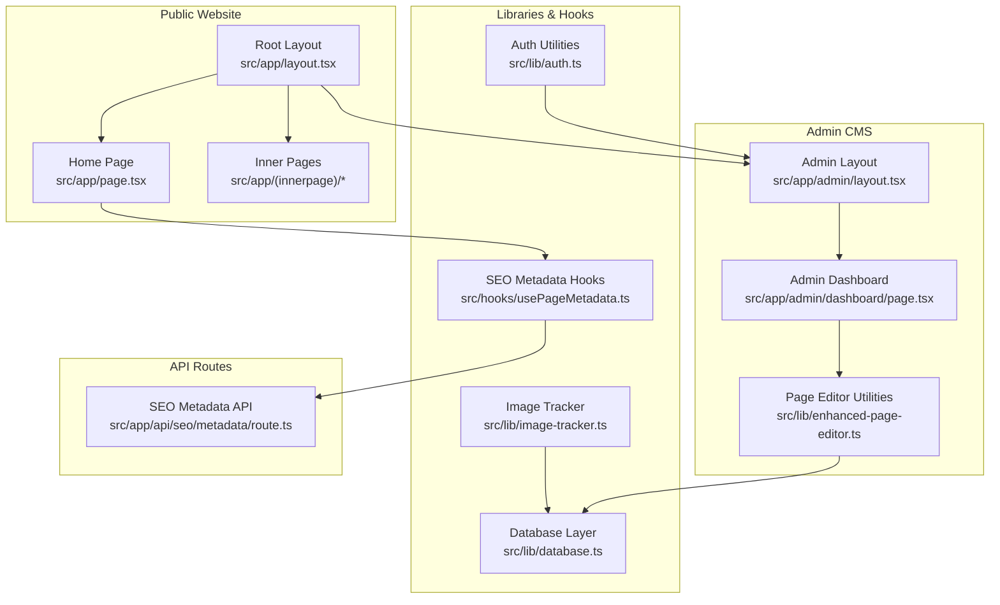
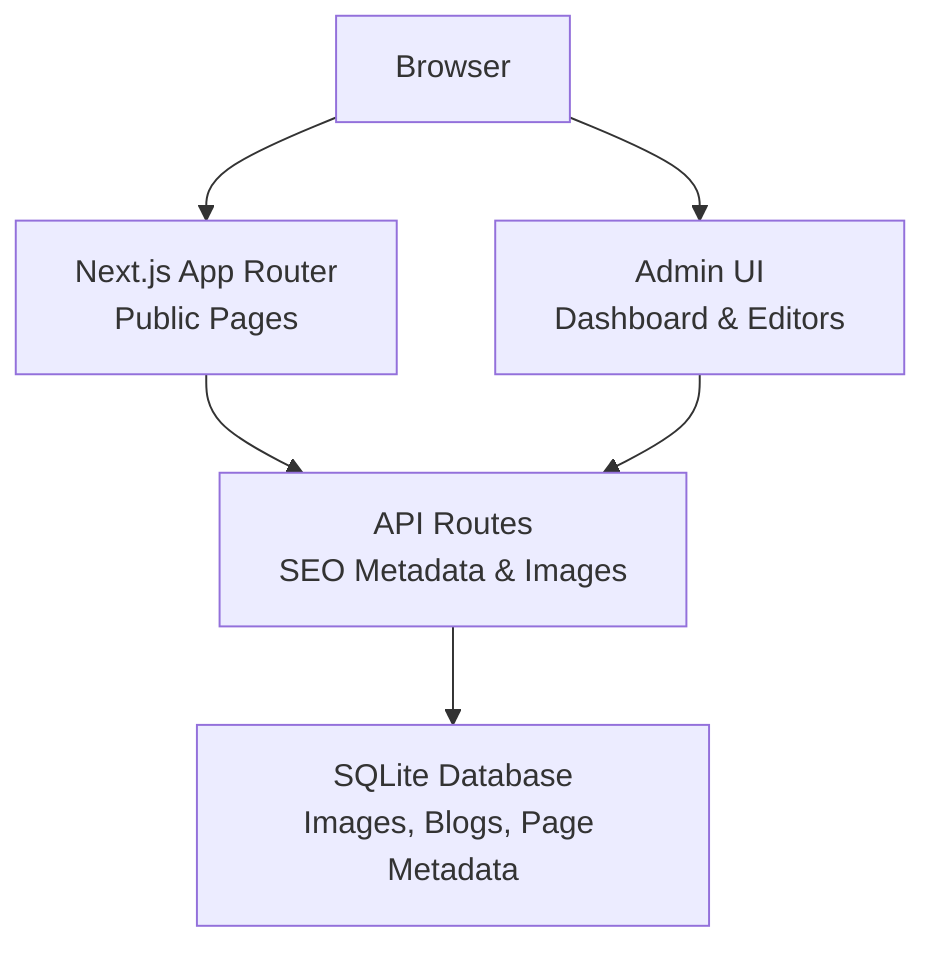
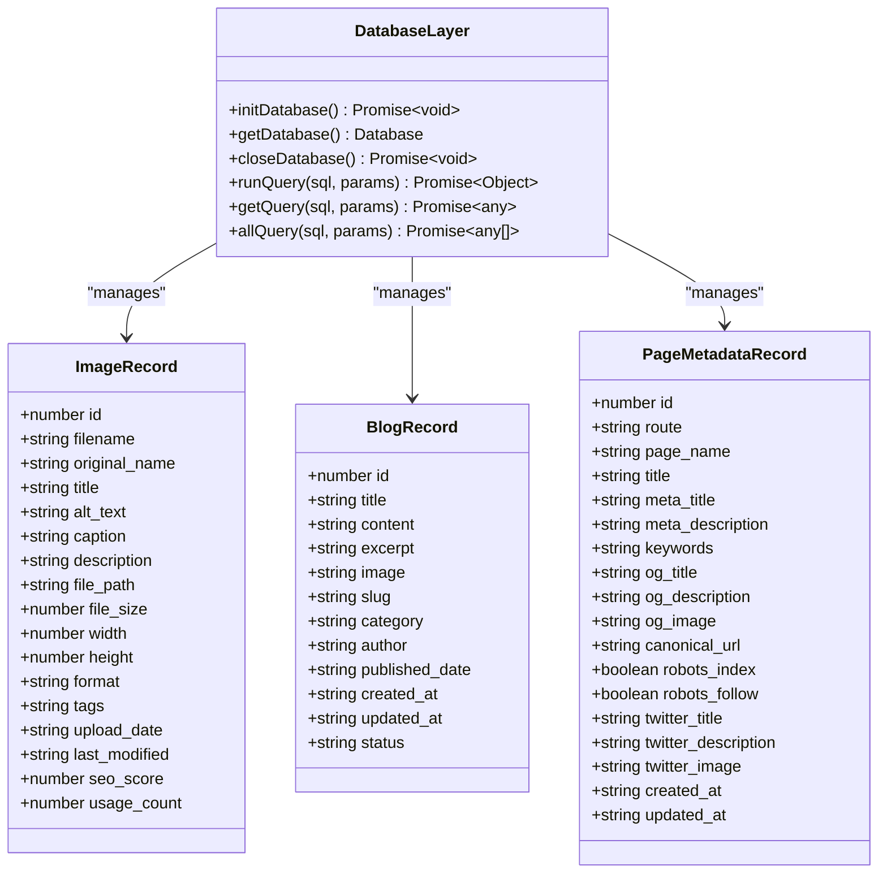
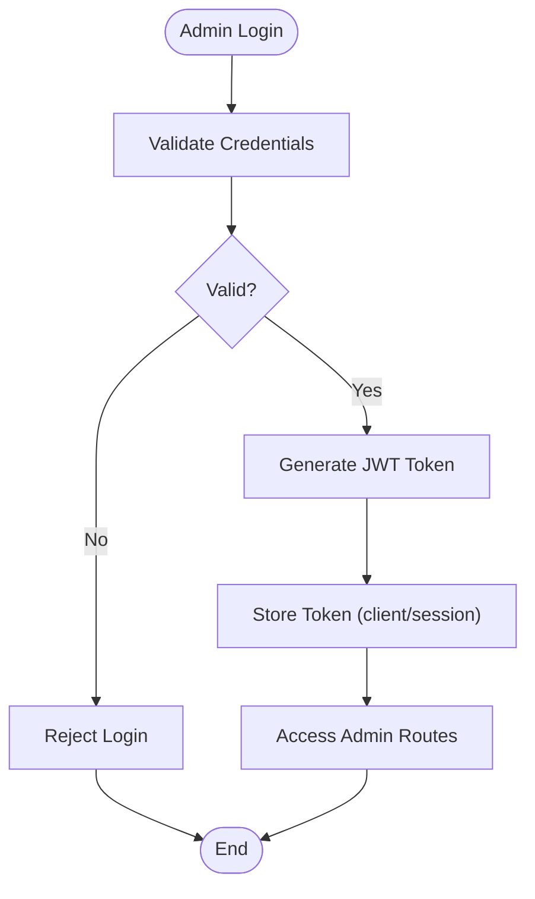
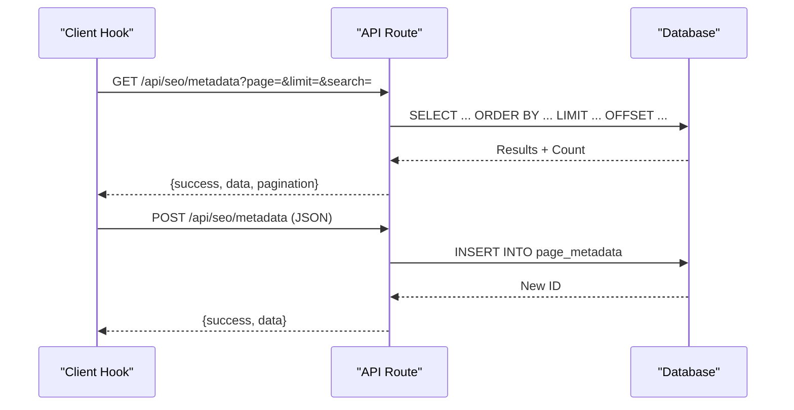
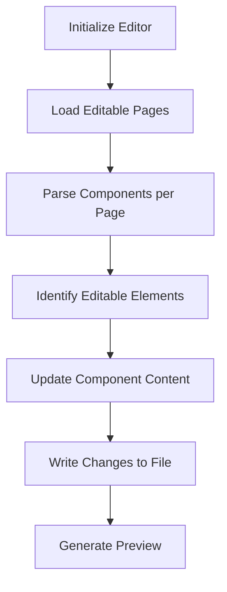
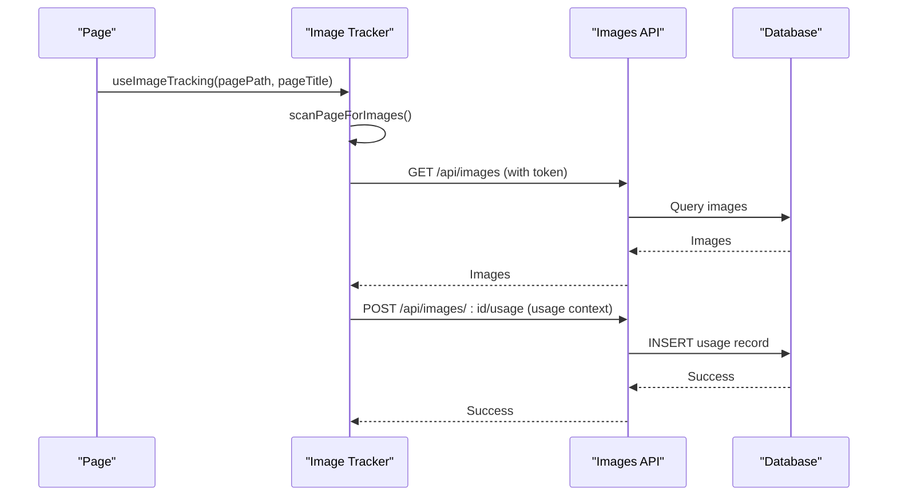
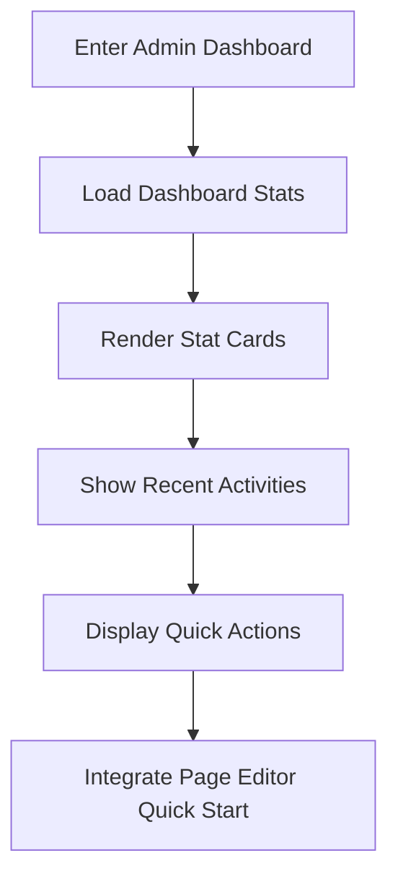
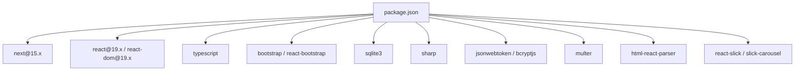

# Project Overview

<cite>
**Referenced Files in This Document**
- [package.json](file://package.json)
- [next.config.mjs](file://next.config.mjs)
- [README.md](file://README.md)
- [src/app/layout.tsx](file://src/app/layout.tsx)
- [src/app/page.tsx](file://src/app/page.tsx)
- [src/app/admin/layout.tsx](file://src/app/admin/layout.tsx)
- [src/lib/database.ts](file://src/lib/database.ts)
- [src/lib/auth.ts](file://src/lib/auth.ts)
- [src/hooks/usePageMetadata.ts](file://src/hooks/usePageMetadata.ts)
- [src/lib/enhanced-page-editor.ts](file://src/lib/enhanced-page-editor.ts)
- [src/lib/image-tracker.ts](file://src/lib/image-tracker.ts)
- [src/app/api/seo/metadata/route.ts](file://src/app/api/seo/metadata/route.ts)
- [src/app/admin/dashboard/page.tsx](file://src/app/admin/dashboard/page.tsx)
- [src/app/Components/Common/ClientWrapper.tsx](file://src/app/Components/Common/ClientWrapper.tsx)
</cite>

## Table of Contents
1. [Introduction](#introduction)
2. [Project Structure](#project-structure)
3. [Core Components](#core-components)
4. [Architecture Overview](#architecture-overview)
5. [Detailed Component Analysis](#detailed-component-analysis)
6. [Dependency Analysis](#dependency-analysis)
7. [Performance Considerations](#performance-considerations)
8. [Troubleshooting Guide](#troubleshooting-guide)
9. [Conclusion](#conclusion)

## Introduction
This document presents the project overview for attechglobal.com, a Next.js 15-based digital marketing agency website. The platform combines a modern frontend built with React 19 and TypeScript, integrated with an admin CMS and content management capabilities. It leverages the Next.js App Router for routing, component-based design patterns, and SQLite for lightweight data persistence. The site emphasizes responsive design, SEO-first metadata management, and an extensible admin dashboard to streamline content updates and asset management.

The project targets stakeholders seeking a high-performance, maintainable marketing website and developers who want a clear understanding of the architecture, data models, and workflows. It aligns with modern web development practices, including static export options, optimized image delivery via Sharp and Next.js Image Optimization, and a pragmatic admin experience for non-technical users.

## Project Structure
The project follows Next.js App Router conventions with a clear separation between the public website and the admin CMS area. Key areas include:
- Public website under src/app with page-based routes and reusable components
- Admin CMS under src/app/admin with dedicated dashboards and editors
- Shared libraries for database operations, authentication, SEO metadata hooks, and page editing utilities
- API routes under src/app/api for server-side data operations (e.g., SEO metadata)

**Diagram sources**
- [src/app/layout.tsx](file://src/app/layout.tsx#L14-L46)
- [src/app/page.tsx](file://src/app/page.tsx#L24-L74)
- [src/app/admin/layout.tsx](file://src/app/admin/layout.tsx#L6-L22)
- [src/app/admin/dashboard/page.tsx](file://src/app/admin/dashboard/page.tsx#L13-L196)
- [src/lib/enhanced-page-editor.ts](file://src/lib/enhanced-page-editor.ts#L26-L286)
- [src/lib/database.ts](file://src/lib/database.ts#L84-L184)
- [src/hooks/usePageMetadata.ts](file://src/hooks/usePageMetadata.ts#L13-L51)
- [src/lib/image-tracker.ts](file://src/lib/image-tracker.ts#L11-L65)
- [src/app/api/seo/metadata/route.ts](file://src/app/api/seo/metadata/route.ts#L15-L66)

**Section sources**
- [src/app/layout.tsx](file://src/app/layout.tsx#L14-L46)
- [src/app/page.tsx](file://src/app/page.tsx#L24-L74)
- [src/app/admin/layout.tsx](file://src/app/admin/layout.tsx#L6-L22)
- [src/lib/database.ts](file://src/lib/database.ts#L84-L184)
- [src/hooks/usePageMetadata.ts](file://src/hooks/usePageMetadata.ts#L13-L51)
- [src/lib/enhanced-page-editor.ts](file://src/lib/enhanced-page-editor.ts#L26-L286)
- [src/app/api/seo/metadata/route.ts](file://src/app/api/seo/metadata/route.ts#L15-L66)

## Core Components
- Next.js App Router and React 19: The application uses the App Router with page-based routes and client components for interactivity. The root layout initializes global styles and analytics, while individual pages compose reusable components.
- Admin CMS: The admin area provides a Bootstrap-styled dashboard and sidebar, with a focus on quick actions and page editor integration.
- Database and ORM: A SQLite-based library defines typed models for images, blogs, and page metadata, with helper functions for initialization, CRUD operations, and queries.
- Authentication: Lightweight JWT-based admin authentication with role checks for secure admin access.
- SEO Metadata Management: Client-side hooks and API routes enable fetching, paginated listing, creation, and updates of page metadata for SEO optimization.
- Page Editing Utilities: An enhanced page editor scans page components and exposes editable content for rapid content management.
- Image Tracking: Utilities to track image usage across pages and persist usage records in the database.
- Responsive Design and Assets: Bootstrap and custom CSS provide responsive layouts, with Sharp and Next.js Image Optimization for efficient image delivery.

Practical examples:
- Responsive design: The root layout imports Bootstrap CSS and custom styles, ensuring consistent responsive behavior across devices.
- Admin dashboard: The dashboard displays statistics cards and recent activities, integrating with the admin layout and sidebar.
- Content management: The SEO metadata hooks and API routes demonstrate fetching and updating page metadata for SEO.

**Section sources**
- [src/app/layout.tsx](file://src/app/layout.tsx#L1-L47)
- [src/app/admin/layout.tsx](file://src/app/admin/layout.tsx#L1-L23)
- [src/app/admin/dashboard/page.tsx](file://src/app/admin/dashboard/page.tsx#L13-L196)
- [src/lib/database.ts](file://src/lib/database.ts#L18-L81)
- [src/lib/auth.ts](file://src/lib/auth.ts#L5-L84)
- [src/hooks/usePageMetadata.ts](file://src/hooks/usePageMetadata.ts#L13-L51)
- [src/lib/enhanced-page-editor.ts](file://src/lib/enhanced-page-editor.ts#L26-L286)
- [src/lib/image-tracker.ts](file://src/lib/image-tracker.ts#L11-L65)

## Architecture Overview
The system architecture centers around the Next.js App Router, separating public-facing pages from the admin CMS. Data flows through API routes to a SQLite database, with client-side hooks managing SEO metadata and page editing utilities. The admin dashboard integrates with the page editor to streamline content updates.

**Diagram sources**
- [src/app/page.tsx](file://src/app/page.tsx#L24-L74)
- [src/app/admin/dashboard/page.tsx](file://src/app/admin/dashboard/page.tsx#L13-L196)
- [src/app/api/seo/metadata/route.ts](file://src/app/api/seo/metadata/route.ts#L15-L66)
- [src/lib/database.ts](file://src/lib/database.ts#L84-L184)

## Detailed Component Analysis

### Database Layer
The database layer encapsulates SQLite operations with typed interfaces for images, blogs, and page metadata. It initializes tables on first use, exposes helpers for running queries, and manages connections.

Key responsibilities:
- Initialize and create tables for images, image usage, blogs, and page metadata
- Provide typed CRUD helpers for queries
- Manage database lifecycle (open/close)

**Diagram sources**
- [src/lib/database.ts](file://src/lib/database.ts#L18-L81)
- [src/lib/database.ts](file://src/lib/database.ts#L84-L184)

**Section sources**
- [src/lib/database.ts](file://src/lib/database.ts#L84-L184)

### Admin Authentication
The authentication module provides password hashing, JWT generation/verification, and admin role checks. It supports login and token-based access control for admin routes.

**Diagram sources**
- [src/lib/auth.ts](file://src/lib/auth.ts#L62-L79)

**Section sources**
- [src/lib/auth.ts](file://src/lib/auth.ts#L5-L84)

### SEO Metadata Management
The SEO metadata system consists of client-side hooks and server-side API routes. The hooks expose functions to fetch, list, create, and update page metadata, while the API routes handle database operations.

**Diagram sources**
- [src/hooks/usePageMetadata.ts](file://src/hooks/usePageMetadata.ts#L70-L134)
- [src/app/api/seo/metadata/route.ts](file://src/app/api/seo/metadata/route.ts#L15-L66)

**Section sources**
- [src/hooks/usePageMetadata.ts](file://src/hooks/usePageMetadata.ts#L13-L51)
- [src/hooks/usePageMetadata.ts](file://src/hooks/usePageMetadata.ts#L70-L134)
- [src/app/api/seo/metadata/route.ts](file://src/app/api/seo/metadata/route.ts#L15-L66)

### Enhanced Page Editor
The enhanced page editor scans page components to identify editable content (text, images, links, titles) and supports updating components by replacing content in context. It maintains a registry of editable pages and provides utilities for previewing and updating content.

**Diagram sources**
- [src/lib/enhanced-page-editor.ts](file://src/lib/enhanced-page-editor.ts#L50-L76)
- [src/lib/enhanced-page-editor.ts](file://src/lib/enhanced-page-editor.ts#L78-L100)
- [src/lib/enhanced-page-editor.ts](file://src/lib/enhanced-page-editor.ts#L239-L272)

**Section sources**
- [src/lib/enhanced-page-editor.ts](file://src/lib/enhanced-page-editor.ts#L26-L286)

### Image Tracking and Usage
The image tracker monitors images on a page and records their usage against the database. It integrates with the admin dashboard and page editor to keep asset usage metrics accurate.

**Diagram sources**
- [src/lib/image-tracker.ts](file://src/lib/image-tracker.ts#L46-L65)
- [src/lib/image-tracker.ts](file://src/lib/image-tracker.ts#L11-L43)

**Section sources**
- [src/lib/image-tracker.ts](file://src/lib/image-tracker.ts#L11-L65)

### Admin Dashboard and Quick Actions
The admin dashboard aggregates statistics and recent activities, and integrates quick-start components for common tasks like adding services, creating blog posts, and adding projects. It uses the admin layout and sidebar for navigation.

**Diagram sources**
- [src/app/admin/dashboard/page.tsx](file://src/app/admin/dashboard/page.tsx#L13-L196)
- [src/app/admin/layout.tsx](file://src/app/admin/layout.tsx#L6-L22)

**Section sources**
- [src/app/admin/dashboard/page.tsx](file://src/app/admin/dashboard/page.tsx#L13-L196)
- [src/app/admin/layout.tsx](file://src/app/admin/layout.tsx#L6-L22)

## Dependency Analysis
The project relies on Next.js 15, React 19, TypeScript, Bootstrap, and SQLite for core functionality. Additional packages include Sharp for image processing, Multer for uploads, and JWT/Bcrypt for authentication.

**Diagram sources**
- [package.json](file://package.json#L12-L30)

**Section sources**
- [package.json](file://package.json#L12-L30)

## Performance Considerations
- Static export and cPanel compatibility: The Next.js configuration supports static export with trailing slashes and unoptimized images for environments requiring static hosting.
- Image optimization: Next.js Image Optimization is configured with supported formats (WebP, AVIF), device sizes, and content security policies to reduce payload and improve loading performance.
- Console removal: Console logs are removed in production builds to minimize bundle size.
- Compression: Gzip compression is enabled to reduce transfer sizes.

Recommendations:
- Prefer server-side rendering or static generation for SEO-heavy pages.
- Use image lazy loading and appropriate sizes for optimal performance.
- Monitor build times and consider incremental builds during development.

**Section sources**
- [next.config.mjs](file://next.config.mjs#L1-L129)

## Troubleshooting Guide
Common issues and resolutions:
- Database not initialized: Ensure the database initialization runs before queries. The database helper throws an error if accessed before initialization.
- API route errors: Verify the database is initialized on first request and that required fields are present when creating records.
- Admin authentication failures: Confirm credentials and JWT secret are correctly configured and tokens are stored and sent with requests.
- Image tracking failures: Ensure the admin token is present and the images API responds with a successful list of images before attempting to log usage.

**Section sources**
- [src/lib/database.ts](file://src/lib/database.ts#L84-L96)
- [src/app/api/seo/metadata/route.ts](file://src/app/api/seo/metadata/route.ts#L6-L13)
- [src/lib/auth.ts](file://src/lib/auth.ts#L62-L79)
- [src/lib/image-tracker.ts](file://src/lib/image-tracker.ts#L14-L42)

## Conclusion
The attechglobal.com website is a robust, Next.js 15-based marketing platform that blends a responsive frontend with a practical admin CMS. Its architecture leverages the App Router, component-based design, and SQLite for efficient content and asset management. The SEO metadata hooks, enhanced page editor, and image tracking utilities provide a developer-friendly foundation for maintaining and optimizing the site. With Bootstrap and Sharp, the platform balances ease of development with strong performance characteristics suitable for modern digital marketing needs.