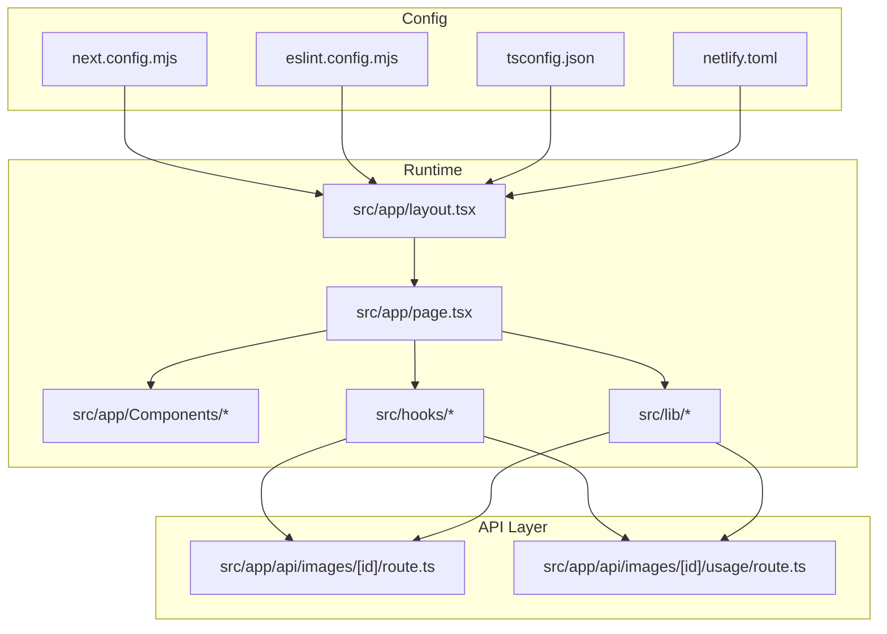
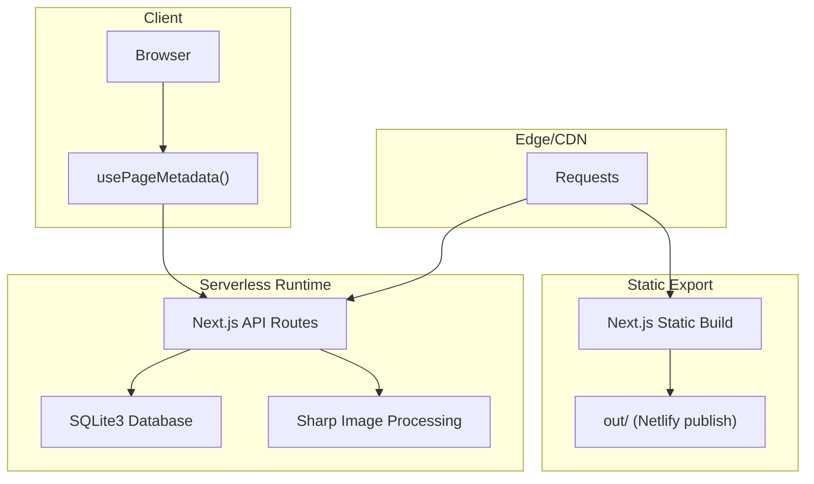
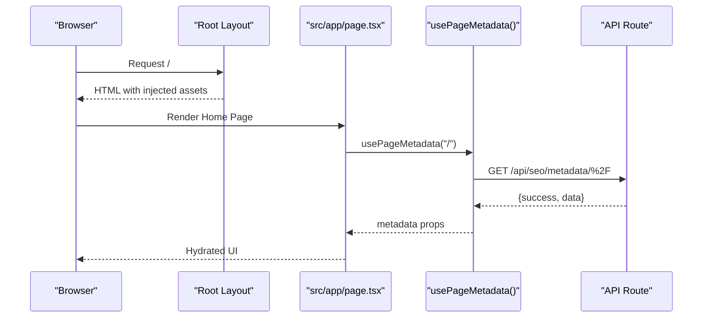
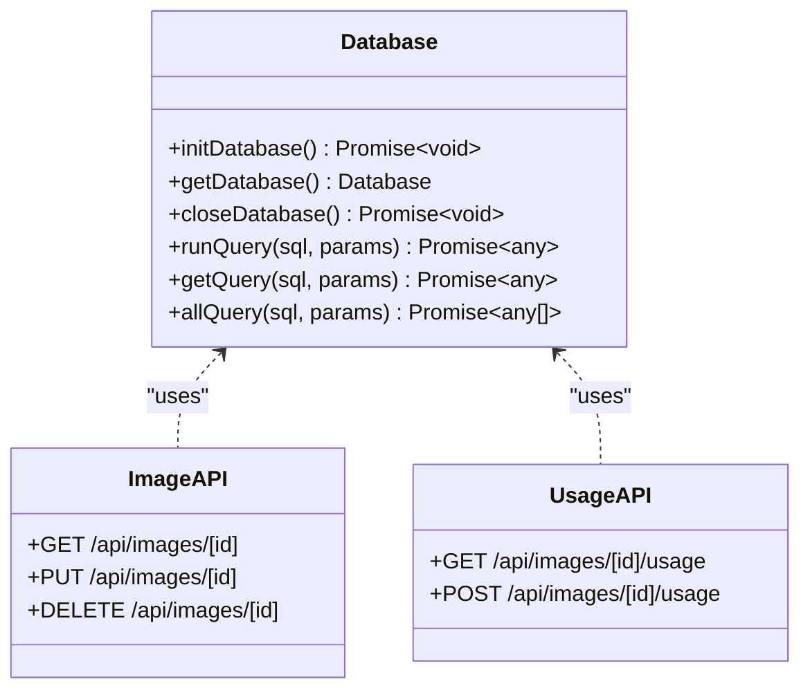
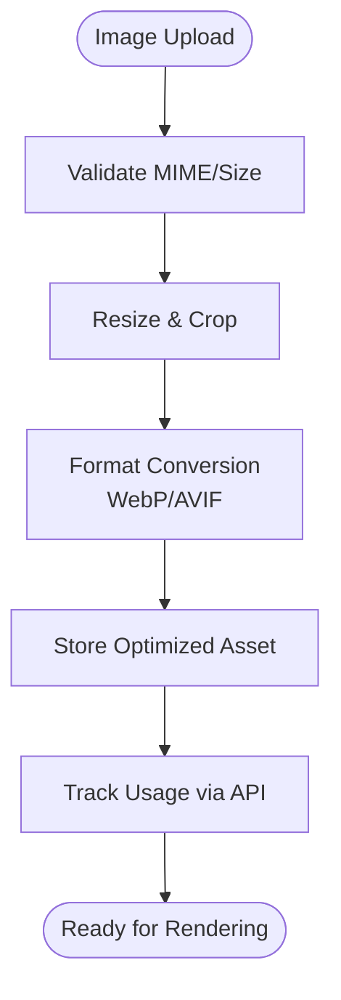
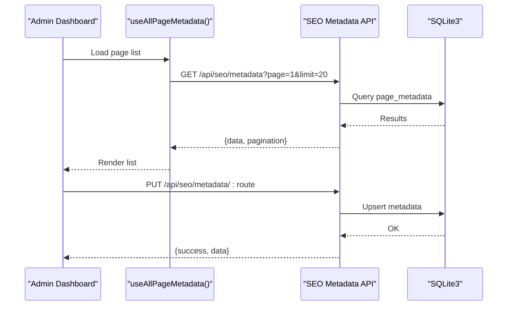
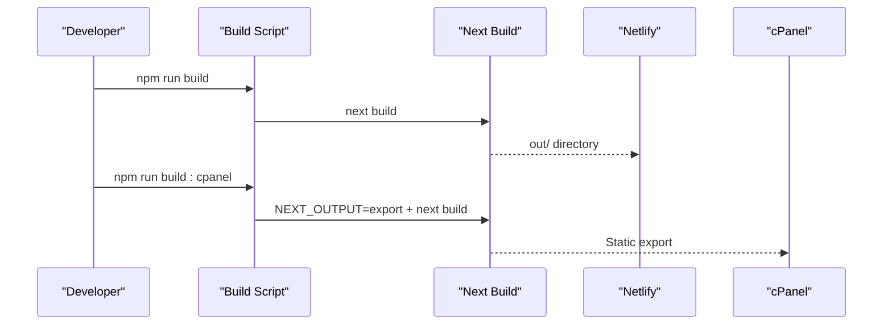
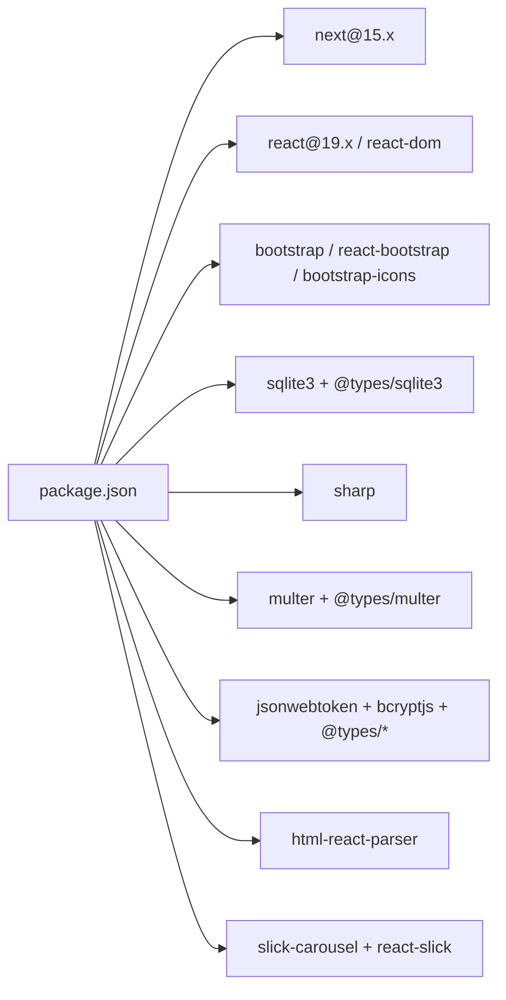

# Technology Stack

<cite>
**Referenced Files in This Document**
- [package.json](file://package.json)
- [next.config.mjs](file://next.config.mjs)
- [tsconfig.json](file://tsconfig.json)
- [eslint.config.mjs](file://eslint.config.mjs)
- [netlify.toml](file://netlify.toml)
- [.nvmrc](file://.nvmrc)
- [src/app/layout.tsx](file://src/app/layout.tsx)
- [src/app/page.tsx](file://src/app/page.tsx)
- [src/lib/database.ts](file://src/lib/database.ts)
- [src/lib/image-tracker.ts](file://src/lib/image-tracker.ts)
- [src/app/api/images/[id]/route.ts](file://src/app/api/images/[id]/route.ts)
- [src/app/api/images/[id]/usage/route.ts](file://src/app/api/images/[id]/usage/route.ts)
- [src/lib/enhanced-page-editor.ts](file://src/lib/enhanced-page-editor.ts)
- [src/hooks/usePageMetadata.ts](file://src/hooks/usePageMetadata.ts)
- [src/app/sitemap.ts](file://src/app/sitemap.ts)
- [README.md](file://README.md)
- [CPANEL_DEPLOYMENT.md](file://CPANEL_DEPLOYMENT.md)
- [IMAGE_MANAGEMENT_SETUP.md](file://IMAGE_MANAGEMENT_SETUP.md)
- [ADMIN_DASHBOARD_SETUP.md](file://ADMIN_DASHBOARD_SETUP.md)
- [SITEMAP_SETUP.md](file://SITEMAP_SETUP.md)
</cite>

## Table of Contents
1. [Introduction](#introduction)
2. [Project Structure](#project-structure)
3. [Core Components](#core-components)
4. [Architecture Overview](#architecture-overview)
5. [Detailed Component Analysis](#detailed-component-analysis)
6. [Dependency Analysis](#dependency-analysis)
7. [Performance Considerations](#performance-considerations)
8. [Troubleshooting Guide](#troubleshooting-guide)
9. [Conclusion](#conclusion)
10. [Appendices](#appendices)

## Introduction
This document provides a comprehensive technology stack overview for attechglobal.com. It covers the Next.js 15 ecosystem (App Router, server-side rendering, static generation, ISR), frontend technologies (React 19, TypeScript, Bootstrap, modern CSS), backend infrastructure (SQLite3, API routes, serverless deployment), development toolchain (ESLint, TypeScript compilation, build optimization), image processing pipeline (Sharp), deployment stack (Netlify, cPanel export), and upgrade considerations. It also includes rationale for technology choices, performance implications, and practical setup instructions for development and production.

## Project Structure
The project follows Next.js App Router conventions with:
- Application shell and global styles in the root layout
- Feature-based pages under src/app
- Shared components under src/app/Components
- Utilities and libraries under src/lib
- Hooks under src/hooks
- API routes under src/app/api
- Build-time and runtime configuration files at the repository root

**Diagram sources**
- [src/app/layout.tsx](file://src/app/layout.tsx#L1-L47)
- [src/app/page.tsx](file://src/app/page.tsx#L1-L75)
- [src/app/api/images/[id]/route.ts](file://src/app/api/images/[id]/route.ts#L1-L158)
- [src/app/api/images/[id]/usage/route.ts](file://src/app/api/images/[id]/usage/route.ts#L1-L95)
- [next.config.mjs](file://next.config.mjs#L1-L129)
- [eslint.config.mjs](file://eslint.config.mjs#L1-L15)
- [tsconfig.json](file://tsconfig.json#L1-L39)
- [netlify.toml](file://netlify.toml#L1-L21)

**Section sources**
- [src/app/layout.tsx](file://src/app/layout.tsx#L1-L47)
- [src/app/page.tsx](file://src/app/page.tsx#L1-L75)
- [next.config.mjs](file://next.config.mjs#L1-L129)
- [eslint.config.mjs](file://eslint.config.mjs#L1-L15)
- [tsconfig.json](file://tsconfig.json#L1-L39)
- [netlify.toml](file://netlify.toml#L1-L21)

## Core Components
- Next.js 15 App Router with SSR/SSG and ISR
- React 19 with strict TypeScript configuration
- Bootstrap 5 and Bootstrap Icons for UI primitives
- SQLite3-backed CMS and SEO metadata management
- Sharp-based image processing and optimization
- Netlify static export and cPanel export pipeline
- ESLint with Next.js recommended rules

**Section sources**
- [package.json](file://package.json#L12-L39)
- [next.config.mjs](file://next.config.mjs#L1-L129)
- [tsconfig.json](file://tsconfig.json#L1-L39)
- [eslint.config.mjs](file://eslint.config.mjs#L1-L15)
- [src/lib/database.ts](file://src/lib/database.ts#L1-L255)
- [src/app/api/images/[id]/route.ts](file://src/app/api/images/[id]/route.ts#L1-L158)

## Architecture Overview
The application is a hybrid static and dynamic site:
- Static export for cPanel hosting and Netlify deployment
- API routes for CMS operations (images, SEO metadata)
- ISR-driven sitemap generation
- Client-side hooks for SEO metadata retrieval
- Image tracking and usage analytics via API endpoints

**Diagram sources**
- [netlify.toml](file://netlify.toml#L1-L21)
- [next.config.mjs](file://next.config.mjs#L1-L129)
- [src/app/api/images/[id]/route.ts](file://src/app/api/images/[id]/route.ts#L1-L158)
- [src/lib/database.ts](file://src/lib/database.ts#L1-L255)
- [src/hooks/usePageMetadata.ts](file://src/hooks/usePageMetadata.ts#L1-L218)

## Detailed Component Analysis

### Next.js 15 App Router and Rendering Modes
- App Router with root layout injecting fonts, CSS, and global scripts
- Static export enabled conditionally via environment variable for cPanel builds
- ISR configured for sitemap generation
- Image optimization with WebP/AVIF and remote pattern support

**Diagram sources**
- [src/app/layout.tsx](file://src/app/layout.tsx#L1-L47)
- [src/app/page.tsx](file://src/app/page.tsx#L1-L75)
- [src/hooks/usePageMetadata.ts](file://src/hooks/usePageMetadata.ts#L1-L218)
- [src/app/api/images/[id]/route.ts](file://src/app/api/images/[id]/route.ts#L1-L158)

**Section sources**
- [src/app/layout.tsx](file://src/app/layout.tsx#L1-L47)
- [src/app/page.tsx](file://src/app/page.tsx#L1-L75)
- [next.config.mjs](file://next.config.mjs#L1-L129)
- [src/app/sitemap.ts](file://src/app/sitemap.ts#L1-L154)

### Backend Infrastructure: SQLite3 and API Routes
- Centralized database initialization and schema creation
- CRUD endpoints for images with SEO scoring and usage tracking
- Usage endpoint for page-to-image relationship logging
- Client-side image tracking utility invoking usage API

**Diagram sources**
- [src/lib/database.ts](file://src/lib/database.ts#L1-L255)
- [src/app/api/images/[id]/route.ts](file://src/app/api/images/[id]/route.ts#L1-L158)
- [src/app/api/images/[id]/usage/route.ts](file://src/app/api/images/[id]/usage/route.ts#L1-L95)

**Section sources**
- [src/lib/database.ts](file://src/lib/database.ts#L1-L255)
- [src/app/api/images/[id]/route.ts](file://src/app/api/images/[id]/route.ts#L1-L158)
- [src/app/api/images/[id]/usage/route.ts](file://src/app/api/images/[id]/usage/route.ts#L1-L95)
- [src/lib/image-tracker.ts](file://src/lib/image-tracker.ts#L1-L95)

### Image Processing Pipeline with Sharp
- Sharp dependency included for optimization and format conversion
- Next.js image optimization configured for WebP/AVIF and remote patterns
- Static export requires unoptimized images; Sharp can be used during build or server-side transformations

**Diagram sources**
- [package.json](file://package.json#L28-L28)
- [next.config.mjs](file://next.config.mjs#L10-L112)

**Section sources**
- [package.json](file://package.json#L28-L28)
- [next.config.mjs](file://next.config.mjs#L10-L112)

### SEO Metadata Management and Page Editor
- Client hooks for fetching, paginated listing, and updating page metadata
- Enhanced page editor scanning JSX for editable components and updating content
- API routes for metadata CRUD operations

**Diagram sources**
- [src/hooks/usePageMetadata.ts](file://src/hooks/usePageMetadata.ts#L70-L135)
- [src/lib/enhanced-page-editor.ts](file://src/lib/enhanced-page-editor.ts#L50-L76)
- [src/lib/database.ts](file://src/lib/database.ts#L62-L81)

**Section sources**
- [src/hooks/usePageMetadata.ts](file://src/hooks/usePageMetadata.ts#L1-L218)
- [src/lib/enhanced-page-editor.ts](file://src/lib/enhanced-page-editor.ts#L1-L287)
- [src/lib/database.ts](file://src/lib/database.ts#L62-L81)

### Deployment Stack
- Netlify static export with redirect fallback and security headers
- cPanel export via environment flag and static export configuration
- Sitemap ISR for incremental updates

**Diagram sources**
- [package.json](file://package.json#L5-L11)
- [next.config.mjs](file://next.config.mjs#L2-L12)
- [netlify.toml](file://netlify.toml#L1-L21)

**Section sources**
- [package.json](file://package.json#L5-L11)
- [next.config.mjs](file://next.config.mjs#L2-L12)
- [netlify.toml](file://netlify.toml#L1-L21)
- [src/app/sitemap.ts](file://src/app/sitemap.ts#L12-L15)

## Dependency Analysis
Key runtime dependencies and their roles:
- next: App Router, SSR/SSG, ISR, image optimization
- react, react-dom: UI framework
- bootstrap, react-bootstrap, bootstrap-icons: UI primitives and icons
- sqlite3, @types/sqlite3: Local database and typings
- sharp: Image processing
- multer, @types/multer: File uploads
- jsonwebtoken, bcryptjs, @types/jsonwebtoken, @types/bcryptjs: Authentication and security
- html-react-parser: Parsing HTML into React nodes
- slick-carousel, react-slick: Carousel components

Development dependencies:
- typescript, @types/react, @types/node: Type safety
- eslint, eslint-config-next: Linting
- @eslint/eslintrc: Flat config compatibility

**Diagram sources**
- [package.json](file://package.json#L12-L39)

**Section sources**
- [package.json](file://package.json#L12-L39)

## Performance Considerations
- Static export reduces server costs and improves cold start times
- Image optimization (WebP/AVIF) and device sizes reduce payload sizes
- Console removal in production and compression enabled improve runtime performance
- ISR for sitemap keeps search engine indexing fresh without full rebuilds
- Lazy loading wrappers used in home page reduce initial bundle impact

Recommendations:
- Monitor image CDN performance and adjust deviceSizes for target devices
- Consider enabling App Router’s built-in code splitting and route-level lazy loading
- Evaluate serverless function timeouts for image processing tasks

**Section sources**
- [next.config.mjs](file://next.config.mjs#L10-L129)
- [src/app/page.tsx](file://src/app/page.tsx#L17-L21)

## Troubleshooting Guide
Common issues and resolutions:
- Static export image errors: Ensure images are served unoptimized in static export mode
- API route failures: Verify database initialization and table creation on first request
- Sitemap generation errors: Confirm dynamic route providers and file path discovery logic
- Netlify redirects: Ensure wildcard redirect to index.html for client-side routing
- cPanel export: Use the dedicated build script with export flag

**Section sources**
- [next.config.mjs](file://next.config.mjs#L2-L12)
- [src/lib/database.ts](file://src/lib/database.ts#L84-L184)
- [src/app/sitemap.ts](file://src/app/sitemap.ts#L88-L153)
- [netlify.toml](file://netlify.toml#L8-L12)
- [package.json](file://package.json#L8-L8)

## Conclusion
The attechglobal.com stack combines a modern, performant Next.js 15 App Router with a pragmatic backend leveraging SQLite3 and API routes. The dual deployment targets (Netlify and cPanel) maximize flexibility, while Sharp and Next’s image optimization deliver strong UX. The SEO metadata hooks and ISR-driven sitemap ensure maintainability and search visibility. The setup is straightforward for developers and operations teams, with clear upgrade paths for future enhancements.

## Appendices

### Setup Instructions

- Prerequisites
  - Node.js version aligned with project specification
  - Git for version control

- Development Environment
  - Install dependencies
  - Run development server
  - Open browser to the development URL

- Production Builds
  - Netlify: Build command runs Next build; publish directory is out/
  - cPanel: Use the cPanel build script to enable static export and build

- Database Initialization
  - On first run, database initializes and creates tables automatically

- Image Management
  - Use the image API endpoints to manage metadata and usage
  - Sharp is available for optimization during build or server-side processing

- SEO Metadata
  - Use the provided hooks to fetch and update page metadata
  - The enhanced page editor scans pages for editable components

**Section sources**
- [.nvmrc](file://.nvmrc#L1-L1)
- [package.json](file://package.json#L5-L11)
- [netlify.toml](file://netlify.toml#L1-L21)
- [src/lib/database.ts](file://src/lib/database.ts#L84-L184)
- [src/hooks/usePageMetadata.ts](file://src/hooks/usePageMetadata.ts#L1-L218)
- [IMAGE_MANAGEMENT_SETUP.md](file://IMAGE_MANAGEMENT_SETUP.md#L1-L200)
- [ADMIN_DASHBOARD_SETUP.md](file://ADMIN_DASHBOARD_SETUP.md#L1-L200)
- [SITEMAP_SETUP.md](file://SITEMAP_SETUP.md#L1-L200)

### Version Compatibility Matrix
- Next.js 15.3.6
- React 19.2.0
- TypeScript 5.9.x
- ESLint 9.x with Next.js flat config
- Node.js LTS per .nvmrc

Upgrade considerations:
- Validate App Router migration paths for any legacy pages
- Review image optimization settings after major Next.js updates
- Ensure ESLint flat config compatibility for future versions

**Section sources**
- [package.json](file://package.json#L23-L26)
- [package.json](file://package.json#L37-L38)
- [.nvmrc](file://.nvmrc#L1-L1)