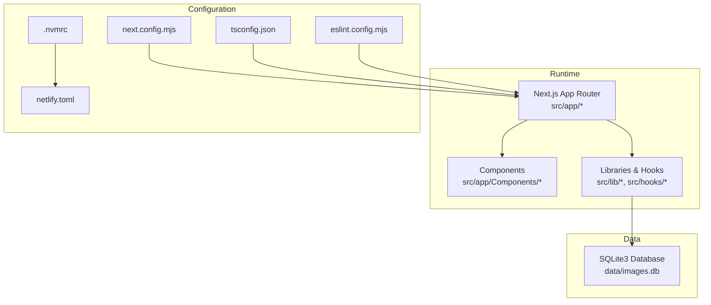
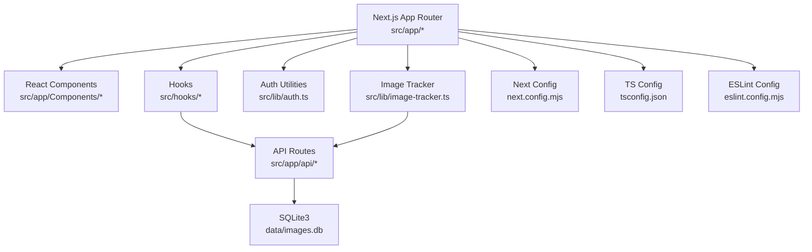
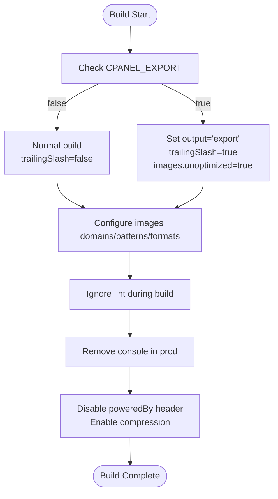
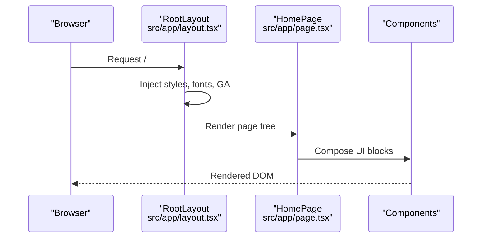
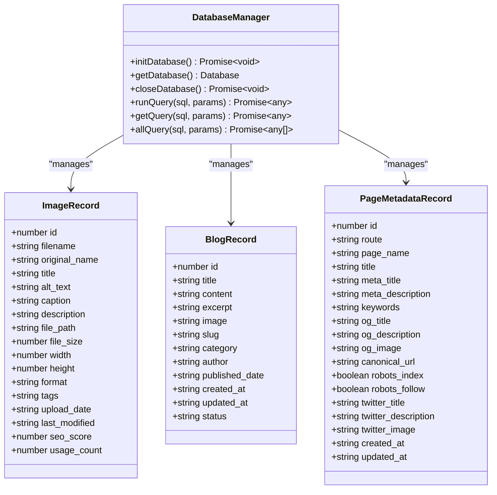
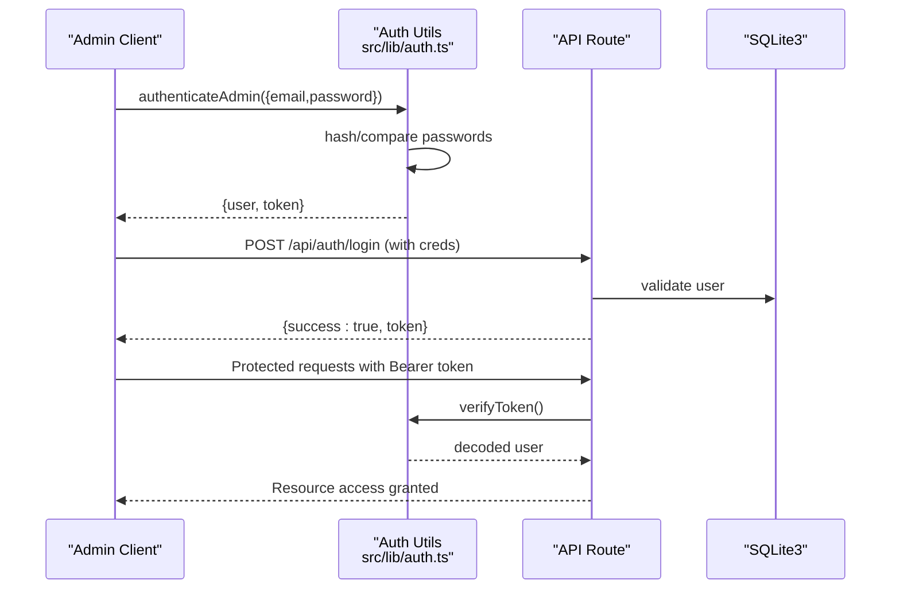
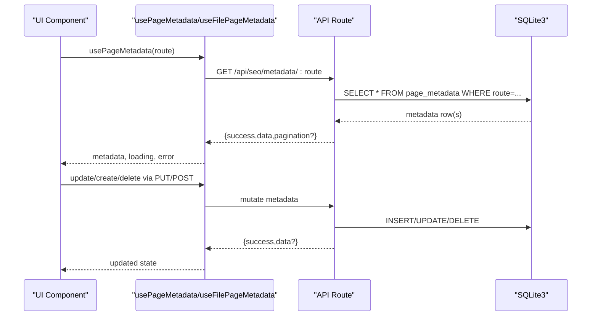
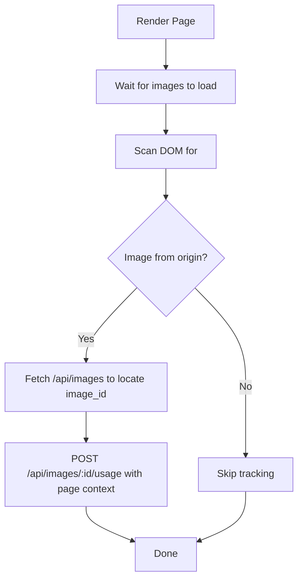
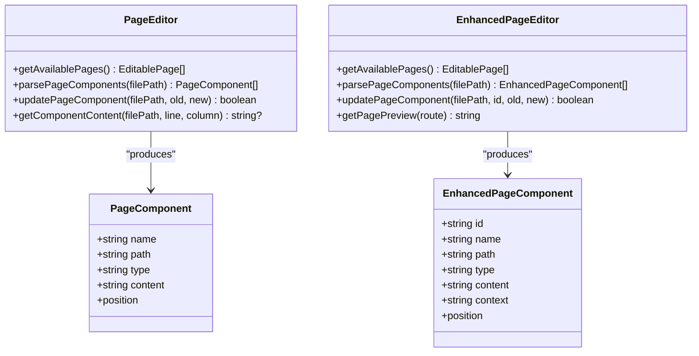
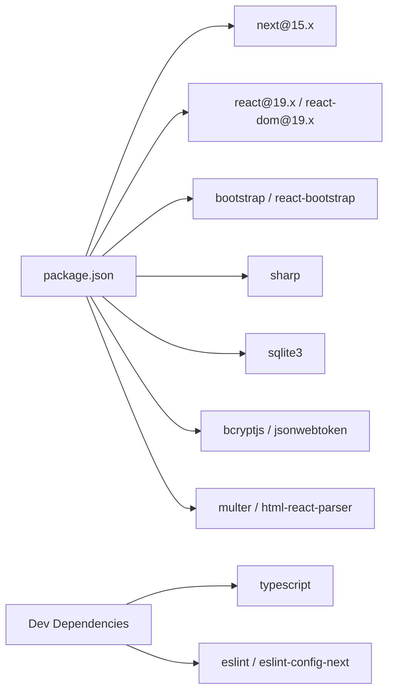

# Technology Stack

<cite>
**Referenced Files in This Document**
- [package.json](file://package.json)
- [next.config.mjs](file://next.config.mjs)
- [tsconfig.json](file://tsconfig.json)
- [eslint.config.mjs](file://eslint.config.mjs)
- [netlify.toml](file://netlify.toml)
- [.nvmrc](file://.nvmrc)
- [src/lib/database.ts](file://src/lib/database.ts)
- [src/lib/auth.ts](file://src/lib/auth.ts)
- [src/app/layout.tsx](file://src/app/layout.tsx)
- [src/app/page.tsx](file://src/app/page.tsx)
- [src/hooks/usePageMetadata.ts](file://src/hooks/usePageMetadata.ts)
- [src/hooks/useFilePageMetadata.ts](file://src/hooks/useFilePageMetadata.ts)
- [src/lib/image-tracker.ts](file://src/lib/image-tracker.ts)
- [src/lib/page-editor.ts](file://src/lib/page-editor.ts)
- [src/lib/enhanced-page-editor.ts](file://src/lib/enhanced-page-editor.ts)
</cite>

## Table of Contents
1. [Introduction](#introduction)
2. [Project Structure](#project-structure)
3. [Core Components](#core-components)
4. [Architecture Overview](#architecture-overview)
5. [Detailed Component Analysis](#detailed-component-analysis)
6. [Dependency Analysis](#dependency-analysis)
7. [Performance Considerations](#performance-considerations)
8. [Troubleshooting Guide](#troubleshooting-guide)
9. [Conclusion](#conclusion)
10. [Appendices](#appendices)

## Introduction
This document provides comprehensive technology stack documentation for attechglobal.com. It covers the primary framework (Next.js 15), UI library (React 19), type safety (TypeScript), and local database (SQLite3), alongside supporting technologies such as Sharp for image optimization, Bootstrap and React Bootstrap for responsive UI, bcryptjs and jsonwebtoken for authentication, and utility libraries for file handling and SEO. It explains rationale, version compatibility, integration patterns, configuration, development and production requirements, deployment considerations, upgrade paths, security, performance, and cross-platform compatibility.

## Project Structure
The project follows Next.js App Router conventions with:
- Application code under src/app
- Shared components under src/app/Components
- Utilities and libraries under src/lib
- Client-side hooks under src/hooks
- Build-time configuration via next.config.mjs, tsconfig.json, eslint.config.mjs
- Deployment configuration via netlify.toml and .nvmrc

**Diagram sources**
- [next.config.mjs](file://next.config.mjs#L1-L129)
- [tsconfig.json](file://tsconfig.json#L1-L39)
- [eslint.config.mjs](file://eslint.config.mjs#L1-L15)
- [.nvmrc](file://.nvmrc#L1-L2)
- [netlify.toml](file://netlify.toml#L1-L21)
- [src/lib/database.ts](file://src/lib/database.ts#L1-L255)

**Section sources**
- [package.json](file://package.json#L1-L41)
- [next.config.mjs](file://next.config.mjs#L1-L129)
- [tsconfig.json](file://tsconfig.json#L1-L39)
- [eslint.config.mjs](file://eslint.config.mjs#L1-L15)
- [netlify.toml](file://netlify.toml#L1-L21)
- [.nvmrc](file://.nvmrc#L1-L2)

## Core Components
- Next.js 15: Application framework and build system, with App Router, static export support, and image optimization.
- React 19: UI library powering components and hooks.
- TypeScript: Type checking and strictness configuration for safer development.
- SQLite3: Local relational database for images, blogs, and page metadata.
- Sharp: Image processing and optimization.
- Bootstrap + React Bootstrap: Responsive UI framework and React components.
- bcryptjs + jsonwebtoken: Authentication and sessionless token-based authorization.
- Utility libraries: Multer for uploads, html-react-parser for content rendering, slick-carousel for carousels.

**Section sources**
- [package.json](file://package.json#L12-L31)
- [next.config.mjs](file://next.config.mjs#L1-L129)
- [tsconfig.json](file://tsconfig.json#L1-L39)
- [src/lib/database.ts](file://src/lib/database.ts#L1-L255)
- [src/lib/auth.ts](file://src/lib/auth.ts#L1-L85)
- [src/app/layout.tsx](file://src/app/layout.tsx#L1-L47)

## Architecture Overview
The application uses a modular architecture:
- Frontend: Next.js App Router pages and components, styled with Bootstrap and React Bootstrap.
- Data Access: SQLite3-backed persistence with typed interfaces and helper functions.
- Authentication: JWT-based admin login with bcrypt password hashing.
- SEO and Metadata: Client hooks to fetch and manage per-route metadata via API endpoints.
- Image Management: Client-side image usage tracking and server-side APIs for image CRUD and usage logs.

**Diagram sources**
- [src/app/page.tsx](file://src/app/page.tsx#L1-L75)
- [src/hooks/usePageMetadata.ts](file://src/hooks/usePageMetadata.ts#L1-L218)
- [src/hooks/useFilePageMetadata.ts](file://src/hooks/useFilePageMetadata.ts#L1-L225)
- [src/lib/database.ts](file://src/lib/database.ts#L1-L255)
- [src/lib/auth.ts](file://src/lib/auth.ts#L1-L85)
- [src/lib/image-tracker.ts](file://src/lib/image-tracker.ts#L1-L95)
- [next.config.mjs](file://next.config.mjs#L1-L129)
- [tsconfig.json](file://tsconfig.json#L1-L39)
- [eslint.config.mjs](file://eslint.config.mjs#L1-L15)

## Detailed Component Analysis

### Next.js 15 App Router and Build Configuration
- App Router: Pages under src/app with nested groups and shared layouts.
- Static Export: Conditional output and trailingSlash toggles for cPanel export.
- Image Optimization: Remote patterns, formats, device sizes, and CSP for security.
- Linting: ESLint ignores during builds; Next.js core web vitals extended.
- Compiler: Console removal in production; compression enabled; header minimization.

**Diagram sources**
- [next.config.mjs](file://next.config.mjs#L1-L129)

**Section sources**
- [next.config.mjs](file://next.config.mjs#L1-L129)
- [eslint.config.mjs](file://eslint.config.mjs#L1-L15)
- [netlify.toml](file://netlify.toml#L1-L21)
- [.nvmrc](file://.nvmrc#L1-L2)

### React 19 and UI Layer
- Root layout injects global styles, fonts, and analytics.
- Components are organized under src/app/Components and composed in pages.
- Bootstrap and React Bootstrap provide responsive grid and components.

**Diagram sources**
- [src/app/layout.tsx](file://src/app/layout.tsx#L1-L47)
- [src/app/page.tsx](file://src/app/page.tsx#L1-L75)

**Section sources**
- [src/app/layout.tsx](file://src/app/layout.tsx#L1-L47)
- [src/app/page.tsx](file://src/app/page.tsx#L1-L75)

### TypeScript Configuration
- Target ES2017, modern module resolution, preserve JSX, path aliases.
- Strictness disabled; incremental builds enabled; isolated modules for fast builds.

**Section sources**
- [tsconfig.json](file://tsconfig.json#L1-L39)

### SQLite3 Local Database
- Centralized initialization, table creation, and helper functions for run/get/all queries.
- Typed interfaces for images, blogs, and page metadata.
- Automatic directory creation and lazy initialization.

**Diagram sources**
- [src/lib/database.ts](file://src/lib/database.ts#L1-L255)

**Section sources**
- [src/lib/database.ts](file://src/lib/database.ts#L1-L255)

### Authentication and Authorization
- Admin login with bcrypt password hashing and JWT token generation/verification.
- Token stored client-side for protected admin endpoints.
- Role-based checks for admin privileges.

**Diagram sources**
- [src/lib/auth.ts](file://src/lib/auth.ts#L1-L85)

**Section sources**
- [src/lib/auth.ts](file://src/lib/auth.ts#L1-L85)

### SEO Metadata Management
- Client hooks fetch, list, create, and update page metadata via API endpoints.
- Pagination and search supported for listing endpoints.
- Dedicated hooks for file-based metadata.

**Diagram sources**
- [src/hooks/usePageMetadata.ts](file://src/hooks/usePageMetadata.ts#L1-L218)
- [src/hooks/useFilePageMetadata.ts](file://src/hooks/useFilePageMetadata.ts#L1-L225)
- [src/lib/database.ts](file://src/lib/database.ts#L1-L255)

**Section sources**
- [src/hooks/usePageMetadata.ts](file://src/hooks/usePageMetadata.ts#L1-L218)
- [src/hooks/useFilePageMetadata.ts](file://src/hooks/useFilePageMetadata.ts#L1-L225)

### Image Usage Tracking
- Client-side scanning of images on a page and logging usage against the database.
- Supports automatic tracking with a component wrapper and a React hook.

**Diagram sources**
- [src/lib/image-tracker.ts](file://src/lib/image-tracker.ts#L1-L95)

**Section sources**
- [src/lib/image-tracker.ts](file://src/lib/image-tracker.ts#L1-L95)

### Page Editor Utilities
- PageEditor and EnhancedPageEditor parse page files to extract editable components and update content.
- Enhanced editor categorizes content (text/title/description/link/image) and preserves context.

**Diagram sources**
- [src/lib/page-editor.ts](file://src/lib/page-editor.ts#L1-L194)
- [src/lib/enhanced-page-editor.ts](file://src/lib/enhanced-page-editor.ts#L1-L287)

**Section sources**
- [src/lib/page-editor.ts](file://src/lib/page-editor.ts#L1-L194)
- [src/lib/enhanced-page-editor.ts](file://src/lib/enhanced-page-editor.ts#L1-L287)

## Dependency Analysis
- Runtime dependencies include Next.js 15, React 19, Bootstrap, React Bootstrap, Sharp, sqlite3, bcryptjs, jsonwebtoken, multer, and html-react-parser.
- Dev dependencies include TypeScript, ESLint, and Next.js ESLint config.
- Environment pinning via .nvmrc and Netlify configuration.

**Diagram sources**
- [package.json](file://package.json#L12-L39)

**Section sources**
- [package.json](file://package.json#L12-L39)
- [.nvmrc](file://.nvmrc#L1-L2)
- [netlify.toml](file://netlify.toml#L5-L6)

## Performance Considerations
- Image optimization: Configure device sizes, formats, and remote patterns to reduce payload and improve Core Web Vitals.
- Static export: Use cPanel export mode for simpler hosting; ensure images are unoptimized and trailing slashes are enabled.
- Production builds: Remove console logs, enable compression, and disable unnecessary headers.
- Incremental TypeScript builds and isolated modules to speed up development.

**Section sources**
- [next.config.mjs](file://next.config.mjs#L10-L129)
- [tsconfig.json](file://tsconfig.json#L11-L24)

## Troubleshooting Guide
- Database initialization errors: Ensure the data directory exists and the database file is writable.
- Authentication failures: Verify JWT secret environment variable and bcrypt rounds.
- API metadata errors: Confirm API routes are reachable and SQLite tables exist.
- Image tracking warnings: Network errors or missing tokens will prevent usage logs.

**Section sources**
- [src/lib/database.ts](file://src/lib/database.ts#L84-L97)
- [src/lib/auth.ts](file://src/lib/auth.ts#L11-L59)
- [src/hooks/usePageMetadata.ts](file://src/hooks/usePageMetadata.ts#L18-L52)
- [src/lib/image-tracker.ts](file://src/lib/image-tracker.ts#L40-L43)

## Conclusion
The attechglobal.com stack combines Next.js 15, React 19, and TypeScript with a pragmatic SQLite3 backend, Sharp for images, and Bootstrap/React Bootstrap for UI. Authentication relies on bcrypt and JWT. The configuration supports both static export and API-driven deployments, with performance and security tuned via Next.js settings. The provided libraries and hooks enable robust SEO metadata management, image usage tracking, and page editing capabilities.

## Appendices

### Version Compatibility and Upgrade Paths
- Next.js 15.x: Align ESLint and TypeScript versions with Next’s recommended versions.
- React 19.x: Ensure hooks and concurrent features are compatible; test Suspense boundaries.
- TypeScript 5.x: Keep target and module resolution aligned with Next’s expectations.
- SQLite3: Maintain Node binding compatibility; prefer prebuilt binaries for CI/CD.
- Sharp: Keep versions aligned with Node.js LTS; verify platform-specific builds.
- Bootstrap/React Bootstrap: Upgrade cautiously; verify CSS and component behavior.

**Section sources**
- [package.json](file://package.json#L23-L38)
- [.nvmrc](file://.nvmrc#L1-L2)

### Security Considerations
- Environment variables: Store JWT_SECRET and sensitive configuration in environment variables.
- CSP: Restrict script execution and enforce secure defaults for images.
- Input validation: Sanitize metadata and uploaded content; validate image uploads.
- Authentication: Enforce HTTPS in production; rotate secrets; limit token expiration.

**Section sources**
- [src/lib/auth.ts](file://src/lib/auth.ts#L11-L59)
- [next.config.mjs](file://next.config.mjs#L111-L112)

### Deployment Considerations
- Netlify: Node 20, static export with redirects to index.html for SPA routing.
- cPanel export: Enable static export and unoptimized images; trailing slashes required.
- Local hosting: Use next start with NODE_ENV production; ensure data directory permissions.

**Section sources**
- [netlify.toml](file://netlify.toml#L1-L21)
- [next.config.mjs](file://next.config.mjs#L3-L12)

### Cross-Platform Compatibility
- Use Node 20 via .nvmrc for consistent local and CI environments.
- SQLite3 requires native bindings; ensure platform-specific builds in CI.
- Sharp supports multiple platforms; prebuilt binaries recommended for Windows/macOS/Linux.

**Section sources**
- [.nvmrc](file://.nvmrc#L1-L2)
- [package.json](file://package.json#L28-L30)