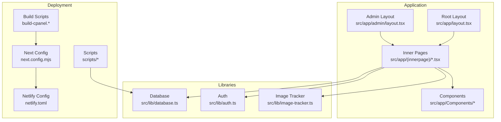
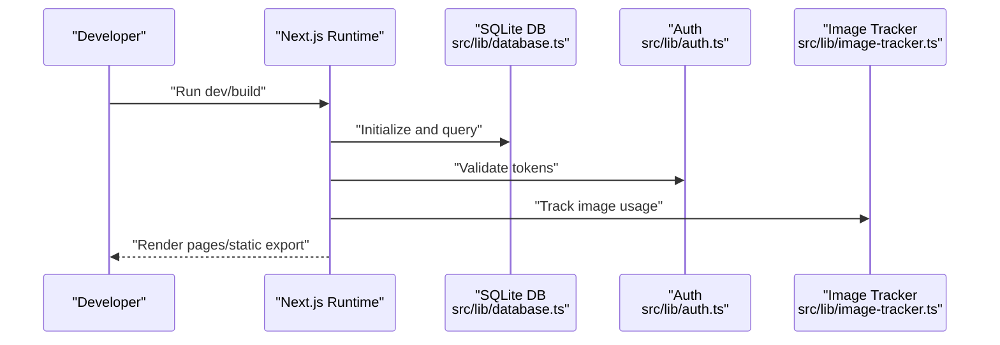
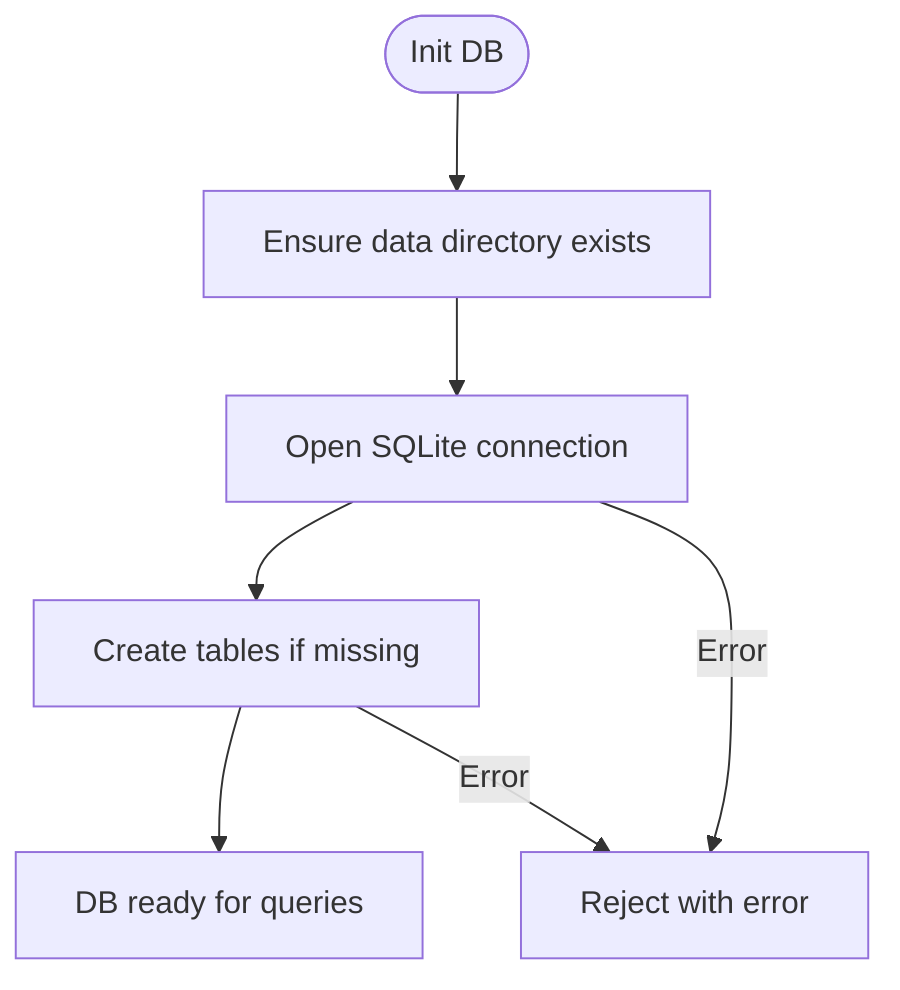
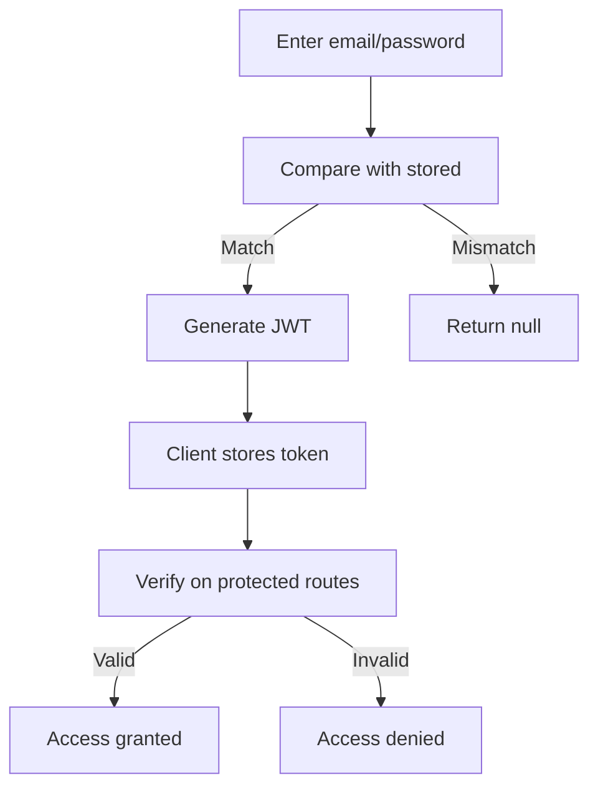
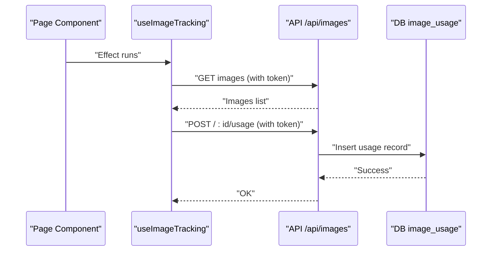
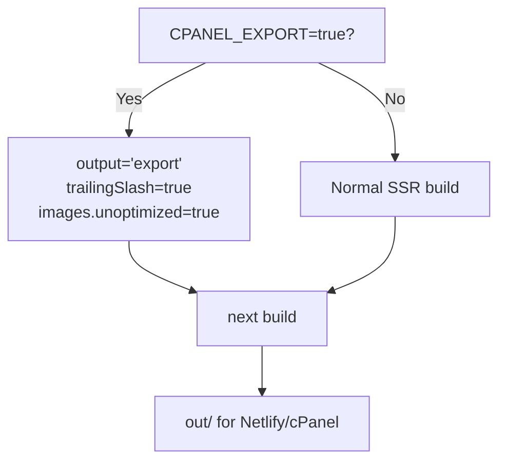
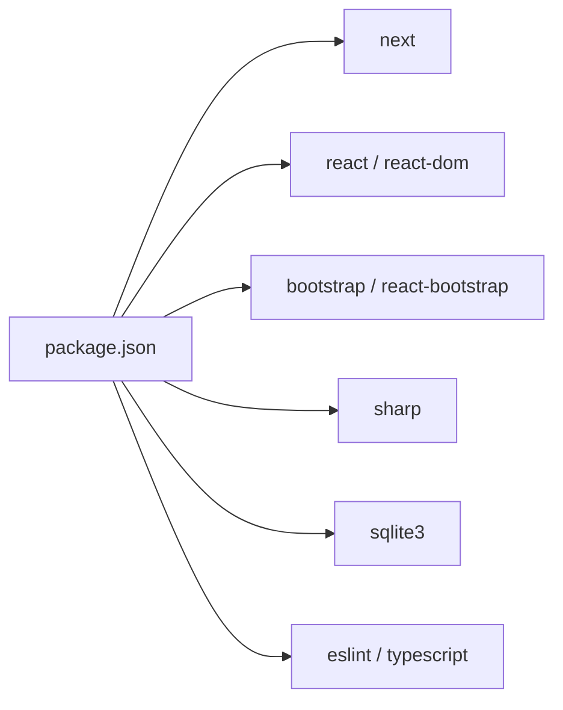

# Troubleshooting Guide

<cite>
**Referenced Files in This Document**
- [package.json](file://package.json)
- [next.config.mjs](file://next.config.mjs)
- [netlify.toml](file://netlify.toml)
- [README.md](file://README.md)
- [scripts/init-database.js](file://scripts/init-database.js)
- [src/lib/database.ts](file://src/lib/database.ts)
- [src/lib/auth.ts](file://src/lib/auth.ts)
- [src/lib/image-tracker.ts](file://src/lib/image-tracker.ts)
- [src/app/layout.tsx](file://src/app/layout.tsx)
- [src/app/admin/layout.tsx](file://src/app/admin/layout.tsx)
- [src/app/(innerpage)/about/page.tsx](file://src/app/(innerpage)/about/page.tsx)
- [src/app/(innerpage)/blog/page.tsx](file://src/app/(innerpage)/blog/page.tsx)
- [build-cpanel.sh](file://build-cpanel.sh)
- [build-cpanel.ps1](file://build-cpanel.ps1)
- [debug-seo.js](file://debug-seo.js)
</cite>

## Table of Contents
1. [Introduction](#introduction)
2. [Project Structure](#project-structure)
3. [Core Components](#core-components)
4. [Architecture Overview](#architecture-overview)
5. [Detailed Component Analysis](#detailed-component-analysis)
6. [Dependency Analysis](#dependency-analysis)
7. [Performance Considerations](#performance-considerations)
8. [Troubleshooting Guide](#troubleshooting-guide)
9. [Conclusion](#conclusion)
10. [Appendices](#appendices)

## Introduction
This guide provides a comprehensive troubleshooting resource for attechglobal.com development and operations. It covers build failures, database connectivity, authentication issues, image processing problems, Next.js routing and API endpoint failures, component rendering issues, SEO optimization, deployment failures, and performance bottlenecks. It also documents diagnostic tools, scripts, platform-specific considerations for Windows and Unix systems, environment configuration, and preventive measures.

## Project Structure
The project is a Next.js 15 application configured for both standard server-side rendering and static export for cPanel deployments. It includes:
- Application pages under src/app
- Admin area under src/app/admin
- Shared components under src/app/Components
- Libraries for database, authentication, image tracking, and SEO utilities under src/lib
- Build scripts for cPanel under build-cpanel.*
- Scripts for database initialization and SEO checks under scripts/*
- Deployment configuration for Netlify via netlify.toml

**Diagram sources**
- [src/app/layout.tsx](file://src/app/layout.tsx#L1-L47)
- [src/app/admin/layout.tsx](file://src/app/admin/layout.tsx#L1-L23)
- [src/lib/database.ts](file://src/lib/database.ts#L1-L255)
- [src/lib/auth.ts](file://src/lib/auth.ts#L1-L85)
- [src/lib/image-tracker.ts](file://src/lib/image-tracker.ts#L1-L95)
- [next.config.mjs](file://next.config.mjs#L1-L129)
- [netlify.toml](file://netlify.toml#L1-L21)
- [build-cpanel.sh](file://build-cpanel.sh)
- [build-cpanel.ps1](file://build-cpanel.ps1)
- [scripts/init-database.js](file://scripts/init-database.js#L1-L120)

**Section sources**
- [README.md](file://README.md#L1-L37)
- [next.config.mjs](file://next.config.mjs#L1-L129)
- [netlify.toml](file://netlify.toml#L1-L21)

## Core Components
- Database layer: SQLite-backed image and page metadata storage with initialization and CRUD helpers.
- Authentication: JWT-based admin login with bcrypt password hashing.
- Image tracking: Client-side scanning and usage logging for SEO and asset governance.
- Next.js configuration: Conditional static export, image optimization, and CSP policies.
- Deployment: Netlify static export with redirects and security headers; cPanel build scripts.

**Section sources**
- [src/lib/database.ts](file://src/lib/database.ts#L1-L255)
- [src/lib/auth.ts](file://src/lib/auth.ts#L1-L85)
- [src/lib/image-tracker.ts](file://src/lib/image-tracker.ts#L1-L95)
- [next.config.mjs](file://next.config.mjs#L1-L129)
- [netlify.toml](file://netlify.toml#L1-L21)

## Architecture Overview
The system integrates client-side rendering with server-side APIs and static export. The admin area depends on authentication and database access. Image tracking augments SEO by recording usage across pages. Deployment targets include Netlify and cPanel environments with distinct build and runtime configurations.

**Diagram sources**
- [src/lib/database.ts](file://src/lib/database.ts#L84-L184)
- [src/lib/auth.ts](file://src/lib/auth.ts#L35-L79)
- [src/lib/image-tracker.ts](file://src/lib/image-tracker.ts#L11-L43)
- [next.config.mjs](file://next.config.mjs#L1-L129)

## Detailed Component Analysis

### Database Layer
- Purpose: Manage images, image usage, blogs, and page metadata.
- Initialization: Creates tables and ensures data directory exists.
- Accessors: Promisified run/get/all helpers for queries.
- Error handling: Throws when uninitialized; logs and rejects on DB errors.

**Diagram sources**
- [src/lib/database.ts](file://src/lib/database.ts#L84-L184)
- [scripts/init-database.js](file://scripts/init-database.js#L15-L92)

**Section sources**
- [src/lib/database.ts](file://src/lib/database.ts#L1-L255)
- [scripts/init-database.js](file://scripts/init-database.js#L1-L120)

### Authentication System
- Credentials: Hardcoded admin credentials for demo; JWT secret sourced from environment.
- Functions: Password hashing, token generation/verification, admin check.
- Security: JWT expiration set; keep JWT_SECRET secure in production.

**Diagram sources**
- [src/lib/auth.ts](file://src/lib/auth.ts#L62-L79)

**Section sources**
- [src/lib/auth.ts](file://src/lib/auth.ts#L1-L85)

### Image Tracking Utility
- Client-side scanning: Finds images on a page and tracks usage via API.
- API integration: Requires admin token; posts usage records.
- Hook-based: React hook scans after render with a small delay.

**Diagram sources**
- [src/lib/image-tracker.ts](file://src/lib/image-tracker.ts#L46-L80)

**Section sources**
- [src/lib/image-tracker.ts](file://src/lib/image-tracker.ts#L1-L95)

### Next.js Configuration and Deployment
- Static export for cPanel: Controlled by CPANEL_EXPORT environment variable.
- Image optimization: Unoptimized for static export; CSP and formats configured.
- Netlify export: Redirects all routes to index.html for SPA routing.

**Diagram sources**
- [next.config.mjs](file://next.config.mjs#L2-L12)
- [netlify.toml](file://netlify.toml#L1-L21)

**Section sources**
- [next.config.mjs](file://next.config.mjs#L1-L129)
- [netlify.toml](file://netlify.toml#L1-L21)

## Dependency Analysis
- Core dependencies include Next.js, React, Bootstrap, sharp, sqlite3, and related type packages.
- Dev dependencies include ESLint and TypeScript tooling.
- Build scripts toggle CPANEL_EXPORT to switch between SSR and static export modes.

**Diagram sources**
- [package.json](file://package.json#L12-L39)

**Section sources**
- [package.json](file://package.json#L1-L41)

## Performance Considerations
- Console removal in production reduces bundle size and noise.
- Compression enabled globally.
- Image optimization enabled with WebP/AVIF and device sizes tailored for modern devices.
- CSP restricts inline scripts and sandboxes to mitigate XSS risks.

**Section sources**
- [next.config.mjs](file://next.config.mjs#L120-L126)

## Troubleshooting Guide

### Build Failures
Symptoms:
- Build fails locally or on CI/CD with static export mismatch.
- Missing out/ directory or Netlify deployment errors.

Common causes and fixes:
- Static export mismatch: Ensure CPANEL_EXPORT is set appropriately for target environment.
  - For cPanel static export, use the cPanel build script.
  - For Netlify, rely on netlify.toml build command.
- Node version mismatch: Netlify requires a specific Node version; align local Node to match.
- Missing dependencies: Run install before build.

Diagnostic steps:
- Verify environment variable for cPanel export.
- Confirm next.config.mjs output mode matches deployment target.
- Check netlify.toml for correct publish directory and redirect rules.

**Section sources**
- [next.config.mjs](file://next.config.mjs#L2-L12)
- [netlify.toml](file://netlify.toml#L1-L21)
- [build-cpanel.sh](file://build-cpanel.sh)
- [build-cpanel.ps1](file://build-cpanel.ps1)

### Database Connection Errors
Symptoms:
- Cannot connect to images.db.
- Tables not created or empty.

Common causes and fixes:
- Data directory missing: Ensure data directory exists before connecting.
- Permission issues: Run with appropriate filesystem permissions.
- Initialization not executed: Run the initialization script before starting the app.

Diagnostic steps:
- Confirm data directory exists and is writable.
- Run initialization script to create tables.
- Check database connection logs and error messages.

**Section sources**
- [src/lib/database.ts](file://src/lib/database.ts#L9-L13)
- [scripts/init-database.js](file://scripts/init-database.js#L8-L12)

### Authentication Issues
Symptoms:
- Admin login fails.
- JWT token invalid or expired.
- Protected routes inaccessible.

Common causes and fixes:
- Incorrect credentials: Use the admin credentials defined in the auth module.
- Missing JWT_SECRET: Set JWT_SECRET in environment.
- Token not stored or cleared: Ensure token persists in admin session.

Diagnostic steps:
- Verify credentials and secret.
- Check token validity and expiration.
- Review auth flow in admin area.

**Section sources**
- [src/lib/auth.ts](file://src/lib/auth.ts#L5-L9)
- [src/lib/auth.ts](file://src/lib/auth.ts#L11)
- [src/app/admin/layout.tsx](file://src/app/admin/layout.tsx#L1-L23)

### Image Processing Problems
Symptoms:
- Images not optimized or served.
- Static export serving optimized images fails.

Common causes and fixes:
- Static export requires unoptimized images: Ensure images.unoptimized is true for cPanel export.
- Image domains/patterns missing: Add domains to next.config.mjs if serving external images.
- Image tracker not firing: Ensure admin token is present and API endpoints reachable.

Diagnostic steps:
- Confirm CPANEL_EXPORT setting and next.config.mjs images config.
- Verify image domains and remote patterns.
- Test image tracker API calls with token.

**Section sources**
- [next.config.mjs](file://next.config.mjs#L10-L112)
- [src/lib/image-tracker.ts](file://src/lib/image-tracker.ts#L14-L39)

### Next.js Routing Issues
Symptoms:
- 404 on client-side navigation after static export.
- SPA routing not working on Netlify.

Common causes and fixes:
- Missing redirects: Netlify requires a wildcard redirect to index.html for client-side routing.
- Trailing slash mismatch: Ensure trailingSlash aligns with deployment expectations.

Diagnostic steps:
- Confirm netlify.toml redirects.
- Align trailingSlash with deployment target.

**Section sources**
- [netlify.toml](file://netlify.toml#L8-L12)
- [next.config.mjs](file://next.config.mjs#L8-L9)

### API Endpoint Failures
Symptoms:
- Admin API requests fail.
- Image usage tracking returns errors.

Common causes and fixes:
- Missing Authorization header: Ensure admin token is included.
- Database not initialized: Initialize database before calling APIs.
- CORS or CSP blocking: Review CSP and headers.

Diagnostic steps:
- Verify token presence and validity.
- Confirm database readiness.
- Inspect network tab for 4xx/5xx responses.

**Section sources**
- [src/lib/image-tracker.ts](file://src/lib/image-tracker.ts#L14-L39)
- [src/lib/database.ts](file://src/lib/database.ts#L84-L96)

### Component Rendering Problems
Symptoms:
- Components not rendering in admin area.
- Layout issues in root or inner pages.

Common causes and fixes:
- Missing client directive: Admin layout requires client usage.
- Font/link assets missing: Ensure global styles and fonts are loaded.
- Component dependencies: Verify Bootstrap and SASS imports.

Diagnostic steps:
- Confirm client wrapper usage.
- Check asset loading in root layout.
- Validate component imports.

**Section sources**
- [src/app/admin/layout.tsx](file://src/app/admin/layout.tsx#L1-L23)
- [src/app/layout.tsx](file://src/app/layout.tsx#L1-L47)

### SEO Optimization Issues
Symptoms:
- Missing structured data or metadata.
- Social previews incorrect.

Common causes and fixes:
- Metadata not applied: Ensure metadata export in pages.
- Structured data not injected: Verify script injection in page.
- Canonical/OG/Twitter tags: Confirm values and URLs.

Diagnostic steps:
- Inspect page metadata exports.
- Validate structured data JSON-LD.
- Use SEO debugging utility.

**Section sources**
- [src/app/(innerpage)/about/page.tsx](file://src/app/(innerpage)/about/page.tsx#L11-L60)

### Deployment Failures
Symptoms:
- Netlify build fails.
- cPanel static export missing assets.

Common causes and fixes:
- Wrong publish directory: Ensure out/ is published.
- Missing redirects: Add wildcard redirect to index.html.
- Build command mismatch: Use npm run build.

Diagnostic steps:
- Confirm netlify.toml build and publish.
- Validate cPanel build script sets CPANEL_EXPORT.
- Check static export completeness.

**Section sources**
- [netlify.toml](file://netlify.toml#L1-L21)
- [build-cpanel.sh](file://build-cpanel.sh)
- [build-cpanel.ps1](file://build-cpanel.ps1)

### Performance Bottlenecks
Symptoms:
- Slow builds or dev server.
- Large payload sizes.

Common causes and fixes:
- Console logs in production: Enabled removal of console statements.
- Compression: Enabled gzip compression.
- Image formats: Enable WebP/AVIF and appropriate sizes.

Diagnostic steps:
- Review build logs for warnings.
- Audit bundle size and image sizes.
- Enable compression and image optimization.

**Section sources**
- [next.config.mjs](file://next.config.mjs#L120-L126)

### Platform-Specific Issues
Windows:
- Use PowerShell script for cPanel build.
- Ensure environment variables are set in shell profile.

Unix/Linux/macOS:
- Use shell script for cPanel build.
- Verify executable permissions on scripts.

Dependency conflicts:
- Align Node version with Netlify requirement.
- Reinstall dependencies if native modules fail (sqlite3/sharp).

Environment configuration:
- Set CPANEL_EXPORT for static export builds.
- Set JWT_SECRET for authentication.

**Section sources**
- [build-cpanel.ps1](file://build-cpanel.ps1)
- [build-cpanel.sh](file://build-cpanel.sh)
- [netlify.toml](file://netlify.toml#L5-L6)
- [src/lib/auth.ts](file://src/lib/auth.ts#L11)

### Diagnostic Tools and Scripts
- Database health check: Run initialization script to verify DB creation and connectivity.
- SEO debugging utility: Use the provided SEO debugging script to validate page metadata and structured data.
- Build verification: Use cPanel build scripts to validate static export configuration.

Practical steps:
- Initialize database before starting dev server.
- Run SEO script against target pages.
- Execute cPanel build to confirm static export.

**Section sources**
- [scripts/init-database.js](file://scripts/init-database.js#L94-L119)
- [debug-seo.js](file://debug-seo.js)

### Preventive Measures and Best Practices
- Keep JWT_SECRET secret and rotate regularly.
- Use environment variables for secrets and flags.
- Validate image domains and remote patterns before export.
- Monitor build logs for missing assets or misconfigured redirects.
- Regularly audit database tables and usage records.

### Error Codes and Log Analysis
Common categories:
- Database errors: Initialization failures, missing tables, permission denied.
- Auth errors: Invalid token, expired token, missing credentials.
- Image errors: Fetch failures, missing tokens, blocked by CSP.
- Build errors: Missing environment variables, wrong Node version, misconfigured export.

Log analysis tips:
- Filter console output by module (database, auth, image-tracker).
- Check network tab for failed API calls and 4xx/5xx responses.
- Validate CSP violations in browser console.

### Escalation Procedures
- For persistent build failures, capture full logs and compare with CI/CD environment.
- For database corruption, back up data directory and re-run initialization.
- For authentication escalations, reset JWT_SECRET and re-provision tokens.
- For image processing escalations, validate sharp compatibility and image formats.